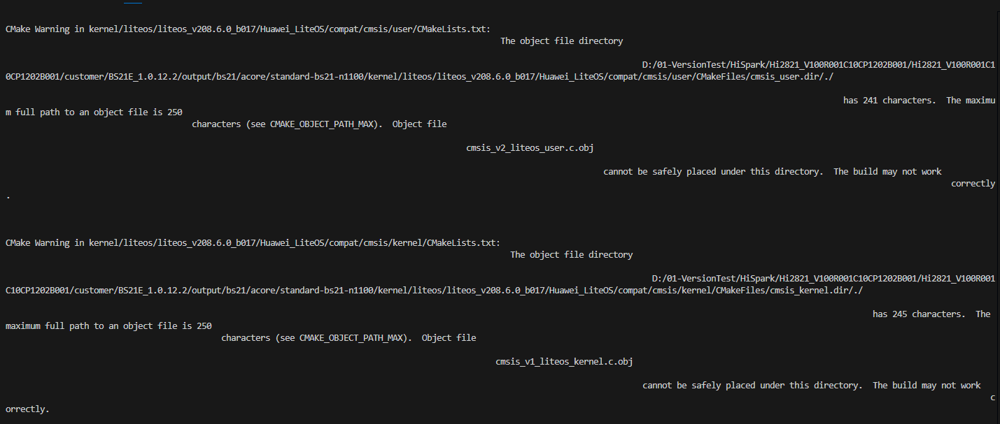
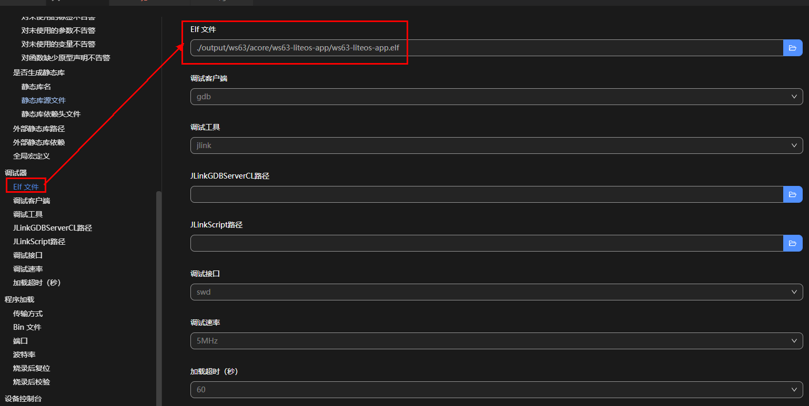
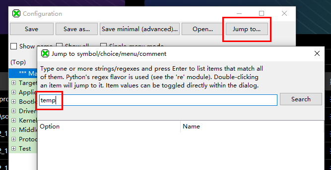
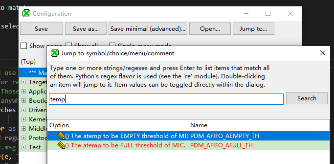
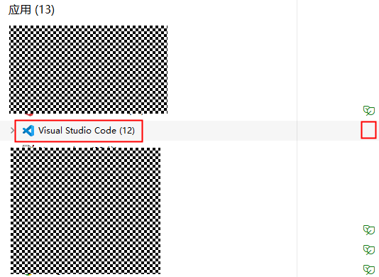

# 编译与环境

本页收集编译与环境搭建过程中常见的报错与解决方案。

!!! warning "前置检查：避免中文路径"
    请确保：SDK (Software Development Kit) 源码存放路径、工具链安装路径中均不包含中文

---

## SDK 根目录路径过长

SDK 存放路径过长时，编译时相关文件无法找到，或编译过程中一直循环某些打印信息而不执行具体编译内容。



!!! tip "原因"
    Windows 10 和 Windows 11 下路径存在 **260 Byte 的长度限制**。

**解决方案：** 将 SDK 代码放到盘符的根目录，或缩短 SDK 存放路径。

---

## 路径失效（调试 / 栈分析 / 镜像分析）

导入工程路径问题导致的调试、栈分析、镜像分析等默认路径失效。

**解决方案：** 修改默认的 `debug_elf` 路径。



---

## 编译报错「Kconfig header saved to XXX」

编译报错 `Kconfig header saved to XXX`，并在 SDK 根目录下的 `build.log` 文件中搜索 `error` 出现类似 `FAILED：xxx.c  ccache` 的字段。


**解决方案：** 在工具链目录下的 `tools/cfbb/thirdparty/ccache` 目录中执行以下命令清除缓存：

```bash
ccache.exe -s
```

---

## Kconfig 搜索报错「NameError: name 're' is not defined」

打开 Kconfig 后，单击「Jump to...」按钮，在弹框中搜索相关内容时出现异常打印。




**解决方案：修改 `guiconfig.py` 文件。**

在调用 `re` 模块前添加 `import re`。


添加代码后即可正常搜索。



---

## 编译报错「Invalid argument」

编译过程中报错 `Invalid argument`。


!!! tip "原因"
    解析 elf 时没有管理员权限。

**解决方案：** 用管理员权限打开 VS Code 再次进行编译。

---

## 工程编译慢的问题

编译速度慢通常由以下三类原因引起，可逐一排查。

### 可能原因一：Microsoft PC Manager Service 占用 CPU 过高

结束或禁用该进程可加快工程编译速度。


### 可能原因二：Antimalware Service Executable 实时扫描

Antimalware Service Executable 是 Windows 安全进程，会执行针对恶意软件的实时保护，编译时会扫描整个工程目录导致 CPU 占用率过高。将其扫描排除工程目录即可：

1. 打开 Windows 安全中心，点击「病毒和威胁防护」。

    

2. 点击「病毒和威胁防护」设置下的「管理设置」，下滑找到「排除项」，点击「添加或删除排除项」。

    

    

3. 在「排除项」中添加要编译的工程目录。

    

### 可能原因三：VS Code 处于效率模式

1. 查看是否处于效率模式：资源管理器中状态有「叶子」标志说明处于效率模式。

    

2. 找到 VS Code 的快捷方式，右键进入属性，在「目标」栏后面加上一个英文空格，再添加以下字段：

    ```
    --disable-features=UseEcoQoSForBackgroundProcess
    ```

    

3. 再次打开资源管理器，效率模式解除。

    
