# 编译

本页收集编译与环境搭建过程中常见的报错与解决方案，涵盖 SDK 路径、工具链（Ninja / CMake / ccache / 工具链）、HiSpark Studio 编译、串口等问题。

!!! warning "前置检查：避免中文路径"
    请确保：SDK (Software Development Kit) 源码存放路径、工具链安装路径、Windows 用户名路径中均**不包含中文**。如果用户名包含中文路径，请参考 **HiSpark Studio 工具下载及安装** 说明进行处理。

    下述各问题中，多类编译报错（flashboot 失败、CMake/Ninja 找不到、ccache 权限拒绝等）都与中文路径有关，请优先排除该因素。

---

## 文件夹名称带空格导致编译报错

问题描述：【WS63】编译报 subprocess.Popen 失败错误，错误信息如下：

```batch
cmd.exe /C "cd /D "C:\WORK\ws3863\WS63 1.10.101
est_sdk\sdk\output\ws63\acore\ws63-liteos-app" && "C:\WORK\ws3863\WS63
1.10.101\DevTools_CFBB_V1.0.12 hirdparty\python\python.exe"
"C:/WORK/ws3863/WS63 1.10.101/test_sdk/sdk/build/script/utils/elftodu.py"
"C:/WORK/ws3863/WS63 1.10.101/test_sdk/sdk" ws63-liteos-app.elf
"C:/WORK/ws3863/WS63
1.10.101/test_sdk/sdk/tools/bin/compiler/riscv/cc_riscv32_musl_100/cc_riscv32_musl
_fp_win/bin/riscv32-linux-musl-nm.exe" > ws63-liteos-app.du &&
"C:\WORK\ws3863\WS63 1.10.101\DevTools_CFBB_V1.0.12
hirdparty\python\python.exe" "C:/WORK/ws3863/WS63
1.10.101/test_sdk/sdk/build/script/utils/mem_stats.py" ws63-liteos-app.lst ws63-
liteos-app.du "C:/WORK/ws3863/WS63
1.10.101/test_sdk/sdk/output/ws63/acore/ws63-liteos-app/linker.lds" ws63 > ws63-
liteos-app.mem"
Traceback (most recent call last):
Traceback (most recent call last):
File "C:\WORK\ws3863\WS63 1.10.101 est_sdk\sdk\build\script\utils\elftodu.py", line 33, in
p = subprocess.Popen(
File "subprocess.py", line 951, in __init____
File "subprocess.py", line 1420, in _execute_child
OSError: [WinError 193] %1 不是有效的 Win32 应用程序。
ninja: build stopped: subcommand failed.
```

**解决方案：**

通过分析 subprocess.Popen 的报错，确认是 SDK 的路径，WS63 1.10.101 est_sdk 目录带空格，导致 subprocess.Popen 失败；SDK 的路径中不能包含空格。

修改 SDK 目录，去掉目录中的空格（目录 WS63 1.10.101 est_sdk 改为 WS63_1.10.101_est_sdk），编译成功。

---

## SDK 根目录路径过长

SDK 存放路径过长时，编译时相关文件无法找到，或编译过程中一直循环某些打印信息而不执行具体编译内容。


!!! tip "原因"
    Windows 10 和 Windows 11 下路径存在 **260 Byte 的长度限制**。

**解决方案：** 将 SDK 代码放到盘符的根目录，或缩短 SDK 存放路径。

---

## 编译报错「Kconfig header saved to XXX」

编译报错 `Kconfig header saved to XXX`，并在 SDK 根目录下的 `build.log` 文件中搜索 `error` 出现类似 `FAILED：xxx.c  ccache` 的字段。

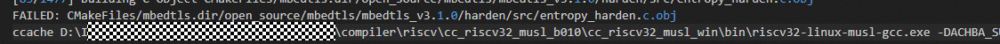

**解决方案：** 在工具链目录下的 `tools/cfbb/thirdparty/ccache` 目录中执行以下命令清除缓存：

```bash
ccache.exe -s
```

---

## Kconfig 搜索报错「NameError: name 're' is not defined」

打开 Kconfig 后，单击「Jump to...」按钮，在弹框中搜索相关内容时出现异常打印。


**解决方案：修改 `guiconfig.py` 文件。**

在调用 `re` 模块前添加 `import re`。


添加代码后即可正常搜索。


---

## 编译报错「Invalid argument」

编译过程中报错 `Invalid argument`。


!!! tip "原因"
    解析 elf 时没有管理员权限。

**解决方案：** 用管理员权限打开 VS Code 再次进行编译。

---

## 编译报错「ninja: build stopped; subcommand failed flashboot」

如果在编译的过程中，出现如下报错 `ninja: build stopped; subcommand failed flashboot start build` 等字段，代表 flashboot 编译失败，报错信息如下：

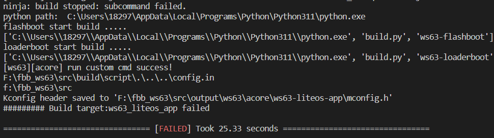

**解决方案地址：** <https://developers.hisilicon.com/postDetail?tid=0209181900878320012>

---

## 编译报错「no module named _curses」

如果在编译的过程中，出现如下报错 `no module named "_curses"`：

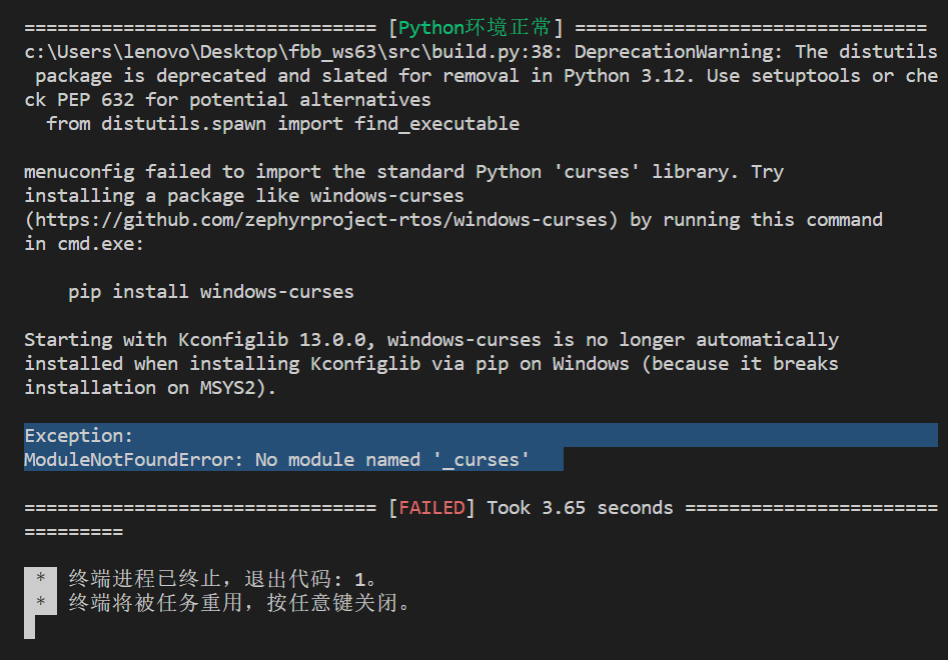

**解决方案地址：** <https://developers.hisilicon.com/postDetail?tid=0209181900935571013>

---

## CMake Error 无法找到 Ninja，CMAKE_MAKE_PROGRAM is not set

如果在编译的过程中，出现如下报错 `CMake Error: CMake was unable to find a build program corresponding to "Ninja". CMAKE_MAKE_PROGRAM is not set. You probably need to select a different build tool.` 等字段，代表 Ninja 没有加到环境变量，报错信息如下：

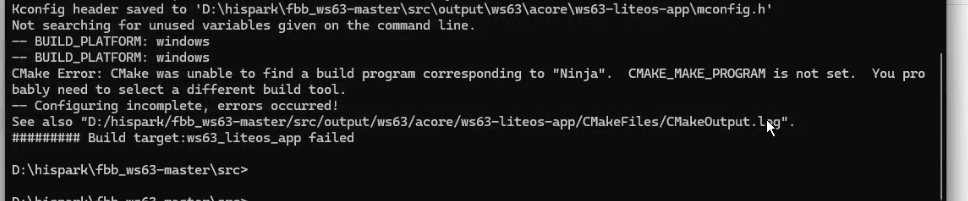

**解决方案地址：** <https://developers.hisilicon.com/postDetail?tid=0201181901124650017>

---

## ccache: Failed to create directory ... Permission denied

如果在编译的过程中，出现如下报错 `ccache: Failed to create directory c:\users\乱码\AppData\Local\ccache/tmp: Permission denied.` 等字段，代表没有权限创建文件，报错信息如下：

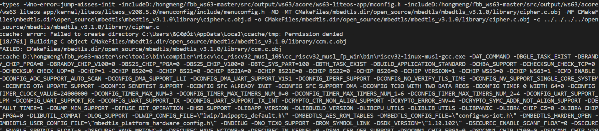

**解决方案地址：** <https://developers.hisilicon.com/postDetail?tid=02119181901255374012>

---

## ModuleNotFoundError: No module named 'utils.build_utils'

在编译过程中遇到如下报错出现 `ModuleNotFoundError: No module named 'utils.build_utils'`：

```
================================ [CLEAN SUCCESS] Took 0.00 seconds ================================
================================ [Python环境正常] ================================
Traceback (most recent call last):
  File "d:\hispark\fbb_ws63\src\build.py", line 45, in <module>
    from cmake_builder import CMakeBuilder
  File "D:\hispark\fbb_ws63\src\build\script\cmake_builder.py", line 10, in <module>
    from utils.build_utils import exec_shell, root_path, output_root, sdk_output_path, pkg_tools_path
ModuleNotFoundError: No module named 'utils.build_utils'
================================ [FAILED] Took 1.56 seconds ================================
```

**解决方案地址：** <https://developers.hisilicon.com/postDetail?tid=0208181902347364013>

---

## riscv-linux-musl-gcc.exe: error: createprocess: no such file or directory

编译过程中报 `riscv-linux-musl-gcc.exe: error: createprocess: no such file or directory` 等字样：

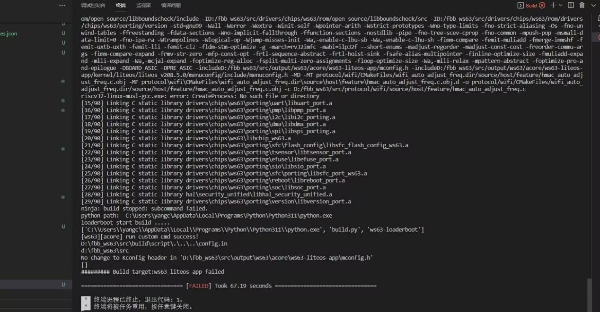

**解决方案地址：** <https://developers.hisilicon.com/postDetail?tid=0201181904724307018>

---

## HiSparkStudio 打开系统配置时报 no module named 'kconfiglib'

HiSparkStudio 在编译过程，插件已经安装，但是打开系统配置时，报 `no module named 'kconfiglib'`：

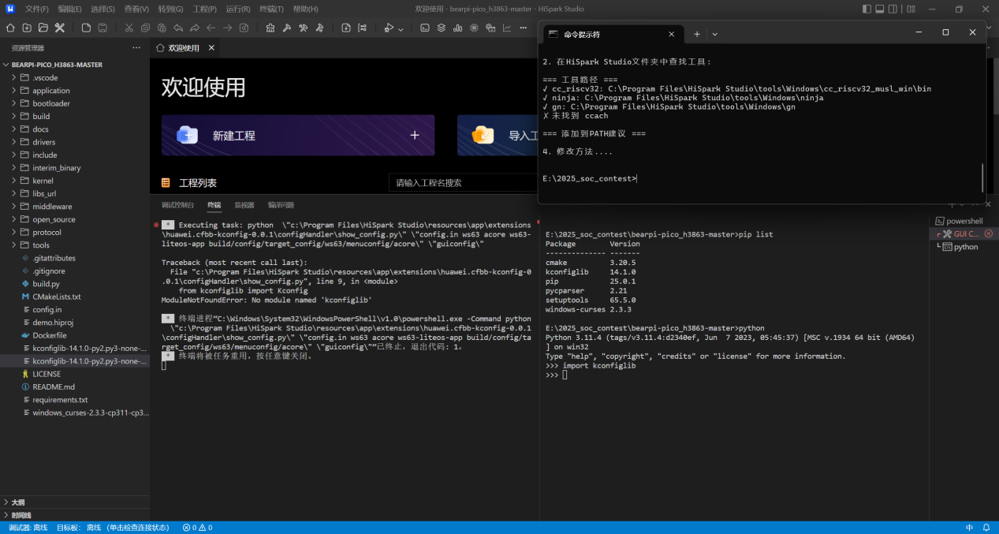

**解决方案地址：** <https://developers.hisilicon.com/postDetail?tid=0208181905264968015>

---

## ninja: fatal: CreateProcess: The parameter is incorrect

在 HiSpark 编译 WS63 代码时，碰到一个 `ninja: fatal: CreateProcess: The parameter is incorrect. (is the command line too long?)` 的错误：

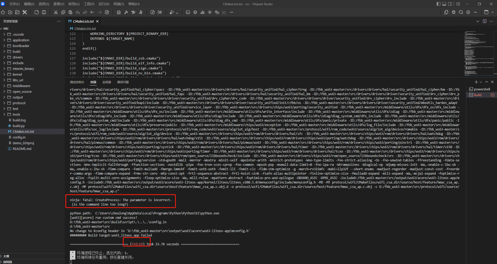

**解决方案地址：** <https://developers.hisilicon.com/postDetail?tid=0293178336810316019>

---

## 工程编译慢

编译速度慢通常由以下原因引起，可逐一排查。Windows 11 系统使用 HiSpark Studio 编译 WS63 的 SDK 时（尤其是「重编译」），有时非常慢，动辄十几分钟，更有甚者几十分钟，均可参考以下排查方法。

### 可能原因一：Microsoft PC Manager Service 占用 CPU 过高

结束或禁用该进程可加快工程编译速度。

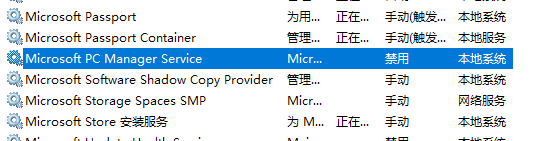

### 可能原因二：Antimalware Service Executable 实时扫描

Antimalware Service Executable 是 Windows 安全进程，会执行针对恶意软件的实时保护，编译时会扫描整个工程目录导致 CPU 占用率过高。将其扫描排除工程目录即可：

1. 打开 Windows 安全中心，点击「病毒和威胁防护」。

    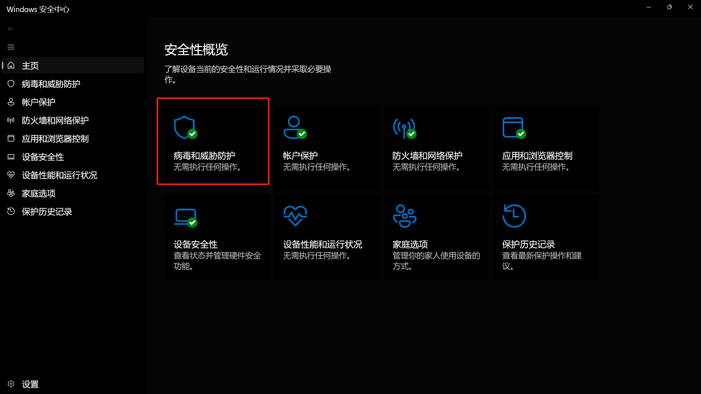

2. 点击「病毒和威胁防护」设置下的「管理设置」，下滑找到「排除项」，点击「添加或删除排除项」。

    

    

3. 在「排除项」中添加要编译的工程目录。

    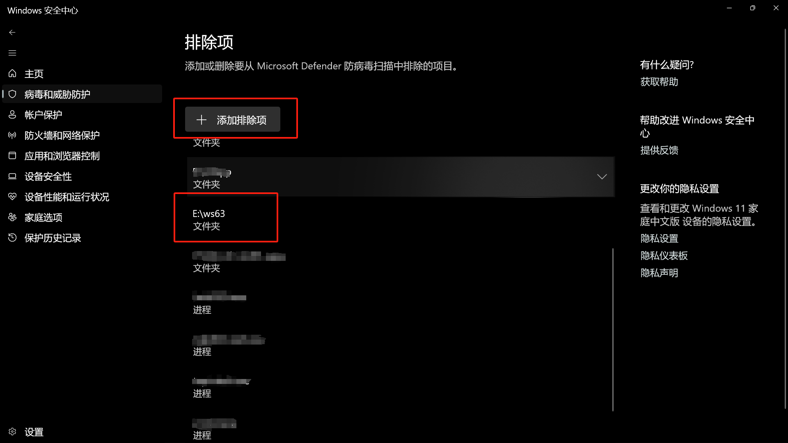

### 可能原因三：VS Code 处于效率模式

1. 查看是否处于效率模式：资源管理器中状态有「叶子」标志说明处于效率模式。

    

2. 找到 VS Code 的快捷方式，右键进入属性，在「目标」栏后面加上一个英文空格，再添加以下字段：

    ```
    --disable-features=UseEcoQoSForBackgroundProcess
    ```

    

3. 再次打开资源管理器，效率模式解除。

    

Win11 编译过慢的补充参考：<https://developers.hisilicon.com/postDetail?tid=0254185167815248040>

---

## 未使用 -c 参数但仍进行全量编译

没有使用 `-c` 参数进行编译，但是编译仍然会进行全量编译，而不是增量编译，每次编译下来都要好几分钟，效率很低。

**解决方案地址：** <https://developers.hisilicon.com/postDetail?tid=0253192110456572034>
