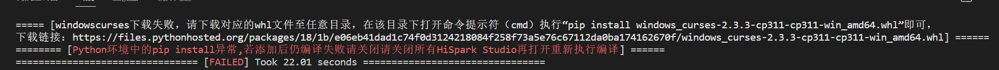
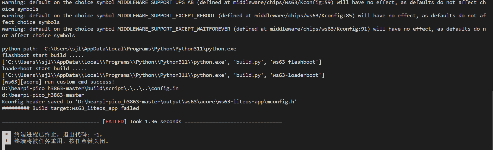
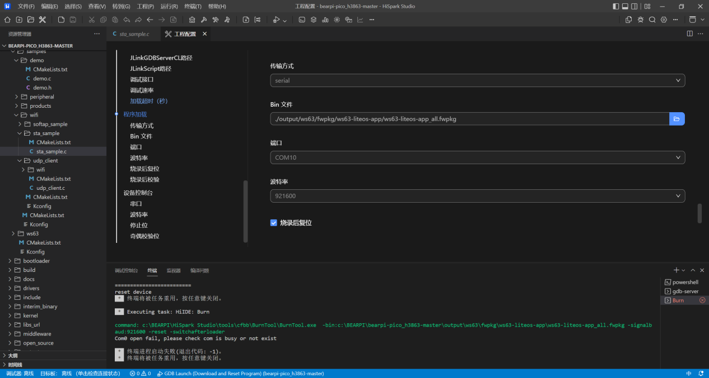

# 环境

本页收集编译与环境搭建过程中常见的报错与解决方案，涵盖 SDK 路径、工具链（Ninja / CMake / ccache / 工具链）、HiSpark Studio 编译、串口等问题。

!!! warning "前置检查：避免中文路径"
    请确保：SDK (Software Development Kit) 源码存放路径、工具链安装路径、Windows 用户名路径中均**不包含中文**。如果用户名包含中文路径，请参考 **HiSpark Studio 工具下载及安装** 说明进行处理。

    下述各问题中，多类编译报错（flashboot 失败、CMake/Ninja 找不到、ccache 权限拒绝等）都与中文路径有关，请优先排除该因素。

---

## 路径失效（调试 / 栈分析 / 镜像分析）

导入工程路径问题导致的调试、栈分析、镜像分析等默认路径失效。

**解决方案：** 修改默认的 `debug_elf` 路径。

---

## 按照《星闪实验指导手册》搭建 windows 环境无法正常编译

按照《星闪实验指导手册》搭建 windows 环境结果是无法正常编译的，报错如下：

**解决方案地址：** <https://developers.hisilicon.com/postDetail?tid=0201181900555191016>

---

## 看不出什么问题（无明确报错）

**解决方案：** 参考附件「日志获取 V3」，获取日志，再根据日志保存内容在 FAQ 中寻找对应的问题解决方法。

---

## 开发板串口 COM10 显示 Com0 open fail

开发板串口为 COM10，但是终端显示：`Com0 open fail, please check com is busy or not exist`，设备管理器中也没办法更改串口为 COM0：

**解决方案地址：** <https://developers.hisilicon.com/postDetail?tid=0293178336810316019>
