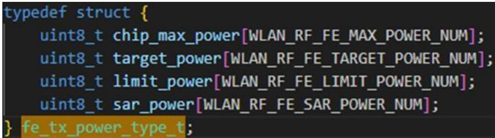
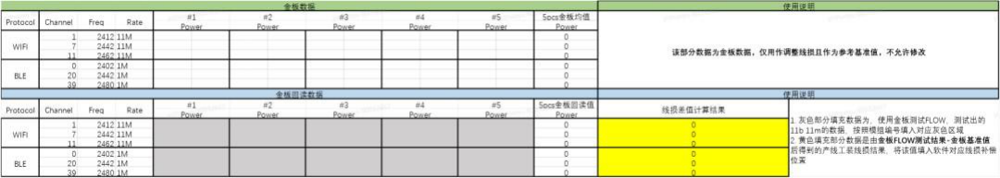

# 产线测试

WS63 生产测试（产线）中的温补参数、产测上位机调试与板载天线功率校准等常见问题。

---

## 温补参数写入后没有生效

问题描述：【WS63】测试温补频偏参数时，按照手册测试得出数据后写入 nv 中，写入成功，读取正常。但是测试显示补偿前和补偿后没有变化；例如

补偿前用 cwm500 测得频偏 14ppm, 补偿后重启测得频偏还是 14ppm。

**解决方案：**

执行AT+CCPRIV=wlan0,set_mfg_debug_mode,1，产线版本默认不支持频偏温补功能，测试高低温频偏温补功能时，需要配置该命令进入调试模式；同时使用上位机测试频偏时（非产测生产，仅用作研发测试），也需要将此命令加入到flow当中。

可以参考交付件里《WS63V100 软件开发指南》中 2.6 章节的内容，常用就是 target_power 是不同协议速率下的目标功率，limit_power 是按照信道划分的限制功率。

---

## 极致汇仪如何开启 debug

问题描述：【WS63】使用极致汇仪产测软件遇到测试 Fail 时，如何使用极致汇仪的 debug 功能来查看下发指令及回显是否正确呢？

**解决方案：**

**步骤 1** 向极致汇仪申请对应极致汇仪仪表型号、SN 号、及对应芯片型号（例如，73，63，53）的产测上位机的 debug key，将该 key 放到极致汇仪上位机的根目录下即可

**步骤 2** 修改极致汇仪上位机根目录下的 debug.ini 文件，将 print_send 和 print_receive 修改成 1 后保存。

**步骤 3** 重启上位机即可。

---

## 板载天线的模组在生产时如何校准

问题描述：【WS63】板载天线的模组在生产时如何进行较为准确的功率校准。

**解决方案：**

**步骤 1** 将贴片完成模组的随机抽取 5pcs 作为金板，将其板载天线断开后，焊接同轴线缆进行功率校准。

**步骤 2** 功率校准完成后，进行功率复测，将产线上会用到的信道进行功率测试，记录基准值。

**步骤 3** 将5pcs模组的板载天线重新焊接回去，然后放入产线生产工装内进行产线工装整体的线损校准，记录测量值，

**步骤 4** 基准值减去测量值得到测试信道在工装上的功率误差，计算 5pcs 模组功率误差平均值。

**步骤 5** 将功率误差补到产线工装上后进行生产测试，产测过程中可抽测模组验证功率校准是否准确。

下图可做参考：

