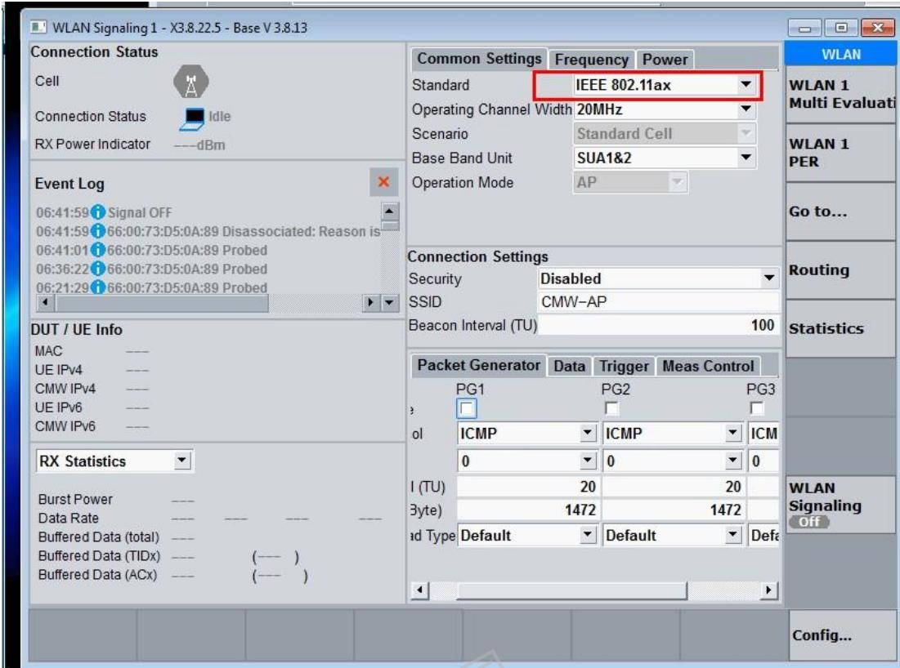
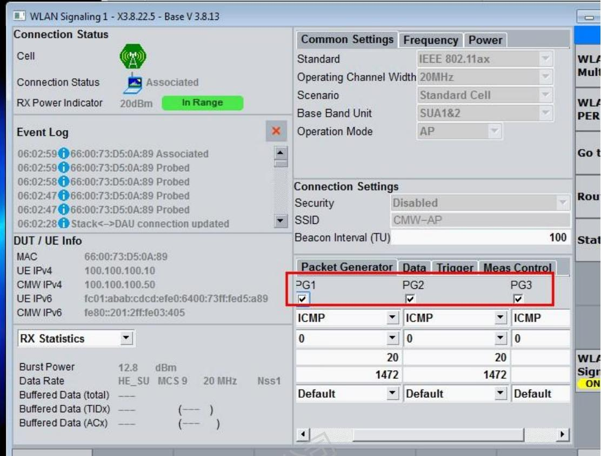
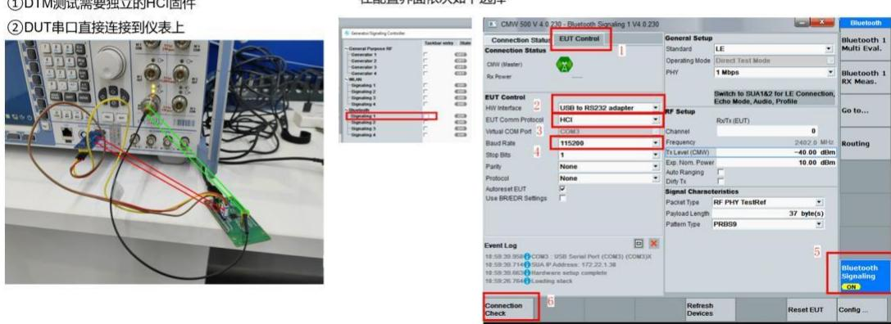
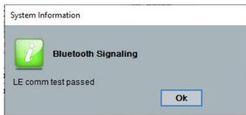

# 射频测试

WS63 射频测试场景下的信令连接、OTA 优化、丢包分析与 BLE 功率校准等常见问题。

---

## WiFi 信令测试无法与仪表建立连接

问题描述：【WS63】使用 CMW500 仪表进行信令测试时，芯片与仪表无法建立连接或者 TX 信息无法解调；

**解决方案：**

**一、信令连接指令：**

```text
AT+STARTSTA
AT+SCAN
AT + SCANRESULT
AT+CONN="CMW-AP", "test123456" // "仪表 ID", "仪表密码"; 若仪表无密码, 则只输 "仪表 ID"
AT + DHCP = wlan0, 1
```

**二、仪表配置：**

1、standard 中选择 11ax



2、config 中勾选Support of DSSS，并选择 DSSS 1Mbps  


3、config 中 Trigger RX Format 选择 HE_SU Bursts


4、Packet Generator 中 PG1 PG2 PG3 全部勾选



5、Packet Generator 中 interval 设置成 20，Size 设置成 1472  
  
5、WLAN 打开


**三、解析信号**


---

## OTA 测试中通过更改仪表配置来优化 TIS 值

问题描述: 【WS63】OTA 测试时，在不改变板级状态的条件下，可以通过更改仪表配置或者自动化设置来优化提升 TIS 值吗？

**解决方案：**

仪表自动化配置：

INTERVAL: 下行配置建议≥1ms

PAYLOAD SIZE: 下行配置建议设置 500

DTM信令测试

FRAME COUNT: 下行配置建议≥500

CELL POWER: 11b 建议-60db

11g/n 建议-50db

11ax 建议-40db

---

## 信令测试 RX 强信号场景下出现丢包

问题描述：【WS63】Wi-Fi 11b 信令测试过程中，发现在-40dbm 的强信号下，都会有丢包。

**解决方案：**

在排除环境干扰的情况下，BLE 广播会影响WIFI 的丢包，强信号下会有大概 2% 左右的丢包。

通过软件控制来关闭 BLE 广播会避免此类情况，另外，不关闭的情况下，有 2% 左右的丢包，对极限灵敏度的影响较小。

---

## 如何进行 BLE 信令测试

问题描述: 【WS63】如何使用 CMW500 进行 BLE 信令测试。

**解决方案：**

BLE射频测试CMW500操作

1、搭建环境：
①DTM测试需要独立的HCI固件
②DUT串口直接连接到仪表上

2、配置基础选项  
仍选择BLE测试  
在配置界面依次如下选择

  
注：如果使用USB转TTL串口小板连接仪表，仪表需要安装对应的驱动，否则仪表无法识别断开

**BLE射频测试CMW500操作DTM信令测试**

3、Connect Check反馈 LE comm test passed后可开始进行TX、RX测试



4、点击RF Settings在下方配置TX测试参数，或在Cofing中设置


---

## BLE 测试功率值偏差太大问题

问题描述：【WS63】BLE 测试中，校准正常，但有时候BLE 功率值偏差太大（目标功率 6，实测只有 3 点几），是什么原因？

**解决方案：**

上电时未接负载或者仪表会导致上电初始化时射频匹配阻抗不是 $50\Omega$ ，因此造成功率偏差较大，

所以在测试 BLE 功率时，必须确保模组或芯片上电时已经接好 50Ω 负载或者仪表，此时 BLE 功率波动在 ±2db 以内。

---
