# 软件

WS63 软件使用过程中常见的系统、无线通信、外设、射频与产线测试问题。

---

## 系统问题

WS63 系统异常（死机、看门狗挂死、死锁）的定位方法与系统异常信息导出方式。

---

### 系统死机问题

问题描述：【WS63】系统检测到异常（内存访问异常，指令异常等）后，会主动进行一系列异常接管的处理动作，例如打印异常发生时函数的调用栈信息、CPU现场信息、异常发生时正在运行的任务信息（包括任务名、任务号、堆栈大小等）等，并且这些信息会保存到Flash crash info区，死机信息保存后系统会自动重启。

**解决方案：**

#### 死机信息组成说明

死机信息主要内容由以下几部分组成，如下表所示：

<table>
  <tr>
    <td>成员</td>
    <td>描述</td>
  </tr>
  <tr>
    <td>CPU异常信息</td>
    <td>打印具体的CPU异常</td>
  </tr>
  <tr>
    <td>详细任务信息</td>
    <td>打印挂死时的所有任务详情</td>
  </tr>
  <tr>
    <td>异常汇总信息</td>
    <td>发生异常时的task名称、taskID、异常类型</td>
  </tr>
  <tr>
    <td>CPU寄存器信息</td>
    <td>发生异常时的CPU寄存器值,包括mepc、mcause、ccause等寄存器</td>
  </tr>
  <tr>
    <td>函数调用栈信息</td>
    <td>任务栈中的代码执行记录,从上到下表示由近及远的代码执行顺序,可以依据此信息得出异常发生时的程序上下文。</td>
  </tr>
</table>

以下是一个典型的挂死信息示例:

```text
Store/AMO access fault
PMP access fault
Name TaskEntryAddr TID Priority Status StackSize WaterLine
StackPoint TopOfStack SemID EventMask CPUP CPUP 10.0s CPUP 1.0s
---- ---- ---- ---- ----
wifi_frw-- 0x00128d80 0x0 5 Running ----0x1000 0x6c8
0x00a39790 0x00a38900 0xffffffff 0x1 0.0 14.4 13.0
Swt_Task 0x00a0cc1c 0x1 0 Suspend 0x800 0x288
0x00a30630 0x00a2ffa0 0xffffffff 0x0 0.0 0.0 0.0
IdleCore000 0x00a0c212 0x2 31 Ready 0x400 0x284
0x00a30950 0x00a307c0 0xffffffff 0x0 78.4 14.3 5.0
dfx_msg 0x002505bc 0x3 5 Pend 0x800 0x1b4
0x00a33530 0x00a32ee0 0xffffffff 0x0 0.0 0.0 0.0
app 0x00254ad2 0x4 27 Ready 0x800 0x584
0x00a33f70 0x00a33900 0xffffffff 0x0 0.0 0.0 0.0
log 0x003ad238 0x5 25 Pend 0x800 0x194
0x00a34790 0x00a34120 0x1 0x0 0.0 0.0 0.0
bt 0x0014d2e4 0x6 1 Pend 0xe00 0x338
0x00a35590 0x00a34940 0xffffffff 0x0 0.0 0.0 0.0
bt_sdk 0x002f3f02 0x724 Pend 0x800 0x1b8
0x00a35db0 0x00a35760 0xffffffff 0x0 0.0 0.0 0.0
bth_sdk 0x00307ec4 0x8 19 Pend 0x800 0x164
0x00a36610 0x00a35f70 0x3 0x0 0.0 0.0 0.0
recvBthDataTask 0x0030b95e 0x9 18 Pend 0x800 0x1d4
0x00a36e00 0x00a36790 0xffffffff 0x0 0.0 0.0 0.0
bt_service 0x002f2ace 0xa 14 Pend 0x1000 0xae4
0x00a37df0 0x00a36fb0 0xffffffff 0x0 0.9 0.8 0.0
t_shell 0x00377aba 0xb 9 Pend 0x900 0x4d4
0x00a38720 0x00a37fe0 0xc 0x0 0.0 0.0 0.0
radar_driver 0x00329a76 0xc 23 Pend 0x800 0x1d8
0x00a3a630 0x00a39fe0 0xffffffff 0x3 0.0 0.0 0.0
radar_feature 0x0032a140 0xd 24 Pend 0x18000x4b4
0x00a3be70 0x00a3a800 0xffffffff 0x7 0.0 0.0 0.0
t_net 0x0039e1e4 0xf 5 PendTime 0x1000 0x594
0x00a3e320 0x00a3d4f0 0xffffffff 0x0 0.1 0.7 1.0
schedule_loop 0x002f3136 0x10 22 Pend 0xa00 0x964
0x00a3fdc0 0x00a3f520 0x5 0x0 0.2 3.0 0.0
wifi_frw_txdata 0x00264afa 0x11 4 Pend 0x1000 0x554
0x00a43910 0x00a42a80 0xffffffff 0x1 0.0 0.8 0.0
wifi_frw_msg 0x00264afa 0x12 4 Pend 0x1400 0xffffffff
0x00a673f0 0x00a66160 0xffffffff 0x1 0.0 8.1 11.0
t_uplus 0x00348096 0x14 14 PendTime 0xc00 0xa54
0x00a45bb0 0x00a45150 0xd 0x40 0.4 1.3 0.0
t_aux0 0x00348096 0x15 16 Ready 0x1000 0xd14
0x00a477e0 0x00a46980 0xffffffff 0x40 0.1 1.1 0.0
t_uh 0x00348118 0x16 15 Ready 0x1200 0x9e4
0x00a48830 0x00a47d40 0xffffffff 0x0 4.9 43.1 70.0
t_ble 0x00348096 0x17 15 PendTime 0xe00 0xbd4
0x00a4a930 0x00a49cd0 0x14 0x0 0.6 5.9 0.0
t_epp 0x00348096 0x18 14 PendTime 0x1200 0xcfc
0x00a4dac0 0x00a4ca60 0x1d 0x0 0.2 0.6 0.0
t_serial 0x0035da4c 0x19 13 Pend 0x1000 0x734
0x00a4ea70 0x00a4dc70 0x311001f 0x0 0.6 1.1 0.0
薪 0x00376bfc 0x1a 12 Pend 0x800 0xffffffff
0x00a4fbe0 0x00a4f550 0x417003e 0x0 0.0 0.2 0.0
wpa_supplicant 0x002ae880 0x1c 4 PendTime 0x1800 0xffffffff
0x00a6c490 0x00a6ae90 0xffffffff 0x7 0.0 4.2 0.0
APP|exception:7
task:wifi_frw
thrdPid:0xffffffff
type:0x7
nestCnt:1
phase:Irq
ccause:0x7
mcause:0x7
mtval:0xa98800
gp:0xa10e0c
mstatus:0x80007880
mepc:0xa0e8f6
ra:0x370038
sp:0xa2daa0
tp:0x0
t0:0xa987ec
t1:0xa0db92
t2:0x0
s0:0x0
s1:0xa2ceec
a0:0xa4f004
a1:0x2
a2:0x32ea28
a3:0x20
a4:0x8
a5:0x2020202
a6:0xa4f00c
a7:0xd7da2c
s2:0xa2ceec
s3:0x4a000000
s4:0xa2d000
s5:0xa19eec
s6:0xffffffff
s7:0x8080808
s8:0x7070707
s9:0x6060606
s10:0x5050505
s11:0x4040404
t3:0x12077e
t4:0x1
t5:0x0
t6:0xa5f2f8
APP|xcptsc = 0x7
APP|*****backtrace begin*****
fp error, backtrace failed!
APP|*****backtrace end*****
APP|*****stack txt info begin*****
APP|traceback 1 -- sp addr= 0xa2daa4 sp content= 0xa0e8f6
APP|traceback 19 -- sp addr= 0xa2daec sp content= 0x12077e
APP|traceback 25 -- sp addr= 0xa2db04 sp content= 0x32ea28
APP|traceback 29 -- sp addr= 0xa2db14 sp content= 0xa0db92
APP|traceback 31 -- sp addr= 0xa2db1c sp content= 0x370038
APP | traceback 55 -- sp addr= 0xa2db7c sp content= 0xa0c1ba
APP | traceback 59 -- sp addr= 0xa2db8c sp content= 0xa0d500
APP | traceback 67 -- sp addr= 0xa2dbac sp content= 0x3a9496
APP | traceback 75 -- sp addr= 0xa2dbcc sp content= 0xa0d100
APP | traceback 83 -- sp addr= 0xa2dbc sp content= 0xa0e0b0
APP|*****stack txt info end*****
```

#### 死机信息详细说明

##### CPU 异常信息

挂死信息最开始，会直接打印挂死的直接原因信息，如下图所示，表示当前挂死是由于写地址异常，CPU 写到了一片 PMP 保护的区域导致挂死：

Store/AMO access fault
PMP access fault

##### 详细任务信息

这一部分会打印运行在当前 CPU 上所有的任务以及其状态，可以协助用户对当前业务运行的状态有更精准的判断。一个典型的任务信息打印如下：

图1-1 任务信息

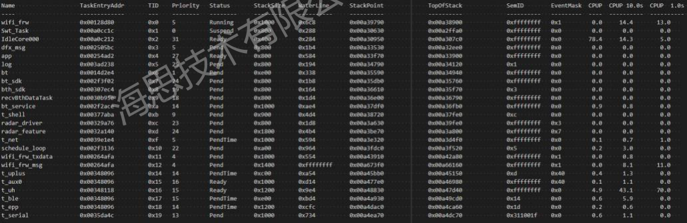


<table>
  <tr>
    <td>成员</td>
    <td>描述</td>
  </tr>
  <tr>
    <td>Name</td>
    <td>任务名</td>
  </tr>
  <tr>
    <td>TID</td>
    <td>任务 ID</td>
  </tr>
  <tr>
    <td>Priority</td>
    <td>任务优先级</td>
  </tr>
  <tr>
    <td>Status</td>
    <td>任务状态,Ready:任务处于就绪状态。Pend:任务处于阻塞状态。PendTime:阻塞的任务处于等待超时状态。</td>
  </tr>
  <tr>
    <td>成员</td>
    <td>描述Suspend:任务处于挂起状态。Running:该任务正在运行。Delay:任务处于延时等待状态。SuspendTime:挂起的任务处于等待超时状态。Invalid:非上述任务状态。</td>
  </tr>
  <tr>
    <td>StackSize</td>
    <td>任务栈大小</td>
  </tr>
  <tr>
    <td>WaterLine</td>
    <td>任务栈水线,该任务栈已经被使用的内存大小,预期小于任务栈大小</td>
  </tr>
  <tr>
    <td>StackPoint</td>
    <td>任务栈指针,表示栈的起始地址</td>
  </tr>
  <tr>
    <td>TopOfStack</td>
    <td>栈顶地址,预期比栈指针地址要小</td>
  </tr>
  <tr>
    <td>CPUP</td>
    <td>显示系统启动至今总的CPU占用率</td>
  </tr>
  <tr>
    <td>CPUP 10.0s</td>
    <td>显示系统最近10s的CPU占用率</td>
  </tr>
  <tr>
    <td>CPUP 1.0s</td>
    <td>显示系统最近1s的CPU占用率</td>
  </tr>
</table>

任务信息打印中的任务状态以及 CPU 占用率统计信息，可以判断死机是否是某任务出现异常 CPU 占用导致看门狗挂死（见 [看门狗挂死问题](#看门狗挂死问题)）。

任务信息打印还可以协助判断是否死机时某任务是否有踩内存的情况，这里举例说明如何通过 task 命令判断是否踩内存，如下图所示，有一任务名为 shellTask。

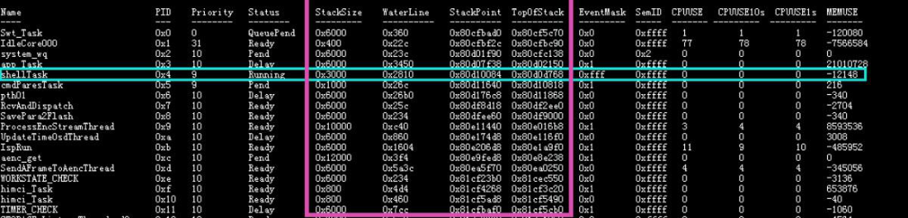


StackSize = 0x3000（创建该任务时分配的栈大小）

WaterLine = 0x2810 (水线，目前为止该任务栈已经被使用的内存大小)

StackPoint = 0x80d10084 （任务栈指针，指向该任务当前的地址）

TopOfStack = 0x80d0d768 (栈顶)

MaxStackPoint = TopOfStack + StackSize = 0x80d10768 （得到该任务栈最大的可访问地址）

- 若WaterLine > StackSize，则说明该任务踩内存。

- 若 StackPoint > MaxStackPoint 或 StackPoint < TopOfStack，则说明该任务踩内存。

##### 异常汇总信息

异常汇总信息包括发生异常时的 task 名称、taskID、异常类型等。示例如下：


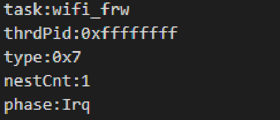
<table>
  <tr>
    <td>成员</td>
    <td>描述</td>
  </tr>
  <tr>
    <td>task</td>
    <td>任务名</td>
  </tr>
  <tr>
    <td>thrdPid</td>
    <td>如果在任务中挂死,其值就代表任务ID;在中断或者嵌套挂死,其值是0xffffffff</td>
  </tr>
  <tr>
    <td>type</td>
    <td>0-17 分别代表不同的挂死类型:"Instruction address misaligned","Instruction access fault","Illegal instruction","Breakpoint","Load address misaligned","Load access fault","Store/AMO address misaligned","Store/AMO access fault","Environment call from U-mode","Environment call from S-mode","Reserved","Environment call from M-mode","Instruction page fault","Load page fault","Reserved","Store page fault","Hard fault", /* Reserved exception code */"Lock up" /* Reserved exception code */</td>
  </tr>
  <tr>
    <td>nestCnt</td>
    <td>表示挂死信息的嵌套次数,如果在打印挂死信息时再次出现挂死,嵌套次数就加1,以此类推</td>
  </tr>
  <tr>
    <td>phase</td>
    <td>表示挂死的时机:Init 表示挂死在初始化过程Task 表示挂死在任务中Irq 表示挂死在中断中</td>
  </tr>
</table>

##### CPU 寄存器信息

CPU 给软件提供了方便调试的CSR，异常接管时软件会通过读取这些CSR 来识别出当前CPU 处于什么异常状态。主要如下三个CSR：mcause CSR(0x342)、ccause CSR(0xfc2)、mtval CSR(0x343)。其中 mcause CSR 是 RISCV 标准协议定义的 CSR；mtval CSR 是用来记录发生错误的地址或者指令。除了这三个 CSR，还打印了mepc 等协助开发人员定位死机位置的定位，示例如下：

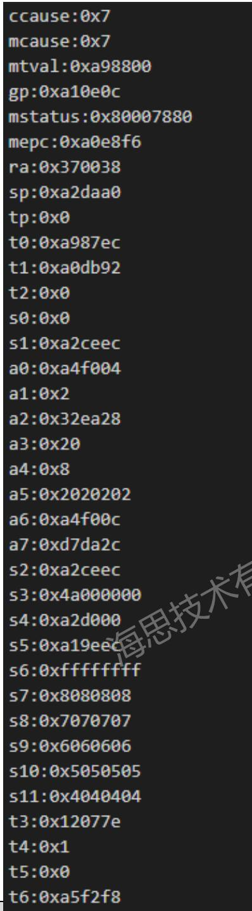

<table>
  <tr>
    <td>成员</td>
    <td>描述</td>
  </tr>
  <tr>
    <td>ccause</td>
    <td>ccause CSR 是自定义CSR,用来细化更详细的异常信息</td>
  </tr>
  <tr>
    <td>mcause</td>
    <td>mcause CSR 是机器异常寄存器。保存目前异常或者中断的原因,通过查询表 3-5 得到目前异常或者中断的类型。</td>
  </tr>
  <tr>
    <td>mtval</td>
    <td>机器陷入寄存器。保存地址异常中出错的地址或者发生指令异常的指令本身,对于其他错误,其值为零。</td>
  </tr>
  <tr>
    <td>gp</td>
    <td>通用寄存器,在开启特定编译选项时可以用作帧指针寄存器FP,用来实现栈回溯功能</td>
  </tr>
  <tr>
    <td>mstatus</td>
    <td>机器状态寄存器。通过它的最低位判断是否使能中断(0:禁止中断;1:使能中断)。</td>
  </tr>
  <tr>
    <td>mepc</td>
    <td>机器异常程序计数器。当发生异常时,mepc指向导致异常的指令;对于中断,mepc指向中断处理后应该恢复的位置。</td>
  </tr>
  <tr>
    <td>ra</td>
    <td>返回地址寄存器,通常用于存储函数调用后的返回地址</td>
  </tr>
  <tr>
    <td>sp</td>
    <td>堆栈指针</td>
  </tr>
  <tr>
    <td>t0~t6s0~s11a0~a7</td>
    <td>CPU 寄存器,需要结合反汇编代码查看其含义</td>
  </tr>
</table>

ccause, mcause, mtval 这三个寄存器要结合起来看，判断CPU异常信息详情。这三个CSR的具体组合含义见下表：

##### 取指地址不对齐异常

<table>
  <tr>
    <td>Mcause(0x342)</td>
    <td>Ccause(0xfc2)</td>
    <td>Mtval(0x343)</td>
    <td>异常说明</td>
  </tr>
  <tr>
    <td>Instructionaddressmisaligned(值为0)</td>
    <td>not available (值为0)</td>
    <td>faultingPC</td>
    <td>取指PC地址不是2byte对齐</td>
  </tr>
</table>

- 取指异常

<table>
  <tr>
    <td>Mcause(0x342)</td>
    <td>Ccause(0xfc2)</td>
    <td>Mtval(0x343)</td>
    <td>异常说明</td>
  </tr>
  <tr>
    <td>Instructionaccessfault(值为1)</td>
    <td>memory map regionaccess fault (值为1)</td>
    <td>faultingPC</td>
    <td>取指地址是在memory mapregion "holes" 里面。或者PC地址落在了DTCM/PMEM/SYSTEM memorymap region.</td>
  </tr>
  <tr>
    <td></td>
    <td>AXIM error response(值为2)</td>
    <td>faultingPC</td>
    <td>取指时,I-AHB 总线返回错误</td>
  </tr>
  <tr>
    <td rowspan="4"></td>
    <td>crossing PMP entries(值为4)</td>
    <td>faulting PC</td>
    <td>取指地址跨了两个 entry 地址空间</td>
  </tr>
  <tr>
    <td>No PMP entry matched (值为6)</td>
    <td>faulting PC</td>
    <td>所有的 entry 无效,或者取指地址不在有效的 entry 地址空间之内。</td>
  </tr>
  <tr>
    <td>PMP access fault (值为7)</td>
    <td>faulting PC</td>
    <td>取指地址匹配到的 entry 地址空间可执行权限不正确。匹配的 PMP entry 的 memory 属性是DEV-NB 类型。</td>
  </tr>
  <tr>
    <td>CMO access fault(值为8)</td>
    <td>invalidation VA</td>
    <td>ICache invalidation 的时候,cache 的地址对应的 PMP entry 没有读权限。</td>
  </tr>
</table>

##### 非法指令

<table>
  <tr>
    <td>Mcause(0x342)</td>
    <td>Ccause(0xfc2)</td>
    <td>Mtval(0x343)</td>
    <td>异常说明</td>
  </tr>
  <tr>
    <td rowspan="2">Illegal Instruction(值为2)</td>
    <td>not available (值为0)</td>
    <td>Faulting instruction</td>
    <td>指令解析异常,如下场景:1.指令不属于RV32IMC ISA2.SLLI, SRLI, SRAI and C.SLLI,C.SRLI,C.SRAI with imm[5] not equal to 03.URET execution4.MRET execution in user mode5.WFI rs1 and/or rd are/is non-zero</td>
  </tr>
  <tr>
    <td>CSR access fault(值为9)</td>
    <td>Faulting instruction</td>
    <td>CSR 指令解析异常,如下场景:1.User mode accessing machine and debug mode CSRs2.Machine mode accessing debug mode CSRs3.Accessing non-existent CSRs4.Write to read-only CSRs5.Read cycle, time, instret or</td>
  </tr>
  <tr>
    <td></td>
    <td>LDMIA/STMIA instruction fault(值为 10)</td>
    <td>Faulting instruction</td>
    <td>hpmcounterwhenmcounteren.CY/TM/IR/HPMis 0.6.Accessing fflags, frm, fcsr if misa[5]=0LDMIA/STMIA 指令解析异常,如下场景:1. LDMIA/STMIA gpr_mask is 0;2. LDMIA with base address register and one of destination registers;3. rs1 is one of the target registers for LDMIA4. If rcount is 0, or opc is 3 for PUSH/POP/POPRET</td>
  </tr>
</table>

- Load/store 地址不对齐

<table>
  <tr>
    <td>Mcause(0x342)</td>
    <td>Ccause(0xfc2)</td>
    <td>Mtval(0x343)</td>
    <td>异常说明</td>
  </tr>
  <tr>
    <td rowspan="2">Load address misaligned(值为4)</td>
    <td>not available(值为0)</td>
    <td>Faulting address</td>
    <td>1.读PMEM地址空间地址不对齐,主要涉及外设寄存器地址空间,通过AHBM总线访问。比如如果是word访问,地址不是4byte对齐,如果是halfword访问,地址不是2byte对齐。2.读MMEM空间内Device属性的地址空间地址不对齐,主要是sram地址空间中的device属性地址空间,通过AHBD总线访问。比如如果是word访问,地址不是4byte对齐,如果是halfword访问,地址不是2byte对齐。3.读SYSTEM地址空间不是4byte对齐。</td>
  </tr>
  <tr>
    <td>LDMIA/STMIA instruction fault(值为10)</td>
    <td>Base address in LDMIA;sp(x2) in</td>
    <td>Base address in LDMIA is not word aligned.sp(x2) in POP/POPRET is not</td>
  </tr>
  <tr>
    <td></td>
    <td></td>
    <td>POP/POPRET.</td>
    <td>16 byte aligned.</td>
  </tr>
  <tr>
    <td>store address misaligned(值为6)</td>
    <td>not available(值为0)</td>
    <td>Faulting address</td>
    <td>1.写PMEM地址空间地址不对齐,主要涉及外设寄存器地址空间,通过AHBM总线访问。比如如果是word访问,地址不是4byte对齐,如果是halfword访</td>
  </tr>
  <tr>
    <td rowspan="2"></td>
    <td></td>
    <td></td>
    <td>问,地址不是2byte对齐。2.写MMEM空间内Device属性的地址空间地址不对齐,主要是sram地址空间中的device属性地址空间,通过AHBD总线访问。比如如果是word访问,地址不是4byte对齐,如果是halfword访问,地址不是2byte对齐。3.写SYSTEM地址空间不是4byte对齐。</td>
  </tr>
  <tr>
    <td>LDMIA/STMIA instruction fault(值为10)</td>
    <td>Base address in STMIA; sp(x2) in PUSH.</td>
    <td>Base address in STMIA is not word aligned.sp(x2) in PUSH is not 16 byte aligned.</td>
  </tr>
</table>

- Load 读数据访问异常

<table>
  <tr>
    <td>Mcause(0x342)</td>
    <td>Ccause(0xfc2)</td>
    <td>Mtval(0x343)</td>
    <td>异常说明</td>
  </tr>
  <tr>
    <td rowspan="4">Load access fault(值为5)</td>
    <td>memory map region access fault (值为1)</td>
    <td>Faulting address</td>
    <td>读地址是在整个memory mapregion 的"holes"里面</td>
  </tr>
  <tr>
    <td>AXIM error response (值为2)</td>
    <td>Faulting address</td>
    <td>读MMEM 地址空间,通过AHBD 总线,AHBD 总线操作返回错误</td>
  </tr>
  <tr>
    <td>AHBM error response(值为3)</td>
    <td>Faulting address</td>
    <td>读PMEM 地址空间,通过AHBM 总线,AHBM 总线操作返回错误</td>
  </tr>
  <tr>
    <td>crossing PMP</td>
    <td>Faulting</td>
    <td>S-BUS 或者 D-BUS 的读地址跨</td>
  </tr>
  <tr>
    <td rowspan="3"></td>
    <td>entries(值为4)</td>
    <td>address</td>
    <td>两个PMP 区域了</td>
  </tr>
  <tr>
    <td>system register access fault(值为5)</td>
    <td>Faulting address</td>
    <td>读 SYSTEM 地址空间,访问了不存在的 system register。</td>
  </tr>
  <tr>
    <td>No PMP entry matched (值为6)</td>
    <td>Faulting address</td>
    <td>所有的entry 无效,或者读地址不在有效的entry 地址空间之内。</td>
  </tr>
  <tr>
    <td></td>
    <td>PMP access fault(值为 7)</td>
    <td>Faulting address</td>
    <td>读地址匹配到的entry 地址空间读权限不正确。</td>
  </tr>
</table>

- Store 写数据访问异常

<table>
  <tr>
    <td>Mcause(0x342)</td>
    <td>Ccause(0xfc2)</td>
    <td>Mtval(0x343)</td>
    <td>异常说明</td>
  </tr>
  <tr>
    <td rowspan="6">store access fault(值为7)</td>
    <td>memory map region access fault (值为1)</td>
    <td>Faulting address</td>
    <td>写地址是在整个memory map region 的"holes"里面</td>
  </tr>
  <tr>
    <td>AXIM error response (值为2)</td>
    <td>异步事件,mtval 记录不了实际发生错误的地址</td>
    <td>写 MMEM 地址空间,通过AHBD 总线,AHBD 总线操作返回错误</td>
  </tr>
  <tr>
    <td>AHBM error response(值为3)</td>
    <td>异步事件,mtval 记录不了实际发生错误的地址</td>
    <td>写 PMEM 地址空间,通过AHBM 总线,AHBM 总线操作返回错误</td>
  </tr>
  <tr>
    <td>crossing PMP entries(值为4)</td>
    <td>Faulting address</td>
    <td>写地址跨两个PMP 区域了</td>
  </tr>
  <tr>
    <td>system register access fault(值为5)</td>
    <td>Faulting address</td>
    <td>写 SYSTEM 地址空间,访问了不存在的 system register。</td>
  </tr>
  <tr>
    <td>No PMP entry matched (值为6)</td>
    <td>Faulting address</td>
    <td>所有的 entry 无效,或者写地址不在有效的 entry 地址空间之内。</td>
  </tr>
  <tr>
    <td rowspan="3"></td>
    <td>PMP access fault(值为7)</td>
    <td>Faulting address</td>
    <td>写地址匹配到的entry 地址空间写权限不正确。</td>
  </tr>
  <tr>
    <td>CMO access fault(值为8)</td>
    <td>invalidation virtual address</td>
    <td>Dcache invalidation 的时候,地址进行 PMP 校验时,没有读写权限。</td>
  </tr>
  <tr>
    <td>ITCM write access fault(值为11)</td>
    <td>faulting address</td>
    <td>写 ITCM 的地址是只读的</td>
  </tr>
</table>

##### 函数调用栈信息

通过堆栈指针可以回溯函数调用栈，显示与异常相关的所有函数调用指令。用户可以根据函数调用栈检查异常发生时函数调用的上下文以方便定位。函数调用栈信息如下图所示。

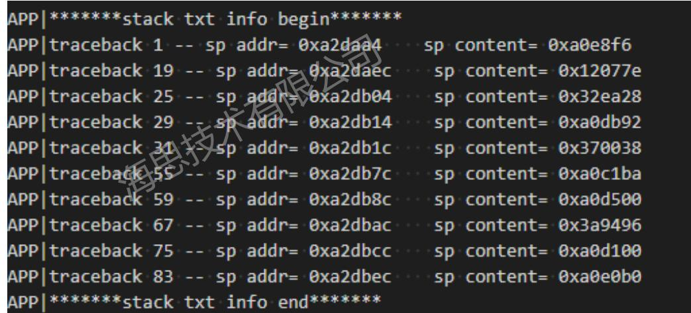

用户根据 sp content 里面的指针，对照程序的反汇编 asm 文件查找对应的函数指令。

**说明**

程序的反汇编文件如下：

ws63-liteos-app.asm

#### 定位步骤

**步骤 1** 确认系统重启前是否有系统异常信息打印，如果系统重启前没有任何异常打印信息，请测量芯片供电电压，确认是否存在电压跌落导致芯片复位。

**步骤 2** 如果系统重启前有异常信息打印，请确认 ops 是否为 NMI(APP|Oops:NMI)，如果是 NMI 触发重启，请参考下一章节看门狗挂死的定位步骤。

**步骤 3** 如果不是看门狗挂死，请参考前面介绍的死机信息说明，根据mcause, ccause, mtval获取死机的类型，根据挂死时 PC 指针以及CPU 寄存器的值，结合汇编代码定位死机所在函数指令位置。

**步骤 4** 根据调用栈信息确认异常函数调用关系，结合业务场景，从代码上下文分析死机发生根因。

**步骤 5** 根据任务详细信息，如果有明显栈异常，考虑栈溢出、内存踩踏的可能性，可加大任务栈后复现对比测试。

**步骤 6** 如果挂死和业务场景无关且挂死点随机，并且结合代码分析预计不可能出现该异常，可考虑从硬件供电角度分析，测试芯片电压，是否确保了芯片供电 $3.3V \pm 10\%$ 。（多出现在上下电阶段）

#### 常见 CPU 异常死机案例

- 例子一：挂死前串口有明显异常，结合串口打印分析  
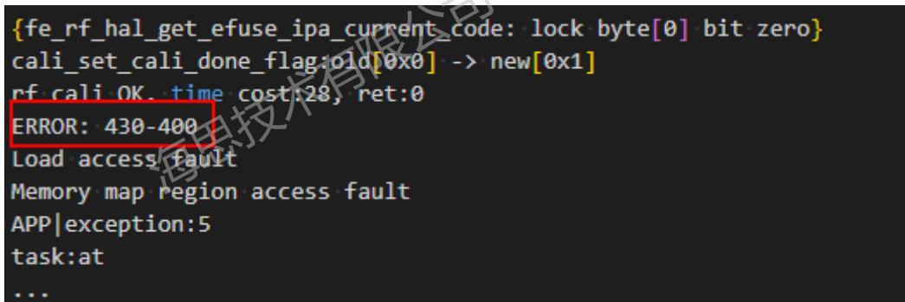

挂死日志前有明显异常打印，结合该错误码，最终定位该异常分支有异常内存访问的问题导致挂死。

- 例子二：可以找到明确的异常指令，结合业务定位

已知死机时 mepc = 0x8034d3cc

1. 打开编译后生成的 asm 反汇编文件
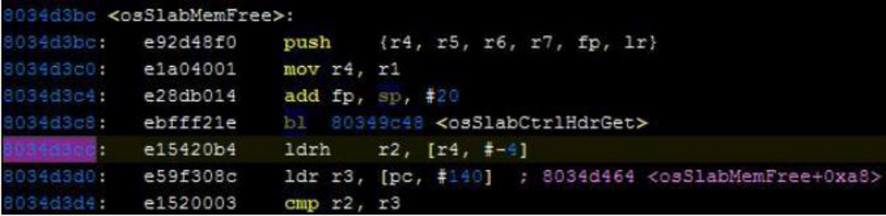

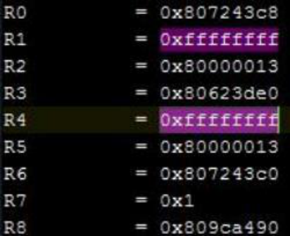


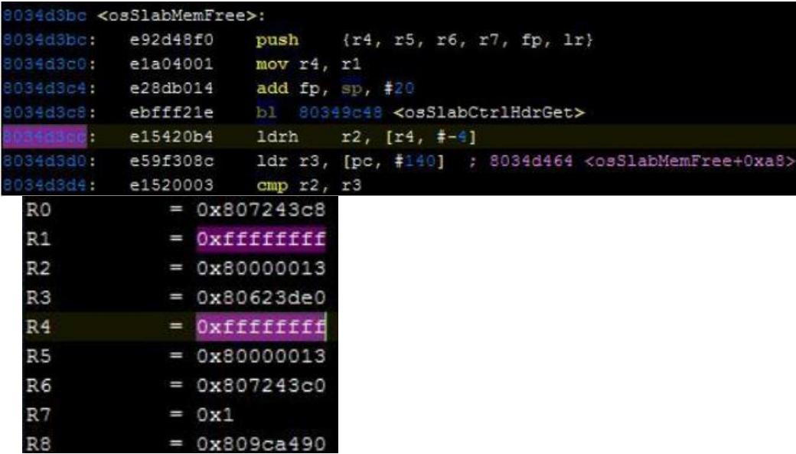

2. 搜索 PC 指针在 asm 文件中的位置, 找到当前 CPU 正在执行的指令行

3. 找到异常时CPU正在执行的指令是ldrh r2, [r4, #-4], 异常发生在函数osSlabMemFree中

4. 结合 ldrh 指令分析，此指令是从内存的(r4-4)地址中读值，将其load 到寄存器 r2 中。再结合异常时打印的寄存器信息，查看此时 r4 的值 = 0xffffff，显然，r4 的值超出了内存范围，故CPU 执行到该指令时发生了数据终止异常。根据汇编知识，从 asm 文件可以看到，r4 是从 r1 mov 过来，而 r1 是函数第二个入参，于是可以确认，在调用 osSlabMemFree 时传入了 0xffffff（或 -1）这样一个错误入参。

5. 根据调用栈信息，找到异常时的函数调用关系如下：MNT_buf_send(业务函数) -> free -> LOS_MemFree -> osSlabMemFree

6. 最终，通过排查业务中MNT_buf_send实现，发现其中存在错误使用指针的问题，导致free了一个错误地址，引发上述异常。

- 例子三：上电时随机挂死，从硬件供电排查分析

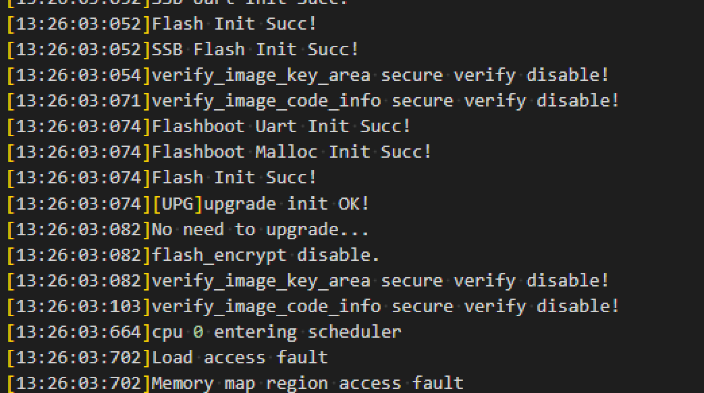


上电时反复出现挂死，挂死mepc不固定，经过硬件分析，确认是产品单板供电有问题。

---

### 看门狗挂死问题

问题描述：【WS63】某个任务或中断中运行时间过长、没有在规定的时间内进行喂狗，系统会认定为异常，系统会打印并保存运行任务信息，保存完成后自动重启。

**解决方案：**

#### 看门狗挂死说明

看门狗的默认超时时间是 15 秒，也可以在业务中通过 uapi_watchdog_set_time 接口修改。系统 CPU 如果空闲时，会自动在 IdleCore00 任务中做喂狗操作，防止看门狗超时。如果客户有特定业务需要长时间占用 CPU，需要在业务流程中定期调用 uapi_watchdog_kick 接口，主动做喂狗操作。

**说明**

也可以在代码中直接修改看门狗默认超时时间：修改宏定义 WDT_TIMEOUT_S


看门狗挂死的日志特征如下，会打印 Oops: NMI，表示当前的挂死是由不可屏蔽中断触发，mcause 是 0x8000000c。一般看门狗挂死都是由于 IdleCore000 任务被阻塞的导致，从任务信息可以找到当前 CPU 正在忙的任务，并做进一步定位。如下图所示，任务 UART0_loop_send 正在运行，且 100% 占用 CPU，因此触发看门狗挂死：

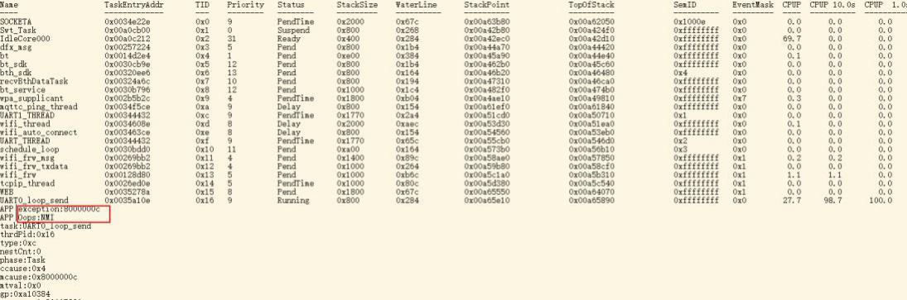


#### 定位步骤

如果在用户某业务场景出现看门狗挂死，可以按照以下步骤排查：

**步骤 1** 根据任务详细信息，找到阻塞 Idle 任务喂狗并引发看门狗挂死的任务信息。

**步骤 2** 对比业务不运行的场景，确认看门狗挂死是否与该业务强相关。如果出现此情况，继续往下排查。否则需要继续找到引发该挂死的业务场景。

**步骤 3** 需要排查业务是否就有长时间占用CPU的场景需求-如打流。如果出现此情况，建议用户在业务流程中增加喂狗操作，或者考虑加大看门狗超时时间。

**步骤 4** 根据挂死信息的 PC 指针以及函数调用栈信息，排查业务代码中是否有循环体反复死循环的场景。如果出现此情况，需要用户进行进一步定位以及修改，避免死循环。

---

### 死锁问题

问题描述：【WS63】死锁问题表现为多个任务运行时互相等待对方释放锁，多个任务被锁阻塞无法被系统调度，死锁时系统不会出现异常，也不会打印异常信息，系统默认不开启死锁检测，所以系统不会自动重启。

**解决方案：**

首先查看任务状态信息，确认CPU当前运行的任务状态。

表1-1 查看任务状态命令

<table>
  <tr>
    <td>格式</td>
    <td>AT+SYSINFO</td>
  </tr>
  <tr>
    <td>参数说明</td>
    <td>无,该命令会输出SDK 版本信息以及任务详情</td>
  </tr>
  <tr>
    <td>示例</td>
    <td>AT+SYSINFO</td>
  </tr>
  <tr>
    <td>响应</td>
    <td>• 成功:OK• 失败:INPUT_ERROR or CMD_NOT_FOUND</td>
  </tr>
</table>

**示例如下：**

```text
AT+SYSINFO
SDK Version:1.10.T0
```

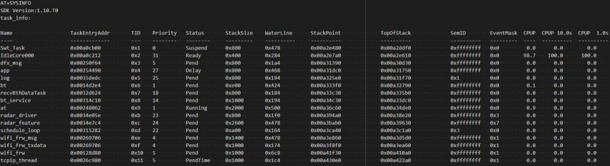


#### 死锁问题定位

此类问题主要是多任务场景下，业务模块使用互斥锁不合理造成死锁问题。

##### 互斥锁说明

多任务系统使用互斥锁达到资源互斥的目的，其他任务不能强行抢占任务已经占有的资源。使用互斥锁时，可能存在任务之间互相等对方释放资源的情况，从而造成死锁。死锁会使任务陷入无限循环等待，导致业务功能障碍。

##### 互斥锁死锁检测机制

任务发生死锁后，无法得到调度，通过记录任务上次调度的时间，设置一个超时时间阈值，如果任务在这段时间内都没有得到调度，则怀疑该任务发生了死锁。

配置宏 LOSCFG_DEBUG_DEADLOCK，该宏开关可以通过 make menuconfig 在菜单项中开启 "Enable Mutex Deadlock Debugging" 使能，若关闭该菜单项，则关闭死锁检测功能。

Debug ---> Enable a Debug Version ---> Enable Debug LiteOS Kernel Resource ---> Enable Mutex Deadlock Debugging

---

### 如何导出系统异常信息

问题描述：【WS63】在某些场景下，由于未连接串口线，或者串口在系统异常时本身也出现异常，导致系统异常信息无法通过串口打印出来。

**解决方案：**

为了避免此情况，软件把系统异常信息保存一份到 FLASH 中，系统分配了一块 4K 的 FLASH 分区用于保存系统异常信息，并提供了相应的维测命令，可以在单板重启后，将系统异常信息重新打印输出。

**说明**

Crash 信息保存区的分区：地址范围【0x05fB000，0x05fC000】

图1-2 查看任务状态命令

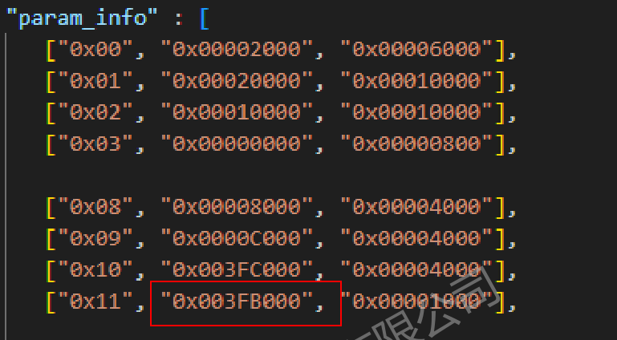


<table>
  <tr>
    <td>格式</td>
    <td>AT+DUMP</td>
  </tr>
  <tr>
    <td>参数说明</td>
    <td>无,如果之前有挂死过,输出前一次的挂死信息;如果没有挂死过,输出No crash dump found!</td>
  </tr>
  <tr>
    <td>示例</td>
    <td>AT+DUMP</td>
  </tr>
  <tr>
    <td>响应</td>
    <td>• 成功:OK• 失败:INPUT_ERROR or CMD_NOT_FOUND</td>
  </tr>
</table>

**示例如下：**

```text
AT+DUMP
APP|----Last Crash info dump----
APP|task:at
thrdPid:0x9
type:0x7
nestCnt:1
phase:Task
ccause:0x1
mcause:0x7
mtval:0x4
0x00a333f0 0x00a32790 0xffffffff 0x0
recvBthDataTask 0x0032d62c 0x7 18 Pend 0x800 0x184
0x00a33c30 0x00a335b0 0xffffffff 0x0
bt_service 0x00314c18 0x8 14 Pend 0x1000 0x194
0x00a34c30 0x00a33dc0 0xffffffff 0x0
at 0x00248062 0x9 1 Running 0x2000 0x500
0x00a36940 0x00a34de0 0xffffffff 0x0
radar_driver 0x0034e066 0xb 23 Pend 0x800 0x1f0
0x00a394a0 0x00a38e20 0xffffffff 0x3
radar_feature 0x0034e7cc 0xc 24 Pend 0x2600 0x478
0x00a3bab0 0x00a39630 0xffffffff 0x7
schedule_loop 0x0031528a 0xd 22 Pend 0xa00 0x164
0x00a3ca40 0x00a3c1a0 0x3 0x0
wifi_frw_msg 0x00269706 0xe 4 Ready 0x1400 0x478
0x00a3e860 0x00a3d5d0 0xffffffff 0x1
wifi_frw_txdata 0x00269706 0xf 4 Pend 0x1000 0x174
0x00a3f8f0 0x00a3ea60 0xffffffff 0x1
wifi_frw 0x00128d80 0x10 5 Ready 0x1000 0x6c8
0x00a41f30 0x00a410a0 0xffffffff 0x1
tcpip_thread 0x0026c980 0x11 5 Ready 0x1000 0x1c4
0x00a430e0 0x00a422a0 0xffffffff 0x1
APP| Last Crash info dump end----
```

#### 系统异常信息导出

如果串口或者 AT 命令不可用，无法通过AT+DUMP 查看挂死信息，还可以通过DebugKits 工具导出挂死日志。

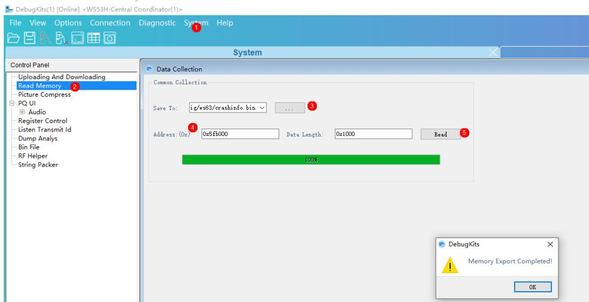  
**步骤 1** 打开DebugKits 工具，连接单板。  
**步骤 2** 打开 System 菜单，选择 Read Memory 功能项。

**步骤 3** 选择保存日志路径以及名字，导出路径为 build\config\target_config\ws63\，文件命名为 crashinfo.bin。

**步骤 4** 填写需要导出的地址以及长度，地址为 crash 分区地址 0x5fb0000，长度为 0x1000。

**步骤 5** 点击Read 按钮导出。

#### 系统异常信息解析

**步骤 1** 进入文件夹 build\config\target_config\ws63。确定该目录下有 crash_info.py 以及 crashinfo.bin 文件。

**步骤 2** 在 python 环境下执行脚本：python crash_info.py。脚本执行完成后，生成 crashinfo.txt，该文件就是解析完成的挂死信息。

**示例如下：**

执行脚本，解析 crashinfo.bin

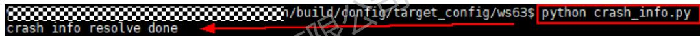

解析完成，生成 crashinfo.txt  
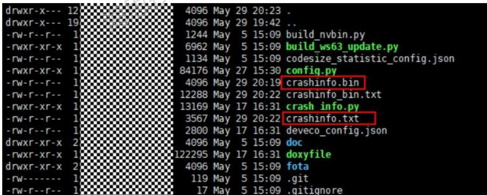

**生成的 crashinfo.txt 内容如下：**

```text
0xdeadbeef

task_name:at
=== EXC INFO ===
phase:Task
type:0x7
faultAddr:0x4
thrdPid:0x9
nestCnt:0x1
reserved:0x0
context:0xa36c50
Swt_Task 0xa0cb00 0x1 0 Suspend 0x800 0x478
0xa2e480 0xa2ddf0 0xffffffff 0x0
IdleCore000 0xa0c212 0x2 31 Ready 0x400 0x284
0xa2e7a0 0xa2e610 0xffffffff 0x0
dfx_msg 0x250f64 0x3 5 Pend 0x800 0x1a4
0xa31390 0xa30d30 0xffffffff 0x0
app 0x254490 0x4 27 Delay 0x800 0x468
0xa31dc0 0xa31750 0xffffffff 0x0
log 0x35dee4 0x5 25 Pend 0x800 0x194
0xa325e0 0xa31f70 0x1 0x0
bt 0x14d2e4 0x6 1 Pend 0xe00 0x424
0xa333f0 0xa32790 0xffffffff 0x0
recvBthDataTask 0x32d62c 0x7 18 Pend 0x800 0x184
0xa33c30 0xa335b0 0xffffffff 0x0
bt_service 0x314c18 0x8 14 Pend 0x1000 0x194
0xa34c30 0xa33dc0 0xffffffff 0x0
at 0x248062 0x9 1 Running 0x2000 0x500
0xa36940 0xa34de0 0xffffffff 0x0
radar_driver 0x34e066 0xb 23 Pend 0x800 0x1f0
0xa394a0 0xa38e20 0xffffffff 0x3
radar_feature 0x34e7cc 0xc 24 Pend 0x2600 0x478
0xa3bab0 0xa39630 0xffffffff 0x7
schedule_loop 0x31528a 0xd 22 Pend 0xa00 0x164
0xa3ca40 0xa3c1a0 0x3 0x0
wifi_frw_msg 0x269706 0xe 4 Ready 0x1400 0x478
0xa3e860 0xa3d5d0 0xffffffff 0x1
wifi_frw_txdata 0x269706 0xf 4 Pend 0x1000 0x174
0xa3f8f0 0xa3ea60 0xffffffff 0x1
wifi_frw 0x128d80 0x10 5 Ready 0x1000 0x6c8
0xa41f30 0xa410a0 0xffffffff 0x1
tcpip_thread 0x26c980 0x11 5 Ready 0x1000 0x1c4 0xa430e0 0xa422a0 0xffffffff 0x1
```

---

## 无线通信

WS63 Wi-Fi、BLE、SLE（星闪）无线通信场景下的常见问题。

### Wi-Fi

---

#### 扫描失败问题

问题描述：【WS63】扫描过程中，"<SCAN RESULT>:"有扫描结果，但最终显示扫不到对应AP信息，或者"<SCAN RESULT>:"中无结果。

**说明**

有扫描结果指的是 "<SCAN RESULT>:" 中存在其他 ssid，不是指要关联的 AP 在 "<SCAN RESULT>:" 中。

**解决方案：**

##### 可能原因

- AP 所在信道在非管制域信道范围内；

- 周围环境存在超过32个AP信息，而要扫描的AP信号强度较弱；

- STA 扫描时间太短;

##### 定位步骤

**步骤 1** 通过查看 "<SCAN RESULT>:" 中是否存在 ssid 等信息

- 执行 AT+SCANRESULT 命令查看 "<SCAN RESULT>:" 是否存在 AP 信息，若未存在任何 AP 信息，查看日志是否有ERROR 类型日志，进而判断扫描异常阶段；若 "<SCAN RESULT>:" 中存在 AP 信息，进入步骤 2 分析；

**说明**

AT 命令详细介绍请参考《WS63V100 AT 命令使用指南》，检查 "<SCAN RESULT>:" 中 AP 数量

**步骤 2** 根据信号强度排序，最多记录 32 个 AP，当要扫描的 AP 信号较弱时，可能被过滤，

因此不会被上报"<SCAN RESULT>:"中。

- 检查是否含有32个AP信息

- 如果含有 32 个 AP 信息，执行 AT+SCANSSID 命令指定 SSID 扫描，观察是否能扫描到该 AP，若未能扫描到，进入步骤 3 分析；

- 如果少于32个AP信息，则进入步骤3分析；

**步骤 3** 检查 AP 所在信道是否在管制域范围

- 如果 AP 为路由器，查看路由器配置界面，确定路由器所在信道；

- 执行AT+STASTAT命令查看AP的"channel"信息。

+STASTAT: <status>,<ssid>,<bssid>,<chn>,<rssi>

若 AP 所处信道未在管制域范围内，可寻求开发人员定位；若 AP 所处信道在管制域范围内，则进入步骤 4 分析。

**步骤 4** 抓包查看报文交互流程

通过 Omnipeek 或 WireShark 等抓包软件抓包分析：

1、抓取AP的beacon帧，确认AP是否工作正常。

2、抓取STA的Probe Request报文，确认STA扫描请求是否正常。

3、抓取AP的Probe Response报文，确认AP扫描响应是否正常。

**步骤 5** 通过抓包分析，如果 STA 和 AP 报文交互正常还扫不到AP，确认是否STA 扫描时间太短；通过 wifi_sta_set_scan_policy 接口修改 scan_cnt(发送 Probe Request 报文次数)和 scan_time(两次 Probe Request 报文的间隔时间)，每个信道扫描总时间 (scan_cnt*scan_time) 建议不小于 102.4ms。

---

#### 关联失败问题

问题描述：【WS63】STA 关联 AP 失败，STA 没有收到关联响应或收到 AP 关联响应报文携带错误码、AP 去关联报文、AP 去认证报文。

**解决方案：**

##### 可能原因

- 密码格式错误;

- 被 AP 拉黑;

##### 定位步骤

**步骤 1** 检查扫描结果

详情见 [扫描失败问题](#扫描失败问题) 故障定位指导，分析原因。

**步骤 2** 检查 AP 端状态

(1) 检查 AP 黑名单：登录 AP 配置界面，查看 AP 黑名单中是否有 STA 的 MAC 地址，若有，尝试将该 MAC 地址移除黑名单，重新尝试关联。

**(2) 检查PMF状态：**

登录 AP 配置界面，若 AP 为强制 PMF 加密方式，可尝试执行

"AT+STARTSTA=1,1"命令，在起STA时，强制启动PMF尝试关联。

**说明**

AT 命令：AT+STARTSTA=[<protocol_mode>],[<pmf>]，其中<pmf>为管理帧保护策略，默认为1，表示 PMF 自适应，AT 命令详情使用请参考《WS63V100 AT 命令使用指南》

**(3) 检查加密方式**

- 若 AP 为 OPEN 方式，关联时不需要设置密钥；

- 若 AP 为 WPA/WPA2/WPA3/WAPI/WEP 等加密方式，进入步骤 3 分析。

**步骤 3** 检查密钥格式（AP 为 WPA/WPA2/WPA3/WAPI/WEP 等加密方式

(1) 确定密钥长度，如WEP加密只支撑5/10/13/26位密钥长度；

(2) 确定密钥是否含有特殊字符、大小写、以及中文字符;

(3) 确定密钥类型是否正确，例如AP 配置为ASCII/HEX 类型，关联时使用

HEX/ASCII 类型密钥;

若检查以上内容无误，进入步骤 4 分析。

**步骤 4** 检查报文交互流程

场景一：AUTH 报文交互失败

- 查看 AUTH 报文的 STATUS CODE，确定原因，如表 1 所示；

表1-2 Status Code

<table>
  <tr>
    <td>Status Code</td>
    <td>Name</td>
    <td>Meaning</td>
  </tr>
  <tr>
    <td>0</td>
    <td>SUCCESS</td>
    <td>Successful</td>
  </tr>
  <tr>
    <td>14</td>
    <td>TRANSACTION_SEQUENCE_ERROR</td>
    <td>Received an Authentication frame with authentication transaction sequence number out of expected sequence.</td>
  </tr>
  <tr>
    <td>16</td>
    <td>REJECTED_SEQUENCE_TIMEOUT</td>
    <td>Authentication rejected due to timeout waiting for next frame in sequence.</td>
  </tr>
  <tr>
    <td>30</td>
    <td>REFUSED_TEMPORARILY</td>
    <td>Association request rejected temporarily; try again later.</td>
  </tr>
  <tr>
    <td>126</td>
    <td>SAE_HASH_TO_ELEMENT</td>
    <td>SAE authentication uses direct hashing, instead of looping, to obtain the PWE.</td>
  </tr>
</table>

**说明**

表 1 列出的 Status Code 为常见类型，完整的 Status Code 可查看 802.11 标准协议。

场景二：ASSOC 报文交互失败

- 查看 AP 回复的 Assoc Rsp 报文中的 status code，分析原因，详细 status code 参考表 1;

### BLE

---

#### 手机扫不到 BLE 广播信号

问题描述：【WS63】使用 AT 命令配置 BLE 广播功能，配置完成后使用手机扫描 BLE 信号，扫不到配置的 BLE 信号：

```ini
[15:54:04.557]发→◇AT+BLEENABLE
[15:54:04.559]收←◆AT+BLEENABLE
[ACore] ble enable cbk in, event:b
OK

[15:54:07.908]发→◇AT+BLESETADDR=0, 0x112233445566
[15:54:07.911]收←◆AT+BLESETADDR=0, 0x112233445566
OK

[15:54:10.658]发→◇AT+BLESETNAME=9, atcmdtest
[15:54:10.662]收←◆AT+BLESETNAME=9, atcmdtest
OK

[15:54:16.450]发→◇AT+BLESETAPPEARANCE=961
[15:54:16.454]收←◆AT+BLESETAPPEARANCE=961
OK

[15:54:18.419]发→◇AT+BLESETADVDATA=6, 0x112233445566, 0, 0, 1
[15:54:18.423]收←◆AT+BLESETADVDATA=6, 0x112233445566, 0, 0, 1
OK

[15:54:20.475]发→◇AT+BLESETADVPAR=48, 48, 0, 0x112233445577, 0, 0x112233445566, 7, 0, 1, 0, 1
[15:54:20.481]收←◆AT+BLESETADVPAR=48, 48, 0, 0x112233445577, 0, 0x112233445566, 7, 0, 1, 0, 1
[ACore] ble set adv param min_interval:0x30, max interval:0x30, adv_type:0, duration:0
[ACore] ble set adv param, own addr:0x11:**:**:**:55:77
[ACore] ble set adv param, peer addr:0x11:**:**:**:55:66
OK

[15:54:23.547]发→◇AT+BLESTARTADV=1
[15:54:23.552]收←◆AT+BLESTARTADV=1
[ACore] gap ble start adv in, adv_id:1
OK
```

**解决方案：**

使用BLE抓包卡进行抓包，能够抓到BLE广播报文，但手机BLE扫描界面扫不到信号，大概率是手机无法解析广播数据。

把 AT + BLESETADVDATA = 6,0x112233445566,0,0,1 改成 AT + BLESETADVDATA = 0,0,0,0,1，BLE 广播不带数据，手机就能扫到配置 BLE 信号。

### SLE

---

#### SLE 覆盖距离和连接距离不一致

问题描述：【WS63】SLE 拉距测试，通讯距离空旷条件下 200 百米以上才会断开连接，重新连接就得到 100 米内才可连接上，连接距离远小于业务覆盖距离。

**解决方案：**

BLE 和 SLE 有 2 个功率配置：1 个是 NV 中的功率 TPC code，NV 中的功率控制除广播外的报文功率；另 1 个是广播报文发射功率，配置是通过 UAPI 接口或 AT 配置命令设置。NV 中配置 TPC Code 为 7，NV 中的发射功率是 20dbm，但广播报文发射功率配置为 10dbm，由于广播功率比 NV 中的功率小，导致连接距离比覆盖距离小。

调整广播功率，保持和NV中的功率一致，连接距离和覆盖距离一致。

---

#### SLE client 设置 MTU 到 520，实际最多只到 251

sle 案例中，client 端设置 MTU 到 520，最后实际最多到 251 的情况，如下图：


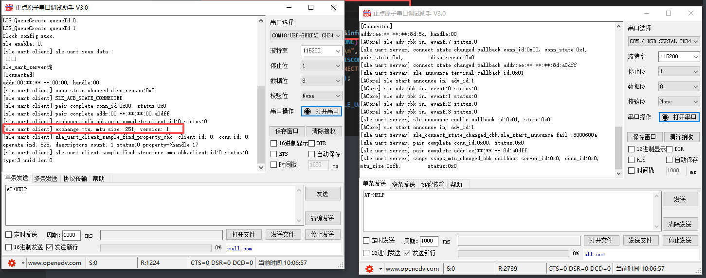

**解决方案：**

- server 端与 client 端设置的 MTU 需保持一致。建立连接配对后，Client 和 Server 端会对 MTU Size 进行交换，使用更小的 MTU Size 作为 MTU 大小。如果 Server 端没有设置 MTU 的话，默认为最小值。
- 你可以在 Server `sle_pair_complete_cbk` 中设置一个 Server 的 `MTU Size = 520`，这样 Client 设置 520 后，MTU 就会是 520：

```c
ssap_exchange_info_t info = {0};
info.mtu_size = 520;
info.version = 1;
ssaps_set_info(0, &info);
```

默认的 SLE Uart 案例没有设置 Server 端的 MTU Size，需要手动设置一下。

原帖：<https://developers.hisilicon.com/postDetail?tid=02178214214394841015>

---

#### server 端 notify/indicate，client 的 notification_cb 没有响应

sle 案例中，sle 连接后，client 用 `ssapc_write_cmd` 发，server 可以收到；反过来用 `ssaps_notify_indicate` 发，client 的 `notification_cb` 没有响应的情况。

**解决方案：**

添加操作指示权限，如下图：


---

#### sle 通信出现频繁断连重连现象

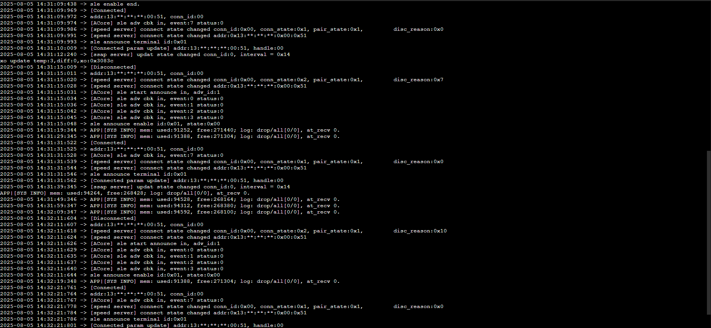

**解决方案：**

- 服务端：加入销毁线程函数，防止重复创建线程，修改如下图：

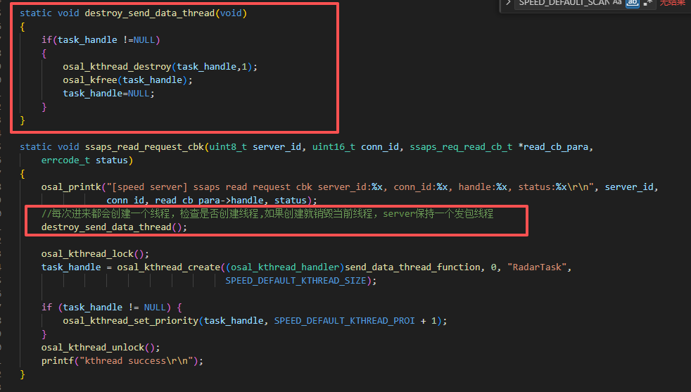

- 客户端：修改如下图：


---

#### BS22 里 sle_uart 的低延时跑流不成功

**解决方案：**

- 修改 nv：


- phy 改小到 1M：


- 数据长度改小到 30：

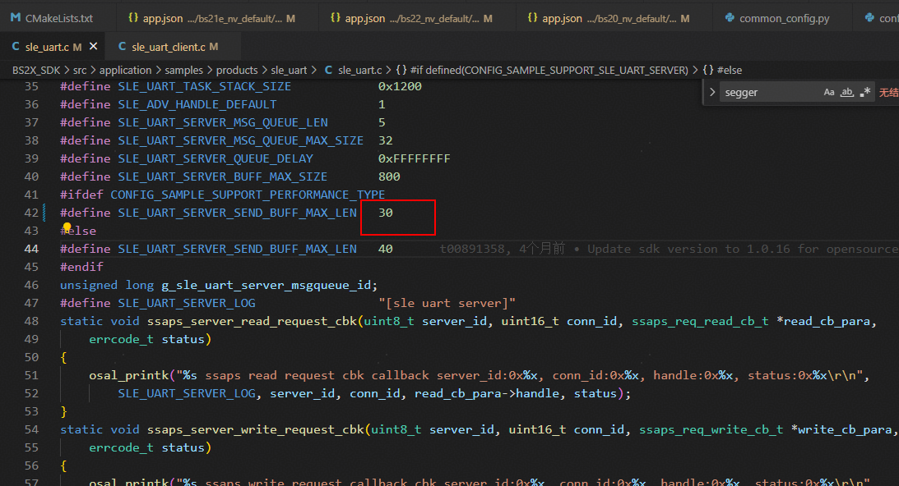

---

#### WS63 服务端通过 indicate 给客户端发送没有反应

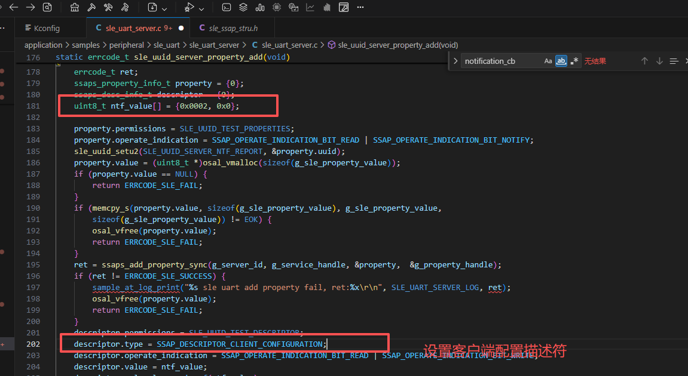

---

## 外设问题

WS63 外设（UART、复位引脚等）使用过程中常见的通信异常问题。

---

### UART 配置错误通信异常

问题描述：【WS63】UART 初始化后，管脚配置是正确的，但 UART 还是无法正常通信。

**解决方案：**

检查UART配置是否正确，重点关注data_bits、stop_bits、parity配置，这3个配置一定要使用hal_uart_data_bit_t、hal_uart_stop_bit_t、hal_uart_parity_t枚举定义的值。

注意：UART_DATA_BIT_8 枚举值是 3，不是 8；UART_STOP_BIT_1 枚举值是 0，不是 1。

初始化时需要注意枚举变量是否设置正确。

uart_line_config.baud_rate = baud_rate;

uart_line_config.data_bits = UART_DATA_BIT_8;

uart_line_config.parity = UART_PARITY_NONE;

uart_line_config.stop_bits = UART_STOP_BIT_1;

---

### reset 引脚电压过高无法重启

问题描述：【WS63】模组通信串口断电后（单独抽拔 VCC），此时再上电接上 VCC，有时会无法正常启动。

**解决方案：**

模组通信串口断电后（拔掉 VCC），测的 power_on 的电压为 1.44V，此时有电流倒灌现象，power_on 复位要求 1.4V 故无法正常重新启动

1、调测过程中，可以用power_on接地复位或者同时使整个串口断电来避免UART口倒灌；

2、可以增大UART口的RX通路的上拉电阻（或者不加RX口的上拉）来减少倒灌的电压，但是要保证对端设备的TX有足够的上拉能力，实测RX口上拉电阻为2.2K时，power_on的

倒灌电压有 1.25V 左右，当上拉电阻为 47K 时，power_on 的倒灌电压为 0.7V 左右，满足 power_on 的下电电压。

---

### UART RX 无法通信

问题描述：【WS63】模组 UART 与主板无法正常通信，发现 TX 能正常发送数据，RX 无法接受数据

**解决方案：**

出现此类问题，第一时间测量RX端异常通信时的波形，发现低电平有1.1V，而UART的低电平识别阈值为-0.3V-0.8V；芯片端低电平识别错误，故无法通信；

1、在驱动能力足够的情况下去除 RX 处的上拉电阻，避免与主板的上拉电阻形成分压，造成芯片端的电压偏大。

2、在无法去除上拉的情况下，增大RX端的上拉电阻的阻值。

---

## 射频测试

WS63 射频测试场景下的信令连接、OTA 优化、丢包分析与 BLE 功率校准等常见问题。

---

### WiFi 信令测试无法与仪表建立连接

问题描述：【WS63】使用 CMW500 仪表进行信令测试时，芯片与仪表无法建立连接或者 TX 信息无法解调；

**解决方案：**

**一、信令连接指令：**

```text
AT+STARTSTA
AT+SCAN
AT + SCANRESULT
AT+CONN="CMW-AP", "test123456" // "仪表 ID", "仪表密码"; 若仪表无密码, 则只输 "仪表 ID"
AT + DHCP = wlan0, 1
```

**二、仪表配置：**

1、standard 中选择 11ax


2、config 中勾选Support of DSSS，并选择 DSSS 1Mbps  
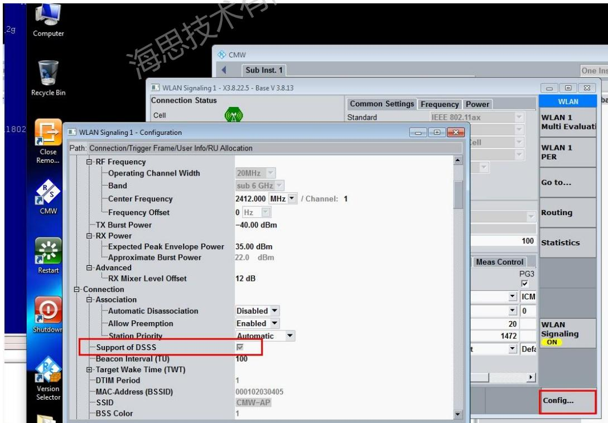

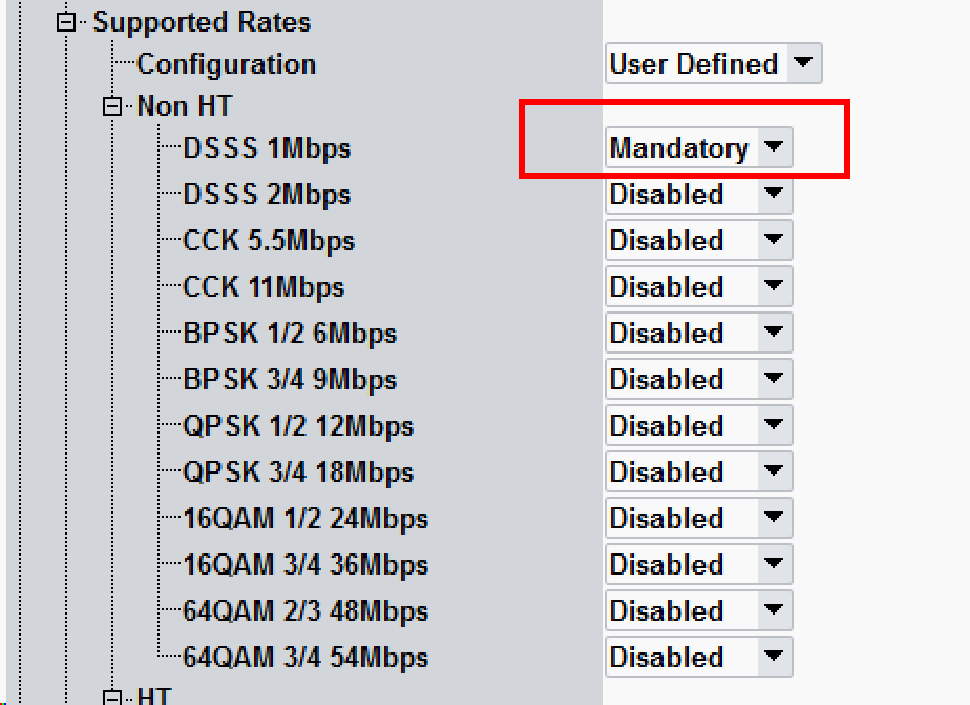


3、config 中 Trigger RX Format 选择 HE_SU Bursts

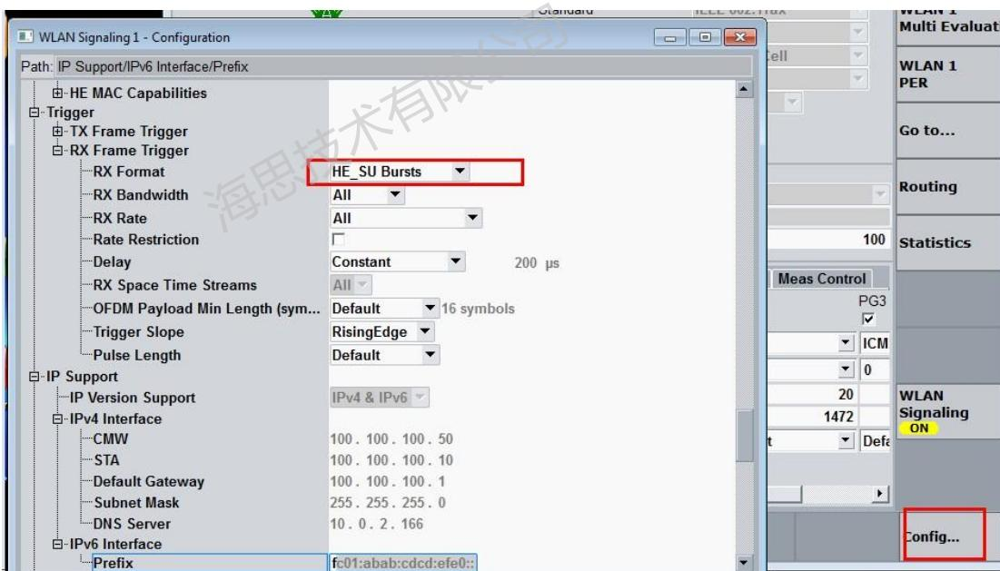

4、Packet Generator 中 PG1 PG2 PG3 全部勾选


5、Packet Generator 中 interval 设置成 20，Size 设置成 1472  
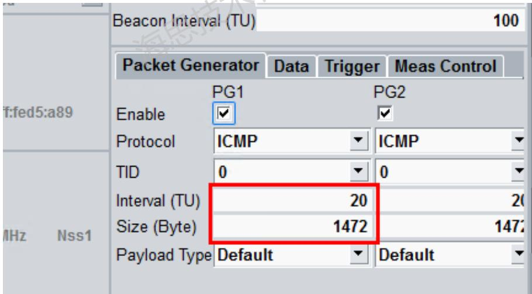  
5、WLAN 打开

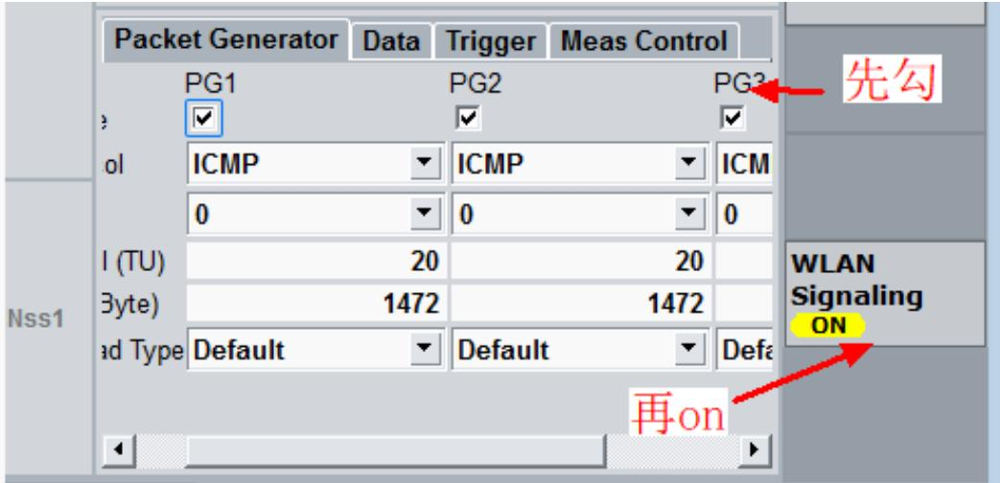

**三、解析信号**

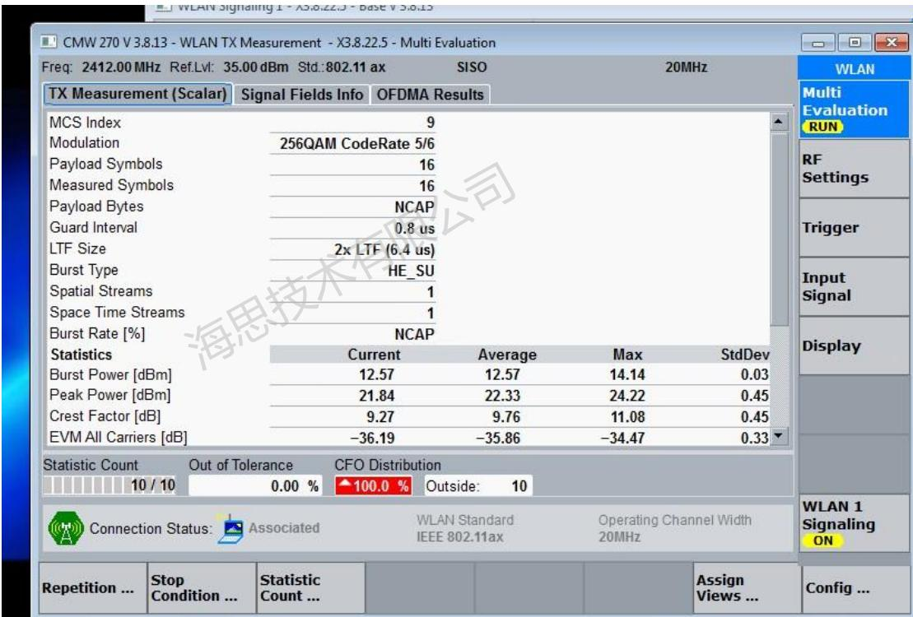

---

### OTA 测试中通过更改仪表配置来优化 TIS 值

问题描述: 【WS63】OTA 测试时，在不改变板级状态的条件下，可以通过更改仪表配置或者自动化设置来优化提升 TIS 值吗？

**解决方案：**

仪表自动化配置：

INTERVAL: 下行配置建议≥1ms

PAYLOAD SIZE: 下行配置建议设置 500

DTM信令测试

FRAME COUNT: 下行配置建议≥500

CELL POWER: 11b 建议-60db

11g/n 建议-50db

11ax 建议-40db

---

### 信令测试 RX 强信号场景下出现丢包

问题描述：【WS63】Wi-Fi 11b 信令测试过程中，发现在-40dbm 的强信号下，都会有丢包。

**解决方案：**

在排除环境干扰的情况下，BLE 广播会影响WIFI 的丢包，强信号下会有大概 2% 左右的丢包。

通过软件控制来关闭 BLE 广播会避免此类情况，另外，不关闭的情况下，有 2% 左右的丢包，对极限灵敏度的影响较小。

---

### 如何进行 BLE 信令测试

问题描述: 【WS63】如何使用 CMW500 进行 BLE 信令测试。

**解决方案：**

BLE射频测试CMW500操作

1、搭建环境：
①DTM测试需要独立的HCI固件
②DUT串口直接连接到仪表上

2、配置基础选项  
仍选择BLE测试  
在配置界面依次如下选择

  
注：如果使用USB转TTL串口小板连接仪表，仪表需要安装对应的驱动，否则仪表无法识别断开

**BLE射频测试CMW500操作DTM信令测试**

3、Connect Check反馈 LE comm test passed后可开始进行TX、RX测试


4、点击RF Settings在下方配置TX测试参数，或在Cofing中设置

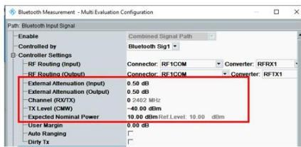

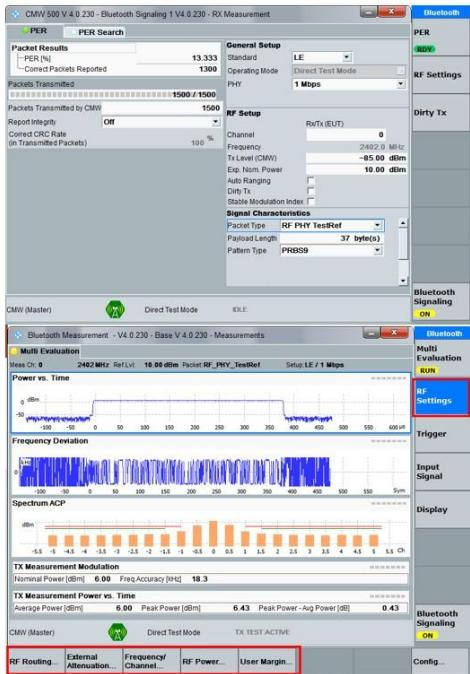

---

### BLE 测试功率值偏差太大问题

问题描述：【WS63】BLE 测试中，校准正常，但有时候BLE 功率值偏差太大（目标功率 6，实测只有 3 点几），是什么原因？

**解决方案：**

上电时未接负载或者仪表会导致上电初始化时射频匹配阻抗不是 $50\Omega$ ，因此造成功率偏差较大，

所以在测试 BLE 功率时，必须确保模组或芯片上电时已经接好 50Ω 负载或者仪表，此时 BLE 功率波动在 ±2db 以内。

---

## 产线测试

WS63 生产测试（产线）中的温补参数、产测上位机调试与板载天线功率校准等常见问题。

---

### 温补参数写入后没有生效

问题描述：【WS63】测试温补频偏参数时，按照手册测试得出数据后写入 nv 中，写入成功，读取正常。但是测试显示补偿前和补偿后没有变化；例如

补偿前用 cwm500 测得频偏 14ppm, 补偿后重启测得频偏还是 14ppm。

**解决方案：**

执行AT+CCPRIV=wlan0,set_mfg_debug_mode,1，产线版本默认不支持频偏温补功能，测试高低温频偏温补功能时，需要配置该命令进入调试模式；同时使用上位机测试频偏时（非产测生产，仅用作研发测试），也需要将此命令加入到flow当中。


可以参考交付件里《WS63V100 软件开发指南》中 2.6 章节的内容，常用就是 target_power 是不同协议速率下的目标功率，limit_power 是按照信道划分的限制功率。

---

### 极致汇仪如何开启 debug

问题描述：【WS63】使用极致汇仪产测软件遇到测试 Fail 时，如何使用极致汇仪的 debug 功能来查看下发指令及回显是否正确呢？

**解决方案：**

**步骤 1** 向极致汇仪申请对应极致汇仪仪表型号、SN 号、及对应芯片型号（例如，73，63，53）的产测上位机的 debug key，将该 key 放到极致汇仪上位机的根目录下即可

**步骤 2** 修改极致汇仪上位机根目录下的 debug.ini 文件，将 print_send 和 print_receive 修改成 1 后保存。

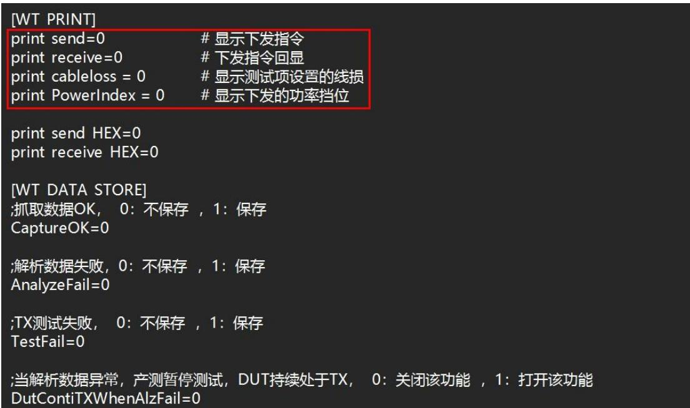

**步骤 3** 重启上位机即可。

---

### 板载天线的模组在生产时如何校准

问题描述：【WS63】板载天线的模组在生产时如何进行较为准确的功率校准。

**解决方案：**

**步骤 1** 将贴片完成模组的随机抽取 5pcs 作为金板，将其板载天线断开后，焊接同轴线缆进行功率校准。

**步骤 2** 功率校准完成后，进行功率复测，将产线上会用到的信道进行功率测试，记录基准值。

**步骤 3** 将5pcs模组的板载天线重新焊接回去，然后放入产线生产工装内进行产线工装整体的线损校准，记录测量值，

**步骤 4** 基准值减去测量值得到测试信道在工装上的功率误差，计算 5pcs 模组功率误差平均值。

**步骤 5** 将功率误差补到产线工装上后进行生产测试，产测过程中可抽测模组验证功率校准是否准确。

下图可做参考：


