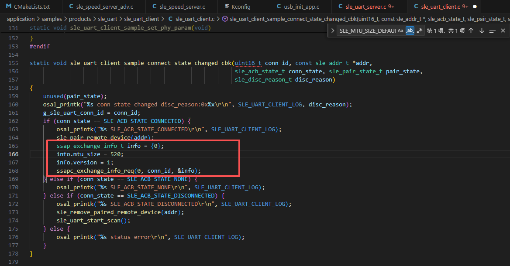
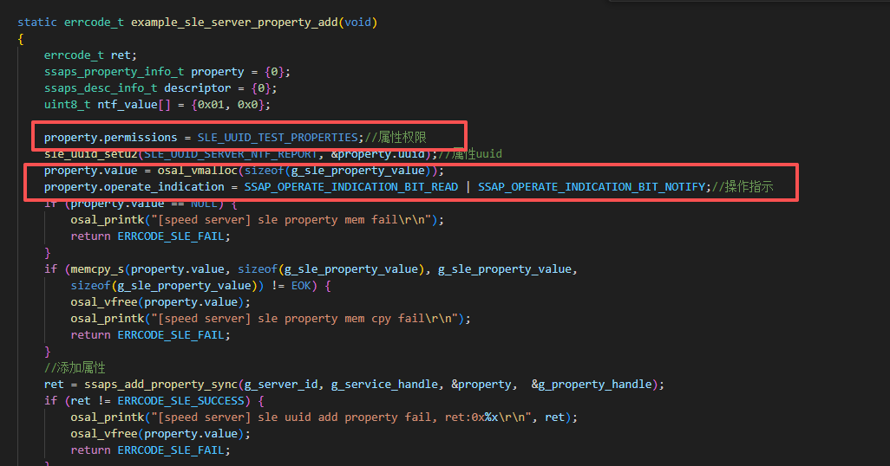
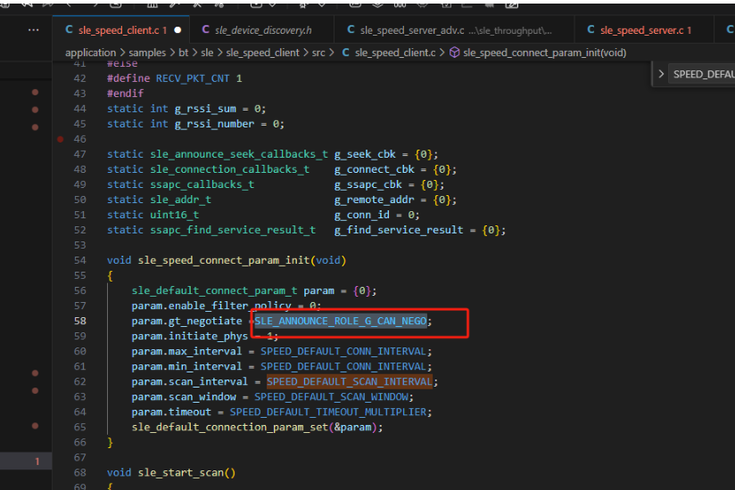
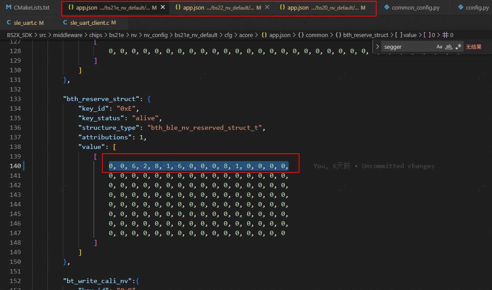
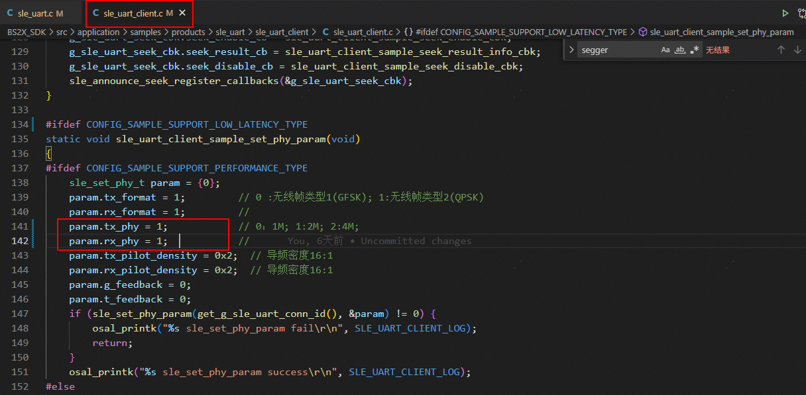

# 无线通信

WS63 Wi-Fi、BLE、SLE（星闪）无线通信场景下的常见问题。

## Wi-Fi

---

### 扫描失败问题

问题描述：【WS63】扫描过程中，"<SCAN RESULT>:"有扫描结果，但最终显示扫不到对应AP信息，或者"<SCAN RESULT>:"中无结果。

**说明**

有扫描结果指的是 "<SCAN RESULT>:" 中存在其他 ssid，不是指要关联的 AP 在 "<SCAN RESULT>:" 中。

**解决方案：**

#### 可能原因

- AP 所在信道在非管制域信道范围内；

- 周围环境存在超过32个AP信息，而要扫描的AP信号强度较弱；

- STA 扫描时间太短;

#### 定位步骤

**步骤 1** 通过查看 "<SCAN RESULT>:" 中是否存在 ssid 等信息

- 执行 AT+SCANRESULT 命令查看 "<SCAN RESULT>:" 是否存在 AP 信息，若未存在任何 AP 信息，查看日志是否有ERROR 类型日志，进而判断扫描异常阶段；若 "<SCAN RESULT>:" 中存在 AP 信息，进入步骤 2 分析；

**说明**

AT 命令详细介绍请参考《WS63V100 AT 命令使用指南》，检查 "<SCAN RESULT>:" 中 AP 数量

**步骤 2** 根据信号强度排序，最多记录 32 个 AP，当要扫描的 AP 信号较弱时，可能被过滤，

因此不会被上报"<SCAN RESULT>:"中。

- 检查是否含有32个AP信息

- 如果含有 32 个 AP 信息，执行 AT+SCANSSID 命令指定 SSID 扫描，观察是否能扫描到该 AP，若未能扫描到，进入步骤 3 分析；

- 如果少于32个AP信息，则进入步骤3分析；

**步骤 3** 检查 AP 所在信道是否在管制域范围

- 如果 AP 为路由器，查看路由器配置界面，确定路由器所在信道；

- 执行AT+STASTAT命令查看AP的"channel"信息。

+STASTAT: <status>,<ssid>,<bssid>,<chn>,<rssi>

若 AP 所处信道未在管制域范围内，可寻求开发人员定位；若 AP 所处信道在管制域范围内，则进入步骤 4 分析。

**步骤 4** 抓包查看报文交互流程

通过 Omnipeek 或 WireShark 等抓包软件抓包分析：

1、抓取AP的beacon帧，确认AP是否工作正常。

2、抓取STA的Probe Request报文，确认STA扫描请求是否正常。

3、抓取AP的Probe Response报文，确认AP扫描响应是否正常。

**步骤 5** 通过抓包分析，如果 STA 和 AP 报文交互正常还扫不到AP，确认是否STA 扫描时间太短；通过 wifi_sta_set_scan_policy 接口修改 scan_cnt(发送 Probe Request 报文次数)和 scan_time(两次 Probe Request 报文的间隔时间)，每个信道扫描总时间 (scan_cnt*scan_time) 建议不小于 102.4ms。

---

### 关联失败问题

问题描述：【WS63】STA 关联 AP 失败，STA 没有收到关联响应或收到 AP 关联响应报文携带错误码、AP 去关联报文、AP 去认证报文。

**解决方案：**

#### 可能原因

- 密码格式错误;

- 被 AP 拉黑;

#### 定位步骤

**步骤 1** 检查扫描结果

详情见 [扫描失败问题](#扫描失败问题) 故障定位指导，分析原因。

**步骤 2** 检查 AP 端状态

(1) 检查 AP 黑名单：登录 AP 配置界面，查看 AP 黑名单中是否有 STA 的 MAC 地址，若有，尝试将该 MAC 地址移除黑名单，重新尝试关联。

**(2) 检查PMF状态：**

登录 AP 配置界面，若 AP 为强制 PMF 加密方式，可尝试执行

"AT+STARTSTA=1,1"命令，在起STA时，强制启动PMF尝试关联。

**说明**

AT 命令：AT+STARTSTA=[<protocol_mode>],[<pmf>]，其中<pmf>为管理帧保护策略，默认为1，表示 PMF 自适应，AT 命令详情使用请参考《WS63V100 AT 命令使用指南》

**(3) 检查加密方式**

- 若 AP 为 OPEN 方式，关联时不需要设置密钥；

- 若 AP 为 WPA/WPA2/WPA3/WAPI/WEP 等加密方式，进入步骤 3 分析。

**步骤 3** 检查密钥格式（AP 为 WPA/WPA2/WPA3/WAPI/WEP 等加密方式

(1) 确定密钥长度，如WEP加密只支撑5/10/13/26位密钥长度；

(2) 确定密钥是否含有特殊字符、大小写、以及中文字符;

(3) 确定密钥类型是否正确，例如AP 配置为ASCII/HEX 类型，关联时使用

HEX/ASCII 类型密钥;

若检查以上内容无误，进入步骤 4 分析。

**步骤 4** 检查报文交互流程

场景一：AUTH 报文交互失败

- 查看 AUTH 报文的 STATUS CODE，确定原因，如表 1 所示；

表1-2 Status Code

<table>
  <tr>
    <td>Status Code</td>
    <td>Name</td>
    <td>Meaning</td>
  </tr>
  <tr>
    <td>0</td>
    <td>SUCCESS</td>
    <td>Successful</td>
  </tr>
  <tr>
    <td>14</td>
    <td>TRANSACTION_SEQUENCE_ERROR</td>
    <td>Received an Authentication frame with authentication transaction sequence number out of expected sequence.</td>
  </tr>
  <tr>
    <td>16</td>
    <td>REJECTED_SEQUENCE_TIMEOUT</td>
    <td>Authentication rejected due to timeout waiting for next frame in sequence.</td>
  </tr>
  <tr>
    <td>30</td>
    <td>REFUSED_TEMPORARILY</td>
    <td>Association request rejected temporarily; try again later.</td>
  </tr>
  <tr>
    <td>126</td>
    <td>SAE_HASH_TO_ELEMENT</td>
    <td>SAE authentication uses direct hashing, instead of looping, to obtain the PWE.</td>
  </tr>
</table>

**说明**

表 1 列出的 Status Code 为常见类型，完整的 Status Code 可查看 802.11 标准协议。

场景二：ASSOC 报文交互失败

- 查看 AP 回复的 Assoc Rsp 报文中的 status code，分析原因，详细 status code 参考表 1;

## BLE

---

### 手机扫不到 BLE 广播信号

问题描述：【WS63】使用 AT 命令配置 BLE 广播功能，配置完成后使用手机扫描 BLE 信号，扫不到配置的 BLE 信号：

```ini
[15:54:04.557]发→◇AT+BLEENABLE
[15:54:04.559]收←◆AT+BLEENABLE
[ACore] ble enable cbk in, event:b
OK

[15:54:07.908]发→◇AT+BLESETADDR=0, 0x112233445566
[15:54:07.911]收←◆AT+BLESETADDR=0, 0x112233445566
OK

[15:54:10.658]发→◇AT+BLESETNAME=9, atcmdtest
[15:54:10.662]收←◆AT+BLESETNAME=9, atcmdtest
OK

[15:54:16.450]发→◇AT+BLESETAPPEARANCE=961
[15:54:16.454]收←◆AT+BLESETAPPEARANCE=961
OK

[15:54:18.419]发→◇AT+BLESETADVDATA=6, 0x112233445566, 0, 0, 1
[15:54:18.423]收←◆AT+BLESETADVDATA=6, 0x112233445566, 0, 0, 1
OK

[15:54:20.475]发→◇AT+BLESETADVPAR=48, 48, 0, 0x112233445577, 0, 0x112233445566, 7, 0, 1, 0, 1
[15:54:20.481]收←◆AT+BLESETADVPAR=48, 48, 0, 0x112233445577, 0, 0x112233445566, 7, 0, 1, 0, 1
[ACore] ble set adv param min_interval:0x30, max interval:0x30, adv_type:0, duration:0
[ACore] ble set adv param, own addr:0x11:**:**:**:55:77
[ACore] ble set adv param, peer addr:0x11:**:**:**:55:66
OK

[15:54:23.547]发→◇AT+BLESTARTADV=1
[15:54:23.552]收←◆AT+BLESTARTADV=1
[ACore] gap ble start adv in, adv_id:1
OK
```

**解决方案：**

使用BLE抓包卡进行抓包，能够抓到BLE广播报文，但手机BLE扫描界面扫不到信号，大概率是手机无法解析广播数据。

把 AT + BLESETADVDATA = 6,0x112233445566,0,0,1 改成 AT + BLESETADVDATA = 0,0,0,0,1，BLE 广播不带数据，手机就能扫到配置 BLE 信号。

## SLE

---

### SLE 覆盖距离和连接距离不一致

问题描述：【WS63】SLE 拉距测试，通讯距离空旷条件下 200 百米以上才会断开连接，重新连接就得到 100 米内才可连接上，连接距离远小于业务覆盖距离。

**解决方案：**

BLE 和 SLE 有 2 个功率配置：1 个是 NV 中的功率 TPC code，NV 中的功率控制除广播外的报文功率；另 1 个是广播报文发射功率，配置是通过 UAPI 接口或 AT 配置命令设置。NV 中配置 TPC Code 为 7，NV 中的发射功率是 20dbm，但广播报文发射功率配置为 10dbm，由于广播功率比 NV 中的功率小，导致连接距离比覆盖距离小。

调整广播功率，保持和NV中的功率一致，连接距离和覆盖距离一致。

---

### SLE client 设置 MTU 到 520，实际最多只到 251

sle 案例中，client 端设置 MTU 到 520，最后实际最多到 251 的情况，如下图：




**解决方案：**

- server 端与 client 端设置的 MTU 需保持一致。建立连接配对后，Client 和 Server 端会对 MTU Size 进行交换，使用更小的 MTU Size 作为 MTU 大小。如果 Server 端没有设置 MTU 的话，默认为最小值。
- 你可以在 Server `sle_pair_complete_cbk` 中设置一个 Server 的 `MTU Size = 520`，这样 Client 设置 520 后，MTU 就会是 520：

```c
ssap_exchange_info_t info = {0};
info.mtu_size = 520;
info.version = 1;
ssaps_set_info(0, &info);
```

默认的 SLE Uart 案例没有设置 Server 端的 MTU Size，需要手动设置一下。

原帖：<https://developers.hisilicon.com/postDetail?tid=02178214214394841015>

---

### server 端 notify/indicate，client 的 notification_cb 没有响应

sle 案例中，sle 连接后，client 用 `ssapc_write_cmd` 发，server 可以收到；反过来用 `ssaps_notify_indicate` 发，client 的 `notification_cb` 没有响应的情况。

**解决方案：**

添加操作指示权限，如下图：



---

### sle 通信出现频繁断连重连现象


**解决方案：**

- 服务端：加入销毁线程函数，防止重复创建线程，修改如下图：


- 客户端：修改如下图：



---

### BS22 里 sle_uart 的低延时跑流不成功

**解决方案：**

- 修改 nv：



- phy 改小到 1M：



- 数据长度改小到 30：


---

### WS63 服务端通过 indicate 给客户端发送没有反应


---
