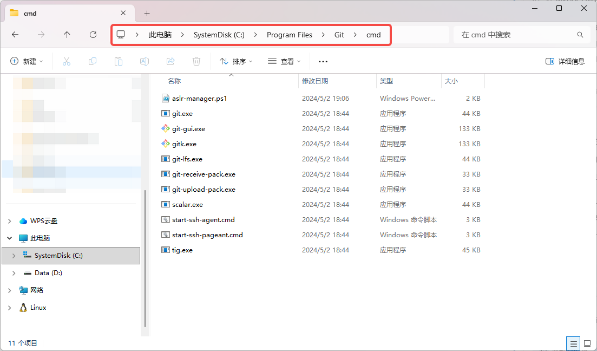
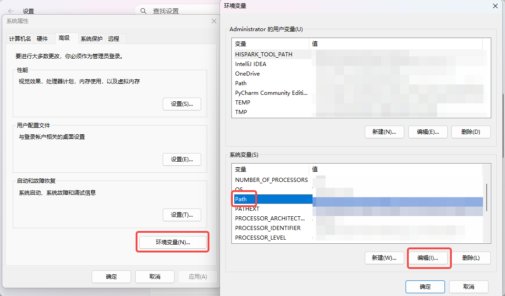
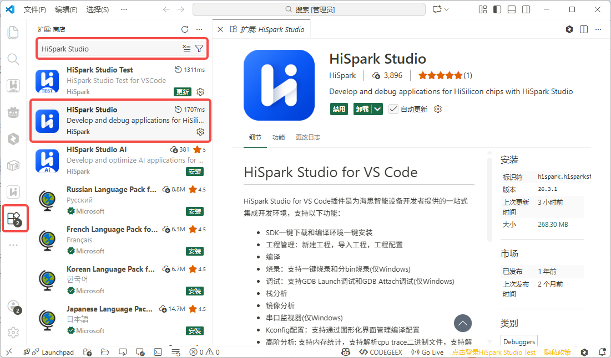
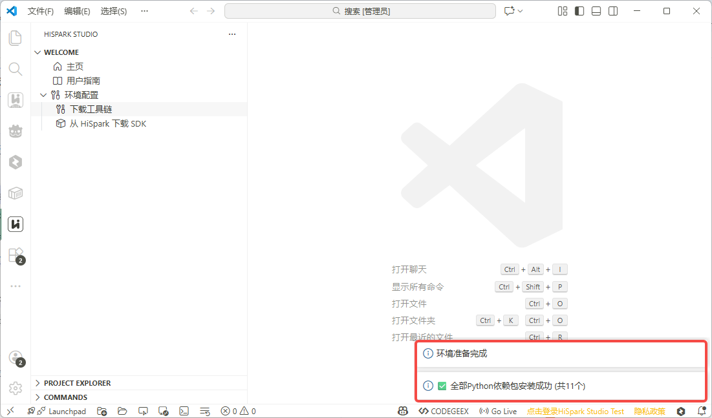
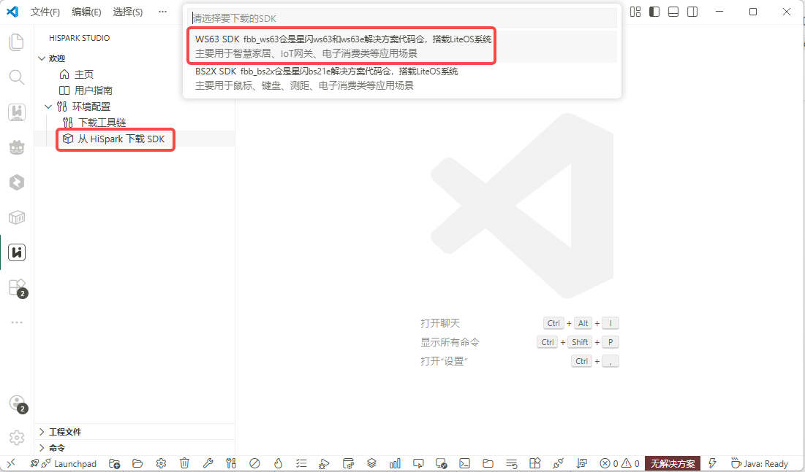
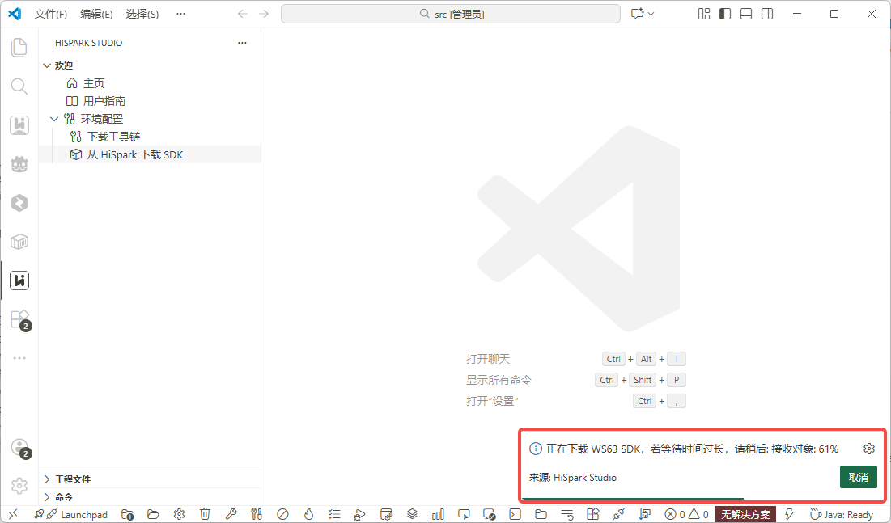
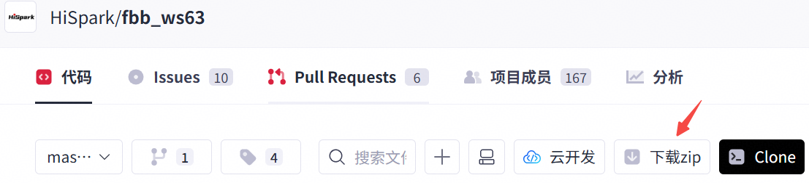

# 环境搭建

本文档介绍如何在 Windows 系统上搭建 WS63 系列开发环境，包括安装 IDE (Integrated Development Environment)、配置工具链、获取 SDK以及验证环境。

## 环境要求

| 项目 | 要求 |
|------|------|
| 操作系统 | 64位 Windows 10 或 Windows 11 |
| VS Code | 1.85.0 及以上 |
| 硬盘空间 | 至少 900MB（安装 HiSpark Studio 插件） |
| 内存 | 最低 1GB RAM (Random Access Memory)，建议 4GB 及以上 |
| CPU | 1.6GHz 或更高 |
| C盘空间 | 建议至少 1GB 剩余空间 |
| 网络 | 需要网络连接（下载工具链和 SDK） |

## 开发板选型

请参考[开发板选型](board-introduction.md){ target=_blank }选择合适的开发板。

## 硬件配件

| 物品             | 用途               | 获取方式    |
| -------------- | ---------------- | ------- |
| Type-C USB (Universal Serial Bus) 数据线 | 连接开发板与电脑，用于供电和烧录 | 开发板通常自带 |

## 安装串口驱动

开发板通过 USB 转串口（USB-TTL）与电脑通信，用于烧录固件和串口调试。需安装 CH341SER 驱动才能使电脑识别开发板的串口。

访问 [CH341SER 驱动下载](https://www.wch.cn/downloads/CH341SER_EXE.html){ target=_blank } 下载驱动包，双击进行安装。

## 安装 VS Code

1. 下载并安装最新版的 [Visual Studio Code](https://code.visualstudio.com/Download){ target=_blank }。

2. 安装简体中文语言包 （可选），打开 VS Code，进入扩展市场（快捷键 `Ctrl+Shift+X`），搜索 `Chinese` 选择中文简体插件并安装，安装完成后重启 VS Code 即可使用中文界面。本文以 VS Code 中文界面为例

    

## 安装 Git

HiSpark Studio 插件`从 HiSpark 下载 SDK` 功能依赖 Git 命令工具，请先确认电脑已安装 Git，如已安装可跳过此步骤。

### 下载安装 Git

1. 访问 [Git for Windows](https://git-scm.com/install/windows){ target=_blank } 下载安装包

2. 下载完成后运行安装程序，按提示完成安装

### 配置环境变量

当前步骤以 Windows 11 为示例，图片示例内容以实际显示为准，安装完成后，需要将 Git 安装路径添加到系统环境变量 `PATH` 中：

1. 找到 Git 安装目录（默认为 `C:\Program Files\Git\cmd`），点击文件夹地址栏，复制路径，以实际安装路径为准，替换以下步骤中的路径

    
    
2. 使用快捷键 `win + E` 打开文件资源管理器，右键左侧 `此电脑` 后选择 `属性`

    

3.  选择 `高级系统设置`

    

4.  打开 `环境变量` 配置窗口，选择 `Path` 后点击 `编辑`

    

5. 点击 `新建`，粘贴 Git 安装路径，点击 `确定` 完成配置

    

### 验证安装

打开cmd命令提示符，快捷键 `win + R`，输入 `cmd`，点击 `确定`，执行命令 `git --version` 验证 Git 是否安装成功：

```cmd
git --version
:: 输出示例: git version 2.47.1.windows.1
```

## 安装 HiSpark Studio 插件

WS63 开发推荐使用 `HiSpark Studio for VS Code` 插件，提供代码编辑、编译、烧录和调试等一站式开发环境。

1. 打开 VS Code
2. 进入扩展市场（快捷键 `Ctrl+Shift+X`），搜索 `HiSpark Studio`，然后选择安装 HiSpark Studio 插件

    

3. 安装完成后，左侧活动栏会出现 HiSpark Studio 图标，点击即可进入插件界面。

    

## 安装工具链

HiSpark Studio 插件编译工程需要依赖工具链、Python 及 pip 依赖环境，可通过以下步骤下载安装。


1. 点击左侧 HiSpark Studio 图标，进入插件界面，点击 `下载工具链`，弹出窗口后选择保存的目录（目录层级不要过深，不包含中文字符），点击`选择保存位置`开始下载

    

2. 安装过程会依次下载以下内容：

    | 安装项 | 说明 |
    |--------|------|
    | Python 3.11.4 | 嵌入式 Python 环境 |
    | pip 依赖 | wheel、setuptools、cmake、kconfiglib、pycparser、pillow、numpy、opencv\-python、windows\-curses、ffmpeg\-python、pyelftools、openpyxl、pandas以及tkinter-embed |
    | 编译工具链 | RISC-V 交叉编译工具链及其他 tools |

3. 自动安装完成后，界面右下角会提示`环境准备完成`

    

> 注意：
> 
>    - 如果自动安装工具链时 Python 安装失败，通常是网络不通或本地代理问题，请更换网络或修改代理后重试
>    - 如果提示依赖下载失败，可重复操作 `下载工具链` 进行重试
>    - 尝试多次依旧下载失败，可尝试手动安装工具链，参考 [工具链toolchain配置](../tools/HiSparkStudioforVSCodeUserGuide/HiSparkStudioforVSCodeUserGuide.md#工具链toolchain配置){ target=_blank } 中的“手动配置toolchain环境”说明


## 获取 SDK

### 方法一：通过 HiSpark Studio 插件下载（推荐）

> 需要先安装 Git 命令工具，参考 [安装 Git](#安装 Git)

1. 在 HiSpark Studio 插件页面点击 `从 HiSpark 下载 SDK`，在弹出的下载列表中选择 `WS63 SDK`

    

2. 选择 SDK 保存位置（建议选择空文件夹，路径不要太深，不包含中文）

    

3. 右下角会显示下载进度提示，等待下载完成

    

### 方法二：手动下载

1. 访问 [fbb\_ws63](https://gitcode.com/HiSpark/fbb_ws63){ target=\_blank } 代码仓页面，点击`下载zip`按钮直接下载 SDK 压缩包。

    

2. 下载完成后，需手动将 SDK 压缩包解压到本地目录（目录层级不要过深，不包含中文字符）

## 快速开始

环境已搭建完成，快速开始第一个程序：[快速开始](quick-start.md)


## 常见问题

#### Q: "端口无法识别？"
A: 确保驱动安装成功，尝试重新插拔 USB 线，重启设备管理器。检查设备管理器中是否出现 CH340 设备。

#### Q: "烧录失败？"
A: 根据错误信息，尝试以下步骤：
1. 确认开发板已进入烧录模式
2. 检查串口连接是否正确
3. 确认串口驱动已正确安装
4. 尝试更换 USB 线或端口

---

> **提示**：如需更详细的工具使用说明，请参考 [HiSpark Studio for VS Code 使用指南](../tools/HiSparkStudioforVSCodeUserGuide/HiSparkStudioforVSCodeUserGuide.md)
