# 硬件用户指南

本文档主要介绍 WS63V100 系列芯片的封装管脚信息、电气特性参数、原理图设计建议、PCB 设计建议、热设计建议、焊接工艺、潮敏参数、接口时序、注意事项等内容。

本文主要为技术服务工程师提供硬件设计的参考。

## 封装与管脚

### 封装与管脚分布

#### 封装

WS63V100 系列芯片采用 QFN40 封装，封装尺寸为 5mm × 5mm ，管脚间距为 0.4mm，详细封装请参见图 1-1、图 1-2 和图 1-3。

图1-1 芯片封装顶视图  
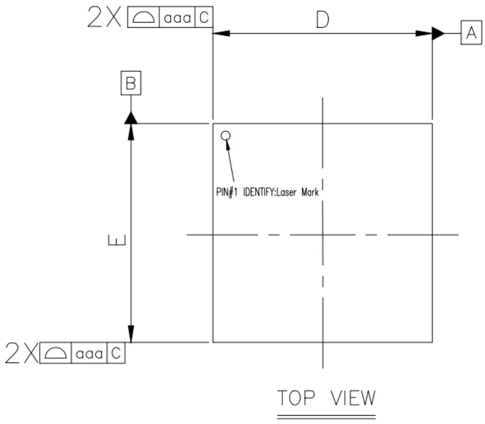

图1-2 芯片封装底视图  
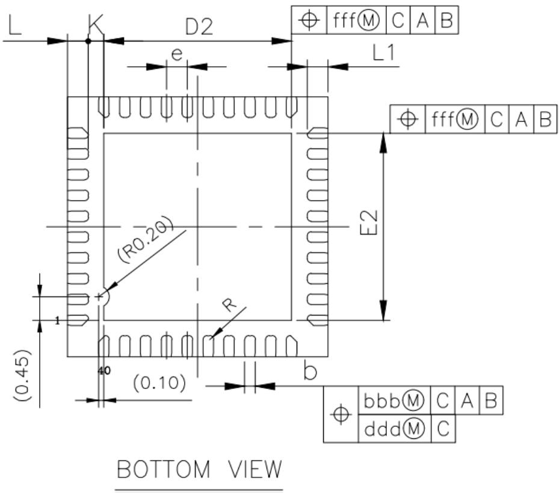

图1-3 芯片侧面放大图  
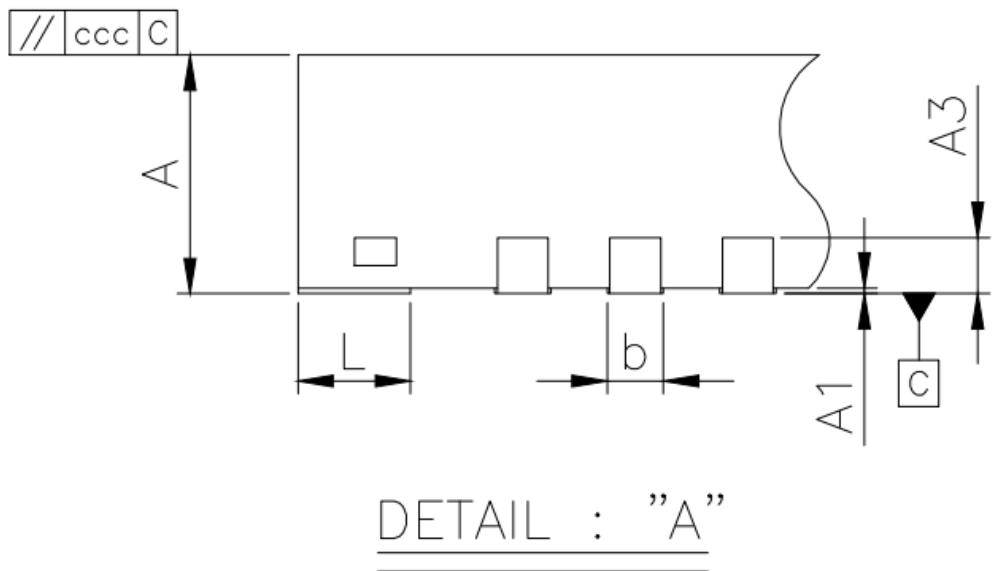  
芯片封装尺寸参数如表 1-1 所示。

表1-1 芯片封装参数说明表

| 参数 | 最小值(mm) | 典型值(mm) | 最大值(mm) | 最小值(inch) | 典型值(inch) | 最大值(inch) |
| ---- | ---------- | ---------- | ---------- | ------------ | ------------ | ------------ |
| A    | 0.85       | 0.90       | 0.95       | 0.033        | 0.035        | 0.037        |
| A1   | 0.00       | 0.02       | 0.05       | 0.000        | 0.001        | 0.002        |
| A3   | 0.20 REF   |            |            | 0.008 REF    |              |              |
| b    | 0.15       | 0.20       | 0.25       | 0.006        | 0.008        | 0.010        |
| D    | 4.90       | 5.00       | 5.10       | 0.193        | 0.197        | 0.201        |
| E    | 4.90       | 5.00       | 5.10       | 0.193        | 0.197        | 0.201        |
| D2   | 3.50       | 3.60       | 3.70       | 0.138        | 0.142        | 0.146        |
| E2   | 3.50       | 3.60       | 3.70       | 0.138        | 0.142        | 0.146        |
| e    | 0.40 BSC   |            |            | 0.016 BSC    |              |              |
| L    | 0.30       | 0.40       | 0.50       | 0.012        | 0.016        | 0.020        |
| L1   | 0.30       | 0.40       | 0.50       | 0.012        | 0.016        | 0.020        |
| K    | 0.20       |            |            | 0.008        |              |              |
| R    | 0.08       | -          | 0.13       | 0.003        | -            | 0.005        |
| aaa  | 0.10       |            |            | 0.004        |              |              |
| bbb  | 0.07       |            |            | 0.003        |              |              |
| ccc  | 0.10       |            |            | 0.004        |              |              |
| ddd  | 0.05       |            |            | 0.002        |              |              |
| eee  | 0.08       |            |            | 0.003        |              |              |
| fff  | 0.10       |            |            | 0.004        |              |              |

#### 管脚分布

WS63V100 系列芯片管脚分布如图 1-4 和图 1-5 所示。  
图1-4 WS63V100 TOP View 管脚分布
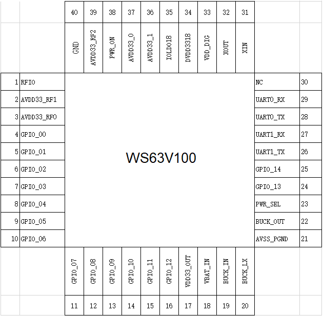

图1-5 WS63EV100 TOP View 管脚分布

!!! note "说明"

    WS63V100 常规版本芯片 PIN40 管脚为 GND，WS63EV100 雷达版本芯片 PIN40 管脚为 RFI。

### 管脚描述

#### 管脚类型说明

管脚 I/O 类型说明如表 1-2 所示。

表1-2 管脚 I/O 类型说明

| I/O             | 说明                                   |
| --------------- | -------------------------------------- |
| I               | 输入信号。                             |
| IPD        | 输入信号,内部下拉。                    |
| IPU        | 输入信号,内部上拉。                    |
| IS         | 输入信号,带施密特触发器。              |
| ISPD       | 输入信号,带施密特触发器,内部下拉。     |
| ISPU       | 输入信号,带施密特触发器,内部上拉。     |
| O               | 输出信号。                             |
| OOD        | 输出,漏极开路。                        |
| I/O             | 双向输入/输出信号。                    |
| IPD/O      | 双向,输入下拉。                        |
| IPU/O      | 双向,输入上拉。                        |
| ISPD/O     | 双向,输入下拉,带施密特触发器。         |
| ISPU/O     | 双向,输入上拉,带施密特触发器。         |
| IPD/OOD | 双向,输入下拉,输出漏极开路。           |
| IPU/OOD | 双向,输入上拉,输出漏极开路。           |
| IS/O       | 双向,输入带施密特触发器。              |
| IS/OOD  | 双向,输入带施密特触发器,输出漏极开路。 |
| CIN             | Crystal Oscillator:晶振输入。          |
| COUT            | Crystal Oscillator:晶振输出。          |
| P               | 电源。                                 |
| PI              | 电源输入。                             |
| PO              | 电源输出。                             |
| GND             | 地。                                   |

#### 管脚排列表

WS63V100 系列芯片采用的封装形式为 QFN 40PIN，管脚按位置排列如表 1-3 所示。

表1-3 WS63EV100 芯片管脚排列

| 位置 | 管脚名称   | 位置 | 管脚名称     |
| ---- | ---------- | ---- | ------------ |
| 1    | RFIO       | 22   | BUCK_OUT     |
| 2    | AVDD33_RF1 | 23   | PWR_SEL      |
| 3    | AVDD33_RF0 | 24   | GPIO_13      |
| 4    | GPIO_00    | 25   | GPIO_14      |
| 5    | GPIO_01    | 26   | UART1_TX     |
| 6    | GPIO_02    | 27   | UART1_RX     |
| 7    | GPIO_03    | 28   | UART0_TX     |
| 8    | GPIO_04    | 29   | UART0_RX     |
| 9    | GPIO_05    | 30   | NC(保持悬空) |
| 10   | GPIO_06    | 31   | XIN          |
| 11   | GPIO_07    | 32   | XOUT         |
| 12   | GPIO_08    | 33   | VDD_DIG      |
| 13   | GPIO_09    | 34   | DVDD3318     |
| 14   | GPIO_10    | 35   | IOLDO18      |
| 15   | GPIO_11    | 36   | AVDD33_1     |
| 16   | GPIO_12    | 37   | AVDD33_0     |
| 17   | VDD33_OUT  | 38   | PWR_ON       |
| 18   | VBAT_IN    | 39   | AVDD33_RF2   |
| 19   | BUCK_IN    | 40   | RFI          |
| 20   | BUCK_LX    | EPAD | GND          |
| 21   | AVSS_PGND  | -    | -            |

!!! note "说明"

    - WS63V100 常规版本芯片 PIN40 管脚为 GND，板级可选择接地或 NC 悬空。

#### PMU 控制信号

全局控制信号如表 1-4 所示。

表1-4 全局控制信号管脚列表

<table><tr><th>PIN</th><th>名称</th><th>类型</th><th>电平(V)</th><th>说明</th></tr><tr><td>38</td><td>PWR_ON</td><td>I</td><td>3.3/1.8</td><td>PMU 上电使能管脚(跟随DVDD3318 电平)。 0:下电; 1:上电。</td></tr><tr><td>23</td><td>PWR_SEL</td><td>I</td><td>3.3</td><td>VBAT_IN 电源方案选择管脚。 0:VBAT_IN 采用 5V 供电; 1:VBAT_IN 采用 3.3V 供电。</td></tr></table>

#### GPIO 管脚

GPIO 接口如表 1-5 所示。

表1-5 GPIO 管脚列表

| PIN | 名称    | 类型 | 电平(V) | 说明                           |
| --- | ------- | ---- | ------- | ------------------------------ |
| 4   | GPIO_00 | I/O  | 3.3/1.8 | 通用 GPIO。                    |
| 5   | GPIO_01 | I/O  | 3.3/1.8 | 通用 GPIO,管脚禁止加上拉电阻。 |
| 6   | GPIO_02 | I/O  | 3.3/1.8 | 通用 GPIO。                    |
| 7   | GPIO_03 | I/O  | 3.3/1.8 | 通用 GPIO。                    |
| 8   | GPIO_04 | I/O  | 3.3/1.8 | 通用 GPIO。                    |
| 9   | GPIO_05 | I/O  | 3.3/1.8 | 通用 GPIO。                    |
| 10  | GPIO_06 | I/O  | 3.3/1.8 | 通用 GPIO。                    |
| 11  | GPIO_07 | I/O  | 3.3/1.8 | 通用 GPIO。                    |
| 12  | GPIO_08 | I/O  | 3.3/1.8 | 通用 GPIO。                    |
| 13  | GPIO_09 | I/O  | 3.3/1.8 | 通用 GPIO,管脚禁止加上拉电阻。 |
| 14  | GPIO_10 | I/O  | 3.3/1.8 | 通用 GPIO。                    |
| 15  | GPIO_11 | I/O  | 3.3/1.8 | 通用 GPIO,管脚禁止加上拉电阻。 |
| 16  | GPIO_12 | I/O  | 3.3/1.8 | 通用 GPIO。                    |
| 24  | GPIO_13 | I/O  | 3.3/1.8 | 通用 GPIO。                    |
| 25  | GPIO_14 | I/O  | 3.3/1.8 | 通用 GPIO。                    |

#### 电源管脚

电源管脚如表 1-6 所示。

表1-6 电源管脚列表

| PIN | 名称       | 类型  | 电压(V) | 说明                                                                                                                                |
| --- | ---------- | ----- | ------- | ----------------------------------------------------------------------------------------------------------------------------------- |
| 2   | AVDD33_RF1 | PI    | 3.0~3.6 | RF 电源输入,外接滤波电容 1μF。                                                                                                      |
| 3   | AVDD33_RF0 | PI    | 3.0~3.6 | RF 电源输入,外接滤波电容 1μF。                                                                                                      |
| 17  | VDD33_OUT  | PI/PO | 3.0~3.6 | 芯片采用 VBAT_IN 5V 供电时,该管脚作为 3.3V 电源输出;芯片采用 VBAT_IN 3.3V 供电时,该管脚作为 3.3V 电源输入。管脚外接滤波电容 4.7μF。 |
| 18  | VBAT_IN    | PI    | 3.3/5   | 电源输入,可选择 5V 或 3.3V 供电,外接滤波电容 10μF。                                                                                 |
| 19  | BUCK_IN    | PI    | 3.0~3.6 | 电源输入,外接滤波电容 4.7μF。                                                                                                       |
| 20  | BUCK_LX    | -     | -       | LDO 方案下接电源(3.3V),BUCK 方案下接电感,外接 2.2uH 电感。                                                                          |
| 22  | BUCK_OUT   | PO    | 0.9     | 芯片内部 BUCK 输出,BUCK 电源方案下外接滤波电容 10μF,LDO电源方案下悬空。                                                             |
| 33  | VDD_DIG    | PO    | 0.9     | 芯片内部电源输出,BUCK 电源方案下悬空,LDO 电源方案下外接滤波电容 1μF。                                                               |
| 34  | DVDD3318   | PI    | 3.3/1.8 | IO 电源输入,外接滤波电容 4.7μF。                                                                                                    |
| 35  | IOLDO18    | PI/PO | 1.8     | IO 电源输入为 3.3V 时,IOLDO 输出 1.8V;IO 电源输入为 1.8V 时,IOLDO 需输入 1.8V 电源。引脚外接滤波电容 1μF。                          |
| 36  | AVDD33_1   | PI    | 3.0~3.6 | 电源输入,外接滤波电容 2.2μF。                                                                                                       |
| 37  | AVDD33_0   | PI    | 3.0~3.6 | 电源输入,外接滤波电容 1μF。                                                                                                         |
| 39  | AVDD33_RF2 | PI    | 3.0~3.6 | RF 电源输入,外接滤波电容 1μF。                                                                                                      |

#### RF 接口

RF 接口如表 1-7 所示。

表1-7 RF 接口管脚列表

| PIN | 名称 | 类型 | 电平(V) | 说明                     |
| --- | ---- | ---- | ------- | ------------------------ |
| 1   | RFIO | ANA  | -       | WLAN 2.4G RF 输入/输出。 |
| 40  | RFI  | ANA  | -       | WS63E 芯片雷达天线输入。 |

#### GND 管脚

GND 管脚如表 1-8 所示。

表1-8 GND 管脚列表

| PIN  | 名称      | 电压(V) | 说明       |
| ---- | --------- | ------- | ---------- |
| 21   | AVSS_PGND | -       | GND 管脚。 |
| EPAD | GND       | -       | GND 管脚。 |

#### UART 管脚

芯片独立的 UART0/1 管脚为耐 5V 管脚，输出管脚类型为 OD 开漏输出，使用时建议加 2.2KΩ 上拉电阻。可复用为 I2C 接口。

表1-9 GPIO 复用管脚

<table><tr><th>PIN</th><th>管脚名称</th><th>类型</th><th>电压(V)</th><th>说明</th></tr><tr><td>26</td><td>UART1_TX</td><td>OD</td><td>5/3.3/1.8</td><td>复用信号0: GPIO_15 复用信号1: UART1_TX 复用信号2: I2C1_SDA</td></tr><tr><td>27</td><td>UART1_RX</td><td>I</td><td>5/3.3/1.8</td><td>复用信号0: GPIO_16 复用信号1: UART1_RX 复用信号2: I2C1_SCL</td></tr><tr><td>28</td><td>UART0_TX</td><td>OD</td><td>5/3.3/1.8</td><td>复用信号1: UART0_TX 复用信号2: I2C0_SDA</td></tr><tr><td>29</td><td>UART0_RX</td><td>I</td><td>5/3.3/1.8</td><td>复用信号1: UART0_RX 复用信号2: I2C0_SCL</td></tr></table>

#### ADC 通道

!!! warning "须知"

    ADC 管脚：LSADC 通道与 GPIO 功能只支持其中 1 种功能，ADC 通道管脚与 GPIO 管脚的对应关系如表 1-10 所示。

表1-10 ADC 通道管脚与复用管脚对应关系

| 复用管脚名称 | ADC 管脚 |
| ------------ | -------- |
| GPIO_07      | ADC0     |
| GPIO_08      | ADC1     |
| GPIO_09      | ADC2     |
| GPIO_10      | ADC3     |
| GPIO_11      | ADC4     |
| GPIO_12      | ADC5     |

#### GPIO 复用管脚

GPIO（General Purpose Input/Output）管脚如表 1-11 所示。其中 PIN5、7、8、10 为硬件配置字，使用时必需注意上电前的默认电平，详细设计请参见“3.1.3 硬件初始化系统配置电路”。

表1-11 GPIO 复用管脚

<table><tr><th>PIN</th><th>管脚名称</th><th>类型</th><th>电压(V)</th><th>说明</th></tr><tr><td>4</td><td>GPIO_00</td><td>I/O</td><td>3.3/1.8</td><td>复用信号 0: GPIO_0 (Default) 复用信号 1: PWM0 复用信号 2: 保留 复用信号 3: SPI1_CSN 复用信号 4: JTAG_TDI</td></tr><tr><td>5</td><td>GPIO_01</td><td>I/O</td><td>3.3/1.8</td><td>复用信号 0: GPIO_1 (Default) 复用信号 1: PWM1 复用信号 2: 保留 复用信号 3: SPI1_IO0/SPI1_OUT</td></tr><tr><td>6</td><td>GPIO_02</td><td>I/O</td><td>3.3/1.8</td><td>复用信号 0: GPIO_2 (Default) 复用信号 1: PWM2 复用信号 2: 保留 复用信号3:SPI1_IO3</td></tr><tr><td>7</td><td>GPIO_03</td><td>I/O</td><td>3.3/1.8</td><td>复用信号0:GPIO_3(Default) 复用信号1:PWM3 复用信号2:保留 复用信号3:SPI1_IO1/SPI1_IN</td></tr><tr><td>8</td><td>GPIO_04</td><td>I/O</td><td>3.3/1.8</td><td>复用信号0:保留(Default) 复用信号1:PWM4 复用信号2:GPIO_4 复用信号3:SPI1_IO1/SPI1_IN(优先使用pin8) 复用信号4:JTAG_ENABLE,硬件配置字</td></tr><tr><td>9</td><td>GPIO_05</td><td>I/O</td><td>3.3/1.8</td><td>复用信号0:保留(Default) 复用信号1:PWM5 复用信号2:UART2_CTS 复用信号3:SPI1_IO2 复用信号4:GPIO_5 复用信号5:SPI0_IN</td></tr><tr><td>10</td><td>GPIO_06</td><td>I/O</td><td>3.3/1.8</td><td>复用信号0:GPIO_6(Default) 复用信号1:PWM6 复用信号2:UART2_RTS 复用信号3:SPI1_SCK 复用信号4:REFCLK_FREQ_STATUS,硬件配置字 复用信号5:保留 复用信号6:SPI0_OUT</td></tr><tr><td>11</td><td>GPIO_07</td><td>I/O</td><td>3.3/1.8</td><td>复用信号0:GPIO_7(Default) 复用信号1:PWM7 复用信号2: UART2_RXD 复用信号3: SPI0_SCK 复用信号4: I2S_MCLK</td></tr><tr><td>12</td><td>GPIO_08</td><td>I/O</td><td>3.3/1.8</td><td>复用信号0: GPIO_8 (Default) 复用信号1: PWM0 复用信号2: UART2_TXD 复用信号3: SPI0_CS1_N 复用信号4: 保留</td></tr><tr><td>13</td><td>GPIO_09</td><td>I/O</td><td>3.3/1.8</td><td>复用信号0: GPIO_9 (Default) 复用信号1: PWM1 复用信号2: RADAR_ANT0_SW 复用信号3: SPI0_OUT 复用信号4: I2S_DO 复用信号5: 保留 复用信号6: 保留 复用信号7: JTAG_TDO</td></tr><tr><td>14</td><td>GPIO_10</td><td>I/O</td><td>3.3/1.8</td><td>复用信号0: GPIO_10 (Default) 复用信号1: PWM2 复用信号2: ANT0_SW 复用信号3: SPI0_CS0_N 复用信号4: I2S_SCLK</td></tr><tr><td>15</td><td>GPIO_11</td><td>I/O</td><td>3.3/1.8</td><td>复用信号0: GPIO_11 (Default) 复用信号1: PWM3 复用信号2: RADAR_ANTI_SW 复用信号3: SPI0_IN 复用信号4: I2S_LRCLK</td></tr><tr><td>16</td><td>GPIO_12</td><td>I/O</td><td>3.3/1.8</td><td>复用信号0: GPIO_12 (Default) 复用信号1: PWM4 复用信号2: ANT1_SW 复用信号4: I2S_DI</td></tr><tr><td>24</td><td>GPIO_13</td><td>I/O</td><td>3.3/1.8</td><td>复用信号0: GPIO_13 (Default) 复用信号1: UART1_CTS 复用信号2: RADAR_ANT0_SW 复用信号3: 保留 复用信号4: JTAG_TMS/SWD</td></tr><tr><td>25</td><td>GPIO_14</td><td>I/O</td><td>3.3/1.8</td><td>复用信号0: GPIO_14 (Default) 复用信号1: UART1_RTS 复用信号2: RADAR_ANTI_SW 复用信号3: 保留 复用信号4: JTAG_TCK/SWC</td></tr><tr><td>26</td><td>UART1_TX</td><td>OD</td><td>5/3.3/1.8</td><td>复用信号0: GPIO_15 复用信号1: UART1_TX 复用信号2: I2C1_SDA</td></tr><tr><td>27</td><td>UART1_RX</td><td>I</td><td>5/3.3/1.8</td><td>复用信号0: GPIO_16 复用信号1: UART1_RX 复用信号2: I2C1_SCL</td></tr></table>

#### CLK 管脚

CLK 管脚如表 1-12 所示。

表1-12 CLK 管脚

| PIN | 管脚名称 | 电压(V) | 说明                                 |
| --- | -------- | ------- | ------------------------------------ |
| 31  | XIN      | 1.6     | 晶体 XIN,支持 24MHz 或 40MHz 晶体。  |
| 32  | XOUT     | 1.6     | 晶体 XOUT,支持 24MHz 或 40MHz 晶体。 |

## 电性能参数

### 电流分布

功耗分布如表 2-1 所示。

表2-1 电流参数

<table><tr><th>符号</th><th colspan="2">描述</th><th>最小值</th><th>典型值</th><th>最大值</th><th>单位</th></tr><tr><td>VBAT_IN</td><td colspan="2">VBAT_IN 电源</td><td>-</td><td>-</td><td>600</td><td>mA</td></tr><tr><td rowspan="2">DVDD3318</td><td rowspan="2">IO 输入电源</td><td>BUCK 方案</td><td>-</td><td>-</td><td>110</td><td>mA</td></tr><tr><td>LDO 方案</td><td>-</td><td>-</td><td>300</td><td>mA</td></tr></table>

### 极限工作条件

!!! warning "须知"

    极限工作电压参数如表 2-2 所示，超过这些数值，可能导致芯片损坏与可靠性问题。  
    芯片 ESD 防护能力如表 2-3

表2-2 极限工作电压参数

| 符号     | 描述             | 最小值 | 最大值 | 单位 |
| -------- | ---------------- | ------ | ------ | ---- |
| VBAT_IN  | VBAT_IN 输入电源 | -0.3   | 5.5    | V    |
| DVDD3318 | IO 输入电源      | -0.3   | 3.63   | V    |

表2-3 芯片引脚 ESD 防护

| ESD 模型                              | 防护能力 |
| ------------------------------------- | -------- |
| ESD-CDM                               | 500V     |
| ESD-HBM                               | 2.5kV    |
| ESD-HBM (UART0/UART1 耐 5V IO 对 GND) | 6kV      |

### 推荐工作条件

推荐工作条件如表 2-4 所示。

表2-4 推荐工作条件

| 符号     | 描述             | 最小值 | 典型值  | 最大值 | 单位 |
| -------- | ---------------- | ------ | ------- | ------ | ---- |
| VBAT_IN  | VBAT_IN 输入电源 | 3.0    | 3.3/5   | 5.25   | V    |
| DVDD3318 | IO 输入电源      | 1.62   | 1.8/3.3 | 3.63   | V    |

### DC/AC 电气参数

表2-5 DC 电气参数表 (DVDD3318=1.8V GPIO 功能)

| 符号     | 描述           | 最小值        | 典型值 | 最大值        | 单位 |
| -------- | -------------- | ------------- | ------ | ------------- | ---- |
| DVDD3318 | 接口电压       | 1.62          | 1.8    | 1.98          | V    |
| VIH | 高电平输入电压 | 0.65×DVDD3318 | -      | -             | V    |
| VIL | 低电平输入电压 | -0.3          | -      | 0.35×DVDD3318 | V    |
| IL    | 输入漏电流     | -             | -      | 1.3           | μA   |
| IOZ | 三态输出漏电流 | -             | -      | 3.8           | μA   |
| VOH | 高电平输出电压 | 0.75×DVDD3318 | -      | -             | V    |
| VOL | 低电平输出电压 | -             | -      | 0.25×DVDD3318 | V    |
| RPU | 内部上拉电阻   | 25.18         | 30.11  | 35.73         | kΩ   |
| RPD | 内部下拉电阻   | 23.57         | 28.0   | 32.82         | kΩ   |
| IOH | 高电平输出电流 | 3.65          | 3.65   | 27.31         | mA   |
| IOL | 低电平输出电流 | 3.46          | 3.46   | 27.55         | mA   |

表2-6 DC 电气参数表 (DVDD3318=3.3V GPIO 功能)

| 符号     | 描述           | 最小值       | 典型值 | 最大值       | 单位 |
| -------- | -------------- | ------------ | ------ | ------------ | ---- |
| DVDD3318 | 接口电压       | 2.97         | 3.3    | 3.63         | V    |
| VIH | 高电平输入电压 | 2.0          | -      | DVDD3318+0.3 | V    |
| VIL | 低电平输入电压 | -0.3         | -      | 0.8          | V    |
| IL    | 输入漏电流     | -            | -      | 2.0          | μA   |
| IOZ | 三态输出漏电流 | -            | -      | 9.1          | μA   |
| VOH | 高电平输出电压 | DVDD3318-0.2 | -      | -            | V    |
| VOL | 低电平输出电压 | -            | -      | 0.2          | V    |
| RPU | 内部上拉电阻   | 23.57        | 28.0   | 32.81        | kΩ   |
| RPD | 内部下拉电阻   | 25.45        | 30.67  | 36.97        | kΩ   |
| IOH | 高电平输出电流 | 3.98         | 3.98   | 29.87        | mA   |
| IOL | 低电平输出电流 | 3.18         | 3.18   | 25.26        | mA   |

表2-7 DC 电气参数表 (耐 5V GPIO，即 UART/I2C 管脚)

| 符号      | 描述                             | 最小值 | 典型值 | 最大值             | 单位 |
| --------- | -------------------------------- | ------ | ------ | ------------------ | ---- |
| VIH  | 高电平输入电压                   | 1.5    | -      | -                  | V    |
| VIL  | 低电平输入电压                   | -0.5   | -      | 0.8                | V    |
| VOL1 | 低电平输出电压 1                 | 0      | -      | 0.4                | V    |
| VOL2 | 低电平输出电压 2                 | 0      | -      | 0.2×DVDD3318       | V    |
| IOL  | 低电平输出电流                   | -      | 4.485  | -                  | mA   |
| Tof  | Vihmin 到 Vilmax 的输出下降时间  | 250    | -      | 20×(DVDD3318/5.5V) | ns   |
| Tsp  | 输入滤波器必须抑制的尖峰脉冲宽度 | 0      | -      | 50                 | ns   |
| Ii     | 每个 IO 引脚的输入电流           | -10    | -      | 10                 | μA   |
| Ci     | 每个 IO 引脚的电容               | -      | -      | 10                 | pF   |

!!! note "说明"

    - 耐 5V GPIO 输出管脚类型为 OD 管脚，输出高电平跟随上拉电压，支持 1.8V/3.3V/5V 上拉。

### 上下电要求

图2-1 上电顺序图
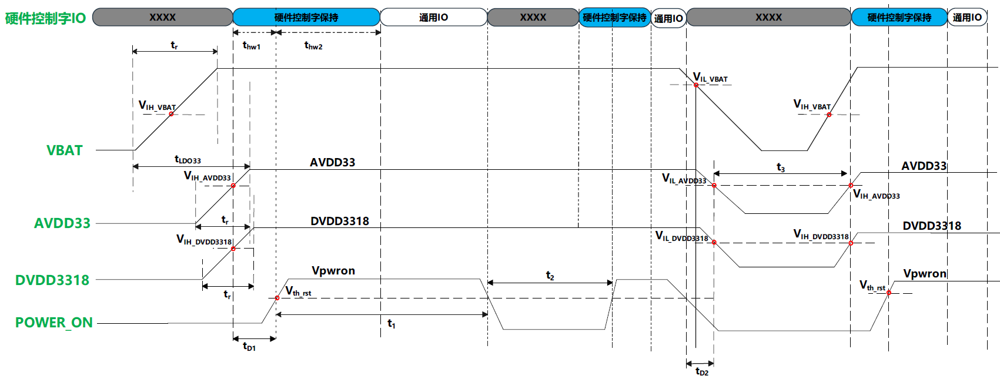

!!! note "说明"

    - 上下电边沿要单调、无回沟。

    - 请严格按照上下电时序规格进行硬件设计，如果不满足约束，建议硬件设计方案增加复位芯片。

    - VBAT 对应管脚：VBAT_IN。

    - AVDD33 对应管脚：AVDD33_RF0、AVDD33_RF1、AVDD33_RF2、AVDD33_0、AVDD33_1、BUCK_IN。

    - DVDD3318 对应管脚：DVDD3318。

表2-8 时间参数说明

| 参数         | 描述                                                                             | 说明                                            | 最小值(min) | 最大值(max) | 单位 |
| ------------ | -------------------------------------------------------------------------------- | ----------------------------------------------- | ----------- | ----------- | ---- |
| t1        | 上电后,PWR_ON的高电平持续时间                                                    | -                                               | 20          | -           | ms   |
| t2        | 睡眠后,唤醒的间隔时间(AVDD33和DVDD3318为高电平时,PWR_ON拉低后再次拉高的间隔时间) | 推荐间隔大于20ms                                | 5           | -           | ms   |
| t3        | 下电后,再次上电的间隔时间                                                        | -                                               | 50          | -           | ms   |
| tD1     | 上电时,PWR_ON相对电源上电的延时时间;                                             | 上电时,PWR_ON晚于AVDD33和DVDD3318上电较晚者;    | 1           | -           | ms   |
| tD21 | 下电时,PWR_ON相对电源下电的提前时间。                                            | 下电时,PWR_ON不晚于AVDD33和DVDD3318下电较早者。 | 0           | -           | ms   |
| thw1    | 上电时,硬件配置字IO在PWR_ON拉高前的电平建立时间                                  | -                                               | 1           | -           | ms   |
| thw2    | 上电时,硬件配置字IO在POWER_ON拉高后的电平保持时间                                | -                                               | 10          | -           | ms   |
| tr        | 电源上升时间                                                                     | -                                               | 1           | 10          | ms   |

注 1: PWR_ON 与 DVDD3318 合并控制时，PWR_ON 跟随 DVDD3318 启动，板级需要增加 RC 延时电路，下电场景 PWR_ON 跟随 DVDD3318 下电；PWR_ON 与 DVDD3318 独立控制时，下电场景 PWR_ON 下电不晚于 DVDD3318 和 AVDD33。

表2-9 电压参数说明

| 参数               | 描述                                                        | 阈值         | 单位 |
| ------------------ | ----------------------------------------------------------- | ------------ | ---- |
| Vth\rst      | PWR_ON的上升/下降沿电平,芯片内部PMU的复位及解复位电压阈值。 | 1.4          | V    |
| VIH\VBAT     | AVDD33的上电阈值电平,LDO33开始上电                          | 2.3          | V    |
| VIL\VBAT     | AVDD33的下电阈值电平,LDO33开始下电                          | 3.4          | V    |
| VIH\AVDD33   | AVDD33 的上电阈值电平                                       | 2.3          | V    |
| VIL\AVDD33   | AVDD33 的下电阈值电平                                       | 2.3          | V    |
| VIH\DVDD3318 | DVDD3318 的上电阈值电平                                     | 0.8×DVDD3318 | V    |
| VIL\DVDD3318 | DVDD3318 的下电阈值电平                                     | 0.8×DVDD3318 | V    |
| Vpwron        | 芯片上电后 PWR_ON 稳态保持电平                              | 1.6          | V    |
| AVDD33             | 芯片模拟模块供电电源                                        | 3.3          | V    |
| DVDD3318           | 芯片数字模块供电电源                                        | 3.3 / 1.8    | V    |

上电时序说明：

1. 电源 VBAT/DVDD3318 电源上电时间范围建议1ms~10ms（VBAT 支持上电时间最快200μs）。

2. VBAT 支持 5V/3.3V，若芯片采用 5V_BUCK 方案，则 AVDD33 由芯片内部 LDO33 产生，上电时间 tLDO33 （VBAT 开启上电到 LDO33 输出 3.3V 的时间）跟随 VBAT 上电时间变化；VBAT <1ms 上电，则 tLDO33 = 1ms ; VBAT <10ms 上电，则 tLDO33 = 10ms 。

3. 电源VBAT、AVDD33、DVDD3318间上电顺序无要求，上电完成1ms后将PWR_ON上拉至高电平（DVDD3318）。当确保PWR_ON晚于DVDD3318和AVDD33电源1ms（即Tpwrion≥1ms）后，上电达到1.4V（Vth_rst）时，才可确保芯片正常工作。

4. 电源上电后，在 PWR_ON 拉高前，硬件控制字 IO 需要提前维持至少 1ms， thw1 ≥ 1ms ；在 PWR_ON 拉高后，硬件控制字 IO 需要持续维持至少 10ms， thw2 ≥ 10ms 。

5. WS63 系列芯片内部 PMU 检测到 PWR_ON 信号为高电平 400us 后，芯片内部开始解复位流程，有序地开启各电源，解复位时间为 21ms，其中硬件配置字在解复位之后 9.5ms 内锁存，然后芯片正常工作。

6. 对于 DVDD3318 和 AVDD33 电源同源、PWR_ON 跟随 DVDD3318 启动的情况，无法满足 Tpwron ≥ms 要求，可以采用板级加 RC 延时电路解决，RC 常数要大于等于 20k×220nF=4.4ms≈5ms。

下电时序说明：

1. 当电源 VBAT_IN、AVDD33、DVDD3318 正常供电，通过拉低 PWR_ON 管脚控制芯片复位时，PWR_ON 电压要低于 1.4V 才能重新拉高启动芯片。

2. 当芯片整体掉电时，需要保证 VBAT_IN、AVDD33、DVDD3318 和 PWR_ON 电压残压低于 800mV，才能重新上电（重新上电需要满足上电时序要求）。

3. 芯片 VBAT 采用 5V 方案时，VBAT 小于 3.4V，LDO33 输出的 3.3V 开始掉电。

!!! warning "注意"

    硬件设计时，请严格遵循上述上下电时序约束。如果应用场景无法满足芯片上下电规格要求，例如电源上电时序慢、供电电压不稳定及快速上下电等场景，建议硬件方案增加复位芯片设计，监测芯片3V3电压并控制PWR_ON，保障芯片正常运行。详细请查看《WS63硬件模组参考设计》。

## 原理图设计建议

### 小系统设计建议

WS63V100 系列芯片内部集成自研 CPU，小系统指芯片电路能够正常工作的最小外围电路配置，此部分的电路主要包括：时钟电路、复位电路。

#### 时钟参考设计

CPU 支持的晶体时钟 24MHz/40MHz，在使用外部晶体时，电路结构如图 3-1 所示。硬件设计时，时钟管脚靠近芯片端预留 0Ω电阻串位，当晶体与 RF 隔离度不满足要求时，可通过串接电感改善隔离度。

图3-1 使用 Crystal 输入参考时钟的参考电路图  
  
WS63 系列芯片时钟电路外部 Crystal 电气特性的要求如表 3-1 和表 3-2 所示。

表3-1 40MCrystal 电气特性要求

| 参数               | 符号  | 晶体选型规格 |           |           | 单位 | 说明                                                                |
| ------------------ | ----- | ------------ | --------- | --------- | ---- | ------------------------------------------------------------------- |
| 标称频率           | f     | 40           | 40        | 40        | MHz  | -                                                                   |
| 负载电容           | CL    | 8            | 9         | 10        | pF   | -                                                                   |
| 频率容差           | f_tol | ±10          | ±10       | ±10       | ppm  | 晶体初始频偏                                                        |
| 等效电阻           | ESR   | ≤50          | ≤40       | ≤35       | Ohm  | 影响起振                                                            |
| 动态电容           | C1    | ≥2.8         | ≥3.4      | ≥4        | fF   | 影响频率校准                                                        |
| 静态电容           | C0    | ≤3           | ≤3        | ≤3        | pF   | -                                                                   |
| 激励功率           | DL    | ≥150         | ≥150      | ≥150      | uW   | -                                                                   |
| 工作温度           | T     | -40~85       | -40~85    | -40~85    | °C   | -                                                                   |
| 板级负载电容(单端) | CL1   | 2.2(参考值)  | 4(参考值) | 6(参考值) | pF   | 需根据板级寄生、封装寄生电容调整。8pF CL1可选,9pF/10pFCL1必须上件。 |

表3-2 24MCrystal 电气特性要求

| 参数               | 符号  | 晶体选型规格 | 单位 | 备注                                      |
| ------------------ | ----- | ------------ | ---- | ----------------------------------------- |
| 标称频率           | f     | 24           | MHz  | -                                         |
| 负载电容           | CL    | 8            | pF   | -                                         |
| 频率容差           | f_tol | ±10          | ppm  | 晶体初始频偏                              |
| 等效电阻           | ESR   | ≤100         | Ohm  | -                                         |
| 动态电容           | C1    | ≥3           | fF   | -                                         |
| 静态电容           | C0    | ≤3           | pF   | -                                         |
| 工作温度           | T     | -40~85       | °C   | -                                         |
| 激励功率           | DL    | ≥150         | μW   | -                                         |
| 板级负载电容(单端) | CL1   | 2.2 (参考值) | pF   | 根据板级寄生、封装寄生电容调整。CL1可选。 |

CL1 实际调测步骤如下（需要使用综测仪进行测试，综测仪可以直接测试出频偏）：

步骤 1 8pF 默认板级无负载电容 CL0=0；9pF 默认 xin 与 xou 上件 2pF，CL0=2；10pF 默认 xin 与 xou 上件 4pF，CL0=4。

- 配置频偏校准粗调码值 xo_trim_coarse=0，频偏校准细调码值 xo_trim_fine=0，记录此时频偏为 fmax。

- 配置频偏校准粗调码值 xo_trim_coarse=15，频偏校准细调码值 xo_trim_fine=127，记录此时频偏为 fmin。

步骤 2 若 fmax ≥ 35ppm 且 fmin ≤ -35ppm ，则不需要增加 CL1，调测结束；若不满足，则进行步骤 3~步骤 7。

步骤 3 板级负载电容根据 CL=8pF/9pF/10pF 分别在 xin 与 xout 上件 1pF/2pF/4pF；配置频偏校准粗调码值 xo_trim_coarse=0，频偏校准细调码值 xo_trim_fine=0，记录此时频偏为 f0（此时 CL=9pF/10pF 的 f0 即为第一步的 fmax）。

步骤 4 板级负载电容在第 2 步的基础上增大 1pF，根据 CL=8pF/9pF/10pF 分别在 xin 与 xout 上件 2pF/3pF/5pF；配置频偏校准粗调码值 xo_trim_coarse=0，频偏校准细调码值 xo_trim_fine=0，记录此时频偏为 f1。

步骤 5 此时得到频偏调节率 ratio_adjust=(f1-f0)/1pF，则进一步可以计算可以得到 CL1=(fmax+fmin)/2/ratio_adjust+CL0。

步骤 6 将得到的 CL1 分别在 xin 与 xout 上件，此时测得 fmax≈-fmin，此时 CL1 为最佳值。

步骤 7 为保证测试准确，推荐测试 3pcs 单板来保证一致性。

----结束

以 CL=8pF 为例，如表 3-3 所示。

表3-3 CL1 测试举例

<table><tr><th>晶体 CL</th><th>xin 与xou 上件容值</th><th>xo_trim_coarse</th><th>xo_trim_fine</th><th>fmax</th><th>fmin</th><th>f0</th><th>f1</th></tr><tr><td rowspan="4">8pF</td><td>0</td><td>0</td><td>0</td><td>100ppm</td><td>-</td><td>-</td><td>-</td></tr><tr><td>0</td><td>15</td><td>127</td><td>-</td><td>-20ppm</td><td>-</td><td>-</td></tr><tr><td>1pF</td><td>0</td><td>0</td><td>-</td><td>-</td><td>90ppm</td><td>-</td></tr><tr><td>2pF</td><td>0</td><td>0</td><td>-</td><td>-</td><td>-</td><td>80ppm</td></tr><tr><td colspan="8">此时 ratio_adjust=10ppm/1pF,CL1=(100-20)/2/10+0=4pF</td></tr><tr><td rowspan="2">8pF</td><td>4pF</td><td>0</td><td>0</td><td>60ppm</td><td>-</td><td>-</td><td>-</td></tr><tr><td>4pF</td><td>15</td><td>127</td><td>-</td><td>-60ppm</td><td>-</td><td>-</td></tr></table>

!!! note "说明"

    配置频偏校准粗调码值与细调码值命令详细说明请参见《WS63V100 产线工装用户指南》。

WS63 系列芯片支持 24MHz、40MHz 参考时钟频率。参考时钟频率通过 GPIO_06 的硬件配置字进行判断，上电时通过读取 GPIO_06 高低电平选择内部分频系数。外部时钟选择真值如表 3-4 所示。

表3-4 外部时钟选择真值表

| 时钟频率 | REFCLK_FREQ_STATUS | 说明                    |
| -------- | ------------------ | ----------------------- |
| 40MHz    | 0                  | 默认内部下拉。          |
| 24MHz    | 1                  | 上拉 2.2kΩ到 DVDD3318。 |

图3-2 频率选择管脚参考电路图  

#### 复位电路

WS63V100 系列芯片集成内部 POR（Power On Reset）电路以及 Watchdog，PWR_ON 管脚为芯片复位管脚，低电平使能。PWR_ON 上电必须要晚于 AVDD33 和 DVDD3318 电源 1ms，建议在 PWR_ON 管脚增加 RC 延时电路，例如 R=20kΩ，C=220nF，RC 参数约为 4.4ms。

图3-3 PWR_ON 电路设计参考  

!!! note "说明"

    硬件设计时，power_on 管脚建议上件 RC 延时电路，根据电源上电响应速度，调节 RC 参数，保证上电时序满足芯片规格约束；同时预留下拉电阻位置，作为下电快速泄放通道和 power_on 分压控制电路使用。

#### 硬件初始化系统配置电路

WS63V100 系列芯片的 PIN23 为电源方案配置管脚，当 VBAT 电源选择 3V3 方案时，PIN23 需跟随电源启动拉高。芯片 PIN7、8、10 为硬件配置字，PIN5、13、15 为芯片保留的硬件配置字，硬件配置字管脚在芯片内部默认有 28kΩ 左右的下拉电阻。芯片上电初始化时会检测 6 个硬件配置字引脚的电平状态，以进入不同的工作模式，详情见表 3-5，使用时必须注意芯片上电初始化时的引脚初始输入电平。若需通过上拉电阻将硬件配置字上电初始化时设置为高电平，PIN7、PIN8、PIN10 建议通过 2.2kΩ 电阻上拉到 DVDD3318。

表3-5 硬件配置字信号描述

<table><tr><th>信号名</th><th>PIN</th><th>管脚电平</th><th>芯片工作模式</th></tr><tr><td rowspan="2">FLASH BOOT (GPIO_03)</td><td rowspan="2">7</td><td>0</td><td>正常启动</td></tr><tr><td>1</td><td>进烧录模式</td></tr><tr><td rowspan="2">JTAG_ENABLE (GPIO_04)</td><td rowspan="2">8</td><td>0</td><td>正常启动</td></tr><tr><td>1</td><td>使能 JTAG 调试接口</td></tr><tr><td rowspan="2">REFCLK_FREQ_STATUS (GPIO_06)</td><td rowspan="2">10</td><td>0</td><td>时钟选择 40MHz</td></tr><tr><td>1</td><td>时钟选择 24MHz</td></tr><tr><td rowspan="2">保留 1 (GPIO_01)</td><td rowspan="2">5</td><td>0</td><td>正常工作模式</td></tr><tr><td>1</td><td>禁止</td></tr><tr><td rowspan="4">保留 2 (GPIO_11):保留 3 (GPIO_09)</td><td rowspan="4">15:13</td><td>0:0</td><td>正常工作模式</td></tr><tr><td>0:1</td><td>正常工作模式</td></tr><tr><td>1:0</td><td>正常工作模式</td></tr><tr><td>1:1</td><td>禁止</td></tr></table>

注：
1. 上电初始化时，硬件配置字 JTAG_ENABLE 高电平使能后，GPIO13 和 GPIO14 固定使用为 JTAG 接口。
2. 上电初始化时，硬件配置字 FLASH_BOOT 高电平使能后，芯片启动流程会停留在 BOOT 阶段，等待烧录。

表3-6 电源方案选择管脚说明

<table><tr><th>信号名</th><th>PIN</th><th>管脚电平</th><th>芯片工作模式</th></tr><tr><td rowspan="2">PWR_SEL</td><td rowspan="2">23</td><td>0</td><td>VBAT_IN 采用 5V 供电。</td></tr><tr><td>1</td><td>VBAT_IN 采用 3V3 供电。</td></tr></table>

!!! warning "须知"

    - 特别注意：不要使硬件配置字进入表3-5中所描述的禁用状态。

    - 芯片使用时，必须注意在上电初始化过程中 PIN5、7、8、10、13、15 所有的 6 个硬件配置字管脚的电平状态（包含对端芯片及器件以及板级上下拉电阻对硬件配置字管脚上电初始化电平的影响）。

    - 芯片保留的硬件配置字管脚 PIN5、13、15，硬件设计时相应管脚禁止加上拉电阻。

    - 上电过程中硬件配置字详细的时序约束请参考图2-1。

    - 芯片上电过程中，在 PWR_ON 管脚拉高前至少 1ms，拉高后至少 10ms 的时间内，需要保证所有硬件配置字管脚电平状态稳定不变；

    - 由于硬件配置字管脚对上电时序有约束，所以不建议作为功能 IO 使用，以避免初始化时电平识别错误从而导致功能异常；

    - 如果基于设计需求，需要将硬件配置字管脚做 IO 使用，注意引脚上电初始化电平是否满足芯片启动要求，以及默认上下拉电阻所带来的影响。

### 电源参考设计

!!! note "说明"

    系统电源的设计，详细请参见 WS63 原理图。

#### 电源方案

WS63 系列芯片共有 3 种芯片电源方案，分别为 5V BUCK 方案，3.3V BUCK 方案，3.3V LDO 方案，因此在不同电源方案芯片引脚及外围电路存在差异。

- 方案一：5V BUCK 方案。BUCK_LX 连接板级 2.2uH 电感，然后连接到 BUCK_OUT；BUCK_OUT 近端添加 10uF 电容；VDD_DIG 管脚浮空；PWR_SEL 管脚接地。VBAT_IN 接 5V 板级输入电压；VDD33_OUT 输出 3.3V，通过硬件连接到 BUCK_IN 及整芯片需要 3.3V 电压的管脚。

- 方案二：3.3V BUCK 方案。BUCK_LX 连接板级 2.2uH 电感，然后连接到 BUCK_OUT；BUCK_OUT 近端添加 10uF 电容；VDD_DIG 管脚浮空；PWR_SEL 管脚接 3.3V。VBAT_IN 接 3.3V 板级输入电压；VDD33_OUT、BUCK_IN 接板级 3.3V。

- 方案三：3.3V LDO方案。BUCK_LX连接板级3.3V电压；BUCK_OUT管脚浮空；VDD_DIG近端添加1uF电容；PWR_SEL管脚接3.3V。VBAT_IN接3.3V板级输入电压；VDD33_OUT、BUCK_IN接板级3.3V。

WS63 系列芯片 3 种电源方案示意如图 3-4、图 3-5 和图 3-6 所示。

图3-4 WS63 系列芯片 5V BUCK 方案

图3-5 WS63 系列芯片 3.3V BUCK 方案  

图3-6 WS63 系列芯片 3.3V LDO 方案  

!!! note "说明"

    1. 硬件方案设计时，推荐采用 3V3_BUCK 供电方案，实现更好的性能表现。5V_BUCK 方案和 3V3_LDO 方案仅建议在低功耗场景下采用，且应用场景中芯片位置板温建议不超过 70°C。

    2. 电源管脚DVDD3318支持3.3V或1.8V供电。当DVDD3318采用1.8V供电时，硬件设计上需要将PIN35（IOLDO18）和PIN34（DVDD3318）短接，由外部提供1.8V电压。

#### 电源规格

需要的外部电源包括：

- 供电电源 VBAT_IN

- IO 电源 DVDD3318

推荐工作条件如表 3-7 所示。

表3-7 推荐工作条件

| 符号       | PIN序号 | 说明                                   | 最小值(V) | 典型值(V) | 最大值(V) | 电压精度DC+AC | PCB布线参考电流值(mA)(仅供布线参考) |
| ---------- | ------- | -------------------------------------- | --------- | --------- | --------- | ------------- | ----------------------------------- |
| AVDD33_RF1 | 2       | 由外部电源提供。                       | 3.0       | 3.3       | 3.6       | ±5%           | 400                                 |
| AVDD33_RF0 | 3       | 由外部电源提供。                       | 3.0       | 3.3       | 3.6       | ±5%           | 100                                 |
| AVDD33_RF2 | 39      | 由外部电源提供。                       | 3.0       | 3.3       | 3.6       | ±5%           | 100                                 |
| AVDD33_0   | 37      | AVDD33供电电源,由外部电源提供。        | 3.0       | 3.3       | 3.6       | ±5%           | 50                                  |
| AVDD33_1   | 36      | 由外部电源提供。                       | 3.0       | 3.3       | 3.6       | ±5%           | 140                                 |
| IOLDO18    | 35      | 内部LDO_DECAP,外置1μF。                | -         | 1.8       | -         | ±5%           | 200                                 |
| DVDD3318   | 34      | IO电源,由外部电源提供。                | 1.62      | 1.8/3.3   | 3.63      | ±5%           | 300                                 |
| VDD_DIG    | 33      | 内部LDO_DECAP,外置1μF。                | -         | 0.9       | -         | ±5%           | 250                                 |
| BUCK_OUT   | 22      | 内部数字电源输出,外置10μF。            | -         | 0.9       | -         | ±5%           | 250                                 |
| BUCK_IN    | 19      | 内部数字电源输入,外置4.7μF。           | 3.0       | 3.3       | 3.6       | ±5%           | 100                                 |
| VBAT_IN    | 18      | 芯片供电电源,由外部电源提供,外置10μF。 | 3.0       | 3.3/5     | 5.25      | ±5%           | 500                                 |
| VDD33_OUT  | 17      | 内部数字电源输出,外置4.7μF。           | 3.0       | 3.3       | 3.6       | ±5%           | 500                                 |

#### AVDD33 电源

WS63V100 系列芯片包含 6 个 AVDD33 电源输入管脚:

- AVDD33_RF0、AVDD33_RF1、AVDD33_RF2：芯片RF模块供电，由外部提供。

- AVDD33_0、AVDD33_1：电源 AVDD33，由外部提供。

- BUCK_IN：内部BUCK电源输入，由外部提供。

AVDD33 支持 3.0V ~ 3.6V 输入，要求供电电源纹波及噪声峰峰值在 ±5% 以内。

AVDD33 的每个电源输入管脚需要选择合适的去耦电容，参考表 3-8 所示。

表3-8 AVDD33 电源管脚去耦电容

| 名称       | 设计建议                      |
| ---------- | ----------------------------- |
| AVDD33_RF1 | 外接 1μF 电容,耐压值≥6.3V。   |
| AVDD33_RF0 | 外接 1μF 电容,耐压值≥6.3V。   |
| AVDD33_RF2 | 外接 1μF 电容,耐压值≥6.3V。   |
| AVDD33_0   | 外接 1μF 电容,耐压值≥6.3V。   |
| AVDD33_1   | 外接 2.2μF 电容,耐压值≥6.3V。 |
| BUCK_IN    | 外接 4.7μF 电容,耐压值≥6.3V。 |
| VDD33_OUT  | 外接 4.7μF 电容,耐压值≥6.3V。 |

图3-7 WS63V100 AVDD33 输入电路 1  

图3-8 WS63V100 AVDD33 输入电路 2  

图3-9 WS63V100 AVDD33 输入电路 3  

#### VBAT_IN 电源

VBAT_IN 给芯片提供工作电源，支持 3.3V 或 5V 输入，VBAT_IN 电源可以由外部 PMU 芯片或者外部 BUCK 电路生成提供。推荐设计建议如表 3-9 所示，参考电路如图 3-10 所示。

表3-9 VBAT_IN 电源设计建议

| 名称    | 设计建议                    |
| ------- | --------------------------- |
| VBAT_IN | 外接 10μF 电容,耐压值≥10V。 |

图3-10 VBAT_IN 输入电路  

#### DVDD3318 电源

WS63V100 系列芯片包含 1 个 DVDD3318 电源输入管脚：

DVDD3318：支持 1.8V/3.3V 电压，推荐设计建议如表 3-10 所示，参考电路图如图 3-11 所示。

表3-10 DVDD3318 电源设计建议

| 名称     | 设计建议                      |
| -------- | ----------------------------- |
| DVDD3318 | 外接 4.7μF 电容,耐压值≥6.3V。 |

图3-11 DVDD3318 输入电路  

!!! note "说明"

    当DVDD3318选择1V8电源供电时，需要将DVDD3318和IOLDO18短接，即PIN34和PIN35短接。选择3V3电源供电时不需要。

#### 内部电源滤波电路

内部电源中的 IOLDO18、VDD_DIG 需要外接滤波电容，推荐设计建议如表 3-11 所示，参考电路如图 3-12 所示。

表3-11 内部电源滤波电路设计建议

| 名称    | 设计建议                                                     |
| ------- | ------------------------------------------------------------ |
| IOLDO18 | 内部 LDO_DECAP,外接 1μF 滤波电容。                           |
| VDD_DIG | 内部 LDO_DECAP,LDO 电源方案外接 1μF 滤波电容,BUCK 方案悬空。 |

图3-12 内部电源滤波电路  

#### BUCK 电源

VDD_DIG 可以由内部 BUCK 生成或由内部 LDO 电源提供。参考电路如图 3-13 所示

表3-12 BUCK 电源设计建议

| 名称     | 设计建议                                     |
| -------- | -------------------------------------------- |
| BUCK_LX  | BUCK LX 输出,外接 2.2μH 电感。               |
| BUCK_IN  | 电压输入,给内部 LDO 等供电,外接 4.7μF 电容。 |
| BUCK_OUT | 给芯片内部 LDO 供电,外接 10μF 电容。         |

图3-13 BUCK 电源参考电路  

!!! note "说明"

    BUCK 电感推荐约束条件：

    - 电感值 2.2μH ， ± 20% 。

    - 直流电阻（Rdc） ≤ 0.5Ω 。

    - 饱和电流 ≥ 1A 。

    - Rdc 增大会导致功耗增加，效率变低。

#### RF 电源

外部提供 RF 电源供电，可与 AVDD33 电源接在一起，设计建议如表 3-13 所示，参考电路如图 3-14 和图 3-15 所示。

表3-13 RF 供电设计建议

| 名称       | 设计建议                    |
| ---------- | --------------------------- |
| AVDD33_RF0 | AVDD33 供电,外接 1μF 电容。 |
| AVDD33_RF1 | AVDD33 供电,外接 1μF 电容。 |
| AVDD33_RF2 | AVDD33 供电,外接 1μF 电容。 |

图3-14 RF 供电电路设计参考 1  

图3-15 RF 供电电路设计参考 2  

#### 注意事项

TBD

### 外围接口设计建议

#### UART 接口

WS63V100 系列芯片支持三组 UART 接口，UART0 用于芯片烧录、维测、打印。

UART1、UART2 用于与其他设备对接，UART1 也可作为业务调试接口。设计建议如

表 3-14 所示。硬件设计时引出 UART0、UART1 测试点，可以方便芯片业务功能调测。

表3-14 UART 接口设计建议

| 名称      | 设计建议                                          |
| --------- | ------------------------------------------------- |
| UART0_RXD | 直连,走线≤5inch。                                 |
| UART0_TXD | 直连,走线≤5inch。总线需要上拉,建议上拉电阻2.2kΩ。 |
| UART1_TXD | 直连,走线≤5inch。总线需要上拉,建议上拉电阻2.2kΩ。 |
| UART1_RXD | 直连,走线≤5inch。                                 |
| UART1_RTS | 直连,走线≤5inch。                                 |
| UART1_CTS | 直连,走线≤5inch。                                 |
| UART2_TXD | 直连,走线≤5inch。                                 |
| UART2_RXD | 直连,走线≤5inch。                                 |
| UART2_RTS | 直连,走线≤5inch。                                 |
| UART2_CTS | 直连,走线≤5inch。                                 |

!!! note "说明"

    1. WS63V100 系列芯片 UART 接口 RX 管脚不需要接上拉电阻。为防止电源倒灌，建议 WS63 芯片侧串口 RX 不接上拉电阻。

    2. WS63V100 系列芯片 UART0/1 接口 TX 管脚为开漏输出，需要接上拉电阻提供高电平驱动能力。为防止通过 WS63 芯片侧 TX 上拉电阻倒灌电源，建议 TX 总线上对端设备不接上拉电阻（对端为 RX 输入管脚，无需上拉）。

    3. WS63V100 系列芯片 UART2 接口 TX 管脚有高电平驱动能力，不需要接上拉电阻。为防止电源倒灌，建议 UART2 接口 TX 总线不接上拉电阻。

    4. 针对WS63单独下电场景，在将WS63下电后，建议对端设备UART接口主动将TX、RX总线驱动低电平。

#### PWM 接口

WS63V100 系列芯片支持 8 个 PWM 接口信号输出，输出电平与 DVDD3318 管脚电平保持一致，占空比输出范围（1/65535 到 1）。设计建议如表 3-15 所示。

表3-15 PWM 接口设计建议

| 名称 | 设计建议          |
| ---- | ----------------- |
| PWM0 | 直连,走线≤5inch。 |
| PWM1 | 直连,走线≤5inch。 |
| PWM2 | 直连,走线≤5inch。 |
| PWM3 | 直连,走线≤5inch。 |
| PWM4 | 直连,走线≤5inch。 |
| PWM5 | 直连,走线≤5inch。 |
| PWM6 | 直连,走线≤5inch。 |
| PWM7 | 直连,走线≤5inch。 |

#### I2S 接口

WS63V100 系列芯片支持一个 I2S 接口，输入输出电平与 DVDD3318 管脚电平保持一致。设计建议如表 3-16 所示。

表3-16 I2S 接口设计建议

| 名称      | 设计建议        |
| --------- | --------------- |
| I2S_MCK   | 直连,包地处理。 |
| I2S_DO    | 直连。          |
| I2S_SCLK  | 直连,包地处理。 |
| I2S_LRCLK | 直连,包地处理。 |
| I2S_DI    | 直连。          |

#### QSPI&SPI 接口

WS63V100 系列芯片支持 QSPI 和 SPI 接口，输入输出电平与 DVDD3318 管脚电平保持一致。设计建议如表 3-17 所示。

表3-17 QSPI&SPI 接口设计建议

<table><tr><th>名称</th><th>设计建议</th></tr><tr><td>SPI_CSN</td><td>直连,走线≤5inch。</td></tr><tr><td>SPI_CLK</td><td>两层板,走线≤5inch,芯片端预留一个串接电阻位置,单根走线包地处理。四层板,DVDD3318=1.8V,走线≤5inch,芯片端预留一个串接电阻位置,单根走线包地处理。四层板,DVDD3318=3.3V,走线≤5inch,芯片端预留一个串接电阻位置,单根走线包地处理</td></tr><tr><td>SPI_DATA</td><td>两层板,走线≤5inch,芯片端预留一个串接电阻位置,单根走线包地处理。四层板,走线≤5inch,芯片端预留一个串接电阻位置,单根走线包地处理。</td></tr></table>

#### I2C 接口

WS63V100 系列芯片支持两组 I2C 接口，与 UART0/UART1 管脚复用。设计建议如表 3-18 所示。

表3-18 I2C 接口设计建议

| 名称              | 设计建议                                         |
| ----------------- | ------------------------------------------------ |
| I2C0_SCL/I2C1_SCL | 直连,走线≤5inch,总线需要上拉,建议上拉电阻2.2kΩ。 |
| I2C0_SDA/I2C1_SDA | 直连,走线≤5inch,总线需要上拉,建议上拉电阻2.2kΩ。 |

#### ADC 接口

WS63V100 系列芯片支持 6 个 ADC 接口，ADC 电压量测范围 0.3 V ~ 3.3 V。设计建议如表 3-19 所示。

表3-19 ADC 接口设计建议

| 名称 | 设计建议                                           |
| ---- | -------------------------------------------------- |
| AIN0 | 直连。模拟信号通道,建议两侧包地,远离高速信号干扰。 |
| AIN1 | 直连。模拟信号通道,建议两侧包地,远离高速信号干扰。 |
| AIN2 | 直连。模拟信号通道,建议两侧包地,远离高速信号干扰。 |
| AIN3 | 直连。模拟信号通道,建议两侧包地,远离高速信号干扰。 |
| AIN4 | 直连。模拟信号通道,建议两侧包地,远离高速信号干扰。 |
| AIN5 | 直连。模拟信号通道,建议两侧包地,远离高速信号干扰。 |

### 控制信号应用参考设计

WS63V100 系列芯片控制信号及应用如表 3-20 所示。

表3-20 控制信号应用参考设计

| 名称    | 设计建议                                                            |
| ------- | ------------------------------------------------------------------- |
| PWR_ON  | 远离高速信号,建议包地处理,预留上拉 20kΩ到 DVDD3318,220nF 电容接地。 |
| PWR_SEL | 远离高速信号,建议包地处理。                                         |
| BUCK_LX | 功率电感靠近芯片放置,减少 BUCK 环路寄生。                           |

### RFIO 设计

WS63 系列芯片集成 2.4G WiFi PA 和 LNA，集成 T/R Switch，支持外接单天线，不支持外置 FEM 和外置 LNA。WS63 系列芯片支持 2.4G，支持全球所有国家定义的 WLAN 频段，支持 b/g/n/11ax 协议版本。

WS63 系列芯片的 PIN1 为 RFIO 管脚，作为 WiFi/BLE/SLE 的接收发送管脚，

WS63E 芯片中也可作为雷达发射管脚。射频链路建议使用π型 LC 滤波电路，参考电路如图 3-16，图中的 LC 滤波为推荐值，LC 滤波及天线匹配电路请根据实际情况调整。RF 连接器旁边建议预留 ESD 器件。

图3-16 RFIO 设计参考电路图

### RFI 设计

WS63E 芯片提供了雷达检测解决方案，芯片的 PIN40 为 RFI 管脚，作为雷达检测的射频接收管脚。设计中，为防止 EMI 干扰，在 RFI 通路靠近芯片口预留 π 型 LC 高通滤波器位置，滤除低频干扰。射频通路天线口建议预留 π 型 LC 匹配电路，参考电路如图 3-17，LC 滤波及天线匹配值请根据实际情况调整。

图3-17 RFI设计参考电路图  

!!! note "说明"

    雷达板载天线设计仅供参考，用户板载天线需要按照产品需求自行设计测试。

    - 板载PCB天线需要以整机为基础进行设计、仿真，综合考虑天线净空、模组底板、外壳等环境影响。

    - 雷达检测方案天线设计规格约束：RFIO为雷达Tx天线，RFI为雷达Rx天线。Tx、Rx天线频率2.4-2.5GHz；VSWR<2；Tx、Rx射频链路，天线隔离度>=20dBc，射频板级走线隔离度>=32dBc；天线增益>=0dBi；Tx、Rx天线带内群时延<1ns。

    - 雷达检测方案 Tx、Rx 天线保证同极化，天线设计建议均采用板载 PCB 天线。

    - RFI雷达Rx天线远离EMI干扰源，在RFI通路靠近芯片口预留π型LC高通滤波器位置，滤除低频干扰。

    - 整机设计中，为防止感知误触发，雷达模组应远离机械振动部件（例如蜂鸣器）。

    - 为规避人感探测区间，要求整机底板大电流器件如需刷新，刷新率应>100Hz（例如 LED 灯、蜂鸣器）

## PCB 设计建议
### 叠层和布局

WS63 系列芯片封装为 QFN40，规格大小为 5mm × 5 mm ，PCB 支持 2/4 层板，支持器件单面贴设计。

- 两层板分层设计建议：

    \- TOP 层：信号走线，信号线和电源线尽量走 TOP 层。

    \- BOTTOM 层：地平面层，尽量保持地平面的完整。

- 四层板分层设计建议：

    \- TOP 层：信号走线，信号线尽量走 TOP 层。

    \- 内一层：地平面层，保持一个完整的地平面层。

    \- 内二层：电源平面层，电源走线尽量走第三层，且电源之间需要用地隔开。

    \- BOTTOM 层：可以走少量的信号线，尽量保持 BOTTOM 层为一个完整的地平面层。

- PCB 设计注意事项:

    \- 推荐 PCB 板厚 On Board 方案一般≥1mm，防止翘曲，过孔 8/18 mil。

    \- PCB 典型材料 FR4 介电常数为 4.0~4.3，表层铜箔厚度建议为 1.2mil (0.5oz+plating)，PCB 板厚度一般≥1.0mm，典型值为 1.2mm，可选用 1.0mm。

    \- 2 层板设计中，EPAD 和外部地用细线连通，改善 RF 回流。

常用的叠层设计和阻抗控制可参考表 4-1。

表4-1 2 层板 1.0mm 参考叠层信息

<table><tr><th>层标识</th><th>设计要求层叠图示</th><th>设计要求介质厚度(oz/mil)</th><th>PCB厂家设计调整介质厚度(oz/mil)</th><th>PCB厂家设计调整层叠图示</th></tr><tr><td rowspan="2">Art 1</td><td colspan="2">0.5oz+plating</td><td colspan="2">0.5oz+plating</td></tr><tr><td>CORE</td><td>35.4</td><td>34.06</td><td>CORE</td></tr><tr><td>Art 2</td><td colspan="2">0.5oz+plating</td><td colspan="2">0.5oz+plating</td></tr><tr><td>板厚</td><td colspan="2">客户设计板厚:1.0±0.10 mm</td><td colspan="2">厂家理论板厚:1.0±0.10 mm</td></tr></table>

表4-2 单线线宽、阻抗、参考层控制信息参考

<table><tr><th>层标识</th><th>设计线宽</th><th>设计阻抗</th><th>调整线宽</th><th>调整阻抗</th><th>参考层</th></tr><tr><td>Art 1</td><td>5/19/5(到地距离/线宽/到地距离)</td><td>50±10%</td><td>5/19/5(到地距离/线宽/到地距离)</td><td>50±10%</td><td>L1&amp;L2</td></tr></table>

注：线宽的计量单位为 mil，阻抗的计量单位为 Ω 。

表4-3 4 层板 1.2mm 参考叠层信息

<table><tr><th>层标识</th><th>设计要求层叠图示</th><th>设计要求介质厚度(oz/mil)</th><th>PCB厂家设计调整介质厚度(oz/mil)</th><th>PCB厂家设计调整层叠图示</th></tr><tr><td rowspan="2">Art 1</td><td colspan="2">0.5oz+plating</td><td colspan="2">0.5oz+plating</td></tr><tr><td>PP</td><td>8.2</td><td>10.88</td><td>PP</td></tr><tr><td rowspan="2">Art 2</td><td colspan="2">1oz</td><td colspan="2">1oz</td></tr><tr><td>CORE</td><td>23.8</td><td>18</td><td>CORE</td></tr><tr><td rowspan="2">Art 3</td><td colspan="2">1oz</td><td colspan="2">1oz</td></tr><tr><td>PP</td><td>8.2</td><td>10.88</td><td>PP</td></tr><tr><td>Art 4</td><td colspan="2">0.5oz+plating</td><td colspan="2">0.5oz+plating</td></tr><tr><td>板厚</td><td colspan="2">客户设计板厚:1.2±0.12 mm</td><td colspan="2">厂家理论板厚:1.2±0.12 mm</td></tr></table>

表4-4 单线线宽、阻抗、参考层控制信息

| 信号层 | 接地层    | 阻抗目标  | 阻抗公差 | 设计线宽(mil) | 距铜(mil) |
| ------ | --------- | --------- | -------- | ------------- | --------- |
| L1     | L1&amp;L2 | L1&amp;L2 | 10%      | 11            | 6         |

### Fanout 封装设计建议

四层板 Fanout 如图 4-1 所示。

图4-1 PCB 四层板 Fanout 参考设计  
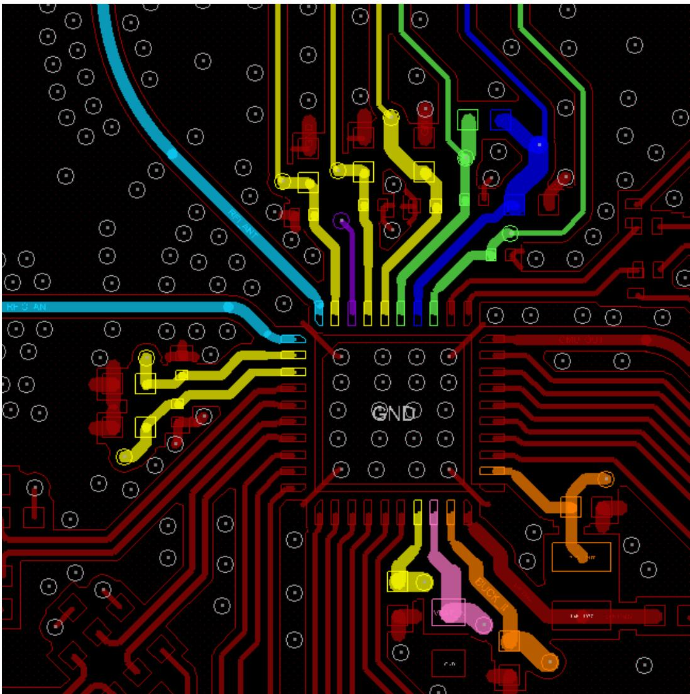

其中：

- 黄色：AVDD33_RF0，AVDD33_RF1，AVDD33_RF2，AVDD33_0，AVDD33_1，VDD33_OUT

- 绿色：IOLDO18，VDD_DIG

- 紫色: PWR_ON

- 深蓝色：DVDD3318

- 淡蓝色：RF_ANT，RFIO_ANT

- 橙色：BUCK_IN，BUCK_OUT

- 粉色：VBAT_IN

### PCB 布局

应用支持 On Board 和模组两种方案。

- On Board 方案

    \- 支持 2 层板设计。

    \- On Board 可双面贴片，空间允许可以选择 0402 封装，空间不足可选择 0201 封装（inch）。

- 模组

    \- 建议用 2 层板。

    \- 贴片器件建议用 0201 封装 (inch)。

PCB 设计以模组两层板为例，参考设计如图 4-2 和图 4-3 所示。

图4-2 LDO 供电方案模组 PCB 布局参考  
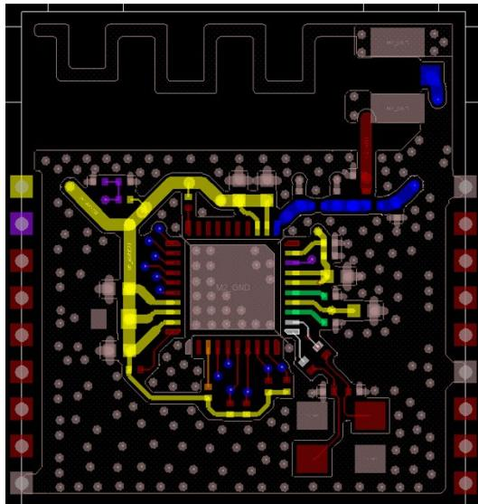  
TOP VIEW

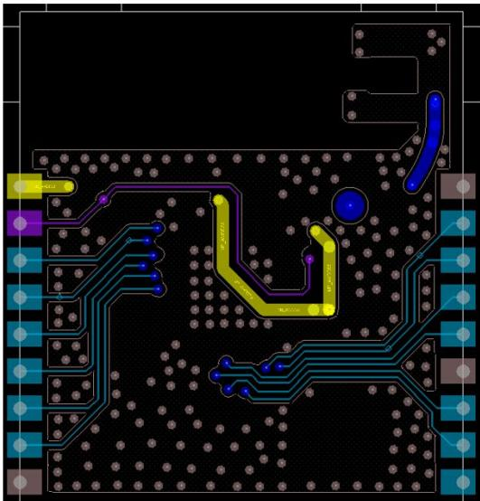  
BOTTOM VIEW

其中：

- 黄色：AVDD33_RF0，AVDD33_RF1，AVDD33_RF2，AVDD33_0，AVDD33_1，VDD33_OUT，DVDD3318，BUCK_IN，VBAT_IN

- 绿色：IOLDO18，VDD_DIG

- 紫色: PWR_ON

- 深蓝色：RFIO_ANT

- 橙色: BUCK_OUT

- 白色：XIN，XOUT

图4-3 BUCK 供电方案模组 PCB 布局参考  
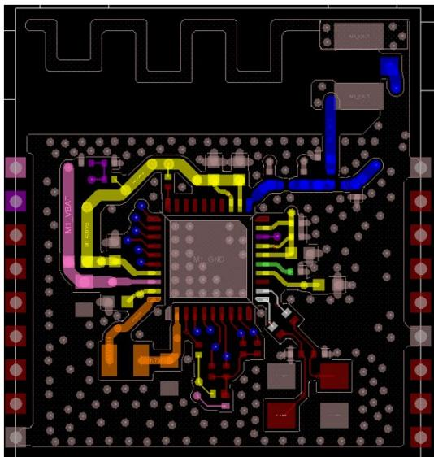  
TOP VIEW

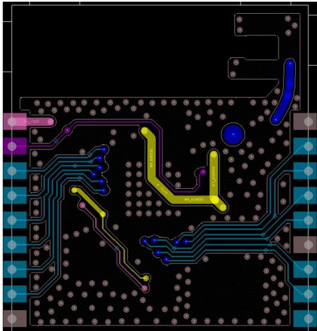  
BOTTOM VIEW

其中：

- 黄色：AVDD33_RF0，AVDD33_RF1，AVDD33_RF2，AVDD33_0，AVDD33_1，VDD33_OUT，DVDD3318

- 绿色：IOLDO18，VDD_DIG

- 紫色：PWR_ON

- 深蓝色：RFIO_ANT

- 橙色：BUCK_IN，BUCK_OUT

- 粉色：VBAT_IN;

!!! note "说明"

    通常RF器件布局比较紧凑，这样会导致近芯片侧π型LC滤波网络的两个接地电容的接地过孔靠的比较近，这样会影响到RF的谐波抑制性能，建议两个接地电容分布在RF走线的两边，这样可以提高RF电路的谐波抑制效果。

### 电源

- 电源走线宽度需要满足“3.2.2 电源规格”中的建议电流值，建议按照100mA/4mil的通流能力来设计。

- 所有电源走线需先经过滤波电容再到对应的芯片管脚，滤波电容靠近被滤波芯片管脚放置。电容就近接地，避免长走线引入电感效应。

- RF 电源对外干扰较大，需远离模拟电源和敏感信号。RF 电源各个管脚需要有各自的滤波电容，经过各自的滤波电容后分别走线，避免振荡问题。

- AVDD33 电源走线支持串行走线，但星型走线可以带来更好的性能，图 4-4 黄色走线即为星形走线，深蓝色为 RFIO_ANT 走线。

AVDD33 电源走线（黄色）、DVDD3318、IOLDO18 及 VDD_DIG 上的滤波电容摆放位置如图 4-4 所示。

图4-4 模组两层板电源布线参考  
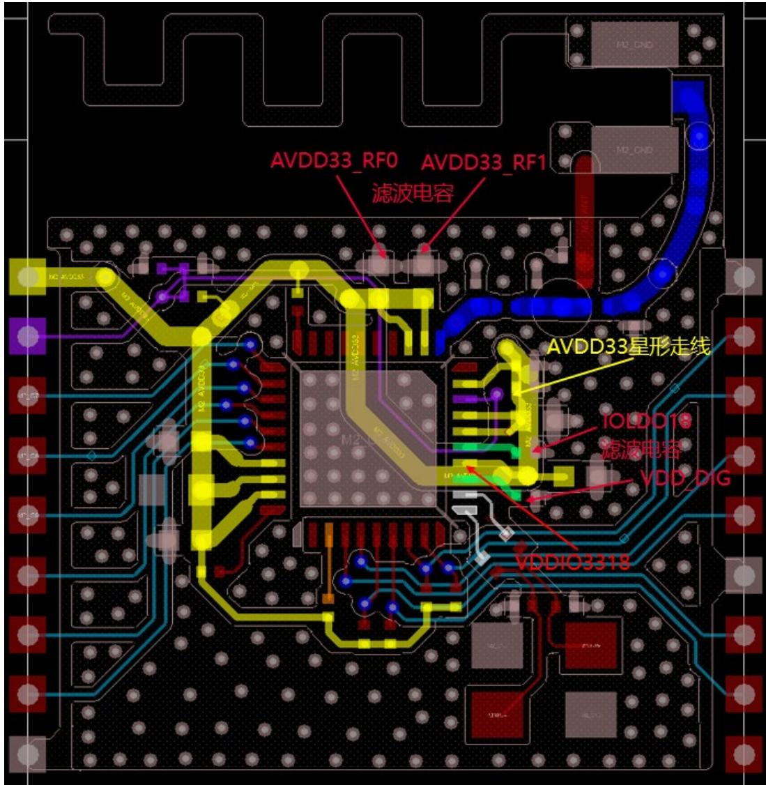

### RF 布线指导

- RF 走线控制阻抗 50Ω，线尽量短不允许有锐角和直角。2 层板采用共面波导设计，走线两边包地多打地孔。

- 硬件设计中，如果射频通道上有引入 ESD 风险的点位，例如裸露的射频测试点、金属天线、外接天线座等，在 ESD 风险点靠近芯片侧预留 ESD 电感或 TVS 管，增加 ESD 防护能力。

- EPAD 四个角向外走，建议和表层 GND 连接，以增加隔离度。

- RF 匹配滤波电路的π型匹配电路的电容需要单点接地，不能直接在 TOP 层接地。如果是两层板需要打一个过孔连接到 BOTTOM 层的地，如果是多层板过孔不与中间层的地相连，过孔在中间层需要跟 TOP 层一样做禁空处理。这样处理的过孔相当于一个小电感与电容一起组成一个 LC 电路，起到抑制谐波辐射的目的。过孔的位置分布在 RF 线的两边。

图4-5 RF 布线参考  
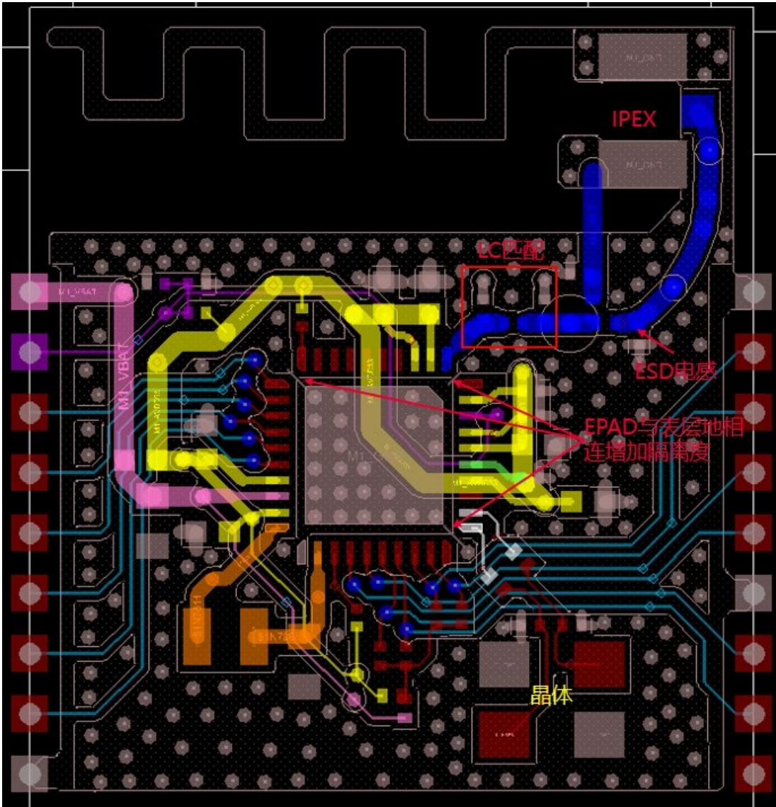

- RF 远离晶体，参考值>5mm，晶体 XOUT 与 RF 的隔离度优于-55dB。

- RF 走线的 S11 参数需要优于-15dB。

- RFI 和 RFIO 隔离度要求-32dB 以上。

- RF 远离时钟钱、电源线、DDR 和 CPU 等强干扰源。

- 射频走线参考地保证完整，不允许有交叉、换层。若需要换层，换层孔周围打一圈地孔，形成类同轴结构。

- RF connector、滤波电容电感等大焊盘器件，射频信号对应的 PIN 邻层地需挖空（2 层板除外），避免寄生电容效应射频信号耦合到地。

- IPEX 座子 TOP 层和 BOTTOM 需要就近接地并打地孔。

!!! note "说明"

    雷达检测模组 PCB 设计约束:

    - 雷达模组与整机底板单点接地，避免与整机底板主地大面积连接。

    - 雷达模组电源选择低噪声、低纹波的线性电源，或者与整机底板主供电进行滤波隔离。

    - 雷达模组贴片的下方整机底板区域禁止走线、铺铜。

    - 雷达模组射频走线避免走在靠近整机底板贴片的电气层，例如常规设计中，模组射频走线不要走BOTTOM层，消除底板噪声耦合到模组射频通道的风险。

    - 雷达模组接口插针远离天线放置，插针选择L型侧接类型，焊接建议选用表贴方式，垂直板面的金属高度尽量短。

### 时钟布线指导

- 远离天线禁布区，参考值>10mm；远离数据线，参考值>5mm。

- 晶体及其走线远离噪声源和热源。WiFi 系统对时钟要求很高，噪声源（例如 RF、BUCK）会引起系统相噪变差，热源辐射会造成晶体温漂。

- XIN/XOUT 信号走线尽量短，做过孔和包地处理。

- PCB 空间受限的场景，时钟可能会耦合 RF 干扰到芯片内部，建议在 XIN、XOUT 走线靠近芯片端串接一个 0Ω电阻用于调试。

- PCB 为 4 层板时，晶体的 GND pad 建议在 TOP 层和其他地分割，通过过孔连接到主地，防止单板上的器件发热影响时钟精度。

### GND 布线指导

EPAD 四个角向外走 GND 线，和表层 GND 连接。

EPAD 过孔建议打 6×6 个。两层板受空间限制，EPAD 对应的 BOTTOM 层分 2 个区域。

整机尽量保留一个完整地平面，保证各芯片信号良好共地和回流，完善地孔，避免孤立铜皮出现。

### 屏蔽罩

TBD

## 热设计建议

### 工作条件

!!! warning "须知"

    - 芯片的极限结温的最大值为 125°C ，任何条件下芯片的结温都不能大于该数值。

    - 芯片的长期工作结温的最大值为 105° C，正常工作条件下芯片的结温应该小于该数值。

    - 在短期工作条件下，芯片可以容忍超过 105° C（长期工作结温的最大值）而小于 125° C（极限结温的最大值）的高温，但长时间工作在超过 105° C（长期工作结温的最大值）结温下会导致芯片寿命缩减。

表5-1 芯片的结温要求

| 封装形式 | 正常工作结温下限(°C) | 长期工作最大结温(°C) | 短期工作上限结温(°C) | 破坏性最大结温(°C) | 生命周期定义 |
| -------- | -------------------- | -------------------- | -------------------- | ------------------ | ------------ |
| QFN      | -40                  | 105                  | 125                  | 125                | 10年         |

表5-2 芯片的封装热阻

| 参数                                              | 符号          | WS63 系列芯片 | 单位 |
| ------------------------------------------------- | ------------- | ------------- | ---- |
| Junction-to-ambient thermal resistance            | θJA | 57.0          | °C/W |
| Junction-to-case thermal resistance               | θJC | 27.7          | °C/W |
| Junction-to-top center of case thermal resistance | ΨJT   | -             | °C/W |
| Junction-to-board thermal resistance              | θJB | 19.44         | °C/W |

备注：热阻基于 JEDEC JESD51-2 标准给出，应用时的系统设计及环境可能与 JEDEC JESD51-2 标准不同，需要根据应用条件作出分析。

上述封装热阻参数仿真环境是JEDEC标准的4层PCB，如图5-1所示。

图5-1 JEDEC 标准的 4 层 PCB 参数  
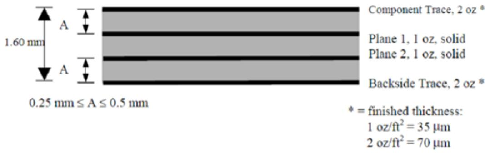

### 电路热设计参考

芯片硬件方案设计时，推荐采用 3V3_BUCK 供电方案，实现更好的性能表现。

5V_BUCK 方案和 3V3_LDO 方案仅建议在低功耗场景下采用，且应用场景中芯片位置板温建议不超过 70°C。

#### 器件布局

结合产品结构和热设计，器件布局建议如下：

- 单板上大功耗且易产生热量器件要均匀分布，避免局部过热，影响器件可靠性和散热效率。

- 合理设计结构，保证产品内部与外界有热交换途径。

- 对单板关键发热器件充分进行极端应用场景的温升测试，确保器件在安全的温度范围内长期可靠工作。

- 必要情况下，关键发热器件可以增加散热片，进一步提升散热效果。

#### PCB

走线热设计建议如下：

- 芯片底下的过孔采用 FULL 孔连接，而不是普通的花孔连接，以提高单板散热效率。

- 在热量大的器件正下方和周边尽量增大铜皮面积，特别是双面PCB单板，发热器件背面的地平面尽量减少分割，完整地平面能够有效分散热量，提高整体散热效果。另外，如果结构允许，将芯片正背面附近地平面进行亮铜处理，也能够进一步提升散热效果。

## 焊接工艺

### 概述

【目的】Objective

本章规定了客户端在用 SMT 时各温区温度基本设置。

【适用范围】Scope

芯片产品。

【基本信息】Basic information

本章主要介绍客户端在使用芯片做回流焊时工艺控制：主要是无铅工艺和混合工艺两类。

【回流焊工艺控制】Reflow Chart

定义说明：

- 芯片：均满足无铅要求。

- 无铅工艺：所有器件(主板/所有 IC/电容电阻等)均为无铅器件，并使用无铅锡膏的纯无铅工艺。

### 无铅回流焊工艺参数要求

无铅回流焊接工艺曲线如图 6-1 所示。

图6-1 无铅回流焊接工艺曲线  
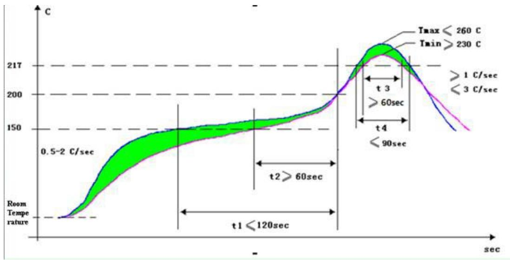  
无铅回流焊工艺参数如表 6-1 所示。

表6-1 无铅回流焊工艺参数

| 区域               | 时间    | 升温速率    | 峰值温度  | 降温速率              |
| ------------------ | ------- | ----------- | --------- | --------------------- |
| 预热区(40~150°C)   | 60~150s | ≤2.0°C/s    | -         | -                     |
| 均温区(150~200°C)  | 60~120s | &lt;1.0°C/s | -         | -                     |
| 回流区(&gt;217°C)  | 60~90s  | -           | 230~260°C | -                     |
| 冷却区(Tmax~180°C) | -       | -           | -         | 1.0°C/s≤Slope≤4.0°C/s |

!!! note "说明"

    - 预热区：温度由 40°C ~ 150°C ，温度上升速率控制在 2°C / s 左右，该温区时间为 60 s ~ 150 s 。

    - 均温区：温度由 150°C ~ 200°C ，稳定缓慢升温，温度上升速率小于 1°C / s ，且该区域时间控制在 60 s ~ 120 s （注意：该区域一定缓慢受热，否则易导致焊接不良）。

    - 回流区：温度由 217°C ~ Tmax ~ 217°C ，整个区间时间控制在 60 s ~ 90 s 。

    - 冷却区：温度由 Tmax～180°C，温度下降速率最大不能超过 4°C/s。

    - 温度从室温 25°C 升温到 250°C 时间不应该超过 6min。

    - 该回流焊曲线仅为推荐值，客户端需根据实际生产情况做相应调整。

    - 回流时间以 60s ~ 90s 为目标，对于一些热容较大无法满足时间要求的单板可将回流时间放宽至 120s。封装体耐温标准参考 IPC/JEDEC J-STD-020D 标准，封装体测温方法参考 JEP 140 标准。

IPC/JEDEC J-STD-020D 标准，封装体测温方法按照 JEP 140 标准要求：IPC/JEDEC 020D 中的无铅器件封装体耐温标准如表 6-2 所示。

表6-2 IPC/JEDEC 020D 中的无铅器件封装体耐温标准

| PackageThickness | Volume mm³ &lt; 350 | Volume mm³ 350 ~ 2000 | Volume mm³ &gt; 2000 |
| ---------------- | ------------------ | -------------------- | ------------------- |
| &lt; 1.6mm       | 260°C              | 260°C                | 260°C               |
| 1.6mm ~ 2.5mm    | 260°C              | 250°C                | 245°C               |
| &gt; 2.5mm       | 250°C              | 245°C                | 245°C               |

体积计算中不计入器件焊端（焊球，引脚）和外部散热片。

回流焊接工艺曲线测量方法：

JEP140 推荐：对于厚度较小的器件，测量封装体温度时，直接将热电偶贴放在器件表面，对于厚度较大的器件，在器件表面钻孔埋入热电偶进行测量。由于量化器件厚度的要求，推荐全部采用在封装体表面钻孔埋入热电偶的方式（特别薄器件，无法钻孔除外）。如图 6-2 所示。

图6-2 封装体测温示意图  
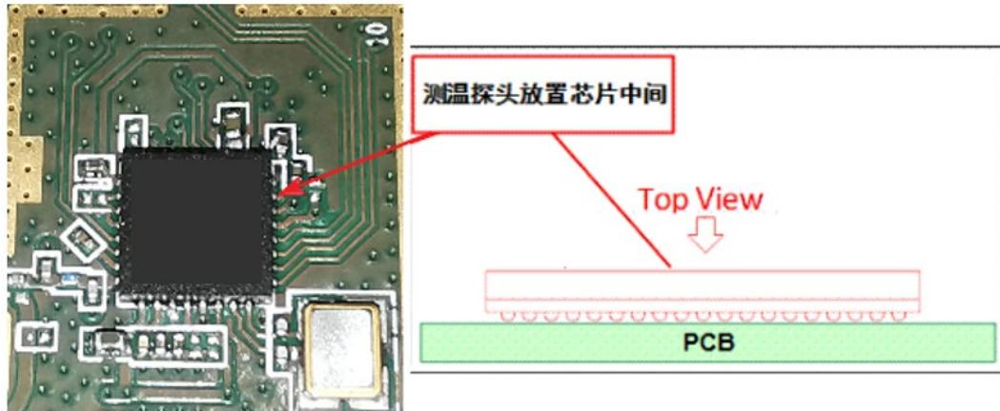

!!! note "说明"

    如果是 QFP 封装的芯片，直接将测温探头放在管脚处即可。

### 混合回流焊工艺参数要求

回流焊接过程中，如果出现器件混装现象，应首先保证无铅器件的正常焊接。具体要求如表 6-3 所示。

表6-3 混装回流焊工艺参数表

<table><tr><th colspan="2">数值要求</th><th>有铅 BGA</th><th>无铅 BGA</th><th>其它器件</th></tr><tr><td rowspan="2">预热区(40°C~150°C)</td><td>时间</td><td colspan="3">60s ~ 150s</td></tr><tr><td>升温斜率</td><td colspan="3">&lt;2.5°C/s</td></tr><tr><td rowspan="2">均温区(150°C~183°C)</td><td>时间</td><td colspan="3">30s ~ 90s</td></tr><tr><td>升温斜率</td><td colspan="3">&lt;1.0°C/s</td></tr><tr><td rowspan="2">回流区(&gt;183°C)</td><td>峰值温度</td><td>210°C~240°C</td><td>220°C~240°C</td><td>210°C~245°C</td></tr><tr><td>时间</td><td>30s~120s</td><td>60s~120s</td><td>30s~120s</td></tr><tr><td>冷却区(Tmax~150°C)</td><td>降温斜率</td><td colspan="3">1.0°C/s≤Slope≤4.0°C/s</td></tr></table>

!!! note "说明"

    以上工艺参数要求均针对焊点温度。单板上焊点最热点和最冷点均需要满足以上规范要求。

曲线调制中，还需要满足单板上元器件的封装体耐温要求。封装体耐温标准按照IPC/JEDEC J-STD-020D标准，封装体测温方法按照JEP 140标准。

IPC/JEDEC 020D 中的有铅器件封装体耐温标准如表 6-4 所示。

表6-4 IPC/JEDEC 020D 中的有铅器件封装体耐温标准

| PackageThickness | Volume mm³ &lt; 350 | Volume mm³ ≥ 350 |
| ---------------- | ------------------ | -------------- |
| &lt; 2.5mm       | 235°C              | 220°C          |
| ≥2.5mm           | 220°C              | 220°C          |

体积计算中不计入器件焊端（焊球，引脚）和外部散热片。

JEP140 标准规定测量封装体温度方法同无铅工艺，请参考「无铅回流焊工艺参数要求」的详细说明。

## 潮敏参数

### 存放与使用

【使用范围】

所有潮敏产品的存放和使用。

【存放环境】

建议产品真空包装存放，存放温度范围： ≥ -40°C ， ≤ 150°C 。推荐存放在 25°C 的环境温度下。

【存储期限】(shelf life)

存放环境<30°C/60% RH 下，真空包装存放，存储期限(shelf life)不少于 12 个月。

【车间寿命】(floor life)

在环境条件<30°C/60%下，floor life 参照表如表 7-1 所示。

表7-1 车间寿命（floor life）参照表

| 潮湿敏感等级(MSL) | 含义(即拆分后放存条件及最长时间)                  |
| ----------------- | ------------------------------------------------- |
| 1                 | 无限制,环境温湿度≤30°C/85% RH (Relative Humidity) |
| 2                 | 1year, 30°C/60%RH。                               |
| 2a                | 4week, 30°C/60%RH。                               |
| 3                 | 1week, 30°C/60%RH。                               |
| 4                 | 72h, 30°C/60%RH。                                 |
| 5                 | 48h, 30°C/60%RH。                                 |
| 5a                | 24h, 30°C/60%RH。                                 |
| 6                 | Time on Label, 30°C/60%RH。                       |

!!! note "潮敏产品的使用"

    - 产品在≤30℃/60%RH下连续或累计暴露超过2个小时，建议进行重新烘烤后再真空干燥包装。

    - 产品在≤30℃/60%RH下暴露累计没有超过2个小时，可以不用重新烘烤，但要更换新的干燥剂，进行真空干燥包装。

    - 本产品的潮敏参数等级为3级。

    本文没有提到的存储及使用原则，请直接参考 JEDEC J-STD-033A。

### 重新烘烤

【适用产品】

所有潮敏产品

【使用范围】

需要重新烘烤的潮敏产品

【重新烘烤参考表】

表7-2 重新烘烤参考表

<table><tr><th>芯片厚度</th><th>MSL 潮敏等级</th><th>烘烤 125°C</th><th>烘烤 90°C/≤5% RH</th><th>烘烤 40°C/≤5% RH</th></tr><tr><td rowspan="5">≤1.4mm</td><td>2a</td><td>3h</td><td>11h</td><td>5day</td></tr><tr><td>3</td><td>7h</td><td>23h</td><td>9day</td></tr><tr><td>4</td><td>7h</td><td>23h</td><td>9day</td></tr><tr><td>5</td><td>7h</td><td>24h</td><td>10day</td></tr><tr><td>5a</td><td>10h</td><td>24h</td><td>10day</td></tr><tr><td rowspan="5">≤2.0mm</td><td>2a</td><td>16h</td><td>2day</td><td>22day</td></tr><tr><td>3</td><td>17h</td><td>2day</td><td>23day</td></tr><tr><td>4</td><td>20h</td><td>3day</td><td>28day</td></tr><tr><td>5</td><td>25h</td><td>4day</td><td>35day</td></tr><tr><td>5a</td><td>40h</td><td>6day</td><td>56day</td></tr><tr><td rowspan="5">≤4.5mm</td><td>2a</td><td>48h</td><td>7day</td><td>67day</td></tr><tr><td>3</td><td>48h</td><td>8day</td><td>67day</td></tr><tr><td>4</td><td>48h</td><td>10day</td><td>67day</td></tr><tr><td>5</td><td>48h</td><td>10day</td><td>67day</td></tr><tr><td>5a</td><td>48h</td><td>10day</td><td>67day</td></tr></table>

!!! note "说明"

    - 此表中显示的均是受潮后，必须的最小的烘烤时间。

    - 重新烘烤优先选择低温烘烤。

    - 详细情况请参考 JEDEC。

## 接口时序

### UART 时序

WS63 系列芯片支持 3 组 UART 接口，其中 UART0 口支持两线连接（RXD、TXD），不支持流控模式，最大波特率 2Mbit/s。UART1/UART2 支持四线的协议（RXD、TXD、CTS、RTS），其中 RXD 和 TXD 用于数据传送，RTS 和 CTS 用于流控，最大波特率 5Mbit/s。UART 接口支持多种波特率，波特率大小和传送速率之间成正比关系，其速率可以通过寄存器进行配置。串口发送波特率误差小于 0.5%，串口接收波特率误差容忍度小于 1.5%，UART 接口的时序如图 8-1 所示。

图8-1 UART 接口时序图  

注：图中虚线的信号上升沿按照 0.7 × VDD ，下降沿按照 0.3 × VDD 选取。

其中：

- 标注 1 为 CTS 信号拉低到 TXD 信号有效的最大延时。

- 标注2为结束位的中点到CTS信号拉高需要保持的最大时间。

- 标注3为结束位的中点到RTS信号拉高的最大延时。

UART 时序约束如表 8-1 所示。

表8-1 UART 时序约束表

| Ref No | Characteristics                 | Min. | Typical | Max. | Unit        |
| ------ | ------------------------------- | ---- | ------- | ---- | ----------- |
| 1      | CTS low to TXD valid            | -    | -       | 1.5  | Bit Periods |
| 2      | CTS high before mid of stop bit | -    | -       | 0.5  | Bit Periods |
| 3      | Mid of stop bit to RTS high     | -    | -       | 0.5  | Bit Periods |

### I2C 时序

I2C 接口只支持 master 模式，接口传输时序如图 8-2 所示。

图8-2 I2C 传输时序图  

I2C 接口时序参数如所示。

表8-2 I2C 接口时序参数表

| 参数                         | 符号         | 标准模式最小值 | 标准模式最大值 | 快速模式最小值 | 快速模式最大值 | 单位 |
| ---------------------------- | ------------ | -------------- | -------------- | -------------- | -------------- | ---- |
| SCL时钟频率                  | fSCL    | -              | 100            | -              | 400            | kHz  |
| 启动保持时间                 | tHD;STA | 4.0            | -              | 0.6            | -              | μs   |
| SCL低电平周期                | tLOW    | 4.7            | -              | 1.3            | -              | μs   |
| SCL高电平周期                | tHIGH   | 4.0            | -              | 0.6            | -              | μs   |
| 启动建立时间                 | tSU;STA | 4.7            | -              | 0.6            | -              | μs   |
| 数据保持时间                 | tHD;DAT | 0              | 3.45           | 0              | 0.9            | μs   |
| 数据建立时间                 | tSU;DAT | 250            | -              | 100            | -              | ns   |
| SDA、SCL上升时间             | tr        | -              | 1000           | 20+0.1Cb    | 300            | ns   |
| SDA、SCL下降时间             | tf        | -              | 300            | 20+0.1Cb    | 300            | ns   |
| 结束建立时间                 | tSU;STO | 4.0            | -              | 0.6            | -              | μs   |
| 开始与结束之间的总线释放时间 | tBUF    | 4.7            | -              | 1.3            | -              | μs   |
| 总线负载                     | Cb        | -              | 400            | -              | 400            | pF   |
| 低电平噪声容限               | VnL     | 0.1VDD    | -              | 0.1VDD    | -              | V    |
| 高电平噪声容限               | VnH     | 0.2VDD    | -              | 0.2VDD    | -              | V    |

### I2S 时序

I2S 接口支持 Master/Slave 模式，接口时序 TBD。

### SPI 时序

!!! note "说明"

    以下缩略语或字母含义：
    
    • MSB: Most Significant Bit
    
    • LSB: Least Significant Bit
    
    • SPI_CK(0): spo=0
    
    • SPI_CK(1): spo=1

标准 SPI 接口（SPI0）支持 Master/Slave 模式，接口时序如图 8-3 所示。

图8-3 SPI接口时序图  

注：用作 Master 时，时钟周期最小值为 80ns；用作 Slave 时，时钟周期最小值为 80ns。

SPO（SPICLKOUT Polarity）表示 SPICLKOUT 极性，SPH（SPICLKOUT Phase）表示 SPICLKOUT 相位。

表8-3 SPI接口时序参数表

| 参数                         | 符号     | 最小值 | 最大值 | 单位 |
| ---------------------------- | -------- | ------ | ------ | ---- |
| 输出数据延迟                 | Tdd | 0      | 17.5   | ns   |
| 输入控制信号建立时间(master) | Tds | 4      | -      | ns   |
| 输入控制信号保持时间(master) | Tdh | 1.6    | -      | ns   |
| 输入控制信号建立时间(slave)  | Tds | 4      | -      | ns   |
| 输入控制信号保持时间(slave)  | Tdh | 1      | -      | ns   |

QSPI 接口（SPI1）只支持 Master 模式，不支持 XIP，接口时序 TBD。

## 注意事项

### 硬件设计

!!! warning "须知"

    防倒灌要求，对 WS63 对端设备的约束为：

    - WS63 下电状态（DVDD3318 下电），对端设备（与 WS63 的 IO 有连接的芯片或器件）与 WS63 相连的 IO 需要配置为高阻态或低电平。

    - WS63 上电状态（DVDD3318 上电），对端设备（与 WS63 的 IO 有连接的芯片或器件）与 WS63 相连的 IO 根据实际情况配置为输入或者输出。

    - 有上拉电阻的管脚（例如 UART0/1）的上拉电源建议连接到 WS63 的 DVDD3318。芯片下电后，UART0/UART1 串口总线保持低电平，防止高电平倒灌进芯片。

    在硬件设计中的几个注意事项：

    - 硬件方案设计时，推荐采用 3V3_BUCK 供电方案，实现更好的性能表现。5V_BUCK 方案和 3V3_LDO 方案仅建议在低功耗场景下采用。

    - PWR_ON 管脚高电平使能，芯片内部默认有 MΩ 级下拉，设计时参考 “3.1.2 复位电路”。

    - 硬件配置字相关的 GPIO_01/GPIO_03/GPIO_04/GPIO_06/PWR_SEL（即 PIN5/7/8/10/23），设计时参考“3.1.3 硬件初始化系统配置电路”。

    - WS63 系列芯片的参考设计单板经过发射 EVM、接收灵敏度、认证等 WiFi 射频指标测试。围绕芯片的去耦电容容值及摆放位置尽量不要变动，如果必须修改，需要针对单板发射 EVM、接收灵敏度、认证等 WiFi 射频指标进行详细摸底测试。

    - RF 链路使用 LC 组成的 π 形低通滤波器建议不要更改，尤其是接地电容的地焊盘和地孔处理方式。

    - 当前提供的参考设计与器件选型主要是实验室测试与样品测试。用户在量产导入时，建议进行全面的产品硬件测试与评估，按照量产流程逐步完成导入。

### 单板生产工艺

单板生产工艺的几个注意事项：

- 单板分板需要使用机器分板，严禁手工分板。

- 手工焊接前请做好静电放电处理，佩戴静电手镯。

- PCB存储条件建议：

    \-  OSP (Organic Solderability Preservative) 板

        真空包装前后的存放条件：温度 20°C ~ 30°C ，相对湿度 50%。真空包装后寿命 3 个月～1 年。储存时间超过 6 个月时，通常拆封后即可组装，但为了避免板材储藏湿气造成爆板，可以烘烤方式来去除板内湿气，烘烤条件为 110°C ~ 120°C ，1h（最长时间不要超过 1.5h）。

    \-  喷锡板

        真空包装前后的存放条件：温度 25° C，相对湿度 60%。真空包装后寿命 1 年。储存时间超过 6 个月时，通常拆封后即可组装，但为了避免板材储藏湿气造成爆板，可以烘烤方式来去除板内湿气，烘烤条件为 120° C，1h（最长时间不要超过 1.5h）。

## 缩略语

<table class="ws63-abbr-table" style="border: none !important; outline: none !important; border-collapse: collapse; border-spacing: 0; box-shadow: none;"><tr><td colspan="3" style="border: none !important;padding:8px 8px 2px 8px;font-weight:bold;text-align:left;">A</td></tr><tr><td style="border: none !important;padding:2px 8px;text-align:left;">AC</td><td style="border: none !important;padding:2px 8px;text-align:left;">Alternating Current</td><td style="border: none !important;padding:2px 8px;text-align:left;">交流(电)</td></tr><tr><td style="border: none !important;padding:2px 8px;text-align:left;">ADC</td><td style="border: none !important;padding:2px 8px;text-align:left;">Analog to Digital Converter</td><td style="border: none !important;padding:2px 8px;text-align:left;">模数转换器</td></tr><tr><td style="border: none !important;padding:2px 8px;text-align:left;">ALE</td><td style="border: none !important;padding:2px 8px;text-align:left;">Address Latch Enable</td><td style="border: none !important;padding:2px 8px;text-align:left;">地址锁存使能</td></tr><tr><td colspan="3" style="border: none !important;padding:8px 8px 2px 8px;font-weight:bold;text-align:left;">C</td></tr><tr><td style="border: none !important;padding:2px 8px;text-align:left;">CPU</td><td style="border: none !important;padding:2px 8px;text-align:left;">Central Processing Unit</td><td style="border: none !important;padding:2px 8px;text-align:left;">中央处理单元</td></tr><tr><td style="border: none !important;padding:2px 8px;text-align:left;">CS</td><td style="border: none !important;padding:2px 8px;text-align:left;">Chip Select</td><td style="border: none !important;padding:2px 8px;text-align:left;">片选</td></tr><tr><td colspan="3" style="border: none !important;padding:8px 8px 2px 8px;font-weight:bold;text-align:left;">D</td></tr><tr><td style="border: none !important;padding:2px 8px;text-align:left;">DDR</td><td style="border: none !important;padding:2px 8px;text-align:left;">Double Data Rate</td><td style="border: none !important;padding:2px 8px;text-align:left;">双数据速率</td></tr><tr><td colspan="3" style="border: none !important;padding:8px 8px 2px 8px;font-weight:bold;text-align:left;">E</td></tr><tr><td style="border: none !important;padding:2px 8px;text-align:left;">EPAD</td><td style="border: none !important;padding:2px 8px;text-align:left;">Exposed PAD</td><td style="border: none !important;padding:2px 8px;text-align:left;"></td></tr><tr><td colspan="3" style="border: none !important;padding:8px 8px 2px 8px;font-weight:bold;text-align:left;">F</td></tr><tr><td style="border: none !important;padding:2px 8px;text-align:left;">FLASH</td><td style="border: none !important;padding:2px 8px;text-align:left;">FLASH memory</td><td style="border: none !important;padding:2px 8px;text-align:left;">闪速存储器</td></tr><tr><td colspan="3" style="border: none !important;padding:8px 8px 2px 8px;font-weight:bold;text-align:left;">I</td></tr><tr><td style="border: none !important;padding:2px 8px;text-align:left;">I2C</td><td style="border: none !important;padding:2px 8px;text-align:left;">The Inter-Integrated Circuit</td><td style="border: none !important;padding:2px 8px;text-align:left;">一种串行总线协议标准</td></tr><tr><td style="border: none !important;padding:2px 8px;text-align:left;">I2S</td><td style="border: none !important;padding:2px 8px;text-align:left;">Inter-IC Sound</td><td style="border: none !important;padding:2px 8px;text-align:left;">一种音频数据传输总线标准</td></tr><tr><td style="border: none !important;padding:2px 8px;text-align:left;">IO</td><td style="border: none !important;padding:2px 8px;text-align:left;">Input Output</td><td style="border: none !important;padding:2px 8px;text-align:left;">输入输出</td></tr><tr><td style="border: none !important;padding:2px 8px;text-align:left;">IPU</td><td style="border: none !important;padding:2px 8px;text-align:left;">Internal Pull-Up</td><td style="border: none !important;padding:2px 8px;text-align:left;">内部上拉</td></tr><tr><td style="border: none !important;padding:2px 8px;text-align:left;">J</td><td style="border: none !important;padding:2px 8px;text-align:left;"></td><td style="border: none !important;padding:2px 8px;text-align:left;"></td></tr><tr><td style="border: none !important;padding:2px 8px;text-align:left;">JEDEC</td><td style="border: none !important;padding:2px 8px;text-align:left;">Joint Electron Device Engineering Council</td><td style="border: none !important;padding:2px 8px;text-align:left;">电子元件工业联合会</td></tr><tr><td style="border: none !important;padding:2px 8px;text-align:left;">JTAG</td><td style="border: none !important;padding:2px 8px;text-align:left;">Joint Test Action Group</td><td style="border: none !important;padding:2px 8px;text-align:left;">联合测试行动小组</td></tr><tr><td style="border: none !important;padding:2px 8px;text-align:left;">L</td><td style="border: none !important;padding:2px 8px;text-align:left;"></td><td style="border: none !important;padding:2px 8px;text-align:left;"></td></tr><tr><td style="border: none !important;padding:2px 8px;text-align:left;">LSB</td><td style="border: none !important;padding:2px 8px;text-align:left;">Least Significant Byte</td><td style="border: none !important;padding:2px 8px;text-align:left;">最低有效字节</td></tr><tr><td style="border: none !important;padding:2px 8px;text-align:left;">M</td><td style="border: none !important;padding:2px 8px;text-align:left;"></td><td style="border: none !important;padding:2px 8px;text-align:left;"></td></tr><tr><td style="border: none !important;padding:2px 8px;text-align:left;">MSB</td><td style="border: none !important;padding:2px 8px;text-align:left;">Most Significant Bit</td><td style="border: none !important;padding:2px 8px;text-align:left;">最高位</td></tr><tr><td style="border: none !important;padding:2px 8px;text-align:left;">N</td><td style="border: none !important;padding:2px 8px;text-align:left;"></td><td style="border: none !important;padding:2px 8px;text-align:left;"></td></tr><tr><td style="border: none !important;padding:2px 8px;text-align:left;">NC</td><td style="border: none !important;padding:2px 8px;text-align:left;">No Connection</td><td style="border: none !important;padding:2px 8px;text-align:left;">未连接</td></tr><tr><td style="border: none !important;padding:2px 8px;text-align:left;">O</td><td style="border: none !important;padding:2px 8px;text-align:left;"></td><td style="border: none !important;padding:2px 8px;text-align:left;"></td></tr><tr><td style="border: none !important;padding:2px 8px;text-align:left;">OD</td><td style="border: none !important;padding:2px 8px;text-align:left;">Open Drain</td><td style="border: none !important;padding:2px 8px;text-align:left;">漏极开路门</td></tr><tr><td style="border: none !important;padding:2px 8px;text-align:left;">P</td><td style="border: none !important;padding:2px 8px;text-align:left;"></td><td style="border: none !important;padding:2px 8px;text-align:left;"></td></tr><tr><td style="border: none !important;padding:2px 8px;text-align:left;">PCB</td><td style="border: none !important;padding:2px 8px;text-align:left;">Physical Control Block</td><td style="border: none !important;padding:2px 8px;text-align:left;">物理控制块</td></tr><tr><td style="border: none !important;padding:2px 8px;text-align:left;">PWM</td><td style="border: none !important;padding:2px 8px;text-align:left;">Pulse Width Modulation</td><td style="border: none !important;padding:2px 8px;text-align:left;">脉宽调制</td></tr><tr><td style="border: none !important;padding:2px 8px;text-align:left;">R</td><td style="border: none !important;padding:2px 8px;text-align:left;"></td><td style="border: none !important;padding:2px 8px;text-align:left;"></td></tr><tr><td style="border: none !important;padding:2px 8px;text-align:left;">RST</td><td style="border: none !important;padding:2px 8px;text-align:left;">Reset</td><td style="border: none !important;padding:2px 8px;text-align:left;">复位</td></tr><tr><td style="border: none !important;padding:2px 8px;text-align:left;">RX</td><td style="border: none !important;padding:2px 8px;text-align:left;">Reception</td><td style="border: none !important;padding:2px 8px;text-align:left;">接收</td></tr><tr><td style="border: none !important;padding:2px 8px;text-align:left;">S</td><td style="border: none !important;padding:2px 8px;text-align:left;"></td><td style="border: none !important;padding:2px 8px;text-align:left;"></td></tr><tr><td style="border: none !important;padding:2px 8px;text-align:left;">SCL</td><td style="border: none !important;padding:2px 8px;text-align:left;">Serial Clock Line</td><td style="border: none !important;padding:2px 8px;text-align:left;">串行时钟线</td></tr><tr><td style="border: none !important;padding:2px 8px;text-align:left;">SDA</td><td style="border: none !important;padding:2px 8px;text-align:left;">Serial Data and Address</td><td style="border: none !important;padding:2px 8px;text-align:left;">串行数据地址线</td></tr><tr><td style="border: none !important;padding:2px 8px;text-align:left;">SPI</td><td style="border: none !important;padding:2px 8px;text-align:left;">SDH Physical Interface</td><td style="border: none !important;padding:2px 8px;text-align:left;">SDH 物理接口</td></tr><tr><td style="border: none !important;padding:2px 8px;text-align:left;">STA</td><td style="border: none !important;padding:2px 8px;text-align:left;">Static Timing Analysis</td><td style="border: none !important;padding:2px 8px;text-align:left;">静态时序分析</td></tr><tr><td style="border: none !important;padding:2px 8px;text-align:left;">SYNC</td><td style="border: none !important;padding:2px 8px;text-align:left;">Synchronization (network)</td><td style="border: none !important;padding:2px 8px;text-align:left;">同步(网)</td></tr><tr><td style="border: none !important;padding:2px 8px;text-align:left;">U</td><td style="border: none !important;padding:2px 8px;text-align:left;"></td><td style="border: none !important;padding:2px 8px;text-align:left;"></td></tr><tr><td style="border: none !important;padding:2px 8px;text-align:left;">UART</td><td style="border: none !important;padding:2px 8px;text-align:left;">Universal Asynchronous Receiver &amp; Transmitter</td><td style="border: none !important;padding:2px 8px;text-align:left;">通用异步收发器</td></tr><tr><td style="border: none !important;padding:2px 8px;text-align:left;">USB</td><td style="border: none !important;padding:2px 8px;text-align:left;">Universal Serial Bus</td><td style="border: none !important;padding:2px 8px;text-align:left;">通用串行总线</td></tr></table>