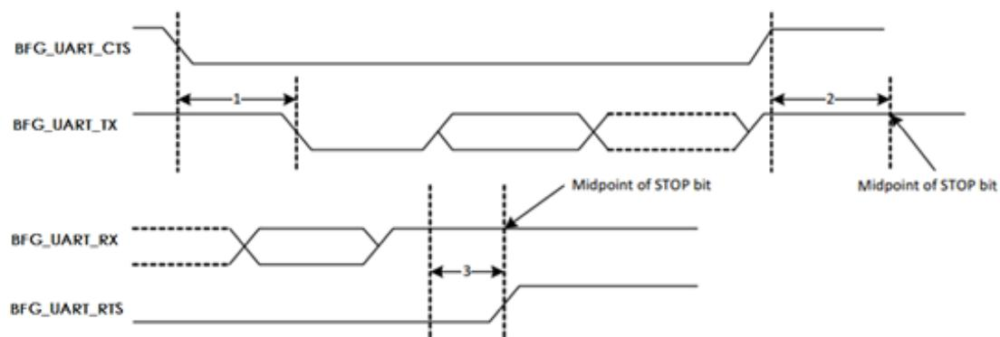
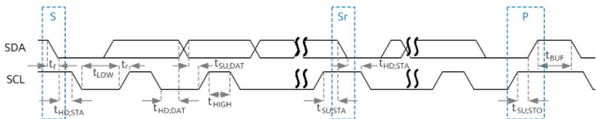
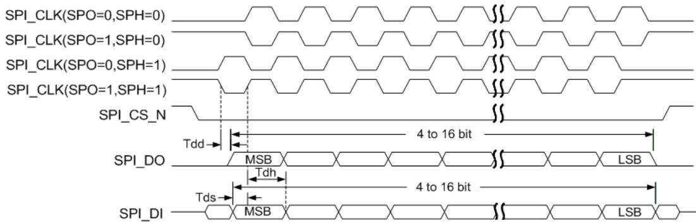

# 接口时序

## UART 时序

WS63 系列芯片支持 3 组 UART 接口，其中 UART0 口支持两线连接（RXD、TXD），不支持流控模式，最大波特率 2Mbit/s。UART1/UART2 支持四线的协议（RXD、TXD、CTS、RTS），其中 RXD 和 TXD 用于数据传送，RTS 和 CTS 用于流控，最大波特率 5Mbit/s。UART 接口支持多种波特率，波特率大小和传送速率之间成正比关系，其速率可以通过寄存器进行配置。串口发送波特率误差小于 0.5%，串口接收波特率误差容忍度小于 1.5%，UART 接口的时序如图 8-1 所示。

图8-1 UART 接口时序图  

注：图中虚线的信号上升沿按照 0.7 × VDD ，下降沿按照 0.3 × VDD 选取。

其中：

- 标注 1 为 CTS 信号拉低到 TXD 信号有效的最大延时。

- 标注2为结束位的中点到CTS信号拉高需要保持的最大时间。

- 标注3为结束位的中点到RTS信号拉高的最大延时。

UART 时序约束如表 8-1 所示。

表8-1 UART 时序约束表

| Ref No | Characteristics                 | Min. | Typical | Max. | Unit        |
| ------ | ------------------------------- | ---- | ------- | ---- | ----------- |
| 1      | CTS low to TXD valid            | -    | -       | 1.5  | Bit Periods |
| 2      | CTS high before mid of stop bit | -    | -       | 0.5  | Bit Periods |
| 3      | Mid of stop bit to RTS high     | -    | -       | 0.5  | Bit Periods |

## I2C 时序

I2C 接口只支持 master 模式，接口传输时序如图 8-2 所示。

图8-2 I2C 传输时序图  

I2C 接口时序参数如所示。

表8-2 I2C 接口时序参数表

| 参数                         | 符号         | 标准模式最小值 | 标准模式最大值 | 快速模式最小值 | 快速模式最大值 | 单位 |
| ---------------------------- | ------------ | -------------- | -------------- | -------------- | -------------- | ---- |
| SCL时钟频率                  | fSCL    | -              | 100            | -              | 400            | kHz  |
| 启动保持时间                 | tHD;STA | 4.0            | -              | 0.6            | -              | μs   |
| SCL低电平周期                | tLOW    | 4.7            | -              | 1.3            | -              | μs   |
| SCL高电平周期                | tHIGH   | 4.0            | -              | 0.6            | -              | μs   |
| 启动建立时间                 | tSU;STA | 4.7            | -              | 0.6            | -              | μs   |
| 数据保持时间                 | tHD;DAT | 0              | 3.45           | 0              | 0.9            | μs   |
| 数据建立时间                 | tSU;DAT | 250            | -              | 100            | -              | ns   |
| SDA、SCL上升时间             | tr        | -              | 1000           | 20+0.1Cb    | 300            | ns   |
| SDA、SCL下降时间             | tf        | -              | 300            | 20+0.1Cb    | 300            | ns   |
| 结束建立时间                 | tSU;STO | 4.0            | -              | 0.6            | -              | μs   |
| 开始与结束之间的总线释放时间 | tBUF    | 4.7            | -              | 1.3            | -              | μs   |
| 总线负载                     | Cb        | -              | 400            | -              | 400            | pF   |
| 低电平噪声容限               | VnL     | 0.1VDD    | -              | 0.1VDD    | -              | V    |
| 高电平噪声容限               | VnH     | 0.2VDD    | -              | 0.2VDD    | -              | V    |

## I2S 时序

I2S 接口支持 Master/Slave 模式，接口时序 TBD。

## SPI 时序

!!! note "说明"

    以下缩略语或字母含义：
    
    • MSB: Most Significant Bit
    
    • LSB: Least Significant Bit
    
    • SPI_CK(0): spo=0
    
    • SPI_CK(1): spo=1

标准 SPI 接口（SPI0）支持 Master/Slave 模式，接口时序如图 8-3 所示。

图8-3 SPI接口时序图  

注：用作 Master 时，时钟周期最小值为 80ns；用作 Slave 时，时钟周期最小值为 80ns。

SPO（SPICLKOUT Polarity）表示 SPICLKOUT 极性，SPH（SPICLKOUT Phase）表示 SPICLKOUT 相位。

表8-3 SPI接口时序参数表

| 参数                         | 符号     | 最小值 | 最大值 | 单位 |
| ---------------------------- | -------- | ------ | ------ | ---- |
| 输出数据延迟                 | Tdd | 0      | 17.5   | ns   |
| 输入控制信号建立时间(master) | Tds | 4      | -      | ns   |
| 输入控制信号保持时间(master) | Tdh | 1.6    | -      | ns   |
| 输入控制信号建立时间(slave)  | Tds | 4      | -      | ns   |
| 输入控制信号保持时间(slave)  | Tdh | 1      | -      | ns   |

QSPI 接口（SPI1）只支持 Master 模式，不支持 XIP，接口时序 TBD。
