# 原理图设计建议

## 小系统设计建议

WS63V100 系列芯片内部集成自研 CPU，小系统指芯片电路能够正常工作的最小外围电路配置，此部分的电路主要包括：时钟电路、复位电路。

### 时钟参考设计

CPU 支持的晶体时钟 24MHz/40MHz，在使用外部晶体时，电路结构如图 3-1 所示。硬件设计时，时钟管脚靠近芯片端预留 0Ω电阻串位，当晶体与 RF 隔离度不满足要求时，可通过串接电感改善隔离度。

图3-1 使用 Crystal 输入参考时钟的参考电路图  
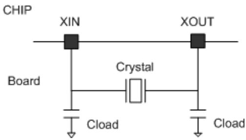  
WS63 系列芯片时钟电路外部 Crystal 电气特性的要求如表 3-1 和表 3-2 所示。

表3-1 40MCrystal 电气特性要求

| 参数               | 符号  | 晶体选型规格 |           |           | 单位 | 说明                                                                |
| ------------------ | ----- | ------------ | --------- | --------- | ---- | ------------------------------------------------------------------- |
| 标称频率           | f     | 40           | 40        | 40        | MHz  | -                                                                   |
| 负载电容           | CL    | 8            | 9         | 10        | pF   | -                                                                   |
| 频率容差           | f_tol | ±10          | ±10       | ±10       | ppm  | 晶体初始频偏                                                        |
| 等效电阻           | ESR   | ≤50          | ≤40       | ≤35       | Ohm  | 影响起振                                                            |
| 动态电容           | C1    | ≥2.8         | ≥3.4      | ≥4        | fF   | 影响频率校准                                                        |
| 静态电容           | C0    | ≤3           | ≤3        | ≤3        | pF   | -                                                                   |
| 激励功率           | DL    | ≥150         | ≥150      | ≥150      | uW   | -                                                                   |
| 工作温度           | T     | -40~85       | -40~85    | -40~85    | °C   | -                                                                   |
| 板级负载电容(单端) | CL1   | 2.2(参考值)  | 4(参考值) | 6(参考值) | pF   | 需根据板级寄生、封装寄生电容调整。8pF CL1可选,9pF/10pFCL1必须上件。 |

表3-2 24MCrystal 电气特性要求

| 参数               | 符号  | 晶体选型规格 | 单位 | 备注                                      |
| ------------------ | ----- | ------------ | ---- | ----------------------------------------- |
| 标称频率           | f     | 24           | MHz  | -                                         |
| 负载电容           | CL    | 8            | pF   | -                                         |
| 频率容差           | f_tol | ±10          | ppm  | 晶体初始频偏                              |
| 等效电阻           | ESR   | ≤100         | Ohm  | -                                         |
| 动态电容           | C1    | ≥3           | fF   | -                                         |
| 静态电容           | C0    | ≤3           | pF   | -                                         |
| 工作温度           | T     | -40~85       | °C   | -                                         |
| 激励功率           | DL    | ≥150         | μW   | -                                         |
| 板级负载电容(单端) | CL1   | 2.2 (参考值) | pF   | 根据板级寄生、封装寄生电容调整。CL1可选。 |

CL1 实际调测步骤如下（需要使用综测仪进行测试，综测仪可以直接测试出频偏）：

步骤 1 8pF 默认板级无负载电容 CL0=0；9pF 默认 xin 与 xou 上件 2pF，CL0=2；10pF 默认 xin 与 xou 上件 4pF，CL0=4。

- 配置频偏校准粗调码值 xo_trim_coarse=0，频偏校准细调码值 xo_trim_fine=0，记录此时频偏为 fmax。

- 配置频偏校准粗调码值 xo_trim_coarse=15，频偏校准细调码值 xo_trim_fine=127，记录此时频偏为 fmin。

步骤 2 若 fmax ≥ 35ppm 且 fmin ≤ -35ppm ，则不需要增加 CL1，调测结束；若不满足，则进行步骤 3~步骤 7。

步骤 3 板级负载电容根据 CL=8pF/9pF/10pF 分别在 xin 与 xout 上件 1pF/2pF/4pF；配置频偏校准粗调码值 xo_trim_coarse=0，频偏校准细调码值 xo_trim_fine=0，记录此时频偏为 f0（此时 CL=9pF/10pF 的 f0 即为第一步的 fmax）。

步骤 4 板级负载电容在第 2 步的基础上增大 1pF，根据 CL=8pF/9pF/10pF 分别在 xin 与 xout 上件 2pF/3pF/5pF；配置频偏校准粗调码值 xo_trim_coarse=0，频偏校准细调码值 xo_trim_fine=0，记录此时频偏为 f1。

步骤 5 此时得到频偏调节率 ratio_adjust=(f1-f0)/1pF，则进一步可以计算可以得到 CL1=(fmax+fmin)/2/ratio_adjust+CL0。

步骤 6 将得到的 CL1 分别在 xin 与 xout 上件，此时测得 fmax≈-fmin，此时 CL1 为最佳值。

步骤 7 为保证测试准确，推荐测试 3pcs 单板来保证一致性。

----结束

以 CL=8pF 为例，如表 3-3 所示。

表3-3 CL1 测试举例

<table><tr><th>晶体 CL</th><th>xin 与xou 上件容值</th><th>xo_trim_coarse</th><th>xo_trim_fine</th><th>fmax</th><th>fmin</th><th>f0</th><th>f1</th></tr><tr><td rowspan="4">8pF</td><td>0</td><td>0</td><td>0</td><td>100ppm</td><td>-</td><td>-</td><td>-</td></tr><tr><td>0</td><td>15</td><td>127</td><td>-</td><td>-20ppm</td><td>-</td><td>-</td></tr><tr><td>1pF</td><td>0</td><td>0</td><td>-</td><td>-</td><td>90ppm</td><td>-</td></tr><tr><td>2pF</td><td>0</td><td>0</td><td>-</td><td>-</td><td>-</td><td>80ppm</td></tr><tr><td colspan="8">此时 ratio_adjust=10ppm/1pF,CL1=(100-20)/2/10+0=4pF</td></tr><tr><td rowspan="2">8pF</td><td>4pF</td><td>0</td><td>0</td><td>60ppm</td><td>-</td><td>-</td><td>-</td></tr><tr><td>4pF</td><td>15</td><td>127</td><td>-</td><td>-60ppm</td><td>-</td><td>-</td></tr></table>

!!! note "说明"

    配置频偏校准粗调码值与细调码值命令详细说明请参见《WS63V100 产线工装用户指南》。

WS63 系列芯片支持 24MHz、40MHz 参考时钟频率。参考时钟频率通过 GPIO_06 的硬件配置字进行判断，上电时通过读取 GPIO_06 高低电平选择内部分频系数。外部时钟选择真值如表 3-4 所示。

表3-4 外部时钟选择真值表

| 时钟频率 | REFCLK_FREQ_STATUS | 说明                    |
| -------- | ------------------ | ----------------------- |
| 40MHz    | 0                  | 默认内部下拉。          |
| 24MHz    | 1                  | 上拉 2.2kΩ到 DVDD3318。 |

图3-2 频率选择管脚参考电路图  
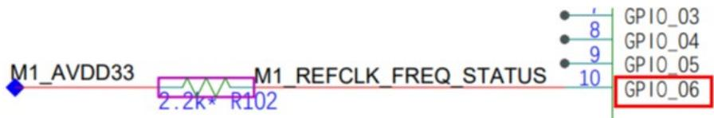

### 复位电路

WS63V100 系列芯片集成内部 POR（Power On Reset）电路以及 Watchdog，PWR_ON 管脚为芯片复位管脚，低电平使能。PWR_ON 上电必须要晚于 AVDD33 和 DVDD3318 电源 1ms，建议在 PWR_ON 管脚增加 RC 延时电路，例如 R=20kΩ，C=220nF，RC 参数约为 4.4ms。

图3-3 PWR_ON 电路设计参考  
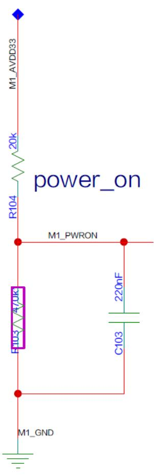

!!! note "说明"

    硬件设计时，power_on 管脚建议上件 RC 延时电路，根据电源上电响应速度，调节 RC 参数，保证上电时序满足芯片规格约束；同时预留下拉电阻位置，作为下电快速泄放通道和 power_on 分压控制电路使用。

### 硬件初始化系统配置电路

WS63V100 系列芯片的 PIN23 为电源方案配置管脚，当 VBAT 电源选择 3V3 方案时，PIN23 需跟随电源启动拉高。芯片 PIN7、8、10 为硬件配置字，PIN5、13、15 为芯片保留的硬件配置字，硬件配置字管脚在芯片内部默认有 28kΩ 左右的下拉电阻。芯片上电初始化时会检测 6 个硬件配置字引脚的电平状态，以进入不同的工作模式，详情见表 3-5，使用时必须注意芯片上电初始化时的引脚初始输入电平。若需通过上拉电阻将硬件配置字上电初始化时设置为高电平，PIN7、PIN8、PIN10 建议通过 2.2kΩ 电阻上拉到 DVDD3318。

表3-5 硬件配置字信号描述

<table><tr><th>信号名</th><th>PIN</th><th>管脚电平</th><th>芯片工作模式</th></tr><tr><td rowspan="2">FLASH BOOT (GPIO_03)</td><td rowspan="2">7</td><td>0</td><td>正常启动</td></tr><tr><td>1</td><td>进烧录模式</td></tr><tr><td rowspan="2">JTAG_ENABLE (GPIO_04)</td><td rowspan="2">8</td><td>0</td><td>正常启动</td></tr><tr><td>1</td><td>使能 JTAG 调试接口</td></tr><tr><td rowspan="2">REFCLK_FREQ_STATUS (GPIO_06)</td><td rowspan="2">10</td><td>0</td><td>时钟选择 40MHz</td></tr><tr><td>1</td><td>时钟选择 24MHz</td></tr><tr><td rowspan="2">保留 1 (GPIO_01)</td><td rowspan="2">5</td><td>0</td><td>正常工作模式</td></tr><tr><td>1</td><td>禁止</td></tr><tr><td rowspan="4">保留 2 (GPIO_11):保留 3 (GPIO_09)</td><td rowspan="4">15:13</td><td>0:0</td><td>正常工作模式</td></tr><tr><td>0:1</td><td>正常工作模式</td></tr><tr><td>1:0</td><td>正常工作模式</td></tr><tr><td>1:1</td><td>禁止</td></tr></table>

注：
1. 上电初始化时，硬件配置字 JTAG_ENABLE 高电平使能后，GPIO13 和 GPIO14 固定使用为 JTAG 接口。
2. 上电初始化时，硬件配置字 FLASH_BOOT 高电平使能后，芯片启动流程会停留在 BOOT 阶段，等待烧录。

表3-6 电源方案选择管脚说明

<table><tr><th>信号名</th><th>PIN</th><th>管脚电平</th><th>芯片工作模式</th></tr><tr><td rowspan="2">PWR_SEL</td><td rowspan="2">23</td><td>0</td><td>VBAT_IN 采用 5V 供电。</td></tr><tr><td>1</td><td>VBAT_IN 采用 3V3 供电。</td></tr></table>

!!! warning "须知"

    - 特别注意：不要使硬件配置字进入表3-5中所描述的禁用状态。

    - 芯片使用时，必须注意在上电初始化过程中 PIN5、7、8、10、13、15 所有的 6 个硬件配置字管脚的电平状态（包含对端芯片及器件以及板级上下拉电阻对硬件配置字管脚上电初始化电平的影响）。

    - 芯片保留的硬件配置字管脚 PIN5、13、15，硬件设计时相应管脚禁止加上拉电阻。

    - 上电过程中硬件配置字详细的时序约束请参考图2-1。

    - 芯片上电过程中，在 PWR_ON 管脚拉高前至少 1ms，拉高后至少 10ms 的时间内，需要保证所有硬件配置字管脚电平状态稳定不变；

    - 由于硬件配置字管脚对上电时序有约束，所以不建议作为功能 IO 使用，以避免初始化时电平识别错误从而导致功能异常；

    - 如果基于设计需求，需要将硬件配置字管脚做 IO 使用，注意引脚上电初始化电平是否满足芯片启动要求，以及默认上下拉电阻所带来的影响。

## 电源参考设计

!!! note "说明"

    系统电源的设计，详细请参见 WS63 原理图。

### 电源方案

WS63 系列芯片共有 3 种芯片电源方案，分别为 5V BUCK 方案，3.3V BUCK 方案，3.3V LDO 方案，因此在不同电源方案芯片引脚及外围电路存在差异。

- 方案一：5V BUCK 方案。BUCK_LX 连接板级 2.2uH 电感，然后连接到 BUCK_OUT；BUCK_OUT 近端添加 10uF 电容；VDD_DIG 管脚浮空；PWR_SEL 管脚接地。VBAT_IN 接 5V 板级输入电压；VDD33_OUT 输出 3.3V，通过硬件连接到 BUCK_IN 及整芯片需要 3.3V 电压的管脚。

- 方案二：3.3V BUCK 方案。BUCK_LX 连接板级 2.2uH 电感，然后连接到 BUCK_OUT；BUCK_OUT 近端添加 10uF 电容；VDD_DIG 管脚浮空；PWR_SEL 管脚接 3.3V。VBAT_IN 接 3.3V 板级输入电压；VDD33_OUT、BUCK_IN 接板级 3.3V。

- 方案三：3.3V LDO方案。BUCK_LX连接板级3.3V电压；BUCK_OUT管脚浮空；VDD_DIG近端添加1uF电容；PWR_SEL管脚接3.3V。VBAT_IN接3.3V板级输入电压；VDD33_OUT、BUCK_IN接板级3.3V。

WS63 系列芯片 3 种电源方案示意如图 3-4、图 3-5 和图 3-6 所示。

图3-4 WS63 系列芯片 5V BUCK 方案

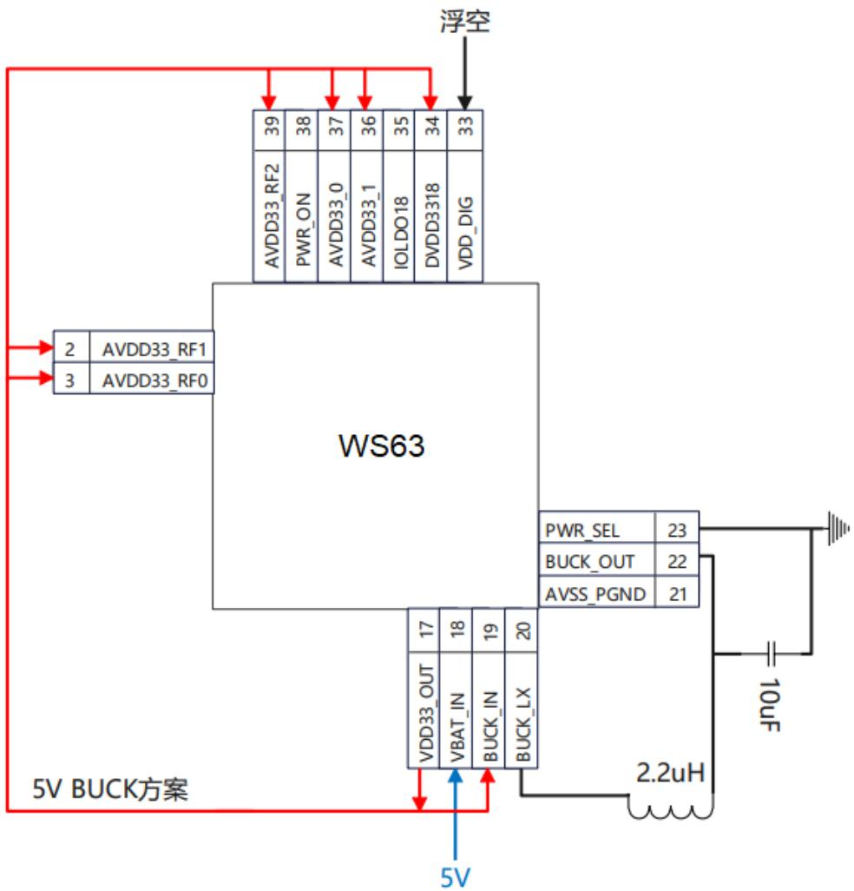

图3-5 WS63 系列芯片 3.3V BUCK 方案  
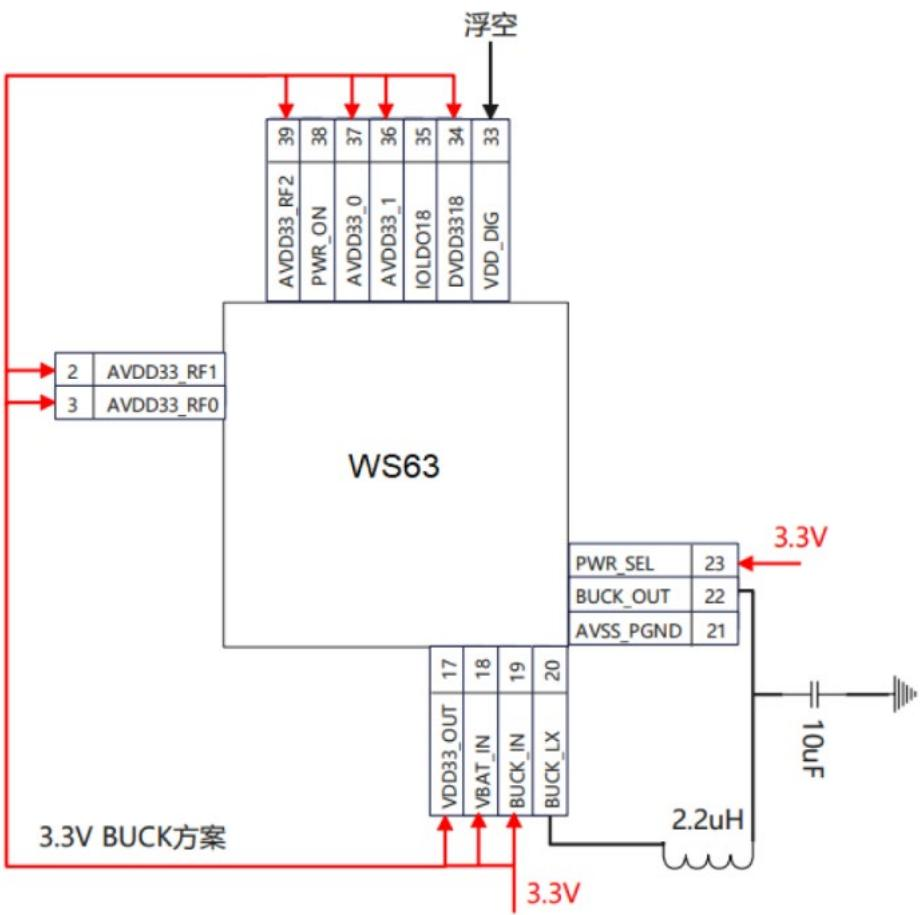

图3-6 WS63 系列芯片 3.3V LDO 方案  
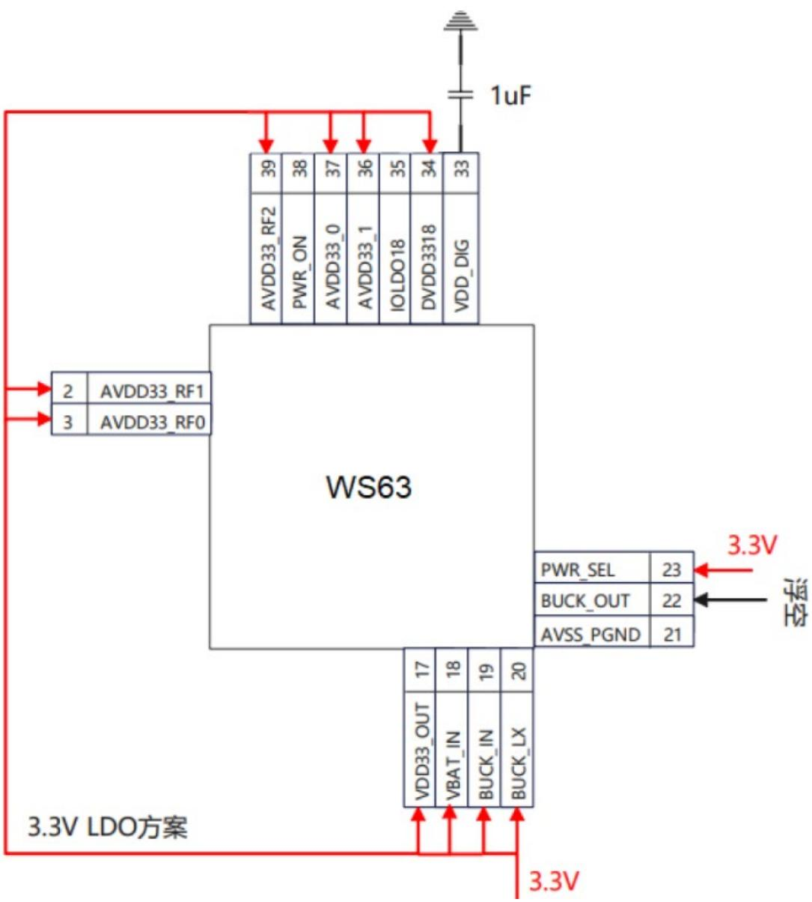

!!! note "说明"

    1. 硬件方案设计时，推荐采用 3V3_BUCK 供电方案，实现更好的性能表现。5V_BUCK 方案和 3V3_LDO 方案仅建议在低功耗场景下采用，且应用场景中芯片位置板温建议不超过 70°C。

    2. 电源管脚DVDD3318支持3.3V或1.8V供电。当DVDD3318采用1.8V供电时，硬件设计上需要将PIN35（IOLDO18）和PIN34（DVDD3318）短接，由外部提供1.8V电压。

### 电源规格

需要的外部电源包括：

- 供电电源 VBAT_IN

- IO 电源 DVDD3318

推荐工作条件如表 3-7 所示。

表3-7 推荐工作条件

| 符号       | PIN序号 | 说明                                   | 最小值(V) | 典型值(V) | 最大值(V) | 电压精度DC+AC | PCB布线参考电流值(mA)(仅供布线参考) |
| ---------- | ------- | -------------------------------------- | --------- | --------- | --------- | ------------- | ----------------------------------- |
| AVDD33_RF1 | 2       | 由外部电源提供。                       | 3.0       | 3.3       | 3.6       | ±5%           | 400                                 |
| AVDD33_RF0 | 3       | 由外部电源提供。                       | 3.0       | 3.3       | 3.6       | ±5%           | 100                                 |
| AVDD33_RF2 | 39      | 由外部电源提供。                       | 3.0       | 3.3       | 3.6       | ±5%           | 100                                 |
| AVDD33_0   | 37      | AVDD33供电电源,由外部电源提供。        | 3.0       | 3.3       | 3.6       | ±5%           | 50                                  |
| AVDD33_1   | 36      | 由外部电源提供。                       | 3.0       | 3.3       | 3.6       | ±5%           | 140                                 |
| IOLDO18    | 35      | 内部LDO_DECAP,外置1μF。                | -         | 1.8       | -         | ±5%           | 200                                 |
| DVDD3318   | 34      | IO电源,由外部电源提供。                | 1.62      | 1.8/3.3   | 3.63      | ±5%           | 300                                 |
| VDD_DIG    | 33      | 内部LDO_DECAP,外置1μF。                | -         | 0.9       | -         | ±5%           | 250                                 |
| BUCK_OUT   | 22      | 内部数字电源输出,外置10μF。            | -         | 0.9       | -         | ±5%           | 250                                 |
| BUCK_IN    | 19      | 内部数字电源输入,外置4.7μF。           | 3.0       | 3.3       | 3.6       | ±5%           | 100                                 |
| VBAT_IN    | 18      | 芯片供电电源,由外部电源提供,外置10μF。 | 3.0       | 3.3/5     | 5.25      | ±5%           | 500                                 |
| VDD33_OUT  | 17      | 内部数字电源输出,外置4.7μF。           | 3.0       | 3.3       | 3.6       | ±5%           | 500                                 |

### AVDD33 电源

WS63V100 系列芯片包含 6 个 AVDD33 电源输入管脚:

- AVDD33_RF0、AVDD33_RF1、AVDD33_RF2：芯片RF模块供电，由外部提供。

- AVDD33_0、AVDD33_1：电源 AVDD33，由外部提供。

- BUCK_IN：内部BUCK电源输入，由外部提供。

AVDD33 支持 3.0V ~ 3.6V 输入，要求供电电源纹波及噪声峰峰值在 ±5% 以内。

AVDD33 的每个电源输入管脚需要选择合适的去耦电容，参考表 3-8 所示。

表3-8 AVDD33 电源管脚去耦电容

| 名称       | 设计建议                      |
| ---------- | ----------------------------- |
| AVDD33_RF1 | 外接 1μF 电容,耐压值≥6.3V。   |
| AVDD33_RF0 | 外接 1μF 电容,耐压值≥6.3V。   |
| AVDD33_RF2 | 外接 1μF 电容,耐压值≥6.3V。   |
| AVDD33_0   | 外接 1μF 电容,耐压值≥6.3V。   |
| AVDD33_1   | 外接 2.2μF 电容,耐压值≥6.3V。 |
| BUCK_IN    | 外接 4.7μF 电容,耐压值≥6.3V。 |
| VDD33_OUT  | 外接 4.7μF 电容,耐压值≥6.3V。 |

图3-7 WS63V100 AVDD33 输入电路 1  
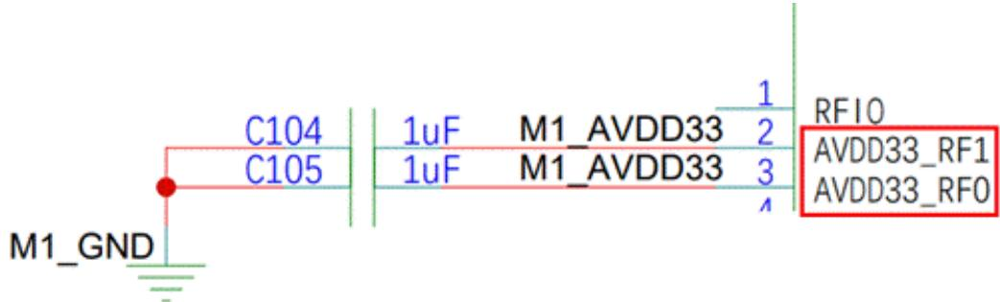

图3-8 WS63V100 AVDD33 输入电路 2  
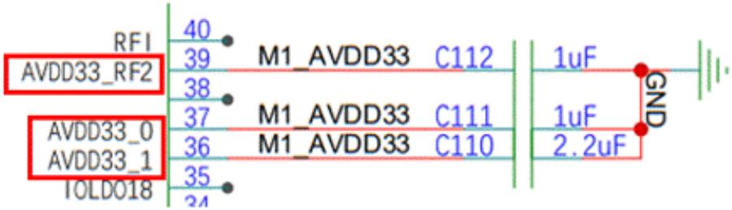

图3-9 WS63V100 AVDD33 输入电路 3  
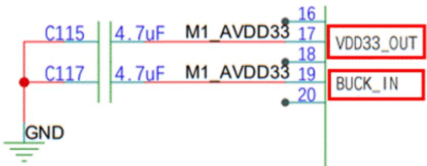

### VBAT_IN 电源

VBAT_IN 给芯片提供工作电源，支持 3.3V 或 5V 输入，VBAT_IN 电源可以由外部 PMU 芯片或者外部 BUCK 电路生成提供。推荐设计建议如表 3-9 所示，参考电路如图 3-10 所示。

表3-9 VBAT_IN 电源设计建议

| 名称    | 设计建议                    |
| ------- | --------------------------- |
| VBAT_IN | 外接 10μF 电容,耐压值≥10V。 |

图3-10 VBAT_IN 输入电路  
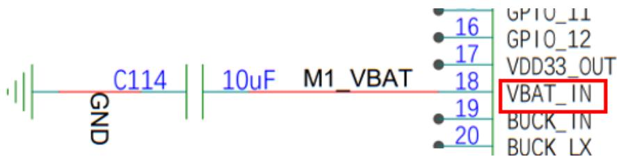

### DVDD3318 电源

WS63V100 系列芯片包含 1 个 DVDD3318 电源输入管脚：

DVDD3318：支持 1.8V/3.3V 电压，推荐设计建议如表 3-10 所示，参考电路图如图 3-11 所示。

表3-10 DVDD3318 电源设计建议

| 名称     | 设计建议                      |
| -------- | ----------------------------- |
| DVDD3318 | 外接 4.7μF 电容,耐压值≥6.3V。 |

图3-11 DVDD3318 输入电路  
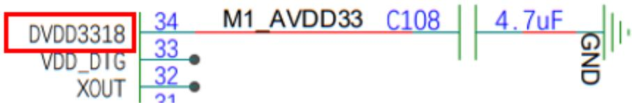

!!! note "说明"

    当DVDD3318选择1V8电源供电时，需要将DVDD3318和IOLDO18短接，即PIN34和PIN35短接。选择3V3电源供电时不需要。

### 内部电源滤波电路

内部电源中的 IOLDO18、VDD_DIG 需要外接滤波电容，推荐设计建议如表 3-11 所示，参考电路如图 3-12 所示。

表3-11 内部电源滤波电路设计建议

| 名称    | 设计建议                                                     |
| ------- | ------------------------------------------------------------ |
| IOLDO18 | 内部 LDO_DECAP,外接 1μF 滤波电容。                           |
| VDD_DIG | 内部 LDO_DECAP,LDO 电源方案外接 1μF 滤波电容,BUCK 方案悬空。 |

图3-12 内部电源滤波电路  
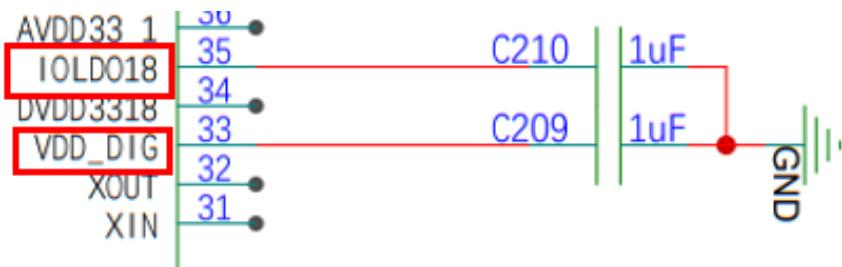

### BUCK 电源

VDD_DIG 可以由内部 BUCK 生成或由内部 LDO 电源提供。参考电路如图 3-13 所示

表3-12 BUCK 电源设计建议

| 名称     | 设计建议                                     |
| -------- | -------------------------------------------- |
| BUCK_LX  | BUCK LX 输出,外接 2.2μH 电感。               |
| BUCK_IN  | 电压输入,给内部 LDO 等供电,外接 4.7μF 电容。 |
| BUCK_OUT | 给芯片内部 LDO 供电,外接 10μF 电容。         |

图3-13 BUCK 电源参考电路  
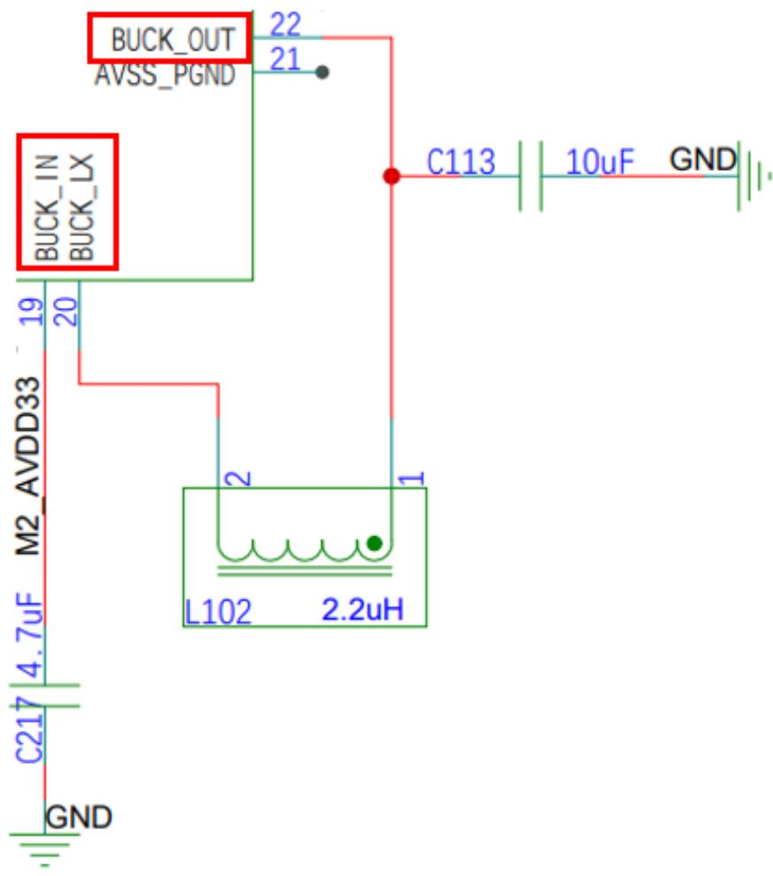

!!! note "说明"

    BUCK 电感推荐约束条件：

    - 电感值 2.2μH ， ± 20% 。

    - 直流电阻（Rdc） ≤ 0.5Ω 。

    - 饱和电流 ≥ 1A 。

    - Rdc 增大会导致功耗增加，效率变低。

### RF 电源

外部提供 RF 电源供电，可与 AVDD33 电源接在一起，设计建议如表 3-13 所示，参考电路如图 3-14 和图 3-15 所示。

表3-13 RF 供电设计建议

| 名称       | 设计建议                    |
| ---------- | --------------------------- |
| AVDD33_RF0 | AVDD33 供电,外接 1μF 电容。 |
| AVDD33_RF1 | AVDD33 供电,外接 1μF 电容。 |
| AVDD33_RF2 | AVDD33 供电,外接 1μF 电容。 |

图3-14 RF 供电电路设计参考 1  
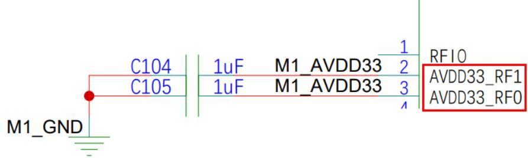

图3-15 RF 供电电路设计参考 2  
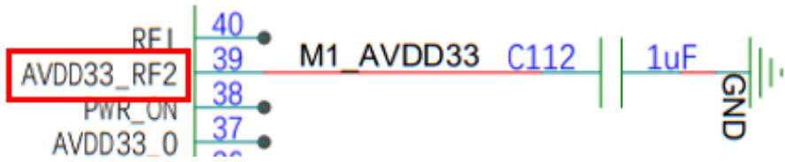

### 注意事项

TBD

## 外围接口设计建议

### UART 接口

WS63V100 系列芯片支持三组 UART 接口，UART0 用于芯片烧录、维测、打印。

UART1、UART2 用于与其他设备对接，UART1 也可作为业务调试接口。设计建议如

表 3-14 所示。硬件设计时引出 UART0、UART1 测试点，可以方便芯片业务功能调测。

表3-14 UART 接口设计建议

| 名称      | 设计建议                                          |
| --------- | ------------------------------------------------- |
| UART0_RXD | 直连,走线≤5inch。                                 |
| UART0_TXD | 直连,走线≤5inch。总线需要上拉,建议上拉电阻2.2kΩ。 |
| UART1_TXD | 直连,走线≤5inch。总线需要上拉,建议上拉电阻2.2kΩ。 |
| UART1_RXD | 直连,走线≤5inch。                                 |
| UART1_RTS | 直连,走线≤5inch。                                 |
| UART1_CTS | 直连,走线≤5inch。                                 |
| UART2_TXD | 直连,走线≤5inch。                                 |
| UART2_RXD | 直连,走线≤5inch。                                 |
| UART2_RTS | 直连,走线≤5inch。                                 |
| UART2_CTS | 直连,走线≤5inch。                                 |

!!! note "说明"

    1. WS63V100 系列芯片 UART 接口 RX 管脚不需要接上拉电阻。为防止电源倒灌，建议 WS63 芯片侧串口 RX 不接上拉电阻。

    2. WS63V100 系列芯片 UART0/1 接口 TX 管脚为开漏输出，需要接上拉电阻提供高电平驱动能力。为防止通过 WS63 芯片侧 TX 上拉电阻倒灌电源，建议 TX 总线上对端设备不接上拉电阻（对端为 RX 输入管脚，无需上拉）。

    3. WS63V100 系列芯片 UART2 接口 TX 管脚有高电平驱动能力，不需要接上拉电阻。为防止电源倒灌，建议 UART2 接口 TX 总线不接上拉电阻。

    4. 针对WS63单独下电场景，在将WS63下电后，建议对端设备UART接口主动将TX、RX总线驱动低电平。

### PWM 接口

WS63V100 系列芯片支持 8 个 PWM 接口信号输出，输出电平与 DVDD3318 管脚电平保持一致，占空比输出范围（1/65535 到 1）。设计建议如表 3-15 所示。

表3-15 PWM 接口设计建议

| 名称 | 设计建议          |
| ---- | ----------------- |
| PWM0 | 直连,走线≤5inch。 |
| PWM1 | 直连,走线≤5inch。 |
| PWM2 | 直连,走线≤5inch。 |
| PWM3 | 直连,走线≤5inch。 |
| PWM4 | 直连,走线≤5inch。 |
| PWM5 | 直连,走线≤5inch。 |
| PWM6 | 直连,走线≤5inch。 |
| PWM7 | 直连,走线≤5inch。 |

### I2S 接口

WS63V100 系列芯片支持一个 I2S 接口，输入输出电平与 DVDD3318 管脚电平保持一致。设计建议如表 3-16 所示。

表3-16 I2S 接口设计建议

| 名称      | 设计建议        |
| --------- | --------------- |
| I2S_MCK   | 直连,包地处理。 |
| I2S_DO    | 直连。          |
| I2S_SCLK  | 直连,包地处理。 |
| I2S_LRCLK | 直连,包地处理。 |
| I2S_DI    | 直连。          |

### QSPI&SPI 接口

WS63V100 系列芯片支持 QSPI 和 SPI 接口，输入输出电平与 DVDD3318 管脚电平保持一致。设计建议如表 3-17 所示。

表3-17 QSPI&SPI 接口设计建议

<table><tr><th>名称</th><th>设计建议</th></tr><tr><td>SPI_CSN</td><td>直连,走线≤5inch。</td></tr><tr><td>SPI_CLK</td><td>两层板,走线≤5inch,芯片端预留一个串接电阻位置,单根走线包地处理。四层板,DVDD3318=1.8V,走线≤5inch,芯片端预留一个串接电阻位置,单根走线包地处理。四层板,DVDD3318=3.3V,走线≤5inch,芯片端预留一个串接电阻位置,单根走线包地处理</td></tr><tr><td>SPI_DATA</td><td>两层板,走线≤5inch,芯片端预留一个串接电阻位置,单根走线包地处理。四层板,走线≤5inch,芯片端预留一个串接电阻位置,单根走线包地处理。</td></tr></table>

### I2C 接口

WS63V100 系列芯片支持两组 I2C 接口，与 UART0/UART1 管脚复用。设计建议如表 3-18 所示。

表3-18 I2C 接口设计建议

| 名称              | 设计建议                                         |
| ----------------- | ------------------------------------------------ |
| I2C0_SCL/I2C1_SCL | 直连,走线≤5inch,总线需要上拉,建议上拉电阻2.2kΩ。 |
| I2C0_SDA/I2C1_SDA | 直连,走线≤5inch,总线需要上拉,建议上拉电阻2.2kΩ。 |

### ADC 接口

WS63V100 系列芯片支持 6 个 ADC 接口，ADC 电压量测范围 0.3 V ~ 3.3 V。设计建议如表 3-19 所示。

表3-19 ADC 接口设计建议

| 名称 | 设计建议                                           |
| ---- | -------------------------------------------------- |
| AIN0 | 直连。模拟信号通道,建议两侧包地,远离高速信号干扰。 |
| AIN1 | 直连。模拟信号通道,建议两侧包地,远离高速信号干扰。 |
| AIN2 | 直连。模拟信号通道,建议两侧包地,远离高速信号干扰。 |
| AIN3 | 直连。模拟信号通道,建议两侧包地,远离高速信号干扰。 |
| AIN4 | 直连。模拟信号通道,建议两侧包地,远离高速信号干扰。 |
| AIN5 | 直连。模拟信号通道,建议两侧包地,远离高速信号干扰。 |

## 控制信号应用参考设计

WS63V100 系列芯片控制信号及应用如表 3-20 所示。

表3-20 控制信号应用参考设计

| 名称    | 设计建议                                                            |
| ------- | ------------------------------------------------------------------- |
| PWR_ON  | 远离高速信号,建议包地处理,预留上拉 20kΩ到 DVDD3318,220nF 电容接地。 |
| PWR_SEL | 远离高速信号,建议包地处理。                                         |
| BUCK_LX | 功率电感靠近芯片放置,减少 BUCK 环路寄生。                           |

## RFIO 设计

WS63 系列芯片集成 2.4G WiFi PA 和 LNA，集成 T/R Switch，支持外接单天线，不支持外置 FEM 和外置 LNA。WS63 系列芯片支持 2.4G，支持全球所有国家定义的 WLAN 频段，支持 b/g/n/11ax 协议版本。

WS63 系列芯片的 PIN1 为 RFIO 管脚，作为 WiFi/BLE/SLE 的接收发送管脚，

WS63E 芯片中也可作为雷达发射管脚。射频链路建议使用π型 LC 滤波电路，参考电路如图 3-16，图中的 LC 滤波为推荐值，LC 滤波及天线匹配电路请根据实际情况调整。RF 连接器旁边建议预留 ESD 器件。

图3-16 RFIO 设计参考电路图
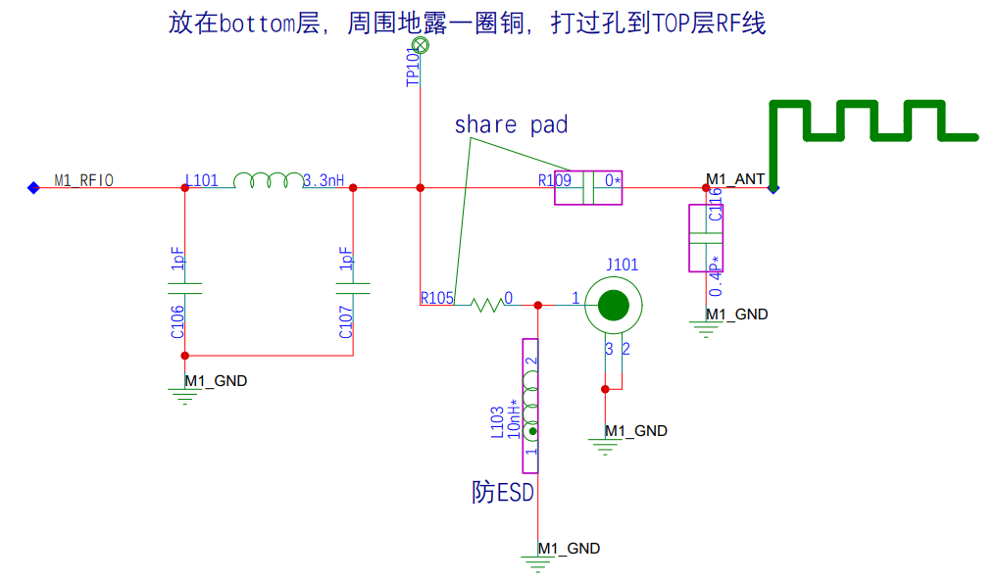

## RFI 设计

WS63E 芯片提供了雷达检测解决方案，芯片的 PIN40 为 RFI 管脚，作为雷达检测的射频接收管脚。设计中，为防止 EMI 干扰，在 RFI 通路靠近芯片口预留 π 型 LC 高通滤波器位置，滤除低频干扰。射频通路天线口建议预留 π 型 LC 匹配电路，参考电路如图 3-17，LC 滤波及天线匹配值请根据实际情况调整。

图3-17 RFI设计参考电路图  
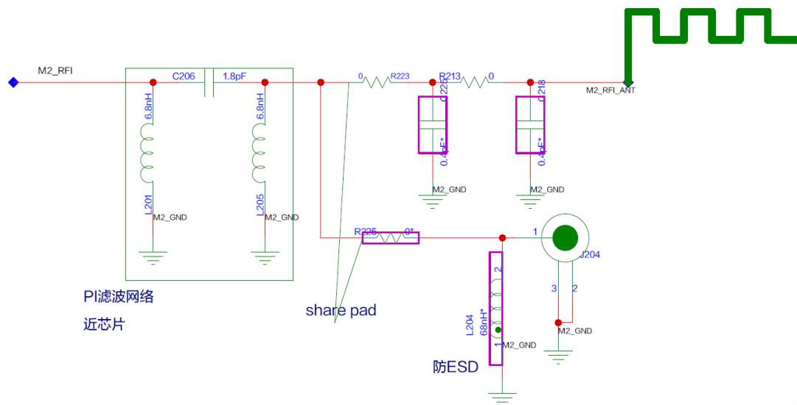

!!! note "说明"

    雷达板载天线设计仅供参考，用户板载天线需要按照产品需求自行设计测试。

    - 板载PCB天线需要以整机为基础进行设计、仿真，综合考虑天线净空、模组底板、外壳等环境影响。

    - 雷达检测方案天线设计规格约束：RFIO为雷达Tx天线，RFI为雷达Rx天线。Tx、Rx天线频率2.4-2.5GHz；VSWR<2；Tx、Rx射频链路，天线隔离度>=20dBc，射频板级走线隔离度>=32dBc；天线增益>=0dBi；Tx、Rx天线带内群时延<1ns。

    - 雷达检测方案 Tx、Rx 天线保证同极化，天线设计建议均采用板载 PCB 天线。

    - RFI雷达Rx天线远离EMI干扰源，在RFI通路靠近芯片口预留π型LC高通滤波器位置，滤除低频干扰。

    - 整机设计中，为防止感知误触发，雷达模组应远离机械振动部件（例如蜂鸣器）。

    - 为规避人感探测区间，要求整机底板大电流器件如需刷新，刷新率应>100Hz（例如 LED 灯、蜂鸣器）
