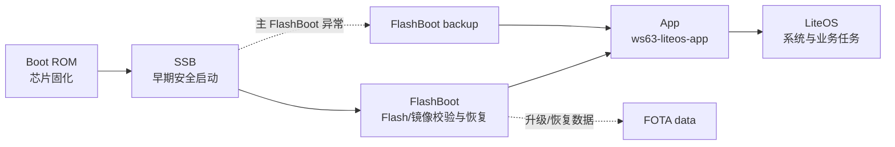
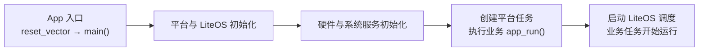

# 启动流程

WS63 的启动需要区分两层：

- **镜像启动链**：Boot ROM (Read-Only Memory) 、SSB (Secure Secondary Boot) 、FlashBoot、App 之间的加载、校验和跳转关系。
- **App 初始化链**：App 从 `reset_vector` 进入 `main()`，完成 LiteOS (Huawei LiteOS)、硬件、系统任务和业务入口初始化。

## 镜像与安全启动链

正常启动的逻辑链路如下。安全校验是否启用以及具体校验策略由产品安全配置决定。



| 镜像或区域 | 作用 | 是否为普通应用入口 |
|------------|------|:------------------:|
| Boot ROM | 芯片固化的第一阶段启动代码和根信任入口，普通开发者不可修改 | 否 |
| Root public key | 安全启动根公钥数据 | 否 |
| SSB | 早期安全启动镜像；具体源码可能不随 SDK 交付 | 否 |
| FlashBoot | 初始化启动所需硬件，校验 App，处理 App 升级恢复，最后跳转到 App | 否 |
| FlashBoot backup | FlashBoot 主镜像异常时的恢复副本 | 否 |
| LoaderBoot | 烧录和产线下载使用的临时引导镜像，不是正常上电启动中的应用阶段 | 否 |
| App / imageA | LiteOS 主应用镜像，包含平台初始化、系统任务和产品业务组件 | 是 |
| FOTA (Firmware Over-The-Air) data | OTA (Over-The-Air) 下载或恢复使用的数据区域 | 否 |
| NV (Non-Volatile) / Customer factory | 运行参数、出厂配置和持久化数据 | 否 |

分区地址和大小见 [Flash 与 RAM](../memory-layout/index.md)。烧录包会组合多个镜像、NV 和分区表；`.fwpkg` 不是单独的 App 二进制。

> Boot ROM、SSB 和部分预编译安全组件属于芯片或交付件边界。文档只描述开发者可观察的启动职责，不把未公开实现写成可修改源码。

## App 初始化流程

FlashBoot 校验 App 后，跳转到 App 镜像的 `reset_vector`。当前 `ws63-liteos-app` 的主要调用顺序如下：



关键源码调用链：

```text
bootloader/flashboot_ws63/startup/riscv_init.S             # FlashBoot 汇编入口：设置全局指针和栈，清零 BSS
  └─ bootloader/flashboot_ws63/startup/main.c               # FlashBoot C 入口：初始化启动环境，处理并选择 App 镜像
      └─ jump_to_execute_addr()                             # 跳转到已选定 App 镜像的执行地址
          └─ application/ws63/ws63_liteos_application/reset_vector.S
              # App 汇编入口：建立全局指针和启动栈，进入 C 运行环境
              └─ application/ws63/ws63_liteos_application/main.c
                  # App C 入口：完成平台、内核、硬件和系统服务初始化
                  ├─ patch_init()                           # 初始化 RISC-V 补丁机制
                  ├─ uapi_partition_init()                  # 读取并初始化 Flash 分区信息
                  ├─ pmp_enable()                           # 配置 RISC-V 物理内存保护 PMP
                  ├─ LOS_PrepareMainTask()                  # 准备 LiteOS 主任务运行环境
                  ├─ osKernelInitialize()                   # 初始化 LiteOS 内核
                  ├─ hw_init()                              # 初始化时钟、调试串口、定时器等基础硬件
                  ├─ system_init_array()                    # 执行链接到 init_array 的 C/C++ 初始化函数
                  ├─ main_initialise()                      # 按配置创建 SDK 平台与服务任务
                  ├─ OHOS_SystemInit()                      # 可选的 OpenHarmony 系统初始化钩子
                  ├─ app_tasks_init()                       # 遍历 app_run() 注册的业务初始化入口
                  └─ osKernelStart()                        # 启动 LiteOS 调度器，开始运行已创建任务
```

| 阶段 | 主要源码 |
|------|----------|
| FlashBoot | `bootloader/flashboot_ws63/startup/riscv_init.S`、`startup/main.c`、`bootloader/commonboot/src/boot_jump.c` |
| App 入口 | `application/ws63/ws63_liteos_application/reset_vector.S`、`main.c` |
| LiteOS 初始化 | `kernel/liteos/liteos_v208.5.0/Huawei_LiteOS/kernel/init/los_init.c`、`compat/cmsis/cmsis_liteos2.c`、`targets/ws63/board.c` |
| `app_run()` 注册与遍历 | `middleware/utils/app_init/app_init.h`、`app_init.c` |
| 链接段定义 | `drivers/boards/ws63/evb/linker/ws63_liteos_app_linker/linker.prelds` |

## 开发者入口：app_run()

应用组件通过 `app_run(func)` 把初始化函数放入链接段 `.zinitcall.app_run*.init`。链接脚本生成起止符号，`app_tasks_init()` 在启动阶段依次调用这些函数。

```c
static void my_app_entry(void)
{
    /* 初始化非阻塞资源，并创建业务任务。 */
}

app_run(my_app_entry);
```

`app_run()` 回调发生在 `osKernelStart()` 之前，因此：

- 可以初始化数据、注册回调、创建任务、定时器和同步对象。
- 不能调用 `osal_msleep()`、等待信号量或执行其他依赖调度器运行的阻塞操作。
- 耗时业务应放入新建任务，在 LiteOS 调度开始后执行。
- 多个组件都可注册 `app_run()`；不要依赖不同组件之间未明确规定的注册顺序。

系统默认创建的任务和各执行上下文约束见 [运行时架构](../runtime-architecture/index.md)。
