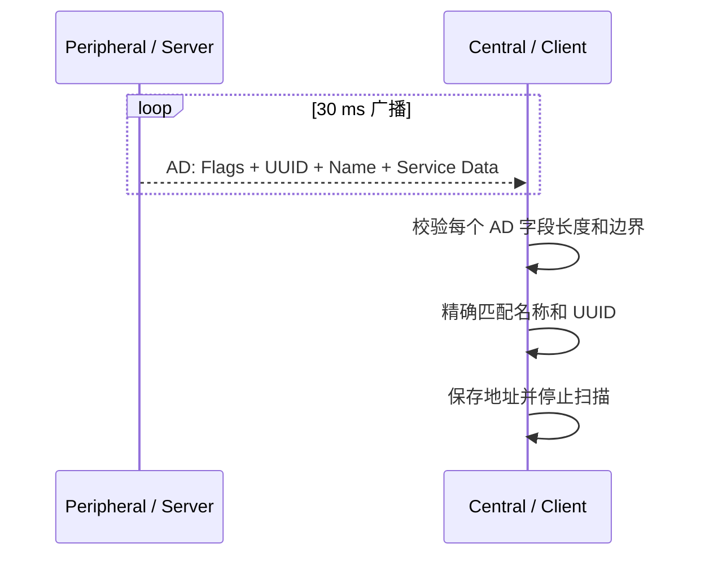
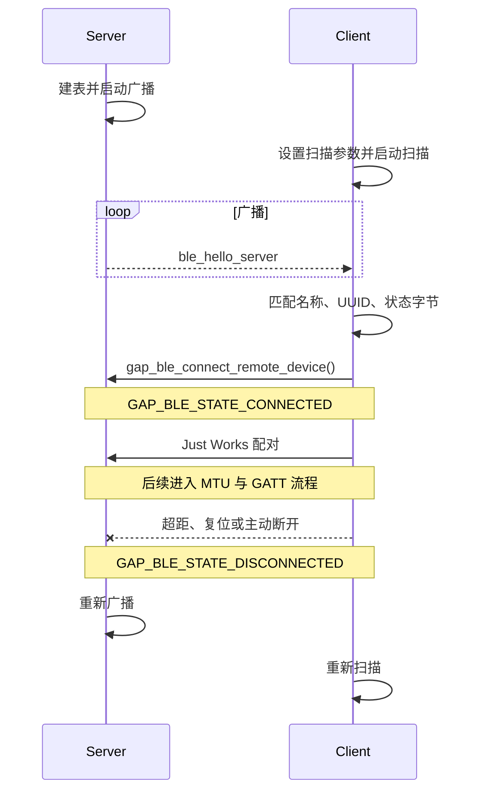
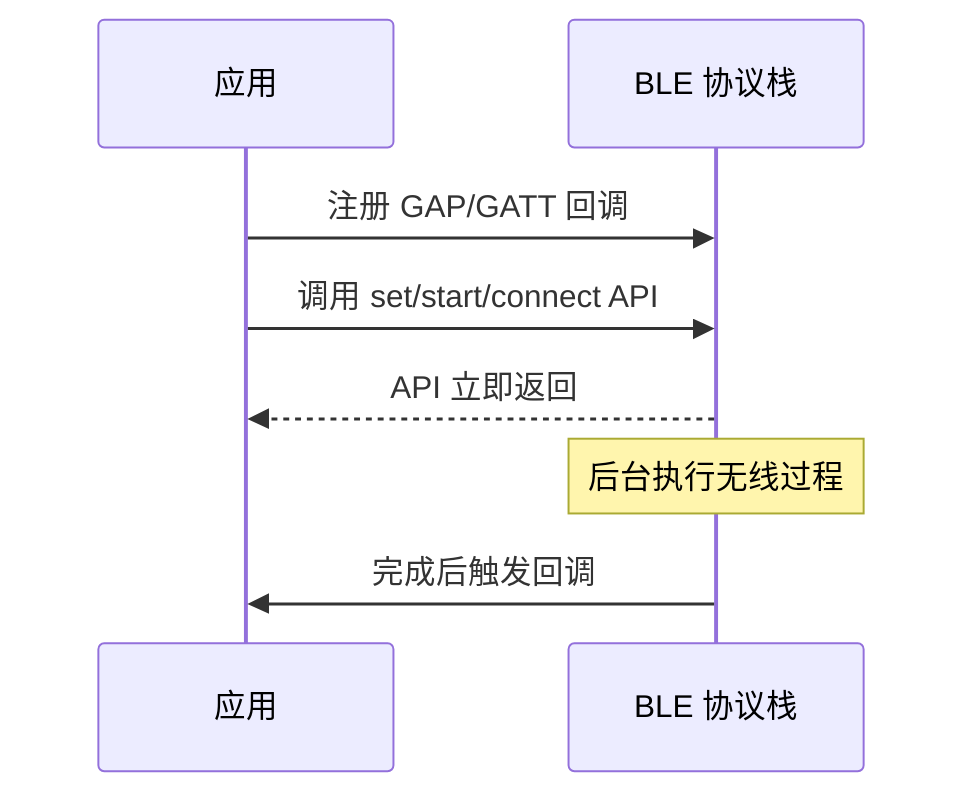
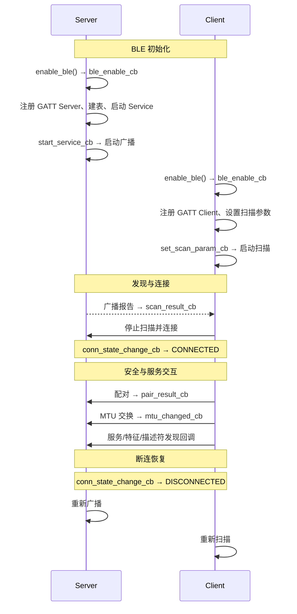
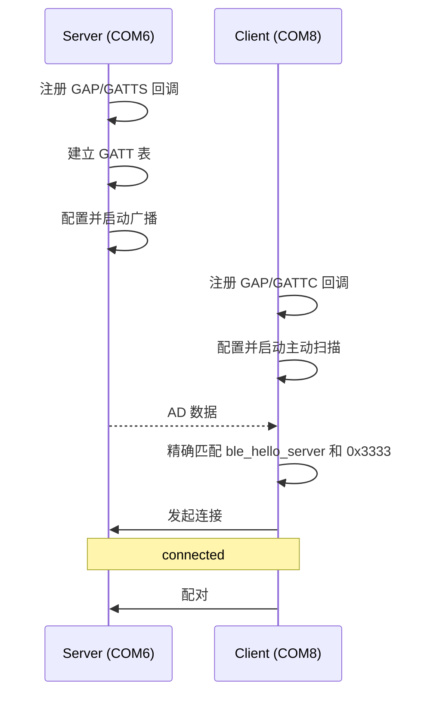

# Hello BLE

> 本篇是 BLE (Bluetooth Low Energy) Hello 系列的基础入口，统一说明广播、扫描、连接、公共任务入口以及 Server/Client 的构建烧录。[Hello Notify](./hello-notify.md) 和 [Hello ReadWrite](./hello-readwrite.md) 只说明连接建立后的增量能力。

> 广播与连接 — BLE设备发现、连接管理

## 学习目标

- 理解 BLE 广播、扫描和连接的作用
- 能够配置 GAP (Generic Access Profile) Peripheral 的可连接广播
- 能够配置 GAP Central 的主动扫描，识别目标设备并发起连接
- 理解 Peripheral/Central 与 GATT (Generic Attribute Profile) Server/Client 是两组不同概念
- 理解 BLE API 的异步回调驱动方式
- 能够在两块 WS63 开发板上完成连接并验证断连恢复

## 规格与功能

本案例使用同一套源码构建两份固件，让两块 WS63 建立 BLE 连接，并继续执行后续通知和读写流程。

| 规格项 | Server 端 | Client 端 |
| --- | --- | --- |
| GAP 角色 | Peripheral，被连接方 | Central，连接发起方 |
| GATT 角色 | GATT Server | GATT Client |
| 广播类型 | 可连接非定向广播 | — |
| 广播名称 | `ble_hello_server` | 精确匹配该名称 |
| 广播间隔 | 30 ms | — |
| 广播信道 | 37、38、39 | — |
| 扫描方式 | — | 1M PHY (Physical Layer) 主动扫描 |
| 扫描间隔/窗口 | — | 30 ms / 30 ms，持续扫描 |
| 安全模式 | Bondable、NoInputNoOutput、Mode 1 Level 2 | 同左，Just Works |
| 断连行为 | 清理连接/CCCD 状态并重新广播 | 清理发现状态并重新扫描 |

程序启动后依次执行：

1. Server 建立 GATT 表并广播 `ble_hello_server`
2. Client 主动扫描，按 AD（Advertising Data）结构匹配名称和 Service Data
3. Client 停止扫描并调用连接接口
4. 两端收到连接状态回调
5. Client 发起配对、MTU (Maximum Transmission Unit) 交换和后续 GATT 流程

> 本篇聚焦发现和连接。通知、读取和写入分别在后两篇说明，但三篇使用的是同一个 `ble_hello` 集成样例。

## 基本概念

### BLE 通信流程

BLE 应用通常经历四个阶段：

```text
发现 → 连接与安全 → 服务发现 → 数据交互
```

本篇重点解释前两个阶段。只有连接成功并完成安全过程后，Client 才能继续交换 MTU、发现 GATT 服务和传输业务数据。

### 广播：让 Central 发现 Peripheral

Peripheral 周期性在 37、38、39 三个广播信道发送 AD 数据。广播包由多个 Length/Type/Value 字段组成，并不是以 `\0` 结尾的字符串。

本案例广播以下字段：

| AD Type | 内容 | 用途 |
| --- | --- | --- |
| `0x01` Flags | `0x06` | General Discoverable、BR/EDR Not Supported |
| `0x03` Complete 16-bit UUID (Universally Unique Identifier) | `0x3333` | 声明案例 Service UUID |
| `0x09` Complete Local Name | `ble_hello_server` | 供 Client 精确识别设备 |
| `0x16` Service Data 16-bit | UUID `0x3333` + 状态字节 | 指示 Data 当前为默认态或保留态 |

状态字节 `0x00` 表示 `device_status_ok`，`0x01` 表示 Server RAM (Random Access Memory) 中保留了已写值。该字段用于处理 WS63 BTH 属性缓存与应用 RAM 状态同步，不是通用 BLE 协议要求。

### 扫描：解析广播而不是搜索字符串

Client 使用主动扫描。扫描窗口等于扫描间隔，表示射频持续监听，发现速度快，但功耗较高。



源码不会对二进制广播包调用 `strstr()`。每次先读取 Length，再确认字段没有越界，最后按 Type 比较字段内容，避免误匹配和越界访问。

### Peripheral/Central 与 GATT Server/Client

这两组角色属于不同协议层：

| 角色组 | 含义 | 本案例 |
| --- | --- | --- |
| Peripheral / Central | GAP 连接角色，描述谁广播、谁发起连接 | Server 为 Peripheral；Client 为 Central |
| GATT Server / Client | 数据角色，描述谁提供属性、谁访问属性 | Server 提供 GATT 表；Client 发现并访问 |

常见设备通常把 Peripheral 与 GATT Server 组合、Central 与 GATT Client 组合，但协议并不强制这样绑定。

### 广播类型

BLE 常见广播类型可按“是否可连接”和“是否定向”区分：

| 类型 | 可连接 | 是否指定目标 | 典型场景 |
| --- | :---: | :---: | --- |
| 可连接非定向 | 是 | 否 | 通用配网、传感器连接；本案例使用 |
| 可连接定向 | 是 | 是 | 与已知设备快速重连 |
| 不可连接非定向 | 否 | 否 | Beacon、单向状态广播 |
| 可扫描非定向 | 否 | 否 | 允许 Central 请求扫描响应，但不建立连接 |

本案例 `adv_type = 0x00`，表示可连接非定向广播，过滤策略允许任意扫描和连接请求。

### 通信流程：连接状态



### 回调驱动模式

BLE 接口是异步的。函数返回成功只表示请求已提交，不等于无线操作已完成。



例如，`gap_ble_set_scan_parameters()` 成功返回后，还要等待 `set_scan_param_cb`；本案例在该回调成功时才调用 `gap_ble_start_scan()`。

### 通信流程：回调调用生命周期



## 涉及 API

| API | 调用方 | 用途 |
| --- | --- | --- |
| `enable_ble()` / `disable_ble()` | 两端 | 启停 BLE 协议栈；样例启动时循环一次以清理保留的 GATT 状态 |
| `gap_ble_register_callbacks()` | 两端 | 注册 BLE 使能、扫描、连接和配对回调 |
| `gap_ble_set_sec_param()` | 两端 | 配置 Bondable、IO 能力和安全等级 |
| `gap_ble_set_adv_data()` | Server | 设置 AD 数据 |
| `gap_ble_set_adv_param()` | Server | 设置广播间隔、类型、信道和过滤策略 |
| `gap_ble_start_adv()` | Server | 启动广播 |
| `gap_ble_set_scan_parameters()` | Client | 设置扫描间隔、窗口、PHY 和类型 |
| `gap_ble_start_scan()` / `gap_ble_stop_scan()` | Client | 启停扫描 |
| `gap_ble_connect_remote_device()` | Client | 对保存的地址发起连接 |
| `gap_ble_pair_remote_device()` | Client | 未配对连接上发起 Just Works 配对 |
| `gap_ble_remove_pair()` | 两端 | 配对失败时删除陈旧配对记录 |

## 案例说明

### 案例简介

使用两块 WS63，一块构建 Server 固件并连接 COM6，另一块构建 Client 固件并连接 COM8。Server 广播，Client 扫描并建立连接。

### 案例流程说明



### 如何识别目标设备

Client 同时要求：

1. AD Type `0x09` 的 Complete Local Name 完整等于 `ble_hello_server`
2. AD Type `0x16` 的 Service Data UUID 等于 `0x3333`
3. Service Data 长度合法，并能读取状态字节

仅名称相同但没有目标 Service Data 的设备不会被连接。

## 案例操作指导

### 第一步：编译 Server 固件

在 SDK 根目录执行：

```powershell
fbb config --target ws63-liteos-app set CONFIG_SAMPLE_ENABLE=y
fbb config --target ws63-liteos-app set CONFIG_ENABLE_BT_SAMPLE=y
fbb config --target ws63-liteos-app set CONFIG_SAMPLE_SUPPORT_BLE_SAMPLE=y
fbb config --target ws63-liteos-app set CONFIG_SAMPLE_SUPPORT_BLE_HELLO_SERVER_SAMPLE=y
fbb build ws63-liteos-app --clean
```

角色配置定义在 `src/application/samples/bt/ble/ble_hello/Kconfig`，Server 和 Client 位于同一 BLE choice，不能同时启用。

### 第二步：烧录 Server

```powershell
fbb flash ws63-liteos-app --port COM6 --json-summary
```

保存并烧录 Server 后再切换角色，否则下一次构建会覆盖同名固件包。

### 第三步：编译并烧录 Client

```powershell
fbb config --target ws63-liteos-app set CONFIG_SAMPLE_SUPPORT_BLE_HELLO_CLIENT_SAMPLE=y
fbb build ws63-liteos-app --clean
fbb flash ws63-liteos-app --port COM8 --json-summary
```

烧录成功以 JSON 最后一行的 `"success": true` 为准。

### 第四步：上电运行

Server 关键日志：

```text
[ble hello server] enabling BLE
[ble hello server] service ready: service=0x000e data=0x0010 notify=0x0012 notify_cccd=0x0013
[ble hello server] init ok, ret=0x0
[ble hello server] advertising started: ble_hello_server
```

Client 关键日志：

```text
[ble hello client] enabling BLE
[ble hello client] init ok, scan param ret=0x0
[ble hello client] start scanning
[ble hello client] found ble_hello_server, state=device_status_ok, connecting
```

### 第五步：确认连接成功

```text
[ble hello server] connected, conn_id=0x0000
[ble hello client] connected, conn_id=0x0000
[ble hello client] pairing requested, ret=0x0
[ble hello client] pair complete, status=0x0
```

`conn_id` 是连接句柄，数值可以为 `0x0000`；判断成功应看连接状态和后续回调，不能用“句柄非零”作为条件。

## 关键配置

### 广播参数的说明

```c
param.min_interval = 0x30;
param.max_interval = 0x30;       /* 0x30 × 0.625 ms = 30 ms */
param.duration = 0;              /* 持续广播 */
param.adv_type = 0x00;           /* 可连接非定向 */
param.channel_map = 0x07;        /* 37/38/39 */
param.adv_filter_policy = 0x00;  /* 接受所有设备 */
```

广播间隔越短，发现速度越快、功耗越高。本案例固定 30 ms，便于双板快速验收。

### 扫描参数的说明

```c
scan_params.scan_interval = 0x30;
scan_params.scan_window = 0x30;
scan_params.scan_type = GAP_BLE_SCAN_TYPE_ACTIVE;
scan_params.scan_phy = GAP_BLE_PHY_1M;
scan_params.scan_filter_policy = GAP_BLE_SCAN_FILTER_POLICY_ACCEPT_ALL;
```

BLE 扫描间隔和窗口单位均为 0.625 ms，因此 `0x30` 对应 30 ms。窗口等于间隔表示持续扫描。

### 安全参数的说明

```c
security.bondable = 1;
security.io_capability = GAP_BLE_IO_CAPABILITY_NOINPUTNOOUTPUT;
security.sc_enable = 0;
security.sc_mode = GAP_BLE_GAP_SECURITY_MODE1_LEVEL2;
gap_ble_set_sec_param(&security);
```

NoInputNoOutput 设备使用 Just Works，不需要输入 PIN。该方式适合教学演示；正式产品应根据威胁模型选择安全连接、认证方式和密钥保存策略。

### 可配置参数速查

| 参数 | 当前值 | 调大影响 | 调小影响 |
| --- | --- | --- | --- |
| 广播间隔 | 30 ms | 更省电，发现变慢 | 发现更快，功耗提高 |
| 扫描间隔 | 30 ms | 扫描周期变长 | 扫描更频繁 |
| 扫描窗口 | 30 ms | 不能超过间隔 | 省电但可能错过广播 |
| 广播信道图 | `0x07` | — | 关闭信道会降低抗干扰能力 |
| MTU | 247 | 单包能力提高、占用增加 | 大数据需要更多分包 |

## 代码详解

### 代码入口：任务创建

```c
#define BLE_HELLO_TASK_PRIO       26
#define BLE_HELLO_TASK_STACK_SIZE 0x2000

static int ble_hello_task(const void *arg)
{
#if defined(CONFIG_SAMPLE_SUPPORT_BLE_HELLO_SERVER_SAMPLE)
    return (int)ble_hello_server_init();
#elif defined(CONFIG_SAMPLE_SUPPORT_BLE_HELLO_CLIENT_SAMPLE)
    return (int)ble_hello_client_init();
#endif
}

app_run(ble_hello_entry);
```

同一个入口根据互斥 Kconfig 角色调用 Server 或 Client 初始化函数。

### Server 与 Client 执行流程

Server 在 `ble_enable_cb` 中配置安全参数、建立 GATT 表；Service 启动回调成功后才启动广播。Client 在 `ble_enable_cb` 中配置安全参数、注册 GATT Client 并设置扫描参数；设置完成回调再启动扫描。

所有回调都只推进下一步状态，不执行阻塞等待。

### 广播数据构建

```c
data[index++] = 2;
data[index++] = 0x01;
data[index++] = 0x06;

data[index++] = 3;
data[index++] = 0x03;
data[index++] = 0x33;
data[index++] = 0x33;
```

16-bit UUID 在 AD 数据中按小端序写入。设备名长度不包含 C 字符串结束符。

### 扫描匹配逻辑

```c
while (index < data_len) {
    uint8_t field_len = data[index];
    uint16_t field_end = (uint16_t)(index + field_len + 1);
    if (field_len == 0 || field_end > data_len) {
        break;
    }
    /* 按 AD Type 和精确长度比较 Name / Service Data */
    index = field_end;
}
```

匹配后复制 `result->addr`，先 `gap_ble_stop_scan()`，再调用 `gap_ble_connect_remote_device()`。连接失败则清除 `g_connecting` 并重新扫描。

### 连接状态回调

连接成功时 Client 根据 `pair_state` 分支：已配对则直接交换 MTU；未配对则调用 `gap_ble_pair_remote_device()`。这保证已绑定设备重连时不会重复配对。

### 断开后自动恢复

| 角色 | 清理内容 | 恢复动作 |
| --- | --- | --- |
| Server | `g_connected`、CCCD (Client Characteristic Configuration Descriptor) 使能状态 | 重新生成 AD 并启动广播 |
| Client | 连接中、配对中、MTU、服务/特征/CCCD 句柄及读写状态 | 重新启动扫描 |

因此任一开发板重启或短暂离线后，只要另一端仍运行，双方可自动重新发现和连接。

---
