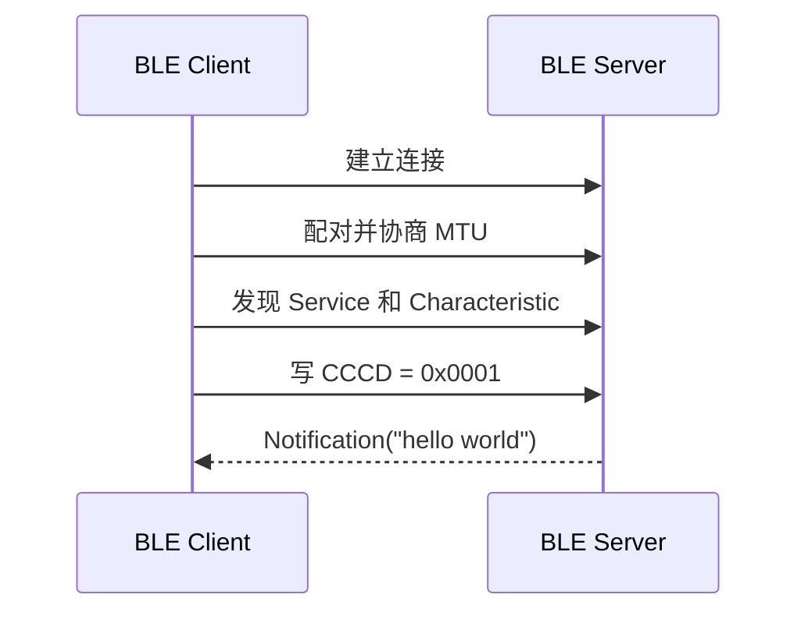

# Hello Notify

> 在 [Hello BLE](./hello-connect.md) 已建立连接的基础上，增加 GATT (Generic Attribute Profile) 服务发现、CCCD (Client Characteristic Configuration Descriptor) 订阅和通知推送。

## 本篇新增内容

- Server 注册可通知的 Characteristic 和 CCCD。
- Client 按 UUID (Universally Unique Identifier) 发现 Service、Characteristic 和 CCCD。
- Client 写入 CCCD 开启 Notification。
- Server 在订阅成功后发送 `hello world`，Client 在通知回调中接收。

广播、扫描、连接、任务入口、公共构建和烧录步骤不在本篇重复说明。

## 数据交互流程



连接只表示链路已经建立。只有完成服务发现并写入 CCCD 后，Client 才能接收通知。

## 关键对象

| 对象 | 本案例用途 |
| --- | --- |
| Service UUID `0x3333` | 标识 Hello 服务 |
| Data Characteristic `0x3434` | 后续读写交互使用 |
| Notify Characteristic `0x3435` | Server 推送通知 |
| CCCD `0x2902` | Client 写入 `01 00` 开启 Notification |
| MTU (Maximum Transmission Unit) | 决定单个 ATT 数据包可承载的数据长度 |

Notification 不要求对端逐包确认，适合周期上报；Indication 要求确认，可靠性更高但吞吐量更低。

## 源码对应关系

本篇与 Hello BLE (Bluetooth Low Energy) 共用同一个工程：

```text
src/application/samples/bt/ble/ble_hello/
├── ble_hello_server/src/ble_hello_server.c
└── ble_hello_client/src/ble_hello_client.c
```

重点查看：

- Server 端 GATT 表注册和通知发送逻辑。
- Client 端服务发现、CCCD 写入和通知回调。
- 配对完成后 MTU 交换与服务发现的调用顺序。

## 操作与验证

按照 [Hello BLE](./hello-connect.md) 分别构建和烧录 Server、Client。连接成功后应继续看到以下阶段性结果：

1. 配对成功。
2. MTU 交换完成。
3. 找到目标 Service、Characteristic 和 CCCD。
4. CCCD 写入成功。
5. Client 收到长度为 11 字节的 `hello world`。

若已经连接但收不到通知，优先检查发现到的是 Characteristic Value Handle 还是声明 Handle，并确认 CCCD 确实属于目标 Characteristic。

## 下一步

[Hello ReadWrite](./hello-readwrite.md) 在相同连接和 GATT 表基础上增加 Client 主动读写。
