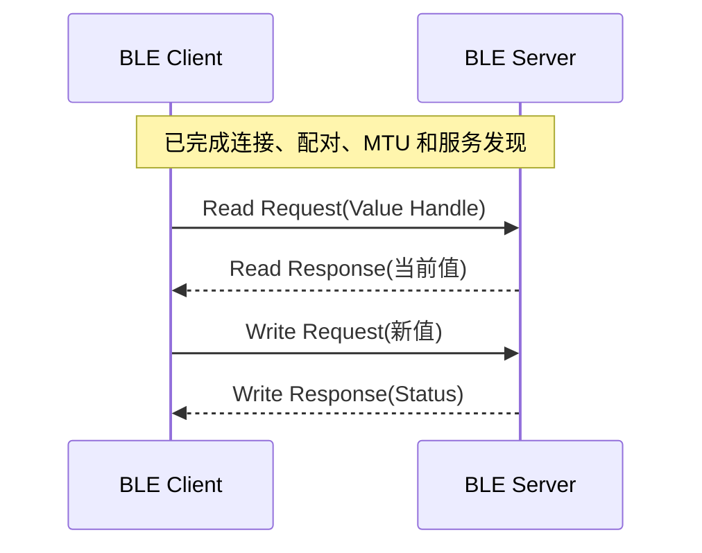

# Hello ReadWrite

> 在 [Hello Notify](./hello-notify.md) 的服务发现和订阅流程上，增加 Client 主动读写 Characteristic。

## 本篇新增内容

- Data Characteristic 增加 READ、WRITE 属性和相应权限。
- Server 在读请求回调中返回当前值。
- Server 在写请求回调中校验 Handle、长度并更新 RAM (Random Access Memory) 值。
- Client 按实际 Value Handle 发起读写，并处理确认结果。

连接、配对、MTU (Maximum Transmission Unit) 、服务发现、CCCD (Client Characteristic Configuration Descriptor) 和通知流程请直接参考前两篇，本篇不再重复。

## 三种交互方式

| 方式 | 发起方 | 适用场景 |
| --- | --- | --- |
| Notification | Server | 传感器上报、状态变化推送 |
| Read | Client | 查询版本、状态或当前配置 |
| Write | Client | 下发参数、控制命令或配置 |

## 增量流程



Server 不能把远端数据直接当作 C 字符串使用。处理写请求时必须显式检查长度，为本地缓冲区预留结束符，并在失败时返回明确的 GATT (Generic Attribute Profile) Status。

## 源码对应关系

```text
src/application/samples/bt/ble/ble_hello/
├── ble_hello_server/src/ble_hello_server.c
└── ble_hello_client/src/ble_hello_client.c
```

重点查看：

- Server 的读请求和写请求回调。
- Data Characteristic 的 Properties、Permissions 和 Value Handle。
- Client 的读结果、写确认和错误状态处理。

## 操作与验证

构建和烧录沿用 [Hello BLE](./hello-connect.md)。完整固件会连续执行：

```text
连接 → 配对 → MTU → 服务发现 → CCCD → Notify → Read → Write
```

验证时应确认：

- Read 返回 Server 当前 RAM 值。
- 合法 Write 更新 RAM 值并返回成功状态。
- 超长数据、错误 Handle 或权限不足时返回失败状态，Server 不更新值。
- 只重启 Client 后可以重新读取 Server 当前值；Server 整芯片重启后恢复默认值。

## 选择建议

- 只需主动上报时使用 Notification。
- 需要查询当前状态时增加 Read。
- 需要下发配置时增加 Write，并始终进行长度、范围和权限校验。
