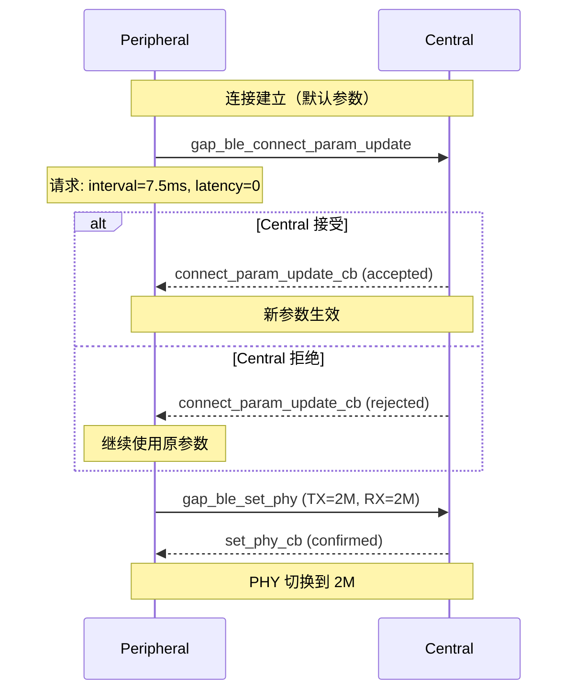

# 连接参数调优

> BLE (Bluetooth Low Energy) GAP (Generic Access Profile) 连接参数更新、PHY (Physical Layer) 切换

> 前置阅读：[Hello BLE](./basics/hello-connect.md)

## 学习目标

- 理解 BLE 连接参数的三个关键指标：Connection Interval / Slave Latency / Supervision Timeout
- 掌握 `gap_ble_connect_param_update()` 请求更新连接参数
- 理解 Central 决定的连接参数对 Peripheral 的功耗/延迟影响
- 掌握 BLE PHY 切换（1M/2M/Coded）对吞吐和距离的影响

## 基本概念

### BLE 连接参数三要素

| 参数 | 范围 | 说明 |
|------|:---:|------|
| Connection Interval | 7.5ms ~ 4s | 两次连接事件之间的间隔——Central 和 Peripheral 在此窗口内同步 |
| Slave Latency | 0 ~ 499 | Peripheral 可跳过的连接事件数——跳过的事件不回复，省电 |
| Supervision Timeout | 100ms ~ 32s | 超时内没收到任何有效包则判定断连 |

这三个参数决定了功耗、延迟和稳定性的三角平衡。

### 典型场景参数组合

| 场景 | Interval | Latency | Timeout | 功耗 | 延迟 |
|------|:---:|:---:|:---:|:---:|:---:|
| 低延迟键盘鼠标 | 7.5ms | 0 | 100ms | 高 | < 10ms |
| 透传桥接 | 15ms | 0 | 500ms | 中高 | < 20ms |
| 通用 | 30ms | 0 | 500ms | 中 | < 50ms |
| 传感器上报 | 100ms | 4 | 2000ms | 低 | < 500ms |

### BLE vs SLE 连接参数协商

| 对比项 | BLE | SLE (SparkLink Low Energy) |
|--------|:---:|:---:|
| 谁决定参数 | Central 最终决定 | G/T 双方协商 |
| Peripheral 能做什么 | `gap_ble_connect_param_update()` 请求更新，Central 可拒绝 | `sle_update_connect_param()` 发起协商 |
| PHY 切换 | `gap_ble_set_phy()` 1M/2M/Coded | `sle_set_phy_param()` 1M/2M/4M |

## 涉及 API

| API | 谁调用 | 用途 |
|-----|--------|------|
| `gap_ble_connect_param_update()` | Peripheral | 请求更新连接参数 |
| `gap_ble_set_phy()` | 双方 | 切换 PHY（1M/2M/Coded） |
| `gap_ble_set_data_length()` | 双方 | 设置数据包长度 |
| `gap_ble_read_remote_device_rssi()` | 双方 | 读取当前 RSSI (Received Signal Strength Indicator)|
| `gap_ble_register_callbacks()` | 双方 | 注册回调（含参数更新、PHY 切换回调） |

## 案例说明

### 案例简介

Peripheral 连接后根据场景切换连接参数——从通用模式切换到低延迟模式或省电模式。同时演示 PHY 切换的效果。

### 功能规格

| 模式 | Interval | Latency | Timeout | PHY |
|------|:---:|:---:|:---:|:---:|
| 低延迟 | 7.5ms | 0 | 100ms | 1M |
| 省电 | 100ms | 4 | 2000ms | 1M |
| 高速 | 15ms | 0 | 500ms | 2M |

### 案例流程



## 案例操作指导

### 第一步：编译

```bash
fbb build ws63-liteos-app
```

> 更多编译选项请参考 [构建操作](../../../overall-architecture/build-output/index.md#构建操作)。

### 第二步：烧录

```bash
fbb flash ws63-liteos-app
```

> 更多烧录选项请参考 [构建操作](../../../overall-architecture/build-output/index.md#构建操作)。

### 第三步：验证

- 省电模式：间隔放大到 100ms + Latency 4，功耗降低 ~50%
- 低延迟模式：间隔 7.5ms + Latency 0，按键延迟 < 10ms
- PHY 2M：吞吐提升 ~2x（短距离）

## 关键配置

| 参数 | 低延迟 | 省电 | 通用 |
|------|:---:|:---:|:---:|
| Interval Min/Max | 6 / 7.5ms | 80 / 100ms | 24 / 30ms |
| Latency | 0 | 4 | 0 |
| Timeout | 100ms | 2000ms | 500ms |
| PHY | 1M | 1M | 1M |
| 功耗 | 高 | 低 | 中 |
| 延迟 | < 10ms | < 500ms | < 50ms |

> Timeout 必须 > (1 + Latency) × Interval_Max × 2，否则连接可能频繁误断。例：Timeout=2000ms，Max Interval=100ms，Latency=4 → (1+4)×100×2=1000ms < 2000ms ✓。

## 代码详解

### 连接参数更新请求

```c
gap_conn_param_update_t params = {
    .interval_min = 6,    // 7.5ms
    .interval_max = 6,
    .latency = 0,
    .timeout = 100        // 100ms
};
gap_ble_connect_param_update(&params);

/* 结果在 connect_param_update_cb 回调中获取 */
static void connect_param_update_cb(int conn_id, int status) {
    if (status == 0) {
        printf("param update accepted\n");
    } else {
        printf("param update rejected, using defaults\n");
    }
}
```

### PHY 切换

```c
gap_le_set_phy_t phy = {
    .tx_phy = GAP_BLE_PHY_2M,    // 2Mbps
    .rx_phy = GAP_BLE_PHY_2M,
    .phy_options = 0              // 不请求 Coded
};
gap_ble_set_phy(&phy);

/* 确认回调 */
static void set_phy_cb(int conn_id, int tx_phy, int rx_phy, int status) {
    printf("PHY: TX=%d RX=%d status=%d\n", tx_phy, rx_phy, status);
}
```

### 数据长度优化

```c
gap_le_set_data_length_t data_len = {
    .tx_octets = 251,      // 最大数据包长度
    .tx_time = 2120         // 1M PHY 最大传输时间(us)
};
gap_ble_set_data_length(&data_len);
```

### RSSI 监控

```c
/* 定期读取 RSSI，信号弱时切换到 Coded PHY */
gap_ble_read_remote_device_rssi(conn_id);
/* 结果在 read_rssi_cb 中获取 */
if (rssi < -80) { /* 切换到 Coded PHY 增加距离 */ }
```

---

