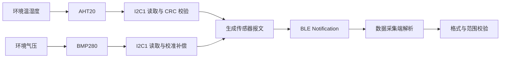
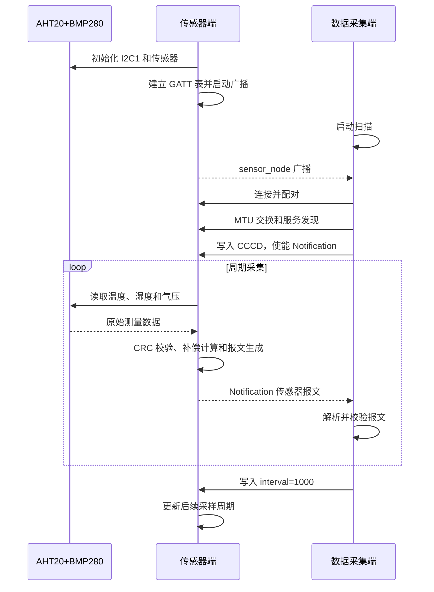

# 传感器上报

> BLE (Bluetooth Low Energy) Notification、GATT (Generic Attribute Profile) 读写、I2C (Inter-Integrated Circuit) 真实传感器采集

> 前置阅读：[Hello BLE](../basics/hello-connect.md)、[通知推送（Notify）](../basics/hello-notify.md)、[属性读写（Read/Write）](../basics/hello-readwrite.md)

## 学习目标

- 掌握 AHT20 和 BMP280 组合传感器模块与 WS63 开发板的接线方法
- 理解 AHT20 温湿度测量、CRC (Cyclic Redundancy Check) 校验和 BMP280 补偿计算流程
- 掌握在独立任务中周期采集传感器并通过 BLE Notification 上报的方法
- 理解 GATT Service、数据 Characteristic、通知 Characteristic 和 CCCD (Client Characteristic Configuration Descriptor) 的作用
- 能够构建、烧录传感器端和数据采集端，并根据关键日志判断数据链路是否正常

## 规格与功能

本案例使用两块 WS63 开发板。传感器端通过 I2C1 采集真实环境数据；数据采集端连接传感器端并接收、校验传感器报文。

| 规格项 | 传感器端 | 数据采集端 |
| --- | --- | --- |
| BLE 角色 | Peripheral / GATT Server | Central / GATT Client |
| 广播设备名 | `sensor_node` | 精确匹配 `sensor_node` |
| GATT Service UUID | `0x3333` | 发现 `0x3333` |
| 数据 Characteristic UUID | `0x3434`，支持读写 | 读取状态并写入采样周期 |
| 通知 Characteristic UUID | `0x3435`，支持 Notification | 订阅并接收传感器报文 |
| 传感器接口 | I2C1，100kHz | — |
| 传感器数据 | 温度、相对湿度、气压 | 格式解析与物理范围校验 |
| 默认上报周期 | 1000ms | 写入 `interval=1000` |
| 可设置周期 | 200ms～60000ms | 通过数据 Characteristic 写入 |
| 断连行为 | 自动恢复广播 | 自动恢复扫描 |

程序运行流程：

1. 传感器端初始化 I2C1、AHT20 和 BMP280
2. 传感器端建立 GATT 服务并广播 `sensor_node`
3. 数据采集端扫描目标广播并建立连接、完成配对和 MTU (Maximum Transmission Unit) 交换
4. 数据采集端发现服务与 Characteristic，并写入 CCCD 使能 Notification
5. 传感器端周期采集温度、湿度和气压，生成文本报文
6. 数据采集端接收报文，校验字段格式和物理范围，再写入采样周期

## 基本概念

### 传感器数据上报链路

一次完整上报会经过“采集、换算、封装、发送、解析、校验”六个阶段：



传感器端始终执行传感器采集并打印采样日志。只有 BLE 已连接且数据采集端已使能 CCCD 时，传感器端才发送 Notification。

### AHT20 与 BMP280 的分工

| 器件 | I2C 地址 | 输出数据 | 驱动处理 |
| --- | --- | --- | --- |
| AHT20 | `0x38` | 温度、相对湿度 | 检查标定状态、触发测量、等待转换、校验 CRC-8、换算物理量 |
| BMP280 | `0x76` 或 `0x77` | 气压、内部温度 | 校验芯片 ID `0x58`、读取校准参数、读取原始值、执行温度和气压补偿 |

AHT20 和 BMP280 共用 SDA、SCL 两根总线信号线。两者地址不同，因此可以挂接在同一条 I2C 总线上。

### 为什么不在 BLE 回调中读取传感器

AHT20 从触发测量到数据就绪需要等待，I2C 访问也可能因为总线异常而失败。如果在连接、写请求或通知回调中同步等待传感器，会阻塞 BLE 回调链，影响连接维护和后续事件处理。

本案例在应用任务中运行独立上报循环：

```text
读取 AHT20 → 读取 BMP280 → 生成报文 → 按需发送 Notification → 延时 → 下一轮
```

BLE 回调只负责连接状态、GATT 请求、CCCD 状态和采样周期更新。

### 上报报文格式

传感器端使用可读文本格式上报数据：

```text
seq=<序号>,temp=<温度>,hum=<相对湿度>,press=<气压>
```

| 字段 | 格式 | 单位 | 数据采集端校验范围 |
| --- | --- | --- | --- |
| `seq` | 大于 0 的无符号整数 | — | 必须能够完整解析且不能为 0 |
| `temp` | 有符号数，保留 1 位小数 | °C | -40.0～85.0 |
| `hum` | 无符号数，保留 1 位小数 | %RH | 0.0～100.0 |
| `press` | 无符号数，保留 1 位小数 | hPa | 300.0～1100.0 |

数据采集端按固定字段顺序解析整个报文。字段缺失、顺序错误、存在多余字符、数值溢出或超出物理范围时，均判定为校验失败。

### GATT 数据通道

本案例在同一个 Service 下使用两个 Characteristic：

| UUID | 属性 | 用途 |
| --- | --- | --- |
| `0x3434` | Read / Write | 读取设备状态；写入 `interval=<毫秒>` 修改采样周期 |
| `0x3435` | Notify | 周期上报传感器报文 |
| `0x2902` | Read / Write | CCCD，数据采集端写入后使能 Notification |

将控制数据和周期上报数据分开，可以避免采样周期写入覆盖通知值，也便于后续扩展更多控制命令。

## 涉及 API

| API | 调用方 | 用途 |
| --- | --- | --- |
| `uapi_pin_set_mode()` | 传感器端 | 将 GPIO15、GPIO16 配置为 I2C1 复用功能 |
| `uapi_i2c_master_init()` | 传感器端 | 初始化 I2C1 主机和总线速率 |
| `uapi_i2c_master_write()` | 传感器端 | 发送 AHT20 测量命令或写入 BMP280 寄存器 |
| `uapi_i2c_master_read()` | 传感器端 | 读取 AHT20 测量结果 |
| `uapi_i2c_master_writeread()` | 传感器端 | 写入寄存器地址后连续读取 BMP280 数据 |
| `gatts_add_service_sync()` | 传感器端 | 创建传感器 GATT Service |
| `gatts_add_characteristic_sync()` | 传感器端 | 创建数据和通知 Characteristic |
| `gatts_add_descriptor_sync()` | 传感器端 | 为通知 Characteristic 创建 CCCD |
| `gatts_notify_indicate()` | 传感器端 | 发送传感器 Notification |
| `gattc_discovery_service()` | 数据采集端 | 发现目标 Service |
| `gattc_discovery_character()` | 数据采集端 | 发现数据和通知 Characteristic |
| `gattc_discovery_descriptor()` | 数据采集端 | 发现 CCCD |
| `gattc_read_req_by_handle()` | 数据采集端 | 读取传感器端状态 |
| `gattc_write_req()` | 数据采集端 | 使能 CCCD 或写入采样周期 |

## 案例说明

### 案例简介

传感器端连接 AHT20+BMP280 四针 I2C 模块，读取温度、相对湿度和气压并周期上报。数据采集端自动完成扫描、连接、配对、服务发现和 Notification 订阅，收到报文后进行严格解析与范围校验。

### 案例流程说明



### 源码对应关系

| 内容 | 源码位置 |
| --- | --- |
| 样例入口和角色选择 | `src/application/samples/bt/ble/ble_sensor_report/ble_sensor_report.c` |
| 传感器端 GATT 逻辑 | `ble_sensor_report_server/src/ble_sensor_report_server.c` |
| 广播数据和广播参数 | `ble_sensor_report_server/src/ble_sensor_report_server_adv.c` |
| AHT20+BMP280 驱动 | `ble_sensor_report_server/src/aht20_bmp280.c` |
| 数据采集端 | `ble_sensor_report_client/src/ble_sensor_report_client.c` |
| 角色配置 | `src/application/samples/bt/ble/ble_sensor_report/Kconfig` |

### 如何识别目标设备

数据采集端同时检查以下广播字段：

1. Complete Local Name 必须完整等于 `sensor_node`
2. Service Data 中的 16-bit UUID 必须等于 `0x3333`
3. Service Data 长度必须合法，并包含设备状态字节

只有名称和 Service Data 均匹配的设备才会被连接，避免误连到名称相近的其他 BLE 设备。

## 案例操作指导

### 第一步：连接传感器模块

准备两块 WS63 开发板、一个 AHT20+BMP280 四针 I2C 模块和杜邦线。仅传感器端需要连接传感器模块。

HH-D02 开发板 USB Type-C 接口朝下时，按下表接线：

| AHT20+BMP280 | HH-D02 / WS63 | 说明 |
| --- | --- | --- |
| VDD | 3V3，右侧倒数第 2 针 | 使用 3.3V 供电 |
| GND | GND，建议使用右侧最上方 GND | 模块与开发板共地 |
| SDA | GPIO15 / SDA1，右侧第 2 针 | I2C1 数据线 |
| SCL | GPIO16 / SCL1，右侧第 3 针 | I2C1 时钟线 |

模块与开发板均断电后再接线。以模块 PCB 的 `SCL/GND/SDA/VDD` 丝印为准，不要只根据排线颜色判断。

### 第二步：编译传感器端固件

在 SDK 工程根目录使用 fbb CLI 打开 Kconfig 配置界面：

```powershell
fbb menuconfig ws63-liteos-app
```

按以下路径选择传感器端：

```text
Application
  → Enable Sample.
    → Enable the Sample of BT.
      → Sample
        → Support BLE Sample.
          → BLE Sample
            → Support BLE Sensor Report Server Sample
```

按 `S` 保存配置并退出 Kconfig，然后执行：

```powershell
fbb build ws63-liteos-app --clean
```

`BLE Sample` 是单选菜单。选择传感器端时会取消其他 BLE 样例，传感器端和数据采集端不能在同一个固件中同时启用。

### 第三步：烧录传感器端

先查询传感器端对应的串口号，再执行：

```powershell
$SensorPort = "COMx" # 替换为传感器端的实际串口号
fbb flash ws63-liteos-app --port $SensorPort --json-summary
```

烧录传感器端后再切换角色配置，避免后续构建覆盖当前角色的固件包。

### 第四步：编译并烧录数据采集端

重新进入 Kconfig 配置界面：

```powershell
fbb menuconfig ws63-liteos-app
```

保持上级配置不变，在 `BLE Sample` 中将角色切换为：

```text
Application
  → Enable Sample.
    → Enable the Sample of BT.
      → Sample
        → Support BLE Sample.
          → BLE Sample
            → Support BLE Sensor Report Client Sample
```

保存并退出 Kconfig，然后构建和烧录数据采集端：

```powershell
fbb build ws63-liteos-app --clean

$CollectorPort = "COMx" # 替换为数据采集端的实际串口号
fbb flash ws63-liteos-app --port $CollectorPort --json-summary
```

烧录成功以 JSON 摘要中的 `"success": true` 为准。

### 第五步：上电运行

传感器端启动后，应依次观察到以下类型的日志：

```text
[aht20+bmp280] AHT20 ready, status=<状态值>
[aht20+bmp280] BMP280 ready, addr=<0x76或0x77> id=0x58
[ble sensor report server] sensor initialized: I2C1 SDA=GPIO15 SCL=GPIO16
[ble sensor report server] advertising started: ble_sensor_report_server
[ble sensor report server] sensor sample: seq=<序号>,temp=<温度>,hum=<湿度>,press=<气压>
```

数据采集端启动后，应观察到扫描、连接、服务发现、通知接收和校验成功日志：

```text
[ble hello client] found ble_sensor_report_server, state=device_status_ok, connecting
[ble hello client] service discovered, handles=<起始句柄>-<结束句柄>
[ble hello client] sensor report received: seq=<序号>,temp=<温度>,hum=<湿度>,press=<气压>
[ble hello client] report validation passed
[ble hello client] report interval write request sent: interval=1000
```

传感器数值会随环境变化。判断案例是否运行成功，应关注传感器初始化、BLE 连接、Notification 接收和报文校验状态，不应依赖某一组固定读数或固定句柄值。

## 关键配置

### I2C 与传感器配置

| 配置项 | 当前值 | 说明 |
| --- | --- | --- |
| I2C 控制器 | I2C1 | AHT20 和 BMP280 共用 |
| SDA | GPIO15，Pin Mode 2 | I2C1 数据线 |
| SCL | GPIO16，Pin Mode 2 | I2C1 时钟线 |
| 总线速率 | 100kHz | 标准模式 |
| AHT20 地址 | `0x38` | 固定地址 |
| BMP280 地址 | 自动探测 `0x76`、`0x77` | 兼容不同模块地址配置 |

修改引脚或 I2C 控制器时，需要同时调整 GPIO 复用、I2C 总线编号和硬件接线。

### 采样周期

默认采样周期为 1000ms。数据采集端通过数据 Characteristic 写入以下命令修改周期：

```text
interval=<毫秒>
```

传感器端只接受 200～60000 范围内的十进制整数。格式错误、包含非数字字符或超出范围时，保留原采样周期。

| 周期范围 | 适用场景 | 影响 |
| --- | --- | --- |
| 200ms～1000ms | 变化较快、需要及时显示 | I2C 与无线活动更频繁，功耗较高 |
| 1000ms～10000ms | 常规环境监测 | 响应速度和功耗较均衡 |
| 10000ms～60000ms | 缓慢变化或低功耗采集 | 数据更新较慢，平均功耗较低 |

### GATT 配置

| 对象 | UUID | 关键属性 |
| --- | --- | --- |
| Sensor Service | `0x3333` | Primary Service |
| Data Characteristic | `0x3434` | Read、Write |
| Notify Characteristic | `0x3435` | Notify |
| Notify CCCD | `0x2902` | Read、Write |

Notification 是无确认推送，适合周期传感器数据。若产品要求每条数据都由对端确认，需要设计 Indication 通道或在应用协议中增加确认和重传机制。

### 报文校验范围

数据采集端的范围检查用于识别报文损坏或单位错误，不用于替代产品级传感器诊断。若更换量程不同的传感器，需要同步修改发送单位、接收解析和范围常量。

## 代码详解

### 代码入口与角色选择

```c
static int ble_sensor_report_task(const char *arg)
{
#if defined(CONFIG_SAMPLE_SUPPORT_BLE_SENSOR_REPORT_SERVER_SAMPLE)
    errcode_t ret = ble_sensor_report_server_init();
    if (ret != ERRCODE_SUCC) {
        return (int)ret;
    }
    ble_sensor_report_server_report_loop();
    return 0;
#elif defined(CONFIG_SAMPLE_SUPPORT_BLE_SENSOR_REPORT_CLIENT_SAMPLE)
    return (int)ble_sensor_report_client_init();
#endif
}
```

同一个应用入口根据 Kconfig 选择传感器端或数据采集端。传感器端完成传感器和 BLE 初始化后进入独立上报循环；数据采集端初始化后由 BLE 回调推进扫描、连接和数据交互。

### 传感器初始化

`aht20_bmp280_init()` 按以下顺序执行：

1. 将 GPIO16 和 GPIO15 配置为 I2C1 复用功能
2. 以 100kHz 初始化 I2C1 主机
3. 等待 AHT20 上电稳定，读取状态并检查标定标志
4. 依次探测 BMP280 地址 `0x76` 和 `0x77`
5. 校验 BMP280 芯片 ID，读取 24 字节校准参数
6. 设置 BMP280 配置和测量控制寄存器

任一步骤失败都会返回错误，传感器端不会在传感器未就绪时继续启动上报服务。

### AHT20 数据读取

AHT20 读取流程如下：

```text
发送 0xAC 0x33 0x00 → 等待测量完成 → 读取 7 字节 → 检查 Busy 位 → 校验 CRC-8 → 提取 20-bit 原始值
```

驱动使用多项式 `0x31`、初始值 `0xFF` 计算 CRC-8。校验通过后，按数据手册公式将原始值换算为 0.1°C 和 0.1%RH，避免在 MCU 上进行浮点格式化。

### BMP280 数据读取与补偿

BMP280 的原始气压值不能直接作为 Pa 使用。驱动先使用原始温度和温度校准参数计算 `t_fine`，再结合气压校准参数执行 Bosch 64-bit 定点补偿公式，最后得到 Pa。

如果原始 ADC (Analog-to-Digital Converter) 值无效、补偿分母为 0 或 I2C 读取失败，本轮采样返回错误，不发送无效报文。

### 报文生成与 Notification

上报循环将温度、湿度和气压统一转换为保留一位小数的文本字段：

```c
snprintf_s((char *)report, sizeof(report), sizeof(report) - 1,
           "seq=%u,temp=%s%u.%u,hum=%u.%u,press=%u.%u", ...);

if (g_hello_notify_enabled) {
    ble_sensor_report_server_send_notification(report, (uint16_t)report_len);
}
```

序号递增且跳过 0。未连接或 CCCD 未使能时仍会完成本地采样，但不会调用 `gatts_notify_indicate()`。

### 数据采集端报文解析

数据采集端不使用固定字符串比较，而是逐字段解析：

1. 复制到有界缓冲区并补充字符串结束符
2. 依次匹配 `seq=`、`,temp=`、`,hum=`、`,press=`
3. 检查整数累加是否溢出
4. 要求每个物理量恰好包含一位小数
5. 确认报文已被完整消费，没有多余字符
6. 检查温度、湿度和气压范围

只有全部检查通过时才打印 `report validation passed`。

### 采样周期更新

数据采集端在完成通知接收和状态读取后写入 `interval=1000`。传感器端的写请求回调检查前缀、数字格式、整数溢出和允许范围，合法时更新 `g_report_interval_ms`。

由于采样循环在每轮末尾读取该变量，新的周期会从后续循环开始生效，无需重启设备或 BLE 连接。

## 常见问题

- 传感器端提示 AHT20 状态读取失败：检查 3V3、GND、SDA 和 SCL 接线，确认 SDA 接 GPIO15、SCL 接 GPIO16。
- AHT20 状态为 `0x08` 或 `0x0c`：Bit3 已置位表示器件已标定；驱动只检查已定义的 CAL 位，不依赖保留位。
- 提示 `BMP280 not found`：检查模块供电和焊接，并确认所用模块确实包含 BMP280；驱动会自动探测 `0x76` 和 `0x77`。
- 能采样但收不到 Notification：确认数据采集端已连接目标设备、完成服务发现并成功写入 CCCD。
- 收到数据但校验失败：检查报文是否完整、字段单位是否一致，以及数据是否超出数据采集端的校验范围。
- 切换角色后运行的仍是旧固件：先确认 Kconfig 角色，再执行一次干净构建并重新烧录对应开发板。

## 参考资料

- [AHT20 数据手册](https://www.aosong.com/userfiles/files/media/Data%20Sheet%20AHT20.pdf)
- [BMP280 数据手册](https://www.bosch-sensortec.com/media/boschsensortec/downloads/datasheets/bst-bmp280-ds001.pdf)
