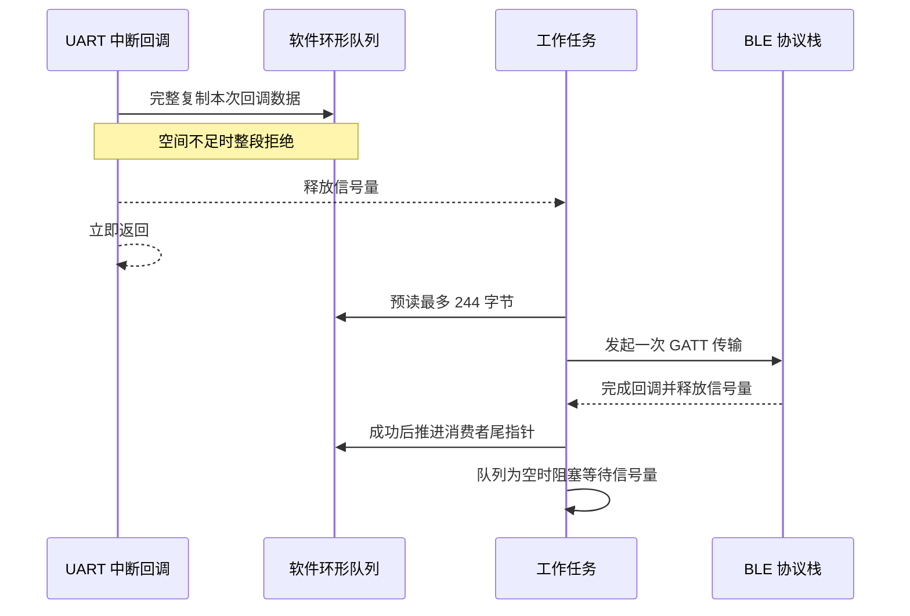
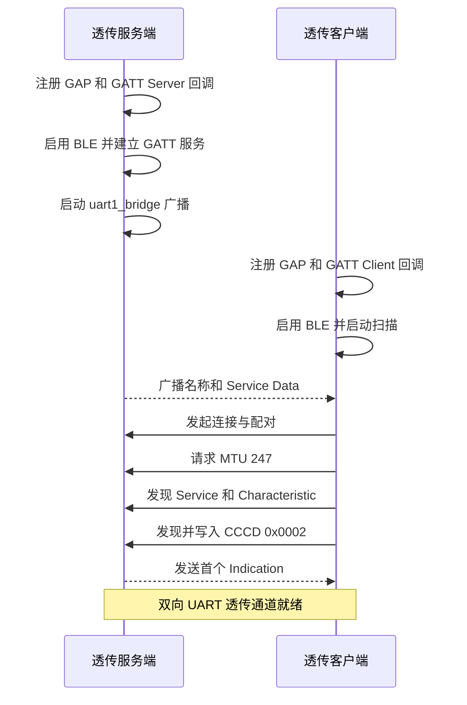
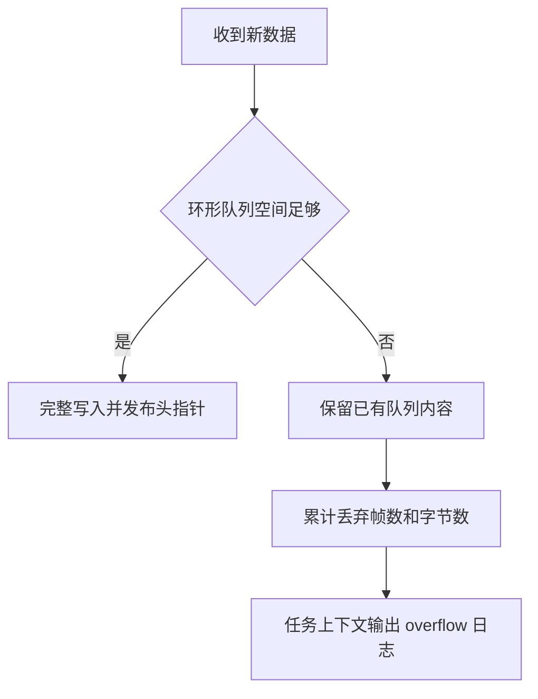
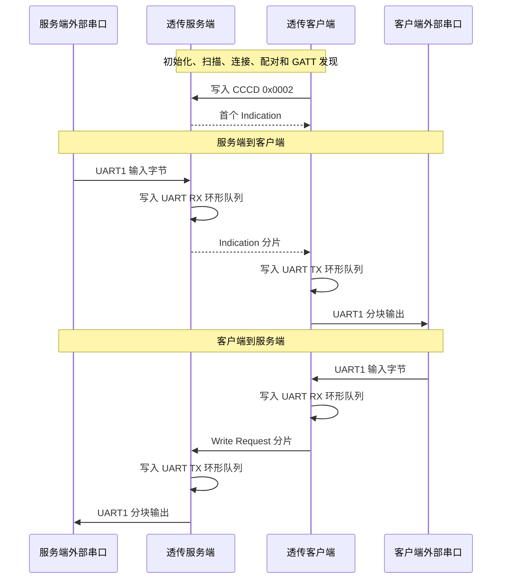

# UART 透传

> BLE (Bluetooth Low Energy) GATT (Generic Attribute Profile) Indication、Write Request 与 UART (Universal Asynchronous Receiver/Transmitter) 双向数据桥接

> 前置阅读：[Hello BLE](../basics/hello-connect.md)、[通知推送（Notify）](../basics/hello-notify.md)、[属性读写（Read/Write）](../basics/hello-readwrite.md)

## 学习目标

- 理解 UART 字节流与 BLE 属性数据包之间的差异，以及为什么需要分片和缓存
- 掌握 WS63 UART1 的接线、初始化和中断接收方法
- 理解透传服务端和透传客户端的 BLE 建链、服务发现与 CCCD (Client Characteristic Configuration Descriptor) 配置流程
- 掌握使用有界环形队列和信号量将 UART 中断回调、BLE 回调与工作任务解耦的方法
- 能够构建、烧录两个角色，并验证 UART1 数据在两块 WS63 开发板之间双向透传

## 规格与功能

本案例使用两块 WS63 开发板和两路 3.3V USB-TTL 串口。两块开发板都通过 UART1 接收和发送用户数据，BLE 角色只决定无线连接与 GATT 数据交互方式。

| 规格项 | 透传服务端 | 透传客户端 |
| --- | --- | --- |
| BLE 角色 | Peripheral / GATT Server | Central / GATT Client |
| 设备发现 | 广播 `uart1_bridge` | 同时匹配设备名和 Service Data |
| GATT Service UUID | `0x4444` | 发现 `0x4444` |
| 数据 Characteristic UUID | `0x4545`，Read / Write / Write Without Response | 使用 Write Request 写入 UART 数据 |
| 指示 Characteristic UUID | `0x4546`，Indicate | 写入 CCCD 并接收 Indication |
| UART 接口 | UART1，GPIO15 TX，GPIO16 RX | UART1，GPIO15 TX，GPIO16 RX |
| UART 参数 | 115200 bit/s、8 数据位、1 停止位、无校验、无流控 | 与服务端相同 |
| UART 工作方式 | 基本模式，接收回调由中断触发，不使用 DMA | 与服务端相同 |
| 软件环形队列 | UART RX 和 UART TX 各使用 1024 字节存储，有效容量 1023 字节 | 与服务端相同 |
| BLE MTU | 响应客户端协商 | 请求 247 字节 |
| 单个 BLE 数据分片 | 最大 244 字节 | 最大 244 字节 |
| 单次 UART 写入请求 | 最大 244 字节，按驱动实际接收长度消费 | 与服务端相同 |
| 工作任务调度 | UART、BLE 回调通过信号量按事件唤醒，无固定轮询延时 | 与服务端相同 |
| 断连行为 | 重新广播，保留尚未确认的 UART 数据 | 保留尚未确认的 UART 数据，重新扫描并发现 GATT 服务 |

程序运行流程：

1. 两端初始化 UART1，注册接收回调并启动 BLE 协议栈
2. 透传服务端建立 GATT 服务并广播 `uart1_bridge`
3. 透传客户端扫描、连接、配对、交换 MTU 并发现 Service、Characteristic 和 CCCD
4. 透传客户端写入 CCCD，使能服务端到客户端的 Indication 通道
5. 任一端 UART1 收到数据后先写入 UART RX 环形队列，并通过信号量唤醒工作任务分片发送到 BLE
6. 任一端通过 BLE 收到数据后先写入 UART TX 环形队列，并通过信号量唤醒工作任务写入 UART1

## 基本概念

### UART 字节流与 BLE 数据包

UART 提供连续字节流。发送方一次写入多少字节，不代表接收回调就会一次返回相同长度；串口空闲、驱动缓冲区状态和任务调度都可能改变回调分段。

BLE GATT 则以属性操作传输有边界的数据包。MTU 为 247 时，扣除 ATT (Attribute Protocol) 操作头后，本案例每个 UART 数据分片最多承载 244 字节。

| 对比项 | UART | BLE GATT |
| --- | --- | --- |
| 数据模型 | 连续字节流 | 有长度的数据包 |
| 单次数据边界 | 不保证与发送调用一致 | 每个属性操作有明确长度 |
| 速度约束 | 波特率和帧格式 | 连接参数、MTU 和协议栈队列 |
| 拥塞表现 | 驱动或软件队列溢出 | API 返回忙、发送失败或等待确认 |
| 本案例处理 | 写入环形队列 | 从环形队列取出不超过 244 字节的分片 |

> 透传表示尽量保持字节内容和顺序，不表示 UART 的每次写调用与接收端的每次读回调一一对应。验证大数据时应比较总长度和完整内容，而不是比较回调次数。

### 双向数据路径

两块开发板都能发送和接收。为了避免把 BLE 角色误解为固定的数据方向，本文统一使用“透传服务端”和“透传客户端”：


透传服务端向透传客户端发送时使用 Indication；透传客户端向透传服务端发送时使用 Write Request。两个方向共用相同的 UART 缓冲和工作任务，并且都在收到对应完成事件后才消费当前分片。

### 为什么使用两个环形缓冲区

UART 回调和 BLE 回调都由底层驱动或协议栈触发，不适合在其中执行长时间阻塞操作。本案例为每块开发板设置两个独立的软件环形队列：

| 环形队列 | 生产者 | 消费者 | 保存的数据 |
| --- | --- | --- | --- |
| UART RX 环形队列 | UART 接收回调 | BLE 工作任务 | 等待发往无线链路的数据 |
| UART TX 环形队列 | BLE 接收回调 | UART 工作任务 | 等待写往外部串口的数据 |



环形队列使用“保留一个空槽”的方式区分队空和队满，因此每个数组使用 1024 字节存储时，有效容量是 1023 字节。UART RX 回调和 BLE 接收回调都会先检查剩余空间：只有本次回调数据或 BLE 分片能够完整写入时，才复制数据并发布新的头指针；空间不足则整段拒绝，避免消费者看到半段数据。

### 两个 BLE 方向的确认机制

| 数据方向 | GATT 操作 | 完成条件 | 特点 |
| --- | --- | --- | --- |
| 透传服务端 → 透传客户端 | Indication | 收到 `indicate_confirm_cb` | 有链路层确认，发送节奏受确认约束 |
| 透传客户端 → 透传服务端 | Write Request | 收到数据句柄对应的 `write_cb` | 服务端返回 ATT 写响应后才释放分片 |

服务端方向同一时刻只保留一个在途分片。只有 Indication 确认成功，工作任务才移动 UART RX 环形队列的尾指针；失败或断连时数据仍保留，等待后续重试。

客户端方向同样只保留一个在途 Write Request。服务端成功接收并将完整分片加入 UART TX 队列后返回 ATT 写响应；客户端在 `write_cb` 收到成功结果后，才消费 UART RX 队列中的对应数据。请求提交失败或确认失败时，原数据保留并在短暂退避后重试。

> Indication 和 Write Request 的成功只证明 BLE 对端协议栈或本案例接收逻辑已接受当前分片，不证明外部 UART 设备已经处理数据。如果产品要求业务端到端可靠，需要在 UART 数据中增加序号、确认和重传协议。

### 回调驱动与任务上下文

BLE 初始化、扫描、连接、配对、MTU 交换和 GATT 服务发现都是异步过程。应用调用 API 后立即返回，后续步骤由回调继续推进。



UART 接收回调只把数据写入环形队列并唤醒工作任务；BLE 接收与发送完成回调也只更新队列状态并发布唤醒事件。真正的 BLE 发送和 UART 写入都在独立工作任务中完成。任务在仍有可处理数据时立即继续排空队列，队列为空时阻塞等待信号量，因此正常流量没有固定轮询延时。

### 缓冲、背压与溢出

环形队列可以吸收短时间突发数据，但不能无限提升无线链路吞吐量。当持续 UART 输入速度高于 BLE 实际发送速度，队列最终仍会写满。

本案例采用以下背压策略：

- UART RX 队列空间不足时整段拒绝本次回调数据，并累计丢弃帧数和字节数
- BLE 接收数据无法完整写入 UART TX 队列时整包拒绝，并累计丢弃帧数和字节数
- BLE 提交或确认失败时不移动 UART RX 队列尾指针，退避 20ms 后重试同一分片
- UART 驱动拒绝写入时保留当前数据并退避 5ms；部分写入时只消费驱动实际接收的字节
- UART、BLE 回调和完成事件通过信号量唤醒工作任务，正常传输不等待固定延时



## 涉及 API

下表按初始化和数据流顺序列出案例中的核心 API：

| API | 调用方 | 用途 |
| --- | --- | --- |
| `osal_kthread_create()` | 两端应用入口 | 创建双向透传工作任务 |
| `osal_sem_init()` | 两端工作任务 | 创建事件信号量，在数据到达前阻塞任务 |
| `osal_sem_up()` | UART、BLE 回调 | 发布一次工作任务唤醒事件 |
| `osal_sem_down()` | 两端工作任务 | 队列排空后等待下一次 UART 或 BLE 事件 |
| `uapi_pin_set_mode()` | 两端工作任务 | 将 GPIO15、GPIO16 配置为 UART1 复用功能 |
| `uapi_uart_init()` | 两端工作任务 | 以 115200 8N1 初始化 UART1 和驱动接收缓冲 |
| `uapi_uart_register_rx_callback()` | 两端工作任务 | 注册 UART 接收中断回调 |
| `gap_ble_register_callbacks()` | 两端 BLE 角色 | 注册使能、扫描、连接和配对回调 |
| `gatts_register_callbacks()` | 透传服务端 | 注册 GATT Server 服务、读写和 Indication 确认回调 |
| `gattc_register_callbacks()` | 透传客户端 | 注册 GATT Client 发现、读写和数据接收回调 |
| `enable_ble()` | 两端 BLE 角色 | 启用 BLE 协议栈 |
| `gap_ble_set_adv_data()` | 透传服务端 | 设置设备名、Service UUID 和状态字段 |
| `gap_ble_set_adv_param()` | 透传服务端 | 设置可连接广播参数 |
| `gap_ble_start_adv()` | 透传服务端 | 启动广播 |
| `gap_ble_set_scan_parameters()` | 透传客户端 | 设置主动扫描参数 |
| `gap_ble_start_scan()` | 透传客户端 | 开始扫描目标设备 |
| `gap_ble_connect_remote_device()` | 透传客户端 | 连接匹配到的透传服务端 |
| `gap_ble_pair_remote_device()` | 透传客户端 | 与未配对的服务端建立安全关系 |
| `gattc_exchange_mtu_req()` | 透传客户端 | 请求将 MTU 扩展到 247 字节 |
| `gatts_add_service_sync()` | 透传服务端 | 创建 UART Bridge Service |
| `gatts_add_characteristic_sync()` | 透传服务端 | 创建数据和 Indication Characteristic |
| `gatts_add_descriptor_sync()` | 透传服务端 | 为 Indication Characteristic 创建 CCCD |
| `gattc_discovery_service()` | 透传客户端 | 发现 UART Bridge Service |
| `gattc_discovery_character()` | 透传客户端 | 发现数据和 Indication Characteristic |
| `gattc_discovery_descriptor()` | 透传客户端 | 发现 Indication CCCD |
| `gattc_write_req()` | 透传客户端 | 写入 CCCD、同步案例状态并发送 UART 数据 Write Request |
| `gatts_notify_indicate()` | 透传服务端 | 发送 UART 数据 Indication |
| `uapi_uart_write()` | 两端工作任务 | 将 BLE 接收数据写入 UART1，并返回驱动实际接收长度 |

## 案例说明

### 案例简介

透传服务端和透传客户端分别连接一路外部 USB-TTL 串口。任一串口输入的原始字节都会经过本端 UART1、软件环形队列和 BLE GATT 通道，到达另一块开发板的 UART1 输出。

本案例适合学习串口无线延长、双 MCU 数据交换、外部模组无线接入等场景。它提供的是字节通道，业务协议仍由 UART 两端设备定义。

### 案例流程说明



### 源码对应关系

| 内容 | 源码位置 |
| --- | --- |
| 应用入口、UART 初始化、双环形队列和工作任务 | `src/application/samples/bt/ble/ble_uart_bridge/ble_uart_bridge.c` |
| 公共分片长度和跨角色接口 | `src/application/samples/bt/ble/ble_uart_bridge/ble_uart_bridge.h` |
| 透传服务端 GATT 逻辑 | `ble_uart_bridge_server/src/ble_uart_bridge_server.c` |
| 透传服务端广播数据和参数 | `ble_uart_bridge_server/src/ble_uart_bridge_server_adv.c` |
| 透传客户端扫描、连接和 GATT 发现 | `ble_uart_bridge_client/src/ble_uart_bridge_client.c` |
| 角色配置 | `src/application/samples/bt/ble/Kconfig` |

### 如何识别目标设备

透传客户端不会只根据一个字符串连接设备，而是同时检查广播中的两个字段：

1. Complete Local Name 必须完整等于 `uart1_bridge`
2. Service Data 中的 16-bit UUID 必须等于 `0x4444`
3. Service Data 长度必须正确，并携带服务端属性状态字节

同时匹配设备名和服务数据可以降低误连概率。匹配成功后，客户端复制对端地址、停止扫描，再发起连接。

### 关键设计决策

| 设计 | 原因 | 代价 |
| --- | --- | --- |
| UART 和 BLE 回调只入队 | 缩短中断与协议栈回调占用时间 | 需要额外 RAM 和工作任务 |
| 每个环形队列使用 1024 字节存储 | 将单向有效容量限制为 1023 字节，控制静态 RAM 占用 | 超过剩余空间的完整回调数据或 BLE 分片会被拒绝 |
| 服务端方向使用 Indication | 确认成功后再消费分片，顺序清晰 | 每个分片需要确认，吞吐量较低 |
| 客户端方向使用 Write Request | 服务端成功入队后才消费当前分片，与 Indication 方向行为对称 | 每个分片都有 ATT 响应开销 |
| 信号量事件驱动 | 正常流量到达后立即处理，空闲时不轮询 | 需要在回调与任务间维护唤醒状态 |
| UART 单次最多提交 244 字节 | 与 BLE 最大分片对齐，减少 UART 写调用次数 | 必须正确处理驱动拒绝和部分写入 |
| 断连后保留未确认数据 | 重连后可继续重试两个方向的在途分片 | 队列空间会在断连期间被占用 |

## 案例操作指导

### 第一步：准备硬件并连接 UART1

准备以下硬件：

- 两块 WS63 HH-D02 开发板
- 两个支持 3.3V TTL 电平的 USB-TTL 串口模块
- 杜邦线

每块开发板都按下表连接一个 USB-TTL 模块：

| HH-D02 / WS63 | USB-TTL | 说明 |
| --- | --- | --- |
| GPIO15 / UART1_TX | RXD | WS63 发送，USB-TTL 接收 |
| GPIO16 / UART1_RX | TXD | USB-TTL 发送，WS63 接收 |
| GND | GND | 两端必须共地 |

两块开发板通过自身 USB Type-C 接口供电时，不需要连接 USB-TTL 的 VCC。不要将 5V TTL 信号直接接入 WS63。

> 开发板 USB Type-C 枚举出的串口用于烧录和日志；外接 USB-TTL 枚举出的串口用于 UART1 透传数据。两类端口用途不同。

### 第二步：编译透传服务端固件

在 SDK 工程根目录使用 fbb CLI 打开 Kconfig 配置界面：

```powershell
fbb menuconfig ws63-liteos-app
```

按以下路径选择透传服务端：

```text
Application
  → Enable Sample.
    → Enable the Sample of BT.
      → Sample
        → Support BLE Sample.
          → BLE Sample
            → Support BLE UART Bridge Server Sample
```

按 `S` 保存配置并退出 Kconfig，然后执行：

```powershell
fbb build ws63-liteos-app --clean
```

`BLE Sample` 是单选菜单。透传服务端与透传客户端不能同时编入一个固件。构建成功后，先烧录服务端，再切换角色，避免输出目录中的固件包被下一次构建覆盖。

### 第三步：烧录透传服务端

查询透传服务端开发板的烧录串口号，然后执行：

```powershell
$ServerPort = "COMx" # 替换为透传服务端开发板的实际烧录串口号
fbb flash ws63-liteos-app --port $ServerPort --json-summary
```

烧录成功以 JSON 摘要中的 `"success": true` 为准。

### 第四步：编译并烧录透传客户端

重新打开 Kconfig：

```powershell
fbb menuconfig ws63-liteos-app
```

保持上级配置不变，在 `BLE Sample` 中切换为：

```text
Application
  → Enable Sample.
    → Enable the Sample of BT.
      → Sample
        → Support BLE Sample.
          → BLE Sample
            → Support BLE UART Bridge Client Sample
```

保存后执行干净构建，并烧录透传客户端：

```powershell
fbb build ws63-liteos-app --clean

$ClientPort = "COMx" # 替换为透传客户端开发板的实际烧录串口号
fbb flash ws63-liteos-app --port $ClientPort --json-summary
```

### 第五步：上电并确认 BLE 通道就绪

先复位透传服务端，再复位透传客户端。两端首先应输出 UART1 初始化日志：

```text
[ble uart bridge] UART1 ready: IRQ mode, RX queue=1023, TX queue=1023, no DMA, TX=GPIO15 RX=GPIO16 115200 8N1
```

透传服务端应出现服务和广播启动日志：

```text
[ble hello server] service ready: service=<句柄> data=<句柄> notify=<句柄> notify_cccd=<句柄>
[ble hello server] advertising started: ble_uart_bridge_server
[ble hello server] connected, conn_id=<连接标识>
[ble hello server] UART RX indication CCCD enabled
```

透传客户端应出现扫描、连接、MTU 和服务发现日志：

```text
[ble hello client] start scanning
[ble hello client] found ble_uart_bridge_server, state=<状态>, connecting
[ble hello client] connected, conn_id=<连接标识>
[ble hello client] MTU changed: 247, status=0x0
[ble hello client] service discovered, handles=<起始句柄>-<结束句柄>
[ble hello client] hello CCCD write success
```

连接建立时，案例会通过 GATT 交换 `uart_from_peripheral` 和 `uart_from_central` 两段握手数据，这些字节也会从 UART1 输出。正式验证用户数据前，可以先清空外部串口工具的接收窗口。

### 第六步：验证双向透传

将两个外部 USB-TTL 串口工具都设置为 115200 bit/s、8 数据位、1 停止位、无校验、无硬件流控。

先验证透传服务端到透传客户端：

1. 在服务端外部串口发送 `server_to_client_001`
2. 在客户端外部串口确认收到完全相同的字节

再验证透传客户端到透传服务端：

1. 在客户端外部串口发送 `client_to_server_001`
2. 在服务端外部串口确认收到完全相同的字节

验证大数据时，建议串口工具以原始文件方式发送，并比较发送端与接收端的总字节数和文件哈希。单次突发数据不要超过当前环形队列剩余空间；空队列的有效容量为 1023 字节。超过上限的数据不会通过扩大队列无限承接，而是按整段拒绝策略统计并丢弃。

判断透传成功应同时满足：

- 两端没有出现 `UART RX overflow` 或 `UART TX overflow`
- 接收总字节数与发送总字节数一致
- 接收内容或文件哈希与发送内容一致

## 关键配置

### UART1 引脚与帧格式

下面的配置决定外部串口接线和终端参数：

```c
/* 使用 UART1；避免与默认日志串口混用。 */
#define BLE_UART_BRIDGE_UART_BUS UART_BUS_1

/* GPIO15 发送、GPIO16 接收；两者使用 Pin Mode 1。 */
#define BLE_UART_BRIDGE_UART_TX_PIN S_MGPIO15
#define BLE_UART_BRIDGE_UART_RX_PIN S_MGPIO16
#define BLE_UART_BRIDGE_UART_TX_MODE PIN_MODE_1
#define BLE_UART_BRIDGE_UART_RX_MODE PIN_MODE_1

/* 两端必须使用相同波特率和帧格式。 */
#define BLE_UART_BRIDGE_UART_BAUDRATE 115200

uart_attr_t attr = {
    .baud_rate = BLE_UART_BRIDGE_UART_BAUDRATE,
    .data_bits = UART_DATA_BIT_8,
    .stop_bits = UART_STOP_BIT_1,
    .parity = UART_PARITY_NONE,
};
```

修改 UART 引脚时，需要同步修改 Pin Mode 和硬件接线。修改波特率时，两块 WS63 和两个外部串口工具必须同时修改。

### 缓冲区、分片与调度

```c
/* MTU 247 扣除 ATT 操作头后，每个 BLE 数据分片最多承载 244 字节。 */
#define BLE_UART_BRIDGE_BLE_PAYLOAD_MAX_LEN 244

/* UART 驱动接收缓冲与一个最大 BLE 分片对齐。 */
#define BLE_UART_BRIDGE_UART_DRIVER_BUFFER_SIZE BLE_UART_BRIDGE_BLE_PAYLOAD_MAX_LEN

/* 每个方向使用 1024 字节存储，并保留一个空槽区分队空和队满。 */
#define BLE_UART_BRIDGE_UART_QUEUE_STORAGE_SIZE 1024U
#define BLE_UART_BRIDGE_UART_QUEUE_CAPACITY (BLE_UART_BRIDGE_UART_QUEUE_STORAGE_SIZE - 1U)

/* 正常流量不休眠；只有 BLE 或 UART 拒绝当前操作时才短暂退避。 */
#define BLE_UART_BRIDGE_BLE_RETRY_DELAY_MS 20
#define BLE_UART_BRIDGE_UART_RETRY_DELAY_MS 5
```

这里的 1024 字节是应用层软件队列存储大小，不是 DMA 传输块大小。本案例未启用 UART DMA；保留一个空槽后，任一方向最多排队 1023 字节，超过当前剩余空间的完整输入段会被拒绝并计入溢出统计。

| 参数 | 当前值 | 调大影响 | 调小影响 |
| --- | --- | --- | --- |
| `BLE_UART_BRIDGE_UART_QUEUE_STORAGE_SIZE` | 1024 字节 | 可吸收更大突发，但两个方向都会增加静态 RAM 占用 | 有效容量降低，更容易整段拒绝突发数据 |
| `BLE_UART_BRIDGE_UART_DRIVER_BUFFER_SIZE` | 244 字节 | 单次回调可能更长，但驱动 RAM 增加 | 回调更频繁，软件队列复制次数增加 |
| `BLE_UART_BRIDGE_BLE_PAYLOAD_MAX_LEN` | 244 字节 | 不能超过协商 MTU 允许的 ATT 载荷 | 分片数量增加，协议开销变大 |
| `BLE_UART_BRIDGE_BLE_RETRY_DELAY_MS` | 20ms | 失败后的协议栈压力降低，但重试恢复更慢 | 恢复更快，但可能持续遇到 BLE 忙 |
| `BLE_UART_BRIDGE_UART_RETRY_DELAY_MS` | 5ms | UART 拒绝后的重试压力降低，但队列排空稍慢 | 恢复更快，但可能频繁重试 |

### GATT 配置

```c
/* 客户端请求 MTU 247，扩大单个属性操作可携带的数据。 */
#define BLE_UART_BRIDGE_MTU 247

/* ATT 操作头占 3 字节，因此应用分片上限为 247 - 3。 */
#define BLE_UART_BRIDGE_BLE_PAYLOAD_MAX_LEN 244
```

| GATT 对象 | UUID | 配置 | 作用 |
| --- | --- | --- | --- |
| UART Bridge Service | `0x4444` | Primary Service | 组织透传属性 |
| Data Characteristic | `0x4545` | Read、Write、Write Without Response | 客户端向服务端发送 UART 数据 |
| Indication Characteristic | `0x4546` | Indicate | 服务端向客户端发送 UART 数据 |
| Indication CCCD | `0x2902` | Read、Write | 客户端写入 `0x0002` 后使能 Indication |

客户端请求 MTU 247，因此应用载荷上限设置为 244。若 MTU 交换失败，不应盲目增大分片；需要按实际协商 MTU 重新计算 ATT 可用载荷。

### 广播与扫描配置

| 参数 | 当前值 | 说明 |
| --- | --- | --- |
| 广播设备名 | `uart1_bridge` | 客户端身份匹配条件之一 |
| Service UUID | `0x4444` | 同时写入 Complete UUID16 和 Service Data |
| 广播间隔 | `0x30` | 最小值和最大值相同，使用固定间隔 |
| 广播信道图 | `0x07` | 使用三个 BLE 主广播信道 |
| 广播类型 | 可连接非定向 | 允许任意匹配客户端连接 |
| 扫描类型 | Active Scan | 获取完整广播信息 |
| 扫描 PHY | 1M | 使用通用 1M PHY |
| 扫描间隔和窗口 | 均为 `0x30` | 持续扫描，发现快但功耗较高 |

### 可靠性选择

| 方案 | 本案例是否使用 | 适用场景 | 注意事项 |
| --- | --- | --- | --- |
| Indication | 服务端到客户端 | 需要逐包确认、发送频率适中 | 确认增加时延和空口开销 |
| Write Request | 客户端到服务端 | 需要服务端逐包应答、与反向确认行为对称 | ATT 响应会增加时延和空口开销 |
| Write Command | Characteristic 支持，但本案例透传路径未使用 | 连续数据、追求较低协议开销 | 没有逐包 ATT 响应，需要应用协议补充可靠性 |
| UART 硬件流控 | 未使用 | UART 对端支持 RTS/CTS 的持续高速输入 | 需要额外引脚和双方配置 |
| 应用层序号与 ACK | 未使用 | 文件、配置或不能丢失的数据 | 需要定义超时、重传和去重规则 |

## 代码详解

### 代码入口与角色选择

同一个工作任务先创建信号量并初始化 UART1，再根据 Kconfig 选择 BLE 角色。下面保留事件驱动和双向调度主线，省略初始化失败时的重复资源释放分支：

```c
static int ble_uart_bridge_task(const char *arg)
{
    uint8_t data[BLE_UART_BRIDGE_BLE_PAYLOAD_MAX_LEN];
    uint16_t length;
    errcode_t ret;

    (void)arg;

    /* 先建立任务唤醒通道，再注册可能在中断中触发的 UART 回调。 */
    if (osal_sem_init(&g_worker_sem, 0) != OSAL_SUCCESS) {
        return (int)ERRCODE_FAIL;
    }
    g_worker_sem_ready = true;

    ret = ble_uart_bridge_uart_init();
    if (ret != ERRCODE_SUCC) {
        return (int)ret;
    }

#if defined(CONFIG_SAMPLE_SUPPORT_BLE_UART_BRIDGE_SERVER_SAMPLE)
    /* 服务端建立 GATT 表并开始广播。 */
    ret = ble_uart_bridge_server_init();
#elif defined(CONFIG_SAMPLE_SUPPORT_BLE_UART_BRIDGE_CLIENT_SAMPLE)
    /* 客户端开始扫描并在连接后发现 GATT 表。 */
    ret = ble_uart_bridge_client_init();
#else
    return 0;
#endif
    if (ret != ERRCODE_SUCC) {
        return (int)ret;
    }

    while (1) {
        ble_uart_bridge_report_uart_overflow();

        /* BLE 到 UART 方向即使在等待另一个方向确认时也可以继续排空。 */
        (void)ble_uart_bridge_process_uart_tx();

        if (!g_ble_send_pending && g_ble_retry_required) {
            /* 仅失败后退避；正常流量没有固定延时。 */
            g_ble_retry_required = false;
            osal_msleep(BLE_UART_BRIDGE_BLE_RETRY_DELAY_MS);
        }

        if (!g_ble_send_pending) {
            length = ble_uart_bridge_uart_queue_peek(data, sizeof(data));
            if (length > 0) {
                /* 调用角色接口前先标记在途状态，兼容同步完成回调。 */
                g_ble_send_pending_length = length;
                g_ble_send_pending = true;
#if defined(CONFIG_SAMPLE_SUPPORT_BLE_UART_BRIDGE_SERVER_SAMPLE)
                ret = ble_uart_bridge_server_send_notification(data, length);
#else
                ret = ble_uart_bridge_client_send_write(data, length);
#endif
                if (ret != ERRCODE_BT_SUCCESS && g_ble_send_pending) {
                    /* 提交被拒绝时不会再回调，由公共完成函数保留数据并安排重试。 */
                    ble_uart_bridge_ble_send_complete(ERRCODE_BT_FAIL);
                }
            }
        }

        /* 仍有可处理数据时立即继续；全部排空后才阻塞等待事件。 */
        if (g_uart_tx_queue_head != g_uart_tx_queue_tail ||
            (!g_ble_send_pending && g_uart_rx_queue_head != g_uart_rx_queue_tail)) {
            continue;
        }
        ble_uart_bridge_worker_wait();
    }
}
```

角色切换只改变 BLE 源文件和回调链，UART 初始化、双环形队列、信号量唤醒和工作任务完全复用。UART 输入、BLE 接收以及 BLE 发送完成都会调用 `ble_uart_bridge_worker_wake()`；该函数合并尚未消费的重复事件，避免无意义地累积信号量计数。

### UART1 初始化

初始化流程先设置引脚复用，再重新初始化 UART1，最后注册接收回调。下面省略重复的错误返回分支：

```c
uart_pin_config_t pins = {
    .tx_pin = BLE_UART_BRIDGE_UART_TX_PIN,
    .rx_pin = BLE_UART_BRIDGE_UART_RX_PIN,
    .cts_pin = PIN_NONE, /* 本案例不使用硬件流控。 */
    .rts_pin = PIN_NONE,
};
uart_buffer_config_t buffer = {
    .rx_buffer = g_uart_driver_buffer,
    .rx_buffer_size = sizeof(g_uart_driver_buffer),
};

uapi_pin_set_mode(BLE_UART_BRIDGE_UART_TX_PIN, BLE_UART_BRIDGE_UART_TX_MODE);
uapi_pin_set_mode(BLE_UART_BRIDGE_UART_RX_PIN, BLE_UART_BRIDGE_UART_RX_MODE);

/* 清除其他案例可能遗留的 UART1 配置，再使用本案例参数初始化。 */
(void)uapi_uart_deinit(BLE_UART_BRIDGE_UART_BUS);

/* DMA 配置参数传入 NULL，本案例使用 UART 基本模式和接收中断回调。 */
uapi_uart_init(BLE_UART_BRIDGE_UART_BUS, &pins, &attr, NULL, &buffer);

/* FULL、SUFFICIENT DATA 或 IDLE 均可触发，短包不必等待缓冲区填满。 */
uapi_uart_register_rx_callback(
    BLE_UART_BRIDGE_UART_BUS,
    UART_RX_CONDITION_FULL_OR_SUFFICIENT_DATA_OR_IDLE,
    1,
    ble_uart_bridge_uart_rx_cb);
```

空闲条件对交互式串口很重要。如果用户只输入几个字节，UART 线路进入空闲后也会及时触发回调。本案例没有启用 UART DMA；接收路径由 UART 驱动回调触发，回调把数据复制到软件队列后立即返回。

### UART 接收回调写入环形队列

UART 接收回调是 UART RX 环形队列的唯一生产者，工作任务是唯一消费者：

```c
static void ble_uart_bridge_uart_rx_cb(const void *buffer, uint16_t length, bool error)
{
    const uint8_t *source = (const uint8_t *)buffer;
    uint16_t free_length;
    uint16_t head;
    uint16_t index;

    if (error || source == NULL || length == 0) {
        return;
    }

    head = g_uart_rx_queue_head;
    free_length = (uint16_t)(BLE_UART_BRIDGE_UART_QUEUE_CAPACITY -
        ble_uart_bridge_uart_queue_count(head, g_uart_rx_queue_tail));

    /* 空间不足时整段拒绝，避免只保存一次回调中的部分字节。 */
    if (length > free_length) {
        g_uart_rx_dropped_frames++;
        g_uart_rx_dropped_bytes += length;
        ble_uart_bridge_worker_wake();
        return;
    }

    for (index = 0; index < length; index++) {
        g_uart_rx_queue[head] = source[index];
        head = ble_uart_bridge_uart_queue_advance(head, 1);
    }

    /* 完整复制后才发布头指针，任务不会读取到半段数据。 */
    g_uart_rx_queue_head = head;
    ble_uart_bridge_worker_wake();
}
```

回调中不调用 BLE API，也不打印溢出日志。它只完成有界复制、计数和任务唤醒；工作任务检测计数变化后输出日志，避免在中断上下文执行慢操作。

### BLE 数据入队并写往 UART1

客户端收到 Indication、服务端收到 Data Characteristic 写入时，都调用 `ble_uart_bridge_uart_enqueue()`：

```c
errcode_t ble_uart_bridge_uart_enqueue(const uint8_t *data, uint16_t length)
{
    uint16_t free_length;
    uint16_t head;
    uint16_t index;

    if (data == NULL || length == 0 ||
        length > BLE_UART_BRIDGE_BLE_PAYLOAD_MAX_LEN) {
        return ERRCODE_BT_FAIL;
    }

    head = g_uart_tx_queue_head;
    free_length = (uint16_t)(BLE_UART_BRIDGE_UART_QUEUE_CAPACITY -
        ble_uart_bridge_uart_queue_count(head, g_uart_tx_queue_tail));
    if (length > free_length) {
        /* 必须能容纳整个 BLE 分片，否则整包拒绝，避免字节顺序被破坏。 */
        g_uart_tx_dropped_frames++;
        g_uart_tx_dropped_bytes += length;
        ble_uart_bridge_worker_wake();
        return ERRCODE_BT_BUSY;
    }

    for (index = 0; index < length; index++) {
        g_uart_tx_queue[head] = data[index];
        head = ble_uart_bridge_uart_queue_advance(head, 1);
    }
    /* 完整分片复制完成后再发布，并立即唤醒 UART 写任务。 */
    g_uart_tx_queue_head = head;
    ble_uart_bridge_worker_wake();
    return ERRCODE_BT_SUCCESS;
}
```

工作任务一次最多复制 244 字节到任务私有暂存区，并根据 UART 驱动的实际返回值推进队列：

```c
uint16_t head = g_uart_tx_queue_head;
uint16_t index = g_uart_tx_queue_tail;
uint16_t length = 0;

/* 跨越环形队列末尾时也按原始字节顺序复制。 */
while (index != head && length < sizeof(g_uart_tx_staging_buffer)) {
    g_uart_tx_staging_buffer[length++] = g_uart_tx_queue[index];
    index = ble_uart_bridge_uart_queue_advance(index, 1);
}
if (length == 0) {
    return false;
}

written = uapi_uart_write(
    BLE_UART_BRIDGE_UART_BUS, g_uart_tx_staging_buffer, length, 0);
if (written <= 0) {
    /* 驱动拒绝时不消费数据，只在错误路径退避 5ms。 */
    osal_msleep(BLE_UART_BRIDGE_UART_RETRY_DELAY_MS);
    return false;
}
if (written > (int32_t)length) {
    written = (int32_t)length;
}

/* 部分写入是合法结果，只消费驱动实际接收的字节。 */
g_uart_tx_queue_tail = ble_uart_bridge_uart_queue_advance(
    g_uart_tx_queue_tail, (uint16_t)written);
```

UART 写入不再固定拆成 32 字节，也不使用 `uapi_uart_write_nolock()`。驱动拒绝时原数据完整保留；驱动只接收部分数据时，只推进对应字节数，下一轮从剩余字节继续。

### UART 数据分片发送到 BLE

工作任务从 UART RX 环形队列预读最多 244 字节，并确保同时只有一个 BLE 分片在途。提交角色接口前先记录分片长度，防止底层同步触发完成事件：

```c
length = ble_uart_bridge_uart_queue_peek(data, sizeof(data));

/* 两个角色接口都可能很快触发完成事件，因此先设置在途状态。 */
g_ble_send_pending = true;
g_ble_send_pending_length = length;

#if defined(CONFIG_SAMPLE_SUPPORT_BLE_UART_BRIDGE_SERVER_SAMPLE)
ret = ble_uart_bridge_server_send_notification(data, length);
#else
ret = ble_uart_bridge_client_send_write(data, length);
#endif

if (ret != ERRCODE_BT_SUCCESS && g_ble_send_pending) {
    /* 提交失败不会产生完成回调，主动转入保留数据和退避重试路径。 */
    ble_uart_bridge_ble_send_complete(ERRCODE_BT_FAIL);
}
```

两个角色的完成回调最终都调用同一个公共函数。成功时才推进 UART RX 队列尾指针；失败时保留数据并设置重试标志，然后唤醒工作任务：

```c
void ble_uart_bridge_ble_send_complete(errcode_t status)
{
    uint16_t length;

    if (!g_ble_send_pending) {
        return;
    }

    length = g_ble_send_pending_length;
    if (status == ERRCODE_BT_SUCCESS) {
        /* 对端确认当前分片后才消费队列数据。 */
        g_uart_rx_queue_tail = ble_uart_bridge_uart_queue_advance(
            g_uart_rx_queue_tail, length);
        g_ble_retry_required = false;
    } else {
        /* 失败数据仍留在队列头部，退避后重试。 */
        g_ble_retry_required = true;
    }
    g_ble_send_pending_length = 0;
    g_ble_send_pending = false;
    ble_uart_bridge_worker_wake();
}
```

虽然服务端接口名保留为 `send_notification`，实际 Characteristic 属性是 `INDICATE`，因此协议栈会产生 Indication 确认回调。

### 透传服务端处理写入和 Indication

透传客户端使用 Data Characteristic 的 Write Request 向服务端发送 UART 数据。服务端先检查句柄和长度，再把完整分片加入 UART TX 队列；队列空间不足时通过 ATT 响应向客户端返回资源不足：

```c
if (request->handle != g_data_handle) {
    response_status = GATT_STATUS_INVALID_HANDLE;
} else if (request->length == 0 ||
           request->length > BLE_UART_BRIDGE_PROPERTY_MAX_LEN) {
    response_status = GATT_STATUS_INVALID_ATTRIBUTE_VALUE_LENGTH;
} else if (ble_uart_bridge_uart_enqueue(request->value, request->length) !=
           ERRCODE_BT_SUCCESS) {
    response_status = GATT_STATUS_INSUFFICIENT_RESOURCES;
} else {
    /* 入队成功后再更新可读属性缓存。 */
    (void)memset_s(g_property_value, sizeof(g_property_value),
                   0, sizeof(g_property_value));
    if (memcpy_s(g_property_value, sizeof(g_property_value),
                 request->value, request->length) != EOK) {
        response_status = GATT_STATUS_UNLIKELY_ERROR;
    } else {
        g_property_value_len = request->length;
    }
}

if (request->need_rsp) {
    /* Write Request 必须返回处理结果，客户端据此决定消费还是重试。 */
    ble_uart_bridge_response_t response = {
        request->request_id, response_status, NULL, 0
    };
    (void)ble_uart_bridge_send_response(server_id, conn_id, &response);
}
```

客户端写入 CCCD 的 `0x0002` 后，服务端才允许发送 Indication：

```c
cccd_value = (uint16_t)request->value[0] |
             ((uint16_t)request->value[1] << 8);

/* 0x0002 使能 Indication，0x0000 关闭；其他取值在前面的校验中被拒绝。 */
g_hello_notify_enabled = (cccd_value == BLE_CCCD_INDICATE_ENABLED);

errcode_t ble_uart_bridge_server_send_notification(
    const uint8_t *data,
    uint16_t len)
{
    if (!g_hello_notify_enabled) {
        return ERRCODE_BT_FAIL;
    }
    return ble_uart_bridge_send_value_notification(
        g_notify_handle, data, len, "notification");
}
```

每个 Indication 完成后，确认回调把结果交给公共工作任务：

```c
static void ble_uart_bridge_indication_confirm_cb(
    uint8_t server_id,
    uint16_t conn_id,
    errcode_t status)
{
    if (server_id == g_server_id && conn_id == g_conn_id) {
        ble_uart_bridge_ble_send_complete(status);
    }
}
```

### 透传客户端建立通道并发送 Write Request

透传客户端的初始化链为：扫描 → 连接 → 配对 → MTU 交换 → Service 发现 → Characteristic 发现 → CCCD 发现与写入。


UART 数据通过有确认的 Write Request 发往服务端。`g_uart_write_pending` 限制同一时刻只有一个数据写请求在途：

```c
errcode_t ble_uart_bridge_client_send_write(
    const uint8_t *data,
    uint16_t length)
{
    gattc_handle_value_t write_value = {0};
    errcode_t ret;

    if (!g_connected || g_data_handle == 0 || g_uart_write_pending ||
        data == NULL || length == 0 ||
        length > BLE_UART_BRIDGE_BLE_PAYLOAD_MAX_LEN) {
        return ERRCODE_BT_FAIL;
    }

    /* 提交前先标记在途状态，兼容 SDK 立即上报完成事件。 */
    g_uart_write_pending = true;
    write_value.handle = g_data_handle;
    write_value.data = (uint8_t *)data;
    write_value.data_len = length;

    ret = gattc_write_req(g_client_id, g_conn_id, &write_value);
    if (ret != ERRCODE_BT_SUCCESS) {
        /* 提交被拒绝时不会回调，清除在途状态并保留原队列数据。 */
        g_uart_write_pending = false;
    }
    return ret;
}
```

数据句柄和 CCCD 共用 `write_cb`，因此回调先按句柄分流。数据 Write Request 完成后，再把成功或失败结果交给公共队列逻辑：

```c
static void ble_uart_bridge_write_cb(
    uint8_t client_id,
    uint16_t conn_id,
    uint16_t handle,
    gatt_status_t status)
{
    (void)client_id;

    if (handle == g_notify_cccd_handle) {
        /* CCCD 写入只更新订阅流程，不消费 UART 数据队列。 */
        return;
    }
    if (handle == g_data_handle && g_uart_write_pending &&
        conn_id == g_conn_id) {
        g_uart_write_pending = false;
        ble_uart_bridge_ble_send_complete(
            status == GATT_STATUS_SUCCESS ?
            ERRCODE_BT_SUCCESS : ERRCODE_BT_FAIL);
    }
}
```

### 断连恢复和溢出诊断

服务端断连时会把在途 Indication 标记为失败，不推进 UART RX 队列，然后重新广播。客户端断连时同样把在途 Write Request 标记为失败并保留队列数据，再清除旧 GATT 句柄并重新扫描。

工作任务只在累计丢弃帧数或字节数变化时输出日志：

```c
if (dropped_rx_frames != reported_rx_frames ||
    dropped_rx_bytes != reported_rx_bytes) {
    reported_rx_frames = dropped_rx_frames;
    reported_rx_bytes = dropped_rx_bytes;
    osal_printk("[ble uart bridge] UART RX queue overflow: "
                "frames=%u, bytes=%u, capacity=%u\r\n",
                dropped_rx_frames, dropped_rx_bytes,
                BLE_UART_BRIDGE_UART_QUEUE_CAPACITY);
}
if (dropped_tx_frames != reported_tx_frames ||
    dropped_tx_bytes != reported_tx_bytes) {
    reported_tx_frames = dropped_tx_frames;
    reported_tx_bytes = dropped_tx_bytes;
    osal_printk("[ble uart bridge] UART TX queue overflow: "
                "frames=%u, bytes=%u, capacity=%u\r\n",
                dropped_tx_frames, dropped_tx_bytes,
                BLE_UART_BRIDGE_UART_QUEUE_CAPACITY);
}
```

出现 overflow 日志说明应用输入速度或突发长度超过当前队列承载能力。此时应先降低发送速率或分批发送，再根据产品需求调整队列、连接参数或增加 UART 硬件流控。

## 参考资料

- [Hello BLE](../basics/hello-connect.md)
- [通知推送（Notify）](../basics/hello-notify.md)
- [属性读写（Read/Write）](../basics/hello-readwrite.md)
