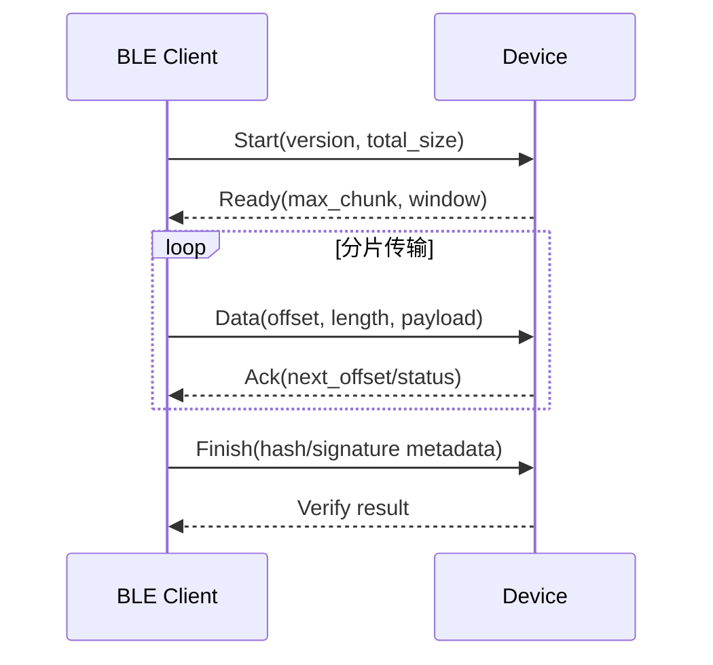

# BLE OTA 传输说明

> 本页只说明通过 BLE (Bluetooth Low Energy) GATT (Generic Attribute Profile) 传输升级数据时的协议设计。镜像、分区、校验、切换和回滚统一参考 [OTA 固件升级架构](../../system/ota/ota.md)。

## 适用范围

BLE OTA (Over-The-Air) 适合由手机或近距离网关向设备发送升级包。它解决的是数据传输问题，不负责决定镜像是否可信或是否可以启动。

当前 SDK 没有独立 BLE OTA 案例工程，因此本页是设计说明，不提供可直接构建的案例步骤。

## GATT 服务设计

建议至少划分以下逻辑通道：

| 通道 | 方向 | 用途 |
| --- | --- | --- |
| Control | Client → Server | 开始、结束、取消、查询状态 |
| Data | Client → Server | 发送带偏移和长度的固件分片 |
| Status | Server → Client | 返回确认、错误码和当前进度 |

Control 和 Data 应使用不同 Characteristic，避免控制消息与大块数据相互混淆。

## 传输流程

## 关键约束

- 分片长度不能超过协商后的 ATT/应用有效载荷。
- 每个分片必须校验偏移和长度，重复包应可识别并幂等处理。
- ACK (Acknowledgment) 窗口需要在吞吐、RAM (Random Access Memory) 占用和失败恢复之间平衡。
- 断开连接后应保留还是取消会话，必须由产品协议明确规定。
- GATT 链路加密只能保护传输过程，镜像仍需独立完整性和真实性校验。

## 验证重点

- 不同 MTU (Maximum Transmission Unit) 下的分片边界。
- 连接中断后的恢复或清理。
- 重复、乱序、越界和错误长度分片。
- 传输完成但镜像校验失败。
- 升级过程中手机退出或设备重启。
