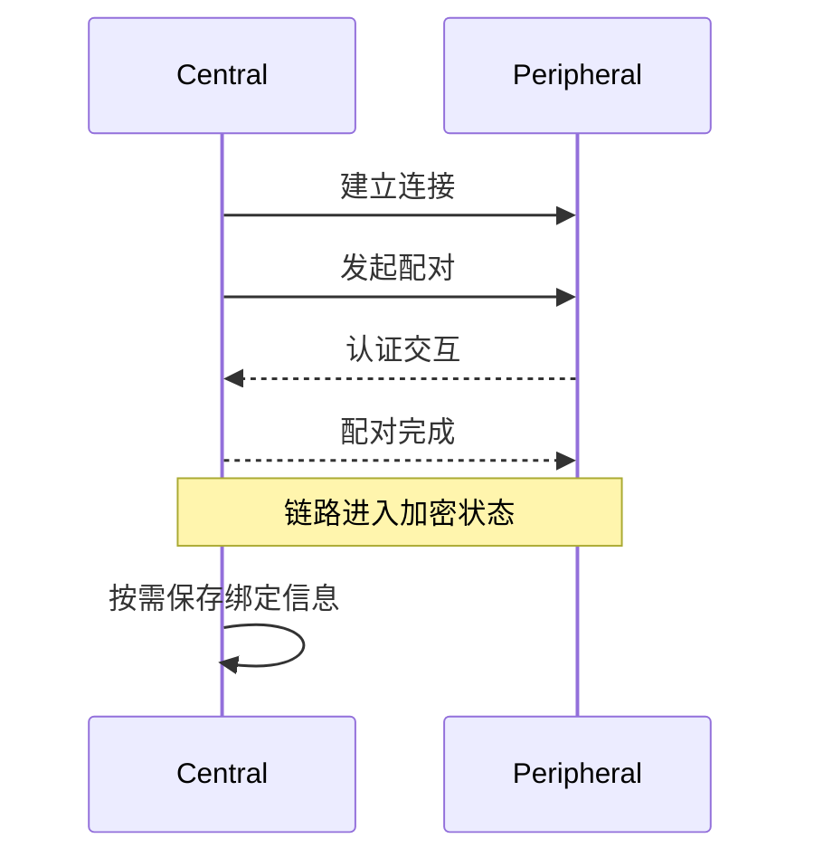

# BLE 配对与绑定

> 说明 BLE (Bluetooth Low Energy) 的 Just Works、Passkey、绑定和重连加密。当前 SDK 没有独立的 Passkey 案例工程，本页作为安全机制说明。

## 配对、加密与绑定

| 概念 | 作用 | 是否跨重启保存 |
| --- | --- | --- |
| 配对 | 协商认证方式并生成密钥 | 不一定 |
| 链路加密 | 使用配对密钥保护当前连接 | 仅当前连接 |
| 绑定 | 保存长期密钥，供后续重连恢复加密 | 是 |

正确顺序是：建立连接 → 发起配对 → 认证完成 → 链路加密 → 按需保存绑定信息。绑定不是另一种配对方式，而是决定密钥是否保留。

## 配对方式选择

| 方式 | 用户交互 | MITM (Man-In-The-Middle) 防护 | 适用设备 |
| --- | --- | --- | --- |
| Just Works | 无 | 不提供 | 无键盘、无显示屏，且物理环境可信 |
| Passkey Entry | 输入或确认 6 位数字 | 提供 | 具备键盘、显示屏或由配套 App 完成交互 |
| OOB (Out of Band) | 通过其他安全通道交换信息 | 取决于 OOB 通道 | 具备 NFC (Near Field Communication) 、二维码等外部通道 |

不能因为 Just Works 操作简单就默认用于所有产品。涉及敏感控制、身份凭据或支付数据时，应结合产品交互能力选择具备 MITM 防护的方式。

## 回调与状态机



应用应分别处理连接状态、配对结果和加密状态，不能把“已连接”当作“已认证”。数据访问权限应在加密状态确认后再开放。

## 重连处理

- 已绑定设备重连后，应等待协议栈恢复加密，再访问受保护属性。
- 密钥不存在、过期或双方记录不一致时，应删除旧绑定并重新配对。
- 删除绑定信息后，下一次连接必须重新执行配对。
- 产品需要同时限制允许绑定的设备数量和替换策略。

## 源码参考

当前 BLE Hello 工程包含 Just Works 配对和绑定相关调用，可作为状态机参考：

```text
src/application/samples/bt/ble/ble_hello/
```

Passkey 的输入、显示和用户确认流程尚无独立案例，因此本页不提供可直接构建的 Passkey 操作步骤。

## 验证清单

- 首次连接能够完成预期配对方式。
- 未完成加密时无法访问受保护属性。
- 已绑定设备重连后可以恢复加密。
- 删除绑定后必须重新配对。
- 认证失败、超时和用户拒绝都有明确状态处理。
