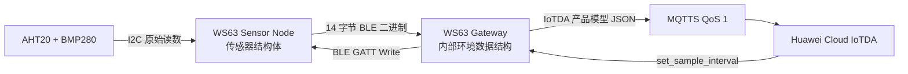
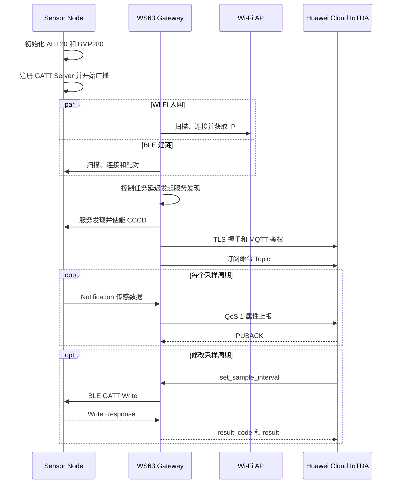
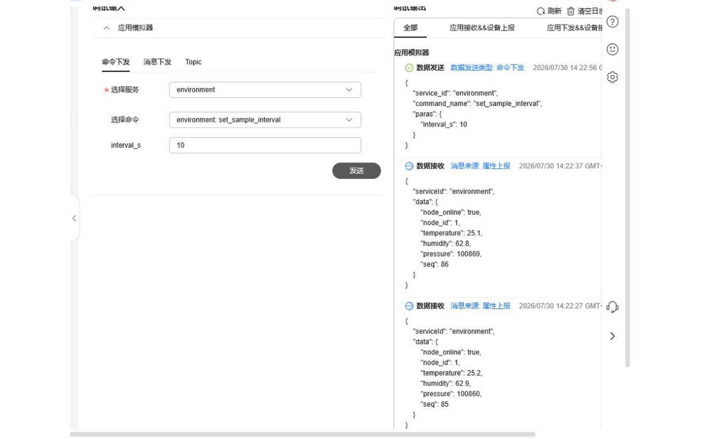

# BLE 环境监测 MQTT 网关

> AHT20 + BMP280 → BLE (Bluetooth Low Energy) 传感节点 → Wi-Fi 网关 → 华为云 IoTDA MQTTS (MQTT over TLS)，支持属性上报与采样周期命令回写

> 前置阅读：必须了解 [Hello Notify](../basics/hello-notify.md) 的连接与通知流程；建议先熟悉 I2C 传感器读取和 Wi-Fi STA 接入。IoTDA 产品模型、设备注册和 MQTT 鉴权属于本文操作阶段的外部准备，相关步骤会在本文重新说明。

仓库中有一个电池供电的环境传感节点，它只能通过 BLE 发送数据，不能直接访问云端。现在增加一块 WS63 作为 Gateway：接收节点采集的温度、湿度和气压，将数据转换后上报华为云 IoTDA，并把云端设置的采样周期回写给节点。本文围绕这条主线逐级完成和验证，而不是要求读者一次理解全部协议。

## 学习目标

- 完成 AHT20、BMP280 共用 I2C (Inter-Integrated Circuit) 总线的数据采集，并能从日志确认数据合理
- 完成 GATT (Generic Attribute Profile) Notification 的订阅、二进制报文校验和接收
- 将 BLE 二进制数据转换为 IoTDA 产品模型 JSON，并通过 MQTT QoS (Quality of Service) 1 持续上报
- 将 IoTDA 同步命令经 MQTT、Gateway 和 BLE 回写节点，并观察采样周期实际改变

## 基本概念

### 为什么 Sensor Node 需要 Gateway

Sensor Node 只负责采集和 BLE 通信，不承担 JSON 拼装、TLS (Transport Layer Security) 或云端鉴权。Gateway 在 BLE 与 IP 网络之间完成协议转换：向下接收紧凑的二进制报文，向上生成 IoTDA 可以识别的 JSON。



### Sensor Node 与 Gateway 如何约定 BLE 数据

Sensor Node 以 `sensor_node` 名称广播，并在 Service Data 中携带 16 位 Service UUID `0x3333`。主动扫描时，广播数据和扫描响应可能由两个回调分别送达，因此 Gateway 在单次回调中匹配到设备名称或 Service UUID 即把它视为候选节点；连接后再通过 GATT 服务发现确认目标服务。Gateway 随后发现数据 Characteristic、Notification Characteristic 和 CCCD (Client Characteristic Configuration Descriptor)，写入 CCCD 后才能接收周期数据。

传感数据采用 14 字节定长小端报文：

| 偏移 | 长度 | 字段 | 类型和单位 |
|:---:|:---:|------|------------|
| 0 | 1 | `version` | `uint8`，当前为 1 |
| 1 | 1 | `node_id` | `uint8`，当前为 1 |
| 2 | 4 | `seq` | `uint32`，递增序号 |
| 6 | 2 | `temperature` | `int16`，0.1 °C |
| 8 | 2 | `humidity` | `uint16`，0.1 %RH |
| 10 | 4 | `pressure` | `uint32`，Pa |

Gateway 解码后检查版本、长度、节点编号、序号和数值范围。序号不大于上一帧时丢弃，避免同一次连接中重复处理旧帧。BLE 重新连接时 Gateway 会清零去重状态，因此 Sensor Node 重启并重新连接后可以从新序号继续上报。

本案例没有让 Sensor Node 直接发送 JSON，原因是 BLE 链路上的定长二进制报文更短，解析时不需要动态内存或字符串转换。温度、湿度乘以 10 后使用整数保存，可以保留一位小数并避免节点端浮点格式化；小端字节序由编码和解码函数显式约定，不依赖编译器的结构体布局。`version` 用于识别报文格式，`seq` 用于发现重复帧和观察数据是否持续更新。

当前协议只接受 `version=1`、`node_id=1`，因此只支持一个配套节点，也没有实现新旧协议版本兼容。扩展多节点时，需要让 Gateway 分别维护每个 `node_id` 的连接、序号和云端映射；升级报文格式时，应新增版本对应的解码分支，而不是直接改变现有字段含义。

### Gateway 如何把数据可靠上报 IoTDA

MQTTS 是在 TLS 安全连接上运行的 MQTT (Message Queuing Telemetry Transport)。本案例使用 QoS 1：每次属性上报都等待 PUBACK，确认 IoTDA 已接收消息。与 QoS 0 相比，QoS 1 多一次确认交互，但更适合环境监测等不能静默丢包的场景。

Gateway 上报属性的 Topic 为：

```text
$oc/devices/{device_id}/sys/properties/report
```

转换后的 JSON 如下，数值仅用于说明格式：

```json
{
  "services": [{
    "service_id": "environment",
    "properties": {
      "node_online": true,
      "node_id": 1,
      "temperature": 24.8,
      "humidity": 58.0,
      "pressure": 100730,
      "seq": 25
    }
  }]
}
```

### 云端采样周期如何回写 Sensor Node

IoTDA 下发 `set_sample_interval` 后，Gateway 提取 `interval_s`，编码为以下 6 字节 BLE 命令：

| 偏移 | 长度 | 字段 | 类型和约束 |
|:---:|:---:|------|------------|
| 0 | 1 | `version` | `uint8`，当前必须为 1 |
| 1 | 1 | `command` | `uint8`，1 表示设置采样周期 |
| 2 | 4 | `interval_s` | `uint32` 小端，合法范围 5～3600 秒 |

Sensor Node 收到写请求后先检查属性句柄和报文长度，再检查版本、命令类型及参数范围。非法长度返回 `GATT_STATUS_INVALID_ATTRIBUTE_VALUE_LENGTH`，非法版本、命令类型或越界值返回 `GATT_STATUS_VALUE_NOT_ALLOWED`；只有校验通过并更新本地采样周期后才返回成功的 GATT Write Response。Gateway 收到成功回调后再向 IoTDA 回复 `result_code=0`，因此本案例中的成功响应表示节点已经接受并执行命令，而不只是 BLE 数据已经发出。

### BLE 与 Wi-Fi 同时工作时如何保持稳定

WS63 上的 BLE 和 Wi-Fi 可以同时工作。正常流程是 Gateway 扫描并连接 Sensor Node，完成服务发现和 CCCD 写入；同时 Wi-Fi 完成关联、DHCP、TLS 和 MQTT 连接。连接建立后，BLE Notification 与 Wi-Fi MQTT 可以并行传输。

启动阶段，BLE 扫描和 Wi-Fi 扫描都会使用 2.4 GHz 射频，Gateway 因此增加了恢复机制：IoTDA 上线后重新拉起 BLE 扫描；节点未连接时约每 5 秒停止扫描、等待 50 ms 后重新开始。配对完成后，由控制任务等待约 500 ms 再发起 GATT 服务发现，发现请求超过约 3 秒未返回时重试。这些数值是本案例为处理启动竞态选择的稳定性参数，不是使用 BLE Client 的固定步骤。

连续发现失败后，当前代码会使用配套 Sensor Node 固定注册顺序对应的句柄作为降级路径。GATT 句柄是实现细节，该路径只适用于本案例的两份配套固件，不能用于第三方 BLE 节点；正常运行仍必须优先验证动态服务发现成功。

## 涉及 API

这些 API 按案例的四个阶段排列。表中重点说明“前置状态”和“为什么在这里调用”；详细参数和返回值请查阅对应 API Reference。

| 阶段 | 前置状态 | 核心 API | 谁调用 | 本阶段解决的问题 |
|------|----------|----------|--------|------------------|
| 采集环境数据 | Sensor Node 已启动 | `uapi_i2c_master_init()`、`uapi_i2c_master_write()`、`uapi_i2c_master_writeread()` | Sensor Node 初始化/上报任务 | 初始化 I2C1，配置并读取 AHT20、BMP280 |
| BLE 发送 | GATT Server 已注册 | `gatts_register_server()`、`gatts_add_service_sync()`、`gatts_add_characteristic_sync()`、`gatts_add_descriptor_sync()`、`gatts_notify_indicate()` | Sensor Node 初始化/上报任务 | 注册服务并把 14 字节报文推送给 Gateway |
| BLE 接收 | Gateway 已发现目标广播 | `gap_ble_set_scan_parameters()`、`gap_ble_connect_remote_device()`、`gattc_discovery_service()`、`gattc_discovery_character()`、`gattc_write_req()` | Gateway BLE 回调/控制任务 | 扫描连接、发现服务、订阅通知并回写命令 |
| 网络接入 | Gateway 角色已配置网络参数 | `wifi_sta_enable()`、`wifi_sta_scan()`、`wifi_sta_connect()`、`netifapi_dhcp_start()` | Gateway Wi-Fi/IoTDA 网络任务 | 连接 2.4 GHz AP 并取得 IP 地址 |
| 云端上报 | DHCP 已完成 | `MQTTClient_connect()`、`MQTTClient_subscribe()`、`MQTTClient_publishMessage()`、`MQTTClient_waitForCompletion()` | Gateway Wi-Fi/IoTDA 网络任务 | 建立 MQTTS、订阅命令、发布属性并等待 PUBACK |

## 案例说明

### 场景中的两个设备角色

本案例使用两块 WS63 开发板实现真实的 BLE 环境监测网关。`<sensor_node_port>` 对应 Sensor Node，采集 AHT20 温湿度和 BMP280 气压；`<gateway_port>` 对应 Gateway，通过 BLE 接收数据，经 Wi-Fi 和 MQTTS 上报华为云 IoTDA，并支持云端修改采样周期。串口名称以操作系统实际枚举结果为准，本次实测映射如下：

| 角色 | 文档占位符 | 本次实测端口 |
|------|------------|--------------|
| Sensor Node | `<sensor_node_port>` | COM6 |
| Gateway | `<gateway_port>` | COM8 |

传感器驱动、BLE 双角色、Wi-Fi 状态机和 IoTDA 适配均位于 `application/samples/bt/ble/ble_gateway`。其他 sample 不参与本案例链接，也不需要修改。

### 功能规格

| 规格项 | 说明 |
|--------|------|
| 开发板角色 | 两块 WS63：Sensor Node + Gateway |
| 传感器 | AHT20 温湿度、BMP280 气压 |
| I2C 总线 | I2C1，SDA GPIO15，SCL GPIO16，100 kHz |
| BLE 设备名称 | `sensor_node` |
| BLE Service UUID | `0x3333` |
| 传感报文 | 14 字节定长小端二进制 |
| 采样周期 | 默认 10 秒，可配置范围 5～3600 秒 |
| Wi-Fi | 2.4 GHz STA |
| BLE/Wi-Fi 共存 | 扫描阶段协调时序，连接后并行通信 |
| 云端协议 | TLS 1.2 + MQTT QoS 1 |
| IoTDA 服务 | `environment` |
| 云端命令 | `set_sample_interval`，参数 `interval_s` |

### 端到端交互流程



## 案例操作指导

### 第一步：硬件接线

准备两块 WS63 开发板、一只 AHT20 模块、一只 BMP280 模块和一个支持 2.4 GHz 的 Wi-Fi 接入点。传感器只连接到 `<sensor_node_port>` 对应的 Sensor Node。

| 传感器信号 | WS63 Sensor Node |
|-----------|------------------|
| VCC | 3.3V |
| GND | GND |
| SDA | GPIO15 |
| SCL | GPIO16 |

AHT20 和 BMP280 共用 SDA、SCL。AHT20 地址为 `0x38`，BMP280 支持 `0x76` 或 `0x77`。模块与开发板必须共地；如果模块没有自带上拉电阻，需要给 SDA、SCL 增加合适的上拉。

### 第二步：配置 IoTDA

在目标 IoTDA 实例中创建 MQTT + JSON 产品，建议产品名称为 `HiSpark_BLE_MQTT_Gateway`。创建 `environment` 服务并添加以下属性：

| 属性 | 数据类型 | 范围 | 单位 |
|------|----------|------|------|
| `node_online` | bool | `true` / `false` | 无 |
| `node_id` | int | 0～255 | 无 |
| `temperature` | decimal | -40～85 | °C |
| `humidity` | decimal | 0～100 | %RH |
| `pressure` | int | 30000～110000 | Pa |
| `seq` | int | 0～2147483647 | 无 |

再添加命令 `set_sample_interval`，下发参数 `interval_s` 为 int 类型，范围为 5～3600；响应参数 `result` 为 string 类型。

在该产品下注册密钥鉴权设备，私下保存 MQTT 接入域名、Device ID 和 Device Secret。Device Secret 只显示一次时，应先保存到本地私密位置再关闭页面。

完成设备接入后，进入“监控运维 > 在线调试”，选择 Gateway 设备、`environment` 服务和 `set_sample_interval` 命令。下图已经永久裁除账号、实例、资源空间和完整设备标识等信息。



### 第三步：配置两个角色

在工程配置中打开 `ws63-liteos-app` 的 Kconfig UI。所有角色和参数都在界面中选择或填写，不要直接编辑目标配置文件，也不要使用命令修改 Kconfig 选项。

在 Kconfig UI 中按以下路径进入 BLE 单选菜单：

```text
Application
  → Enable Sample.
    → Enable the Sample of BT.
      → Sample
        → Support BLE Sample.
          → BLE Sample
```

构建 Sensor Node 时，在 `BLE Sample` 中选择：

```text
Support BLE Gateway Sensor Node Sample
```

构建 Gateway 时，在同一个 `BLE Sample` 单选菜单中改选：

```text
Support BLE Gateway Central Sample
```

选择 Gateway 后，进入新出现的 `BLE MQTT Gateway Configuration` 菜单，通过 UI 填写：

| Kconfig UI 选项 | 填写内容 |
|-----------------|----------|
| `Gateway Wi-Fi SSID` | 本地 2.4 GHz Wi-Fi 名称 |
| `Gateway Wi-Fi password` | 本地 Wi-Fi 密码 |
| `IoTDA MQTTS host` | IoTDA 实例提供的设备接入域名 |
| `IoTDA MQTTS port` | `8883` |
| `IoTDA device ID` | IoTDA Gateway 设备 ID |
| `IoTDA device secret` | IoTDA Gateway 设备密钥 |
| `IoTDA no-timestamp-check authentication timestamp` | `2020010100` |
| `IoTDA product model service ID` | `environment` |

配置完成后按 `S` 保存并退出 Kconfig UI。真实 SSID、密码、Device ID 和 Device Secret 只能保存在本地配置中，不要写进源码、文档或截图。

### 第四步：编译

先在 Kconfig UI 中选择 Sensor Node 角色、保存配置，然后构建：

```bash
fbb build --clean ws63-liteos-app
```

默认完整固件包生成在：

```text
src/output/ws63/fwpkg/ws63-liteos-app/ws63-liteos-app_all.fwpkg
```

两个角色使用同一个输出文件名，第二次构建会覆盖第一次产物。因此 Sensor Node 构建成功后，先在 SDK 根目录执行以下 PowerShell 命令创建快照：

```powershell
New-Item -ItemType Directory -Force .\firmware-snapshots
Copy-Item .\src\output\ws63\fwpkg\ws63-liteos-app\ws63-liteos-app_all.fwpkg `
    .\firmware-snapshots\ble-gateway-sensor-node.fwpkg
```

重新打开 Kconfig UI，将 `BLE Sample` 切换为 Gateway 角色，在 `BLE MQTT Gateway Configuration` 中填写本地私密参数，按 `S` 保存后再次构建：

```bash
fbb build --clean ws63-liteos-app
```

Gateway 构建成功后再保存第二份快照：

```powershell
Copy-Item .\src\output\ws63\fwpkg\ws63-liteos-app\ws63-liteos-app_all.fwpkg `
    .\firmware-snapshots\ble-gateway.fwpkg
```

文件名中的角色用于防止烧错固件；保存后还应比较两个文件的修改时间，确认它们分别来自两次构建。`firmware-snapshots` 可能包含本地私密配置，不应提交到代码仓库。

角色切换后，应检查 `mconfig.h` 和 `build.ninja`：Sensor Node 只包含 `ble_gateway_server`，Gateway 只包含 `ble_gateway_client`，不能出现其他 sample 的业务源码。

> 更多编译选项请参考 [构建操作](../../../../overall-architecture/build-output/index.md#构建操作)。

### 第五步：烧录

使用两个角色各自保存的固件包烧录：

```bash
fbb flash -f firmware-snapshots/ble-gateway-sensor-node.fwpkg --chip ws63 --port <sensor_node_port> --baud 2000000
fbb flash -f firmware-snapshots/ble-gateway.fwpkg --chip ws63 --port <gateway_port> --baud 2000000
```

先启动 `<sensor_node_port>` 对应的 Sensor Node，再启动 `<gateway_port>` 对应的 Gateway。本次实测时可分别将占位符替换为 COM6 和 COM8，但其他环境应以实际枚举结果为准。

> 更多烧录选项请参考 [构建操作](../../../../overall-architecture/build-output/index.md#构建操作)。

### 第六步：验证

不要等全部链路运行后只看最终结果。按照下面四个关卡逐级验收；前一关没有通过时，先解决当前层的问题，再检查下一层。

#### 关卡一：Sensor Node 完成环境数据采集

- 输入：AHT20、BMP280 已正确接线，Sensor Node 固件已启动。
- 输出：两个传感器初始化成功，并连续生成数值合理、序号递增的数据。
- 成功日志：

```text
[aht20+bmp280] AHT20 ready
[aht20+bmp280] BMP280 ready
[ble environment node] sample ready: node=1 seq=1 ...
[ble environment node] sample ready: node=1 seq=2 ...
```

如果本关失败，只检查供电、共地、GPIO15/GPIO16、I2C 上拉和 BMP280 地址，不需要先排查 BLE 或云端。

#### 关卡二：Gateway 通过 BLE 收到数据

- 输入：Sensor Node 正在广播并持续采样，Gateway 固件已启动。
- 输出：Gateway 完成连接、动态服务发现和 CCCD 写入，随后收到递增序号。
- 成功日志：

```text
[ble mqtt gateway] found environment sensor node, connecting
[ble mqtt gateway] sensor report CCCD write success
[ble mqtt gateway] BLE report queued: node=1 seq=...
```

本关重点是看到动态服务发现和 CCCD 写入成功。固定句柄降级只用于配套固件的异常恢复，不能作为接入其他 BLE 节点时的验收标准。

#### 关卡三：Gateway 持续上报 IoTDA

- 输入：BLE 数据已经入队，本地 AP 可用，Gateway 的 IoTDA 参数已通过 Kconfig UI 配置。
- 输出：Wi-Fi 关联、DHCP、TLS 和 MQTT 依次上线；IoTDA 属性持续刷新。
- 成功日志：

```text
[ble mqtt gateway] IoTDA MQTTS online, QoS 1
[ble mqtt gateway] property report sent: node=1 seq=...
```

连续上报不能只检查第一条消息。保持两块开发板不复位，至少观察两个不同的递增序号，并确认每条 QoS 1 PUBLISH 都收到 PUBACK。IoTDA 消息跟踪还应显示“平台收到设备的属性上报”和“设备影子刷新成功”，设备影子显示 `node_online=true` 以及最新温度、湿度、气压和序号。本次实板验证先后得到：

```text
[ble mqtt gateway] property report sent: node=1 seq=3
[ble mqtt gateway] property report sent: node=1 seq=5
```

两条消息分别收到 IoTDA 返回的 PUBACK，证明 BLE Notification、Wi-Fi、MQTT 与云端确认链路可以持续并行工作，而不是只在重启后上报一次。

#### 关卡四：云端命令真正改变采样周期

- 输入：Gateway 和 Sensor Node 保持在线，在 IoTDA 在线调试中下发 `set_sample_interval`，例如将 `interval_s` 设置为 20。
- 输出：IoTDA 收到 `result_code=0`、`result=success`，Sensor Node 打印采样周期更新日志，后续数据间隔从原来的 10 秒变为约 20 秒。
- 成功日志：

```text
[ble environment node] sampling interval updated: 20 s
```

只看到 IoTDA 返回成功还不算完成业务闭环；还必须观察 Sensor Node 后续至少两次采样的间隔确实改变。测试结束后可以再次下发 `interval_s=10` 恢复默认周期。

## 关键配置

| 配置项 | 推荐值 | 可调范围 | 调整影响 |
|--------|--------|----------|----------|
| `CONFIG_SAMPLE_SUPPORT_BLE_GATEWAY_SERVER_SAMPLE` | Sensor Node 为 `y` | `y` / `n` | 与 Client 角色互斥，一次构建只能选择一个角色 |
| `CONFIG_SAMPLE_SUPPORT_BLE_GATEWAY_CLIENT_SAMPLE` | Gateway 为 `y` | `y` / `n` | 使能 BLE Client、Wi-Fi 和 IoTDA 任务 |
| `CONFIG_GATEWAY_WIFI_SSID` | 本地 2.4 GHz AP | 字符串 | 必须与实际 AP 完全一致，不应提交真实值 |
| `CONFIG_GATEWAY_WIFI_PASSWORD` | 本地 AP 密码 | 字符串 | 错误时会持续鉴权失败，不应提交真实值 |
| `CONFIG_IOTDA_MQTT_PORT` | 8883 | 1～65535 | 8883 用于 MQTTS，不建议改为明文 MQTT 端口 |
| `CONFIG_IOTDA_SERVICE_ID` | `environment` | 字符串 | 必须与 IoTDA 产品模型 Service ID 完全一致 |
| `CONFIG_IOTDA_AUTH_TIMESTAMP` | `2020010100` | 10 位 UTC 字符串 | 用于 IoTDA 不校验时间戳的设备鉴权格式 |
| 采样周期 | 10 秒 | 5～3600 秒 | 调小可提高实时性，但增加 BLE、Wi-Fi 和云端消息开销 |
| BLE 扫描恢复周期 | 约 5 秒 | 修改控制任务计数 | 调小能更快发现晚启动节点，但增加扫描和共存开销 |
| GATT 发现延迟 | 约 500 ms | 修改控制任务计数 | 调小可能与配对回调竞态，调大会延长首次数据时间 |

## 代码详解

### 代码目录与任务调用关系

```text
src/application/samples/bt/ble/ble_gateway/
├── ble_gateway.c                         # 统一入口，根据 Kconfig 选择角色
├── inc/
│   └── ble_gateway_protocol.h            # 共享二进制协议与校验
├── ble_gateway_server/
│   ├── inc/
│   │   ├── ble_gateway_server.h
│   │   └── ble_gateway_sensor.h
│   └── src/
│       ├── ble_gateway_server.c           # GATT Server 与上报循环
│       ├── ble_gateway_server_adv.c       # sensor_node 广播
│       └── ble_gateway_sensor.c           # AHT20 + BMP280 驱动
└── ble_gateway_client/
    ├── inc/
    │   ├── ble_gateway_client.h
    │   ├── ble_gateway_wifi.h
    │   └── ble_gateway_iotda.h
    └── src/
        ├── ble_gateway_client.c           # 扫描、连接、发现与命令回写
        ├── ble_gateway_wifi.c             # Wi-Fi STA 状态机
        ├── ble_gateway_iotda.c            # MQTTS、JSON 与命令响应
        └── ble_gateway_iotda_ca.c         # IoTDA CA 证书
```

核心函数按照下面的调用关系运行。Gateway 没有单独创建 MQTT 任务，`ble_gateway_iotda_run()` 运行在 Wi-Fi/IoTDA 网络任务中：

```text
ble_gateway_task
├── Sensor Node
│   ├── ble_gateway_server_init
│   └── ble_gateway_server_report_loop        上报任务上下文，允许等待采样周期
└── Gateway
    └── ble_gateway_client_init
        ├── ble_gateway_control_task          BLE 控制任务，处理发现延迟和重试
        ├── gateway_wifi_task                 Wi-Fi/IoTDA 网络任务，允许网络阻塞
        │   └── ble_gateway_iotda_run         MQTT 连接、订阅、上报和命令处理
        └── GAP/GATT callbacks                协议栈回调，只做短时状态更新和入队
```

BLE 回调的输入来自扫描、连接、服务发现、Notification 或 Write Response 事件，输出交给控制任务或桥接状态，不能在其中等待 TLS、MQTT 或长时间休眠。Sensor Node 上报任务和 Gateway 网络任务属于普通任务上下文，可以执行传感器等待或网络阻塞操作。

### 通过 Kconfig 选择单一设备角色

统一入口只编译并启动一个角色，避免 Server 与 Client 同时进入同一固件：

```c
static int ble_gateway_task(const char *arg)
{
    (void)arg;
#if defined(CONFIG_SAMPLE_SUPPORT_BLE_GATEWAY_SERVER_SAMPLE)
    errcode_t ret = ble_gateway_server_init();
    if (ret == ERRCODE_SUCC) {
        ble_gateway_server_report_loop();
    }
    return (int)ret;
#elif defined(CONFIG_SAMPLE_SUPPORT_BLE_GATEWAY_CLIENT_SAMPLE)
    return (int)ble_gateway_client_init();
#else
    return 0;
#endif
}
```

角色由 Kconfig choice 和 CMake 源码清单共同约束。构建双板案例时，应分别保存两个固件包，不能在同一个输出文件上反复覆盖后再烧录。

### 阶段一：Sensor Node 采集并生成 BLE 报文

`ble_gateway_server_report_loop()` 在传感器初始化失败时持续重试，读取失败时保留 BLE 服务并等待下一周期，不会因一次 I2C 错误退出任务：

```c
if (!sensor_ready) {
    errcode_t init_ret = ble_gateway_sensor_init();
    if (init_ret != ERRCODE_SUCC) {
        osal_msleep(BLE_GATEWAY_MS_PER_SECOND);
        continue;
    }
    sensor_ready = true;
}

if (ble_gateway_sensor_read(&sensor_data) != ERRCODE_SUCC) {
    osal_msleep(g_report_interval_ms);
    continue;
}

g_report_sequence++;
if (g_report_sequence == 0U) {
    g_report_sequence = 1U;
}
report.sequence = g_report_sequence;
report.temperature_tenths_celsius =
    (int16_t)sensor_data.temperature_tenths_celsius;
report.humidity_tenths_percent =
    (uint16_t)sensor_data.humidity_tenths_percent;
report.pressure_pa = sensor_data.pressure_pa;
ble_gateway_encode_report(g_latest_report, &report);

if (g_hello_notify_enabled) {
    (void)ble_gateway_server_send_notification(
        g_latest_report, sizeof(g_latest_report));
}
```

温度和湿度保留一位小数后再编码，避免节点使用浮点 JSON 格式化。只有 Gateway 已写入 CCCD 时才发送 Notification。

### 阶段二：Gateway 接收并校验 BLE 报文

Notification 回调只做定长解码、范围校验、序号去重和入队，不在 BLE 回调中执行 TLS 或 MQTT 阻塞操作：

```c
if (!ble_gateway_decode_report(data->data, data->data_len, &report)) {
    return;
}

if (g_last_sequence != 0U && report.sequence <= g_last_sequence) {
    return;
}

g_last_sequence = report.sequence;
ble_gateway_iotda_enqueue_report(&report);
```

这种设计缩短了 BLE 回调执行时间。Wi-Fi/IoTDA 网络任务从受互斥锁保护的桥接状态中取出最新数据；网络暂时不可用时，保留最新一帧而不是无限堆积旧数据。

这里的直接大小比较只用于当前案例的一次 BLE 连接。连接或断开时，Gateway 会把 `g_last_sequence` 清零，因此节点重启并重新连接后不会把新序号误判成旧帧；但代码没有处理同一次连接中 32 位序号从最大值回到 1 的情况。即使按最短 5 秒周期也需要约 681 年才会发生回绕，本案例将其作为已知限制，不把这段代码视为通用的序号新旧比较算法。

### 阶段三：生成 IoTDA JSON 并等待 QoS 1 确认

Gateway 在 Wi-Fi/IoTDA 网络任务中生成与产品模型一致的 JSON，然后等待 QoS 1 完成：

```c
message.payload = (void *)payload;
message.payloadlen = (int)strlen(payload);
message.qos = IOTDA_QOS;
message.retained = 0;

ret = MQTTClient_publishMessage(client, topic, &message, &token);
if (ret == MQTTCLIENT_SUCCESS) {
    ret = MQTTClient_waitForCompletion(client, token, IOTDA_TIMEOUT_MS);
}
```

`MQTTClient_waitForCompletion()` 成功返回表示该 QoS 1 消息已经收到 PUBACK。若发送失败，桥接层把数据恢复到待发送状态，等待下一次连接重试。

### 阶段四：将云端命令回写 Sensor Node

Gateway 先检查 BLE 连接、Characteristic handle 和参数范围，再写入 6 字节命令：

```c
if (!g_connected || g_data_handle == 0U || g_command_write_pending ||
    interval_s < BLE_GATEWAY_MIN_INTERVAL_S ||
    interval_s > BLE_GATEWAY_MAX_INTERVAL_S) {
    return ERRCODE_FAIL;
}

ble_gateway_encode_interval_command(g_command_value, interval_s);
write_value.handle = g_data_handle;
write_value.data = g_command_value;
write_value.data_len = sizeof(g_command_value);
g_command_write_pending = true;
ret = gattc_write_req(g_client_id, g_conn_id, &write_value);
if (ret != ERRCODE_BT_SUCCESS) {
    g_command_write_pending = false;
}
return ret;
```

GATT Write 回调收到成功状态后，Gateway 才向 IoTDA 回复 `result_code=0`。如果 BLE 节点离线、参数越界或写入失败，则返回失败，避免云端误认为配置已经生效。

### IoTDA TLS 兼容配置

IoTDA 的 TLS 1.2 接入要求客户端提供平台支持的 ECDHE-RSA 密码套件。本案例仅在自身 CMake 目标中启用以下套件，并使用软件 ECP (Elliptic Curve Processing) 完成密钥交换：

```text
TLS-ECDHE-RSA-WITH-AES-128-GCM-SHA256
TLS-ECDHE-RSA-WITH-AES-256-GCM-SHA384
```

该配置不修改其他 sample，也不修改 SDK 的全局 Mbed TLS 配置。

## 常见问题

- Gateway 一直扫描：确认 Sensor Node 已启动并输出 `advertising started: sensor_node`。
- Wi-Fi 已在线但找不到 BLE 节点：BLE 与 Wi-Fi 可以同时通信，但启动阶段的 Wi-Fi 扫描可能暂停 BLE 扫描。等待约 5 秒让 Gateway 自动重启 BLE 扫描，不需要关闭 Wi-Fi。
- 日志停在 `discover service 0x3333`：Gateway 会在约 3 秒后自动重试。当前固定句柄降级只适用于本案例两份配套固件，不属于通用 GATT Client 流程；接入其他 BLE 节点时必须依赖动态发现并检查其真实服务定义。
- 重启后只看到一次属性：保持设备不复位，确认至少出现两个不同递增 `seq` 的 `property report sent`，并检查每次 PUBLISH 后都有 PUBACK。
- AHT20 或 BMP280 初始化失败：检查 3.3V、共地、GPIO15/GPIO16、I2C 上拉以及 BMP280 地址。
- Wi-Fi 一直重连：确认 AP 支持 2.4 GHz，并检查本地 Kconfig 中的 SSID 和密码。
- MQTTS 鉴权失败：确认接入域名、Device ID、Device Secret 和设备属于同一个 IoTDA 实例。
- 设备在线但没有属性：检查 Kconfig UI 中的 `IoTDA product model service ID` 和产品模型属性名是否完全一致。
- 命令返回失败：确认 `interval_s` 在 5～3600 且 `node_online=true`。
- 两块板曾经配对但无法重连：保持 Sensor Node 运行，将 Gateway 断电 5 秒后重新上电；Gateway 会清除失效配对并重新扫描。

## 安全说明

- Wi-Fi、IoTDA 设备信息和 Device Secret 只能通过本案例专属 Kconfig 在本地配置。
- TLS 必须校验 IoTDA 服务端证书，不要关闭证书验证。
- 含真实配置的 `.config`、`.config.old`、构建缓存和固件包都是敏感制品，不应提交或公开分发。
- 控制台原始截图不得进入文档仓库，只能使用已经永久裁剪或遮盖的副本。
- 最终公开代码和文档只保留空默认值或无秘密占位值。

## 参考资料

- [设备使用 MQTT 接入 IoTDA 的鉴权参数](https://support.huaweicloud.com/api-iothub/iot_06_v5_3009.html)
- [设备上报属性](https://support.huaweicloud.com/api-iothub/iot_06_v5_3010.html)
- [平台下发设备命令](https://support.huaweicloud.com/intl/zh-cn/api-iothub/iot_06_v5_3014.html)
- [IoTDA TLS 接入说明](https://support.huaweicloud.com/devg-iothub/iot_02_0202.html)

---
