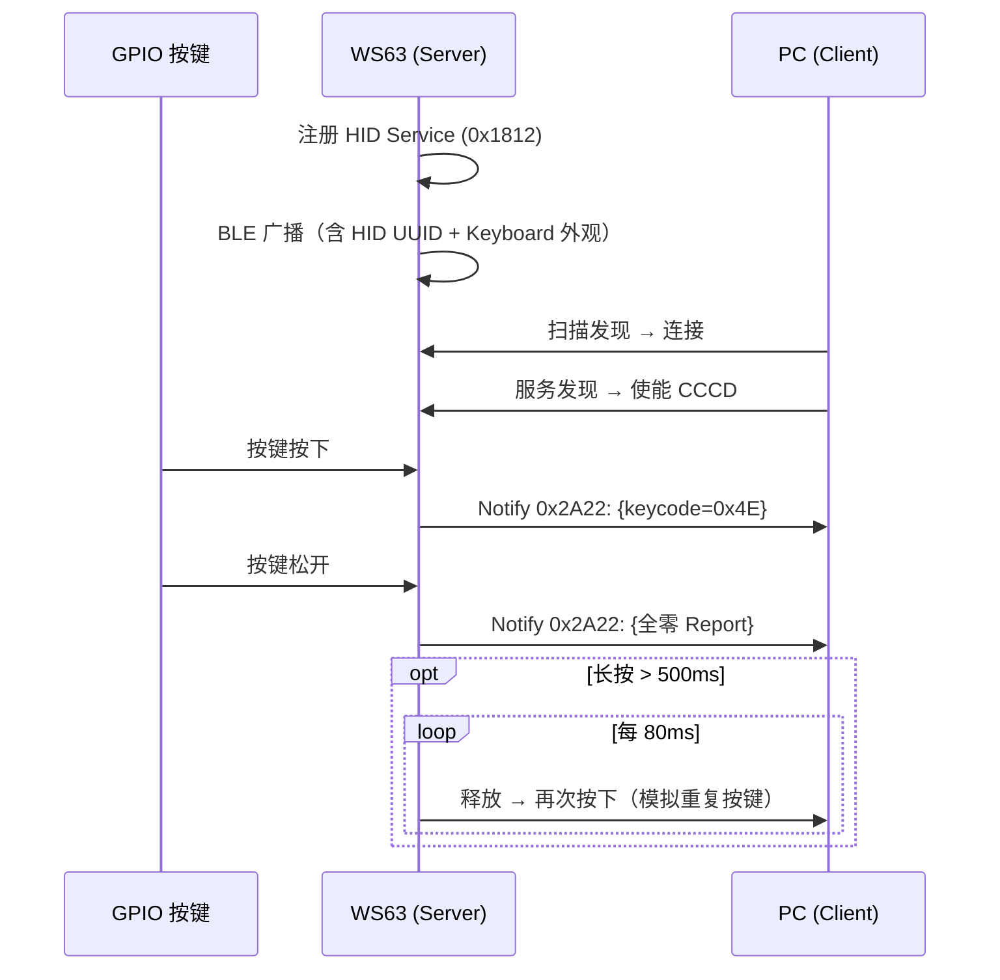
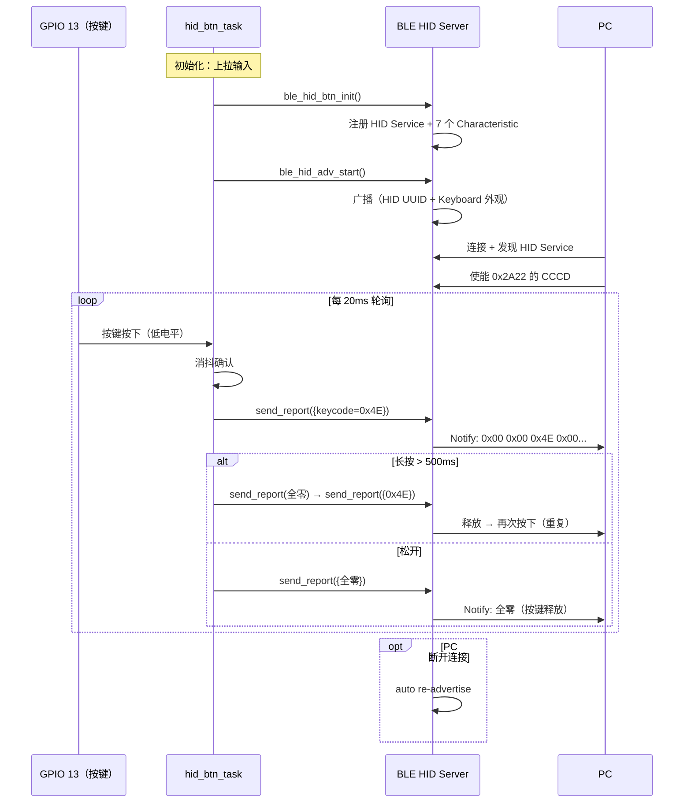

# HID

> GPIO (General Purpose Input/Output) 按键 → BLE (Bluetooth Low Energy) 键盘 — HID (Human Interface Device) over GATT (Generic Attribute Profile) Boot 模式

> 前置阅读：[Hello Notify](../basics/hello-notify.md)

## 学习目标

- 理解 BLE HID over GATT（的工作原理——HID Service（0x1812）的标准 Characteristic 布局
- 掌握 Boot Keyboard Input Report 的 8 字节格式——Modifier + Reserved + 6 个按键码
- 掌握 GPIO 按键消抖、长按自动重复的实现
- 能够在 WS63 上实现一个 GPIO 按键驱动的 BLE 键盘

## 基本概念

### HID over GATT

BLE 上的 HID 通过 GATT 协议承载。设备作为 GATT Server，注册标准 HID Service (UUID (Universally Unique Identifier) 0x1812)，PC / 手机作为 Client 发现服务后，通过 Notify 接收按键 Report。



### HID Service 结构（0x1812）

本案例按 HID over GATT Profile v1.0 §3.3 注册了完整的 7 个 Characteristic：

| Characteristic | UUID | Property | 说明 |
|:---|:---|:---|------|
| Protocol Mode | 0x2A4E | Read + Write No Rsp | 0 = Boot 模式，1 = Report 模式（本案例固定 Boot） |
| Report Map | 0x2A4B | Read | 63 字节 USB (Universal Serial Bus) HID 键盘描述符，告诉主机按键布局 |
| **Boot Keyboard Input** | **0x2A22** | **Read + Notify** | **8 字节按键 Report，带 CCCD (Client Characteristic Configuration Descriptor)** |
| Boot Keyboard Output | 0x2A32 | Read + Write + Write No Rsp | PC → 设备：控制键盘 LED（CapsLock / NumLock 等） |
| HID Information | 0x2A4A | Read | HID 版本 1.11 + 国家码 0 + RemoteWake + NormallyConnectable |
| HID Control Point | 0x2A4C | Write No Rsp | PC → 设备：挂起 / 唤醒 |

其中 **Boot Keyboard Input（0x2A22）** 是核心——按键数据通过它 Notify 到 PC。

### Boot Keyboard Input Report 格式

8 字节固定长度，定义在 `hid_kb_report_t` 结构体：

| 字节 | 含义 |
|:---:|------|
| Byte 0 | Modifier 修饰键位掩码（Ctrl / Shift / Alt / GUI (Graphical User Interface)） |
| Byte 1 | Reserved，固定 0x00 |
| Byte 2～7 | 按键码（USB HID Usage ID），最多同时 6 键 |

例如，按下 Page Down（USB HID Usage ID = 0x4E）：

```text
[0x00, 0x00, 0x4E, 0x00, 0x00, 0x00, 0x00, 0x00]
  ↑      ↑      ↑      └── 其余 4 键为 0
  |      |    Page Down
  |   Reserved
 无修饰键
```

松开按键时发送全零 Report 表示所有键已释放。

### BLE 广播数据

广播包包含三组 AD (Advertising Data) 数据，让 PC 在扫描时就能识别这是一台 BLE 键盘：

| AD 数据 | 内容 |
|---------|------|
| Flags（0x01） | 0x06 = LE General Discoverable + BR/EDR Not Supported |
| Complete 16-bit Service UUIDs（0x03） | 0x1812（HID） |
| Appearance（0x19） | 0x03C1 (Keyboard) |

Scan Response 包含设备名称（`CONFIG_BLE_HID_DEVICE_NAME`，默认 `"ble_hid_btn"`）。

## 涉及 API

| API | 谁调用 | 用途 | 头文件 |
|-----|--------|------|--------|
| `gatts_register_server()` | 初始化 | 注册 GATT Server | `bts_gatt_server.h` |
| `gatts_add_service_sync()` | 初始化 | 添加 HID Service（0x1812） | `bts_gatt_server.h` |
| `gatts_add_characteristic_sync()` | 初始化 | 添加各 Characteristic | `bts_gatt_server.h` |
| `gatts_add_descriptor_sync()` | 初始化 | 添加 CCCD | `bts_gatt_server.h` |
| `gatts_start_service()` | 初始化 | 启动 Service | `bts_gatt_server.h` |
| `gatts_notify_indicate()` | 任务 | 发送按键 Report（Notify 到 PC） | `bts_gatt_server.h` |
| `gap_ble_set_adv_data()` | 初始化 | 设置广播数据（HID UUID + Keyboard 外观） | `bts_le_gap.h` |
| `gap_ble_set_adv_param()` | 初始化 | 设置广播参数（间隔、通道） | `bts_le_gap.h` |
| `gap_ble_start_adv()` | 初始化 | 开始广播 | `bts_le_gap.h` |
| `gap_ble_set_local_name()` | 初始化 | 设置设备名称 | `bts_le_gap.h` |
| `gap_ble_register_callbacks()` | 初始化 | 注册 BLE 事件回调 | `bts_le_gap.h` |
| `enable_ble()` | 初始化 | 使能 BLE 协议栈 | `bts_le_gap.h` |
| `uapi_gpio_get_val()` | 按键任务 | 读取按键 GPIO 电平 | `gpio.h` |
| `osal_msleep()` | 按键任务 | 轮询间隔 | `soc_osal.h` |

## 案例说明

### 案例简介

将 WS63 模拟为一个 BLE 键盘，通过一个 GPIO 按键触发单个 HID 按键码。支持长按自动重复。适用于翻页笔、拍照遥控器、PPT 控制器等单键场景。

### 功能规格

| 规格项 | 说明 |
|--------|------|
| Service UUID | 0x1812（HID） |
| Report 模式 | Boot Keyboard（Protocol Mode = 0） |
| Report 格式 | 8 字节：Modifier(1B) + Reserved(1B) + Keycodes(6B) |
| 按键引脚 | `CONFIG_BLE_HID_BTN_PIN`（默认 GPIO 13），低电平有效 |
| 默认按键码 | 0x4E（Page Down） |
| 轮询率 | 50Hz（20ms 间隔） |
| 消抖 | 连续 2 次相同读数才确认状态变化 |
| 长按重复 | 按下 > 500ms 后以 80ms 间隔连续发送按键码 |
| 广播间隔 | 20～30ms |
| 设备名称 | `"ble_hid_btn"`（Kconfig 可配） |

### 案例流程



## 案例操作指导

### 第一步：编译

确保 .config 中包含：
```bash
CONFIG_SAMPLE_SUPPORT_BLE_HID_BTN=y
CONFIG_BLE_HID_BTN_PIN=13
CONFIG_BLE_HID_BTN_KEYCODE=78
CONFIG_BLE_HID_BTN_LONGPRESS=y
CONFIG_BLE_HID_DEVICE_NAME="ble_hid_btn"
```

```bash
fbb build ws63-liteos-app
```

> 更多编译选项请参考 [构建操作](../../../../overall-architecture/build-output/index.md#构建操作)。

### 第二步：硬件接线

按键一端接 `CONFIG_BLE_HID_BTN_PIN`（默认 GPIO 13），另一端接 GND。芯片内部已使能上拉，无需外接上拉电阻。


### 第三步：烧录

```bash
fbb flash ws63-liteos-app
```

> 更多烧录选项请参考 [构建操作](../../../../overall-architecture/build-output/index.md#构建操作)。

### 第四步：验证

1. 上电，WS63 开始 BLE 广播
2. PC 打开蓝牙设置，搜索设备，找到 `"ble_hid_btn"`
3. 连接配对
4. 打开文本编辑器或浏览器
5. 按下 GPIO 13 按键 → 页面执行 Page Down（0x4E）
6. 长按 > 0.5 秒 → 连续翻页
7. 松开 → 停止

## 关键配置

| 配置项 | 默认值 | 说明 |
|--------|--------|------|
| `CONFIG_BLE_HID_BTN_PIN` | 13 | 按键 GPIO 引脚，低电平有效，按键接 GND |
| `CONFIG_BLE_HID_BTN_KEYCODE` | 78（0x4E = Page Down） | HID 按键码。常用：0x4B=PageUp, 0x2C=Space, 0x28=Enter, 0xE9=VolUp, 0xEA=VolDown |
| `CONFIG_BLE_HID_BTN_LONGPRESS` | y | 启用长按自动重复。关闭则每次按下仅触发一次 |
| `CONFIG_BLE_HID_DEVICE_NAME` | `"ble_hid_btn"` | BLE 设备名称，PC 蓝牙搜索时显示 |

## 代码详解

### 文件结构

```text
src/application/samples/bt/ble/ble_hid_btn/
├── inc/
│   ├── ble_hid_btn.h               # API 声明 + hid_kb_report_t 结构体
│   └── ble_hid_adv.h               # 广播 API
├── src/
│   ├── ble_hid_btn.c               # GATT Server — HID Service 注册
│   ├── ble_hid_btn_sample.c        # 主入口 + 按键轮询任务
│   └── ble_hid_adv.c               # BLE 广播（ADV + Scan Response）
├── Kconfig
└── CMakeLists.txt
```

### HID Report 结构体

```c
typedef struct __attribute__((packed)) {
    uint8_t modifiers;      /* Ctrl/Shift/Alt/GUI 位掩码 */
    uint8_t reserved;       /* 固定 0x00 */
    uint8_t keys[6];        /* 最多 6 个按键码 */
} hid_kb_report_t;
```

### BLE HID 服务注册

`ble_hid_btn_init()` 按以下顺序完成初始化：

1. `gap_ble_register_callbacks()` — 注册 GAP (Generic Access Profile) 回调（广播状态、连接状态）
2. `gatts_register_callbacks()` — 注册 GATT 回调（读/写/MTU）
3. `enable_ble()` — 使能 BLE 协议栈，触发 `cbk_ble_enable`
4. 在 `cbk_ble_enable` 中注册 GATT Server → 构建 HID Service 树

构建 Service 的关键代码：

```c
/* 1. 添加 HID Service */
gatts_add_service_sync(server_id, &svc_uuid, true, &svc_handle);

/* 2. Protocol Mode 0x2A4E — Read + Write No Rsp */
add_chara(0x2A4E, READ | WRITE_NO_RSP, READ_PERM | WRITE_PERM, &mode, 1, NULL);

/* 3. Report Map 0x2A4B — Read only, 63-byte descriptor */
add_chara(0x2A4B, READ, READ_PERM, g_report_map, 63, NULL);

/* 4. Boot KB Input 0x2A22 — Read + Notify, with CCCD */
add_chara_with_cccd(0x2A22, READ | NOTIFY, READ_PERM, zero_report, 8,
                    &g_input_val_handle, NULL);

/* 5. Boot KB Output 0x2A32 — Read + Write + Write No Rsp */
add_chara(0x2A32, READ | WRITE | WRITE_NO_RSP, READ_PERM | WRITE_PERM, &zero, 1, NULL);

/* 6. HID Information 0x2A4A — Read only */
add_chara(0x2A4A, READ, READ_PERM, g_hid_info, 4, NULL);

/* 7. HID Control Point 0x2A4C — Write No Rsp */
add_chara(0x2A4C, WRITE_NO_RSP, WRITE_PERM, &zero, 1, NULL);

gatts_start_service(server_id, svc_handle);
```

### 发送按键 Report

`ble_hid_btn_send_report()` 通过 `gatts_notify_indicate()` 将 8 字节 Report 发送到 PC：

```c
errcode_t ble_hid_btn_send_report(const hid_kb_report_t *report)
{
    if (!g_connected || report == NULL) { return ERRCODE_FAIL; }

    gatts_ntf_ind_t param = { 0 };
    param.attr_handle = g_input_val_handle;           /* 0x2A22 的 value handle */
    param.value       = (uint8_t *)report;
    param.value_len   = sizeof(hid_kb_report_t);
    gatts_notify_indicate(g_server_id, g_conn_id, &param);
    return ERRCODE_SUCC;
}
```

### 按键轮询任务（50Hz）

```c
static int hid_btn_task(const char *arg)
{
    /* 初始化 GPIO：输入 + 上拉，按键接 GND */
    uapi_pin_set_mode(pin, HAL_PIO_FUNC_GPIO);
    uapi_gpio_set_dir(pin, GPIO_DIRECTION_INPUT);
    uapi_pin_set_pull(pin, PIN_PULL_TYPE_UP);

    while (1) {
        osal_msleep(20);  /* 50Hz 轮询 */

        bool raw = (uapi_gpio_get_val(pin) == GPIO_LEVEL_LOW);  /* 低电平 = 按下 */

        /* 消抖：连续 2 次相同读数才确认 */
        if (raw == last_stable) { debounce = 0; }
        else {
            debounce++;
            if (debounce >= 2) { last_stable = raw; debounce = 0; }
        }

        if (last_stable && !pressed) {
            /* 边沿：松开 → 按下 — 发送按键码 */
            report.keys[0] = CONFIG_BLE_HID_BTN_KEYCODE;
            ble_hid_btn_send_report(&report);

#if CONFIG_BLE_HID_BTN_LONGPRESS
        } else if (last_stable && pressed) {
            /* 保持在按下状态 > 500ms — 自动重复 */
            if (elapsed >= 500 && !sent_repeat) {
                ble_hid_btn_send_report(&REPORT_RELEASE);  /* 先释放 */
                ble_hid_btn_send_report(&report);           /* 再次按下 */
                sent_repeat = true;
            }
#endif
        } else if (!last_stable && pressed) {
            /* 边沿：按下 → 松开 — 发送全零释放 */
            ble_hid_btn_send_report(&REPORT_RELEASE);
        }
    }
}
```

长按自动重复的机制是：**释放 → 再按下**，模拟两次 Report 交替。PC 端收到后表现为连续按键。

### 连接断开的自动恢复

连接断开后，自动重新广播，让 PC 可以再次连接：

```c
static void cbk_conn_state_change(...)
{
    g_connected = (conn_state == GAP_BLE_STATE_CONNECTED);
    if (!g_connected) {
        ble_hid_adv_restart();  /* 断开后重新广播 */
    }
}
```

---
