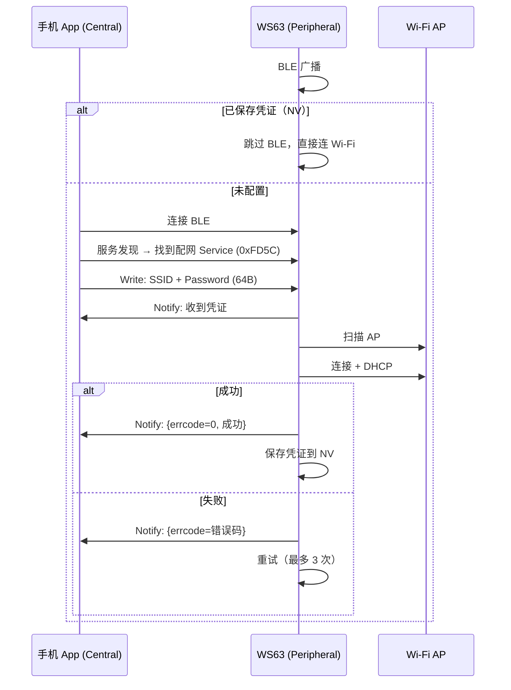
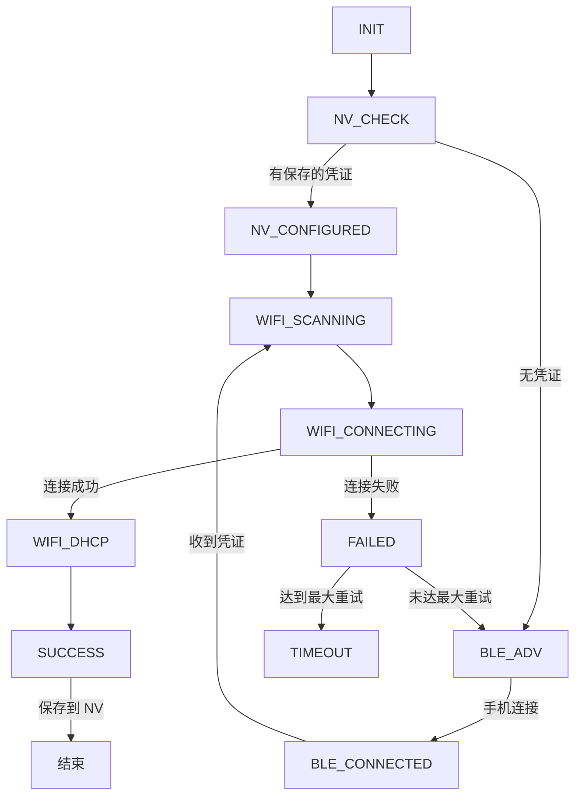
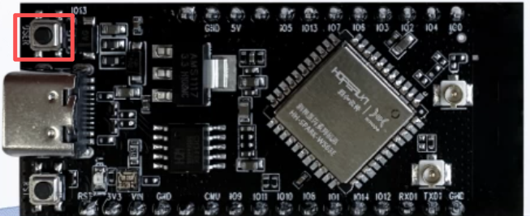
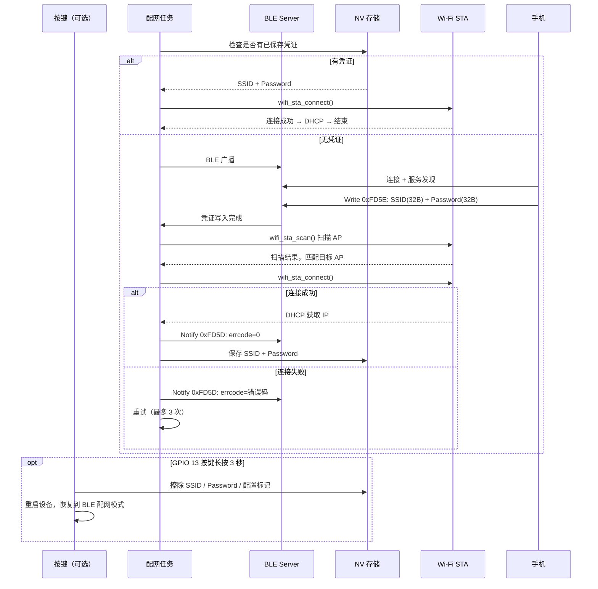

# Wi-Fi 配网

通过 BLE (Bluetooth Low Energy) 将手机下发的 Wi-Fi 凭证写入设备，设备连接 Wi-Fi 后回传结果，支持 NV (Non-Volatile) 持久化和自动重连。

> 前置阅读：[Hello Notify](../basics/hello-notify.md)

## 学习目标

- 理解 BLE Wi-Fi 配网的完整流程：BLE 广播 → 手机连接 → 接收凭证 → 扫描连接 → DHCP (Dynamic Host Configuration Protocol) → 回传结果
- 掌握 GATT (Generic Attribute Profile) Server 的配网服务设计——Service UUID (Universally Unique Identifier) 0xFD5C 下三个 Characteristic 的分工
- 掌握 NV 持久化机制——配网成功后保存凭证，下次启动直接联网，跳过 BLE
- 能够在 WS63 上实现 BLE Wi-Fi 配网功能

## 基本概念

### 配网流程



### 配网 Service 设计（UUID 0xFD5C）

设备端作为 GATT Server，注册一个 Service 包含三个 Characteristic：

| Characteristic | UUID | Property | 方向 | 用途 |
|:---|:---|:---|:---|------|
| Control Point | 0xFD5D | Notify + Write No Rsp | Dev → Phone | 下发控制指令、状态通知 |
| Wi-Fi Info | 0xFD5E | Indicate + Write No Rsp | Phone → Dev | 接收 SSID (Service Set Identifier) + Password（64B） |
| Request / Report | 0xFD5F | Notify + Write No Rsp | 双向 | Phone 请求 AP (Access Point) 列表，Dev 上报扫描结果 |

### 配网状态机



| 状态 | LED (Light Emitting Diode)（可选） | 说明 |
|------|:---:|------|
| INIT | — | 初始化 |
| NV_CHECK | — | 检查 NV 中是否有已保存的凭证 |
| NV_CONFIGURED | 常亮 | NV 有凭证，跳过 BLE 直接连 Wi-Fi |
| BLE_ADV | 快闪 | BLE 广播中，等待手机连接 |
| BLE_CONNECTED | 快闪 | 手机已连接，等待写入凭证 |
| WIFI_SCANNING | 慢闪 | 扫描目标 AP |
| WIFI_CONNECTING | 慢闪 | 正在连接 Wi-Fi |
| WIFI_DHCP | 慢闪 | DHCP 获取 IP (Internet Protocol) |
| SUCCESS | 常亮 | 配网成功 |
| FAILED | 三快闪后灭 | 本次失败，自动重试 |
| TIMEOUT | 三快闪后灭 | 所有重试耗尽，进入深度空闲 |

### NV 持久化

配网成功后，SSID 和 Password 通过 `uapi_nv_write()` 写入 NV 区。下次启动时：

1. 检查 NV 中 `NV_KEY_WIFI_CONFIGURED` 标记
2. 如果为 1，读取 SSID + Password，跳过 BLE 广播，直接 `wifi_sta_connect()`
3. 如果直接连接也失败，回退到 BLE 配网流程

如需重新配网，支持通过长按按键清除已保存的凭证（需开启 `CONFIG_BLE_PROV_BTN_ENABLE`）：将按键一端接 `CONFIG_BLE_PROV_BTN_PIN`（默认 GPIO (General Purpose Input/Output) 13），另一端接 GND，按下约 3 秒即可擦除 NV 并自动重启设备，重启后恢复到 BLE 广播等待配网状态。短按不触发任何操作。



### 错误码

Wi-Fi 连接失败时，设备通过 Control Point Characteristic Notify 回传错误码：

| 错误码 | 含义 |
|--------|------|
| 0 | 成功 |
| 1 | SSID 未找到（AP 不在范围内） |
| 2 | 密码错误 |
| 3 | DHCP 失败 |
| 4 | Beacon 丢失（信号差） |
| 5 | 其他错误 |

## 涉及 API

| API | 谁调用 | 用途 | 头文件 |
|-----|--------|------|--------|
| `gatts_register_server()` | 初始化 | 注册 GATT Server | `bts_gatt_server.h` |
| `gatts_add_service_sync()` | 初始化 | 添加 0xFD5C Service | `bts_gatt_server.h` |
| `gatts_add_characteristic_sync()` | 初始化 | 添加三个 Characteristic | `bts_gatt_server.h` |
| `gatts_notify_indicate_by_uuid()` | 任务 | 按 UUID 向手机发 Notify/Indicate | `bts_gatt_server.h` |
| `gap_ble_register_callbacks()` | 初始化 | 注册 BLE 事件回调（连接、广播、使能） | `bts_le_gap.h` |
| `gap_ble_start_adv()` | 任务 | 开始 BLE 广播 | `bts_le_gap.h` |
| `wifi_sta_enable()` | 初始化 | 使能 Wi-Fi STA (Station) | `wifi_hotspot.h` |
| `wifi_sta_scan()` | 任务 | 触发 Wi-Fi 扫描 | `wifi_hotspot.h` |
| `wifi_sta_get_scan_info()` | 回调 | 获取扫描结果 | `wifi_hotspot.h` |
| `wifi_sta_connect()` | 任务 | 连接指定 AP | `wifi_hotspot.h` |
| `wifi_register_event_cb()` | 初始化 | 注册 Wi-Fi 事件回调 | `wifi_hotspot.h` |
| `netifapi_dhcp_start()` | 任务 | 启动 DHCP 获取 IP | `lwip/netifapi.h` |
| `uapi_nv_write()` / `uapi_nv_read()` | NV 模块 | 读写 NV 凭证 | `nv.h` |

## 案例说明

### 案例简介

设备启动后开始 BLE 广播，手机 App 连接设备后发送 Wi-Fi SSID 和 Password（共 64 字节），设备收到后扫描 AP、连接 Wi-Fi、获取 IP，最后通过 Notify 回传结果。配网成功后凭证自动保存到 NV，下次启动直接联网。

### 功能规格

| 规格项 | 说明 |
|--------|------|
| Service UUID | 0xFD5C |
| 数据格式 | SSID（32B） + Password（32B），共 64B |
| 配网超时 | 60 秒（`CONFIG_BLE_PROV_TIMEOUT_SEC`） |
| 最大重试 | 3 次（`CONFIG_BLE_PROV_MAX_RETRIES`） |
| NV 持久化 | 可选（`CONFIG_BLE_PROV_NV_ENABLE`） |
| LED 指示 | 可选（`CONFIG_BLE_PROV_LED_ENABLE`） |
| 按键清除 | 可选（`CONFIG_BLE_PROV_BTN_ENABLE`），长按 3 秒 |

### 案例流程



## 案例操作指导

### 第一步：编译

确保 .config 中包含：
```bash
CONFIG_BLE_PROV_NV_ENABLE=y
CONFIG_BLE_PROV_TIMEOUT_SEC=60
CONFIG_BLE_PROV_MAX_RETRIES=3
```

```bash
fbb build ws63-liteos-app
```

> 更多编译选项请参考 [构建操作](../../../../overall-architecture/build-output/index.md#构建操作)。

### 第二步：烧录

```bash
fbb flash ws63-liteos-app
```

> 更多烧录选项请参考 [构建操作](../../../../overall-architecture/build-output/index.md#构建操作)。

### 第三步：验证

1. 设备上电，LED 快闪表示正在 BLE 广播
2. 手机打开 BLE 调试 App（如 nRF Connect），扫描并连接设备
3. 找到 Service UUID 0xFD5C → Characteristic 0xFD5E (Wi-Fi Info)
4. 写入 64 字节：前 32 字节 SSID + 后 32 字节 Password（不足补 0）
5. LED 变为慢闪（正在连接 Wi-Fi）
6. 连接成功后 LED 常亮，Device 通过 0xFD5D 回传 `errcode=0`
7. 下次上电 LED 直接常亮（NV 路径跳过 BLE）

## 关键配置

| 配置项 | 默认值 | 说明 |
|--------|--------|------|
| `CONFIG_BLE_PROV_NV_ENABLE` | y | 启用 NV 持久化，配网成功后保存凭证 |
| `CONFIG_BLE_PROV_TIMEOUT_SEC` | 60 | 配网超时（秒），超时后进入深度空闲 |
| `CONFIG_BLE_PROV_MAX_RETRIES` | 3 | Wi-Fi 连接失败后的最大重试次数 |
| `CONFIG_BLE_PROV_LED_ENABLE` | n | 启用 LED 状态指示 |
| `CONFIG_BLE_PROV_LED_PIN` | 7 | LED GPIO 引脚（HiHope WS63E EVB 红色 LED） |
| `CONFIG_BLE_PROV_BTN_ENABLE` | n | 启用按键清除 NV 凭证 |
| `CONFIG_BLE_PROV_BTN_PIN` | 13 | 按键 GPIO 引脚，低电平有效。按键一端接此引脚，另一端接 GND。长按 3 秒触发清除 |

## 代码详解

### 文件结构

```text
src/application/samples/
├── wifi/ble_wifi_cfg_sample/
│   ├── ble_wifi_cfg_sample.c      # 主任务 + 状态机 + Wi-Fi 连接
│   ├── ble_wifi_prov_nv.c/h       # NV 存储（保存/加载/清除凭证）
│   ├── ble_wifi_prov_led.c/h      # LED 状态指示
│   ├── ble_wifi_prov_btn.c/h      # 按键清除 NV
│   ├── Kconfig                     # 配置项定义
│   └── CMakeLists.txt
└── bt/ble/
    ├── ble_wifi_cfg_server/        # BLE GATT Server（0xFD5C 服务）
    │   ├── ble_wifi_cfg_server.c/h
    │   └── ble_wifi_cfg_adv.c/h
    └── ble_wifi_cfg_client/        # BLE GATT Client（手机端参考）
        ├── ble_wifi_cfg_client.c/h
        └── ble_wifi_cfg_scan.c/h
```

### 入口 + 任务创建

```c
#define BGWC_TASK_PRIO       26
#define BGWC_TASK_STACK_SIZE 0x1000

static void bgle_wifi_cfg_entry(void)
{
#ifdef CONFIG_BLE_PROV_LED_ENABLE
    ble_wifi_prov_led_init(CONFIG_BLE_PROV_LED_PIN);
#endif
#ifdef CONFIG_BLE_PROV_BTN_ENABLE
    ble_wifi_prov_btn_init(CONFIG_BLE_PROV_BTN_PIN);
#endif

    osal_kthread_lock();
    osal_task *task = osal_kthread_create(
        (osal_kthread_handler)ble_wifi_cfg_example_task, 0,
        "bgle_wifi_cfg_task", BGWC_TASK_STACK_SIZE);
    if (task != NULL) {
        osal_kthread_set_priority(task, BGWC_TASK_PRIO);
        osal_kfree(task);
    }
    osal_kthread_unlock();
}

app_run(bgle_wifi_cfg_entry);
```

### 主任务结构

主任务 `ble_wifi_cfg_example_task` 是一个重试循环，每次循环包含三个阶段：

```c
for (int attempt = 0; attempt < CONFIG_BLE_PROV_MAX_RETRIES; attempt++) {

    // 阶段一：等待手机写入凭证或超时
    while (1) {
        osDelay(PROV_TASK_DELAY_TICK);
        if (超时) return WIFI_ERRCODE_OTHERS;
        if (收到凭证 && WiFi 就绪) break;
    }

    // 阶段二：扫描 + 连接
    wifi_sta_scan();  // 触发扫描
    等待扫描完成;
    bgwc_wifi_connect();  // 匹配 AP + 发起连接
    等待连接完成;

    // 阶段三：DHCP 获取 IP
    if (连接成功) {
        netifapi_dhcp_start(netif);  // 启动 DHCP
        等待 IP 分配;
        if (成功) return 0;
    }

    // 失败 → 回传错误码 → 重试
    ble_wifi_cfg_server_send_report_by_uuid(&errcode, 2);
}
```

### 凭证写入回调

手机通过 Write 0xFD5E 写入 SSID + Password 时，GATT Server 回调中调用 `set_wifi_cfg_info()`：

```c
static void ble_wifi_cfg_server_receive_write_req_cbk(uint8_t server_id,
    uint16_t conn_id, gatts_req_write_cb_t *write_cb_para, errcode_t status)
{
    if (write_cb_para->handle == g_chara_cfg_hdl) {
        // 拼装 SSID(32B) + Password(32B) 到 g_data[64]
        set_wifi_cfg_info(write_cb_para->value,
                          write_cb_para->length,
                          write_cb_para->offset);
    }
}
```

`set_wifi_cfg_info()` 处理分片写入（BLE 调试助手将长 HEX 拆为多个 Write Without Response 包），通过累加偏移量将 64 字节完整拼装：

```c
void set_wifi_cfg_info(uint8_t *info, uint16_t info_len, uint16_t offset)
{
    uint16_t pos = (offset > 0) ? offset : g_cfg_write_offset;
    memcpy_s(g_data + pos, WIFI_MAX_CONFIG_INFO_LEN - pos, info, info_len);
    g_cfg_write_offset = pos + info_len;
    set_wifi_cfg_info_flag(1);  // 通知主任务：凭证已就绪
}
```

### Wi-Fi 事件回调

```c
static wifi_event_stru ble_wifi_cfg_event_cb = {
    .wifi_event_scan_state_changed   = bgwc_scan_state_changed,
    .wifi_event_connection_changed   = bgwc_connection_changed,
    .wifi_event_softap_state_changed = bgwc_softap_state_changed
};

static void bgwc_connection_changed(td_s32 state,
    const wifi_linked_info_stru *info, td_s32 reason_code)
{
    if (info->conn_state == WIFI_DISCONNECTED) {
        bgwc_wifi_reason_code(reason_code, &g_errcode);  // 根据原因码分类错误
    }
    g_bgwc_state = CONFIG_DEMO_WIFI_CONNECT_DONE;  // 通知主任务
}
```

断开原因码经过分类映射：`WLAN_STATUS_CHALLENGE_FAIL` → 密码错误，`WIFI_NETWORK_NOT_FOUND_ERROR` → SSID 未找到，`WLAN_DISASOC_MISC_LINKLOSS` → Beacon 丢失。

### NV 持久化

```c
// 保存（配网成功后调用）
errcode_t ble_wifi_prov_nv_save(ssid, password)
{
    uapi_nv_write(NV_KEY_WIFI_SSID, ssid, strlen(ssid) + 1);
    uapi_nv_write(NV_KEY_WIFI_PASSWORD, password, strlen(password) + 1);
    uapi_nv_write(NV_KEY_WIFI_CONFIGURED, &flag, sizeof(flag));
}

// 加载（启动时调用，如有凭证则跳过 BLE）
errcode_t ble_wifi_prov_nv_load(ssid, ssid_max, password, pwd_max)
{
    uapi_nv_read(NV_KEY_WIFI_SSID, ssid_max, &len, ssid);
    uapi_nv_read(NV_KEY_WIFI_PASSWORD, pwd_max, &len, password);
}

// 判断是否已配置
bool ble_wifi_prov_nv_is_configured(void)
{
    uapi_nv_read(NV_KEY_WIFI_CONFIGURED, sizeof(flag), &len, &flag);
    return (flag == 1);
}
```

三个 NV Key 分别存 SSID、Password、配置标记，应用层不需要关心底层的 Flash 地址。

### 按键清除 NV（GPIO 13，低电平有效）

按键一端接 `CONFIG_BLE_PROV_BTN_PIN`（默认 GPIO 13），另一端接 GND。芯片内部已使能上拉，按键未按下时引脚为高电平，按下时为低电平。长按约 3 秒擦除 NV 并重启：

```c
static int prov_btn_task(const char *arg)
{
    while (1) {
        osal_msleep(100);  // 每 100ms 轮询一次
        bool pressed = (uapi_gpio_get_val(g_btn_pin) == GPIO_LEVEL_LOW);
        if (pressed) {
            press_count++;
            if (press_count >= 30) {  // 30 × 100ms = 3 秒
                ble_wifi_prov_nv_clear();       // 擦除 NV 中的 SSID / Password / 标记
                reboot_port_reboot_chip();      // 重启设备
            }
        } else {
            press_count = 0;  // 松开即清零，短按无操作
        }
    }
}
```

---
