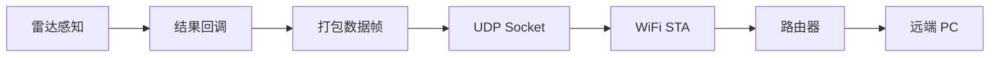

# STA 上报

> SLP (SparkLink Positioning) Radar + WiFi STA (Station) + UDP (User Datagram Protocol) Socket

> 前置阅读：[基础雷达](../basic/basic-radar.md)、[STA 连接](../../wifi/sta/sta-connect.md)

## 学习目标

- 掌握雷达 + WiFi STA 的组合使用
- 掌握通过 UDP Socket 将雷达结果上报远端
- 能够在 WS63 上实现感知 → 上网 → 云端上报的完整链路

## 规格与功能

雷达感知人体存在 → WiFi STA 连接路由器 → UDP Socket 上报结果到远端 PC。

| 规格项 | 说明 |
|--------|------|
| 雷达 | SLP Radar，同基础感知 |
| WiFi | STA 模式连接路由器 |
| 传输 | UDP Socket |
| 上报频率 | 10Hz（雷达帧率） |
| 数据格式 | 结构化雷达结果帧 |

程序运行流程：雷达初始化 → WiFi STA 连接 → DHCP (Dynamic Host Configuration Protocol) 获取 IP (Internet Protocol) → Socket 创建 → 雷达结果回调 → 打包数据 → `sendto()` → 远端 PC 接收。

## 基本概念

### 数据上报链路



### TCP vs UDP

| | TCP (Transmission Control Protocol) | UDP |
|:---|:---|:---|
| 可靠性 | 可靠（重传+确认） | 不可靠（可能丢包） |
| 延迟 | 较高 | 较低 |
| 适合 | 关键状态变更（人体出现/消失） | 高频数据流（10~100Hz） |

雷达数据频率较高（10~100Hz），一般用 UDP。关键事件（人体存在状态变化）可用 TCP 补发或应用层加序号+确认。

## 涉及 API

| API | 用途 |
|-----|------|
| `uapi_radar_register_result_cb()` | Radar 结果回调 |
| `wifi_sta_connect()` | WiFi STA 连接 |
| `socket(AF_INET, SOCK_DGRAM)` | 创建 UDP socket |
| `sendto()` | UDP 发送 |

## 案例操作指导


PC 端运行 UDP 接收程序，Device 连上 WiFi 后自动上报雷达数据。

## 关键配置

| 参数 | 值 | 说明 |
|------|-----|------|
| UDP 端口 | 8888 | 自定义 |
| 服务器 IP | PC 局域网 IP | 硬编码在代码中 |
| 上报频率 | 10Hz | 雷达默认帧率 |

## 代码详解

### WiFi 连接后启动雷达

```c
static void wifi_ready_cb(void)
{
    // WiFi 连接成功 → 启动雷达 → 创建 Socket
    radar_init();
    radar_start();

    g_udp_sock = socket(AF_INET, SOCK_DGRAM, 0);

    struct sockaddr_in server_addr = {
        .sin_family = AF_INET,
        .sin_port   = htons(8888),
        .sin_addr   = { .s_addr = inet_addr("192.168.1.100") },
    };
    connect(g_udp_sock, (struct sockaddr *)&server_addr, sizeof(server_addr));
}
```

### 雷达结果回调中上报

```c
static void radar_result_cb(radar_result_t *result)
{
    // 打包雷达结果
    radar_frame_t frame = {
        .target_count    = result->target_count,
        .is_human_presence = result->is_human_presence,
    };
    memcpy(frame.targets, result->targets,
           result->target_count * sizeof(radar_target_info_t));

    // UDP 发送
    sendto(g_udp_sock, &frame, sizeof(frame), 0, NULL, 0);
}
```

### 断线处理

```c
// WiFi 断开 → 停止雷达 → 关闭 Socket
// WiFi 重连 → 重新启动雷达 → 重建 Socket

if (wifi_state == DISCONNECTED) {
    uapi_radar_set_status(STOP);
    close(g_udp_sock);
    wifi_sta_reconnect();  // 自动重连
}
```

---

