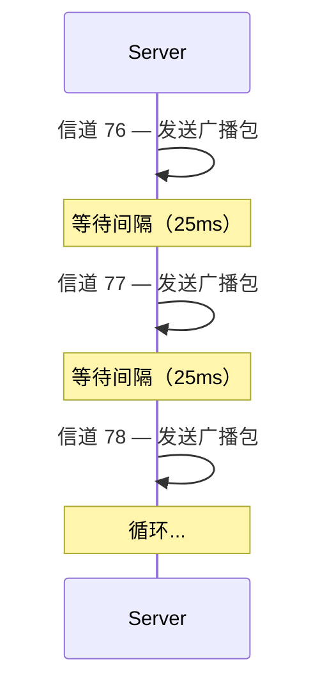
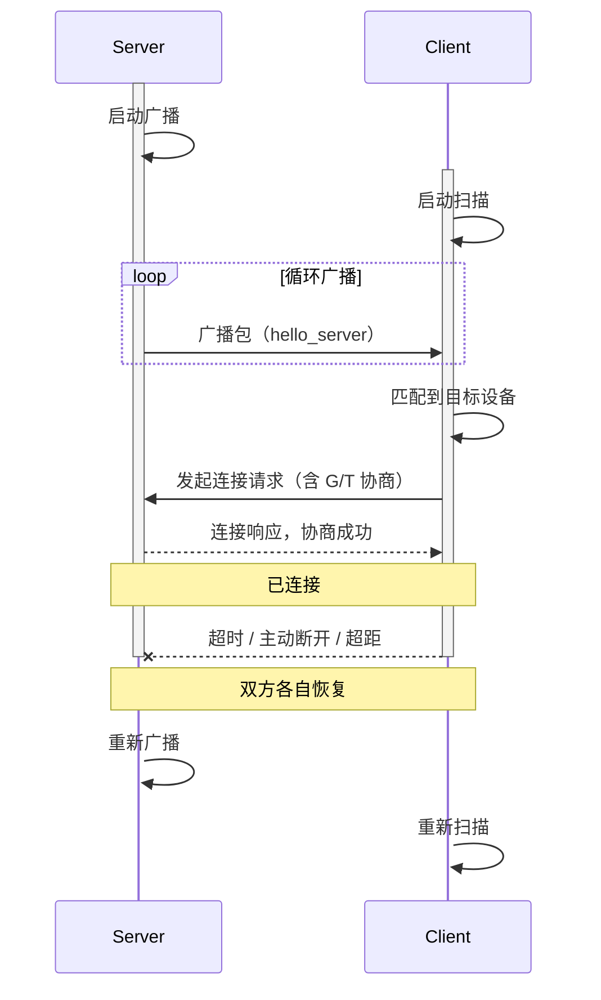
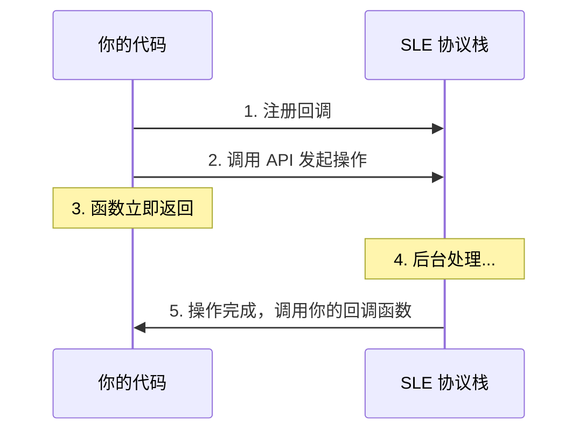
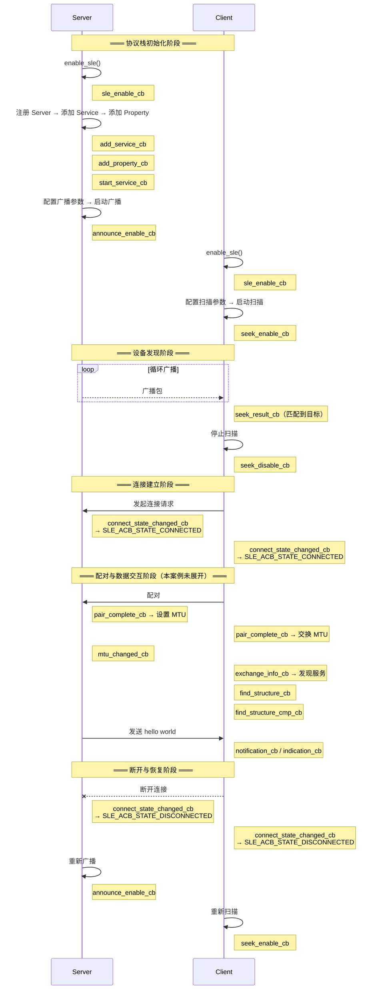
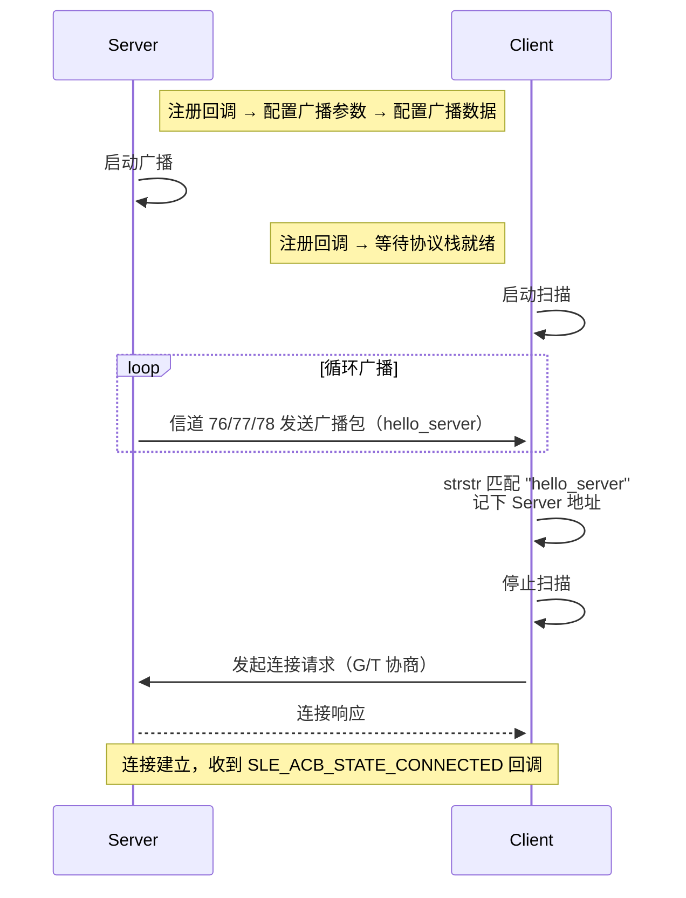
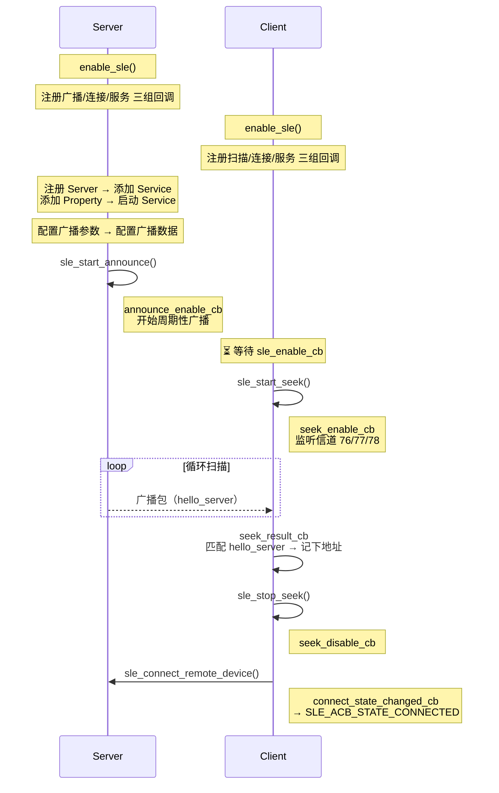

# Hello SLE

> 本篇是 SLE (SparkLink Low Energy) Hello 系列的基础入口，统一说明广播、扫描、连接、公共回调链以及 Server/Client 的构建烧录。[通知推送（Notify）](./hello-notify.md) 和 [属性读写（Read/Write）](./hello-readwrite.md) 只说明连接建立后的增量能力。

> 广播与连接 — SLE 设备发现、连接管理

## 学习目标

- 理解什么是 SLE 的"广播"和"扫描"，以及它们如何让两台设备发现彼此
- 能够配置并启动一个 SLE Server 的广播
- 能够配置并启动一个 SLE Client 的扫描，发现目标设备并建立连接
- 理解"回调驱动"意味着什么——为什么代码不按顺序执行
- 能够在两块 WS63 开发板上分别烧录 Server 和 Client，让它们完成连接

## 规格与功能

本案例是一个最小化的 SLE 连接示例，程序只做一件事：**让两块板子建立 SLE 无线连接**。

| 规格项 | Server 端 | Client 端 |
|--------|----------|----------|
| 角色 | T（终端，可协商为 G） | G（授权端，连接发起方） |
| 广播模式 | 可连接可扫描 | — |
| 广播间隔 | 25ms | — |
| 扫描 PHY (Physical Layer) | — | 1M |
| 扫描间隔/窗口 | — | 12.5ms / 12.5ms（持续扫描） |
| 连接间隔 | 12.5ms | — |
| 监管超时 | 5 秒 | — |
| 匹配方式 | 广播设备名 `hello_server` | 扫描结果中搜索 `hello_server` |
| 断连行为 | 自动重新广播 | 自动重新扫描 |

程序运行流程：

1. Server 上电 → 不断发送名为 `hello_server` 的广播包
2. Client 上电 → 开始扫描周边设备
3. Client 扫描到 `hello_server` → 停止扫描 → 发起连接
4. 双方连接成功 → 串口打印 `connected`

> 这个案例是后续所有 SLE 功能（数据上报、远程控制、固件升级等）的基础。没有连接，什么都做不了。

## 基本概念

### 星闪通信流程

阅读本文前，建议先了解 [概述](../overview/index.md) 中介绍的通信四阶段：

```text
发现 → 连接 → 服务交互 → 持续维护
```

本案例覆盖前两个阶段——**这是 SLE 开发的入门第一课**。

### 广播：让别人知道"我在这里"

**广播（Announce）** 是 Server 端周期性向周围发送的数据包，类似一个人站在广场上每隔几秒喊一声自己的名字。

一个广播包里包含以下信息：

- 设备地址（MAC (Media Access Control) 地址）
- 设备名称（如 `hello_server`）
- 发现等级（一般 / 优先 / 仅配对设备）
- 接入模式（公开 / 受限）
- 发射功率（便于对方估算距离）

广播有两个关键的时间参数：

- **广播间隔（announce interval）**：两次广播之间的时间间隔。间隔越短，对方发现你越快，但功耗越高。
- **广播信道（announce channel）**：SLE 在 76、77、78 三个信道上轮流发送广播，避免某个信道被干扰时广播收不到。



### 扫描：听见别人的广播

**扫描（Seek）** 是 Client 端做的事情——在指定信道上"听"广播包。

扫描也有两个时间参数：

- **扫描间隔（seek interval）**：多久扫描一次
- **扫描窗口（seek window）**：每次扫描持续多长时间

窗口必须 ≤ 间隔。下面看两种典型配置：

<script type="wavedrom">
{
  "signal": [
    { "name": "扫描窗口", "wave": "=.=.=.=.=", "data": ["SCAN", "SCAN", "SCAN", "SCAN"] },
    { "name": "扫描间隔", "wave": "=.=.=.=.=", "data": ["Slot1", "Slot2", "Slot3", "Slot4"] }
  ],
  "head": { "text": "窗口 = 间隔" },
  "foot": { "text": "一直开着在听，发现最快，功耗最高" },
  "config": { "tick": 0, "hscale": 2 }
}
</script>

<script type="wavedrom">
{
  "signal": [
    { "name": "扫描窗口", "wave": "=0=0=0=0=", "data": ["SCAN", "SCAN", "SCAN", "SCAN"] },
    { "name": "扫描间隔", "wave": "=.=.=.=.=", "data": ["Slot1", "Slot2", "Slot3", "Slot4"] }
  ],
  "head": { "text": "窗口 < 间隔" },
  "foot": { "text": "听一会歇一会，省电，但可能错过广播" },
  "config": { "tick": 0, "hscale": 2 }
}
</script>

### Server 与 Client、G 与 T 的关系

在 SLE 中有两套独立的概念，初学者容易混淆：

| 概念 | 含义 | 谁决定的 |
|------|------|---------|
| **Server / Client** | 谁提供数据、谁消费数据 | 应用层决定 |
| **G（Grant）/ T（Terminal）** | 谁来管理连接的调度节奏 | 连接时协商 |

- Server 通常是数据的来源（比如传感器），经常做 T
- Client 通常是数据的消费者（比如手机），经常做 G

但这不是绝对的。一块板子可以同时是 Server 和 Client，但一次连接中只能是一种 G/T 角色。

本案例中 Server 期望做 T（`SLE_ANNOUNCE_ROLE_T_CAN_NEGO`），意思是"我最好做终端，但如果对方不同意，也可以协商"。

### 广播模式：五种选择

SLE 定义了五种广播模式，通过 `announce_mode` 参数选择：

| 模式 | 能被扫描到 | 能接受连接 | 典型场景 |
|------|:---:|:---:|------|
| 不可连接不可扫描 | 否 | 否 | 单向信号广播，如 Beacon 信标、位置标签——只需宣告"我在这里"，不需要交互 |
| 可连接不可扫描 | 否 | 是 | 隐蔽连接——设备在后台等待特定客户端直连，不暴露自身信息给扫描者 |
| 不可连接可扫描 | 是 | 否 | 信息发布——如广告牌设备，对方可以扫描获取数据，但不接受连接 |
| 可连接可扫描 | 是 | 是 | 常规交互——最常见的模式，设备既能被发现，也能被连接。本案例即使用此模式 |
| 可连接可扫描定向 | 是（仅目标设备） | 是 | 快速重连——向已配对过的指定设备定向广播，跳过全量发现流程，连接更快 |

**差异总结**：前四种模式的核心区别在于"扫描"和"连接"两个能力的排列组合，决定了一个设备对周边世界的可见程度和交互方式。第五种定向模式则是在"可连接可扫描"基础上增加了目标地址过滤——只在广播中携带对端地址（`peer_addr`），只有该地址对应的设备才能发现并连接，适合需要快速恢复已有连接的场景（如手表离开手机范围后自动重连）。

### 通信流程: 连接状态

一个 SLE 连接从无到有、再到断开，会经历几个状态。下面这张时序图展示了完整的状态变化：



> `SLE_ACB_STATE_CONNECTED` 和 `SLE_ACB_STATE_DISCONNECTED` 是两个最重要的回调参数，你的代码就靠判断这两个值来得知当前连接状态。

### 回调驱动模式

SLE 的 API 不是"调完等结果"的同步模式，而是**回调驱动**的异步模式：



> 关键理解：调用 `sle_start_announce()` 后，函数立刻返回。广播是在后台启动的，启动完成后协议栈调用你注册的 `announce_enable_cb` 回调。**永远不要把后续操作写在 API 调用之后，必须写在回调函数里。**

### 通信流程: 回调调用生命周期

Server 和 Client 各自注册了多组回调，它们并非同时触发，而是在协议栈的不同阶段被依次调用。理解这个调用顺序是写出正确异步代码的关键。下面这张图展示了全套回调的触发时机——本案例只用到了其中的连接阶段，数据交互阶段的回调将在后续文档中介绍。



本案例（hello-connect）聚焦前三个阶段——从协议栈初始化到连接建立。看到某个回调被触发，你就知道协议栈当前处于什么状态、下一步应该做什么。

## 涉及 API

本案例只用到 SLE 协议栈最核心的 9 个 API：

| API | 谁调用 | 用途 |
|-----|--------|------|
| `enable_sle()` | Server + Client | 启动 SLE 协议栈（第一步） |
| `sle_announce_seek_register_callbacks()` | Server + Client | 注册广播/扫描相关回调 |
| `sle_connection_register_callbacks()` | Server + Client | 注册连接状态回调 |
| `sle_set_announce_param()` | Server | 配置广播参数 |
| `sle_set_announce_data()` | Server | 配置广播数据内容 |
| `sle_start_announce()` | Server | 启动广播 |
| `sle_set_seek_param()` | Client | 配置扫描参数 |
| `sle_start_seek()` | Client | 启动扫描 |
| `sle_stop_seek()` | Client | 停止扫描 |
| `sle_connect_remote_device()` | Client | 发起连接 |

> 这 9 个 API 构成了 SLE 开发的最小集合。后续任何一个复杂功能（数据上报、OTA (Over-The-Air)、HID (Human Interface Device) 等）都建立在这个基础之上。

## 案例说明

### 案例简介

两块 WS63 板子，一块烧录 Server 程序（广播方），一块烧录 Client 程序（连接方），让它们通过 SLE 建立无线连接。

### 案例流程说明



### 如何识别目标设备

Client 扫描时可能收到多个设备的广播。怎么知道哪个是对的呢？

这个案例用的是**设备名称匹配**——Server 广播名设为 `hello_server`，Client 在扫描结果中用 `strstr` 搜索这个字符串。只有广播数据里包含 `hello_server` 的设备才会被连接。

> 如果环境中还有其他 SLE 设备也在广播，只要它们的广播数据里不包含 `hello_server`，就不会被误连。

## 案例操作指导

### 第一步：编译 Server 固件


打开 menuconfig，启用 Server：

```text
Top → Application → Samples → BT → SLE → SLE Hello → [*] SLE Hello Server Sample
```

这等于设置了 `CONFIG_SAMPLE_SUPPORT_SLE_HELLO_SERVER_SAMPLE=y`。

```bash
fbb build ws63-liteos-app
```

> 更多编译选项请参考 [构建操作](../../../../overall-architecture/build-output/index.md#构建操作)。

### 第二步：编译 Client 固件

同上，改为启用 Client：

```text
Top → Application → Samples → BT → SLE → SLE Hello → [*] SLE Hello Client Sample
```

这等于设置了 `CONFIG_SAMPLE_SUPPORT_SLE_HELLO_CLIENT_SAMPLE=y`。

### 第三步：烧录

将 Server 固件烧录到板子 A，Client 固件烧录到板子 B。

```bash
fbb flash ws63-liteos-app
```

> 更多烧录选项请参考 [构建操作](../../../../overall-architecture/build-output/index.md#构建操作)。

### 第四步：上电运行


**先给 Server 上电**（让广播先跑起来），预期串口输出：

```text
[sle hello server] init ok
[sle hello server] start announce success.
[sle hello server] waiting for connection...
```

**再给 Client 上电**，预期串口输出：

```text
[sle hello client] init...
[sle hello client] start seek...
[sle hello client] scan data: hello_server
[sle hello client] found hello_server, stopping seek...
[sle hello client] connecting to remote device...
```

### 第五步：确认连接成功

连接建立后：

- Server 端输出：`[sle hello server] connected, conn_id=0xXX`
- Client 端输出：`[sle hello client] connected, conn_id=0xXX`

`conn_id` 不为 0 即表示连接成功。这个值在后续的数据通信中非常重要——每次发数据都要用它来指定"发给谁"。

## 关键配置

### 广播参数的说明

广播参数中，以下每个字段都通过注释说明了"为什么这样设"：

```c
sle_announce_param_t param = {0};

/* 广播模式：可连接 + 可扫描。
   为什么选这个？因为本案例需要被对方发现（扫描），也需要接受连接。
   大多数开发场景都用这个模式。 */
param.announce_mode = SLE_ANNOUNCE_MODE_CONNECTABLE_SCANABLE;

/* 广播句柄：1。
   WS63 最多支持 16 路广播同时工作。这里只用 1 路，句柄填 1 即可。
   如果要做多路广播（比如同时宣告多个服务），需要分配不同的句柄。 */
param.announce_handle = 1;

/* G/T 角色：期望做 T，可协商。
   为什么选 T？因为这个案例中 Server 是被动等待连接的一方，
   不需要主动管理调度。选择"可协商"意味着如果 Client 不会做 G，
   双方还能交换角色，提高了兼容性。 */
param.announce_gt_role = SLE_ANNOUNCE_ROLE_T_CAN_NEGO;

/* 发现等级：一般。
   SLE_ANNOUNCE_LEVEL_NORMAL 意味着任何扫描设备都能发现。
   如果设为 SLE_ANNOUNCE_LEVEL_SPECIAL，只有白名单设备能发现，
   适合仅希望特定设备连接的场景。 */
param.announce_level = SLE_ANNOUNCE_LEVEL_NORMAL;

/* 广播信道：默认。
   在 76、77、78 三个信道上依次广播。多信道是为了抗干扰——
   如果某个信道被 WiFi 占用了，其他信道还能收到广播。 */
param.announce_channel_map = SLE_ADV_CHANNEL_MAP_DEFAULT;

/* 广播间隔：25ms（0xC8 × 125us）。
   为什么是 25ms？— 这是速度与功耗的平衡点。
   - 更短（如 10ms）：对方发现更快，但功耗翻倍
   - 更长（如 100ms）：省电，但对方可能需要等几秒才能发现
   min 和 max 设为相同值意味着固定间隔，不做随机抖动。 */
param.announce_interval_min = 0xC8;
param.announce_interval_max = 0xC8;

/* 连接间隔：12.5ms（0x64 × 125us）。
   这是建立连接后的通信调度间隔。连接后每隔 12.5ms 双方同步一次。
   12.5ms 适合一般的数据交互。更短的间隔（如 7.5ms）传得更快但更耗电，
   更长的间隔（如 50ms）省电但延迟高。min 和 max 相同 = 固定间隔。
   注意：这里设的是Server的期望值，实际间隔由双方协商确定。 */
param.conn_interval_min = 0x64;
param.conn_interval_max = 0x64;

/* 最大延迟：0x1F3（499 × 1.25ms ≈ 624ms）。
   允许从设备跳过多少个连接间隔。设 0 表示不允许跳过，
   每次都要参与。数值越大越省电但延迟越高。这里设了一个较大的值，
   是为了在无数据时让对方能深度休眠。
   注意：只有当本端做G时才生效，做T时该参数无效。 */
param.conn_max_latency = 0x1F3;

/*  监管超时：5 秒（0x1F4 × 10ms）。
   如果 5 秒内没有收到对端的任何数据，协议栈会判定连接断开。
   这个值必须大于 (1+conn_max_latency) × conn_interval_max × 2，
   否则连接可能频繁误断。
   5 秒对大多数场景足够——既不会因为短暂干扰就断连，
   也不会在对方真正走远后等太久才感知到。 */
param.conn_supervision_timeout = 0x1F4;

/* 发射功率：+18 dBm。
   功率越高传输距离越远但功耗越高。18 dBm 是较高的值，
   开发调试阶段保证能连上。实际产品中可根据距离需求调低到 0~10 dBm。
   可调范围：-127 ~ +20 dBm */
param.announce_tx_power = 18;
```

调用 `sle_set_announce_param(1, &param)` 将以上配置下发给协议栈。

### 扫描参数的说明

```c
sle_seek_param_t param = {0};

/* 扫描 PHY：1M。
   可选 1M / 2M / 4M。1M 兼容性最好，几乎所有 SLE 设备都支持。
   如果确定对方使用高速 PHY，可以改为 2M 或 4M 以获取更高扫描速率。 */
param.seek_phys = SLE_SEEK_PHY_1M;

/* 扫描类型：主动扫描。
   主动扫描（SLE_SEEK_ACTIVE）会在收到广播后发送扫描请求，
   让对方回复扫描响应数据（含设备名、发射功率等更多信息）。
   被动扫描（SLE_SEEK_PASSIVE）只接收广播包，不请求额外数据。 */
param.seek_type[0] = SLE_SEEK_ACTIVE;

/* 扫描间隔：12.5ms（100 × 0.125ms）。
   扫描窗口：12.5ms（100 × 0.125ms）。
   窗口 = 间隔意味着持续扫描，功耗最高但发现速度最快。
   如果产品需要省电：
   - 窗口设为间隔的一半（如间隔 100ms，窗口 50ms），功耗减半
   - 但发现速度也会减半。 */
param.seek_interval[0] = 100;
param.seek_window[0] = 100;

/* 重复过滤：关闭。
   设为 0 表示不跳过重复的广播包，每次收到都上报。
   如果设为 1，一段时间内相同设备的重复广播只上报一次。 */
param.filter_duplicates = 0;
```

### 可配置参数速查

以下参数在实际使用中可能需要根据场景调整：

| 参数 | 当前值 | 可调范围 | 调大影响 | 调小影响 |
|------|--------|---------|---------|---------|
| `announce_interval` | 25ms | 10ms ~ 10s+ | 省电，发现变慢 | 发现快，功耗增加 |
| `conn_interval` | 12.5ms | 7.5ms ~ 4s | 省电，延迟高 | 延迟低，功耗增加 |
| `conn_supervision_timeout` | 5s | 100ms ~ 32s | 断开感知慢 | 可能频繁误断 |
| `announce_tx_power` | 18 dBm | -127 ~ +20 | 距离远，功耗高 | 距离近，省电 |
| `seek_interval / seek_window` | 12.5ms / 12.5ms | 2.5ms ~ 10s+ | 省电，发现变慢 | 发现快，功耗增加 |

## 代码详解

### 代码入口：任务创建

所有的 SLE 代码运行在一个独立的任务中。`app_run(sle_hello_entry)` 是 SDK的约定——系统初始化完成后自动调用这个函数：

```c
static void sle_hello_entry(void)
{
    osal_task *task_handle = NULL;
    osal_kthread_lock();

#if defined(CONFIG_SAMPLE_SUPPORT_SLE_HELLO_SERVER_SAMPLE)
    /* 编译 Server 时走这里 */
    task_handle = osal_kthread_create(
        (osal_kthread_handler)sle_hello_server_task, 0,
        "SLEHelloServer",
        SLE_HELLO_TASK_STACK_SIZE);   // 栈大小 4KB
#elif defined(CONFIG_SAMPLE_SUPPORT_SLE_HELLO_CLIENT_SAMPLE)
    /* 编译 Client 时走这里 */
    task_handle = osal_kthread_create(
        (osal_kthread_handler)sle_hello_client_task, 0,
        "SLEHelloClient",
        SLE_HELLO_TASK_STACK_SIZE);   // 栈大小 4KB
#endif

    if (task_handle != NULL) {
        osal_kthread_set_priority(task_handle, SLE_HELLO_TASK_PRIO); // 优先级 28
    }
    osal_kthread_unlock();
}
app_run(sle_hello_entry); // SDK 初始化完成后调用
```

一个源文件，通过编译开关区分 Server 和 Client。这样做的好处是底层代码（设备发现、连接管理）可以复用，只有上层逻辑不同。

### Server 与 Client 执行流程

Server 和 Client 虽然角色不同，但初始化模式高度一致：都是先注册回调、再做事。下图用一张时序图将两者的启动路径并列展示，便于对比理解——**Server 侧同步执行**，**Client 侧回调驱动**。



> **Server 的关键差异**：Server 在 `enable_sle()` 之后直接配置和启动广播，不走 `sle_enable_cb` 回调——因为 Server 不依赖 `sle_enable_cb` 的触发时机，它的广播配置在协议栈就绪后立即执行即可。

> **Client 的关键差异**：Client 的所有操作都在回调中驱动——`sle_enable_cb` 触发扫描、`seek_result_cb` 触发匹配和停扫、`seek_disable_cb` 触发连接、`connect_state_changed_cb` 通知连接结果。这就是"回调链"模式。

Client 的初始化代码只做三件事——注册回调，然后启动协议栈：

```c
void sle_hello_client_init(ssapc_notification_callback notification_cb,
                           ssapc_indication_callback indication_cb)
{
    sle_hello_seek_cbk_register();    // 注册扫描相关回调
    sle_hello_connect_cbk_register(); // 注册连接相关回调
    sle_hello_ssapc_cbk_register(notification_cb, indication_cb); // 注册服务相关回调

    enable_sle(); // 启动 SLE，完成后自动调用 sle_enable_cb
}
```

所有后续操作都在 `sle_enable_cb` 回调中启动：

```c
static void sle_hello_sle_enable_cbk(errcode_t status)
{
    sle_hello_seek_cbk_register();    // 重新注册（防止丢失回调）
    sle_hello_connect_cbk_register();
    sle_hello_ssapc_cbk_register(g_saved_notification_cb, g_saved_indication_cb);
    sle_hello_client_start_scan();    // 开始扫描
}
```

### 广播参数配置详解

下面是本案例中广播参数的完整配置代码：

```c
static int sle_set_default_announce_param(void)
{
    sle_announce_param_t param = {0};

    /* 可连接可扫描 — 希望被对方发现，也允许连接 */
    param.announce_mode = SLE_ANNOUNCE_MODE_CONNECTABLE_SCANABLE;

    /* 广播句柄 1 — 只用一路广播 */
    param.announce_handle = 1;

    /* 期望做 T 但可协商 — Server 是被动方，让 Client 做 G 管理调度 */
    param.announce_gt_role = SLE_ANNOUNCE_ROLE_T_CAN_NEGO;

    /* 一般发现等级 — 任何设备都能扫描到 */
    param.announce_level = SLE_ANNOUNCE_LEVEL_NORMAL;

    /* 默认信道 76/77/78 — 三信道轮询，抗干扰 */
    param.announce_channel_map = SLE_ADV_CHANNEL_MAP_DEFAULT;

    /* 广播间隔 25ms — 平衡发现速度和功耗 */
    param.announce_interval_min = 0xC8;  // 200 × 125us
    param.announce_interval_max = 0xC8;

    /* 连接间隔 12.5ms — 建立连接后的通信频率 */
    param.conn_interval_min = 0x64;      // 100 × 125us
    param.conn_interval_max = 0x64;

    /* 最大延迟 ≈ 624ms — 允许对方在没有数据时跳过多个连接事件来省电 */
    param.conn_max_latency = 0x1F3;      // 499 × 1.25ms

    /* 监管超时 5 秒 — 5 秒内没收到数据就认为连接断开 */
    param.conn_supervision_timeout = 0x1F4; // 500 × 10ms

    /* 发射功率 18 dBm — 较高，保证开发调试时能连上 */
    param.announce_tx_power = 18;

    return sle_set_announce_param(param.announce_handle, &param);
}
```

### 广播数据内容

广播参数配置的是"怎么广播"，广播数据配置的是"广播包里装什么"：

```c
static int sle_set_default_announce_data(void)
{
    sle_announce_data_t data = {0};
    uint8_t announce_data[SLE_ADV_DATA_LEN_MAX] = {0};   // 广播数据（最多251字节）
    uint8_t seek_rsp_data[SLE_ADV_DATA_LEN_MAX] = {0};   // 扫描响应数据

    /* —— 广播数据部分 —— */

    /* 1. 发现等级 — 告诉对方自己的可发现级别 */
    struct sle_adv_common_value adv_disc_level = {
        .length = 2,
        .type = SLE_ADV_DATA_TYPE_DISCOVERY_LEVEL,
        .value = SLE_ANNOUNCE_LEVEL_NORMAL,
    };
    memcpy_s(&announce_data[0], ... , &adv_disc_level, 3);
    // 数据格式: [长度][类型][值] = [2][DISCOVERY_LEVEL][NORMAL]

    /* 2. 接入模式 — 0 = 公开接入，任何设备都可以连接 */
    struct sle_adv_common_value adv_access_mode = {
        .length = 2,
        .type = SLE_ADV_DATA_TYPE_ACCESS_MODE,
        .value = 0,  // 0=公开, 1=受限
    };
    memcpy_s(&announce_data[3], ... , &adv_access_mode, 3);

    /* —— 扫描响应数据部分（Client 主动扫描时额外获取） —— */

    /* 3. 发射功率 — 帮助对方估算距离 */
    struct sle_adv_common_value tx_power_level = {
        .length = 2,
        .type = SLE_ADV_DATA_TYPE_TX_POWER_LEVEL,
        .value = 10,  // +10 dBm
    };
    memcpy_s(&seek_rsp_data[0], ... , &tx_power_level, 3);

    /* 4. 设备名称 — Client 靠这个字符串来匹配目标设备 */
    // 格式: [长度][类型0x09=完整本地名]["hello_server"]
    seek_rsp_data[3] = 12;  // 名称长度（含结束符）
    seek_rsp_data[4] = 0x09; // SLE_ADV_DATA_TYPE_COMPLETE_LOCAL_NAME
    memcpy_s(&seek_rsp_data[5], ... , "hello_server", 12);

    data.announce_data = announce_data;
    data.announce_data_len = 6;
    data.seek_rsp_data = seek_rsp_data;
    data.seek_rsp_data_len = 17;

    return sle_set_announce_data(1, &data);
}
```

> 区别：广播数据是每次广播都会发出的（所有扫描者都能收到），扫描响应数据只在主动扫描者请求时才回复（省带宽）。把设备名放在扫描响应数据中有两个好处：广播包变短（更快发出），且只有主动扫描者才知道你的设备名。

### 扫描匹配逻辑

每条扫描结果都会触发 `seek_result_cb`。在其中搜索目标设备名：

```c
static void sle_hello_seek_result_info_cbk(sle_seek_result_info_t *seek_result_data)
{
    /* 扫描到设备了，检查是不是我们要找的 */
    if (strstr((const char *)seek_result_data->data, "hello_server") != NULL) {
        /* 是的！记下地址，停止扫描 */
        memcpy_s(&g_sle_hello_remote_addr, sizeof(sle_addr_t),
                 &seek_result_data->addr, sizeof(sle_addr_t));
        sle_stop_seek();  // 停止扫描（异步）
    }
    /* 不是目标设备：什么都不做，继续扫描 */
}
```

`strstr` 将广播数据当字符串来搜索 `hello_server`。如果可以精确匹配，这种方式最简单可靠。

### 连接状态回调

连接状态变化回调需要同时处理"连上"和"断开"两种情况：

```c
static void sle_hello_connect_state_changed_cbk(uint16_t conn_id,
    const sle_addr_t *addr,
    sle_acb_state_t conn_state,     // 当前状态
    sle_pair_state_t pair_state,    // 配对状态
    sle_disc_reason_t disc_reason)  // 断开原因（断开时有效）
{
    if (conn_state == SLE_ACB_STATE_CONNECTED) {
        /* 连上了！保存连接句柄。
           这个 conn_id 在后续所有数据操作中都要用到
           （发送通知、读取属性、断开连接……） */
        g_sle_conn_hdl = conn_id;
    }
    else if (conn_state == SLE_ACB_STATE_DISCONNECTED) {
        /* 断开了。清空连接句柄，重新开始广播 */
        g_sle_conn_hdl = 0;
        sle_start_announce(1); // 自动重连
    }
}
```

> `conn_id` 是一个 16 位句柄，唯一标识一条连接。如果你的设备同时连接了多个对端，每个对端有不同的 `conn_id`。发送数据时必须指定正确的 `conn_id`，否则发错对象。

### 断开后自动恢复

断开连接不一定是因为对方关机——可能是短暂的无线干扰、走出了信号范围、或者对方主动断开了。本案例的处理策略：

| 角色 | 断开后做什么 | 目的 |
|------|------------|------|
| Server | 立即重新启动广播 | 让对方能重新扫描到自己 |
| Client | 立即重新启动扫描 | 重新搜索目标设备 |

两端配合可实现"自动恢复"——只要干扰消失或对方重新进入范围，连接就会重新建立。

---

