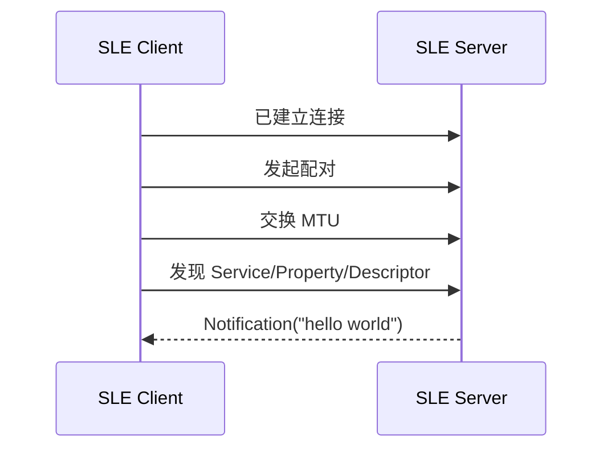

# 通知推送（Notify）

> 在 [Hello SLE](./hello-connect.md) 完成广播、扫描和连接后，增加 SSAP (SLE Service Access Protocol) 服务发现、MTU (Maximum Transmission Unit) 交换和通知推送。

## 本篇新增内容

- Server 注册 Service、Property 和 Descriptor。
- Client 完成配对、MTU 交换和服务发现。
- Server 通过通知向 Client 推送 `hello world`。
- Client 在通知回调中按显式长度处理数据。

广播、扫描、连接、任务入口以及公共构建烧录流程不在本篇重复说明。

## SSAP 数据模型

```text
Server
└── Service
    └── Property
        └── Descriptor
```

Property 决定数据是否可读、可写或可通知；Descriptor 保存补充配置。Client 必须完成服务发现并保存实际 Property Handle，不能使用写死的句柄。

## 增量流程



通知适合 Server 主动上报且允许应用层自行处理丢包的场景；需要逐包确认时使用指示，需要 Client 主动查询或修改数据时使用读写请求。

## 源码对应关系

本篇与 Hello SLE (SparkLink Low Energy) 共用：

```text
src/application/samples/bt/sle/sle_hello/
├── sle_hello_server/src/sle_hello_server.c
└── sle_hello_client/src/sle_hello_client.c
```

重点查看：

- Server 端 SSAP 服务和 Property 注册。
- Client 端配对、MTU 交换和服务发现回调链。
- Server 通知发送与 Client 通知接收回调。

## 操作与验证

按 [Hello SLE](./hello-connect.md) 构建和烧录 Server、Client。连接成功后应依次看到配对、MTU、服务发现和通知接收日志。

若已经连接但没有数据：

1. 确认配对和 MTU 交换已经完成。
2. 确认 Client 已发现目标 Property 并保存真实 Handle。
3. 确认 Server 在服务启动后才发送通知。
4. 打印数据时使用回调提供的长度，不能假设数据以 `\0` 结尾。

## 下一步

[属性读写（Read/Write）](./hello-readwrite.md) 在相同 SSAP 模型上增加 Client 主动读写。
