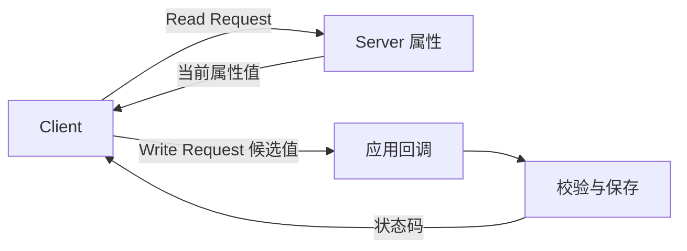
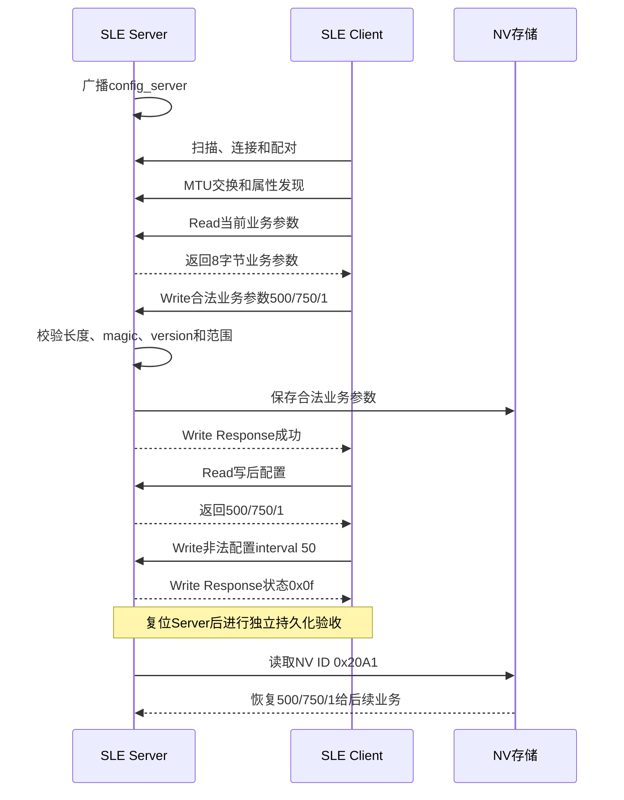

# 参数配置与持久化

> 使用技术：SLE、SSAP（SLE Service Access Protocol）属性读写、应用层校验、NV（Non-Volatile Storage）持久化

> 前置阅读：必须了解 [Hello Connect](../basics/hello-connect.md) 的扫描与连接流程，建议先完成 [Hello Read/Write](../basics/hello-readwrite.md) 的属性读写实验。

本案例使用两块 WS63 演示通过 SSAP 属性读写配置参数并保存到 NV：Client 读取和写入配置，Server 校验数据并保存合法值、拒绝非法值，复位后再从 NV 恢复。示例字段只用于验证配置链路，不驱动实际业务。

## 学习目标

- 完成 SLE Server 与 Client 的扫描、连接、配对和 SSAP 属性发现
- 使用 SSAP Read Request 读取 Server 当前保存的参数
- 在 Server 回调中校验参数，并通过 Write Response 区分接受和拒绝
- 区分“写响应成功”“写后回读一致”和“复位后 NV 恢复”三个验收层次
- 使用两个角色固件在实板上逐级验证完整配置流程

## 基本概念

### 业务参数与协议栈参数

业务参数用于控制产品功能，例如采样周期、告警阈值、工作模式和设备名称。协议栈参数用于控制通信链路，例如广播间隔、连接参数、发射功率和 MTU。两类参数的归属、合法范围和生效模块不同，不应混用同一套配置接口或数据模型。

远端配置业务参数时，SLE 只是传输通道。参数最终由上报、告警、电源管理等业务模块读取并执行；修改业务参数不会自动改变 SLE 协议栈行为。

### SSAP 属性读写模型

SSAP（SLE Service Access Protocol）使用服务和属性组织设备能力。Server 注册属性并声明读写权限，Client 完成属性发现后通过 handle 发起 Read Request 或 Write Request。



如果属性需要应用层判断，应启用授权权限，让读写请求进入应用回调。协议栈负责传递请求和响应，应用负责决定返回什么数据、是否接受写入以及错误状态。

### RAM 与 NV

RAM（Random Access Memory，随机存取存储器）是设备运行时使用的可读写存储空间，程序变量和当前配置通常保存在 RAM 中。RAM 中的数据在设备断电或复位后会丢失。

NV（Non-Volatile Storage，非易失性存储）是断电后仍能保留数据的存储区域，通常用于保存设备配置、校准参数等需要长期保留的数据。设备重新启动后，可以从 NV 读取已保存的配置并恢复到 RAM 中。

## 涉及 API

API按照初始化、连接、属性读写和持久化的实际调用阶段排列。详细参数和返回值请查阅对应API Reference。

| 阶段 | 前置状态 | 核心 API | 谁调用 | 解决的问题 |
|------|----------|----------|--------|------------|
| Server初始化 | 样例任务已启动 | `ssaps_register_callbacks()`、`ssaps_register_server()`、`ssaps_add_service_sync()`、`ssaps_add_property_sync()`、`ssaps_start_service()` | Server任务 | 注册配置服务和可授权读写属性 |
| 发现与连接 | SLE已使能 | `sle_start_seek()`、`sle_connect_remote_device()`、`sle_pair_remote_device()` | Client回调 | 找到`config_server`并建立安全连接 |
| 属性发现 | 配对已完成 | `ssapc_exchange_info_req()`、`ssapc_find_structure()` | Client回调 | 交换MTU并取得配置属性handle |
| 读取配置 | 属性handle有效 | `ssapc_read_req()`、`ssaps_send_response()` | Client/Server回调 | 请求并返回当前8字节配置 |
| 写入配置 | 已读取当前值 | `ssapc_write_req()`、`ssaps_send_response()` | Client/Server回调 | 提交候选配置并返回接受或拒绝状态 |
| 持久化 | 配置全部合法 | `uapi_nv_write()`、`uapi_nv_read()` | Server回调/初始化 | 保存合法配置并在复位后恢复 |

## 案例说明

### 功能规格

| 规格项 | 当前值 |
|--------|--------|
| Server广播名称 | `config_server` |
| 业务参数结构长度 | 8字节 |
| 默认业务参数 | `1000 ms / 80.0 ℃ / mode 0` |
| Client合法测试值 | `500 ms / 75.0 ℃ / mode 1` |
| Client非法测试值 | `interval=50 ms` |
| NV ID | `0x20A1` |
| SLE MTU请求值 | 520字节 |
| 角色选择 | Kconfig choice，Server与Client互斥 |

### 公共配置结构体

Client 和 Server 共用 `application/samples/bt/sle/sle_device_config/sle_device_config_protocol.h`。该头文件定义了配置结构体 `sle_device_config_t`：

```c
typedef struct {
    uint16_t magic;
    uint16_t report_interval_ms;
    int16_t alarm_threshold_decicelsius;
    uint8_t mode;
    uint8_t version;
} sle_device_config_t;
```

当前结构体共 8 字节，各字段含义和头文件中定义的约束如下：

| 字段 | 类型 | 约束和说明 |
|------|------|------------|
| `magic` | `uint16_t` | 固定为 `0x5343` |
| `report_interval_ms` | `uint16_t` | 100～60000 ms |
| `alarm_threshold_decicelsius` | `int16_t` | -200～1000，单位 0.1 ℃ |
| `mode` | `uint8_t` | 0 为正常模式，1 为低功耗模式 |
| `version` | `uint8_t` | 当前为 1 |

`magic` 用于识别协议，`version` 用于识别结构格式。温度阈值使用放大 10 倍的整数，可以表示一位小数并避免浮点传输。

> 两端均由相同工具链为 WS63 构建，样例直接传输 `sle_device_config_t`。跨处理器或编译器使用时，应显式逐字节编码字段和字节序，不能依赖 C 结构体布局。

### 端到端交互流程



### 设计与限制

- 配置以结构体整体写入，并由 Server 校验后保存。
- 当前代码先更新 RAM 再写 NV；NV 写入失败时 RAM 已变化，产品实现应调整提交顺序或回滚。
- 示例字段没有接入实际业务，只用于验证配置和持久化流程。
- 当前实现只适合同工具链构建的配套样例；跨平台时应显式编码字段，扩展多个属性时应按 UUID 匹配。

## 案例操作指导

### 准备开发板

准备两块 WS63 开发板和两根 USB 数据线，记录两个串口为`<server_port>`和`<client_port>`。

### 配置并烧录 Server

打开`ws63-liteos-app`的Kconfig UI，进入：

```text
Application
  → Enable Sample.
    → Enable the Sample of BT.
      → Sample
        → Support SLE Sample.
          → SLE Sample
```

选择：

```text
Support SLE Device Config Server Sample.
```

保存配置，然后构建并烧录：

```powershell
fbb build --clean ws63-liteos-app
fbb flash ws63-liteos-app --port <server_port> --baud 2000000 --json-summary
```

### 配置并烧录 Client

在同一个`SLE Sample`菜单中改选：

```text
Support SLE Device Config Client Sample.
```

保存配置，然后构建并烧录：

```powershell
fbb build --clean ws63-liteos-app
fbb flash ws63-liteos-app --port <client_port> --baud 2000000 --json-summary
```

### 运行结果

先启动 Server，再启动 Client。Client 会自动执行读取、合法写入、回读和非法写入。

Client 输出：

```text
[sle device config client] valid config accepted, handle=0x11
[sle device config client] read config: interval=500, threshold=750, mode=1
```

Server 输出：

```text
[sle device config server] config saved: interval=500, threshold=750, mode=1
[sle device config server] rejected: interval=50, threshold=750, mode=1
[sle device config server] write response status=0xf
```

复位 Server 后输出：

```text
[sle device config server] config loaded from NV: interval=500, threshold=750, mode=1
```

## 关键配置

| 配置项 | 当前值 | 可调范围 | 调整影响 |
|--------|--------|----------|----------|
| `CONFIG_SAMPLE_SUPPORT_SLE_DEVICE_CONFIG_SERVER_SAMPLE` | Server为`y` | `y`/`n` | 与Client互斥，选择后启用Peripheral角色 |
| `CONFIG_SAMPLE_SUPPORT_SLE_DEVICE_CONFIG_CLIENT_SAMPLE` | Client为`y` | `y`/`n` | 与Server互斥，选择后启用Central角色 |
| `report_interval_ms` | 测试值500 | 100～60000 | 调小提高上报频率，但增加通信和功耗 |
| `alarm_threshold_decicelsius` | 测试值750 | -200～1000 | 使用0.1℃整数，避免浮点协议字段 |
| `mode` | 测试值1 | 0～1 | 0表示正常模式，1表示低功耗模式 |
| `version` | 1 | 当前仅支持1 | 不匹配时Server拒绝整组配置 |
| NV ID | `0x20A1` | 需按产品规划 | 与其他业务复用会造成数据覆盖 |

## 代码详解

### 代码目录与调用关系

```text
sle_device_config_entry
├── Server角色
│   └── sle_device_config_server_task
│       └── sle_device_config_server_init
│           ├── 读取并校验NV配置
│           ├── 注册SSAP服务与属性
│           └── 开始广播config_server
└── Client角色
    └── sle_device_config_client_task
        └── sle_device_config_client_init
            ├── 扫描、连接与配对回调
            ├── MTU交换和属性发现回调
            └── 读取与写入确认回调
```

Server和Client的协议事件都运行在SLE回调上下文中。回调中应完成短时校验、状态更新和响应，不应加入长时间休眠或无限等待。

### 为什么读写请求会进入应用回调

配置属性除了声明可读、可写，还增加`SSAP_PERMISSION_AUTHORIZATION_NEED`。这表示协议栈不能直接接受请求，而要把读写事件交给应用层决定返回值和状态：

```c
#define SLE_DEVICE_CONFIG_TEST_PROPERTIES \
    (SSAP_PERMISSION_READ | SSAP_PERMISSION_WRITE | \
     SSAP_PERMISSION_AUTHORIZATION_NEED)
```

如果只声明读写权限而没有应用层授权，业务代码就没有机会检查`magic`、`version`和数值范围。Server注册的`read_request_cb`和`write_request_cb`分别处理请求，并统一通过`ssaps_send_response()`返回结果。

### Server校验候选配置

`sle_device_config_is_valid()`把协议完整性和业务范围集中在一个判断中：

```c
static bool sle_device_config_is_valid(const sle_device_config_t *config)
{
    return (config->magic == SLE_DEVICE_CONFIG_MAGIC) &&
           (config->version == SLE_DEVICE_CONFIG_VERSION) &&
           (config->report_interval_ms >= SLE_DEVICE_CONFIG_INTERVAL_MIN_MS) &&
           (config->report_interval_ms <= SLE_DEVICE_CONFIG_INTERVAL_MAX_MS) &&
           (config->alarm_threshold_decicelsius >= SLE_DEVICE_CONFIG_THRESHOLD_MIN) &&
           (config->alarm_threshold_decicelsius <= SLE_DEVICE_CONFIG_THRESHOLD_MAX) &&
           (config->mode <= SLE_DEVICE_CONFIG_MODE_MAX);
}
```

长度不等于8字节时返回数据类型错误；结构完整但字段越界时返回`ERRCODE_SSAP_VALUE_OUT_OF_RANGE`。这样Client能够区分传输格式错误和业务值错误。

### Server保存配置并发送响应

Server只在候选配置通过校验后调用NV写入API。`ssaps_send_response()`既用于Read Response，也用于Write Response；SDK没有单独的`ssaps_read_response()`或`ssaps_write_response()`。

```c
g_device_config = candidate;
errcode_t nv_ret = uapi_nv_write(SLE_DEVICE_CONFIG_NV_ID,
                                  (const uint8_t *)&g_device_config,
                                  sizeof(g_device_config));
if (nv_ret != ERRCODE_SUCC) {
    response_status = (uint8_t)ERRCODE_SSAP_INSUFFICIENT_RESOURCES;
}

ssaps_send_rsp_t rsp = {0};
rsp.request_id = write_cb_para->request_id;
rsp.status = response_status;
ssaps_send_response(server_id, conn_id, &rsp);
```

Client看到`valid config accepted`，说明这次Write Response状态成功；如果NV写入失败，Server会返回资源不足，不会伪装成配置成功。需要注意，当前代码在写NV前已执行`g_device_config = candidate`，因此存储失败时运行态值仍会变化；产品实现应根据原子性要求调整提交顺序或执行回滚。

### Client按状态推进自动测试

Client首次读取后发送合法配置；收到成功写确认后再次读取；回读结束后发送非法配置。`g_config_test_step`防止异步回调顺序混乱。

```c
if (g_config_test_step == SLE_DEVICE_CONFIG_TEST_STEP_INIT) {
    g_config_test_step = SLE_DEVICE_CONFIG_TEST_STEP_VALID_SENT;
    sle_device_config_client_send_valid_config(conn_id);
} else if (g_config_test_step == SLE_DEVICE_CONFIG_TEST_STEP_VALID_CONFIRMED) {
    g_config_test_step = SLE_DEVICE_CONFIG_TEST_STEP_PERSISTENCE_READ;
    if ((config.report_interval_ms == SLE_DEVICE_CONFIG_EXPECTED_INTERVAL_MS) &&
        (config.alarm_threshold_decicelsius == SLE_DEVICE_CONFIG_EXPECTED_THRESHOLD) &&
        (config.mode == SLE_DEVICE_CONFIG_EXPECTED_MODE)) {
        osal_printk("[sle device config client] persisted config verified\r\n");
    }
    sle_device_config_client_send_invalid_config(conn_id);
}
```

这里的日志名称容易让人误解：该回调发生在Server复位前，所以它只能证明写后回读。文档把复位后的NV加载作为单独关卡。

### Server启动时恢复NV配置

Server上电后先读取NV，并同时校验长度和字段。NV不存在、长度错误或内容非法时继续使用编译期默认配置：

```c
sle_device_config_t saved_config = {0};
uint16_t actual_len = 0;
errcode_t ret = uapi_nv_read(SLE_DEVICE_CONFIG_NV_ID,
                              sizeof(saved_config),
                              &actual_len,
                              (uint8_t *)&saved_config);
if ((ret == ERRCODE_SUCC) &&
    (actual_len == sizeof(saved_config)) &&
    sle_device_config_is_valid(&saved_config)) {
    g_device_config = saved_config;
}
```

这一启动路径与写后回读路径相互独立，所以必须通过Server复位日志单独证明。

---
