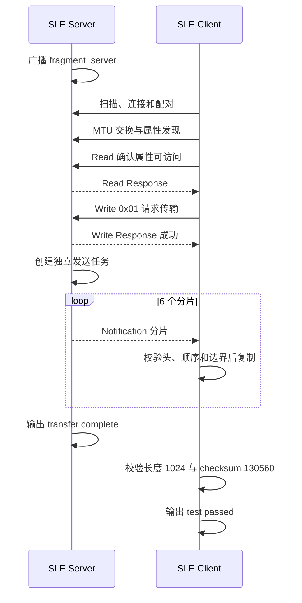

# 分片传输

> 使用技术：SLE、SSAP（SLE Service Access Protocol）属性读写与通知、应用层分片、顺序重组、完整性校验

> 前置阅读：必须了解 [Hello Connect](../basics/hello-connect.md) 的扫描与连接流程，建议先完成 [Hello Read/Write](../basics/hello-readwrite.md) 的属性读写实验和 [Hello Notify](../basics/hello-notify.md) 的通知实验。

本案例使用两块 WS63 演示 SLE 应用层分片传输：Server 将 1024 字节测试数据拆成 6 个 Notification，Client 请求传输、按序重组，并校验总长度和校验和。

## 学习目标

- 完成 SLE Server 与 Client 的扫描、连接、配对、MTU 交换和属性发现
- 理解为什么应用数据需要根据可用 MTU 设计分片负载
- 使用 SSAP Write Request 触发一次传输，并在独立任务中发送多个 Notification
- 在 Client 端校验分片头、顺序和缓冲区边界，再重组完整数据
- 通过发送端和接收端日志逐级验证 1024 字节数据闭环

## 基本概念

### MTU 与有效负载

MTU（Maximum Transmission Unit，最大传输单元）表示一次协议数据单元允许的最大长度。连接双方会在建链后交换 MTU 能力，最终可用值可能小于任一端的请求值，因此应用应以交换结果为准。

MTU 不是应用数据可以全部占用的长度。属性操作本身需要协议头，应用层如果再增加分片头，也会继续占用空间。设计单片负载时应满足：

```text
应用分片头长度 + 单片业务负载长度 ≤ 属性值可用长度
```

超出边界可能导致发送失败、数据截断，或者依赖协议栈内部行为。应用层分片的首要目的，就是让每个待发送单元稳定落在这个边界内。

### 分片与重组

分片是发送端把一段较大的应用数据拆成多个较小数据单元的过程；重组是接收端依据分片元数据，把这些单元恢复为原始数据的过程。

假设原始数据长度为 `L`，每片最多携带 `P` 字节业务负载，则分片数量为：

```text
N = (L + P - 1) / P
```

前 `N - 1` 片通常携带 `P` 字节，最后一片只携带剩余数据。接收端不能把缓冲区容量当作已接收长度，而应单独维护当前写入位置和累计有效长度。


### 分片元数据与接收状态

负载本身不能说明它属于哪次传输，也不能说明应写到原始数据的哪个位置，因此分片协议通常需要以下元数据：

| 元数据 | 作用 |
|--------|------|
| 协议标识或版本 | 区分数据格式，支持协议演进 |
| 会话或传输标识 | 区分前后两次传输，避免旧片混入新数据 |
| 分片序号或偏移 | 确定当前片在原始数据中的位置 |
| 总片数或总长度 | 判断何时接收完整 |
| 当前负载长度 | 区分缓冲区容量与本片有效数据 |
| 完整性字段 | 检查重组后的内容是否发生变化 |

接收端至少要维护当前会话、期望序号、累计长度和重组缓冲区容量。收到数据后应先校验元数据和边界，再写入缓冲区；不能先复制再判断是否合法。

### Notification 与应用层可靠性

Notification 是 Server 主动向 Client 推送属性值的异步机制，适合连续发送数据。发送 API 返回成功，通常只说明本地协议栈接受了这次发送请求，不能证明 Client 已经收到或完成处理。

如果业务要求可靠传输，应用协议还需要设计确认与恢复机制，例如：

- Client 返回已确认的分片序号或累计偏移
- Server 为未确认分片设置超时并重传
- 使用窗口控制连续发送数量，避免接收端来不及处理
- 断线重连后通过会话标识和偏移继续传输

### 完整性检查不等于可靠传输

长度和校验值用于判断重组结果是否完整、内容是否变化，但不能自动恢复丢失或错误的数据。简单累加和实现成本低，但错误检测能力有限；CRC 更适合检测传输错误，带密钥的消息认证码则用于验证数据来源和防止篡改。

可靠传输解决“数据出错后怎样恢复”，完整性检查解决“怎样发现数据不完整或已变化”，两者不能互相替代。

## 涉及 API

API 按照初始化、建链、触发和分片传输的实际调用阶段排列。详细参数与返回值请查阅对应 API Reference。

| 阶段 | 前置状态 | 核心 API | 谁调用 | 解决的问题 |
|------|----------|----------|--------|------------|
| Server 初始化 | 样例任务已启动 | `ssaps_register_callbacks()`、`ssaps_register_server()`、`ssaps_add_service_sync()`、`ssaps_add_property_sync()`、`ssaps_start_service()` | Server 任务 | 注册支持读、写和通知的属性 |
| 扫描与连接 | SLE 已使能 | `sle_start_seek()`、`sle_connect_remote_device()`、`sle_pair_remote_device()` | Client 回调 | 找到 `fragment_server` 并建立安全连接 |
| MTU 与属性发现 | 配对已完成 | `ssapc_exchange_info_req()`、`ssapc_find_structure()` | Client 回调 | 交换 MTU 并取得属性 handle |
| 触发传输 | 属性 handle 有效 | `ssapc_read_req()`、`ssapc_write_req()`、`ssaps_send_response()` | Client/Server 回调 | 确认属性可访问并提交触发值 `0x01` |
| 分片发送 | Server 接受触发值 | `osal_kthread_create()`、`ssaps_notify_indicate()` | Server 回调/发送任务 | 离开写回调后逐片发送数据 |
| 接收重组 | Client 已注册通知回调 | `memcpy_s()` | Client 通知回调 | 校验、复制、累计长度并完成重组 |

## 案例说明

### 功能规格

| 规格项 | 当前值 |
|--------|--------|
| Server 广播名称 | `fragment_server` |
| 原始数据长度 | 1024 字节 |
| 分片协议头 | 16 字节 |
| 单片最大负载 | 180 字节 |
| 完整分片最大长度 | 196 字节 |
| 分片数量 | 6 |
| 分片负载 | 180、180、180、180、180、124 字节 |
| 分片发送间隔 | 20 ms |
| Client MTU 请求值 | 520 字节 |
| 实测完整数据校验和 | 130560 |
| 触发值 | 单字节 `0x01` |
| 角色选择 | Kconfig choice，Server 与 Client 互斥 |

### 公共分片结构体

Client 和 Server 共用 `application/samples/bt/sle/sle_fragmentation/sle_fragmentation_protocol.h`。该头文件定义了分片结构体 `sle_fragmentation_packet_t`：

```c
typedef struct {
    uint16_t magic;
    uint16_t transfer_id;
    uint16_t index;
    uint16_t total;
    uint16_t payload_len;
    uint16_t reserved;
    uint32_t checksum;
    uint8_t payload[SLE_FRAGMENTATION_PAYLOAD_SIZE];
} sle_fragmentation_packet_t;
```

协议头为 16 字节，字段约束如下：

| 字段 | 类型 | 约束和说明 |
|------|------|------------|
| `magic` | `uint16_t` | 固定为 `0x5346` |
| `transfer_id` | `uint16_t` | 固定为 1 |
| `index` | `uint16_t` | 从 0 开始递增 |
| `total` | `uint16_t` | 固定为 6 |
| `payload_len` | `uint16_t` | 当前负载长度，不超过 180 |
| `reserved` | `uint16_t` | 当前为 0 |
| `checksum` | `uint32_t` | 完整数据的累加和 |
| `payload` | `uint8_t[180]` | 当前分片负载 |

测试数据的第 `i` 个字节为 `i & 0xff`，因此分片和校验结果固定为：

```text
1024 = 180 × 5 + 124
checksum = 130560
```

本案例把单片业务负载固定为 180 字节，加上 16 字节应用协议头后，完整分片最大为 196 字节。实板上 Server 的 MTU 变化回调观察到 `0xfb`（251 字节），196 字节分片没有越过该边界。

> 两端均由相同工具链为 WS63 构建，样例直接传输 C 结构体。面向不同处理器、编译器或长期演进的产品协议，应显式编码字段和字节序，并增加协议版本，不能依赖结构体布局。

### 端到端交互流程



### 设计与限制

- 单片负载固定为 180 字节，分片发送间隔为 20 ms。
- Client 要求分片严格按序到达，不支持 ACK、重传、乱序缓存或并发传输。
- 当前累加和只用于样例校验；跨平台使用时还应显式编码字段和字节序。

## 案例操作指导

### 准备开发板

准备两块 WS63 开发板和两根 USB 数据线，记录两个串口为`<server_port>`和`<client_port>`。

### 配置并烧录 Server

打开`ws63-liteos-app`的Kconfig UI，进入：

```text
Application
  → Enable Sample.
    → Enable the Sample of BT.
      → Sample
        → Support SLE Sample.
          → SLE Sample
```

选择：

```text
Support SLE Fragmentation Server Sample.
```

保存配置，然后构建并烧录：

```powershell
fbb build --clean ws63-liteos-app
fbb flash ws63-liteos-app --port <server_port> --baud 2000000 --json-summary
```

### 配置并烧录 Client

在同一个`SLE Sample`菜单中改选：

```text
Support SLE Fragmentation Client Sample.
```

保存配置，然后构建并烧录：

```powershell
fbb build --clean ws63-liteos-app
fbb flash ws63-liteos-app --port <client_port> --baud 2000000 --json-summary
```

### 运行结果

先启动 Server，再启动 Client。Server 输出：

```text
[sle fragmentation server] transfer start: bytes=1024, fragments=6, checksum=130560
[sle fragmentation server] fragment sent: 1/6, payload=180
...
[sle fragmentation server] fragment sent: 6/6, payload=124
[sle fragmentation server] transfer complete
```

Client 输出：

```text
[sle fragmentation client] fragment received: 1/6, total_bytes=180
...
[sle fragmentation client] fragment received: 6/6, total_bytes=1024
[sle fragmentation client] reassembly complete: bytes=1024, checksum=130560
[sle fragmentation client] test passed
```

## 关键配置

| 配置项 | 当前值 | 调整影响 |
|--------|--------|----------|
| `CONFIG_SAMPLE_SUPPORT_SLE_FRAGMENTATION_SERVER_SAMPLE` | Server 为 `y` | 与 Client 互斥，选择后启用 Peripheral 角色 |
| `CONFIG_SAMPLE_SUPPORT_SLE_FRAGMENTATION_CLIENT_SAMPLE` | Client 为 `y` | 与 Server 互斥，选择后启用 Central 角色 |
| `SLE_FRAGMENTATION_DATA_SIZE` | 1024 | 增大会增加 Client 静态重组缓冲区和分片数量 |
| `SLE_FRAGMENTATION_PAYLOAD_SIZE` | 180 | 增大可减少分片数量，但完整分片必须小于可用 MTU |
| `SLE_FRAGMENTATION_SEND_INTERVAL_MS` | 20 ms | 调小可提高发送速度，但更容易造成接收处理压力 |
| `SLE_FRAGMENTATION_MTU_SIZE` | 520 | 这是请求值，不代表最终可用值；应观察交换回调 |
| `SLE_FRAGMENTATION_TRANSFER_ID` | 1 | 当前只支持固定演示会话 |

## 代码详解

### 代码目录与调用关系

```text
sle_fragmentation_entry
├── Server 角色：sle_fragmentation_server_task
│   └── sle_fragmentation_server_init
│       ├── 注册连接与 SSAPS 回调
│       ├── 注册服务、属性和描述符
│       └── 广播 fragment_server
│           └── write_request_cb
│               └── sle_fragmentation_start_transfer
│                   └── sle_fragmentation_send_task
└── Client 角色：sle_fragmentation_client_task
    └── sle_fragmentation_client_init
        ├── 扫描、连接和配对回调
        ├── MTU 交换与属性发现回调
        ├── Read/Write 确认回调
        └── Notification 接收与重组回调
```

连接、属性读写和 Notification 处理运行在 SLE 回调上下文中，应保持短时执行；Server 的循环发送和 20 ms 间隔运行在独立任务中，可以阻塞等待。

### Server 只接受明确的触发值

Server 检查写入长度和值，并通过 Write Response 告诉 Client 是否接受。只有单字节 `0x01` 才启动传输：

```c
bool valid_trigger = (write_cb_para->length == 1) &&
                     (write_cb_para->value[0] == 1);

if (write_cb_para->need_rsp) {
    ssaps_send_rsp_t rsp = {0};
    rsp.request_id = write_cb_para->request_id;
    rsp.status = valid_trigger ? (uint8_t)ERRCODE_SLE_SUCCESS :
                                 (uint8_t)ERRCODE_SSAP_INCORRECT_DATA_VALUE;
    ssaps_send_response(server_id, conn_id, &rsp);
}
if (valid_trigger) {
    sle_fragmentation_start_transfer();
}
```

Write Response 成功只说明触发值合法。实际分片在新任务中发送，因此仍需观察后续发送和接收日志。

### Server 计算边界并逐片发送

发送任务先生成 1024 字节测试数据和整包校验和，再根据偏移量计算每片长度：

```c
for (uint16_t index = 0; index < packet.total; index++) {
    uint16_t offset = index * SLE_FRAGMENTATION_PAYLOAD_SIZE;
    uint16_t remaining = (uint16_t)(sizeof(source) - offset);
    packet.index = index;
    packet.payload_len = (remaining > SLE_FRAGMENTATION_PAYLOAD_SIZE) ?
                         SLE_FRAGMENTATION_PAYLOAD_SIZE : remaining;

    memcpy_s(packet.payload, sizeof(packet.payload),
             &source[offset], packet.payload_len);
    uint16_t packet_len = (uint16_t)(
        offsetof(sle_fragmentation_packet_t, payload) + packet.payload_len);
    sle_fragmentation_server_send_data((const uint8_t *)&packet, packet_len);
    osal_msleep(SLE_FRAGMENTATION_SEND_INTERVAL_MS);
}
```

最后一片只发送有效的 124 字节，而不是把 180 字节数组全部发出。`packet_len` 使用协议头长度加实际负载长度，减少了无效数据。

### Client 先校验再写入缓冲区

Notification 回调先检查状态、协议头、分片长度和顺序，再复制负载：

```c
if ((packet->index != g_next_fragment) ||
    ((uint32_t)g_reassembly_length + packet->payload_len >
     sizeof(g_reassembly_buffer))) {
    osal_printk("[sle fragmentation client] sequence error: ...\r\n");
    return;
}

if (memcpy_s(&g_reassembly_buffer[g_reassembly_length],
             sizeof(g_reassembly_buffer) - g_reassembly_length,
             packet->payload, packet->payload_len) != EOK) {
    return;
}
g_reassembly_length += packet->payload_len;
g_next_fragment++;
```

当收到 `index=0` 时，Client 清空本次传输的长度和期望序号。当前实现假设分片按序到达；发现乱序后只打印错误，不会请求补发。

### 最后一片触发完整性校验

只有收到全部分片后，Client 才计算完整缓冲区的累加和：

```c
if (g_next_fragment == packet->total) {
    uint32_t checksum = sle_fragmentation_checksum(
        g_reassembly_buffer, g_reassembly_length);
    if ((g_reassembly_length == SLE_FRAGMENTATION_DATA_SIZE) &&
        (checksum == packet->checksum)) {
        osal_printk("[sle fragmentation client] test passed\r\n");
    }
}
```

长度检查可以发现少片或截断，校验和可以发现内容变化。产品若要求更强的错误检测，应替换为 CRC；若要求防篡改，应使用带密钥的完整性校验。
