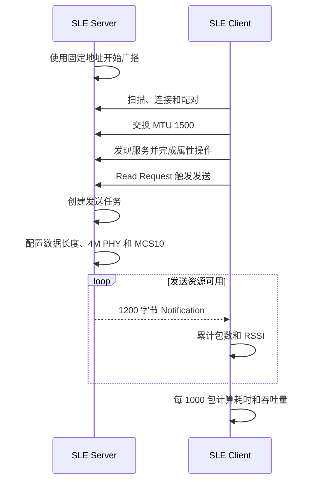

# 高吞吐传输

> 使用技术：SLE、SSAP（SLE Service Access Protocol）Notification、PHY/MCS 配置、MTU 交换、链路流控、吞吐量统计

> 前置阅读：必须了解 [Hello Connect](../basics/hello-connect.md) 的扫描与连接流程，建议先完成 [Hello Notify](../basics/hello-notify.md) 的通知实验。

本案例使用两块 WS63 演示 SLE 持续大包传输：Server 连续发送 1200 字节 Notification，Client 每接收 1000 包计算一次应用层吞吐量。

## 学习目标

- 完成 SLE Server 与 Client 的扫描、连接、配对、MTU 交换和服务发现
- 理解吞吐量、PHY、MCS、MTU 和应用负载之间的关系
- 配置 4M PHY、MCS10 和 1500 字节链路数据长度
- 根据链路流控状态连续发送 Notification
- 使用 TCXO 微秒计数器计算实际接收吞吐量

## 基本概念

### 吞吐量

吞吐量表示单位时间内成功传输的有效数据量，常用单位为 bit/s。应用层吞吐量只统计应用收到的负载，不包含无线帧头、确认、重传和连接调度等开销。

本案例用固定包数、单包长度和接收耗时计算吞吐量：

```text
吞吐量(bit/s) = 单包字节数 × 包数 × 8 / 耗时(s)
```

吞吐量受 PHY、MCS、连接间隔、包长、流控、射频环境和设备处理速度共同影响，因此一次实测值不代表所有环境下的固定性能。

### PHY 与 MCS

PHY（Physical Layer，物理层）决定无线信号的基本传输方式和符号速率。MCS（Modulation and Coding Scheme，调制与编码方案）决定调制阶数和编码率。

更高的 PHY 速率和 MCS 通常可以提高吞吐量，但需要更好的信号质量。距离增大或干扰增强时，高速配置可能增加误包和重传，实际吞吐量反而下降。本案例使用 4M PHY 和 MCS10，适合近距离、低干扰的吞吐验证。

### MTU、链路数据长度与应用包长

MTU（Maximum Transmission Unit，最大传输单元）是一次 SSAP 交换允许的最大协议数据长度；链路数据长度是控制器侧允许使用的数据长度；应用包长是 Notification 中实际携带的属性值长度。

三者属于不同层级。应用包必须落在协议栈最终允许的边界内，不能因为 MTU 请求值为 1500，就假定任意 1500 字节应用数据都能直接发送。本案例配置 1500 字节 MTU 和链路数据长度，实际每包发送 1200 字节，为协议开销保留空间。

### 流控

持续发送时，应用产生数据的速度可能高于控制器和无线链路的处理速度。流控用于告诉发送端当前是否还有可用发送资源。

Server 只有在 `sle_flow_ctrl_flag()` 表示资源可用时才提交下一包。发送 API 返回后继续无条件压入数据，可能造成队列拥塞、发送失败或丢包。流控解决的是本地发送节奏问题，不等同于端到端确认。

## 涉及 API

API 按初始化、建链、链路配置、发送和统计的实际阶段排列。详细参数和返回值请查阅对应 API Reference。

| 阶段 | 前置状态 | 核心 API | 谁调用 | 解决的问题 |
|------|----------|----------|--------|------------|
| Server 初始化 | 样例任务已启动 | `ssaps_register_callbacks()`、`ssaps_register_server()`、`ssaps_add_service_sync()`、`ssaps_add_property_sync()`、`ssaps_start_service()` | Server 任务 | 注册可通知的 SSAP 属性并开始广播 |
| 扫描与连接 | SLE 已使能 | `sle_start_seek()`、`sle_connect_remote_device()`、`sle_pair_remote_device()` | Client 回调 | 找到固定地址的 Server 并建立连接 |
| MTU 与服务发现 | 配对已完成 | `ssapc_exchange_info_req()`、`ssapc_find_structure()` | Client 回调 | 协商 MTU 并发现 Server 服务 |
| 高速链路配置 | 已连接 | `sle_set_data_len()`、`sle_set_phy_param()`、`sle_set_mcs()` | Server 发送任务/连接回调 | 配置链路数据长度、4M PHY 和 MCS10 |
| 连续发送 | Client 发起 Read Request | `ssapc_read_req()`、`ssaps_notify_indicate()` | Client 回调/Server 发送任务 | 触发并持续发送 1200 字节 Notification |
| 吞吐统计 | Client 正在接收通知 | `uapi_tcxo_get_us()` | Client 通知回调 | 统计 1000 包的接收耗时和吞吐量 |

## 案例说明

### 功能规格

| 规格项 | 当前值 |
|--------|--------|
| Server 地址 | `11:22:33:44:55:66` |
| PHY | 4M |
| MCS | 10 |
| MTU 请求值 | 1500 字节 |
| 链路数据长度 | 1500 字节 |
| 单包应用数据 | 1200 字节 |
| 统计周期 | 1000 包 |
| 高吞吐连接间隔配置 | `0x14` |
| 角色选择 | Kconfig choice，Server 与 Client 互斥 |

### 端到端交互流程



### 设计与限制

- 本案例持续发送测试数据，不包含业务协议、端到端确认、丢包统计或重传。
- Client 按固定地址匹配 Server，仅适合配套样例验证。
- 4M PHY、MCS10 和较短连接间隔面向近距离吞吐测试，不是远距离或低功耗场景的默认配置。
- Server 会把 NV ID `0x20A0` 的功率档位设置为 7，移植时应确认该 NV ID 不与其他业务冲突。

## 案例操作指导

### 准备开发板

准备两块 WS63 开发板和两根 USB 数据线，记录两个串口为 `<server_port>` 和 `<client_port>`。

### 配置并烧录 Server

打开 `ws63-liteos-app` 的 Kconfig UI，进入：

```text
Application
  → Enable Sample.
    → Enable the Sample of BT.
      → Sample
        → Support SLE Sample.
          → SLE Sample
```

选择：

```text
Support SLE Throughput Server Sample.
```

保存配置，然后构建并烧录：

```powershell
fbb build --clean ws63-liteos-app
fbb flash ws63-liteos-app --port <server_port> --baud 2000000 --json-summary
```

### 配置并烧录 Client

在同一个 `SLE Sample` 菜单中改选：

```text
Support SLE Throughput Client Sample.
```

保存配置，然后构建并烧录：

```powershell
fbb build --clean ws63-liteos-app
fbb flash ws63-liteos-app --port <client_port> --baud 2000000 --json-summary
```

### 运行结果

先启动 Server，再启动 Client。Server 初始化成功后输出：

```text
[speed server] init ok
sle enable end.
```

Client 自动连接并交换 MTU：

```text
[Connected]
[ssap client] exchange mtu, mtu size: 1500, version: 1.
```

收到 1000 包后，Client 输出一次统计结果。以下为本次实板日志，数值会随环境变化：

```text
g_count_after_get_us = 9745118, g_count_before_get_us = 7063025, data_len = 1200
time = 2.68 s
speed = 3579294.40 bps
```

## 关键配置

| 配置项 | 当前值 | 调整影响 |
|--------|--------|----------|
| `CONFIG_SAMPLE_SUPPORT_SLE_SPEED_SERVER_SAMPLE` | Server 为 `y` | 与 Client 互斥，选择后编译 Server 角色 |
| `CONFIG_SAMPLE_SUPPORT_SLE_SPEED_CLIENT_SAMPLE` | Client 为 `y` | 与 Server 互斥，选择后编译 Client 角色 |
| `CONFIG_LARGE_THROUGHPUT_SERVER` | `y` | 使用 1200 字节包、4M PHY、MCS10 和较短连接间隔 |
| `CONFIG_LARGE_THROUGHPUT_CLIENT` | `y` | 每 1000 包统计一次吞吐量 |
| `PKT_DATA_LEN` | 1200 字节 | 增大可降低单位负载的协议开销，但必须满足实际传输边界 |
| `DEFAULT_SLE_SPEED_MTU_SIZE` | 1500 字节 | 这是请求值，实际结果以交换回调为准 |
| `DEFAULT_SLE_SPEED_MCS` | 10 | 提高通常要求更好的信号质量 |
| `RECV_PKT_CNT` | 1000 | 增大可减小短时抖动影响，但统计刷新更慢 |

## 代码详解

### 代码目录与调用关系

```text
sle_speed_entry
├── Server：sle_speed_init
│   └── sle_speed_server_init
│       ├── 注册连接、SSAPS 和广播回调
│       ├── 注册服务并开始广播
│       └── ssaps_read_request_cbk
│           └── send_data_thread_function
└── Client：sle_speed_init
    └── sle_client_init
        ├── 扫描、连接、配对和 MTU 交换
        ├── 服务发现与属性操作
        └── sle_speed_notification_cb
```

协议事件运行在 SLE 回调上下文中，应保持短时执行；Server 的无限发送循环运行在独立任务中。

### Server 配置高速链路

发送任务先设置 1500 字节链路数据长度，再请求 4M PHY。PHY 设置回调成功后继续设置 MCS10：

```c
sle_set_data_len(g_sle_conn_hdl, DEFAULT_SLE_SPEED_DATA_LEN);

sle_set_phy_t phy_parm = {
    .tx_format = SLE_RADIO_FRAME_2,
    .rx_format = SLE_RADIO_FRAME_2,
    .tx_phy = SLE_PHY_4M,
    .rx_phy = SLE_PHY_4M,
    .tx_pilot_density = SLE_PHY_PILOT_DENSITY_16_TO_1,
    .rx_pilot_density = SLE_PHY_PILOT_DENSITY_16_TO_1,
};
sle_set_phy_param(g_sle_conn_hdl, &phy_parm);
```

```c
void sle_set_phy_cbk(uint16_t conn_id, errcode_t status,
                     const sle_set_phy_t *param)
{
    osal_printk("sle_set_phy_cbk: handle:%d, status 0x%x, txphy %d, rxphy %d\r\n",
        conn_id, status, param->tx_phy, param->rx_phy);
    sle_set_mcs(g_sle_conn_hdl, DEFAULT_SLE_SPEED_MCS);
}
```

### Server 根据流控连续发送

发送循环仅在协议栈仍有可用发送资源时提交 Notification：

```c
while (1) {
    if (sle_flow_ctrl_flag() > 0) {
        i++;
        data[0] = (i >> 8) & 0xFF;
        data[1] = i & 0xFF;
        sle_uuid_server_send_report_by_handle_id(
            data, PKT_DATA_LEN, g_sle_conn_hdl);
    }
}
```

前两个字节写入递增计数，其余位置为测试数据。当前 Client 不检查序号，因此案例能统计接收速率，但不能计算丢包率。

### Client 计算应用层吞吐量

Client 在第一包到达时记录起始时间，到达统计边界后记录结束时间，并使用实际 `data_len` 计算 bit/s：

```c
if (g_recv_pkt_num == 0) {
    g_count_before_get_us = uapi_tcxo_get_us();
} else if (g_recv_pkt_num == RECV_PKT_CNT) {
    g_count_after_get_us = uapi_tcxo_get_us();
    float time = (float)(g_count_after_get_us - g_count_before_get_us) / 1000000.0;
    uint16_t len = data->data_len;
    float speed = len * RECV_PKT_CNT * 8 / time;
    printf("speed = %d.%d bps\r\n",
        get_float_int(speed), get_float_dec(speed));
}
```

该结果是 Client 实际收到的应用负载吞吐量，不是 PHY 标称速率。
