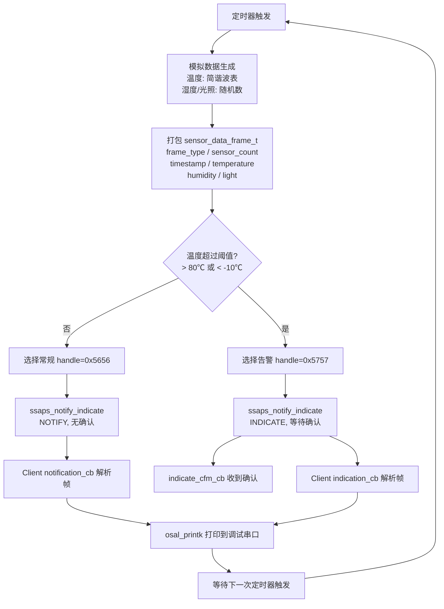
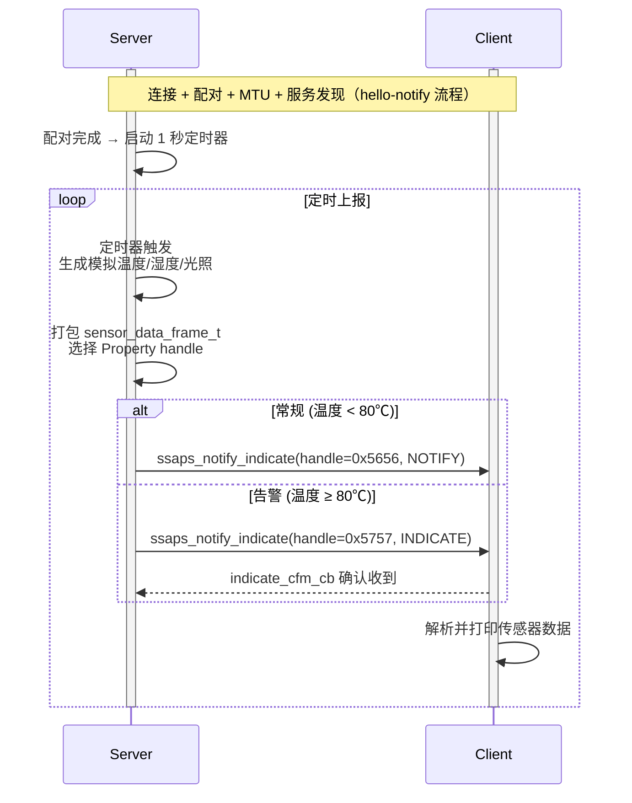
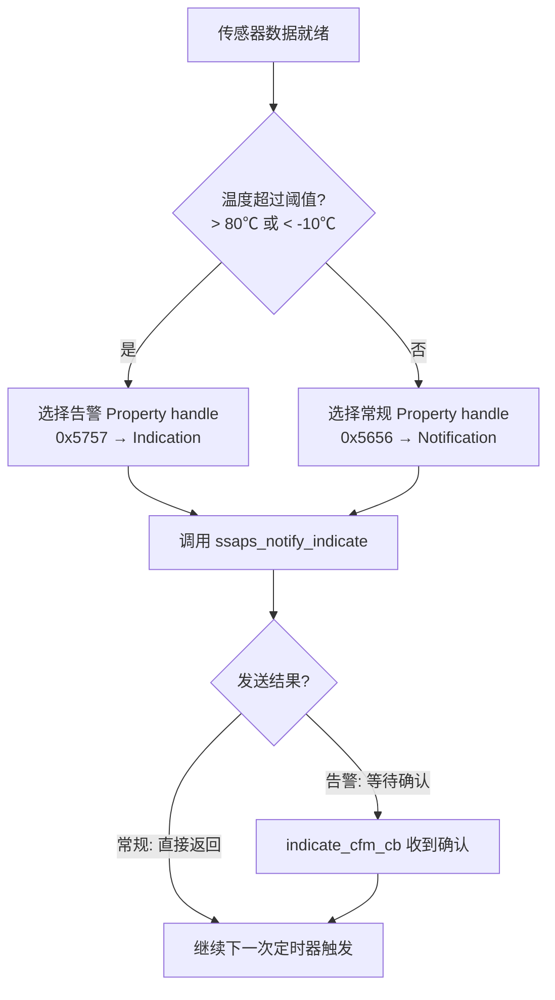

# 传感器上报

> SLE (SparkLink Low Energy) SSAP (SLE Service Access Protocol) 通知/指示、定时器、多传感器数据格式

> 前置阅读：[通知推送（Notify）](../basics/hello-notify.md)

## 学习目标

- 理解传感器数据上报的两种驱动模式：定时上报与事件触发上报
- 掌握多传感器数据包的结构化设计（结构体 vs TLV (Tag-Length-Value)）
- 掌握使用定时器周期性调用 `ssaps_notify_indicate()` 的实现方式
- 理解通知与指示在上报场景中的选择依据
- 能够在 hello-notify 的基础上实现定时传感器数据上报

## 规格与功能

本案例在 hello-notify 基础上，实现 Server 端多传感器数据定时上报——这是物联网设备最核心的功能模式。

| 规格项 | Server 端 | Client 端 |
|--------|----------|----------|
| 连接与配对 | 继承 hello-connect + hello-notify 的完整流程 | 同 Server |
| 数据流向 | Server → Client（单向推送） | 仅接收，不发送 |
| 上报模式 | 定时上报（1 秒间隔） + 事件触发（阈值告警） | — |
| 传感器数量 | 3 个（温度、湿度、光照） | — |
| 数据格式 | 结构化传感器帧（类型 + 值 + 时间戳） | 按帧头解析 |
| 发送方式 | Notification（常规数据）/ Indication（告警数据） | — |

程序运行流程：

1. Server 和 Client 建立连接、配对、MTU (Maximum Transmission Unit) 协商、服务发现（hello-notify 已完成的部分）
2. Server 启动 1 秒定时器，定时读取传感器数据
3. 每次定时器触发 → 读取 3 路传感器 → 打包成结构化帧 → `ssaps_notify_indicate()` 发送
4. 温度超过阈值 → 立即触发告警，使用 Indication（需确认）上报
5. Client 收到通知后解析帧，打印各传感器数值

> 如果你还没完成 hello-notify，建议先完成它。本篇假设你已经能让 Server 发出第一条通知。

## 基本概念

### 典型使用场景

传感器数据上报是 IoT 领域最基础也最高频的应用模式——设备采集环境/状态数据，通过无线方式上报给网关或手机。例如：

- **环境监测**：温湿度传感器定时上报数据到网关，网关汇聚后上传云端
- **设备状态监控**：电机转速、电流、温度定时上报，异常时立即告警
- **健康穿戴**：心率、血氧、步数定时同步到手机 App
- **工业传感器**：压力、流量、液位等 4~20mA 传感器数据通过 SLE 无线汇聚

### 两种上报模式

传感器数据上报有两种基本驱动模式，实际产品中通常同时使用：

| 模式 | 驱动方式 | 发送方式 | 典型场景 |
|------|---------|---------|---------|
| **定时上报** | 定时器周期性触发（如每 1 秒） | Notification（无需确认） | 常规数据采集、周期性状态同步 |
| **事件触发** | 传感器值超过预设阈值时立即触发 | Indication（需确认） | 告警、异常通知、按键事件 |

两种模式在同一个定时器回调中统一处理——定时器触发后，先打包数据，再根据是否超过阈值选择走哪条分支。区别仅在于选择哪个 Property handle（0x5656 vs 0x5757）发送。

> 由于 SDK的 `ssaps_notify_indicate()` 无法在调用时动态选择 Notification / Indication（行为由 CCCD (Client Characteristic Configuration Descriptor) 预先决定且互斥），本案例使用**双 Property 设计**——常规数据 Property（0x5656, NOTIFY）和告警数据 Property（0x5757, INDICATE），运行时按温度阈值选择对应 handle 发送。

### 多传感器数据格式设计

当设备有多个传感器时，需要一种结构化的方式打包数据。两种常见方案：

#### 方案 A：固定结构体（推荐，简单高效）

```c
// 传感器数据帧 — 固定长度，解析简单
typedef struct {
    uint8_t  frame_type;     // 帧类型: 0x01=定时上报, 0x02=告警
    uint8_t  sensor_count;   // 本帧包含的传感器数量
    uint32_t timestamp;      // 采集时间戳 (ms)
    int16_t  temperature;    // 温度 (×100, 单位℃)
    uint8_t  humidity;       // 湿度 (0~100%)
    uint16_t light;          // 光照 (lux)
} __attribute__((packed)) sensor_data_frame_t;
// 总大小: 12 字节
```

| 优点 | 缺点 |
|------|------|
| 解析速度快（直接强转指针） | 新增传感器类型需改结构体 |
| 内存占用小 | 空闲传感器字段也占空间 |
| 适合 MCU (Microcontroller Unit) 资源受限场景 | 不够灵活 |

#### 方案 B：TLV 格式（灵活，可扩展）

```text
[Type:1B][Length:1B][Value:N Bytes][Type:1B][Length:1B][Value:N Bytes]...
```

```c
// TLV 传感器数据 — 可变长度，可扩展
// 示例: [Type=温度][Len=2][Value=0x0B 0xB8][Type=湿度][Len=1][Value=0x3C]
typedef enum {
    SENSOR_TYPE_TEMPERATURE = 0x01,
    SENSOR_TYPE_HUMIDITY    = 0x02,
    SENSOR_TYPE_LIGHT       = 0x03,
    SENSOR_TYPE_PRESSURE    = 0x04,
} sensor_type_t;
```

| 优点 | 缺点 |
|------|------|
| 灵活扩展，新增传感器不破坏旧格式 | 解析需要遍历，速度较慢 |
| 不传输空闲传感器，节省带宽 | 每项多 2 字节头部开销 |
| 兼容不同版本固件 | 实现复杂度略高 |

> 传感器数量 ≤ 5 个且类型固定时，推荐用结构体方案。传感器类型经常变化或数量较多的场景，推荐用 TLV。

### 通信流程：单次上报的数据管线

下图展示定时器触发后，数据从生成到送达的单次转换链路：



关键点：从定时器触发到串口输出，数据经过了"生成 → 打包 → 按阈值分流 → 空中发送 → 对端解析 → 打印"六个环节。其中告警路径比常规路径多一次确认往返。

## 涉及 API

本案例在 hello-notify 的 API 基础上新增定时器和数据打包相关 API：

| API | 谁调用 | 用途 |
|-----|--------|------|
| `ssaps_notify_indicate()` | Server | 发送通知/指示（hello-notify 中已介绍） |
| `ssaps_register_callbacks()` | Server | 注册 SSAP Server 回调（含 `indicate_cfm_cb`） |
| `ssapc_register_callbacks()` | Client | 注册 SSAP Client 回调（含 `notification_cb`、`indication_cb`） |
| `ssaps_add_property_sync()` | Server | 添加 Property（本案例用两次，分别注册 NOTIFY 和 INDICATE） |
| `ssaps_add_descriptor_sync()` | Server | 添加描述符（常规用 USER_DESC，告警用 CCCD） |
| `osal_timer_init()` | Server | 初始化定时器结构体 |
| `osal_timer_start()` | Server | 启动定时器（在 `pair_complete_cb` 中调用） |
| `osal_timer_stop()` | Server | 停止定时器（断开连接时调用） |
| `osal_gettimeofday()` | Server | 获取系统时间戳（ms 级精度） |

> 传感器数据为模拟生成，不依赖 I2C/ADC 硬件。若需对接真实传感器，在定时器回调中替换模拟生成函数即可。

## 案例说明

### 案例简介

一块 WS63 做 Server，定时采集 3 路模拟传感器数据（温度、湿度、光照），每秒通过 SLE Notification 上报给 Client。当温度超过 80℃ 时，改用 Indication 发送告警帧，确保 Client 确认收到。

### 案例流程说明



### 与 hello-notify 的区别

- hello-notify：连接建立后发一次 "hello world"，证明数据通道通了
- 传感器上报：连接建立后持续周期性发送，是产品级的数据流模式
- 新增：定时器驱动、多传感器数据打包、通知/指示混用策略

## 案例操作指导

### 第一步：编译 Server 固件


启用 Kconfig 选项：

```text
Top → Application → Samples → BT → SLE → Sensor Report → [*] Sensor Report Server Sample
```

```bash
fbb build ws63-liteos-app
```

### 第二步：编译 Client 固件

```text
Top → Application → Samples → BT → SLE → Sensor Report → [*] Sensor Report Client Sample
```

### 第三步：烧录并运行


Server 先上电，Client 后上电。

### 第四步：观察上报数据

Client 串口预期输出：

```text
[sensor client] connected.
[sensor client] paired.
[sensor client] service discovered.
[sensor client] [T=0s] temp=25.3C, hum=62%, light=1200lux
[sensor client] [T=1s] temp=25.5C, hum=61%, light=1180lux
[sensor client] [T=2s] temp=25.8C, hum=62%, light=1210lux
...
[sensor client] [T=60s] temp=80.5C, hum=58%, light=1150lux
[sensor client] ** ALARM ** temperature exceed 80C!
```

## 关键配置

### 上报间隔选择

| 上报间隔 | 适用场景 | 功耗影响 | 带宽占用 |
|---------|---------|---------|---------|
| 100ms | 实时控制（电机转速、姿态） | 高 | 高 |
| 1s | 常规监测（温湿度、光照） | 中 | 中 |
| 10s | 缓慢变化量（气压、液位） | 低 | 低 |
| 60s+ | 日志型数据（日累计量） | 极低 | 极低 |

上报间隔由定时器周期控制：

```c
// osal_timer_init + osal_timer_start 二步模式
g_sensor_report_timer.handler  = sensor_report_timer_cb;
g_sensor_report_timer.data     = 0;
g_sensor_report_timer.interval = 1000;  // 1000ms = 1 秒
osal_timer_init(&g_sensor_report_timer);
// 配对完成后调用 osal_timer_start(&g_sensor_report_timer)
```

### 告警阈值配置

```c
// 告警阈值定义 (×100，与帧结构体中 int16_t 精度一致)
#define TEMP_ALARM_HIGH     8000   // 80.00℃
#define TEMP_ALARM_LOW      -1000  // -10.00℃

// 阈值比较逻辑 — 选择不同的 Property handle
uint16_t prop_handle;
if (temperature > TEMP_ALARM_HIGH || temperature < TEMP_ALARM_LOW) {
    frame.frame_type = 0x02;  // 告警帧
    prop_handle = g_alarm_property_handle;  // 0x5757 → Indication（需确认）
} else {
    frame.frame_type = 0x01;  // 普通帧
    prop_handle = g_data_property_handle;   // 0x5656 → Notification（无需确认）
}
ssaps_notify_indicate(conn_id, prop_handle,
                      SSAP_PROPERTY_TYPE_VALUE,
                      (uint8_t *)&frame, sizeof(frame));
```

### Property 权限配置（双 Property 分离）

```c
// 常规数据 Property (0x5656) — 仅 NOTIFY
#define DATA_PROP_PERMISSIONS   SSAP_PERMISSION_READ
#define DATA_PROP_OP_IND        (SSAP_OPERATE_INDICATION_BIT_READ | \
                                 SSAP_OPERATE_INDICATION_BIT_NOTIFY)
// 描述符: USER_DESCRIPTION, value={0x01,0x00} 预开启通知

// 告警数据 Property (0x5757) — 仅 INDICATE
#define ALARM_PROP_PERMISSIONS  SSAP_PERMISSION_READ
#define ALARM_PROP_OP_IND       (SSAP_OPERATE_INDICATION_BIT_READ | \
                                 SSAP_OPERATE_INDICATION_BIT_INDICATE)
// 描述符: CCCD, value={0x02,0x00} 预开启指示
```

两个 Property 分层在同一个 Service (0x5555) 下。关键区别在于描述符类型和操作指示位——CCCD是 SLE 规范的使能开关，Client 通过它告知 Server 自己期望接收哪种推送；USER_DESCRIPTION 仅作为元数据注释。

> **为什么不用一个 Property?** `ssaps_notify_indicate()` 的实际行为由 CCCD 预先决定——如果 CCCD 配置为 Notification 模式，调用时传 INDICATE 无效，反之亦然。两者互斥，无法在一个 Property 上同时支持两种模式。用两个 Property 是最简洁的解决方案——定时器回调中按温度阈值选择 `g_data_property_handle` 或 `g_alarm_property_handle` 发送。

## 代码详解

### 定时器驱动的上报循环

定时器回调中执行传感器模拟生成和数据打包：

```c
static void sensor_report_timer_cb(unsigned long arg)
{
    sensor_data_frame_t frame = {0};
    (void)arg;

    // 1. 检查连接状态
    if (!g_connected) {
        return;
    }

    // 2. 获取传感器数据（示例为模拟生成，实际产品替换为 I2C/ADC/GPIO 读取）
    int16_t temperature = read_temperature();  // 返回值 ×100 (如 2530 = 25.30℃)
    uint8_t humidity    = read_humidity();     // 0~100%
    uint16_t light      = read_light();        // lux

    // 3. 获取时间戳
    struct timeval tv;
    osal_gettimeofday(&tv);
    frame.timestamp = (uint32_t)(tv.tv_sec * 1000 + tv.tv_usec / 1000);

    // 4. 打包数据帧
    frame.sensor_count = 3;
    frame.temperature  = temperature;
    frame.humidity     = humidity;
    frame.light        = light;

    // 5. 按阈值选择 Property handle（双 Property 设计）
    uint16_t prop_handle;
    if (temperature > TEMP_ALARM_HIGH || temperature < TEMP_ALARM_LOW) {
        frame.frame_type = 0x02;               // 告警帧
        prop_handle = g_alarm_property_handle;  // 0x5757 → Indication
    } else {
        frame.frame_type = 0x01;               // 常规帧
        prop_handle = g_data_property_handle;   // 0x5656 → Notification
    }

    // 6. 发送（handle 决定走 Notification 还是 Indication）
    ssaps_ntf_ind_t param = {
        .handle    = prop_handle,
        .type      = SSAP_PROPERTY_TYPE_VALUE,
        .value     = (uint8_t *)&frame,
        .value_len = sizeof(frame)
    };
    ssaps_notify_indicate(g_server_id, g_sle_conn_hdl, &param);
}
```

### 适配真实传感器

示例代码中的 `read_temperature()`、`read_humidity()`、`read_light()` 为模拟生成函数（不依赖硬件外设，便于快速验证数据通道）。适配真实传感器时，只需替换这三个函数的实现。

**适配步骤：**

1. 保留数据帧结构体 `sensor_data_frame_t` 和上报逻辑不动
2. 将模拟生成函数替换为硬件读取函数（I2C (Inter-Integrated Circuit) / ADC (Analog-to-Digital Converter) / GPIO (General Purpose Input/Output) 驱动）
3. 确保传感器返回值的数据范围与帧结构体一致：

| 字段 | 类型 | 精度 | 示例 | 注意事项 |
|------|------|------|------|---------|
| `temperature` | `int16_t` | ×100 | `2530` = 25.30℃ | 范围 -4000~+8500，别与 ×10 混淆 |
| `humidity` | `uint8_t` | 1:1 | `62` = 62% | 范围 0~100 |
| `light` | `uint16_t` | 1:1 | `1200` = 1200 lux | 范围 0~65535 |
| `timestamp` | `uint32_t` | ms | `osal_gettimeofday()` | 同一 API 获取，无需改动 |

**示例 — 替换为 I2C 温度传感器（SHT30）：**

```c
// 替换前（模拟）
int16_t temperature = get_simulated_temperature();

// 替换后（真实传感器）
uint8_t sht30_buf[6];
i2c_read(SHT30_I2C_ADDR, 0x00, sht30_buf, 6);
uint16_t raw = (sht30_buf[0] << 8) | sht30_buf[1];
int16_t temperature = (int16_t)(-4500 + 17500 * raw / 65535);  // SHT30 公式, ×100
```

定时器回调中的打包和发送逻辑完全不需要修改——只要 `read_*()` 函数的返回值格式不变，上报管线自动适配。

### 扩展更多传感器

实际产品中传感器数量远不止三个。示例的固定结构体方案适合传感器类型确定的场景，当传感器数量和类型动态变化时，需要不同的扩展策略。

**策略 A — 扩展固定结构体（传感器类型固定）**

适合已知传感器清单的产品（如一款温湿度计永远只上报温度+湿度）。直接在结构体末尾追加字段，handle 编号只增不改：

```c
typedef struct {
    uint8_t  frame_type;
    uint8_t  sensor_count;          // 改为实际传感器数量
    uint32_t timestamp;
    // 原有字段不动
    int16_t  temperature;
    uint8_t  humidity;
    uint16_t light;
    // v2.0 新增字段（追加在末尾）
    int16_t  pressure;              // 气压 (×10, hPa)
    uint16_t pm25;                  // PM2.5 (μg/m³)
} __attribute__((packed)) sensor_data_frame_v2_t;
```

关键原则：**旧字段不动，新字段追加在末尾**。这样旧版 Client 收到新版帧时，多余字节被忽略；新版 Client 收到旧版帧时，检查 `data_len` 判断版本。

**策略 B — TLV 格式（传感器动态变化）**

适合传感器模块可插拔、不同固件版本传感器配置不同的产品。帧结构变为可变长度：

```text
[frame_type:1B][sensor_count:1B][timestamp:4B] [T:1B][L:1B][V:NB] [T:1B][L:1B][V:NB] ...
```

```c
// TLV 传感器帧 — 只传输有数据的传感器，空闲传感器不占空间
#define SENSOR_TYPE_TEMP      0x01  // Value: int16_t (×100)
#define SENSOR_TYPE_HUMIDITY  0x02  // Value: uint8_t
#define SENSOR_TYPE_LIGHT     0x03  // Value: uint16_t
#define SENSOR_TYPE_PRESSURE  0x04  // Value: int16_t (×10)
#define SENSOR_TYPE_PM25      0x05  // Value: uint16_t

// 打包（仅打包有数据的传感器）
void pack_tlv_frame(uint8_t *buf, uint16_t *len) {
    uint8_t *p = buf;
    *p++ = 0x01; *p++ = 3;  // frame_type + sensor_count 暂填
    p += 4;                  // timestamp 稍后填

    if (has_temperature()) {
        *p++ = SENSOR_TYPE_TEMP; *p++ = 2;
        int16_t val = read_temperature();
        memcpy(p, &val, 2); p += 2;
    }
    if (has_humidity()) {
        *p++ = SENSOR_TYPE_HUMIDITY; *p++ = 1;
        *p++ = read_humidity();
    }
    // ...更多传感器按需追加
    buf[1] = /* 实际传感器计数 */;
    *len = p - buf;
}
```

| | 固定结构体 | TLV |
|:---|:---|:---|
| 实现复杂度 | 低——直接强转指针 | 中——需要编解码逻辑 |
| MTU 利用率 | 低——未使用的字段也占空间 | 高——只传有数据的传感器 |
| 扩展性 | 差——加字段需双方升级 | 好——新传感器类型独立编号 |
| 适用场景 | 传感器类型固定的产品（≤10 种） | 传感器模块化、数量不确定的产品 |
| 版本兼容 | 靠 `data_len` 判断 | 靠 type 编号，未知 type 跳过 |

> 传感器 ≤ 5 个且类型固定，用固定结构体。传感器热插拔、类型经常变化、或超过 10 种，用 TLV。两者不是互斥的——可以先从固定结构体起步，产品迭代到需要灵活性时切换到 TLV。

### Client 端接收与解析

常规数据走 `notification_cb`，告警数据走 `indication_cb`——两个回调由不同的 Property handle 触发：

```c
// notification_cb — 接收常规传感器数据（handle=0x5656 触发）
void sle_sensor_report_notification_cb(uint8_t client_id, uint16_t conn_id,
                                        ssapc_handle_value_t *data, errcode_t status)
{
    if (data == NULL || data->data == NULL ||
        data->data_len != sizeof(sensor_data_frame_t)) {
        return;
    }
    sensor_data_frame_t *frame = (sensor_data_frame_t *)data->data;
    printf("[sensor] [T=%ums] temp=%d.%02dC, hum=%u%%, light=%ulux, type=0x%02x\r\n",
           frame->timestamp,
           frame->temperature / 100, frame->temperature % 100,
           frame->humidity, frame->light, frame->frame_type);
}

// indication_cb — 接收告警数据（handle=0x5757 触发）
void sle_sensor_report_indication_cb(uint8_t client_id, uint16_t conn_id,
                                      ssapc_handle_value_t *data, errcode_t status)
{
    if (data == NULL || data->data == NULL) {
        return;
    }
    sensor_data_frame_t *frame = (sensor_data_frame_t *)data->data;
    printf("[sensor] ** ALARM ** temp=%d.%02dC exceeds threshold! type=0x%02x\r\n",
           frame->temperature / 100, frame->temperature % 100,
           frame->frame_type);
}
```

> `notification_cb` 和 `indication_cb` 是 `ssapc_register_callbacks()` 中注册的两个不同回调，分别对应 Server 的常规数据 Property (0x5656) 和告警数据 Property (0x5757)。Client 不需要根据 `frame_type` 区分——回调类型本身就是区分方式。解析帧时务必检查 `data_len`，防止新旧固件结构体不一致导致越界。

### Server 端初始化与定时器创建

```c
static errcode_t sensor_server_init(void)
{
    // 1. 注册 SSAP Server
    ssaps_register_server(&g_server_id);
    ssaps_register_callbacks(&g_ssaps_callbacks);  // 含 indicate_cfm_cb

    // 2. 添加 Service + 两个 Property
    ssaps_add_service_sync(g_server_id, &service_info);
    // 常规数据 Property: 0x5656, OPERATE_INDICATION=READ|NOTIFY, 描述符=USER_DESC
    add_data_property();    // 注册后保存 g_data_property_handle
    // 告警数据 Property: 0x5757, OPERATE_INDICATION=READ|INDICATE, 描述符=CCCD
    add_alarm_property();   // 注册后保存 g_alarm_property_handle
    ssaps_start_service(g_server_id);

    // 3. 定时器: osal_timer_init + osal_timer_start 二步模式
    g_sensor_report_timer.handler  = sensor_report_timer_cb;
    g_sensor_report_timer.data     = 0;
    g_sensor_report_timer.interval = 1000;
    osal_timer_init(&g_sensor_report_timer);
    // 配对完成后在 pair_complete_cb 中调用 osal_timer_start()

    // 4. 配置广播并启动
    sle_set_default_announce_param();
    sle_set_default_announce_data();
    sle_start_announce(1);
    return ERRCODE_SUCC;
}
```

> `osal_timer_init` 必须在设置 `handler` 和 `data` 后调用，此后不能再修改这两个字段。`interval` 在 `osal_timer_start` 前设置即可。

### 双 Property 的选择策略

由于 SDK的 `ssaps_notify_indicate()` 行为由 CCCD 预先决定而非调用时参数指定，本案例用两个 Property 在注册阶段区分 Notification 和 Indication。发送时按如下策略选择 handle：



| 数据性质 | 使用 Property | 传输方式 | 确认机制 | 理由 |
|---------|:---:|---------|:---:|------|
| 常规周期性数据（温度、湿度、光照） | 0x5656 | Notification | 无确认 | 下一帧马上就到，单帧丢失无影响 |
| 告警/异常数据（超阈值） | 0x5757 | Indication | `indicate_cfm_cb` 确认 | 必须确保对端收到 |

> **设计启示**：如果你的场景需要同时支持通知和指示，不需要在一个 Property 上纠结——直接用两个 Property 是最简单的方案。一个 Service 下挂多个 Property 是 SSAP 模型的标准用法。

---

