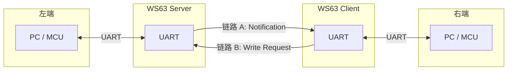
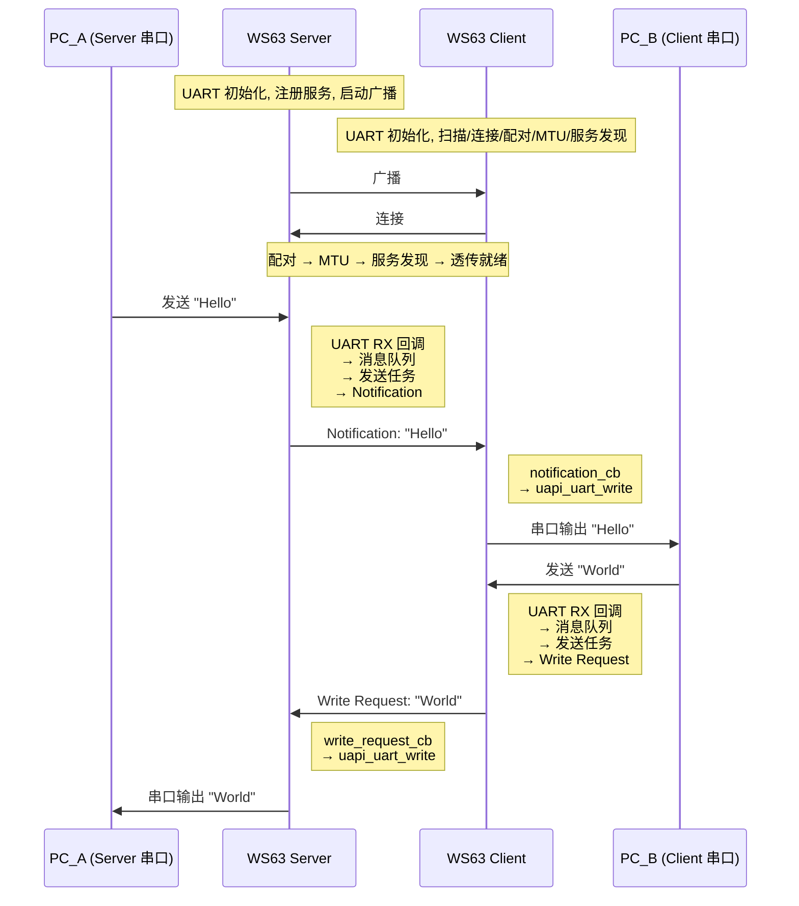
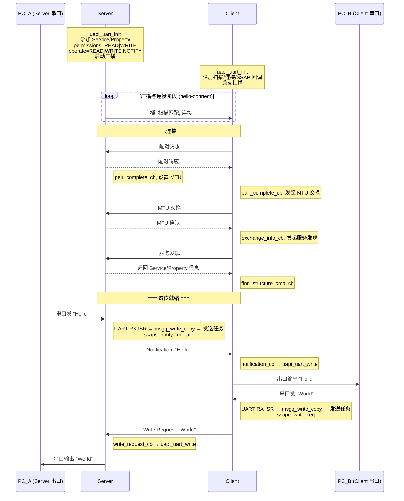
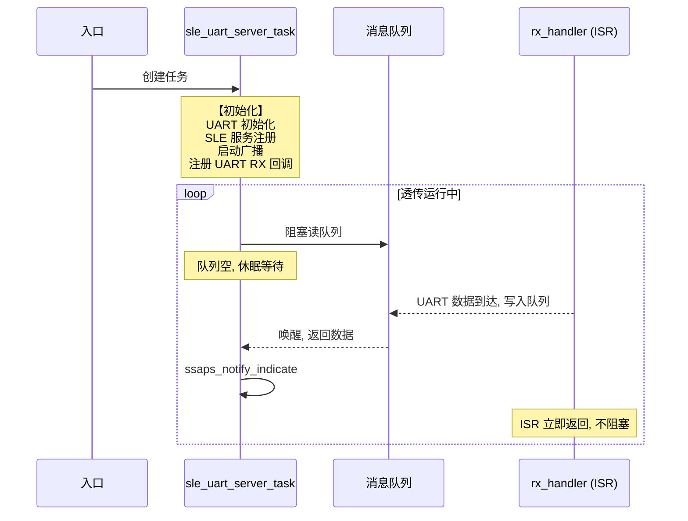
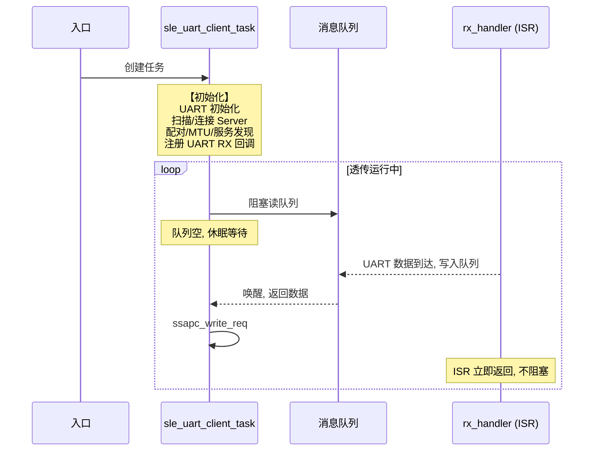

# UART 透传

> 透传桥接 — UART (Universal Asynchronous Receiver/Transmitter) over SLE (SparkLink Low Energy) — SLE SSAP (SLE Service Access Protocol) 通知/写入、UART 驱动、消息队列、双向透传

> 前置阅读：[Hello SLE](../basics/hello-connect.md)、[通知推送（Notify）](../basics/hello-notify.md)、[属性读写（Read/Write）](../basics/hello-readwrite.md)

## 学习目标

- 理解"透传桥接"的核心概念：将 UART 串口数据透明地搬运到 SLE 无线链路，反之亦然
- 掌握 Server 端 UART RX (Receive) → SLE Notification → Client UART TX (Transmit) 的数据转发链路
- 掌握 Client 端 UART RX → SLE Write Request → Server UART TX 的反向数据链路
- 理解消息队列在解耦 UART 中断与 SLE 发送中的作用
- 理解连接状态守护（仅已连接时发送）的必要性和实现方式
- 能够编译、烧录并让两块 WS63 开发板实现双向串口透传

## 规格与功能

本案例将 hello 三部曲的全部能力——连接、通知、读写——与 UART 驱动组合，构建一条无线串口线。Server 是透传枢纽，Client 是另一端，两端通过 UART 分别接入两台 PC。

| 规格项 | Server 端 | Client 端 |
|--------|----------|----------|
| 广播/扫描 | 上电后持续广播 | 上电后扫描并连接 Server |
| 配对 | 被动等待配对 | 连接成功后主动发起配对 |
| MTU (Maximum Transmission Unit) | 配对完成后设置 520 字节 | 配对完成后发起 MTU 交换 |
| 服务发现 | — | 遍历 Server 的 Service / Property / Descriptor |
| 数据链路 A Server→Client | UART RX 收到数据 → Notification 推送 | notification_cb → UART TX 吐出 |
| 数据链路 B Client→Server | write_request_cb → UART TX 吐出 | UART RX 收到数据 → Write Request 发送 |
| 连接管理 | 断开后自动重新广播 | 断开后自动重新扫描 |

程序运行流程：

1. Server 上电 → 初始化 UART → 注册服务（Property 可读写可通知） → 启动广播
2. Client 上电 → 初始化 UART → 扫描并连接 Server → 配对 → MTU → 服务发现
3. 连接完成后进入"透传就绪"状态
4. PC_A 通过串口向 Server 发送数据 → Server UART RX → SLE Notification → Client → UART TX → PC_B 收到
5. PC_B 通过串口向 Client 发送数据 → Client UART RX → SLE Write Request → Server → UART TX → PC_A 收到

> hello 三部曲已经覆盖了连接、通知、读写的所有基础。本篇将它们组合起来，加上 UART 驱动和消息队列，形成真正的双向数据通道。

## 基本概念

### 典型使用场景

透传桥接是最常见的 SLE 应用形态——两块 WS63 分别接在两台 MCU/PC 的串口上，中间通过 SLE 无线链路透明传输数据，两侧 MCU (Microcontroller Unit) 无需感知无线层的存在。例如：

- **工业传感器网关**：RS485 (Recommended Standard 485) 传感器数据通过 SLE 无线汇聚到网关
- **无线调试器**：远程 MCU 的调试串口通过 SLE 映射到本地 PC
- **数传模块替代**：用 SLE 替代传统 433MHz/2.4GHz 数传模块，获得更高带宽和更低延迟
- **智能设备配网/配置**：手机通过 SLE 串口透传向设备发送配置指令

### 什么是"透传"

透传 = 透明传输。对两端设备来说，它们只是在和各自的 UART 串口通信，并不感知中间 SLE 无线链路的存在。发送方串口收什么，接收方串口就吐什么，数据内容不做任何解析或修改。

> 两个 WS63 之间通过 SLE 无线连接，但两端的 PC/MCU 看到的是标准的 UART 接口——对它们来说，这就是一根"无线串口延长线"。

### 双向数据流

hello-notify 是单向（Server→Client），hello-readwrite 是 Client 主动的双向交互；而透传桥接是**全双工**的——Server 和 Client 随时可能向对方发数据，方向完全由串口数据驱动。两端设备地位完全对等，没有"谁主动"的概念。



- **链路 A**（Server → Client）：Server 串口收到数据 → 消息队列 → `ssaps_notify_indicate()` → Client `notification_cb` → `uapi_uart_write()` → Client 串口吐出
- **链路 B**（Client → Server）：Client 串口收到数据 → 消息队列 → `ssapc_write_req()` → Server `write_request_cb` → `uapi_uart_write()` → Server 串口吐出

两条链路独立运行、互不阻塞，发送路径均通过消息队列解耦。消息队列的使用原因和实现方式详见代码详解第 7 节。

### 通信流程: 双向透传

下图展示从两块板子上电到双向透传的完整流程：



### 与 hello 三部曲的递进关系

| 篇 | 主题 | 数据方向 | 谁主动 |
|----|------|---------|-------|
| hello-connect | 广播与连接 | — | — |
| hello-notify | 通知推送 | Server → Client | Server |
| hello-readwrite | 读写交互 | Client ↔ Server | Client |
| 透传桥接 | 双向数据通道 | Server ↔ Client | 串口驱动 |

hello 三部曲覆盖了 SLE 开发的三块基石。透传桥接是这三块基石的**组合应用**：用通知实现 Server→Client 链路，用写入实现 Client→Server 链路，用连接管理保证链路可用。

## 涉及 API

| API | 谁调用 | 用途 |
|-----|--------|------|
| `uapi_uart_init()` / `uapi_uart_deinit()` | Server & Client | 初始化/去初始化 UART 外设 |
| `uapi_uart_register_rx_callback()` | Server & Client | 注册 UART 接收中断回调（ISR (Interrupt Service Routine) 上下文） |
| `uapi_uart_write()` | Server & Client | 通过 UART 发送数据（SLE 收到的数据从这里吐出） |
| `ssaps_notify_indicate()` | Server | 将 UART 收到的数据通过通知推送给 Client |
| `ssapc_write_req()` | Client | 将 UART 收到的数据通过写请求发送给 Server |
| `ssaps_write_request_cb` | Server | 收到 Client 写来的数据 → 调用 `uapi_uart_write()` 吐出 |
| `ssapc_notification_cb` | Client | 收到 Server 推送的数据 → 调用 `uapi_uart_write()` 吐出 |
| `osal_msg_queue_create()` / `osal_msg_queue_write_copy()` / `osal_msg_queue_read_copy()` | Server | 消息队列：解耦 ISR 数据接收与任务 SLE 发送；传递断开连接等控制信号 |
| `sle_uart_server_is_connected()` / `sle_uart_client_is_connected()` | Server / Client | UART RX 回调中检查是否有已连接的设备 |

> 前两篇 (hello-notify + hello-readwrite) 的 API 复用（通知发送 + 属性写入），本篇新增约 6 个 UART + 消息队列相关 API。高级特性（低延迟模式、流控）涉及 `sle_low_latency.h` 和 `sle_transmission_manager.h`，本文不做展开。

## 案例说明

### 案例简介

两块 WS63 分别接 PC 串口，PC_A 串口发 → PC_B 串口收，PC_B 串口发 → PC_A 串口收，实现**无线串口线**。

### 硬件连接

```text
PC_A ←→ USB-TTL ←→ WS63_A (Server) ~~~~ SLE 无线 ~~~~ WS63_B (Client) ←→ USB-TTL ←→ PC_B
```

每块 WS63 通过 UART0 (TX/RX/GND)连接到 USB (Universal Serial Bus) 转串口工具，USB-TTL 插入 PC。两块板子分别供电。

### 通信模型

与 hello 三部曲不同，透传桥接没有"谁主动"的概念——两端都是被动的数据搬运工，数据方向完全由串口决定。Server 和 Client 的角色仅在 SLE 连接层面有意义（Server 广播 + 持有服务，Client 扫描 + 发起连接），在数据层面两者完全对等。

### 案例流程说明



## 案例操作指导

### 第一步：硬件接线

两块 WS63 的 UART0 (TX/RX/GND) 分别接到两个 USB-TTL 模块：

| WS63 引脚 | USB-TTL 引脚 |
|-----------|-------------|
| UART0 TX | RX |
| UART0 RX | TX |
| GND | GND |

USB-TTL 模块插入 PC。两块板子分别通过 USB 供电。

> **TODO**：硬件接线图。

### 第二步：编译 Server 固件

打开 menuconfig，启用 Server，按需调整参数：

```text
Top → Application → Samples → BT → SLE → SLE UART
  → [*] SLE UART Server Sample
  → (115200) UART Baudrate
  → (512)    UART RX Buffer Size
  → (8)      Message Queue Depth
  → (520)    Message Queue Item Size
  → (520)    SLE MTU Size
  → (12)     Connection Interval (×1.25ms)
```

```bash
fbb build ws63-liteos-app
fbb build ws63-liteos-app
```

### 第三步：编译 Client 固件

同上，改为启用 Client（参数配置与 Server 保持一致）：

```text
Top → Application → Samples → BT → SLE → SLE UART
  → [*] SLE UART Client Sample
  → (参数同上)
```

### 第四步：烧录并运行


将 Server 固件烧录到板子 A，Client 固件烧录到板子 B。

**先给 Server 上电**，预期串口输出：

```text
[sle uart server] uart init ok, baud=115200
[sle uart server] service added, ready for connection
[sle uart server] start announce success
[sle uart server] waiting for connection...
[sle uart server] connected, conn_id=0x01
[sle uart server] pair complete
[sle uart server] === bridge ready ===
```

**再给 Client 上电**，预期串口输出：

```text
[sle uart client] uart init ok, baud=115200
[sle uart client] start seek...
[sle uart client] found uart_server, connecting...
[sle uart client] connected, conn_id=0x01
[sle uart client] pair complete
[sle uart client] service discovery complete
[sle uart client] === bridge ready ===
```

### 第五步：验证透传

1. PC_A 打开串口助手（115200, 8N1），连接 Server 的 USB-TTL 串口
2. PC_B 打开串口助手（115200, 8N1），连接 Client 的 USB-TTL 串口
3. PC_A 串口助手输入 "Hello" → PC_B 串口助手显示 "Hello"
4. PC_B 串口助手输入 "World" → PC_A 串口助手显示 "World"

双向都能收发即为成功。如果只有单向通，检查对应方向的链路代码（Server→Client 检查 notification_cb，Client→Server 检查 write_request_cb）。

## 关键配置

### 可配置参数速查

以下参数通过 `menuconfig` 统一管理（路径：`Top → Application → Samples → BT → SLE → SLE UART`），修改后重新编译即可生效，无需改动源码。

| 参数 | Kconfig 符号 | 默认值 | 说明 |
|------|-------------|--------|------|
| UART 波特率 | `CONFIG_SLE_UART_BAUDRATE` | `115200` | 最常见的串口配置，兼容绝大多数 MCU 和串口工具 |
| UART 数据位 | —（固定在代码中） | `UART_DATA_BIT_8` | 8 位数据 |
| UART 停止位 | —（固定在代码中） | `UART_STOP_BIT_1` | 1 位停止 |
| UART 校验 | —（固定在代码中） | `UART_PARITY_NONE` | 无校验 (8N1) |
| UART 流控 | —（固定在代码中） | 无 (`PIN_NONE`) | 不使用硬件流控 |
| UART 总线 | `CONFIG_UART_BUS_ID` | 芯片默认 | WS63 透传使用的 UART 总线 |
| UART RX 缓冲区 | `CONFIG_SLE_UART_RX_BUF_SIZE` | `512` | 太小导致频繁分包，太大浪费内存 |
| 消息队列深度 | `CONFIG_SLE_UART_MSGQ_LEN` | `8` | 决定突发数据缓冲能力 |
| 消息队列每项大小 | `CONFIG_SLE_UART_MSGQ_ITEM_SIZE` | `520` | 对应 MTU 上限，容纳一次最大 SLE 数据包 |
| MTU 大小 | `CONFIG_SLE_UART_MTU_SIZE` | `520` | 与 hello 系列保持一致 |
| 连接间隔 | `CONFIG_SLE_UART_CONN_INTERVAL` | `12` (×1.25ms = 15ms) | 影响延迟和功耗的核心参数 |
| Property 权限 | —（固定在代码中） | `READ \| WRITE` | 可读可写（Client 需要写权限来发送数据） |
| 操作指示 | —（固定在代码中） | `READ \| WRITE \| NOTIFY` | Server 支持读、通知推送、以及接收写入 |

> 数据位/停止位/校验/流控等 UART 物理层参数极少需要修改，直接在代码中定义即可。波特率、缓冲区、队列、MTU、连接间隔是调优高频参数，通过 Kconfig 控制可以避免改代码、方便快速验证不同配置。

## 关键性能指标

透传桥接的性能取决于四个因素：UART 波特率、SLE 连接间隔、PHY (Physical Layer) 速率和 MTU 大小。

> 以下数据基于典型配置：**115200 bps、连接间隔 12.5ms、1M PHY、MTU 520 字节**。

### 指标速览

| 指标 | 典型值 | 关键约束 |
|------|--------|---------|
| UART 理论上限 | **~10 KB/s** 净载荷 | 串口硬上限，SLE 再快也无法突破 |
| SLE 单向吞吐量 | 理论 **~40 KB/s**，实际 **20~30 KB/s** | SLE 不是瓶颈（115200 串口跑满仅 ~10 KB/s） |
| 单包延迟 | **15~30 ms** | 连接间隔是最大头（12.5ms 间隔 → 平均等待 6.25ms） |
| 双向同时满载吞吐量 | 各方向 **~6~7 KB/s** | TDD 时隙抢占，约为单向的 60~70% |
| 丢包率 | 正常情况 **无丢包** | 只在消息队列满时发生 |
| 持续透传功耗 | **5~10 mA** | 约空闲态的 5 倍 |
| 重连恢复时间 | **500ms~2s** | 取决于广播间隔和扫描窗口 |

### 各指标详解

**UART 理论上限**

115200 bps 含起始位和停止位后约 10 KB/s 净载荷。这是串口侧的硬上限——无论 SLE 多快，透传速率不可能超过串口波特率。

**SLE 单方向有效吞吐量**

1M PHY、连接间隔 12.5ms 下，通知连续发送约 80 包/秒，520 字节/包，理论值约 40 KB/s。实际受协议栈调度和流控影响，可用约 20~30 KB/s。115200 串口跑满仅 ~10 KB/s，SLE 侧不是瓶颈；若使用更高波特率（如 460800 ≈ 45 KB/s），需缩小连接间隔或使用 2M PHY 才能匹配。

**单包延迟**

| 延迟组成 | 耗时 | 说明 |
|---------|------|------|
| 消息队列传递 | < 1ms | ISR → 任务唤醒 |
| 连接间隔等待 | 平均 6.25ms | 12.5ms 间隔下的平均等待 |
| 空中传输 + 对端处理 | 数 ms | 协议栈收发 + UART 输出 |

延迟主要集中在连接间隔等待。使用低延迟连接间隔（如 7.5ms）可将总延迟降至 8~15ms，但功耗相应增加。

**双向吞吐量**

SLE 是 TDD（时分双工），双向数据在同一频点轮流传输，同时满载时互相抢占时隙：

| 场景 | Server→Client | Client→Server |
|------|:---:|:---:|
| 仅单向满载 | ~10 KB/s（串口瓶颈） | ~10 KB/s（串口瓶颈） |
| 双向同时满载 | ~6~7 KB/s | ~6~7 KB/s |

如果应用需要双向高速透传，建议将波特率控制在 SLE 双向有效吞吐量以内。

**丢包原因与对策**

丢包的唯一原因是 UART RX 速率超过 SLE 发送速率且消息队列满：

| 对策 | 做法 | 代价 |
|------|------|------|
| 降低发送速率 | 上位机控制发送间隔 | 吞吐量下降 |
| 增大缓冲 | 提高消息队列深度 | 内存占用增加 |
| 硬件流控 | 启用 RTS/CTS，队列接近满时拉高 RTS (Request To Send) | 多占用两个 GPIO (General Purpose Input/Output) |

**功耗参考**

| 状态 | 电流 | 说明 |
|------|------|------|
| 广播/扫描态 | 3~5mA | 上电等待连接 |
| 连接态空闲 | 1~2mA | 有连接无数据 |
| 连接态持续透传 | 5~10mA | 串口满载时的典型功耗 |

**重连恢复流程**

| 阶段 | 耗时 | 说明 |
|------|------|------|
| Server 重新广播 | 25ms 间隔 | 广播包间隔 |
| Client 扫描发现 | 125ms 窗口 | 扫描窗口长度 |
| 连接 + 配对 | 数百 ms | 协议交互 |
| MTU 交换 + 服务发现 | 数十 ms | 属性遍历 |
| **总计** | **500ms~2s** | 取决于广播间隔和扫描窗口 |

若应用对断连敏感，可缩小广播间隔加速重连，但待机功耗会增加。

**性能调优要点**

| 目标 | 调优方向 | 副作用 |
|------|---------|-------|
| 降低延迟 | 缩小连接间隔 | 增加功耗 |
| 提高吞吐 | 增大 MTU、使用 2M/4M PHY | 受限于对端能力和距离 |
| 防止丢数 | 启用 RTS/CTS 流控 | 多占用两个 GPIO |
| 加速重连 | 缩小广播间隔、扫描窗口 | 增加待机功耗 |

> 详细的吞吐量测试方法和数据见 [吞吐量测试](../test-debug/throughput-test.md)。

## 代码详解

### 1. 工程目录结构

```text
src/application/samples/bt/sle/sle_uart/
├── CMakeLists.txt
├── sle_uart.c                    # 入口文件, 区分 Server/Client 编译, 含 UART ISR
├── sle_uart_server/
│   ├── sle_uart_server.c         # Server 端: 服务注册、通知发送
│   ├── sle_uart_server.h         # Server 端头文件: UUID/权限/操作指示宏
│   ├── sle_uart_server_adv.c     # Server 端: 广播配置
│   └── sle_uart_server_adv.h
├── sle_uart_client/
│   ├── sle_uart_client.c         # Client 端: 扫描、连接、写请求、低延迟接收
│   └── sle_uart_client.h         # Client 端头文件
└── Kconfig
```

与 hello 三部曲的目录结构一致。`sle_uart.c` 是入口，通过 Kconfig 区分编译 Server 或 Client。两端的 UART RX 中断回调和发送任务在各自的源文件中实现。

`Kconfig` 负责定义所有可配置参数，让波特率、队列深度、MTU 等无需修改源码即可调整：

```kconfig
choice
    prompt "SLE UART Mode"

config SLE_UART_SERVER_SAMPLE
    bool "SLE UART Server Sample"

config SLE_UART_CLIENT_SAMPLE
    bool "SLE UART Client Sample"
endchoice

config SLE_UART_BAUDRATE
    int "UART Baudrate"
    default 115200
    depends on SLE_UART_SERVER_SAMPLE || SLE_UART_CLIENT_SAMPLE

config SLE_UART_RX_BUF_SIZE
    int "UART RX Buffer Size (bytes)"
    default 512
    depends on SLE_UART_SERVER_SAMPLE || SLE_UART_CLIENT_SAMPLE

config SLE_UART_MSGQ_LEN
    int "Message Queue Depth"
    default 8
    depends on SLE_UART_SERVER_SAMPLE || SLE_UART_CLIENT_SAMPLE

config SLE_UART_MSGQ_ITEM_SIZE
    int "Message Queue Item Size (bytes)"
    default 520
    depends on SLE_UART_SERVER_SAMPLE || SLE_UART_CLIENT_SAMPLE

config SLE_UART_MTU_SIZE
    int "SLE MTU Size"
    default 520
    depends on SLE_UART_SERVER_SAMPLE || SLE_UART_CLIENT_SAMPLE

config SLE_UART_CONN_INTERVAL
    int "Connection Interval (×1.25ms)"
    default 12
    range 6 32
    depends on SLE_UART_SERVER_SAMPLE || SLE_UART_CLIENT_SAMPLE
    help
        Connection interval in units of 1.25ms.
        12 = 15ms, lower values reduce latency but increase power consumption.
```

**入口文件** `sle_uart.c` 负责创建任务并启动整个透传流程。Server 和 Client 的任务在这里通过 `osal_kthread_create` 创建，之后各任务内部完成 UART 初始化、SLE 服务注册/扫描、并进入消息队列消费循环：

```c
#include "soc_osal.h"
#include "app_init.h"

#if defined(CONFIG_SLE_UART_SERVER_SAMPLE)
#include "sle_uart_server.h"
#elif defined(CONFIG_SLE_UART_CLIENT_SAMPLE)
#include "sle_uart_client.h"
#endif

#define SLE_UART_TASK_PRIO         28
#define SLE_UART_TASK_STACK_SIZE   0x1000

#if defined(CONFIG_SLE_UART_SERVER_SAMPLE)
static void *sle_uart_server_task(const char *arg);  /* 第 3 节: msgq 消费 + Notification 发送 */
#elif defined(CONFIG_SLE_UART_CLIENT_SAMPLE)
static void *sle_uart_client_task(const char *arg);  /* 第 5 节: msgq 消费 + Write Request 发送 */
#endif

static void sle_uart_entry(void)
{
    osal_task *task_handle = NULL;
    osal_kthread_lock();
#if defined(CONFIG_SLE_UART_SERVER_SAMPLE)
    task_handle = osal_kthread_create((osal_kthread_handler)sle_uart_server_task, 0,
                                      "SLEUartServer", SLE_UART_TASK_STACK_SIZE);
#elif defined(CONFIG_SLE_UART_CLIENT_SAMPLE)
    task_handle = osal_kthread_create((osal_kthread_handler)sle_uart_client_task, 0,
                                      "SLEUartClient", SLE_UART_TASK_STACK_SIZE);
#endif
    if (task_handle != NULL) {
        osal_kthread_set_priority(task_handle, SLE_UART_TASK_PRIO);
    }
    osal_kthread_unlock();
}

app_run(sle_uart_entry);
```

> 两个任务各有一个消息队列消费循环（`while(1)` + `msgq_read_copy`），队列空时阻塞休眠，数据到达后唤醒。这就是第 7 节描述的生产者-消费者模型中的"消费者"。

**任务与 ISR 职责总览**：

**Server 端**——ISR 写队列 → 任务阻塞读 → `ssaps_notify_indicate` 推送至 Client：



**Client 端**——ISR 写队列 → 任务阻塞读 → `ssapc_write_req` 发送至 Server：



- **入口**：`sle_uart_entry`，通过 Kconfig 创建 Server 或 Client 任务，一次性执行
- **任务**：初始化后进入 `while(1)` 循环，阻塞读队列 → SLE 发送 → 再次阻塞。Server 调用 `ssaps_notify_indicate`，Client 调用 `ssapc_write_req`
- **ISR**：UART 中断触发，校验数据 → 检查连接 → 写入队列，立即返回。两端逻辑完全相同
- **消息队列**：内核对象，ISR（生产者）写 → 任务（消费者）读，是两者之间唯一的交互点

### 2. UART 初始化与配置

Server 和 Client 的 UART 初始化代码完全相同。WS63 使用 `uapi_uart_init()` 一次性完成引脚、属性和缓冲区的配置，其参数定义：

| 结构体 | 字段 | 取值 | 含义 |
|--------|------|------|------|
| `uart_attr_t` | `baud_rate` | `CONFIG_SLE_UART_BAUDRATE` | 波特率，通过 menuconfig 配置 |
| | `data_bits` | `UART_DATA_BIT_8` | 每个字节 8 位数据 |
| | `stop_bits` | `UART_STOP_BIT_1` | 1 位停止位 |
| | `parity` | `UART_PARITY_NONE` | 无奇偶校验 |
| `uart_pin_config_t` | `tx_pin` / `rx_pin` | `CONFIG_UART_TXD_PIN` / `CONFIG_UART_RXD_PIN` | UART 收发引脚 |
| | `cts_pin` / `rts_pin` | `PIN_NONE` | 不使用硬件流控 |
| `uart_buffer_config_t` | `rx_buffer` | `g_uart_rx_buffer` | 静态分配的接收缓冲区 |
| | `rx_buffer_size` | `CONFIG_SLE_UART_RX_BUF_SIZE` | 缓冲区大小，通过 menuconfig 配置 |

> `uart_attr_t` 的第四个参数 `extra_attr`（传 `NULL`）用于配置 DMA (Direct Memory Access) 模式和 FIFO (First-In First-Out) 中断阈值。透传场景使用默认中断模式即可。

完整初始化代码：

```c
#include "pinctrl.h"
#include "uart.h"

static uint8_t g_uart_rx_buffer[CONFIG_SLE_UART_RX_BUF_SIZE];

static void uart_bridge_init_pin(void)
{
    uapi_pin_set_ie(CONFIG_UART_RXD_PIN, PIN_IE_1);
    uapi_pin_set_mode(CONFIG_UART_TXD_PIN, CONFIG_UART_TXD_PIN_MODE);
    uapi_pin_set_mode(CONFIG_UART_RXD_PIN, CONFIG_UART_RXD_PIN_MODE);
}

static void uart_bridge_init_config(void)
{
    uart_attr_t attr = {
        .baud_rate = CONFIG_SLE_UART_BAUDRATE,
        .data_bits = UART_DATA_BIT_8,
        .stop_bits = UART_STOP_BIT_1,
        .parity = UART_PARITY_NONE
    };

    uart_pin_config_t pin_config = {
        .tx_pin = CONFIG_UART_TXD_PIN,
        .rx_pin = CONFIG_UART_RXD_PIN,
        .cts_pin = PIN_NONE,
        .rts_pin = PIN_NONE
    };

    uart_buffer_config_t buffer_config = {
        .rx_buffer = g_uart_rx_buffer,
        .rx_buffer_size = CONFIG_SLE_UART_RX_BUF_SIZE
    };

    uapi_uart_deinit(CONFIG_UART_BUS_ID);
    uapi_uart_init(CONFIG_UART_BUS_ID, &pin_config, &attr, NULL, &buffer_config);
}
```

### 3. Server 端: UART RX → SLE Notification

这是透传桥接最核心的数据链路。关键设计原则：

- **ISR 只做数据搬移**：校验输入 → 检查连接状态 → 写入消息队列。不调用任何 SLE API
- **任务做 SLE 发送**：从消息队列读取 → 调用 `ssaps_notify_indicate()` 推送

**UART 接收回调（ISR 上下文）**：

```c
unsigned long g_sle_uart_server_msgq_id;

static void sle_uart_server_rx_handler(const void *buffer, uint16_t length, bool error)
{
    if (error || buffer == NULL || length == 0) {
        return;
    }

    if (!sle_uart_server_is_connected()) {
        return;  /* 未连接, 丢弃 */
    }

    if (osal_msg_queue_write_copy(g_sle_uart_server_msgq_id, (void *)buffer,
                                  (uint32_t)length, 0) != OSAL_SUCCESS) {
        osal_printk("[sle uart server] msgq full, packet dropped\r\n");
    }
}
```

> ISR 只做三件事：校验、状态检查、`msgq_write_copy`。任何 SLE API 都不在 ISR 中调用。

**发送任务（任务上下文）**：

```c
static void *sle_uart_server_task(const char *arg)
{
    uint8_t rx_buf[CONFIG_SLE_UART_MSGQ_ITEM_SIZE];
    uint32_t rx_len;

    /* 1. 创建消息队列 */
    if (osal_msg_queue_create("sle_uart_srv_msgq", CONFIG_SLE_UART_MSGQ_LEN,
                              &g_sle_uart_server_msgq_id, 0,
                              CONFIG_SLE_UART_MSGQ_ITEM_SIZE) != OSAL_SUCCESS) {
        osal_printk("[sle uart server] msgq create failed!\n");
        return NULL;
    }

    /* 2. 初始化 SLE 服务 */
    sle_uart_server_init(sle_uart_server_read_cbk, sle_uart_server_write_cbk);
    sle_uart_server_adv_init();

    /* 3. 注册 UART RX 回调（注意: 回调在 ISR 中执行） */
    errcode_t ret = uapi_uart_register_rx_callback(CONFIG_UART_BUS_ID,
        UART_RX_CONDITION_FULL_OR_SUFFICIENT_DATA_OR_IDLE,
        1, sle_uart_server_rx_handler);
    if (ret != ERRCODE_SUCC) {
        osal_printk("[sle uart server] register uart rx callback fail: 0x%x\r\n", ret);
        return NULL;
    }

    /* 4. 主循环: 从消息队列取数据 → SLE 发送 */
    while (1) {
        rx_len = CONFIG_SLE_UART_MSGQ_ITEM_SIZE;
        if (osal_msg_queue_read_copy(g_sle_uart_server_msgq_id, rx_buf,
                                     &rx_len, LOS_WAIT_FOREVER) != OSAL_SUCCESS) {
            continue;
        }
        if (rx_len == 0) {
            continue;
        }

        sle_uart_server_send_notification(rx_buf, (uint16_t)rx_len);
    }

    osal_msg_queue_delete(g_sle_uart_server_msgq_id);
    return NULL;
}
```

**通知发送函数**：

```c
/* sle_uart_server.h */
#define SLE_UART_SERVER_SERVICE        0x2222
#define SLE_UART_SERVER_NTF_REPORT     0x2323
#define SLE_UART_SRV_PROPERTIES        (SSAP_PERMISSION_READ | SSAP_PERMISSION_WRITE)
#define SLE_UART_SRV_OPERATION         (SSAP_OPERATE_INDICATION_BIT_READ | \
                                        SSAP_OPERATE_INDICATION_BIT_WRITE | \
                                        SSAP_OPERATE_INDICATION_BIT_NOTIFY)

errcode_t sle_uart_server_send_notification(const uint8_t *data, uint16_t len)
{
    ssaps_ntf_ind_t param = {0};
    uint8_t send_buf[len];

    param.handle = g_property_handle;
    param.type = SSAP_PROPERTY_TYPE_VALUE;
    param.value = send_buf;
    param.value_len = len;
    if (memcpy_s(send_buf, len, data, len) != EOK) {
        return ERRCODE_SLE_FAIL;
    }
    return ssaps_notify_indicate(g_server_id, g_conn_hdl, &param);
}
```

### 4. Server 端: SLE Write Request → UART TX

反向链路（Client → Server 方向）的落地端。Server 在 `write_request_cb` 中收到数据后直接写入串口。该回调在任务上下文中执行，无需消息队列中转。

```c
static void sle_uart_server_write_cbk(uint8_t server_id, uint16_t conn_id,
                                       ssaps_req_write_cb_t *write_cb_para,
                                       errcode_t status)
{
    if (write_cb_para->value == NULL || write_cb_para->length == 0) {
        return;
    }

    /* 收到 Client 发来的数据, 从串口吐出 */
    uapi_uart_write(CONFIG_UART_BUS_ID, write_cb_para->value,
                    write_cb_para->length, 0);
}
```

> 透传场景不需存储属性值，数据直接转发。与 hello-readwrite 不同，这里也不回复 `ssaps_send_response`——透传追求低延迟，不需要 Client 等待每次写入确认。

### 5. Client 端: UART RX → SLE Write Request

与 Server 端采用完全对称的架构：ISR 校验 + 连接检查 + `msgq_write_copy`，任务中调用 `ssapc_write_req()`。

```c
/* === UART 接收回调（ISR 上下文）=== */
unsigned long g_sle_uart_client_msgq_id;

static void sle_uart_client_rx_handler(const void *buffer, uint16_t length, bool error)
{
    if (error || buffer == NULL || length == 0) {
        return;
    }

    if (!sle_uart_client_is_connected()) {
        return;
    }

    osal_msg_queue_write_copy(g_sle_uart_client_msgq_id, (void *)buffer,
                              (uint32_t)length, 0);
}

/* === 发送任务（任务上下文）=== */
/* 全局写参数: 服务发现阶段保存 handle 和 type, 发送任务中复用 */
static ssapc_write_param_t g_write_param = {0};

static void *sle_uart_client_task(const char *arg)
{
    uint8_t rx_buf[CONFIG_SLE_UART_MSGQ_ITEM_SIZE];
    uint32_t rx_len;

    /* 创建消息队列 */
    osal_msg_queue_create("sle_uart_cli_msgq", CONFIG_SLE_UART_MSGQ_LEN,
                          &g_sle_uart_client_msgq_id, 0,
                          CONFIG_SLE_UART_MSGQ_ITEM_SIZE);

    /* 注册 UART RX 回调 */
    uapi_uart_register_rx_callback(CONFIG_UART_BUS_ID,
        UART_RX_CONDITION_FULL_OR_SUFFICIENT_DATA_OR_IDLE,
        1, sle_uart_client_rx_handler);

    /* 主循环: 从消息队列取数据 → SLE Write Request */
    while (1) {
        rx_len = CONFIG_SLE_UART_MSGQ_ITEM_SIZE;
        if (osal_msg_queue_read_copy(g_sle_uart_client_msgq_id, rx_buf,
                                     &rx_len, LOS_WAIT_FOREVER) != OSAL_SUCCESS) {
            continue;
        }

        g_write_param.data = rx_buf;
        g_write_param.data_len = rx_len;
        ssapc_write_req(0, g_conn_id, &g_write_param);
    }

    osal_msg_queue_delete(g_sle_uart_client_msgq_id);
    return NULL;
}
```

**服务发现阶段保存 handle**：

```c
/* find_property_cbk 中保存 Server 端属性句柄 */
static void sle_uart_client_find_property_cbk(uint8_t client_id, uint16_t conn_id,
                                               ssapc_find_property_result_t *property,
                                               errcode_t status)
{
    g_write_param.handle = property->handle;
    g_write_param.type = SSAP_PROPERTY_TYPE_VALUE;
}
```

> 两端采用完全相同的 ISR→消息队列→任务 架构。这消除了"Server 用消息队列但 Client 不用"的不对称性，代码更一致，行为更可预测。

### 6. Client 端: 收到 Notification → UART TX

Server 通过 `ssaps_notify_indicate()` 推送数据，Client 在 `notification_cb` 中接收并写入串口。该回调在任务上下文中执行，无需消息队列。

> 为什么不使用 Indication？Indication 要求 Client 收到后回复确认，Server 必须等待确认才能发下一包。这条确认往返会**显著降低吞吐量**——在 12.5ms 连接间隔下，Notification 可连续发送约 80 包/秒，而 Indication 受限于逐包确认，吞吐量不足 Notification 的一半。透传场景追求低延迟、高吞吐，Notification 是明确的选择。

```c
void sle_uart_client_notification_cb(uint8_t client_id, uint16_t conn_id,
                                      ssapc_handle_value_t *data, errcode_t status)
{
    if (status != ERRCODE_SLE_SUCCESS || data == NULL || data->data_len == 0) {
        return;
    }
    uapi_uart_write(CONFIG_UART_BUS_ID, data->data, data->data_len, 0);
}
```

### 7. 消息队列：解耦 ISR 与 SLE 发送

#### 为什么需要消息队列

UART RX 回调在中断上下文中执行。SLE 发送 API（`ssaps_notify_indicate`、`ssapc_write_req`）内部可能：

- 获取互斥锁或信号量（中断中不允许）
- 触发任务调度（中断中不允许直接调度）
- 等待协议栈内部状态（中断中不允许阻塞）

在 ISR 中调用这些 API 可能导致死锁或系统崩溃。消息队列将数据从 ISR 安全地传递到任务上下文：

```text
ISR（快速执行，不做阻塞操作）          任务（可以阻塞、加锁、等待）
┌──────────────────────┐          ┌──────────────────────────┐
│ uart_rx_handler      │          │ uart_bridge_task         │
│   → 校验输入          │          │   → msgq_read_copy (阻塞) │
│   → 检查连接状态      │ msgq     │   → 检查连接状态          │
│   → msgq_write_copy  │ ═══════> │   → SLE 发送             │
└──────────────────────┘          └──────────────────────────┘
```

#### API 选用

| API | 调用上下文 | 说明 |
|-----|-----------|------|
| `osal_msg_queue_create()` | 任务 | 创建队列，指定深度和每项最大字节数 |
| `osal_msg_queue_write_copy()` | ISR / 任务 | 拷贝写入，**ISR 安全** |
| `osal_msg_queue_read_copy()` | 仅任务 | 阻塞读取，可指定超时 |

> 使用 `write_copy` / `read_copy` 而非指针传递——UART RX buffer 在回调返回后会被驱动回收，必须拷贝。

#### 队列参数选择

```text
队列深度 CONFIG_SLE_UART_MSGQ_LEN × 每项 CONFIG_SLE_UART_MSGQ_ITEM_SIZE 字节 = 总缓冲
默认: 8 × 520 = 4160 字节
```

- **深度 8**（默认）：115200 波特率下约等于缓冲 8 次 UART 中断的数据量。高波特率场景可适当增大
- **每项 520 字节**（默认）：对齐 MTU，一次 SLE 通知/写入最多发送的数据量

### 8. 连接状态守护与异常处理

#### 连接状态维护

Server 和 Client 各自维护连接句柄，在 `connect_state_changed_cbk` 中更新：

```c
/* Server 端 */
static uint16_t g_conn_hdl = 0;

uint16_t sle_uart_server_is_connected(void)
{
    return (g_conn_hdl != 0) ? 1 : 0;
}

static void sle_uart_server_connect_cbk(uint16_t conn_id, const sle_addr_t *addr,
                                         sle_acb_state_t conn_state,
                                         sle_pair_state_t pair_state,
                                         sle_disc_reason_t disc_reason)
{
    if (conn_state == SLE_ACB_STATE_CONNECTED) {
        g_conn_hdl = conn_id;
        osal_printk("[sle uart server] connected, conn_id=0x%02x\r\n", conn_id);
    } else if (conn_state == SLE_ACB_STATE_DISCONNECTED) {
        g_conn_hdl = 0;
        osal_printk("[sle uart server] disconnected, re-announce\r\n");
        sle_start_announce(SLE_ADV_HANDLE_DEFAULT);
    }
}

/* Client 端 */
static uint16_t g_conn_id = 0;

uint16_t sle_uart_client_is_connected(void)
{
    return (g_conn_id != 0) ? 1 : 0;
}

static void sle_uart_client_connect_cbk(uint16_t conn_id, const sle_addr_t *addr,
                                         sle_acb_state_t conn_state,
                                         sle_pair_state_t pair_state,
                                         sle_disc_reason_t disc_reason)
{
    g_conn_id = conn_id;
    if (conn_state == SLE_ACB_STATE_DISCONNECTED) {
        g_conn_id = 0;
        sle_remove_paired_remote_device(addr);
        sle_uart_client_start_scan();
    }
}
```

#### 断开时的消息队列清理

断开后消息队列中可能残留未发送的数据，重连后继续发送会导致对端收到"穿越"的旧数据：

```c
/* 断连后清空消息队列 */
if (conn_state == SLE_ACB_STATE_DISCONNECTED) {
    g_conn_hdl = 0;

    /* 非阻塞读取、丢弃所有残留数据 */
    uint8_t dummy[CONFIG_SLE_UART_MSGQ_ITEM_SIZE];
    uint32_t len = CONFIG_SLE_UART_MSGQ_ITEM_SIZE;
    while (osal_msg_queue_read_copy(g_sle_uart_server_msgq_id, dummy,
                                    &len, 0) == OSAL_SUCCESS) {
        len = CONFIG_SLE_UART_MSGQ_ITEM_SIZE;
    }

    sle_start_announce(SLE_ADV_HANDLE_DEFAULT);
}
```

#### 异常情况处理

| 异常 | 现象 | 处理方式 |
|------|------|---------|
| 未连接时收数据 | ISR 中 `is_connected()` 返回 false | 丢弃，不写入消息队列 |
| 消息队列满 | `msgq_write_copy` 返回非 0 | 丢弃当前数据，可选记录丢包计数 |
| SLE 断连 | `conn_state` → `DISCONNECTED` | 清零句柄 → 清空消息队列 → 重启广播/扫描 |
| UART 接收错误 | `error == true` | ISR 中直接丢弃，不入队 |
| 发送返回错误 | `ssaps_notify_indicate` 返回值非 0 | 日志记录，丢弃该包（不重试） |

### 9. UART 接收回调中的粘包与分包

UART RX 回调每次可能收到 1~N 字节，具体数量取决于：
- 上位机发送的数据长度
- UART FIFO 深度和中断触发条件
- 数据到达的时间间隔

```text
上位机发送 "HelloWorld" (10 字节连续发送)
  → UART RX 回调可能一次收到 10 字节
  → 也可能分两次: 先收 4 字节, 再收 6 字节
```

**透传场景的处理原则：** 每次回调收到多少就转发多少。透传不关心协议边界，保持数据的原始时序和分片即可。

如果应用层需要完整帧（如 Modbus RTU、AT 指令），应在上层自行组帧，不要把这个逻辑放在透传层：

```c
/* 透传层: 不做组帧, 收到多少发多少 */
static void sle_uart_server_rx_handler(const void *buffer, uint16_t length, bool error)
{
    if (!error && buffer != NULL && length > 0) {
        osal_msg_queue_write_copy(g_sle_uart_server_msgq_id, (void *)buffer,
                                  (uint32_t)length, 0);
    }
}

/* 应用层: 如需组帧, 在消息队列消费端做 */
static void *uart_frame_task(const char *arg)
{
    while (1) {
        /* 从消息队列读取原始数据 */
        /* 自行实现帧头检测、帧长解析、超时判断、CRC 校验等 */
    }
}
```

---

