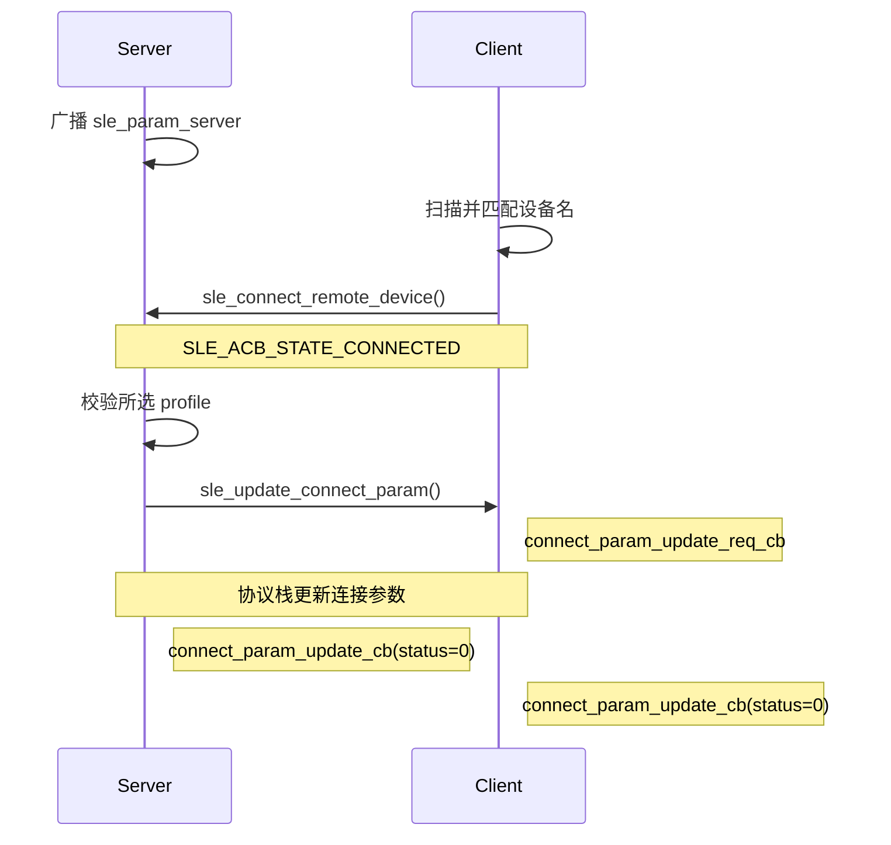

# 连接参数动态更新

> 使用技术：SLE (SparkLink Low Energy) 连接参数更新、连接间隔、休眠延迟和监管超时

> 前置阅读：[Hello SLE](../basics/hello-connect.md)

## 学习目标

- 理解连接间隔、最大休眠延迟和监管超时的单位与约束
- 掌握 `sle_update_connect_param()` 的在线更新流程
- 掌握参数更新请求回调和完成回调的注册方法
- 能通过 Kconfig 在低功耗、平衡和低延迟模式之间选择
- 能在两块 WS63 开发板上验证双方最终生效的连接参数

## 案例说明

本案例使用两块 WS63 开发板：

- Server 广播设备名 `sle_param_server`，连接建立后发起参数更新。
- Client 扫描并连接目标设备，输出收到的参数更新请求。
- 双方通过 `connect_param_update_cb` 输出最终生效的参数。
- 断连后 Server 重新广播，Client 重新扫描。

案例源码位于：

```text
src/application/samples/bt/sle/sle_conn_param_tuning/
```

### 规格与功能

连接间隔单位为 **0.25 ms**，监管超时单位为 **10 ms**。

| 模式 | interval 配置值 | 实际间隔 | max_latency | timeout 配置值 | 实际超时 | 适用方向 |
|---|---:|---:|---:|---:|---:|---|
| 低功耗 | 400 | 100 ms | 49 | 1200 | 12 s | 低频传感器上报 |
| 平衡（默认） | 50 | 12.5 ms | 0 | 500 | 5 s | 通用交互 |
| 低延迟 | 30 | 7.5 ms | 0 | 200 | 2 s | 实时控制、HID (Human Interface Device) |

> 表中的功耗和吞吐方向是定性关系，不作为电流或吞吐性能规格。实际数值与射频环境、数据长度、PHY (Physical Layer) 、发射功率和业务负载有关，需要单独测量。

## 基本概念

### 三个核心参数

| 参数 | 含义 | 单位 | 当前 SDK 范围 |
|---|---|---|---|
| `interval_min` / `interval_max` | 两个连接事件之间的调度间隔 | 0.25 ms | `0x001E`～`0x3E80`，即 7.5 ms～4 s |
| `max_latency` | 允许终端在无数据时跳过的最大连接事件数 | 次 | 0～499 |
| `supervision_timeout` | 多久未收到对端数据后判定断连 | 10 ms | 10～3200，即 100 ms～32 s |

连接间隔越短，通常延迟越低、射频活动越频繁；连接间隔越长，通常更利于降低功耗，但响应延迟会上升。

`max_latency` 只允许设备在无数据时跳过连接事件。设备有数据要发送时，不需要等满整个休眠周期。

### 监管超时约束

监管超时必须严格大于最大休眠连接间隔的两倍：

```text
timeout_ms > 2 × (max_latency + 1) × interval_ms
```

换算成当前 SDK 的原始配置值：

```text
supervision_timeout × 20 > (max_latency + 1) × interval_max
```

低功耗模式中：

```text
(49 + 1) × 400 = 20000
1200 × 20      = 24000
```

因此 12 秒超时满足严格大于约束。若使用 10 秒，左右两边相等，不满足要求。

## 工作流程



当前 SDK 没有 `sle_connect_param_update_rsp()`。`connect_param_update_req_cb` 用于观察请求参数，最终结果由 `connect_param_update_cb` 报告，案例不演示应用层显式接受或拒绝。

## 涉及 API

| API | 调用方 | 用途 |
|---|---|---|
| `enable_sle()` | 双方 | 启动 SLE 协议栈 |
| `sle_announce_seek_register_callbacks()` | 双方 | 注册广播或扫描回调 |
| `sle_connection_register_callbacks()` | 双方 | 注册连接状态、参数请求和更新完成回调 |
| `sle_update_connect_param()` | Server | 发起连接参数更新 |
| `sle_set_announce_param()` | Server | 配置广播及初始连接参数 |
| `sle_start_announce()` | Server | 启动广播 |
| `sle_set_seek_param()` | Client | 配置扫描参数 |
| `sle_start_seek()` | Client | 启动扫描 |
| `sle_connect_remote_device()` | Client | 发起连接 |

参数更新回调的实际签名为：

```c
typedef void (*sle_connect_param_update_req_callback)(
    uint16_t conn_id,
    errcode_t status,
    const sle_connection_param_update_req_t *param);

typedef void (*sle_connect_param_update_callback)(
    uint16_t conn_id,
    errcode_t status,
    const sle_connection_param_update_evt_t *param);
```

## 代码目录

```text
sle_conn_param_tuning/
├── CMakeLists.txt
├── Kconfig
├── README.md
├── sle_conn_param_tuning.c
├── sle_conn_param_tuning_server/
│   ├── CMakeLists.txt
│   └── src/
│       ├── sle_conn_param_tuning_server.c
│       ├── sle_conn_param_tuning_server.h
│       ├── sle_conn_param_tuning_server_adv.c
│       └── sle_conn_param_tuning_server_adv.h
└── sle_conn_param_tuning_client/
    ├── CMakeLists.txt
    └── src/
        ├── sle_conn_param_tuning_client.c
        └── sle_conn_param_tuning_client.h
```

顶层 `sle_conn_param_tuning.c` 根据 Kconfig 创建 Server 或 Client 任务。Server 目录负责广播和参数更新，Client 目录负责扫描、连接和更新结果观察。

## 关键配置

### Kconfig 角色选择

Server 和 Client 位于 SLE Sample 的互斥 choice 中：

```text
CONFIG_SAMPLE_SUPPORT_SLE_CONN_PARAM_TUNING_SERVER_SAMPLE
CONFIG_SAMPLE_SUPPORT_SLE_CONN_PARAM_TUNING_CLIENT_SAMPLE
```

Server 支持三种 profile：

```text
CONFIG_SLE_CONN_PARAM_PROFILE_LOW_POWER
CONFIG_SLE_CONN_PARAM_PROFILE_BALANCED
CONFIG_SLE_CONN_PARAM_PROFILE_LOW_LATENCY
```

默认选择 `CONFIG_SLE_CONN_PARAM_PROFILE_BALANCED=y`。

### 参数定义

```c
#if defined(CONFIG_SLE_CONN_PARAM_PROFILE_LOW_POWER)
static const sle_conn_param_profile_t g_profile = {"low-power", 400, 49, 1200};
#elif defined(CONFIG_SLE_CONN_PARAM_PROFILE_LOW_LATENCY)
static const sle_conn_param_profile_t g_profile = {"low-latency", 30, 0, 200};
#else
static const sle_conn_param_profile_t g_profile = {"balanced", 50, 0, 500};
#endif
```

### 参数合法性校验

案例在调用协议栈前检查范围、最小值不大于最大值以及监管超时约束：

```c
timeout_scaled = (uint32_t)param->supervision_timeout * 20U;
max_connection_gap = ((uint32_t)param->max_latency + 1U) * param->interval_max;

if (timeout_scaled <= max_connection_gap) {
    return ERRCODE_INVALID_PARAM;
}
```

### 发起参数更新

Server 在连接状态回调收到 `SLE_ACB_STATE_CONNECTED` 后构造参数并调用：

```c
sle_connection_param_update_t param = {
    .conn_id = conn_id,
    .interval_min = g_profile.interval,
    .interval_max = g_profile.interval,
    .max_latency = g_profile.latency,
    .supervision_timeout = g_profile.timeout,
};

sle_update_connect_param(&param);
```

连接回调运行于 SLE service 上下文，不能在其中执行长时间阻塞操作。案例不会在回调中调用 `sleep()`。

## 案例操作指导

以下命令中的 `COM_SERVER` 和 `COM_CLIENT` 是占位符，请分别替换为两块开发板在本机对应的串口号。

### 第一步：构建并烧录 Server

```shell
fbb config set CONFIG_ENABLE_BT_SAMPLE=y --target ws63-liteos-app
fbb config set CONFIG_SAMPLE_SUPPORT_SLE_SAMPLE=y --target ws63-liteos-app
fbb config set CONFIG_SAMPLE_SUPPORT_SLE_CONN_PARAM_TUNING_SERVER_SAMPLE=y --target ws63-liteos-app
fbb config set CONFIG_SLE_CONN_PARAM_PROFILE_BALANCED=y --target ws63-liteos-app
fbb build ws63-liteos-app --clean
fbb flash ws63-liteos-app --port COM_SERVER --json-summary
```

如需测试其他模式，将 profile 配置替换为低功耗或低延迟选项。构建 Client 会覆盖同一目标的固件包，因此应先烧录 Server，再切换角色构建 Client。

### 第二步：构建并烧录 Client

```shell
fbb config set CONFIG_SAMPLE_SUPPORT_SLE_CONN_PARAM_TUNING_CLIENT_SAMPLE=y --target ws63-liteos-app
fbb build ws63-liteos-app --clean
fbb flash ws63-liteos-app --port COM_CLIENT --json-summary
```

`fbb config set` 会自动处理 Kconfig choice，取消同组的 Server 选项。

### 第三步：验证 Client

```shell
fbb monitor --port COM_CLIENT --reset --until "\[sle conn param client\] update complete:.*status=0x0" --timeout 45 --json-summary
```

平衡模式的关键日志：

```text
[sle conn param client] found sle_param_server, stop seek
[sle conn param client] connected, conn_id=0x00
[sle conn param client] update requested: conn_id=0x00, status=0x0, interval=50-50, latency=0, timeout=500
[sle conn param client] update complete: conn_id=0x00, status=0x0, interval=50, latency=0, timeout=500
```

### 第四步：验证 Server

```shell
fbb monitor --port COM_SERVER --reset --until "\[sle conn param server\] update complete:.*status=0x0" --timeout 45 --json-summary
```

平衡模式的关键日志：

```text
[sle conn param server] selected profile=balanced
[sle conn param server] start announce, name=sle_param_server
[sle conn param server] connected, conn_id=0x00
[sle conn param server] update request: profile=balanced, interval=50 (0.25ms), latency=0, timeout=500 (10ms)
[sle conn param server] update request sent, status=0x0
[sle conn param server] update complete: conn_id=0x00, status=0x0, interval=50, latency=0, timeout=500
```

## 实测结果

本案例于 2026-07-21 使用两块 WS63 开发板完成验证：

- Server：COM6，成功烧录 7 个分区。
- Client：COM8，成功烧录 7 个分区。
- 双端均收到 `connect_param_update_cb`。
- 平衡模式最终参数均为 `interval=50`、`latency=0`、`timeout=500`、`status=0x0`。

## 常见问题

### Client 扫描不到 Server

- 确认先启动 Server，串口出现 `start announce, name=sle_param_server`。
- 确认两块板烧录的是不同角色，而不是同一固件。
- 确认 Client 日志中出现 `start seek`。

### 更新请求返回失败

- 检查连接间隔、Latency 和监管超时是否在 SDK 范围内。
- 检查监管超时是否严格满足约束，不能只取临界相等值。
- 使用 `connect_param_update_cb` 的 `status` 判断最终结果。

### 只有系统心跳，没有案例日志

检查目标文件是否包含：

```text
sle_conn_param_tuning.c.obj
sle_conn_param_tuning_server.c.obj
sle_conn_param_tuning_server_adv.c.obj
```

或 Client 对应的 `sle_conn_param_tuning_client.c.obj`。若对象文件缺失，重新执行 `--clean` 构建并检查 Kconfig choice。
