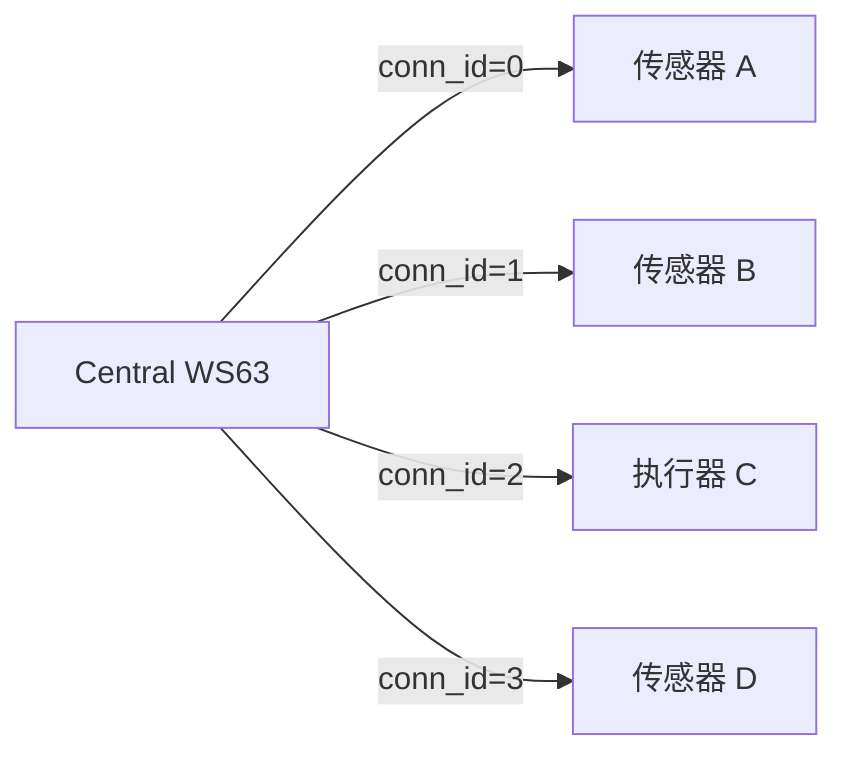
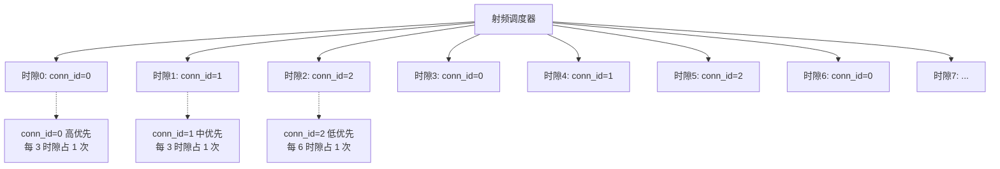
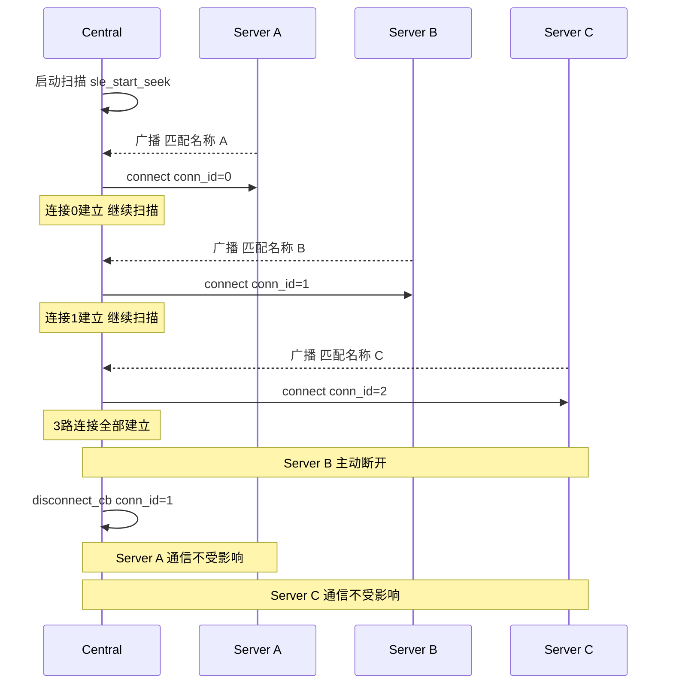

# 多连接

> SLE (SparkLink Low Energy) 连接管理、连接句柄、多设备并发

> 前置阅读：[Hello SLE](../basics/hello-connect.md)

## 学习目标

- 理解 WS63 SLE 多连接能力——最多 8 路并发连接，每路独立 `conn_id`
- 掌握多连接场景下的连接句柄管理与设备地址映射表设计
- 理解多路连接共享射频资源的调度冲突与 `sle_set_acb_evt_param()` 时隙分配
- 掌握按 `conn_id` 分发回调处理的统一模式
- 能够在 WS63 上实现星形拓扑——一个 Central 同时连接 3~8 个 Server

## 基本概念

### 多连接能力概览

WS63 协议栈支持最多 8 路 SLE 并发连接，每路连接拥有独立的 `conn_id`（0~7）。所有回调函数——连接状态变化、配对结果、SSAP (SLE Service Access Protocol) 读写——都携带 `conn_id` 参数，应用层通过它区分不同设备。

### 典型使用场景

| 场景 | 连接数 | 拓扑 | 说明 |
|------|:---:|------|------|
| 网关 | 4~8 | 星形 | 一个 Central 连接多个传感器/执行器，汇聚数据后通过 WiFi 上报云端 |
| 可穿戴 | 2~3 | 星形 | 手机同时连接智能手表 + 耳机 + 鼠标 |
| 机器人关节控制 | 8 | 星形 | 主控同时连接 8 个关节电机驱动器，实时下发位置指令 |
| 多传感器融合 | 4~6 | 星形 | 温湿度、光照、气压、加速度传感器数据汇聚到网关 |

> 所有场景都是星形拓扑——一个 Central 连接多个 Server。WS63 不支持 Mesh (Mesh Network) 拓扑，多个 Central 之间也不能互连。

### 连接句柄管理

`conn_id` 是 SLE 协议栈为每路连接分配的唯一标识符，范围 0~7。它与 BLE (Bluetooth Low Energy) 的 `conn_handle` 不同——SLE 的 `conn_id` 由协议栈按连接建立顺序分配，应用层不能指定，但可以用映射表将 `conn_id` 与物理设备地址关联。



应用层维护一个 `conn_id → 设备信息` 的映射表，所有回调中先查表，再分发到对应设备处理逻辑。

### 多路连接的资源冲突

8 路连接共享同一个射频收发器和协议栈调度器——连接间隔和时隙分配直接影响每路连接的吞吐量和延迟：



> `sle_set_acb_evt_param(conn_id, evt_intv, evt_num)` 控制每路连接的时间间隔和每事件占用的时隙数。8 路平分总时隙时，每路间隔约 20ms；高优先级可缩短到 5ms，低优先级拉长到 50ms。

### 多连接建立流程



> Central 不会一次性扫到全部 3 个 Server 再连接——每扫到一个匹配的就立即发起连接，协议栈自动分配不同的 `conn_id`。建立新连接不会断开已有连接。

## 涉及 API

| API | 谁调用 | 用途 |
|-----|--------|------|
| `sle_connect_remote_device(&addr)` | Client | 向指定设备发起连接（多路并发调用，每次分配不同 conn_id） |
| `sle_disconnect_remote_device(&addr)` | 任一方 | 断开指定连接（不影响其他路） |
| `sle_disconnect_all_remote_device()` | 任一方 | 断开所有连接 |
| `sle_get_paired_devices(&addr, &num)` | 任一方 | 获取已配对设备列表（可用于恢复连接） |
| `sle_set_acb_evt_param(conn_id, evt_intv, evt_num)` | Client | 调整每路连接的事件间隔和时隙数量 |
| `sle_connection_register_callbacks()` | 双方 | 注册连接状态回调（所有连接共用同一回调，通过 conn_id 区分） |
| `ssapc_register_callbacks()` | Client | 注册 SSAP 客户端回调（读写/通知/指示，同样按 conn_id 分发） |

> `sle_connect_remote_device()` 不阻塞——调用后立即返回。连接结果通过 `connect_state_changed_cb` 异步通知（带上新分配的 `conn_id`）。

## 案例说明

### 整体目标

Central 同时连接 3 个 Server，3 路连接各自独立通信（配对、服务发现、数据收发），任意一路断开不影响其他路。Central 端维护 `conn_id → 设备信息` 映射表，所有回调按 `conn_id` 分发到对应设备的处理逻辑。

### 连接映射表设计

```text
       g_conn_table[0] ── conn_id=0: 传感器 A (温度+湿度)
       g_conn_table[1] ── conn_id=1: 传感器 B (光照+气压)
       g_conn_table[2] ── conn_id=2: 执行器 C (LED+继电器)
       g_conn_table[3..7] ── 空闲
```

每项存储：设备地址 `sle_addr_t`、连接状态 `state`、配对状态 `pair_state`、SSAP 服务句柄 `ssap_handle`。连接建立/断开时通过 `connect_state_changed_cb` 更新对应槽位。

### 回调分发模式

所有回调（连接状态/配对/SSAP 读写/SSAP 通知）共用一个入口函数，内部 `switch(conn_id)` 查映射表取出设备上下文指针，再调用该设备的专属处理函数：

```text
connect_state_changed_cb(conn_id, addr, state, ...)
  → ctx = g_conn_table[conn_id]   ← 按 conn_id 取上下文
  → ctx->on_state_changed(state)  ← 分发给该设备的处理函数

ssapc_write_res_cb(conn_id, handle, status, ...)
  → ctx = g_conn_table[conn_id]
  → ctx->on_write_done(status)
```

## 案例操作指导

### 硬件准备

- 4 块 WS63 开发板：1 块作 Central，3 块作 Server（分别命名为 sensor_a、sensor_b、actuator_c）
- 4 条 USB (Universal Serial Bus) 转串口线（供电 + 日志）

### 操作步骤

1. **编译烧录**：分别编译 `multi_conn_central` 和 `multi_conn_server` 示例。3 块 Server 编译同一份固件，仅修改广播名称宏 `#define SERVER_NAME "sensor_a"` 以区分
2. **上电**：先上电 3 块 Server（启动广播），再上电 Central（启动扫描）
3. **观察连接**：Central 串口日志依次打印：
   - `发现 sensor_a → 连接中 → conn_id=0 已连接`
   - `发现 sensor_b → 连接中 → conn_id=1 已连接`
   - `发现 sensor_c → 连接中 → conn_id=2 已连接`
4. **验证独立性**：关闭 sensor_b 电源 → Central 仅打印 `conn_id=1 断开`，conn_id=0 和 2 的通信继续
5. **验证重连**：重新上电 sensor_b → Central 重新扫到并连接

### 预期日志

```text
[SLE Central] 启动扫描...
[SLE Central] 发现 sensor_a 发起连接
[SLE Central] connect_state_changed_cb: conn_id=0 STATE=CONNECTED addr=sensor_a
[SLE Central] 发现 sensor_b 发起连接
[SLE Central] connect_state_changed_cb: conn_id=1 STATE=CONNECTED addr=sensor_b
[SLE Central] 发现 sensor_c 发起连接
[SLE Central] connect_state_changed_cb: conn_id=2 STATE=CONNECTED addr=sensor_c
[SLE Central] 3路连接全部建立
[SLE Central] conn_id=1 断开 disc_reason=SUPERVISION_TIMEOUT
[SLE Central] conn_id=0 通信正常 conn_id=2 通信正常
```

## 关键配置

| 参数 | 推荐值 | 说明 |
|------|:---:|------|
| `MAX_CONN` | 8 | WS63 硬上限；超过返回 `ERRCODE_SLE_CONN_REACH_MAX` |
| 高优先连接间隔 | 5ms | 传感器/实时控制类；`evt_intv=5000`（单位 us） |
| 中优先连接间隔 | 20ms | 普通数据交互；`evt_intv=20000` |
| 低优先连接间隔 | 50ms | 日志/慢速配置；`evt_intv=50000` |
| 高优先每事件时隙 | 2 | `evt_num=2`，占用更多调度机会 |
| 广播间隔随机化 | 20~50ms 随机 | 多个 Server 同时广播时避免碰撞 |

> 8 路平分总时隙时，每路约 20ms 间隔。如果某一路需要高吞吐（如固件升级），可以临时将其间隔调短、其他路拉长，升级完成后再恢复。

## 代码详解

### 1. 连接映射表设计

```c
/* ── 设备类型枚举 ── */
typedef enum {
    DEV_TYPE_SENSOR_A = 0,
    DEV_TYPE_SENSOR_B = 1,
    DEV_TYPE_ACTUATOR = 2,
    DEV_TYPE_MAX
} dev_type_t;

/* ── 单设备上下文 ── */
typedef struct {
    sle_addr_t addr;            /* 设备 MAC 地址 */
    uint16_t   conn_id;         /* 连接句柄（由协议栈分配） */
    uint16_t   ssap_handle;     /* SSAP 服务发现句柄 */
    bool       in_use;          /* 此槽位是否在使用 */
    bool       paired;          /* 是否已完成配对 */
    dev_type_t type;            /* 设备类型 */
    char       name[32];        /* 设备广播名称 */
} conn_ctx_t;

/* ── 全局连接表 ── */
#define MAX_CONN 8
static conn_ctx_t g_conn_table[MAX_CONN] = {0};

/* ── 槽位管理 ── */
static int conn_find_free_slot(void)
{
    for (int i = 0; i < MAX_CONN; i++) {
        if (!g_conn_table[i].in_use) {
            return i;
        }
    }
    return -1;  /* 连接数已满 */
}

static conn_ctx_t *conn_find_by_id(uint16_t conn_id)
{
    for (int i = 0; i < MAX_CONN; i++) {
        if (g_conn_table[i].in_use && g_conn_table[i].conn_id == conn_id) {
            return &g_conn_table[i];
        }
    }
    return NULL;
}

static conn_ctx_t *conn_find_by_addr(const sle_addr_t *addr)
{
    for (int i = 0; i < MAX_CONN; i++) {
        if (g_conn_table[i].in_use &&
            memcmp(&g_conn_table[i].addr, addr, sizeof(sle_addr_t)) == 0) {
            return &g_conn_table[i];
        }
    }
    return NULL;
}
```

### 2. 多路连接的创建

```c
/* ── 全局扫描目标列表 ── */
static const char *g_target_names[] = {"sensor_a", "sensor_b", "actuator_c"};
#define TARGET_COUNT (sizeof(g_target_names) / sizeof(g_target_names[0]))

/* ── 扫描结果回调 ── */
static void multi_seek_result_cbk(sle_seek_result_info_t *info)
{
    if (info == NULL || info->data == NULL) { return; }

    /* 遍历目标名称列表，匹配任意一个 */
    for (int i = 0; i < TARGET_COUNT; i++) {
        if (strstr((const char *)info->data, g_target_names[i]) != NULL) {
            /* 检查是否已经连接 */
            conn_ctx_t *existing = conn_find_by_addr(&info->addr);
            if (existing != NULL) {
                osal_printk("设备 %s 已连接 conn_id=%u 跳过\r\n",
                            g_target_names[i], existing->conn_id);
                return;
            }

            /* 保存地址并发起连接 */
            static sle_addr_t pending_addr;
            memcpy_s(&pending_addr, sizeof(sle_addr_t),
                     &info->addr, sizeof(sle_addr_t));

            /* 先删除旧配对记录 再连接 */
            sle_remove_paired_remote_device(&pending_addr);
            errcode_t ret = sle_connect_remote_device(&pending_addr);
            if (ret == ERRCODE_SLE_SUCCESS) {
                osal_printk("发现 %s 发起连接\r\n", g_target_names[i]);
            } else {
                osal_printk("连接 %s 失败 ret=0x%x\r\n", g_target_names[i], ret);
            }
            return;  /* 一次只处理一个 下次回调处理下一个 */
        }
    }
}
```

### 3. 回调统一分发

```c
/* ── 连接状态变化回调 ── */
static void multi_connect_state_changed_cb(uint16_t conn_id,
    const sle_addr_t *addr, sle_acb_state_t state,
    sle_disc_reason_t disc_reason, uint16_t pair_handle)
{
    conn_ctx_t *ctx = NULL;

    switch (state) {
    case SLE_ACB_STATE_CONNECTED:
        /* 分配新槽位 */
        {
            int slot = conn_find_free_slot();
            if (slot < 0) {
                osal_printk("连接已满 拒绝新连接\r\n");
                sle_disconnect_remote_device(addr);
                return;
            }
            ctx = &g_conn_table[slot];
            memcpy_s(&ctx->addr, sizeof(sle_addr_t), addr, sizeof(sle_addr_t));
            ctx->conn_id = conn_id;
            ctx->in_use   = true;
            ctx->type     = slot < TARGET_COUNT ? (dev_type_t)slot : DEV_TYPE_MAX;
            osal_printk("conn_id=%u 已连接 slot=%d\r\n", conn_id, slot);
        }
        break;

    case SLE_ACB_STATE_DISCONNECTED:
        /* 按 conn_id 查找并释放槽位 */
        ctx = conn_find_by_id(conn_id);
        if (ctx != NULL) {
            osal_printk("conn_id=%u 断开 disc_reason=%d\r\n",
                        conn_id, disc_reason);
            memset_s(ctx, sizeof(conn_ctx_t), 0, sizeof(conn_ctx_t));
        }
        break;

    default:
        break;
    }
}

/* ── SSAP 写响应回调（按 conn_id 分发） ── */
static void multi_ssapc_write_res_cb(uint16_t conn_id,
    uint16_t handle, errcode_t status, uint16_t data_id)
{
    conn_ctx_t *ctx = conn_find_by_id(conn_id);
    if (ctx == NULL) {
        osal_printk("write_res: 未知 conn_id=%u\r\n", conn_id);
        return;
    }
    osal_printk("[%s conn_id=%u] write_res handle=0x%04X status=0x%x\r\n",
                ctx->name, conn_id, handle, status);
}

/* ── SSAP 通知/指示回调（按 conn_id 分发） ── */
static void multi_ssapc_notify_cb(uint16_t conn_id,
    uint16_t handle, uint8_t *data, uint16_t len)
{
    conn_ctx_t *ctx = conn_find_by_id(conn_id);
    if (ctx == NULL) {
        osal_printk("notify: 未知 conn_id=%u\r\n", conn_id);
        return;
    }
    osal_printk("[%s conn_id=%u] 收到通知 len=%u\r\n",
                ctx->name, conn_id, len);
    /* 按设备类型进一步分发 */
    switch (ctx->type) {
    case DEV_TYPE_SENSOR_A: sensor_a_on_data(ctx, data, len); break;
    case DEV_TYPE_SENSOR_B: sensor_b_on_data(ctx, data, len); break;
    case DEV_TYPE_ACTUATOR: actuator_on_data(ctx, data, len); break;
    default: break;
    }
}
```

### 4. 时隙分配调整

```c
/* ── 连接建立后根据设备类型调整时隙 ── */
static void multi_adjust_evt_param(conn_ctx_t *ctx)
{
    switch (ctx->type) {
    case DEV_TYPE_SENSOR_A:
    case DEV_TYPE_SENSOR_B:
        /* 传感器：高优先级 5ms 间隔 每事件2时隙 */
        sle_set_acb_evt_param(ctx->conn_id, 5000, 2);
        osal_printk("[%s] 时隙: 5ms间隔 2时隙\r\n", ctx->name);
        break;
    case DEV_TYPE_ACTUATOR:
        /* 执行器：低优先级 50ms 间隔 每事件1时隙 */
        sle_set_acb_evt_param(ctx->conn_id, 50000, 1);
        osal_printk("[%s] 时隙: 50ms间隔 1时隙\r\n", ctx->name);
        break;
    default:
        /* 默认：20ms 间隔 1时隙 */
        sle_set_acb_evt_param(ctx->conn_id, 20000, 1);
        break;
    }
}
```

> `sle_set_acb_evt_param()` 必须在连接建立后调用（`SLE_ACB_STATE_CONNECTED` 状态之后），协议栈此时才有该 `conn_id` 的连接上下文。

### 5. 单路断开与资源回收

```c
/* ── 主动断开某一路连接 ── */
static errcode_t multi_disconnect_one(dev_type_t type)
{
    conn_ctx_t *ctx = conn_find_by_type(type);
    if (ctx == NULL) {
        osal_printk("设备类型 %d 未连接\r\n", type);
        return ERRCODE_SLE_NOT_CONNECTED;
    }

    osal_printk("断开 [%s] conn_id=%u\r\n", ctx->name, ctx->conn_id);
    errcode_t ret = sle_disconnect_remote_device(&ctx->addr);
    if (ret == ERRCODE_SLE_SUCCESS) {
        /* 协议栈会触发 connect_state_changed_cb →
           SLE_ACB_STATE_DISCONNECTED → 自动清理槽位 */
    }
    return ret;
}

/* ── 某路断开后的自动重连 ── */
static void multi_on_disconnected(conn_ctx_t *ctx,
    sle_disc_reason_t disc_reason)
{
    osal_printk("[%s] 断开原因=%d 启动重连定时器\r\n",
                ctx->name, disc_reason);

    /* 仅监控超时和远端主动断开时自动重连 */
    if (disc_reason == SLE_DISC_REASON_SUPERVISION_TIMEOUT ||
        disc_reason == SLE_DISC_REASON_REMOTE_TERMINATE) {
        /* 保存目标地址 */
        static sle_addr_t reconnect_addr;
        memcpy_s(&reconnect_addr, sizeof(sle_addr_t),
                 &ctx->addr, sizeof(sle_addr_t));

        /* 清理槽位（connect_state_changed_cb 中会清理） */

        /* 延迟 1 秒后重连 */
        osal_msleep(1000);
        errcode_t ret = sle_connect_remote_device(&reconnect_addr);
        if (ret != ERRCODE_SLE_SUCCESS) {
            osal_printk("重连失败 ret=0x%x\r\n", ret);
        }
    }
}
```

> 断开一路连接时只清理该 `conn_id` 对应的槽位，不影响其他连接的映射表项和通信。如果业务需要记录断开前的连接上下文（如已订阅的 Property handle），可以在清理前备份。

---

