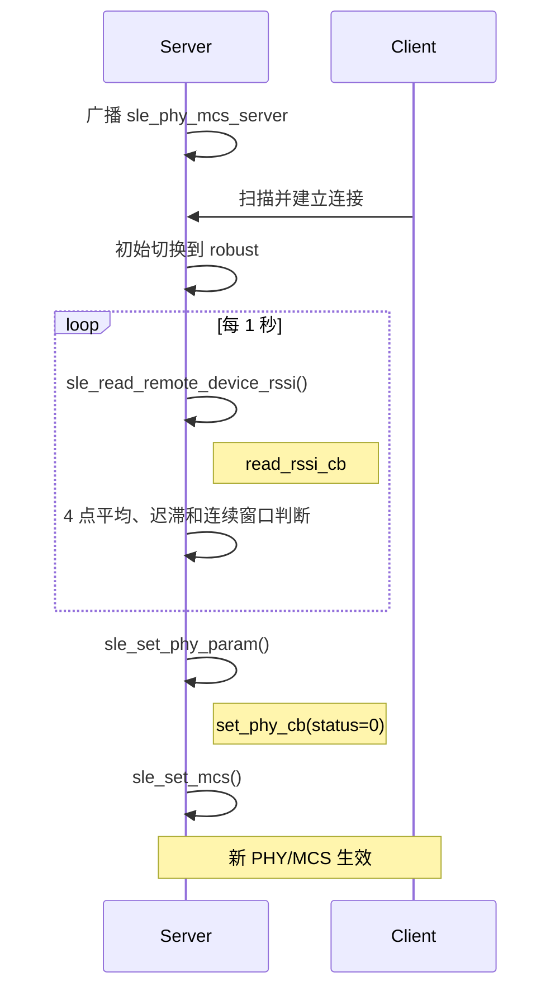

# 无线链路自适应（PHY/MCS）

> 使用技术：SLE (SparkLink Low Energy) RSSI (Received Signal Strength Indicator) 读取、PHY (Physical Layer) 更新、MCS (Modulation and Coding Scheme) 设置、滑动平均和迟滞状态机

> 前置阅读：[Hello SLE](../basics/hello-connect.md)

## 学习目标

- 理解 PHY、MCS 的含义、主要影响及其与连接参数动态更新的区别
- 掌握 `sle_read_remote_device_rssi()`、`sle_set_phy_param()` 和 `sle_set_mcs()` 的调用关系
- 掌握 RSSI 平滑、迟滞阈值和连续确认窗口的实现方法
- 能在两块 WS63 开发板上验证 PHY/MCS 自动升档和降档

## 案例说明

本案例会定期读取连接设备的 RSSI，通过 RSSI 的大小判断当前信道质量。RSSI 较高时，说明信道状况良好，可以切换到更高速的 PHY 和 MCS，提高传输速度；RSSI 较低时，说明信道状况变差，需要切换到更稳健的 PHY 和 MCS，减少丢包和重传。这样设备就能根据实际无线环境自动选择合适的通信档位。

### PHY 和 MCS 是什么

- **PHY（Physical Layer，物理层）**决定无线信号采用哪种基础传输速率，例如本案例使用的 1M、2M 和 4M。速率越高，发送同样数据所需的时间越短，但对信号质量的要求也越高。
- **MCS（Modulation and Coding Scheme，调制与编码方案）**决定数据采用什么调制方式，以及加入多少纠错保护。较低的 MCS 传输速度较慢，但抗干扰能力更强；较高的 MCS 可以传输更多数据，但在信号较弱时更容易出现丢包和重传。

可以简单地把 PHY 理解为“以多快的基础速度发送”，把 MCS 理解为“每次发送多少数据、提供多少保护”。两者共同决定实际传输速度和稳定性：

| PHY/MCS 选择 | 传输速度 | 对信号质量的要求 | 适用场景 |
|---|---|---|---|
| 较低档位 | 较低 | 较低，弱信号下更稳定 | 距离较远、遮挡或干扰较强 |
| 较高档位 | 较高 | 较高，弱信号下容易丢包 | 距离较近、信号和信道状况良好 |

因此，PHY/MCS 并不是越高越好。案例通过 RSSI 判断当前链路状况，在速度和稳定性之间自动选择更合适的档位。

本案例使用两块 WS63 开发板：

- Server 广播设备名 `sle_phy_mcs_server`。
- Client 扫描并连接 Server。
- Server 周期读取 Client 的 RSSI，并根据迟滞状态机选择目标档位。
- Server 先异步更新 PHY，收到成功回调后再设置 MCS。
- Client 输出对端发起的 PHY 更新结果。
- 断连后 Server 重新广播，Client 重新扫描。

案例源码位于：

```text
src/application/samples/bt/sle/sle_phy_mcs_switch/
```

## 与连接参数动态更新的区别

| 对比项 | 连接参数动态更新 | 无线链路自适应（PHY/MCS） |
|---|---|---|
| 调整对象 | 连接间隔、Latency、监管超时 | PHY 带宽、调制编码档位 |
| 主要依据 | 业务处于空闲、交互或实时传输状态 | 实时无线链路质量 |
| 主要目标 | 平衡功耗与响应时延 | 平衡吞吐与抗干扰能力 |
| 核心 API | `sle_update_connect_param()` | `sle_set_phy_param()`、`sle_set_mcs()` |

连接参数决定“多久通信一次”，PHY/MCS 决定“每次用多快、多稳的方式通信”，二者可以同时使用。

## 切换策略

### 示例档位

| 档位 | PHY | MCS | 方向 |
|---|---:|---:|---|
| robust | 1M | 0（BPSK 1/4） | 链路余量优先 |
| balanced | 2M | 4（QPSK 1/2） | 吞吐与可靠性平衡 |
| fast | 4M | 10（8PSK 3/4） | 吞吐优先 |

> 档位组合和 RSSI 阈值是教学示例，不是产品性能规格。实际产品必须结合天线、结构、发射功率、吞吐和丢包率实测标定。

### RSSI 平滑与迟滞

案例每 1 秒读取一次 RSSI，每 4 个样本计算一次平均值，并要求连续 2 个平均窗口选择同一目标档位才发起切换。

| 当前档位 | 条件 | 目标档位 |
|---|---|---|
| robust | RSSI ≥ -70 dBm | balanced |
| balanced | RSSI ≤ -78 dBm | robust |
| balanced | RSSI ≥ -50 dBm | fast |
| fast | RSSI ≤ -62 dBm | balanced |

升档阈值高于降档阈值，形成迟滞区。例如从 balanced 升到 fast 需要达到 -50 dBm，而从 fast 降回 balanced 只需低于 -62 dBm。这可以避免 RSSI 在单一阈值附近波动时反复切换。

## 工作流程



PHY 更新是异步操作。API 返回成功只表示请求已受理，案例使用 `set_phy_cb` 判断最终结果；只有 PHY 回调成功后才调用 `sle_set_mcs()`，避免 PHY 和 MCS 配置顺序互相覆盖。

## 涉及 API

| API | 调用方 | 用途 |
|---|---|---|
| `enable_sle()` | 双方 | 启动 SLE 协议栈 |
| `sle_announce_seek_register_callbacks()` | 双方 | 注册广播或扫描回调 |
| `sle_connection_register_callbacks()` | 双方 | 注册连接、RSSI 和 PHY 回调 |
| `sle_read_remote_device_rssi()` | Server | 异步读取对端 RSSI |
| `sle_set_phy_param()` | Server | 异步设置收发 PHY |
| `sle_set_mcs()` | Server | 设置调制编码档位 |
| `sle_set_announce_param()` | Server | 配置广播和初始连接参数 |
| `sle_connect_remote_device()` | Client | 发起连接 |

## 代码目录

```text
sle_phy_mcs_switch/
├── CMakeLists.txt
├── Kconfig
├── README.md
├── sle_phy_mcs_switch.c
├── sle_phy_mcs_switch_server/
│   ├── CMakeLists.txt
│   └── src/
│       ├── sle_phy_mcs_switch_server.c
│       ├── sle_phy_mcs_switch_server.h
│       ├── sle_phy_mcs_switch_server_adv.c
│       └── sle_phy_mcs_switch_server_adv.h
└── sle_phy_mcs_switch_client/
    ├── CMakeLists.txt
    └── src/
        ├── sle_phy_mcs_switch_client.c
        └── sle_phy_mcs_switch_client.h
```

顶层文件根据 Kconfig 创建 Server 或 Client 任务。Server 目录负责广播、RSSI 采样和档位切换；Client 目录负责扫描、连接和 PHY 更新观察。

## 关键代码

### 周期读取 RSSI

本案例没有使用定时器或中断读取 RSSI，而是创建了一个名为 `SLEPhyAdapt` 的 OSAL (Operating System Abstraction Layer) 任务。任务通过 `while (1)` 持续循环，每轮结束后休眠 1000 ms：

```c
#define SLE_PHY_MCS_SAMPLE_INTERVAL_MS 1000

static void *sle_phy_mcs_adapt_task(const char *arg)
{
    unused(arg);
    while (1) {
        if (g_connected && !g_phy_update_pending) {
            if (g_current_profile == SLE_PHY_MCS_PROFILE_INVALID) {
                (void)sle_phy_mcs_request_profile(SLE_PHY_MCS_PROFILE_ROBUST);
            } else {
                (void)sle_read_remote_device_rssi(g_conn_id);
            }
        }
        (void)osal_msleep(SLE_PHY_MCS_SAMPLE_INTERVAL_MS);
    }
    return NULL;
}
```

因此，在已经连接并且没有执行 PHY 更新时，任务大约每 1 秒调用一次 `sle_read_remote_device_rssi()`。该 API 异步返回结果，`sle_phy_mcs_read_rssi_cb()` 收到结果后累加采样值；累计 4 次后计算一次平均 RSSI。只有连续 2 个平均值窗口选择相同的新档位，才执行切换。采样连续成功且没有被跳过时，大约每 4 秒产生一个平均值，最快约 8 秒确认并触发一次档位切换。

如果尚未设置初始档位，当前循环会先切换到 `robust`，下一轮再读取 RSSI；如果正在更新 PHY，当前循环会跳过采样，休眠 1 秒后重新检查。由于任务调度和 API 执行也需要时间，实际采样间隔可能略大于 1 秒。

### PHY 更新后设置 MCS

```c
ret = sle_set_phy_param(g_conn_id, &phy_param);
```

PHY 更新成功回调中：

```c
ret = sle_set_mcs(conn_id, target->mcs);
if (ret == ERRCODE_SLE_SUCCESS) {
    g_current_profile = g_target_profile;
}
```

切换期间 `g_phy_update_pending` 保持为 `true`，阻止重复 RSSI 请求或重入切换。断连时清除当前档位、目标档位、连续窗口和 RSSI 累加状态。

## 案例操作指导

以下命令中的 `COM_SERVER` 和 `COM_CLIENT` 是占位符，请替换为两块开发板对应的串口号。

### 第一步：构建并烧录 Server

```shell
fbb config set CONFIG_ENABLE_BT_SAMPLE=y --target ws63-liteos-app
fbb config set CONFIG_SAMPLE_SUPPORT_SLE_SAMPLE=y --target ws63-liteos-app
fbb config set CONFIG_SAMPLE_SUPPORT_SLE_PHY_MCS_SWITCH_SERVER_SAMPLE=y --target ws63-liteos-app
fbb build ws63-liteos-app --clean
fbb flash ws63-liteos-app --port COM_SERVER --json-summary
```

### 第二步：构建并烧录 Client

```shell
fbb config set CONFIG_SAMPLE_SUPPORT_SLE_PHY_MCS_SWITCH_CLIENT_SAMPLE=y --target ws63-liteos-app
fbb build ws63-liteos-app --clean
fbb flash ws63-liteos-app --port COM_CLIENT --json-summary
```

构建 Client 会覆盖同一目标的固件包，因此应先烧录 Server，再切换角色构建 Client。

### 第三步：验证 Server

```shell
fbb monitor --port COM_SERVER --reset --until "\[sle phy mcs server\] switch complete: profile=fast.*status=0x0" --timeout 70 --json-summary
```

关键日志：

```text
[sle phy mcs server] switch complete: profile=robust, phy=1M, mcs=0, status=0x0
[sle phy mcs server] RSSI window: average=-39 dBm, current=robust, selected=balanced
[sle phy mcs server] candidate=balanced, confirm=2/2
[sle phy mcs server] switch complete: profile=balanced, phy=2M, mcs=4, status=0x0
[sle phy mcs server] RSSI window: average=-41 dBm, current=balanced, selected=fast
[sle phy mcs server] candidate=fast, confirm=2/2
[sle phy mcs server] switch complete: profile=fast, phy=4M, mcs=10, status=0x0
```

### 第四步：验证 Client

```shell
fbb monitor --port COM_CLIENT --reset --until "\[sle phy mcs client\] PHY changed:.*status=0x0.*tx_phy=4M" --timeout 80 --json-summary
```

关键日志：

```text
[sle phy mcs client] connected, conn_id=0x00
[sle phy mcs client] PHY changed: conn_id=0x00, status=0x0, tx_phy=1M, rx_phy=1M
[sle phy mcs client] PHY changed: conn_id=0x00, status=0x0, tx_phy=2M, rx_phy=2M
[sle phy mcs client] PHY changed: conn_id=0x00, status=0x0, tx_phy=4M, rx_phy=4M
```

### 第五步：验证降档

保持串口监控，逐步增加两块板之间的距离，或加入可重复的遮挡和衰减。当平均 RSSI 低于对应降档阈值并连续满足 2 个窗口时，应看到 fast→balanced→robust。恢复良好信号后，应按相反方向逐级升档，不应在阈值附近频繁抖动。

## 常见问题

### RSSI 变化但不立即切换

这是预期行为。案例要求 4 点平均值连续 2 个窗口选择相同的新档位，以过滤瞬时波动。

### PHY 更新成功但档位没有完成

检查 `sle_set_mcs()` 返回值。案例只有在 PHY 回调成功且 MCS 设置返回成功后才更新当前档位。

### 在阈值附近频繁切换

增大升档和降档阈值之间的差值，增加连续确认窗口，或延长采样窗口。阈值必须根据产品实测重新标定。

### Client 扫描不到 Server

- 确认 Server 日志出现 `start announce, name=sle_phy_mcs_server`。
- 确认两块板烧录的是不同角色。
- 确认 Client 日志出现 `start seek`。
