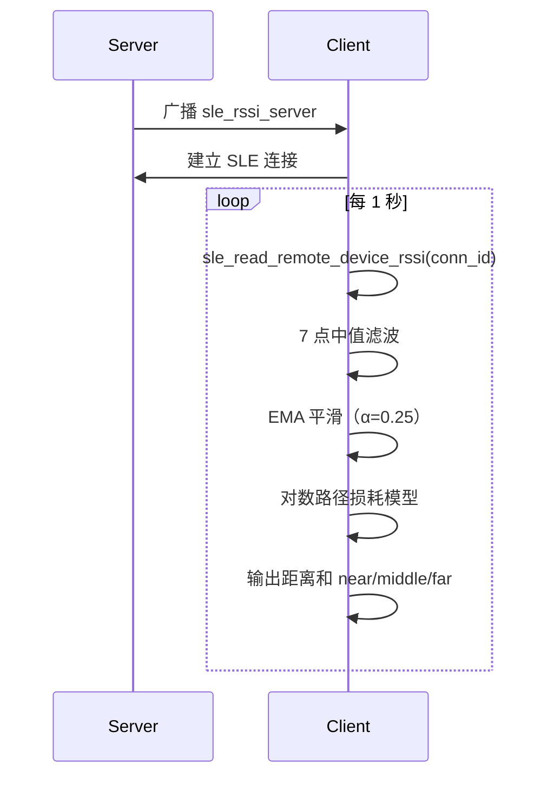
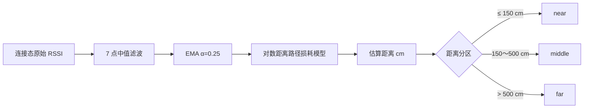
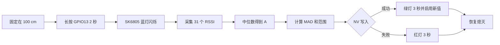

# RSSI 测距

> SLE（SparkLink Low Energy）连接态 RSSI (Received Signal Strength Indicator) 读取、抗突变滤波和粗粒度距离估算。

> 前置阅读：[Hello SLE](../basics/hello-connect.md)

## 学习目标

- 理解 RSSI 与传播距离之间的统计关系，而不是把单次 RSSI 当成精确距离。
- 掌握 `sle_read_remote_device_rssi()` 及异步回调的使用方法。
- 使用 7 点中值滤波和指数移动平均（EMA）平滑 RSSI。
- 使用对数距离路径损耗模型估算距离，并完成 `near`、`middle`、`far` 分区。
- 理解 RSSI 测距的适用场景、标定方法和固有限制。

## 案例的核心指导点

普通 SLE 连接也会观测信号质量，但它通常只关心“能否稳定通信”。本案例进一步把连接态 RSSI 变成一条完整的粗测距处理链：

1. Client 每秒读取一次连接态 RSSI。
2. 先去除突发异常值，再平滑短时波动。
3. 将平滑后的 RSSI 代入经过标定的传播模型。
4. 同时输出估算距离和近、中、远分区。

因此，本案例适合接近检测、离开提醒、资产距离趋势、区域触发等场景；不适合厘米级定位、计费测距或安全门禁。

它与 PHY/MCS 自适应案例也不同：两者都可以读取 `sle_read_remote_device_rssi()`，但 PHY/MCS 案例把 RSSI 作为调整无线链路速率和鲁棒性的依据，本案例则把 RSSI 输入滤波与传播模型，输出距离估计。相同的是输入 API，不同的是控制目标和后续算法。

## 系统组成

本案例需要两块 WS63 开发板：

| 角色 | 功能 | 本次验证串口 |
| --- | --- | --- |
| Server | 广播名称 `sle_rssi_server`，接受 Client 连接 | COM6 |
| Client | 扫描、连接、周期读取 RSSI 并估算距离 | COM8 |



## 基本原理

### RSSI 表示什么

RSSI 表示接收端观测到的信号强度，单位为 dBm。数值通常为负数，越接近 0 表示信号越强。例如，`-40 dBm` 一般比 `-70 dBm` 强。

无线信号在传播中会衰减。在环境、发射功率、PHY (Physical Layer)、天线方向都相对稳定时，RSSI 的长期统计值通常随距离增加而下降，因此可以用经验模型反推距离。但墙体遮挡、人体吸收和反射叠加也会改变 RSSI，所以该距离只能视为估计值。

### 算法处理链



#### 第一步：7 点中值滤波

Client 保存最近 7 个 RSSI 样本，排序后取中间值。中值滤波可以有效抑制某一次突然升高或降低的离群值，并且不会像简单平均那样被极端样本明显拉偏。

#### 第二步：指数移动平均

中值继续进入 EMA：

```text
RSSI_filtered(k) = 0.75 × RSSI_filtered(k-1) + 0.25 × RSSI_median(k)
```

本案例使用 Q8 定点数保存 EMA 状态，避免滤波阶段反复使用浮点运算。`α=0.25` 在响应速度和平滑程度之间取折中：设备移动后不会立即跳到新距离，但输出比原始 RSSI 稳定。

#### 第三步：对数距离路径损耗模型

传播模型为：

```text
RSSI(d) = A - 10 × n × log10(d / d0)
```

反推距离：

```text
d = d0 × 10 ^ ((A - RSSI_filtered) / (10 × n))
```

其中：

| 参数 | 含义 | 案例默认值 |
| --- | --- | --- |
| `d0` | 参考距离 | 1 m |
| `A` | 参考距离处的 RSSI | -45 dBm |
| `n` | 路径损耗指数 | 2.0 |
| `RSSI_filtered` | 中值滤波和 EMA 后的 RSSI | 运行时得到 |

最后将米换算为厘米，限制到 1～10000 cm，并按阈值输出距离分区。

## 方案分析

RSSI 测距实现简单、资源开销较低，适合根据接收信号变化判断设备的大致距离和移动趋势。选型时可与 HADM (High Accuracy Distance Measurement) 等高精度方案进行如下比较：

| 需求 | RSSI 本案例 | HADM 等高精度测距 |
| --- | --- | --- |
| 近/中/远分区 | 适合 | 适合但成本更高 |
| 距离变化趋势 | 适合 | 适合 |
| 准确米级或厘米级距离 | 不保证 | 更合适 |
| 抗遮挡、多径 | 较弱 | 通常更强，但仍受环境影响 |
| 安全可信距离 | 不适合单独使用 | 仍需结合安全协议与威胁模型 |

工程上应优先使用 RSSI 做“接近概率”和“趋势”，而不是宣称精确厘米数。若业务必须知道可靠的几何距离，应选择 HADM/信道探测、到达时间测量或其他专用定位技术。

## RSSI 测距方案的限制

该方案的核心限制是：RSSI 不只由距离决定。同样的真实距离可能得到明显不同的 RSSI，同样的 RSSI 也可能对应不同距离。

| 影响因素 | 结果 |
| --- | --- |
| 墙体、人体和设备外壳遮挡 | 额外衰减，模型通常把距离估得更远 |
| 地面、墙面和家具造成多径 | 反射信号可能相长或相消，静止时也会波动 |
| 天线方向、安装位置和个体差异 | 同距离不同设备可能相差数 dB |
| PHY、信道和发射功率变化 | 标定参数失效，前后测量不再可比 |
| 环境人员走动或开关门 | `A` 和 `n` 随环境变化，结果产生漂移 |
| 中值与 EMA 滤波 | 输出更稳，但移动时存在响应延迟 |

模型中使用了指数运算，因此 RSSI 误差会被非线性放大。例如在 `n=2.0` 时，RSSI 相差 6 dB，估算距离约相差 2 倍。滤波只能减少随机抖动，不能消除遮挡引起的系统性偏差。

此外，RSSI 只能反映接收功率，无法区分“远距离无遮挡”和“近距离被人体遮挡”；它也无法证明对端的真实几何位置，因此不能单独用于安全门禁、防中继或可信距离判断。周期读取和日志处理还会增加一定的软件调度开销，过高采样频率也只会得到更多相关样本，不一定提高精度。

## 为什么必须标定

默认的 `A=-45 dBm`、`n=2.0` 只用于演示，不能直接代表所有开发板和场地。实际应用建议执行以下标定：

1. 固定 Server 和 Client 的安装方式、天线方向、PHY 和发射功率。
2. 在目标环境中相距 1 米放置，采集足够多的 RSSI 样本。
3. 去除异常值后取中位数或稳定均值，作为 `A`。
4. 再选一个已知距离 `d` 采样，按下式估算 `n`：

```text
n = (A - RSSI(d)) / (10 × log10(d / 1 m))
```

5. 在多个已知距离点验证误差，必要时对不同区域分别标定。

### GPIO13 一键校准

本案例在 Client 上实现了 100 cm 一点校准。硬件使用 HiHope WS63E 核心板的板载资源：

| 硬件 | 用途 |
| --- | --- |
| GPIO13 按键 | 低电平按下、内部上拉；连接后长按 2 秒开始校准 |
| GPIO5 SK6805-EC20 | 默认及空闲时熄灭；蓝灯闪烁表示正在采集；NV (Non-Volatile) 保存成功后绿灯亮 3 秒，失败或中断时红灯亮 3 秒，随后均自动熄灭 |
| 用户 NV `0x5101` | 保存带 magic、版本、统计值和校验和的校准记录 |

SK6805-EC20 使用 800 Kbps 单线归零码，本案例按器件要求以高位优先、`GRB` 顺序发送 24 位颜色数据，并在帧后保持 1 ms 低电平完成锁存复位（满足至少 300 μs 的设计裕量）。器件时序与数据顺序可参考 [SK6805-EC20-001 产品规格书](https://cdn.semikey.com/upload/pdfs/42/f7/42f7e0f2c1feb6c0cb45459ba2d7e75e.pdf)。

SK6805-EC20 会锁存最后一次颜色，单独复位 MCU (Microcontroller Unit) 不会使灯珠掉电。为避免 SLE 启动和建链期间的时钟切换干扰软件发送时序，Client 启动时只将 GPIO5 保持为低电平，不立即发送灯珠帧；SLE 建链稳定约 500 ms 后再发送两次全黑帧，清除复位前可能残留的颜色。因此正常启动和建链期间灯珠不会闪烁；如果在绿色或红色提示期间复位，残留颜色也会在重新建链后自动熄灭。

校准步骤：

1. Server 和 Client 保持连接，将两块板固定在 100 cm，并保持实际部署时的天线方向。
2. 长按 Client 的 GPIO13 按键约 2 秒，看到 GPIO5 蓝灯闪烁后松开。
3. Client 暂停普通测距输出，以 200 ms 间隔采集 31 个原始 RSSI，约 6.2 秒完成。
4. 对样本排序，取中位数作为新的 `A=RSSI(1m)`。
5. 计算 MAD（中位绝对偏差）及最小/最大值，用于观察校准环境是否稳定。
6. 将记录写入 NV；成功后绿灯亮 3 秒，并立即使用新 `A`。失败时红灯亮 3 秒；提示结束后发送两次全黑帧并恢复熄灭。



典型日志：

```text
[sle rssi cal] long press detected, calibration start: distance=100 cm, samples=31
[sle rssi cal] recording: 5/31, rssi=-52 dBm
[sle rssi cal] calibration complete: A=-52 dBm, MAD=1 dB, range=[-54,-50] dBm, samples=31, nv=ok
```

正常重启时，程序会校验 NV 记录的长度、magic、版本、数值范围和校验和；有效时自动加载，否则回退到 Kconfig 默认值。SLE 重新建链后还会清除 SK6805-EC20 可能锁存的历史颜色，日志显示为 `stale LED state cleared after SLE connection`。全量固件烧录包含 NV 镜像，可能清除用户校准值，需要重新校准。

> 100 cm 单点只能确定固定偏移 `A`，不能从一个观测点同时求出 `A` 和 `n`。若要计算 `n`，至少还需要一个已知距离点；产品化时推荐使用多个距离点做线性回归，并记录拟合误差。

对应 Kconfig 配置为：

| 配置项 | 说明 | 默认值 |
| --- | --- | ---: |
| `CONFIG_SLE_RSSI_RANGING_RSSI_AT_1M` | 1 米处标定 RSSI，单位 dBm | -45 |
| `CONFIG_SLE_RSSI_RANGING_PATH_LOSS_TENTHS` | `n × 10`，用整数配置 | 20 |

例如路径损耗指数为 2.7 时，应将第二项配置为 `27`。

## 涉及 API

| API | 调用方 | 用途 |
| --- | --- | --- |
| `sle_announce_seek_register_callbacks()` | 双方 | 注册广播、扫描相关回调 |
| `sle_start_announce()` | Server | 启动广播 |
| `sle_set_seek_param()` / `sle_start_seek()` | Client | 配置并启动扫描 |
| `sle_connect_remote_device()` | Client | 与目标 Server 建立连接 |
| `sle_connection_register_callbacks()` | 双方 | 注册连接状态和 RSSI 回调 |
| `sle_read_remote_device_rssi()` | Client | 异步发起连接态 RSSI 读取 |
| `uapi_gpio_get_val()` | Client | 轮询 GPIO13 按键状态 |
| `uapi_nv_read()` / `uapi_nv_write()` | Client | 加载和保存 1 米校准记录 |

扫描结果结构中的 RSSI 在当前 SDK 接口表示中需要按 `int8_t` 解释。本案例使用 `(int8_t)result->rssi` 输出扫描值，避免把 `-35 dBm` 一类数据误打印为 `221`。

## 代码结构

```text
src/application/samples/bt/sle/sle_rssi_ranging/
├── CMakeLists.txt
├── Kconfig
├── README.md
├── sle_rssi_ranging.c
├── sle_rssi_ranging_client/
│   ├── CMakeLists.txt
│   └── src/
│       ├── sle_rssi_ranging_calibration.c
│       ├── sle_rssi_ranging_calibration.h
│       ├── sle_rssi_ranging_client.c
│       └── sle_rssi_ranging_client.h
└── sle_rssi_ranging_server/
    ├── CMakeLists.txt
    └── src/
        ├── sle_rssi_ranging_server.c
        ├── sle_rssi_ranging_server.h
        ├── sle_rssi_ranging_server_adv.c
        └── sle_rssi_ranging_server_adv.h
```

关键实现集中在 Client：

```c
static void sle_rssi_read_cb(uint16_t conn_id, int8_t rssi, errcode_t status)
{
    if ((conn_id != g_conn_id) || !g_connected ||
        (status != ERRCODE_SLE_SUCCESS)) {
        return;
    }
    if (rssi == 0x7F) {
        return;
    }
    if (sle_rssi_calibration_is_active()) {
        if (sle_rssi_calibration_add_sample(rssi)) {
            sle_rssi_reset_filter();
        }
        return;
    }
    sle_rssi_process_sample(rssi);
}
```

`sle_rssi_process_sample()` 完成滑动窗口、中值、EMA、距离计算和分区输出；`sle_rssi_ranging_calibration.c` 负责长按检测、SK6805-EC20 状态灯、校准统计和 NV 持久化。校准完成后会复位普通测距滤波器，避免旧标定参数下的 EMA 状态影响新结果。

## 编译、烧录和验证

### 第一步：构建并烧录 Server

在 SDK 根目录执行：

```shell
fbb config set CONFIG_ENABLE_BT_SAMPLE=y --target ws63-liteos-app
fbb config set CONFIG_SAMPLE_SUPPORT_SLE_SAMPLE=y --target ws63-liteos-app
fbb config set CONFIG_SAMPLE_SUPPORT_SLE_RSSI_RANGING_SERVER_SAMPLE=y --target ws63-liteos-app
fbb build ws63-liteos-app --clean
fbb flash ws63-liteos-app --port COM_SERVER --json-summary
```

### 第二步：构建并烧录 Client

```shell
fbb config set CONFIG_ENABLE_BT_SAMPLE=y --target ws63-liteos-app
fbb config set CONFIG_SAMPLE_SUPPORT_SLE_SAMPLE=y --target ws63-liteos-app
fbb config set CONFIG_SAMPLE_SUPPORT_SLE_RSSI_RANGING_CLIENT_SAMPLE=y --target ws63-liteos-app
fbb build ws63-liteos-app --clean
fbb flash ws63-liteos-app --port COM_CLIENT --json-summary
```

`fbb config set` 会自动处理同一个 Kconfig `choice`，取消上一角色的选项。两次构建产生的固件不同，不能用 Client 固件覆盖 Server 板。

### 第三步：检查测距日志

先让 Server 上电并广播，再复位 Client。可以使用下列命令等待首条完整滤波输出：

```shell
fbb monitor --port COM_CLIENT --reset --until "\[sle rssi client\] range:.*samples=7.*distance=.*zone=" --timeout 30 --json-summary
```

典型日志：

```text
[sle rssi client] found sle_rssi_server, scan_rssi=-37 dBm, stop seek
[sle rssi client] connected, conn_id=0x00, calibration=-45 dBm@1m, path_loss=2.0
[sle rssi client] range: raw=-36 dBm, median=-36 dBm, filtered=-36.0 dBm, samples=7, distance=35 cm, zone=near
```

本次双板验证中，COM6 为 Server，COM8 为 Client；两种角色均完成 clean build 和烧录，Client 成功扫描、连接并持续输出测距结果。日志中的 `35 cm` 是 `A=-45 dBm`、`n=2.0` 下的模型输出，不是用尺子独立测量得到的真实距离。

### 第四步：验证校准与 NV 加载

将两块板固定在 100 cm，长按 Client 的 GPIO13 后，可以等待校准完成：

```shell
fbb monitor --port COM_CLIENT --until "\[sle rssi cal\] calibration complete:.*nv=ok" --timeout 30 --json-summary
```

校准完成后复位 Client，再验证 NV 中的值被重新加载：

```shell
fbb monitor --port COM_CLIENT --reset --until "\[sle rssi cal\] NV calibration loaded: A=" --timeout 30 --json-summary
```

复位后连接日志中的 `calibration=... dBm@1m` 应与校准完成日志中的 `A` 一致。在 100 cm 保持板卡不动时，滤波稳定后的估算距离应该接近 100 cm；由于 RSSI 的环境敏感性，不应要求单次输出严格等于 100 cm。

## 常见问题

### RSSI 变强，距离为什么反而偶尔变远？

中值窗口和 EMA 会引入短暂滞后，当前输出同时受最近若干个样本影响。持续移动一段时间后才会逐步跟随新的信号水平。

### 为什么换一个房间后误差明显变大？

路径损耗指数 `n` 是环境参数。开放空间、走廊和房间的多径结构不同，应在目标部署环境中重新标定。

### 可以直接使用默认的 -45 dBm 和 2.0 吗？

可以用于跑通案例和观察算法流程，不应直接作为产品测距参数。产品化前至少要完成 1 米参考点和多个已知距离点的标定验证。
