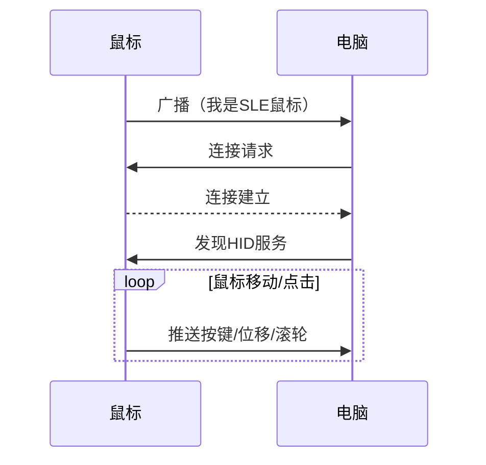
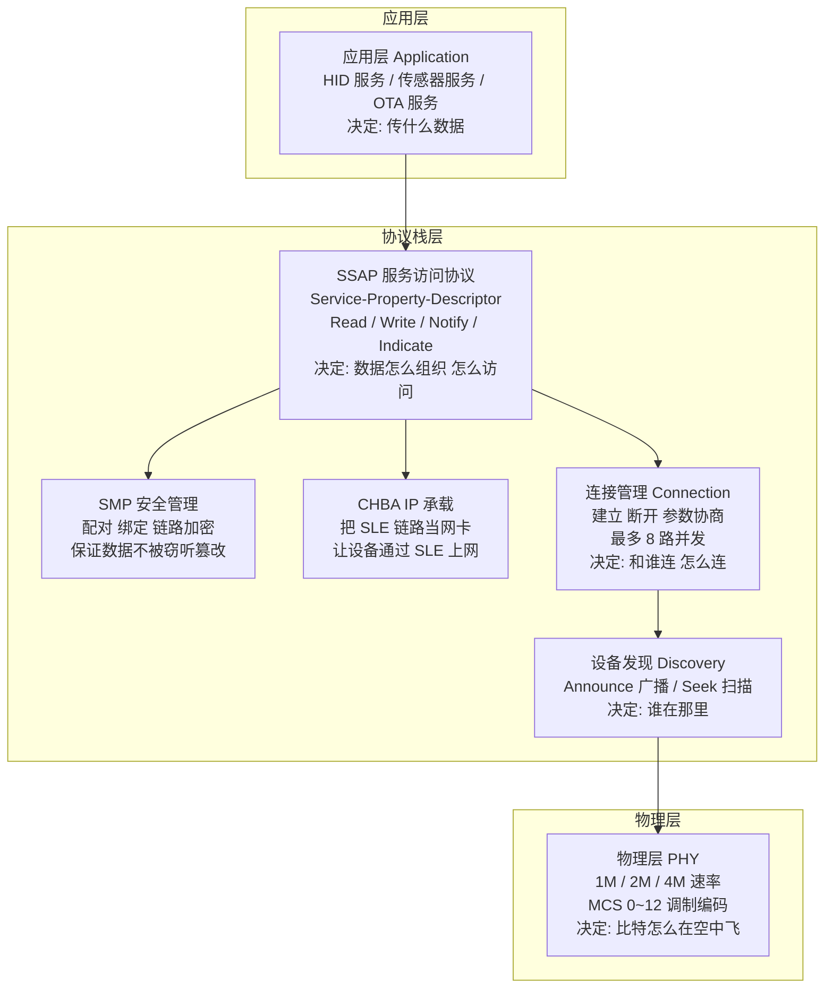

# 概述

## 认识星闪

**星闪 (SparkLink)** 是中国自主研发的新一代无线短距离通信技术标准，由星闪联盟（SparkLink Alliance）制定和推动。它的设计目标是在功耗、速率、延迟、连接数和抗干扰等方面全面超越传统短距通信技术，覆盖消费电子、智能家居、工业互联和车载场景。

星闪 1.0 标准定义了两大接入模式：

| 模式 | 定位 | 特点 | 典型场景 |
|------|------|------|---------|
| **SLB (SparkLink Basic)** | 基础高速率 | 高带宽、高吞吐 | 音视频传输、文件分享、无线投屏 |
| **SLE (SparkLink Low Energy)** | 低功耗低延迟 | 低功耗、超低延迟、多连接 | 鼠标键盘、游戏手柄、传感器、可穿戴设备 |

> 本参考文档聚焦 SLE。如果你的应用场景是鼠标、键盘、传感器上报、固件升级等短距交互场景，SLE 是最适合的选择。

---

## SLE 的通信模型

理解 SLE 的工作方式，可以从一组具体的通信场景入手。以最常见的"鼠标连接电脑"为例：



通信过程分为四个阶段：

**第一阶段：发现。** 鼠标上电后，不断向外发送广播包。电脑打开扫描搜索周边设备。当电脑收到鼠标的广播包时就发现了鼠标。

**第二阶段：连接。** 电脑向鼠标发起连接请求，双方建立一条专用的 ACL (Asynchronous Connection-Less) 通信通道。

**第三阶段：服务交互。** 鼠标通过 SLE 定义 HID (Human Interface Device) 服务，包含按键状态、X/Y 轴位移、滚轮值等属性。电脑发现服务后订阅属性——鼠标移动时通过 **Notify** 推送数据给电脑。

**第四阶段：持续维护。** 双方根据需要调整连接参数（静止时省电/移动时提速）、切换 PHY (Physical Layer) 模式，断连后自动重连。

> 小结：SLE 通信 = **发现 → 连接 → 服务交互 → 持续维护**，这是一个完整闭环。后续每一章的"场景"文档都是这个模型的展开。

---

## SLE 协议栈结构

SLE 的软件实现是一个分层协议栈，从底层无线信号到上层应用数据，每一层承担不同的职责：



> 初学者不需要一下记住所有层。开发时接触最多的是上面两层（应用层 + SSAP (SLE Service Access Protocol)），下面四层由协议栈自动处理，你通过调用 API 和注册回调来使用它们。

---

## 核心概念

### 角色模型：G 和 T

SLE 把连接中的两个设备称为 **G（Grant，授权端）** 和 **T（Terminal，终端）**。

| 角色 | 职责 | 你会在哪里用到 |
|------|------|--------------|
| **G（Grant）** | 管理连接参数（间隔、延迟）、调度通信时隙 | 通常是电脑、手机、网关 |
| **T（Terminal）** | 被动接受 G 的调度安排 | 通常是鼠标、键盘、传感器 |

注意：G/T 和 Server/Client 是两套独立的概念。G/T 描述的是**谁来管理连接**，Server/Client 描述的是**谁提供数据、谁消费数据**。一个设备可以同时是 Server 和 Client，但在一对连接中只能是一种 G/T 角色。

### 设备发现：广播与扫描

SLE 设备在建立连接之前，需要通过"发现"找到彼此。发现分为两种行为：

- **Announce（广播）**：设备周期性地向外发送广播数据包，内容包括设备名称、地址、支持的服务 UUID (Universally Unique Identifier) 等。一个设备最多同时进行 **16 路**广播。广播有多种模式——可以声明自己"可连接"（等待别人连自己），也可以"仅广播"（只宣告存在，不接受连接）。
- **Seek（扫描）**：设备在指定 PHY 信道上监听广播包。扫描到广播后，解析出对方设备的信息，决定是否发起连接。

广播-扫描的典型流程：T 端广播 → G 端扫描 → G 端发现 T 端 → G 端发起连接 → G/T 角色协商 → 连接建立。

### SSAP：数据如何组织和访问

**SSAP** 是 SLE 最核心的上层协议，定义了设备之间如何组织和访问数据。它采用 **Service → Property → Descriptor** 三级结构：

```text
Service（服务）                 ← 一个"功能模块"
  ├── Property（属性）           ← 一个"数据项"（带读/写权限）
  │     ├── Value               ← 数据本身
  │     └── Descriptor（描述符） ← 属性的元信息
  │           ├── 用户描述       ← "这是干什么的"（给用户看的文字）
  │           └── 客户端配置     ← 客户端是否订阅了通知
  └── Property
        └── ...
```

以一个温度传感器为例：

| 层级 | 实际内容 |
|------|---------|
| Service | "环境监测服务"（UUID: `0000181A-...`） |
| Property 1 | "当前温度" — 值: 26.5℃，权限: 只读 + 支持通知 |
| Property 2 | "上报间隔" — 值: 5000ms，权限: 可读可写 |
| Descriptor (P1) | 用户描述: "温度值，单位摄氏度" |

数据交互有五种操作类型：

| 操作 | 谁发起 | 说明 | 举例 |
|------|--------|------|------|
| **Read** | Client | Client 向 Server 请求读取某个属性的值，Server 返回数据 | 电脑读取传感器的"当前温度" |
| **Write Req** | Client | Client 向 Server 写入数据，Server 处理后返回确认 | 电脑修改传感器的"上报间隔"为 10s |
| **Write Cmd** | Client | Client 向 Server 写入数据，不等待确认（更快但不可靠） | 快速连续下发配置，丢一两条无所谓 |
| **Notify** | Server | Server 主动推送数据给 Client，不需要 Client 确认 | 传感器每 5s 上报一次温度值 |
| **Indicate** | Server | Server 主动推送数据给 Client，Client 必须回复确认 | 传感器检测到异常高温，必须确保电脑收到 |

每个 Property 通过**权限位**控制访问规则：

```c
SSAP_PERMISSION_READ              = 1    // 允许读取
SSAP_PERMISSION_WRITE             = 2    // 允许写入
SSAP_PERMISSION_ENCRYPTION_NEED   = 4    // 需要链路加密
SSAP_PERMISSION_AUTHENTICATION_NEED = 8  // 需要设备认证
SSAP_PERMISSION_AUTHORIZATION_NEED = 16 // 需要用户授权
```

权限可以组合使用。例如 `READ | WRITE | ENCRYPTION_NEED` 表示属性可读可写，但必须在加密链路上操作。

### 连接管理

连接建立后，协议栈提供一套 API 来管理连接的状态和质量：

- **连接参数** — 三个核心参数：连接间隔（多久收发一次数据）、延迟（可以跳过多少个间隔）、监管超时（多久没收到数据算断开）。这三个参数共同决定了功耗和响应速度的平衡。
- **PHY 切换** — SLE 支持 1M、2M、4M 三种 PHY 速率。高速率传得快但抗干扰能力弱，低速率传得慢但更稳定。可以运行时动态切换。
- **MCS (Modulation and Coding Scheme)（调制编码方案）** — MCS 0~12，数字越大速率越高但对信号质量要求越苛刻。可以把它理解为"档位"——好信号用高档，差信号降档保稳定。
- **RSSI (Received Signal Strength Indicator)（信号强度）** — 读取当前连接的接收信号强度指示，单位 dBm。可用于距离估算，但受环境多径、遮挡等因素影响，精度有限。
- **多连接** — WS63 最多同时维持 8 路 SLE 连接，通过 `conn_id` 区分不同设备。
- **断开与重连** — 断开可能是主动的（本地调用 disconnect）或被动的（对端断开、超时、走出范围）。断开后可以按固定间隔或指数退避策略尝试重连。

### 配对与安全

SLE 的安全机制分为多个层次，按使用顺序排列：

| 层次 | 做什么 | 使用的算法 |
|------|--------|-----------|
| **配对** | 两台设备首次建立信任关系，交换密钥材料 | Just Works（无界面设备）/ Passkey（输入 PIN 码） |
| **绑定** | 将配对产生的密钥保存到 NV（非易失存储），下次连接无需重新配对 | 绑定信息存储在 Flash 中 |
| **链路加密** | 对链路层所有数据进行加密，防止空中嗅探 | AC1 / AC2（认证加密） |
| **属性加密** | 对特定 SSAP 属性做加密和完整性校验，粒度更细 | EA1 (Encryption Algorithm 1) / EA2 (Encryption Algorithm 2) |

> 初学者最常见的使用路径：配对（`sle_pair_remote_device`）→ 绑定（自动，协议栈处理）→ 加密通信（自动，链路层处理）。你只需要调用配对 API 并处理回调，其余由协议栈自动完成。

---

## SLE 还能做什么

除了基础的数据读写和通知推送，SLE 还提供了几个进阶能力：

### CHBA — 让设备通过 SLE 上网

**CHBA (Converged Host Bus Adapter)** 把 SLE 链路虚拟成一张网卡。一旦虚拟网卡建立，上层 TCP/IP 协议栈（lwIP (Lightweight IP)）就能通过 SLE 链路收发 IP (Internet Protocol)数据包。支持两种模式：
- **AP (Access Point) 模式**：设备作为热点，其他设备通过 SLE 接入上网
- **STA (Station) 模式**：设备作为终端，通过 SLE 连接到网关上网

### Low Latency — 极限低延迟调度

SLE 提供专门的**低延迟调度模式**，将数据上报频率提升到最高 **8000Hz**（即每 0.125ms 上报一次）。10 档可选速率：

| 模式 | 速率 | 间隔 | 适用 |
|------|------|------|------|
| 基础 | 125Hz | 8ms | 普通办公鼠标 |
| 低延迟 | 500Hz | 2ms | 游戏外设入门 |
| 高速 | 1KHz / 2KHz | 1ms / 0.5ms | 高性能游戏鼠标/手柄 |
| 极限 | 4KHz / 8KHz | 0.25ms / 0.125ms | 竞技级外设 |

### OTA — 固件无线升级

SLE 内置 OTA (Over-The-Air) Service，可通过 SLE 链路将新固件传输到设备端。传输过程支持分片、校验和状态机管理，升级失败时可以回滚到旧版本。

### HADM — 高精度测距

**HADM (High Accuracy Distance Measurement)** 基于 Channel Sounding 技术，通过收发双方交换 IQ 数据来计算无线信号的飞行时间（ToF (Time of Flight)），从而估算两台设备之间的距离。精度远超传统 RSSI 测距。

### 射频测试

产线和认证场景下，可以通过 `sle_factory_manager` 让设备进入定频发射/接收模式。可自由配置频率、功率、PHY、调制方式、导频比例和发射间隔。

---

## 开发模型

### 回调驱动模式

SLE 的 API 设计遵循**回调驱动（Callback-driven）** 模式。这意味着：

- 你调用 API 发起一个操作（比如发起连接）
- 操作在后台异步执行
- 操作完成后，协议栈调用你提前注册的**回调函数**通知结果

这种模式适合嵌入式环境——不会阻塞主线程，多个操作可以并发进行。

```c
// 1. 定义回调函数
void my_connect_cb(int conn_id, const sle_addr_t *addr,
                   sle_acb_state_t state, sle_pair_state_t pair_state,
                   sle_disc_reason_t reason) {
    if (state == SLE_ACB_STATE_CONNECTED) {
        // 连接成功！可以做后续操作了
    }
}

// 2. 提前注册回调
sle_connection_callbacks_t cbs = { .connect_state_changed_cb = my_connect_cb };
sle_connection_register_callbacks(&cbs);

// 3. 发起连接（异步）
sle_connect_remote_device(&peer_addr);
// 函数立即返回，连接结果通过上面的 my_connect_cb 通知
```

### Server 开发：5 步建立数据提供方

Server 是"提供数据的一方"。典型开发流程：

```c
// Step 1: 注册 Server — 向协议栈申请一个 Server 身份
uint8_t server_id;
ssaps_register_server(&app_uuid, &server_id);

// Step 2: 添加 Service — 定义你提供什么功能
uint16_t service_handle;
ssaps_add_service_sync(server_id, &service_uuid, true, &service_handle);

// Step 3: 添加 Property — 定义功能中的数据项
ssaps_property_info_t prop = {
    .uuid = { .len = 2, .uuid = {0x2A, 0x1F} },  // 温度属性
    .permissions = SSAP_PERMISSION_READ | SSAP_PERMISSION_WRITE,
    .operate_indication = SSAP_OPERATE_INDICATION_BIT_READ
                        | SSAP_OPERATE_INDICATION_BIT_NOTIFY,
    .value_len = 2,
    .value = initial_value,
};
ssaps_add_property_sync(server_id, service_handle, &prop, &prop_handle);

// Step 4: 启动 Service — 让服务对外可见
ssaps_start_service(server_id, service_handle);

// Step 5: 开始广播 — 宣告自己的存在
sle_announce_param_t param = { /* 广播间隔、PHY、数据内容 */ };
sle_set_announce_param(0, &param);
sle_start_announce(0);
```

### Client 开发：6 步建立数据消费方

Client 是"消费数据的一方"。典型开发流程：

```c
// Step 1: 注册 Client
uint8_t client_id;
ssapc_register_client(&app_uuid, &client_id);

// Step 2: 开始扫描
sle_seek_param_t seek_param = { /* 扫描 PHY、过滤策略 */ };
sle_set_seek_param(&seek_param);
sle_start_seek();

// Step 3: 发现目标后建立连接
// 在 seek_result_cb 回调中拿到设备地址后：
sle_connect_remote_device(&target_addr);

// Step 4: 连接成功后，发现对方的服务
// 在 connect_state_changed_cb 回调中确认连接后：
ssapc_find_structure_param_t param = {
    .type = SSAP_FIND_TYPE_PRIMARY_SERVICE,
    .start_hdl = 1, .end_hdl = 0xFFFF
};
ssapc_find_structure(client_id, conn_id, &param);

// Step 5: 发现服务后，读写属性
// 在 find_structure_cb 回调中拿到 service/property 信息后：
ssapc_write_param_t wparam = { .handle = prop_handle, .type = 0, .data = buf, .data_len = len };
ssapc_write_req(client_id, conn_id, &wparam);
ssapc_read_req(client_id, conn_id, prop_handle, 0);

// Step 6: 接收 Server 主动推送的数据
// 在 notification_cb / indication_cb 回调中接收数据
```

### 回调注册一览

协议栈的各子模块采用统一的回调注册模式：

```c
// 连接状态变化、参数更新、配对结果、RSSI 读数
sle_connection_register_callbacks(&conn_cbs);

// 广播启用/停用、扫描结果
sle_announce_seek_register_callbacks(&announce_seek_cbs);

// SSAP Server：读请求、写请求、通知发送结果
ssaps_register_callbacks(&server_cbs);

// SSAP Client：发现完成、读完成、写确认、收到通知/指示
ssapc_register_callbacks(&client_cbs);
```

> 理解回调驱动是 SLE 开发的关键。不要试图在调用 API 后轮询等待结果——把后续操作写在对应的回调函数中。

---

## WS63 芯片 SLE 能力规格

以下规格适用于 WS63 / WS63E 芯片，使用前请确认你的 SDK版本。

### 物理层

| 参数 | 规格 |
|------|------|
| PHY 模式 | 1M / 2M / 4M |
| Radio Frame Type | Type 1 / Type 2 / Type 3(M0~M5) / Type 4(M0~M5) |
| MCS（调制编码方案） | 0 ~ 12 |
| 调制方式 | GFSK (Gaussian Frequency Shift Keying) / QPSK (Quadrature Phase Shift Keying) / 8PSK |
| 导频密度 | 4:1 / 8:1 / 16:1 / 无导频 |
| 最大发射功率 | +20 dBm |
| 功率可调范围 | -127 ~ +20 dBm |

### 链路层

| 参数 | 规格 |
|------|------|
| 最大并发连接数 | 8 |
| 最大并发广播数 | 16 |
| 设备地址类型 | Public（固定，0）/ Random（随机，6） |
| 连接间隔范围 | 12.5ms ~ 2s（步进 1.25ms） |
| 监管超时范围 | 100ms ~ 32s（步进 10ms） |

### 低延迟调度

| 速率 | 上报间隔 | 典型场景 |
|------|---------|---------|
| 125Hz | 8ms | 普通办公外设 |
| 500Hz | 2ms | 入门游戏外设 |
| 1KHz | 1ms | 游戏手柄 |
| 2KHz | 0.5ms | 高性能游戏鼠标 |
| 4KHz | 0.25ms | 电竞级外设 |
| 8KHz | 0.125ms | 极限低延迟，对信号质量要求最高 |

### 加密算法

| 算法 | 类型 | 用途 |
|------|------|------|
| AC1 / AC2 | 认证加密算法 | 链路层数据加密与完整性认证 |
| EA1 / EA2 | 加密算法 | SSAP 属性级加密 |
| HA1 / HA2 | 密钥派生算法 | 从配对密钥派生会话密钥 |


