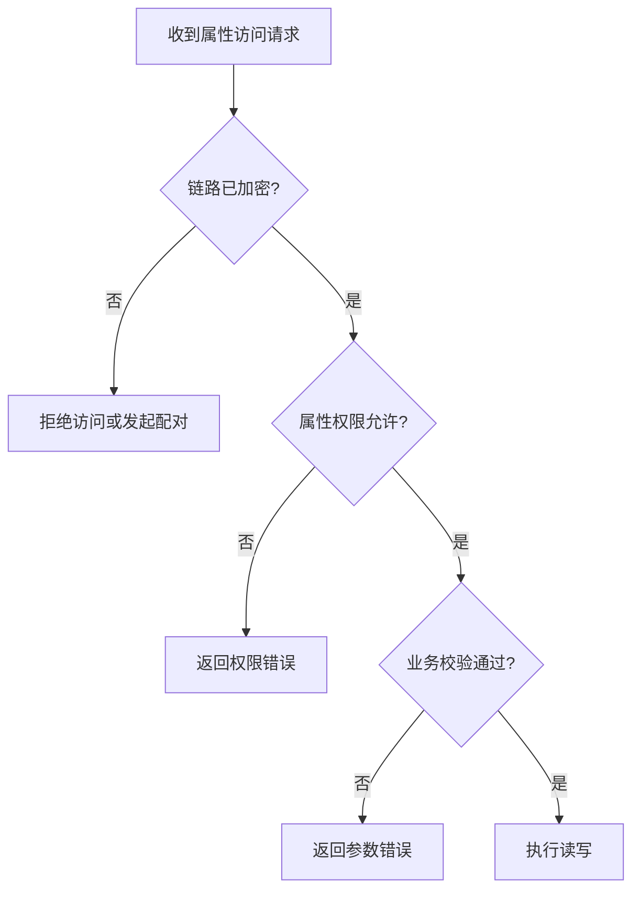

# SLE 安全机制

> 统一说明 SLE (SparkLink Low Energy) 配对、绑定、白名单和加密关系。当前 SDK 没有一一对应的完整安全案例，本页作为设计与验证指导。

## 安全层次

```text
设备发现与连接
    ↓
配对与身份认证
    ↓
链路加密
    ↓
绑定信息持久化
    ↓
白名单和属性权限控制
```

各层解决的问题不同：配对建立信任，链路加密保护传输，绑定支持重连恢复，白名单限制允许连接的设备，属性权限限制连接后的数据访问。

## 配对与绑定

| 项目 | 配对 | 绑定 |
| --- | --- | --- |
| 目的 | 为当前连接建立认证和密钥 | 保存长期密钥供重连使用 |
| 首次连接 | 需要 | 可选 |
| 后续重连 | 可能重新执行 | 可恢复加密 |

Client 通常在连接成功后调用配对接口，双方通过认证完成回调判断结果。只有认证成功后才能把连接标记为安全可用。

## 白名单

白名单用于限制发现或连接阶段允许的远端设备。启用前应先确认：

- 绑定记录已经成功写入 NV (Non-Volatile) 。
- 白名单容量和淘汰策略明确。
- 用户能够触发清除绑定和重新配网。
- 恢复出厂设置会同步清理绑定与白名单。

白名单不能替代加密或属性权限；它只缩小允许连接的设备范围。

## 链路加密与属性权限

链路加密保护空口数据，Property 权限控制某个属性是否允许读写。应用应同时检查：

1. 配对或认证是否成功。
2. 当前连接是否已经进入加密状态。
3. 目标 Property 是否要求认证、加密或授权。
4. 业务数据自身的长度、范围和状态是否合法。



## 重连和异常恢复

- 已绑定设备重连后，等待加密恢复完成再开始服务发现和业务交互。
- 双方密钥不一致时，删除旧记录并重新配对，不能无限重试。
- 断开连接后清除当前连接的安全状态，避免新连接复用旧标志。
- NV 写入应移交业务任务处理，避免在协议回调中执行耗时操作。

## 源码参考

以下工程包含配对、认证状态或加密相关调用，可用于理解回调顺序，但不是完整的安全功能案例：

```text
src/application/samples/bt/sle/sle_speed_server/
src/application/samples/bt/sle_chba/
```

## 验证清单

- 首次连接能够完成配对和认证。
- 未加密连接无法访问受保护 Property。
- 绑定设备重连后能够恢复加密。
- 非白名单设备被正确拒绝。
- 清除绑定后必须重新配对。
- 认证失败、密钥不一致和 NV 异常均有明确恢复路径。
