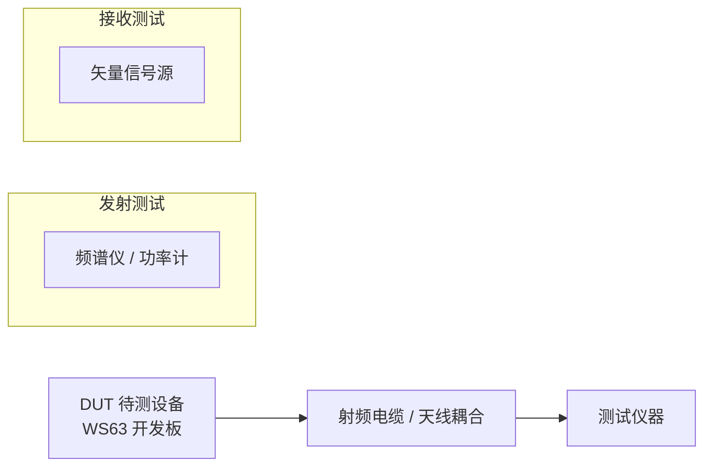
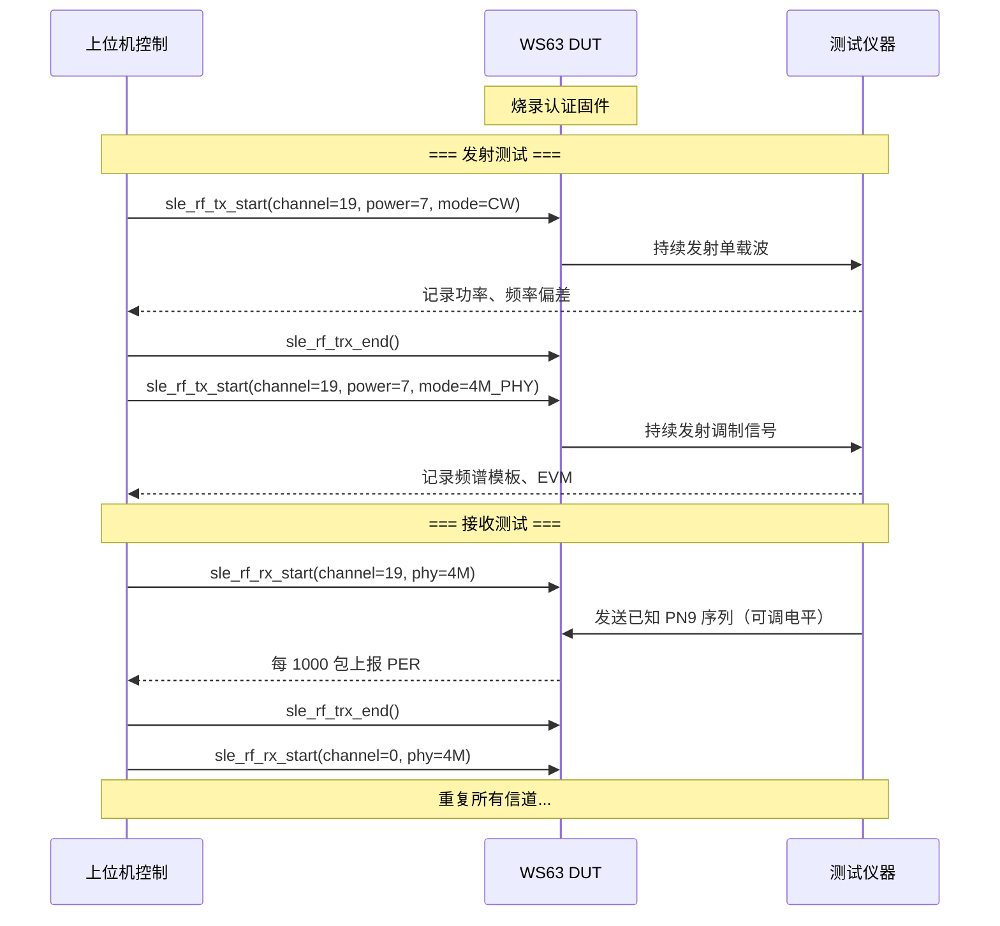

# RF 认证测试

> SLE (SparkLink Low Energy) Factory API（定频 TX/RX、单载波）

> 前置阅读：[Hello SLE](../basics/hello-connect.md)

## 学习目标

- 理解射频认证测试的目的——SRRC/FCC/CE 认证需要定频发射和接收灵敏度测试
- 掌握 `sle_rf_tx_start()` 定频发射和 `sle_rf_rx_start()` 定频接收
- 理解单载波测试（Single Tone）和调制信号测试的区别
- 能够在 WS63 上配置射频认证所需的测试模式

## 基本概念

### 射频认证的必要性

无线产品上市前必须通过各国射频认证（SRRC 中国 / FCC 美国 / CE 欧洲）。认证实验室用频谱仪测量发射功率、杂散、频谱模板，用信号源测试接收灵敏度。认证未通过的产品不得销售。

### 定频模式

正常模式下设备在多个信道跳频——但认证测试需要固定在一个信道上发射或接收，以便仪器精确测量。`sle_rf_tx_start()` 配置信道 / 功率 / 调制模式后持续发射，频谱仪即可测量。

### 测试架构

认证测试的典型连接拓扑——一台 DUT（待测设备）对一台测试仪器：



### 单载波 vs 调制信号

| 测试类型 | 发射内容 | 测量项目 | 仪器 |
|---------|---------|---------|------|
| 单载波 CW | 未经调制的纯载波（单一频率） | 发射功率、频率偏差、相位噪声 | 频谱仪、功率计 |
| 调制信号 | 带调制的数据包（1M/2M/4M PHY (Physical Layer)） | 频谱模板、EVM、杂散发射 | 矢量信号分析仪 |
| 接收灵敏度 | DUT 处于接收状态 | PER (Packet Error Rate) vs 信号电平、灵敏度门限 | 矢量信号源 + 上位机统计 |

单载波测试最简单——只有一个频率点，没有调制信息。调制测试更接近实际工作状态，能反映发射机在线性度、EVM 等方面的真实性能。

## 涉及 API

| API | 用途 |
|-----|------|
| `sle_factory_register_callbacks()` | 注册产测回调（接收统计回调） |
| `sle_rf_tx_start()` | 启动定频发射 |
| `sle_rf_rx_start()` | 启动定频接收 |
| `sle_rf_trx_end()` | 停止发射 / 接收 |
| `sle_rf_reset()` | 复位射频状态 |
| `sle_rf_set_tx_power()` | 设置发射功率等级 |

## 案例说明

### 案例简介

配置 WS63 进入定频发射模式 → 在指定信道上以指定功率持续发射 → 频谱仪验证功率 / 频谱。配置定频接收模式 → 信号源发送已知信号 → 统计 PER。

Kconfig 选择认证模式——正常模式或认证模式互斥，二者不能同时启用。

### 认证测试完整流程



## 案例操作指导

### 第一步：编译认证固件


在 `.config` 中启用认证模式（禁用正常 sample）：

```bash
CONFIG_SAMPLE_SUPPORT_SLE_RF_TEST_SAMPLE=y
CONFIG_SLE_RF_TEST_MODE=y
```

```bash
fbb build ws63-liteos-app
fbb build ws63-liteos-app
```

### 第二步：连接测试仪器

将 WS63 的射频输出通过 SMA 转接线连接到频谱仪或信号源。如果使用天线耦合方式，将 DUT 和仪器天线放置在屏蔽箱内。

> 认证实验室通常要求传导测试（射频线直连），以保证测量精度和可重复性。

### 第三步：执行发射测试

上位机通过串口发送测试指令（或烧录固件时预设测试模式），DUT 进入定频发射：

```text
=== TX Test - Channel 19 (2440 MHz), Power Level 7, 4M PHY ===
[sle rf test] tx start channel=19 power=7 phy=4M
[sle rf test] transmitting... press any key to stop
```

频谱仪中心频率设为 2440 MHz，Span 10 MHz，RBW 100 kHz。观察功率读数和频谱形状。

### 第四步：执行接收测试

上位机发送接收指令，DUT 进入定频接收模式。信号源发送 PN9 调制的 SLE 数据包，逐步降低电平，DUT 上报 PER：

```text
=== RX Test - Channel 19 (2440 MHz), 4M PHY ===
[sle rf test] rx start channel=19 phy=4M
[sle rf test] [0-999]   PER: 0.0%
[sle rf test] [1000-1999] PER: 0.0%
[sle rf test] [2000-2999] PER: 1.2%
...
```

PER 超过认证门限（通常 1%）时的信号电平即为接收灵敏度。

## 关键配置

### 发射参数

```c
/* 定频发射配置结构体 */
sle_rf_tx_start_t tx_param = {0};

/* 发射信道：0~39，对应 2402~2480 MHz。
   2402 + channel × 2 = 实际频率 (MHz)。
   信道 19 对应 2440 MHz，是常用的中间信道。 */
tx_param.channel = 19;

/* 发射功率等级：0~7。
   0: -127 dBm, 1: -20 dBm, 2: -10 dBm,
   3: 0 dBm, 4: +5 dBm, 5: +10 dBm,
   6: +15 dBm, 7: +20 dBm */
tx_param.power_level = 7;

/* 调制模式。
   SLE_RF_TEST_MODE_CW: 单载波，测量发射功率和频率偏差
   SLE_RF_TEST_MODE_1M: 1M PHY 调制信号
   SLE_RF_TEST_MODE_2M: 2M PHY 调制信号
   SLE_RF_TEST_MODE_4M: 4M PHY 调制信号 */
tx_param.test_mode = SLE_RF_TEST_MODE_CW;

/* 包格式：PN9 伪随机序列。
   认证标准要求使用 PN9 序列，保证数据具有足够的随机性。 */
tx_param.payload_type = SLE_RF_TEST_PAYLOAD_PN9;
```

| 参数 | 可选值 | 认证常用值 | 说明 |
|------|--------|-----------|------|
| channel | 0~39 | 0(低), 19(中), 39(高) | 认证要求测低中高三个信道 |
| power_level | 0~7 | 7（最大） | 发射功率测试用最大功率 |
| test_mode | CW / 1M / 2M / 4M | 全部 | 每种模式都需要测试 |
| payload_type | PN9 / ALL_0 / ALL_1 | PN9 | 认证标准要求 |

### 接收参数

```c
sle_rf_rx_start_t rx_param = {0};

/* 接收信道：与发射方匹配。
   如果信号源发 2440 MHz，DUT 也必须收 2440 MHz。 */
rx_param.channel = 19;

/* 期望的 PHY 模式：与信号源发送的调制方式匹配。
   接收方需要知道对方用什么 PHY 来正确解调。 */
rx_param.phy = SLE_PHY_4M;

/* 统计间隔：每收到 RX_STATS_INTERVAL 个包计算一次 PER。
   1000 包是一个平衡点——既不会因样本太少而波动大，
   也不会因间隔太长而失去时效性。 */
rx_param.stats_interval = 1000;
```

### 信道频率对照表

| 信道号 | 中心频率 (MHz) | 用途 |
|:---:|:---:|------|
| 0 | 2402 | 低频信道——认证必测 |
| 19 | 2440 | 中间信道——认证必测 |
| 39 | 2480 | 高频信道——认证必测 |

## 代码详解

### 定频发射配置与启动

```c
static errcode_t start_rf_tx_test(uint8_t channel, uint8_t power,
                                   uint8_t mode)
{
    sle_rf_tx_start_t tx_param = {0};

    /* 填充发射参数 */
    tx_param.channel      = channel;
    tx_param.power_level  = power;
    tx_param.test_mode    = mode;
    tx_param.payload_type = SLE_RF_TEST_PAYLOAD_PN9;

    /* 启动定频发射。调用后射频立即开始持续发射，
       直到调用 sle_rf_trx_end() 才会停止。
       注意：发射期间 CPU 仍在运行，串口仍可响应。 */
    errcode_t ret = sle_rf_tx_start(&tx_param);
    if (ret != ERRCODE_SUCC) {
        printf("[rf test] tx start failed: %d\n", ret);
        return ret;
    }

    printf("[rf test] tx started: ch=%d pwr=%d mode=%d\n",
           channel, power, mode);
    printf("[rf test] transmitting... press key to stop\n");
    return ERRCODE_SUCC;
}
```

### 定频接收配置与 PER 统计

```c
static errcode_t start_rf_rx_test(uint8_t channel, uint8_t phy)
{
    sle_rf_rx_start_t rx_param = {0};

    rx_param.channel         = channel;
    rx_param.phy             = phy;
    rx_param.stats_interval  = 1000;  // 每 1000 包统计一次

    errcode_t ret = sle_rf_rx_start(&rx_param);
    if (ret != ERRCODE_SUCC) {
        printf("[rf test] rx start failed: %d\n", ret);
        return ret;
    }

    printf("[rf test] rx started: ch=%d phy=%d\n", channel, phy);
    return ERRCODE_SUCC;
}
```

### 接收统计回调

```c
/* 产测回调——协议栈每收到 stats_interval 个包触发一次 */
static void rf_rx_stats_cb(uint8_t channel, uint32_t total_pkts,
                            uint32_t crc_err_pkts)
{
    uint32_t good_pkts = total_pkts - crc_err_pkts;
    uint32_t per_mille = 0;

    if (total_pkts > 0) {
        /* PER = 错误包数 / 总包数，以千分比表示 */
        per_mille = (crc_err_pkts * 1000) / total_pkts;
    }

    printf("[rf test] ch=%d rx=%d err=%d PER=%d.%d%%\n",
           channel, total_pkts, crc_err_pkts,
           per_mille / 10, per_mille % 10);
}
```

### 测试流程自动化

认证实验室通常需要按以下顺序测试所有组合：

```c
typedef struct {
    uint8_t channel;
    uint8_t power;
    uint8_t mode;
} rf_test_case_t;

/* 发射测试用例表——覆盖认证标准要求的所有组合 */
static const rf_test_case_t tx_test_cases[] = {
    /* 单载波：低中高信道 */
    { 0, 7, SLE_RF_TEST_MODE_CW },
    {19, 7, SLE_RF_TEST_MODE_CW },
    {39, 7, SLE_RF_TEST_MODE_CW },
    /* 1M PHY：低中高信道 */
    { 0, 7, SLE_RF_TEST_MODE_1M },
    {19, 7, SLE_RF_TEST_MODE_1M },
    {39, 7, SLE_RF_TEST_MODE_1M },
    /* 2M PHY：低中高信道 */
    { 0, 7, SLE_RF_TEST_MODE_2M },
    {19, 7, SLE_RF_TEST_MODE_2M },
    {39, 7, SLE_RF_TEST_MODE_2M },
    /* 4M PHY：低中高信道 */
    { 0, 7, SLE_RF_TEST_MODE_4M },
    {19, 7, SLE_RF_TEST_MODE_4M },
    {39, 7, SLE_RF_TEST_MODE_4M },
};

static void run_tx_test_suite(void)
{
    for (int i = 0; i < sizeof(tx_test_cases) / sizeof(tx_test_cases[0]); i++) {
        rf_test_case_t tc = tx_test_cases[i];
        printf("\n=== TC%d: ch=%d pwr=%d mode=%d ===\n",
               i + 1, tc.channel, tc.power, tc.mode);

        start_rf_tx_test(tc.channel, tc.power, tc.mode);

        /* 等待实验室操作员按需记录数据 */
        printf("waiting 10s for measurement...\n");
        osal_sleep_ms(10000);

        sle_rf_trx_end();
        printf("tx stopped.\n");
    }

    printf("all tx test cases done.\n");
}
```

> 认证测试代码一般不会随产品固件发布——它仅用于认证阶段。认证通过后，通过 Kconfig 关闭认证模式，切换回正常应用固件。

---

