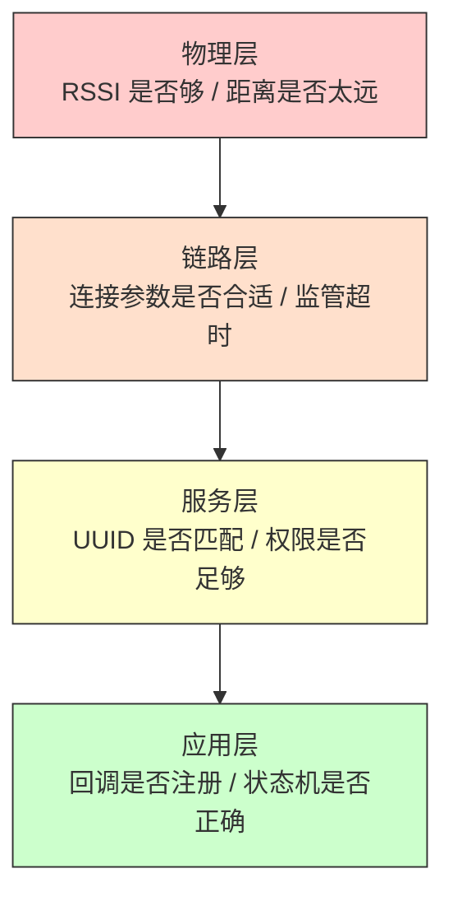
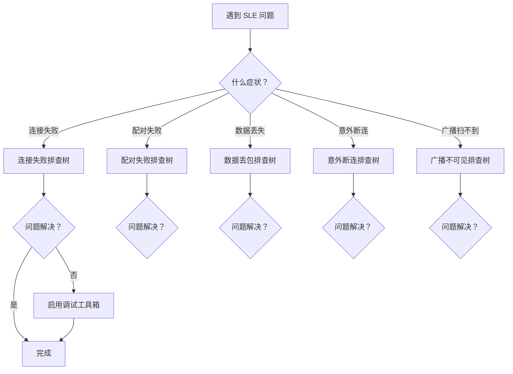

# 故障排除

> SLE (SparkLink Low Energy) 错误码、调试方法

> 阅读时机：当 SLE 开发遇到问题时按症状索引查阅

## 学习目标

- 掌握根据症状（连接失败 / 配对失败 / 数据丢包 / 断连）快速定位问题的排查树
- 理解 SLE 常见错误码的含义和解决方向
- 掌握基本的调试手段——错误码日志、RSSI (Received Signal Strength Indicator) 监控、回调追踪

## 基本概念

### 问题排查的方法论：分层排查

SLE 协议栈从底层到顶层分为四个层次。问题排查时从最低层开始，逐层向上排除——底层问题会掩盖上层问题：



| 层次 | 排查的问题 | 关键指标 |
|------|-----------|---------|
| 物理层 | 信号是否够强、距离是否合适、天线是否正常 | RSSI < -90 dBm 基本无法通信 |
| 链路层 | 连接是否建立、参数是否匹配、超时设置是否合理 | `conn_state_changed_cb` 的状态值 |
| 服务层 | UUID (Universally Unique Identifier) 是否一致、权限是否匹配、服务是否已启动 | `find_structure_cb` 的返回值 |
| 应用层 | 回调是否注册、状态机是否正确、参数是否有效 | API 返回值 + 回调触发情况 |

### 排查树的使用

每个症状对应一棵排查树——从最常见的根因开始逐层排除。排查树的叶子节点是具体行动项，例如"检查函数返回值"或"增大监管超时"。

## 涉及 API

排查问题主要依赖回调信息和状态查询 API：

| API | 用途 |
|-----|------|
| `sle_read_remote_device_rssi()` | 读取 RSSI 判断链路质量 |
| `sle_get_local_addr()` | 查询本地地址确认设备身份 |
| `sle_connection_register_callbacks()` | 注册连接回调——`conn_state_changed_cb` 包含断连原因 |
| `sle_announce_seek_register_callbacks()` | 注册扫描回调——`seek_result_cb` 包含扫描到的设备信息 |

## 案例说明

### 案例简介

本文档是一个问题排查索引——不演示正常流程，而是为每个常见症状提供"排查树"。当你的 SLE 程序出现问题时，按症状找到对应的排查树，从根节点开始一步步往下排查。

### 排查流程总览



## 常见问题排查树

### 问题 1：连接失败

连接失败是最常见的问题——两块板子无法建立 SLE 连接。排查从最可能的原因开始：

| 步骤 | 排查项 | 检查方法 | 解决方案 |
|:---:|--------|---------|---------|
| 1 | 广播是否已启动？ | Server 串口是否有 `announce_enable_cb` 日志 | 确认 `sle_start_announce()` 被调用且返回 OK |
| 2 | 扫描是否已启动？ | Client 串口是否有 `seek_enable_cb` 日志 | 确认 `sle_start_seek()` 被调用且返回 OK |
| 3 | 扫描是否扫到了设备？ | Client 串口是否有 `seek_result_cb` 日志 | 如果没有，检查广播间隔是否大于扫描窗口 |
| 4 | 设备名是否匹配？ | Client 扫描结果中的设备名与目标名是否一致 | 对比 Server 广播名和 Client 匹配字符串 |
| 5 | 地址类型是否匹配？ | Public address vs Random address 是否匹配 | 确认双方使用的地址类型一致 |
| 6 | 是否达到最大连接数？ | 返回 `ERRCODE_SLE_CONN_REACH_MAX` | WS63 最多 8 路连接，断开不用的连接 |
| 7 | 距离是否太远？ | RSSI 是否 < -90 dBm | 缩短距离或增大发射功率 |
| 8 | `enable_sle()` 是否被调用？ | 协议栈初始化是否完成 | 确认代码中 `enable_sle()` 先于一切 SLE API 调用 |

> 按步骤顺序排查——大多数连接失败问题在前 3 步就能定位。

### 问题 2：配对失败

配对是在连接建立后进行的，失败原因通常与安全参数有关：

| 步骤 | 排查项 | 检查方法 | 解决方案 |
|:---:|--------|---------|---------|
| 1 | 前一次配对是否还在进行？ | 返回 `ERRCODE_SLE_BUSY` | 等待 `pair_complete_cb` 回调后再发起新配对 |
| 2 | 双方 SDK版本是否一致？ | 串口打印协议栈版本号 | 升级到相同版本 |
| 3 | IO Capability 是否兼容？ | 检查双方 `io_capability` 配置 | Just Works 要求双方都支持 |
| 4 | 是否已绑定但密钥损坏？ | `pair_complete_cb` 返回失败 | 调用 `remove_pair()` 清除旧绑定后重新配对 |
| 5 | MIC 校验是否通过？ | `pair_complete_cb` 返回认证失败 | 可能是中间人攻击——删除绑定重新配对 |

### 问题 3：数据发送失败 / 丢包

连接已建立但数据发不出去或收到的不完整：

| 步骤 | 排查项 | 检查方法 | 解决方案 |
|:---:|--------|---------|---------|
| 1 | MTU (Maximum Transmission Unit) 是否已协商？ | 交换 MTU 的回调是否触发 | 必须先配对和 MTU 交换才能发送数据 |
| 2 | 连接是否已加密？ | 加密属性的数据在加密前发送会失败 | 等待加密完成后再发送 |
| 3 | 发送缓冲区是否满？ | 返回 `ERRCODE_SLE_BUSY` | 暂停发送等待 QoS 流控恢复 |
| 4 | conn_id 是否有效？ | 连接已断开但还在用旧 conn_id | 检查 `conn_state_changed_cb` 确认连接仍在 |
| 5 | 连接间隔是否过长？ | 100ms 以上的间隔会导致大量堆积 | 减小连接间隔到 12.5ms 以内 |

### 问题 4：意外断连

连接正常使用中突然断开：

| 步骤 | 排查项 | 检查方法 | 解决方案 |
|:---:|--------|---------|---------|
| 1 | 是否是监管超时？ | `disc_reason` 是否为 `SLE_DISC_SUPERVISION_TIMEOUT` | 增大 `conn_supervision_timeout` 或缩小连接间隔 |
| 2 | 是否远端主动断开？ | `disc_reason` 是否为 `SLE_DISCONNECT_BY_REMOTE` | 检查对端日志，找到对端断开原因 |
| 3 | 是否 MIC 校验失败？ | `disc_reason` 中包含 MIC 相关错误 | 信道干扰严重——降低 PHY (Physical Layer) 速率，切换信道 |
| 4 | 是否射频干扰？ | RSSI 突然暴跌 | 2.4GHz 信道被 WiFi 或其他设备占用 |
| 5 | 连接参数是否合适？ | 监管超时是否大于 `(1+latency) × interval × 2` | 按公式调整参数 |

### 问题 5：广播扫不到

Server 在广播但 Client 扫不到：

| 步骤 | 排查项 | 检查方法 | 解决方案 |
|:---:|--------|---------|---------|
| 1 | 广播模式是否正确？ | 检查 `announce_mode` 参数 | 必须设为"可连接可扫描"或"可连接可扫描定向" |
| 2 | 三个广播信道是否全部被干扰？ | 切换 WiFi 信道或换环境测试 | 避开 2.4GHz 拥堵环境 |
| 3 | 广播是否被白名单过滤？ | 检查白名单设置 | 确认 Client 不在过滤名单中 |
| 4 | 扫描窗口是否小于广播间隔？ | 对比`seek_window`和 `announce_interval` | 增大扫描窗口或减小广播间隔 |
| 5 | 天线是否连接？ | 物理检查 | 确认天线已拧紧或 PCB (Printed Circuit Board) 天线未遮挡 |

## 调试工具箱

### 错误码日志

每个 API 调用后检查返回值——这是最基础也是最重要的调试手段：

```c
/* 包装宏——每个 API 调用后自动打印错误 */
#define SLE_CHECK_CALL(call, name) do {              \
    errcode_t __ret = (call);                        \
    if (__ret != ERRCODE_SUCC) {                     \
        printf("[sle] %s failed: err=%d (%s)\n",     \
               name, __ret, errcode_to_string(__ret)); \
    }                                                \
} while (0)

/* 使用示例 */
SLE_CHECK_CALL(sle_start_announce(1), "sle_start_announce");
SLE_CHECK_CALL(sle_start_seek(), "sle_start_seek");
SLE_CHECK_CALL(sle_connect_remote_device(&addr), "sle_connect");
```

### 常见错误码速查

| 错误码 | 宏名称 | 含义 | 解决方向 |
|--------|--------|------|---------|
| 0x00 | `ERRCODE_SUCC` | 成功 | — |
| 0x01 | `ERRCODE_FAIL` | 通用失败 | 检查参数和协议栈状态 |
| 0x02 | `ERRCODE_SLE_BUSY` | 协议栈忙 | 等待后重试 |
| 0x03 | `ERRCODE_SLE_NOT_ENOUGH_RESOURCES` | 资源不足 | 减少并发操作 |
| 0x10 | `ERRCODE_SLE_CONN_REACH_MAX` | 达到最大连接数 | 断开不用的连接 |
| 0x11 | `ERRCODE_SLE_CONN_NOT_EXIST` | 连接不存在 | 检查 conn_id |
| 0x20 | `ERRCODE_SLE_PAIR_IN_PROGRESS` | 配对进行中 | 等待当前配对完成 |
| 0x30 | `ERRCODE_SLE_DATA_SEND_FAIL` | 数据发送失败 | 检查 MTU 和加密状态 |

### RSSI 监控

定时读取 RSSI，判断链路质量变化趋势：

```c
static void rssi_monitor_task(void *arg)
{
    while (1) {
        if (g_conn_id != 0) {
            int8_t rssi = sle_read_remote_device_rssi(g_conn_id);
            printf("[rssi] conn=%d rssi=%d dBm  %s\n",
                   g_conn_id, rssi,
                   rssi > -60 ? "excellent" :
                   rssi > -75 ? "good" :
                   rssi > -85 ? "fair" : "poor");
        }
        osal_sleep_ms(1000);  // 每秒读取一次
    }
}
```

### 回调追踪

在每个回调入口打日志，确认回调链是否按预期顺序触发：

```c
static void sle_hello_connect_state_changed_cbk(uint16_t conn_id,
    const sle_addr_t *addr, sle_acb_state_t conn_state,
    sle_pair_state_t pair_state, sle_disc_reason_t disc_reason)
{
    /* 追踪回调入口 */
    printf("[cb] connect_state_changed: conn=%d state=%d pair=%d disc=%d\n",
           conn_id, conn_state, pair_state, disc_reason);

    if (conn_state == SLE_ACB_STATE_CONNECTED) {
        printf("[cb] -> CONNECTED\n");
        g_conn_id = conn_id;
    } else if (conn_state == SLE_ACB_STATE_DISCONNECTED) {
        printf("[cb] -> DISCONNECTED reason=%d\n", disc_reason);
        g_conn_id = 0;
    }
}
```

### 调试手段汇总

| 手段 | 用途 | 方法 |
|------|------|------|
| 错误码日志 | 每个 API 调用后检查返回值 | `if (ret != ERRCODE_SUCC)` → 打印 `errcode_to_string(ret)` |
| RSSI 监控 | 判断链路质量 | `sle_read_remote_device_rssi()` 每秒读取 |
| 回调追踪 | 确认回调是否被触发及顺序 | 在每个回调入口打日志 |
| 广播 / 扫描确认 | 确认双方是否互相可见 | 用手机 BLE (Bluetooth Low Energy) 扫描 APP 观察 SLE 广播包 |
| AT 指令验证 | 排除应用代码问题 | 切换到 AT 模式测试同一功能 |
| 频谱仪 | 确认射频发射正常 | 观察发射功率和频谱形状 |
| 逻辑分析仪 | 确认串口通信正常 | 捕获 UART (Universal Asynchronous Receiver/Transmitter) 数据波形 |

> 调试时优先使用最轻量的手段——日志 > RSSI > AT 指令 > 仪器。除非怀疑硬件问题，否则不需要上来就接仪器。

## 案例操作指导

### 排查步骤速查

当问题发生时，按以下顺序收集信息：

1. **收集错误码**——每个 API 调用的返回值是什么？
2. **检查回调触发顺序**——回调是否按预期触发？哪个没触发？
3. **读取 RSSI**——信号强度是否在正常范围（> -75 dBm）？
4. **确认配置参数**——广播参数、连接参数、PHY/MCS 是否匹配？
5. **切换到 AT 模式**——排除应用层代码问题
6. **查看协议栈日志**——启用协议栈调试日志（需要特殊固件）

### 快速自检清单

在向他人求助之前，先过一遍这个清单：

- [ ] `enable_sle()` 是否被调用且成功返回？
- [ ] 回调函数是否在调用相应的 API 之前注册？
- [ ] Server 的 `announce_mode` 是否包含"可连接"？
- [ ] Client 的 `seek_phys` 是否与 Server 的广播 PHY 匹配？
- [ ] `conn_supervision_timeout` 是否 > `(1+latency) × conn_interval_max × 2`？
- [ ] 发送数据前是否已完成配对和 MTU 交换？
- [ ] RSSI 是否 > -85 dBm？
- [ ] 两块板子的 SDK 版本是否一致？

---

