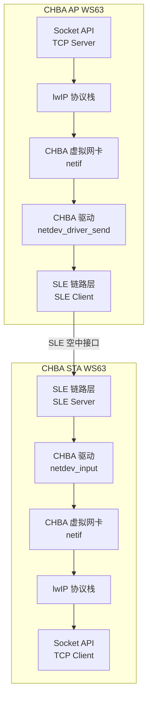
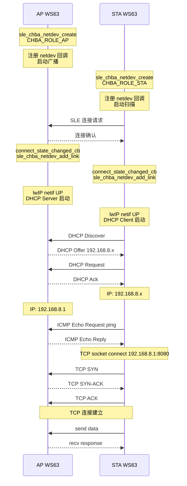

# CHBA IP

> CHBA (Converged Host Bus Adapter) — IP (Internet Protocol) 承载与上网 — SLE (SparkLink Low Energy)、CHBA、lwIP (Lightweight IP)

> 前置阅读：[Hello SLE](../basics/hello-connect.md)

## 学习目标

- 理解 CHBA 的核心概念——在 SLE 链路上承载 IP 协议栈，实现"星闪上网"
- 掌握 AP (Access Point) 模式（SLE Client 端）和 STA (Station) 模式（SLE Server 端）的 CHBA 角色配置
- 理解 CHBA 虚拟网卡与 lwIP 协议栈的层次关系
- 能够在两块 WS63 之间通过 SLE 建立 IP 通道，实现 ping 通和 Socket 通信

## 规格与功能

本案例使用两块 WS63，一块作为 CHBA AP，另一块作为 CHBA STA 。建立 SLE 连接后，通过 CHBA 虚拟网卡承载 IP 协议栈，实现 ping 和 TCP (Transmission Control Protocol)Socket 通信。

| 规格项 | CHBA AP | CHBA STA |
|--------|---------|----------|
| SLE 角色 | SLE Client | SLE Server |
| CHBA 角色 | `CHBA_ROLE_AP` | `CHBA_ROLE_STA` |
| 网卡创建 | `sle_chba_netdev_create(CHBA_ROLE_AP, mode)` | `sle_chba_netdev_create(CHBA_ROLE_STA, mode)` |
| IP 获取 | 静态 192.168.8.1 | DHCP (Dynamic Host Configuration Protocol) Client 自动获取 192.168.8.x |
| DHCP | 启用 DHCP Server | 启用 DHCP Client |
| 最大 STA 数 | 默认 8 | — |
| 数据路径 | lwIP → CHBA 网卡 → SLE 空中 | SLE 空中 → CHBA 网卡 → lwIP |

系统架构——从 SLE 链路到 Socket 通信的完整层次：



程序运行流程：

1. AP 上电广播，STA 扫描并发起 SLE 连接
2. 双方创建 CHBA 虚拟网卡，将连接绑定到网卡
3. lwIP netif 状态设为 UP，AP 启动 DHCP Server
4. STA 通过 DHCP Client 获取 IP 地址
5. STA ping AP 验证 IP 连通性
6. 双方建立 TCP Socket 连接传输数据

## 基本概念

### 典型使用场景

CHBA 让 SLE 不只是"数据通道"，而是完整的"网络接口"——上层可以直接用 Socket API而不需要理解 SLE 细节：

- **星闪上网卡**：WS63 作为 SLE Dongle 插在 PC 上，PC 通过 SLE 链路访问互联网
- **星闪传感器网络**：多个传感器通过 SLE CHBA 组成 IP 子网，每个传感器有独立 IP
- **MQTT (Message Queuing Telemetry Transport) over SLE**：直接使用 lwIP Socket API 连接 MQTT Broker，无需数据适配层

CHBA 与普通 SLE SSAP (SLE Service Access Protocol) 通信的对比：

| | 普通 SLE SSAP | SLE CHBA |
|:---|:---|:---|
| 编程模型 | SSAP Write/Notify/Read | Socket API |
| 协议栈 | 应用层自行打包/解包 | lwIP 自动处理 TCP/IP/UDP/ICMP |
| 数据粒度 | 属性值（Value） | IP 数据包 |
| 寻址方式 | SLE 连接 + Property Handle | IP 地址 + 端口号 |
| 上层协议 | 无 | HTTP/MQTT/CoAP/TFTP 等 |
| 适用场景 | 简单数据传输、属性读写 | 复杂网络通信、标准协议对接 |

### CHBA 角色模型

CHBA 继承 WiFi AP/STA 的概念，但底层使用 SLE 链路：

| 角色 | SLE 角色 | CHBA 功能 | 类比 |
|------|---------|----------|------|
| AP | SLE Client | 管理多个 STA，提供 DHCP，数据中继 | WiFi 热点 |
| STA | SLE Server | 连接 AP，获取 IP，上网 / 通信 | WiFi 终端 |

> 角色转换的入口就是 `sle_chba_netdev_create()` 的第一个参数——传 `CHBA_ROLE_AP` 即取 AP 角色，传 `CHBA_ROLE_STA` 即取 STA 角色。

### CHBA 网络层次

从底层到上层共四层：

```text
Socket 层          socket() / sendto() / recvfrom()
    ↑
lwIP 协议栈        TCP/UDP/IP/ICMP/DHCP 处理
    ↑
CHBA 虚拟网卡      netif 注册, netdev_driver_send / netdev_input
    ↑
SLE 链路层         sle_chba_netdev 驱动 + SLE 空中传输
```

每层的职责和边界清晰——应用层写标准 Socket 代码，CHBA 层负责 IP 包与 SLE 数据帧的转换。

### 通信流程: CHBA 上网



## 涉及 API

| API | 谁调用 | 用途 |
|-----|--------|------|
| `sle_chba_netdev_create(chba_role, chba_mode)` | 双方 | 创建 CHBA 虚拟网卡，入参决定 AP/STA 角色 |
| `sle_chba_netdev_add_link(conn_id, &remote_addr)` | 双方 | 将 SLE 连接绑定到虚拟网卡 |
| `sle_chba_netdev_del_link(conn_id, &remote_addr)` | 双方 | 解绑 SLE 连接 |
| `sle_chba_netdev_get_linkinfo(conn_id, &link)` | 双方 | 查询链路收发包统计 |
| `sle_chba_netdev_driver_send(data, len)` | 双方 | 通过网卡发送 IP 包——在 `netdev_driver_send_cb` 中调用 |
| `sle_chba_netdev_register_callbacks(&func)` | 双方 | 注册网卡回调——队列启停、链路启停、数据接收 |
| `sle_chba_netdev_destroy()` | 双方 | 销毁虚拟网卡 |

> 前 4 个是业务控制面 API，后 3 个是数据面 / 生命周期 API。实际应用中，`sle_chba_netdev_create()` 和 `sle_chba_netdev_add_link()` 是必经之路。

## 案例操作指导


### 第一步：编译

AP 端，打开 menuconfig 启用：
```text
Top → Application → Samples → BT → SLE → Verticals → [*] CHBA AP Sample
```

STA 端，打开 menuconfig 启用：
```text
Top → Application → Samples → BT → SLE → Verticals → [*] CHBA STA Sample
```

```bash
fbb build ws63-liteos-app
```

> 更多编译选项请参考 [构建操作](../../../../overall-architecture/build-output/index.md#构建操作)。

### 第二步：烧录

```bash
fbb flash ws63-liteos-app
```

> 更多烧录选项请参考 [构建操作](../../../../overall-architecture/build-output/index.md#构建操作)。

### 第三步：烧录并运行

AP 先上电，STA 后上电。预期串口输出：

AP 端：

```text
[chba ap] init ok, announce started
[chba ap] CHBA netdev created, role=AP
[chba ap] connected, conn_id=0x01
[chba ap] link added, conn_id=0x01
[chba ap] netif UP, DHCP Server started
[chba ap] DHCP: assigned 192.168.8.2 to STA
[chba ap] ping reply to 192.168.8.2: time=5ms
[chba ap] TCP Server listening on port 8080
[chba ap] TCP client connected from 192.168.8.2:45678
[chba ap] received: Hello from STA
```

STA 端：

```text
[chba sta] init ok, scanning...
[chba sta] found CHBA AP
[chba sta] CHBA netdev created, role=STA
[chba sta] connected, conn_id=0x01
[chba sta] link added, conn_id=0x01
[chba sta] netif UP, DHCP Client started
[chba sta] DHCP: got IP 192.168.8.2
[chba sta] ping 192.168.8.1: time=5ms
[chba sta] TCP connect to 192.168.8.1:8080 success
[chba sta] sent: Hello from STA
```

### 第四步：验证 IP 连通性

STA 端看到 `ping 192.168.8.1: time=Nms` 即表示 IP 层已通。AP 端看到 `received: Hello from STA` 即表示 TCP 层已通。

## 关键配置

| 参数 | 值 | 说明 |
|------|-----|------|
| CHBA Role (AP) | `CHBA_ROLE_AP` | WS63 作为 SLE Client，管理多个 STA |
| CHBA Role (STA) | `CHBA_ROLE_STA` | WS63 作为 SLE Server，连接 AP 上网 |
| AP IP 地址 | 192.168.8.1 | AP 静态 IP，作为子网网关 |
| STA IP 池 | 192.168.8.2 ~ 192.168.8.254 | AP DHCP Server 分配的地址范围 |
| 子网掩码 | 255.255.255.0 | /24 子网 |
| lwIP DHCP Client | 启用 | STA 端自动从 AP 获取 IP |
| lwIP DHCP Server | 启用 | AP 端为 STA 分配 IP |
| 最大 STA 连接数 | 默认为 8 | 超过上限的 STA 连接被拒绝 |
| 网卡回调注册时机 | `sle_chba_netdev_create` 之前 | 先注册回调再创建网卡 |

## 代码详解

### CHBA 网卡创建与回调注册

```c
#define CHBA_AP_IP  "192.168.8.1"
#define CHBA_NETMASK "255.255.255.0"

static sle_chba_netdev_callbacks_t g_chba_callbacks = {
    .netdev_queue_start_cb  = chba_queue_start_cb,
    .netdev_queue_stop_cb   = chba_queue_stop_cb,
    .netdev_link_up_cb      = chba_link_up_cb,
    .netdev_link_down_cb    = chba_link_down_cb,
    .netdev_input_cb        = chba_input_cb,
    .netdev_driver_send_cb  = chba_driver_send_cb,
};

static void init_chba_ap(void)
{
    /* 先注册回调，再创建网卡 —— 顺序不能反 */
    sle_chba_netdev_register_callbacks(&g_chba_callbacks);

    sle_chba_netdev_create(CHBA_ROLE_AP, 0);
    osal_printk("CHBA netdev created, role=AP\r\n");

    /* lwIP netif 配置：静态 IP + DHCP Server */
    netif_set_up(&g_chba_netif);
    dhcp_server_start(&g_chba_netif);
    osal_printk("netif UP, IP: %s, DHCP Server started\r\n", CHBA_AP_IP);
}
```

> `sle_chba_netdev_create()` 内部已完成 lwIP `netif` 的注册。应用层只需调用 `netif_set_up()` 激活网卡，lwIP 即可通过 CHBA 网卡收发 IP 包。回调注册必须在 `sle_chba_netdev_create` 之前，否则创建后无法响应数据事件。

### SLE 连接与网卡绑定

```c
static void connect_state_changed_cb(uint16_t conn_id, sle_addr_t *addr,
                                     sle_acb_state_t state, ...)
{
    if (state == SLE_ACB_STATE_CONNECTED) {
        g_conn_id = conn_id;
        /* 将 SLE 连接绑定到 CHBA 网卡 */
        int ret = sle_chba_netdev_add_link(conn_id, addr);
        if (ret == 0) {
            osal_printk("link added, conn_id=0x%02x\r\n", conn_id);
            netif_set_link_up(&g_chba_netif);   /* 通知 lwIP 链路就绪 */
        }
    } else if (state == SLE_ACB_STATE_DISCONNECTED) {
        sle_chba_netdev_del_link(conn_id, addr);
        netif_set_link_down(&g_chba_netif);      /* 通知 lwIP 链路断开 */
        osal_printk("link removed, conn_id=0x%02x\r\n", conn_id);
    }
}
```

> `sle_chba_netdev_add_link()` 是 CHBA 的关键操作——它将一个 SLE 连接绑定到虚拟网卡，之后该连接上收发的数据都会被 CHBA 驱动解释为 IP 包。多 STA 场景下，AP 端需要为每个连接的 STA 各调用一次此函数。

### IP 包收发流程

数据发送路径——lwIP 输出 IP 包 → CHBA 驱动 → SLE 空中：

```c
static int chba_driver_send_cb(void *data, uint16_t len)
{
    /* lwIP 已经封装好 IP 包，直接通过 CHBA 网卡发出 */
    int ret = sle_chba_netdev_driver_send(data, len);
    if (ret != 0) {
        osal_printk("CHBA send failed, ret=%d, len=%d\r\n", ret, len);
    }
    return ret;
}
```

数据接收路径——SLE 收到空中帧 → CHBA 驱动 → lwIP 协议栈：

```c
static void chba_input_cb(uint16_t conn_id, uint8_t *data, uint16_t len)
{
    /* 将收到的 IP 包投喂给 lwIP 协议栈 */
    struct pbuf *p = pbuf_alloc(PBUF_RAW, len, PBUF_POOL);
    if (p != NULL) {
        memcpy(p->payload, data, len);
        if (g_chba_netif.input(p, &g_chba_netif) != ERR_OK) {
            pbuf_free(p);
        }
    }
}
```

> `chba_input_cb` 中务必使用 `pbuf_alloc` 分配 pbuf——lwIP 的 `netif.input()` 要求传入的是 pbuf 结构而非原始指针。发送方向则不需要 pbuf，`sle_chba_netdev_driver_send()` 直接接受 `void *data`。

### ping 验证

STA 端通过 lwIP 内置 ping 功能验证与 AP 的 IP 连通性：

```c
static void ping_ap(void)
{
    ip4_addr_t ap_ip;
    ip4addr_aton("192.168.8.1", &ap_ip);

    /* lwIP raw API: ping_send_now 需在 lwIP 线程中调用 */
    ping_send_now(&ap_ip, PING_DELAY_MS, PING_DATA_SIZE, ping_callback);

    osal_printk("ping 192.168.8.1 sent\r\n");
}

static void ping_callback(void *arg, struct raw_pcb *pcb, struct pbuf *p,
                          const ip_addr_t *addr, uint16_t seq, int time_ms)
{
    if (p != NULL && time_ms >= 0) {
        osal_printk("ping reply from %s: time=%dms\r\n",
                    ip4addr_ntoa(ip_2_ip4(addr)), time_ms);
    }
}
```

> STA 端 ping AP 地址 192.168.8.1，成功回复即证明 IP 层已通。ping 失败的可能原因：CHBA 网卡未绑定连接、DHCP 未获取 IP、lwIP netif 未设为 UP。

### Socket 通信

CHBA 的最大优势——IP 通信建立后，Socket 编程与普通网络编程完全一致：

```c
/* === AP 端 TCP Server === */
static void tcp_server_task(void *arg)
{
    int sock = socket(AF_INET, SOCK_STREAM, 0);
    struct sockaddr_in addr = {
        .sin_family = AF_INET,
        .sin_port   = htons(8080),
        .sin_addr.s_addr = htonl(INADDR_ANY),
    };
    bind(sock, (struct sockaddr *)&addr, sizeof(addr));
    listen(sock, 5);

    struct sockaddr_in client_addr;
    socklen_t client_len = sizeof(client_addr);
    int client_sock = accept(sock, (struct sockaddr *)&client_addr, &client_len);

    char buf[128];
    int len = recv(client_sock, buf, sizeof(buf), 0);
    osal_printk("received: %s\r\n", buf);

    send(client_sock, "Hello from AP", 13, 0);
    close(client_sock);
    close(sock);
}

/* === STA 端 TCP Client === */
static void tcp_client_task(void *arg)
{
    int sock = socket(AF_INET, SOCK_STREAM, 0);
    struct sockaddr_in addr = {
        .sin_family = AF_INET,
        .sin_port   = htons(8080),
    };
    inet_aton("192.168.8.1", &addr.sin_addr);
    connect(sock, (struct sockaddr *)&addr, sizeof(addr));

    send(sock, "Hello from STA", 14, 0);

    char buf[128];
    int len = recv(sock, buf, sizeof(buf), 0);
    osal_printk("received: %s\r\n", buf);
    close(sock);
}
```

> 这段 Socket 代码与有线 / WiFi 网络编程没有区别——这就是 CHBA 的价值：IP 层之上的应用无需关心底层是 SLE、WiFi 还是以太网。

### 链路统计查询

```c
static void print_link_stats(uint16_t conn_id)
{
    sle_chba_netdev_linkinfo_t link = {0};
    int ret = sle_chba_netdev_get_linkinfo(conn_id, &link);
    if (ret == 0) {
        osal_printk("Link stats:\r\n");
        osal_printk("  tx_packets=%d, tx_bytes=%d\r\n", link.tx_packets, link.tx_bytes);
        osal_printk("  rx_packets=%d, rx_bytes=%d\r\n", link.rx_packets, link.rx_bytes);
        osal_printk("  tx_errors=%d, rx_errors=%d\r\n", link.tx_errors, link.rx_errors);
    }
}
```

> 链路统计对排查丢包问题非常有用。如果 `tx_errors` 持续增长，检查 SLE 链路信号质量；如果 `rx_errors` 高，检查 lwIP 接收 buffer 是否足够。

### CHBA 与 SSAP 通信模式的选择指南

| 需求 | 推荐方案 | 原因 |
|------|---------|------|
| 简单控制指令、配置读写 | SSAP Write/Read | 无需协议栈开销，延迟更低 |
| 传感器数据定时上报 | SSAP Notify | 单向推送，省电 |
| TCP/UDP 协议通信 | CHBA | 标准 Socket API |
| HTTP/MQTT/CoAP 对接云端 | CHBA | 依赖 TCP/IP 协议栈 |
| 多设备 IP 子网组网 | CHBA | 每个设备独立 IP 可寻址 |
| 文件传输 / OTA (Over-The-Air) | CHBA + TFTP/HTTP | 可靠传输 + 断点续传 |

---

