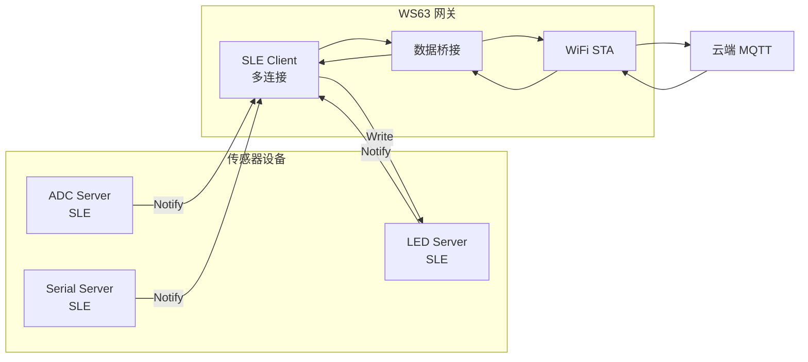

# 网关

> SLE (SparkLink Low Energy) Client（多连接）+ WiFi STA (Station) + 数据桥接

> 前置阅读：[Hello SLE](../basics/hello-connect.md)、[STA 连接](../../wifi/sta/sta-connect.md)

## 学习目标

- 理解 SLE 网关的架构——SLE Client 连接多个传感器 → 数据汇聚 → WiFi 上报云端
- 掌握 SLE 多连接管理在网关场景中的应用
- 理解数据桥接的设计模式
- 能够在 WS63 上实现一个连接多个传感器 + 上网的 SLE 网关

## 规格与功能

网关设备（WS63）作为 SLE Client 同时连接 3 路 SLE Server 传感器，汇聚数据通过 WiFi MQTT (Message Queuing Telemetry Transport) 上报云端，并接收云端指令下发到传感器。



## 基本概念

### 网关 vs 普通 Client

| | 普通 SLE Client | SLE 网关 |
|:---|:---|:---|
| 连接数 | 1 | 最多 8 |
| 数据流 | 双向交互 | 多路汇聚 + 云端转发 |
| WiFi | 不需要 | 必须 |
| 云端协议 | 不需要 | MQTT / HTTP (HyperText Transfer Protocol) |

### 多连接管理

```c
#define MAX_SERVERS 3

typedef struct {
    uint16_t conn_id;
    uint8_t  type;           // ADC / LED / Serial
    uint8_t  online;
    uint8_t  rx_buf[256];    // 每路独立缓冲
} server_ctx_t;

static server_ctx_t g_servers[MAX_SERVERS];
```

## 涉及 API

| API | 用途 |
|-----|------|
| `sle_connect_remote_device()` | 连接多个 SLE Server |
| `ssapc_register_callbacks()` | 接收多路 Notify / Indication |
| `ssapc_write_req()` | 下发指令到 Server |
| `wifi_sta_connect()` | WiFi 联网 |
| `osal_msg_queue` | 数据汇聚缓冲 |

## 案例操作指导


网关烧录 + 3 个 Server 烧录 → Server 先上电广播 → 网关后上电 → 自动连接 3 个 Server → WiFi 联网 → 数据上报云端。

## 关键配置

| 参数 | 值 | 说明 |
|------|-----|------|
| SLE 连接数 | 3（可扩展到 8） | WS63 上限 8 |
| 数据汇聚方式 | 消息队列 | 解耦 SLE 回调和 WiFi 发送 |

## 代码详解

### 多连接管理

```c
// 扫描到 Server 后逐一连接
static void connect_to_servers(void)
{
    for (int i = 0; i < g_server_count; i++) {
        sle_connect_remote_device(&g_server_addr[i]);
    }
}

// 连接回调中分配 conn_id 对应的上下文
static void conn_state_cb(uint16_t conn_id, sle_addr_t *addr,
                           sle_acb_state_t state, ...)
{
    if (state == SLE_ACB_STATE_CONNECTED) {
        server_ctx_t *ctx = find_free_slot();
        ctx->conn_id = conn_id;
        ctx->online = true;
    }
}
```

### 数据汇聚与转发

```c
// SSAP Client 回调中按 conn_id 区分来源
static void notification_cb(uint8_t client_id, uint16_t conn_id,
                             ssapc_handle_value_t *data, errcode_t status)
{
    server_ctx_t *ctx = find_by_conn_id(conn_id);
    if (ctx == NULL) return;

    // 打包网关帧：来源类型 + conn_id + 原始数据
    gateway_frame_t frame = {
        .source_type = ctx->type,
        .conn_id     = conn_id,
        .data_len    = data->data_len,
    };
    memcpy(frame.data, data->data, data->data_len);

    // 入队列 → WiFi 发送任务消费
    osal_msg_queue_write_copy(g_upload_queue, &frame, sizeof(frame), 0);
}
```

### 云端指令下发

```c
// MQTT 收到指令 → 解析目标 Server → SLE Write
static void cloud_cmd_handler(const char *topic, uint8_t *payload, int len)
{
    if (strstr(topic, "led/control")) {
        // 找 LED Server 的 conn_id，下发 Write
        server_ctx_t *led = find_by_type(SERVER_TYPE_LED);
        if (led && led->online) {
            ssapc_write_req(g_client_id, led->conn_id, led->prop_handle,
                            payload, len);
        }
    }
}
```

---

