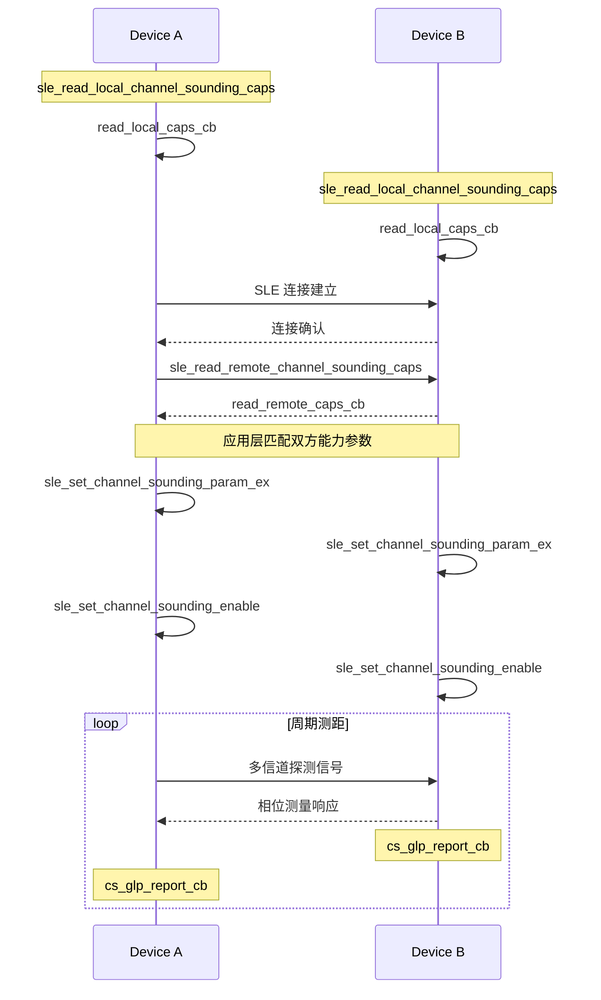
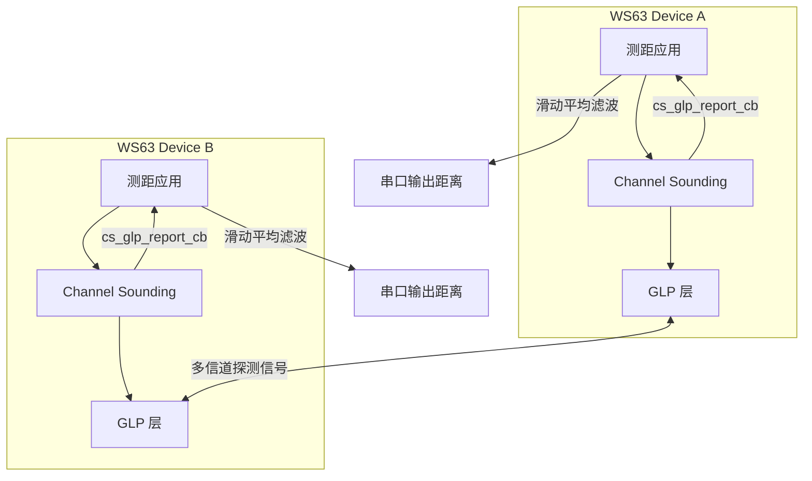

# HADM 测距

> SLE (SparkLink Low Energy) HADM (High Accuracy Distance Measurement)、Channel Sounding

> 前置阅读：[Hello SLE](../basics/hello-connect.md)、[属性读写（Read/Write）](../basics/hello-readwrite.md)

## 学习目标

- 理解 HADM Channel Sounding 的测距原理：通过测量无线信号在多个信道上的相位差反推飞行时间，再乘以光速得到距离
- 掌握 `sle_read_local_channel_sounding_caps()` 和 `sle_read_remote_channel_sounding_caps()` 查询本地和对端测距能力的流程
- 掌握 `sle_set_channel_sounding_param_ex()` 配置测距参数（信道列表、天线模式、测量间隔）的方法
- 理解影响测距精度的因素：多径效应、天线极化方向、环境遮挡对测量结果的干扰机制
- 能够在两块 WS63 之间搭建 HADM 测距链路，持续输出厘米级距离数据

## 基本概念

### 典型使用场景

HADM提供高精度距离测量能力，典型精度范围 0.1m~1m。与 BLE (Bluetooth Low Energy) RSSI (Received Signal Strength Indicator) 粗粒度测距（精度约 5m）相比，HADM 通过相位法实现数量级提升，适用于以下场景：

- **设备查找**：手机精确找到钥匙、钱包的方位和距离，类似 AirTag 的距离指示。不同于蓝牙"远/中/近"三档模糊指示，HADM 可给出精确到 0.1m 的距离值
- **车辆数字钥匙**：测量手机与车辆的距离，实现靠近解锁、远离锁车。CCC (Car Connectivity Consortium) 标准中对测距精度有严格要求，HADM 是满足该标准的候选技术
- **室内定位**：部署 3 个以上固定锚点，各锚点测量与移动标签的距离，通过三角定位算法解算二维或三维坐标
- **安全距离告警**：两个设备距离小于阈值时交换加密 Token，用于防疫接触追踪、危险区域感知等场景

### Channel Sounding 原理

HADM 的核心技术是 Channel Sounding（信道探测），其测距流程如下：

1. 两台设备在多个频率信道上交替发送探测信号
2. 接收端测量每个信道上信号的相位差
3. 利用相位差随频率线性变化的关系，反推信号在空中的飞行时间（ToF (Time of Flight), Time of Flight）
4. 距离 = 飞行时间 x 光速

与 BLE RSSI 测距对比：

| | BLE RSSI 测距 | HADM Channel Sounding |
|:---|:---|:---|
| 测距原理 | 信号强度衰减模型 | 多信道相位差法 |
| 典型精度 | 5m | 0.1m~1m |
| 受环境影响 | 极大（墙壁反射、人体遮挡导致 RSSI 剧烈波动） | 较小（相位测量对环境不敏感） |
| 天线要求 | 无特殊要求 | 天线极化方向影响精度 |
| 测距范围 | 0~30m | 0~50m（视环境） |

### 测距能力协商

不是所有设备都支持 HADM，且不同设备支持的参数集合可能不同。建连后需要通过能力协商确定双方都支持的参数：

- `sle_read_local_channel_sounding_caps()` 查询本地能力：支持的信道数量、带宽选项、天线配置（单天线/双天线）
- `sle_read_remote_channel_sounding_caps(conn_id)` 查询对端能力：获取对端的 Channel Sounding 能力集合
- 应用层对比双方能力，选择交集参数作为后续配置的基础

### 通信流程: HADM 测距



> 测距需要双方都调用 `sle_set_channel_sounding_enable()`，操作是对称的。启动后 GLP (Generic Layer Protocol) 回调周期上报测距结果，无需应用层主动轮询。

## 涉及 API

| API | 谁调用 | 用途 |
|-----|--------|------|
| `sle_read_local_channel_sounding_caps()` | 双方 | 查询本地 Channel Sounding 能力（信道数、带宽、天线配置） |
| `sle_read_remote_channel_sounding_caps(conn_id)` | 双方 | 查询对端 Channel Sounding 能力 |
| `sle_set_channel_sounding_param_ex(conn_id, &param)` | 双方 | 配置测距参数：信道列表、天线模式、测量间隔 |
| `sle_set_channel_sounding_enable(conn_id)` | 双方 | 启动 Channel Sounding 测距 |
| `sle_set_channel_sounding_disable(conn_id)` | 双方 | 停止测距 |
| `sle_hadm_register_callbacks(&func)` | 双方 | 注册 HADM 回调（测距能力查询结果回调） |
| `sle_glp_register_callbacks(&func)` | 双方 | 注册 GLP 回调（含 `cs_glp_report_cb` 测距结果上报） |

> 前置 API 来自 hello-connect（`sle_announce` / `sle_seek` / `sle_connect_remote_device`）和 hello-readwrite（`ssaps_register_callbacks`）。

## 案例说明

### 案例简介

两块 WS63 作为测距对端，连接后启用 HADM Channel Sounding，持续打印距离值。移动其中一块板子时，串口输出的距离数值同步变化，直观验证测距功能。

### 案例流程

系统架构：两块 WS63 对等部署，无主从之分。双方均需启用 Channel Sounding。



程序运行流程：

1. Device A 和 Device B 分别初始化 SLE、查询本地测距能力
2. Device A 发起连接（Client 角色），建立 SLE 链路
3. 双方读取对端测距能力，应用层匹配参数
4. 双方调用 `sle_set_channel_sounding_param_ex()` 配置相同的测距参数
5. 双方调用 `sle_set_channel_sounding_enable()` 启动测距
6. GLP 回调 `cs_glp_report_cb` 周期上报测距结果
7. 应用层对距离数据做滑动平均滤波后通过串口打印

## 案例操作指导


### 第一步：编译

```bash
fbb build ws63-liteos-app
```

> 更多编译选项请参考 [构建操作](../../../../overall-architecture/build-output/index.md#构建操作)。

### 第二步：烧录

```bash
fbb flash ws63-liteos-app
```

> 更多烧录选项请参考 [构建操作](../../../../overall-architecture/build-output/index.md#构建操作)。

### 第三步：接线与天线布置

两块板子保持天线方向一致（建议垂直向上），初始距离 1m。注意事项：

- 天线垂直向上时精度最佳，水平放置会导致极化方向失配，测量误差显著增大
- 远离大块金属物体（金属会反射信号，引入多径干扰导致距离偏大）
- 尽量避免在设备间插入障碍物

### 第四步：验证

上电后观察串口输出。Device A 预期输出：

```text
[hadm] init ok, local caps: 4ch, bw=2MHz, ant=1
[hadm] connected, conn_id=0x01
[hadm] remote caps: 4ch, bw=2MHz, ant=1
[hadm] param matched, configuring...
[hadm] channel sounding enabled
[hadm] distance: 1.02m  status=0
[hadm] distance: 0.98m  status=0
[hadm] distance: 1.01m  status=0
```

移动其中一块板子（远离或靠近），观察 `distance` 数值同步变化。在室内 1~5m 范围内，典型测量值与实际距离误差应优于 0.5m。

## 关键配置

| 参数 | 推荐值 | 说明 |
|------|--------|------|
| 天线模式 | 双天线（如果硬件支持） | 双天线可对比相位消除部分多径误差，精度优于单天线。单天线仅需一根天线，布板更简单 |
| 探测信道数 | 4 信道 | 信道越多，相位-频率拟合越准确，但单次测距耗时越长。4 信道在精度和速度间平衡较好 |
| 信道带宽 | 2MHz | 带宽越大，多径分辨力越强。但受 SLE 频段带宽限制，通常选 2MHz |
| 测量间隔 | 100ms | 100ms 适合实时跟踪（每秒 10 次更新），功耗较高；1000ms 适合低功耗定位场景 |
| 滑动平均窗口 | 5 次 | 消除瞬时抖动。窗口越大输出越平滑但响应越慢。5 次在平滑度和响应速度间平衡 |
| 天线方向 | 垂直向上 | 天线极化方向一致时信号最强，测量精度最高 |

## 代码详解

### 测距能力查询

建连前查询本地能力，建连后查询对端能力，双方匹配参数后再启动测距。

```c
static void read_local_caps_cb(sle_cs_capability_t *caps, errcode_t status)
{
    if (status != ERRCODE_SLE_SUCCESS) {
        osal_printk("[hadm] read local caps failed, status=%d\r\n", status);
        return;
    }
    g_local_chan_num = caps->channel_num;
    g_local_bw       = caps->bandwidth;
    g_local_ant_mode = caps->antenna_mode;
    osal_printk("[hadm] local caps: %dch, bw=%dMHz, ant=%d\r\n",
                caps->channel_num, caps->bandwidth, caps->antenna_mode);
}

static void init_hadm(void)
{
    sle_hadm_callbacks_t hadm_cb = {
        .read_local_caps_cb = read_local_caps_cb,
    };
    sle_hadm_register_callbacks(&hadm_cb);
    sle_read_local_channel_sounding_caps();  /* 异步：结果在 read_local_caps_cb 中返回 */
}
```

> 能力查询是异步操作，结果在注册的回调函数中返回。建连接后调用 `sle_read_remote_channel_sounding_caps(conn_id)` 查询对端能力，流程同上。

### 参数匹配与配置

双方能力就绪后，应用层取交集参数并配置。

```c
static errcode_t match_and_configure(uint16_t conn_id)
{
    sle_cs_param_ex_t param = {0};

    /* 取双方能力交集 */
    param.channel_num = MIN(g_local_chan_num, g_remote_chan_num);
    param.bandwidth   = MIN(g_local_bw, g_remote_bw);
    param.ant_mode    = (g_local_ant_mode == CS_ANT_DUAL && g_remote_ant_mode == CS_ANT_DUAL)
                        ? CS_ANT_DUAL : CS_ANT_SINGLE;

    /* 配置探测信道列表（示例：使用信道 0/20/40/60） */
    param.channels[0] = 0;
    param.channels[1] = 20;
    param.channels[2] = 40;
    param.channels[3] = 60;

    /* 配置测量间隔，单位 ms */
    param.interval_ms = 100;

    errcode_t ret = sle_set_channel_sounding_param_ex(conn_id, &param);
    if (ret != ERRCODE_SLE_SUCCESS) {
        osal_printk("[hadm] set param failed, ret=%d\r\n", ret);
        return ret;
    }
    osal_printk("[hadm] param configured: %dch, bw=%dMHz, ant=%d, interval=%dms\r\n",
                param.channel_num, param.bandwidth, param.ant_mode, param.interval_ms);
    return ERRCODE_SLE_SUCCESS;
}
```

> 双方必须配置相同的参数，否则测距启动失败或结果不可靠。信道选择应均匀分布在可用频段内以提高相位-频率拟合精度。

### 启动测距

参数配置完成后，双方都调用 enable 启动测距。

```c
static errcode_t start_ranging(uint16_t conn_id)
{
    errcode_t ret = sle_set_channel_sounding_enable(conn_id);
    if (ret != ERRCODE_SLE_SUCCESS) {
        osal_printk("[hadm] enable failed, ret=%d\r\n", ret);
        return ret;
    }
    osal_printk("[hadm] channel sounding enabled\r\n");
    return ERRCODE_SLE_SUCCESS;
}
```

> 测距启动后 GLP 回调 `cs_glp_report_cb` 立即开始周期上报。`sle_set_channel_sounding_enable()` 是对称操作，双方都需要调用。

### 距离数据滤波与打印

`cs_glp_report_cb` 回调中处理测距结果，应用滑动平均滤波后输出。

```c
#define FILTER_WINDOW 5

static float g_distance_window[FILTER_WINDOW] = {0};
static uint8_t g_window_idx = 0;

static float sliding_average(float new_value)
{
    g_distance_window[g_window_idx % FILTER_WINDOW] = new_value;
    g_window_idx++;

    float sum = 0;
    for (int i = 0; i < FILTER_WINDOW; i++) {
        sum += g_distance_window[i];
    }
    return sum / FILTER_WINDOW;
}

static void cs_glp_report_cb(uint16_t conn_id, sle_cs_report_t *report)
{
    if (report->status != CS_MEASURE_SUCCESS) {
        osal_printk("[hadm] measure failed, status=%d\r\n", report->status);
        return;
    }

    /* ToF 换算为距离，单位：米 */
    float raw_distance = report->tof_ns * 0.299792458f;  /* 光速: 0.299792458 m/ns */
    float filtered = sliding_average(raw_distance);

    osal_printk("[hadm] distance: %.2fm  cfo=%dHz  status=%d\r\n",
                filtered, report->cfo, report->status);
}
```

> CFO（Carrier Frequency Offset，载波频偏）可用于评估信号质量。CFO 过大时测距结果可能不可靠，应用层可选择丢弃该次测量。

### 精度影响因素分析

影响测距精度的主要因素及其应对：

| 因素 | 影响机制 | 应对措施 |
|------|---------|---------|
| 多径效应 | 反射信号与直射信号叠加，相位测量偏差导致距离偏大 | 增大带宽提高多径分辨力；使用双天线做相位对比 |
| 天线极化失配 | 双方天线极化方向不一致导致信号衰减、信噪比下降 | 保持双方天线方向一致（垂直向上） |
| 金属遮挡 | 金属反射面改变信号传播路径，等效路径变长 | 远离大块金属物体，尽量保证视距传播 |
| 人体遮挡 | 人体吸收 2.4GHz 信号，衰减 10~20dB | 测距时避免人体位于两天线之间 |
| CFO 漂移 | 双方晶振频差导致相位测量系统误差 | 协议栈内置 CFO 补偿算法，应用层可丢弃 CFO 异常的测量值 |

### 停止测距

```c
static void stop_ranging(uint16_t conn_id)
{
    sle_set_channel_sounding_disable(conn_id);
    osal_printk("[hadm] channel sounding disabled\r\n");
}
```

> 测距停止后 `cs_glp_report_cb` 不再被调用。断开连接前应先停止测距，避免协议栈异常。

---

