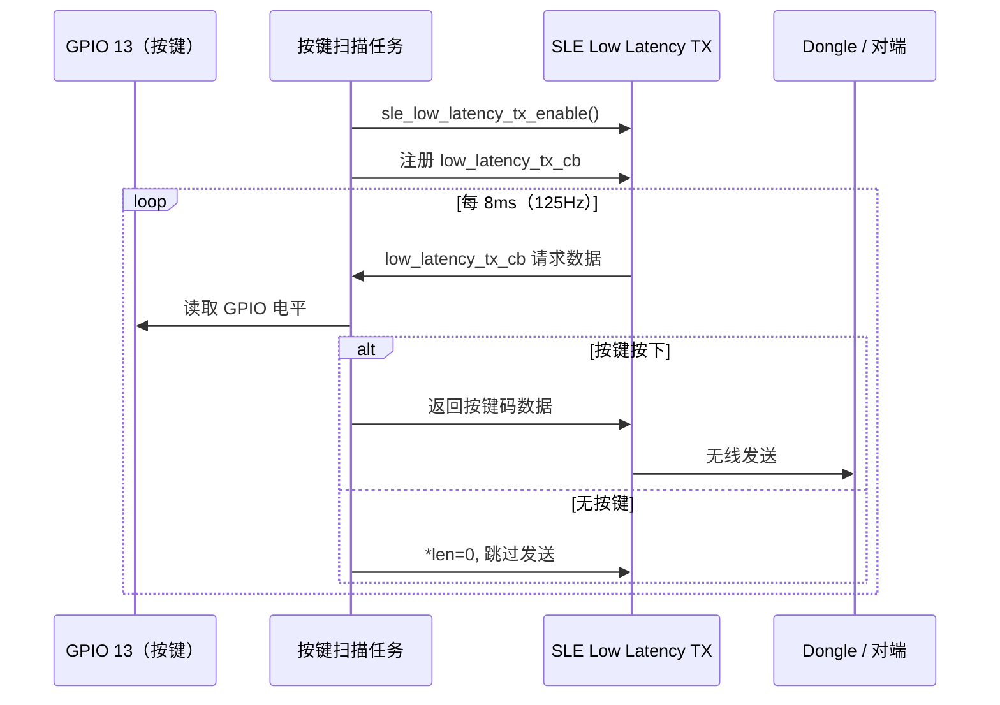
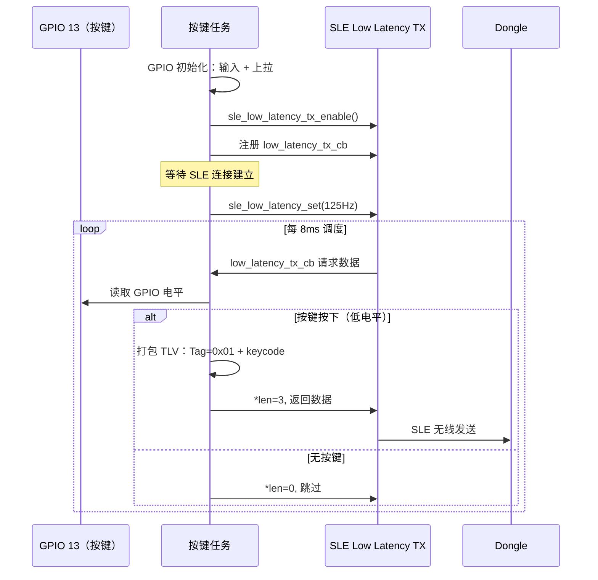

# HID 键盘

> GPIO (General Purpose Input/Output) 按键 → SLE (SparkLink Low Energy) 低延迟按键码 — SLE Low Latency TX (Transmit) 模式

> 前置阅读：[Hello SLE](../basics/hello-connect.md)

## 学习目标

- 理解 SLE 低延迟 TX 模式的工作原理：协议栈按固定时隙主动调用回调获取数据
- 掌握 `sle_low_latency_tx_enable()` + `sle_low_latency_tx_register_callbacks()` 的初始化流程
- 能够在 WS63 上通过 GPIO 按键触发 SLE 低延迟按键码上报

## 基本概念

### 低延迟 TX 模式

SLE 低延迟 TX 模式适用于需要定时上报数据的 HID (Human Interface Device) 设备。与 BLE (Bluetooth Low Energy) HID（GATT (Generic Attribute Profile) Notify）的"有变化才发"不同，SLE 低延迟模式采用**调度驱动**——协议栈按固定时隙（125Hz ~ 8KHz）主动调用 TX 回调，回调中返回当前数据即可。



### 与 BLE HID 的对比

| | BLE HID | SLE HID 键盘 |
|:---|:---|:---|
| 传输方式 | GATT Notify（有变化才发） | 低延迟调度（定时上报） |
| 最小延迟 | ~11ms | ~1ms（1KHz） |
| 按键触发 | 按下/松开立即发送 | 每次调度回调时上报当前状态 |
| 按键防抖 | 应用层轮询消抖（50Hz） | 应用层轮询消抖（按需） |

## 涉及 API

| API | 谁调用 | 用途 | 头文件 |
|-----|--------|------|--------|
| `sle_low_latency_tx_enable()` | 键盘端 | 使能低延迟 TX 模式 | `sle_low_latency.h` |
| `sle_low_latency_tx_register_callbacks()` | 键盘端 | 注册 TX 数据回调 | `sle_low_latency.h` |
| `sle_low_latency_set()` | 键盘端 | 配置调度速率（125Hz ~ 8KHz） | `sle_low_latency.h` |
| `uapi_gpio_get_val()` | 按键任务 | 读取 GPIO 电平 | `gpio.h` |
| `uapi_pin_set_mode()` | 按键任务 | 设置引脚为 GPIO 功能 | `pinctrl.h` |

> 前置 API 来自 hello-connect（`sle_announce` / `sle_seek` / `sle_connect_remote_device`）。

## 案例说明

### 案例简介

将 WS63 作为 SLE 键盘端，通过一个 GPIO 按键触发单个按键码，通过低延迟调度周期性上报。适用于翻页笔、拍照遥控器、PPT 控制器等单键场景。

### 功能规格

| 规格项 | 说明 |
|--------|------|
| 通信模式 | SLE Low Latency TX |
| 调度速率 | 125Hz（8ms），适合按键场景 |
| 按键引脚 | GPIO 13，低电平有效，按键一端接 GND |
| 默认按键码 | 0x4E（Page Down） |
| 按键防抖 | 20ms 轮询 + 连续 2 次相同读数确认 |
| 数据格式 | 单 TLV (Tag-Length-Value)：Tag=0x01 + Length=0x02 + keycode |

### 案例流程



## 案例操作指导

### 第一步：编译

键盘端，打开 menuconfig 启用：
```text
Top → Application → Samples → BT → SLE → Verticals → [*] HID Keyboard Sample
```

```bash
fbb build ws63-liteos-app
```

> 更多编译选项请参考 [构建操作](../../../../overall-architecture/build-output/index.md#构建操作)。

### 第二步：硬件接线

按键一端接 GPIO 13，另一端接 GND。芯片内部已使能上拉，按下时为低电平。


### 第三步：烧录

```bash
fbb flash ws63-liteos-app
```

> 更多烧录选项请参考 [构建操作](../../../../overall-architecture/build-output/index.md#构建操作)。

### 第四步：验证

1. 键盘端上电，与 Dongle 端建立 SLE 连接
2. 按下 GPIO 13 按键 → Dongle 端通过 USB (Universal Serial Bus) 上报按键码到 PC
3. PC 打开文本编辑器，按下按键 → 页面执行 Page Down
4. 松开按键 → 停止上报

## 关键配置

| 参数 | 推荐值 | 说明 |
|--------|--------|------|
| 调度速率 | 125Hz（8ms） | 按键场景 8ms 延迟完全可接受，高于 1KHz 徒增功耗 |
| 按键引脚 | GPIO 13 | 低电平有效，接 GND，芯片内部上拉 |
| 默认按键码 | 0x4E（Page Down） | 可根据场景改为 0x4B=PageUp, 0x2C=Space 等 |
| 防抖窗口 | 20ms（2 次 × 10ms） | 覆盖机械按键抖动时间 |

## 代码详解

### TX 端初始化

使能低延迟 TX 模式并注册回调：

```c
static sle_low_latency_tx_callbacks_t g_tx_cbk = {
    .low_latency_tx_cb = hid_keyboard_tx_cb,
};

static void hid_keyboard_init(void)
{
    sle_low_latency_tx_enable();
    sle_low_latency_tx_register_callbacks(&g_tx_cbk);
}
```

连接建立后启动调度：

```c
sle_low_latency_set(conn_id, 1, SLE_LOW_LATENCY_125HZ);
```

### TX 回调实现

协议栈每 8ms 调用一次，读取 GPIO 状态并返回数据：

```c
#define HID_PIN          13
#define HID_KEYCODE      0x4E    /* Page Down */
#define HID_TAG_KEYCODE  0x01

static uint8_t *hid_keyboard_tx_cb(uint16_t *len)
{
    static uint8_t tlv_buf[3];
    static uint8_t last_state = 0;
    uint8_t debounce = 0;

    /* 消抖：连续 2 次相同读数才确认 */
    uint8_t raw = (uapi_gpio_get_val(HID_PIN) == GPIO_LEVEL_LOW) ? 1 : 0;
    if (raw != last_state) {
        debounce++;
        if (debounce < 2) {
            *len = 0;
            return NULL;
        }
        last_state = raw;
        debounce = 0;
    }

    if (!last_state) {
        *len = 0;
        return NULL;  /* 无按键，跳过发送 */
    }

    /* 打包 TLV：Tag + Length + keycode */
    tlv_buf[0] = HID_TAG_KEYCODE;
    tlv_buf[1] = sizeof(HID_KEYCODE);
    tlv_buf[2] = HID_KEYCODE;
    *len = 3;
    return tlv_buf;
}
```

> 无按键时返回 NULL 跳过发送，减少空口占用功耗。125Hz 调度配合防抖可用按键场景，如需更高速响应可调至 1KHz。

---
