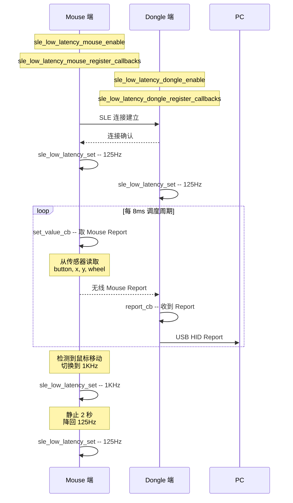
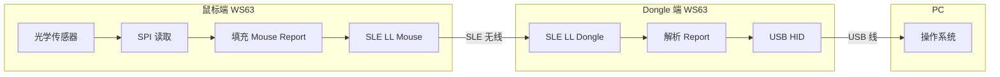

# HID 鼠标

> 低延迟 HID (Human Interface Device) -- 鼠标 — SLE (SparkLink Low Energy) Low Latency Mouse 模式

> 前置阅读：[Hello SLE](../basics/hello-connect.md)

## 学习目标

- 理解 SLE 低延迟调度的原理：协议栈在连接间隔内插入低延迟调度时隙，确保鼠标数据在 125us~8ms 内送达，延时确定且可控
- 掌握 Mouse 模式初始化流程：`sle_low_latency_mouse_enable()` 使能、注册 `set_value_cb` 回调、`sle_low_latency_set()` 启动调度
- 理解 Mouse Report 各字段含义（Button / X / Y / Wheel）以及不同调度速率对延迟和功耗的 trade-off
- 掌握调度速率动态切换策略：静止降速省电、移动升速流畅
- 能够在 WS63 上实现低延迟星闪鼠标，配合 Dongle 上报 PC

## 基本概念

### 典型使用场景

SLE 低延迟模式专为 HID（Human Interface Device，人机交互设备）设计，解决传统无线鼠标的核心痛点：

- **确定时延 vs 不确定时延**：BLE (Bluetooth Low Energy) HID 的典型延迟在 5~10ms 之间波动（受连接间隔和重传影响），SLE 低延迟模式提供 125us~8ms 的固定时隙，延迟抖动为零
- **游戏场景**：FPS 游戏中 1ms 额外延迟意味着准星偏移 1 个像素，竞技玩家要求 1KHz 轮询率。SLE 可支持至 8KHz
- **办公场景**：125Hz~500Hz 即可满足日常使用，较低速率换来更长续航

### 低延迟调度机制

SLE 链路层在原连接间隔（Connection Interval）内插入额外的低延迟调度时隙，协议栈按时隙周期主动向应用层获取数据：

| 调度速率 | 周期间隔 | 典型延迟 | 功耗参考 | 适用场景 |
|:---|:---|:---|:---|:---|
| 125Hz | 8ms | ~8ms | ~1mA | 办公/入门 |
| 500Hz | 2ms | ~2ms | ~2mA | 办公/精确操作 |
| 1KHz | 1ms | ~1ms | ~4mA | 游戏/竞技 |
| 2KHz | 500us | ~500us | ~6mA | 电竞 |
| 4KHz | 250us | ~250us | ~8mA | 专业电竞 |
| 8KHz | 125us | ~125us | ~12mA | 极限竞技（需硬件支持） |

> 速率每翻一倍，功耗约增加 50%~100%。应用层应根据鼠标运动状态动态选择速率。

### Mouse 模式 vs 通用 TX/RX 模式

| | Mouse 专用模式 | 通用 TX/RX 模式 |
|:---|:---|:---|
| 核心回调 | `set_value_cb` -- 协议栈传入 button/xy/wheel 指针，应用层填入值 | `low_latency_tx_cb` -- 协议栈传入最大长度，应用层返回 TLV (Tag-Length-Value) 数据指针 |
| 数据格式 | 固定结构体（button_mask, x, y, wheel） | 自定义 TLV 格式 |
| 开发量 | 极低 -- 回调中填几个值即可 | 中等 -- 需手动打包/解析 |
| USB (Universal Serial Bus) 兼容性 | 协议栈内置 Mouse Report 格式 | 需自行对齐 USB HID Report Descriptor |
| 适用设备 | 鼠标 | 键盘、手柄、自定义 HID |

> 鼠标场景优先使用 Mouse 模式。开发效率高、代码量小、与 USB HID Mouse 天然对齐。

### Dongle 端的角色

系统需要两块 WS63：

| 设备 | SLE 角色 | 低延迟模式 | 与 PC 连接 |
|------|---------|-----------|-----------|
| Mouse 端 | SLE Server（广播） | Mouse 模式（TX） | 无（仅与 Dongle 通信） |
| Dongle 端 | SLE Client（扫描连接） | Dongle 模式（RX） | USB HID（上报 PC） |

Dongle 接收 Mouse Report 后通过 USB HID 上报 PC，PC 将其识别为标准 HID 鼠标。

### 通信流程: 低延迟鼠标



> Mouse 端只需关注"数据怎么填"，时序完全由协议栈管理。`set_value_cb` 被调用的频率等于调度速率。

## 涉及 API

| API | 谁调用 | 用途 |
|-----|--------|------|
| `sle_low_latency_mouse_enable()` | Mouse | 使能低延迟 Mouse 模式 |
| `sle_low_latency_mouse_register_callbacks(&mouse_cbk)` | Mouse | 注册 Mouse 数据回调（核心是 `set_value_cb`） |
| `sle_low_latency_set(conn_id, enable, rate)` | Mouse | 配置低延迟调度参数（使能 + 速率切换） |
| `sle_low_latency_dongle_enable()` | Dongle | 使能低延迟 Dongle 模式 |
| `sle_low_latency_dongle_register_callbacks(&dongle_cbk)` | Dongle | 注册 Dongle 接收回调（核心是 `report_cb`） |

> 前置 API 来自 hello-connect（`sle_announce` / `sle_seek` / `sle_connect_remote_device`）。

## 案例说明

### 案例简介

WS63 作为 Mouse 端，连接光学传感器，通过低延迟调度周期发送 Mouse Report (Button/X/Y/Wheel)。Dongle 接收后通过 USB 上报 PC，PC 识别为标准 HID 鼠标。

### 案例流程



程序运行流程：

1. Mouse 端初始化 SPI (Serial Peripheral Interface) 传感器、使能低延迟 Mouse 模式
2. Dongle 端初始化 USB HID、使能低延迟 Dongle 模式
3. 建立 SLE 连接后，双方调用 `sle_low_latency_set()` 启用调度（初始 125Hz）
4. 每 8ms 协议栈调用 `set_value_cb`，Mouse 端读取传感器、填充 Report
5. Dongle 端 `report_cb` 收到后通过 USB 上报 PC
6. 检测到鼠标移动时动态切换到 1KHz，静止后降回 125Hz

## 案例操作指导


### 第一步：编译

打开 menuconfig，启用 Mouse 端：
```text
Top → Application → Samples → BT → SLE → Verticals → [*] HID Mouse Sample
  └─ Low Latency Mode ─> (X) Mouse
```

Dongle 端启用：
```text
Top → Application → Samples → BT → SLE → Verticals → [*] HID Dongle Sample
  └─ Low Latency Mode ─> (X) RX (Dongle)
```

```bash
fbb build ws63-liteos-app
```

> 更多编译选项请参考 [构建操作](../../../../overall-architecture/build-output/index.md#构建操作)。

### 第二步：烧录

```bash
fbb flash ws63-liteos-app
```

> 更多烧录选项请参考 [构建操作](../../../../overall-architecture/build-output/index.md#构建操作)。

### 第三步：烧录并运行

Dongle 先上电插入 PC USB，Mouse 后上电。Mouse 端预期串口输出：

```text
[mouse] init ok, sensor detected
[mouse] ll mouse enabled
[mouse] connected, conn_id=0x01
[mouse] scheduling: 125Hz
[mouse] dx=+10 dy=-5 btn=0 wheel=0
[mouse] dx=+8 dy=-3 btn=0 wheel=0
[mouse] motion detected, switch to 1KHz
[mouse] scheduling: 1KHz
[mouse] no motion for 2s, switch to 125Hz
```

Dongle 端预期串口输出：

```text
[dongle] init ok, usb hid mouse ready
[dongle] ll dongle enabled
[dongle] connected, conn_id=0x01
[dongle] usb report sent
```

### 第四步：验证

Dongle 插入 PC USB 后，PC 设备管理器中应出现 HID-compliant Mouse。移动 Mouse 端的传感器（或模拟传感器数据），PC 光标应跟随移动。按下按键可验证左/中/右键及滚轮。

## 关键配置

| 参数 | 推荐值 | 说明 |
|------|--------|------|
| 初始调度速率 | 125Hz | 上电默认最低速率，节省功耗。检测到移动后动态提升 |
| 移动调度速率 | 1KHz | 游戏需 1ms 响应。办公可选 500Hz 省电 |
| 降速判停时间 | 2 秒 | 静止超过此时间后降回 125Hz。太短导致频繁切换，太长浪费功耗 |
| `button_mask` bit0 | 左键 | USB HID 标准：bit0=左键, bit1=右键, bit2=中键 |
| `x` / `y` 类型 | int16 | 相对位移量，范围 -32767~+32767。传感器 CPI 越高单次位移越大 |
| `wheel` 类型 | int8 | 滚轮增量，范围 -127~+127 |
| 传感器接口 | SPI | 主流光学传感器（如 PAW3395）使用 SPI 接口，速率 2~4MHz |
| Dongle USB HID Report | 4 字节 | 标准 Mouse Report: [button, x, y, wheel] |

## 代码详解

### Mouse 端初始化

Mouse 端使能低延迟 Mouse 模式，注册回调，连接成功后启动调度。

```c
static sle_low_latency_mouse_callbacks_t g_mouse_cbk = {
    .set_value_cb = mouse_set_value_cb,
};

static void init_mouse(void)
{
    errcode_t ret;

    ret = sle_low_latency_mouse_enable();
    if (ret != ERRCODE_SLE_SUCCESS) {
        osal_printk("[mouse] mouse enable failed, ret=%d\r\n", ret);
        return;
    }

    ret = sle_low_latency_mouse_register_callbacks(&g_mouse_cbk);
    if (ret != ERRCODE_SLE_SUCCESS) {
        osal_printk("[mouse] register mouse cb failed, ret=%d\r\n", ret);
        return;
    }

    osal_printk("[mouse] ll mouse init ok\r\n");
}

/* 连接成功后调用 */
static void on_connected(uint16_t conn_id)
{
    g_conn_id = conn_id;
    /* 初始 125Hz 低速率，节省功耗 */
    sle_low_latency_set(conn_id, 1, SLE_LOW_LATENCY_125HZ);
    osal_printk("[mouse] scheduling: 125Hz\r\n");
}
```

> Mouse 模式使能后并不立即开始调度。需在连接成功后调用 `sle_low_latency_set()` 显式启动。初始选择最低速率，后续根据运动状态动态调整。

### set_value_cb 回调实现

协议栈每个调度周期调用此回调，Mouse 端从传感器读取数据并填充参数。

```c
#define MOTION_TIMEOUT_MS  2000

static errcode_t mouse_set_value_cb(uint16_t conn_id,
                                     uint8_t *button_mask,
                                     int16_t *x, int16_t *y, int8_t *wheel)
{
    int16_t dx, dy;
    uint8_t btn;
    int8_t wh;

    /* 从光学传感器读取数据 */
    if (sensor_read_motion(&dx, &dy, &btn, &wh) != 0) {
        /* 传感器无新数据，跳过本次发送 */
        return SLE_LOW_LATENCY_VALUE_GET_FAIL;
    }

    *button_mask = btn;   /* bit0=左键, bit1=右键, bit2=中键 */
    *x = dx;              /* X 轴相对位移 */
    *y = dy;              /* Y 轴相对位移 */
    *wheel = wh;          /* 滚轮增量 */

    /* 运动检测与速率切换 */
    static uint32_t last_motion_tick = 0;
    if (dx != 0 || dy != 0 || wh != 0) {
        last_motion_tick = osal_get_tick();
        if (g_current_rate != SLE_LOW_LATENCY_1KHZ) {
            sle_low_latency_set(conn_id, 1, SLE_LOW_LATENCY_1KHZ);
            g_current_rate = SLE_LOW_LATENCY_1KHZ;
            osal_printk("[mouse] motion detected, switch to 1KHz\r\n");
        }
    }

    return SLE_LOW_LATENCY_VALUE_GET_SUCCESS;
}
```

> 传感器无新数据时返回 `SLE_LOW_LATENCY_VALUE_GET_FAIL`，协议栈跳过本次发送，不占用空口资源。检测到位移时立即切换到高速率。

### 调度速率动态切换

应用层周期性检查静止时长，超时后降速省电。

```c
static void motion_timeout_check(void)
{
    uint32_t now = osal_get_tick();
    uint32_t elapsed = now - g_last_motion_tick;

    if (elapsed >= osal_ms_to_tick(MOTION_TIMEOUT_MS) &&
        g_current_rate != SLE_LOW_LATENCY_125HZ) {
        sle_low_latency_set(g_conn_id, 1, SLE_LOW_LATENCY_125HZ);
        g_current_rate = SLE_LOW_LATENCY_125HZ;
        osal_printk("[mouse] no motion for 2s, switch to 125Hz\r\n");
    }
}

/* 在应用层定时器（每 500ms）中调用 */
static void app_timer_cb(void)
{
    motion_timeout_check();
}
```

> 降速逻辑不在 `set_value_cb` 中直接执行（避免回调内耗时过长），而是由应用层定时器异步检查。500ms 检查间隔足够捕捉静止状态。

### 传感器 SPI 读取

典型光学传感器通过 SPI 读取位移寄存器和按键状态。

```c
#define SENSOR_MOTION_REG   0x02
#define SENSOR_DELTA_X_L    0x03
#define SENSOR_DELTA_Y_L    0x04
#define SENSOR_BUTTON_REG   0x05

static int sensor_read_motion(int16_t *dx, int16_t *dy,
                               uint8_t *btn, int8_t *wheel)
{
    uint8_t motion;
    spi_read_reg(SENSOR_MOTION_REG, &motion, 1);

    if (!(motion & 0x80)) {
        return -1;  /* 无新数据 */
    }

    uint8_t buf[5];
    spi_read_reg(SENSOR_DELTA_X_L, buf, 5);

    *dx = (int16_t)(buf[0] | (buf[1] << 8));
    *dy = (int16_t)(buf[2] | (buf[3] << 8));
    *wheel = 0;  /* 滚轮数据根据实际传感器扩展 */

    spi_read_reg(SENSOR_BUTTON_REG, btn, 1);

    return 0;
}
```

> 主流光学传感器（PAW3395、PAW3950 等）使用 2~4MHz SPI 读取。位移数据为 16 位有符号整数，以 CPI 为单位（如 1600CPI 时 dx=16 表示移动 0.01 英寸）。

### Dongle 端接收

Dongle 端注册 `report_cb` 接收 Mouse Report，通过 USB HID 上报 PC。

```c
static sle_low_latency_dongle_callbacks_t g_dongle_cbk = {
    .report_cb = dongle_report_cb,
};

static void init_dongle(void)
{
    sle_low_latency_dongle_enable();
    sle_low_latency_dongle_register_callbacks(&g_dongle_cbk);
    osal_printk("[dongle] ll dongle init ok\r\n");
}

static void dongle_report_cb(uint16_t conn_id, uint8_t *data, uint16_t len)
{
    /* data 格式：[button(1B), x_lo, x_hi, y_lo, y_hi, wheel(1B)] */
    if (len < 5) {
        return;
    }

    uint8_t hid_report[4] = {
        data[0],                          /* button mask */
        data[1],                          /* x low byte */
        data[2] | (data[3] << 8) ? data[3] : 0,  /* y (简化) */
        data[4],                          /* wheel */
    };

    usb_hid_mouse_send_report(hid_report, sizeof(hid_report));
}
```

> Dongle 端数据格式与 Mouse 端协议栈发送格式一致。标准 USB HID Mouse Report 为 4 字节（button, x, y, wheel）。

### USB HID Report Descriptor 示例

Dongle 端需要在 USB 枚举时向 PC 报告正确的 HID Report Descriptor：

```c
static const uint8_t g_hid_mouse_report_desc[] = {
    0x05, 0x01,        /* Usage Page (Generic Desktop) */
    0x09, 0x02,        /* Usage (Mouse) */
    0xA1, 0x01,        /* Collection (Application) */
    0x09, 0x01,        /*   Usage (Pointer) */
    0xA1, 0x00,        /*   Collection (Physical) */
    0x05, 0x09,        /*     Usage Page (Button) */
    0x19, 0x01,        /*     Usage Minimum (1) */
    0x29, 0x03,        /*     Usage Maximum (3) */
    0x15, 0x00,        /*     Logical Minimum (0) */
    0x25, 0x01,        /*     Logical Maximum (1) */
    0x95, 0x03,        /*     Report Count (3) */
    0x75, 0x01,        /*     Report Size (1) */
    0x81, 0x02,        /*     Input (Data, Variable, Absolute) */
    0x95, 0x01,        /*     Report Count (1) */
    0x75, 0x05,        /*     Report Size (5) */
    0x81, 0x01,        /*     Input (Constant) -- padding */
    0x05, 0x01,        /*     Usage Page (Generic Desktop) */
    0x09, 0x30,        /*     Usage (X) */
    0x09, 0x31,        /*     Usage (Y) */
    0x09, 0x38,        /*     Usage (Wheel) */
    0x15, 0x81,        /*     Logical Minimum (-127) */
    0x25, 0x7F,        /*     Logical Maximum (127) */
    0x75, 0x08,        /*     Report Size (8) */
    0x95, 0x03,        /*     Report Count (3) */
    0x81, 0x06,        /*     Input (Data, Variable, Relative) */
    0xC0,              /*   End Collection */
    0xC0               /* End Collection */
};
```

> Report Descriptor 定义了 PC 如何解析 USB HID 数据包。Descriptor 字段（X/Y/Wheel 为 Relative 类型、按键为 Absolute 类型）必须与 Dongle 发送的 Report 格式严格匹配。

---

