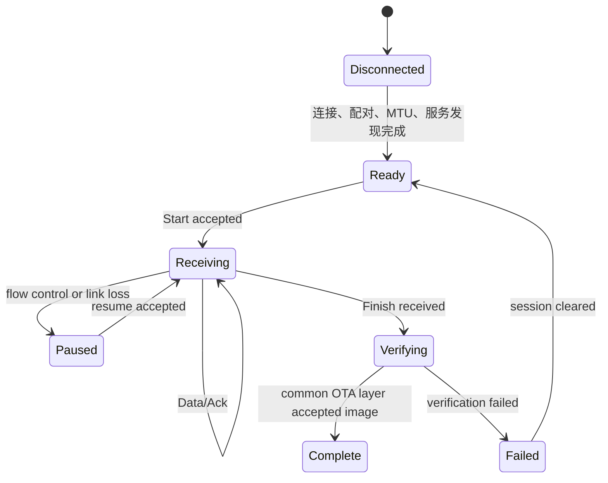

# SLE OTA 传输说明

> 本页只说明 SLE (SparkLink Low Energy) OTA (Over-The-Air) 的传输和流控差异。公共升级状态机、镜像校验、切换和回滚见 [OTA 固件升级架构](../../../system/ota/ota.md)。

## 适用范围

SLE 可用于近距离高速发送升级数据。高吞吐能力不等于升级可靠性，应用仍需定义会话、分片、确认、超时和恢复机制。

当前 SDK 没有独立 SLE OTA 案例工程，因此本页是设计说明，不提供可直接执行的构建和烧录步骤。

## 协议分层

```text
SLE 连接、配对、MTU 和 SSAP 数据通道
                    ↓
OTA 会话、分片、窗口 ACK 和重传
                    ↓
公共升级层：写入、校验、切换和回滚
```

连接和 SSAP (SLE Service Access Protocol) 基础流程参考 [通知推送（Notify）](../basics/hello-notify.md)；高速发送与流控参考 [高吞吐传输](../data-comm/high-throughput.md)。

## 会话与分片

每个分片至少应包含会话标识、偏移、有效长度和数据。接收端必须先验证范围，再将数据交给公共升级层。

窗口 ACK (Acknowledgment) 可以减少逐包确认开销，但窗口大小不能写成通用固定值。它需要根据以下条件实测：

- 协商后的 MTU (Maximum Transmission Unit) 和应用有效载荷。
- 接收端 RAM (Random Access Memory) 和写入速度。
- 链路丢包、重传和距离条件。
- 协议栈流控返回状态。

## 传输状态机



## 与高吞吐传输的边界

可以复用高吞吐案例的 PHY/MCS、连接参数和流控处理，但 OTA 还必须增加：

- 会话和版本校验。
- 偏移、重复包和断点状态管理。
- 写入失败、空间不足和校验失败处理。
- 取消、超时和连接断开后的资源清理。

## 验证重点

- 不同 MTU 和窗口大小下的边界。
- 协议栈忙时不会丢失或越过分片。
- 断链、重连、重复包和断点恢复。
- 接收完成后由公共升级层执行整体校验。
- 失败不会改变当前可启动镜像。
