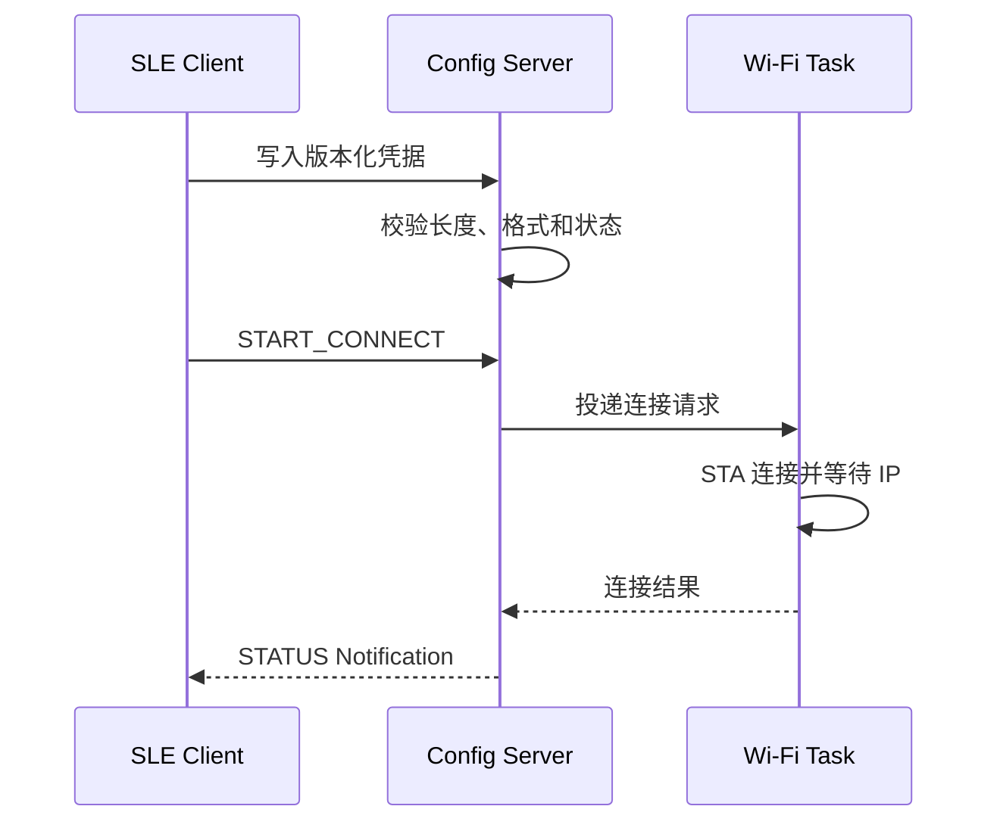

# SLE Wi-Fi 配网

> 将 [参数配置与持久化](../data-comm/device-config.md) 的通用属性读写机制应用于 Wi-Fi SSID (Service Set Identifier) 、密码和入网结果传递。

> 前置阅读：[属性读写（Read/Write）](../basics/hello-readwrite.md)、[STA 连接与重连](../../wifi/sta/sta-connect.md)

## 本页边界

本页只讲 Wi-Fi 配网协议和 SLE/Wi-Fi 两个状态机的衔接。Property 权限、读写回调、通用校验和持久化策略由“参数配置与持久化”页面统一说明。

## 角色和数据

| 角色 | 职责 |
| --- | --- |
| 配网 Client | 与待配网设备建立 SLE (SparkLink Low Energy) 连接，下发网络凭据，接收入网结果 |
| 配网 Server | 校验凭据，交给 Wi-Fi 任务连接路由器，返回结果 |

建议至少定义以下消息：

- `SET_CREDENTIALS`：SSID、密码、安全方式和协议版本。
- `START_CONNECT`：确认凭据完整后开始连接。
- `STATUS`：处理中、成功、认证失败、超时等状态。
- `CLEAR_CREDENTIALS`：清除未确认或已保存的网络配置。

## 状态流程



SLE 写请求回调不能直接执行完整 Wi-Fi 连接。它只负责复制并校验数据，然后通过队列或事件交给 Wi-Fi 任务。

## 安全与持久化

- 凭据必须使用显式长度，不能直接把远端字节流当作字符串。
- 日志中不得打印密码。
- 只有在 Wi-Fi 连接和 DHCP (Dynamic Host Configuration Protocol) 成功后，才将新凭据标记为有效。
- 保存新凭据失败时应保留旧的可用配置，避免设备失联。
- SLE 链路应完成产品要求的认证和加密后再允许写入密码。
- 提供清除凭据和重新配网入口。

## 源码参考

当前 vendor 中可参考以下 SLE 配网工程：

```text
vendor/HiHope_NearLink_DK_WS63E_V03/demo/sle_distribute_network/
```

文档中的协议字段应以该工程和产品实际定义为起点；若产品修改消息格式，需要同步维护版本兼容策略。

## 验证清单

- 正确凭据能够连接路由器并返回成功状态。
- 错误密码、SSID 不存在和 DHCP 失败返回不同错误。
- 重复下发、分段到达和中途断链不会产生半有效配置。
- Wi-Fi 连接期间再次收到配网请求时有明确的忙状态或取消策略。
- 设备重启后只使用已经确认成功的凭据。
- 清除凭据后不会自动连接旧网络。
