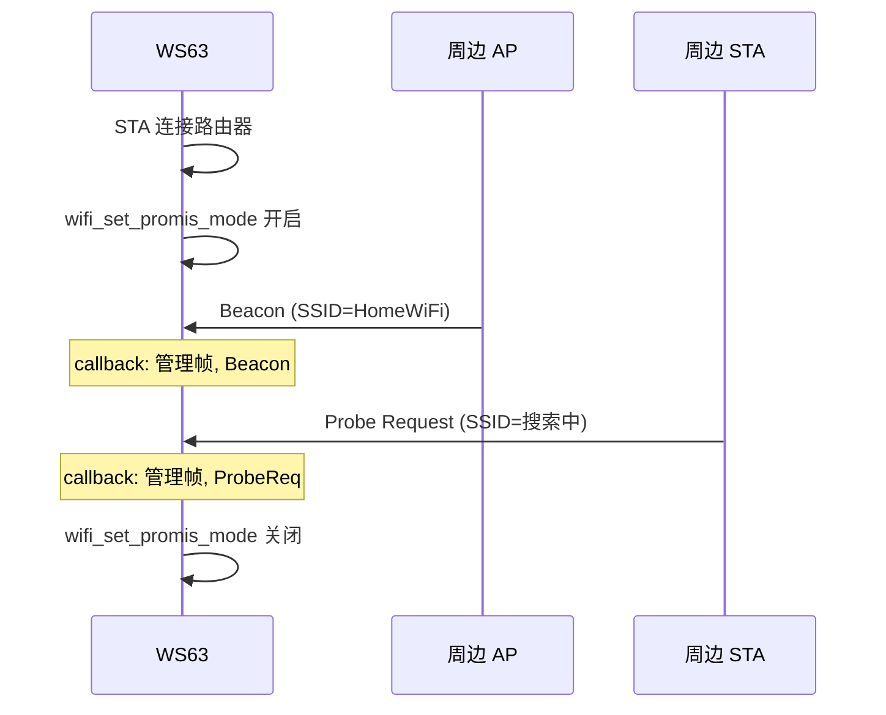

# 监听模式

> WiFi 混杂模式 — 空口抓包 — `wifi_set_promis_mode()`、WiFi 管理帧回调

> 前置阅读：[STA (Station) 连接](./sta/sta-connect.md)

## 学习目标

- 理解混杂模式与普通模式的区别——网卡接收空口中所有帧（不限目标 MAC (Media Access Control)）
- 掌握 `wifi_set_promis_mode()` 的配置方法和帧过滤参数
- 掌握 `wifi_set_promis_rx_pkt_cb()` 注册接收回调并解析帧类型
- 能够在 WS63 上捕获周边 WiFi 空口帧并解析管理/数据/控制帧

## 基本概念

### 混杂模式 vs 普通模式

| 对比项 | 普通模式 | 混杂模式 |
|--------|:---:|:---:|
| 接收范围 | 仅目标 MAC 是本机的帧 | 空口中所有帧 |
| CPU 负载 | 正常 | 增加（每帧都进回调） |
| 功耗 | 正常 | 增加约 2~5mA |
| 典型用途 | 正常通信 | 抓包分析、网络调试 |

### 帧过滤参数 `wifi_ptype_filter_stru`

5 个独立开关，按需开启以减少中断负载：

| 过滤项 | 说明 |
|:---:|------|
| `mdata` | 管理数据帧（Management Data） |
| `udata` | 用户数据帧（User Data） |
| `mmngt` | 管理帧（Management）——含 Beacon、Probe |
| `umngt` | 用户管理帧 |
| `custom_en` | 自定义帧 |

### 典型使用场景

| 场景 | 开启的过滤器 |
|------|:---:|
| 抓 Beacon（周边 AP (Access Point) 扫描） | `mmngt` |
| 抓 Probe Request（周边 STA 检测） | `mmngt` |
| 抓数据帧（分析通信内容） | `mdata` + `udata` |

## 涉及 API

| API | 用途 |
|-----|------|
| `wifi_set_promis_mode(iftype, enable, &filter)` | 开启/关闭混杂模式 |
| `wifi_set_promis_rx_pkt_cb(cb)` | 注册帧接收回调 |
| `wifi_set_mgmt_frame_rx_cb(cb, mode)` | 单独的管理帧回调通道 |

## 案例说明

### 案例简介

WS63 STA 连接后开启混杂模式 → 捕获 Beacon/Probe Request → 解析 SSID/BSSID/RSSI → 串口输出。

### 案例流程



## 案例操作指导

### 第一步：编译

```bash
fbb build ws63-liteos-app
```

> 更多编译选项请参考 [构建操作](../../../overall-architecture/build-output/index.md#构建操作)。

### 第二步：烧录

```bash
fbb flash ws63-liteos-app
```

> 更多烧录选项请参考 [构建操作](../../../overall-architecture/build-output/index.md#构建操作)。

### 第三步：验证

手机在 WS63 附近搜索 WiFi → 串口输出手机的 Probe Request 帧。

## 关键配置

| 参数 | 推荐值 | 说明 |
|------|:---:|------|
| 帧过滤 | `mdata` + `mmngt` | 不开启 `custom_en`（减少噪声） |
| 回调耗时 | < 1ms | 不 printf，只解析 MAC header |
| 功耗 | +2~5mA | 射频持续接收 |

## 代码详解

### 开启混杂模式

```c
#include "wifi.h"

wifi_ptype_filter_stru filter = {
    .mdata = 1,      // 管理数据帧
    .udata = 0,
    .mmngt = 1,      // 管理帧（Beacon/Probe）
    .umngt = 0,
    .custom_en = 0
};
wifi_set_promis_mode(WIFI_IF_TYPE_STA, 1, &filter);
```

### 帧接收回调

```c
static void promis_rx_cb(unsigned char *data, int len, int rssi) {
    /* 解析 802.11 MAC Header */
    uint16_t frame_ctrl = *(uint16_t *)data;
    uint8_t type = (frame_ctrl >> 2) & 0x03;     // Type
    uint8_t subtype = (frame_ctrl >> 4) & 0x0F;  // Subtype

    /* Type: 00=管理帧, 01=控制帧, 10=数据帧 */
    if (type == 0 && subtype == 8) {
        printf("Beacon: RSSI=%d\n", rssi);
    } else if (type == 0 && subtype == 4) {
        printf("ProbeReq: RSSI=%d\n", rssi);
    }
}

wifi_set_promis_rx_pkt_cb(promis_rx_cb);
```

### 关闭混杂模式

```c
wifi_set_promis_mode(WIFI_IF_TYPE_STA, 0, NULL);
```

---

