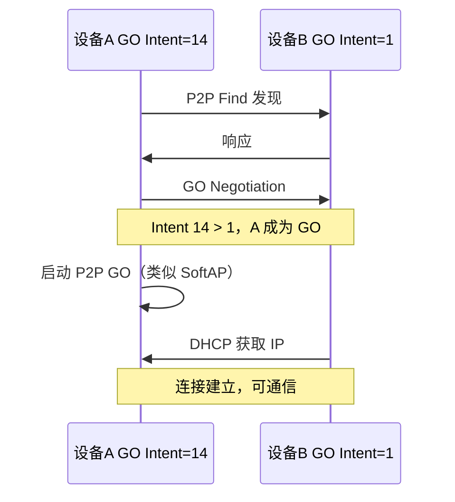

# P2P

> WiFi P2P (Peer-to-Peer) — WiFi Direct — WiFi P2P API

> 前置阅读：[STA (Station) 模式 — 连接路由器](sta/sta-connect.md)、[SoftAP 模式 — 创建热点](softap/softap.md)

## 学习目标

- 理解 WiFi P2P 工作原理——无需路由器，设备直连
- 理解 P2P 角色协商（GO / GC）机制
- 掌握 P2P 发现 → 协商 → 连接 → 通信的完整流程

## 基本概念

### WiFi P2P vs SoftAP vs STA

| 对比项 | P2P | SoftAP | STA |
|--------|:---:|:---:|:---:|
| 需要路由器 | 不需要 | 不需要 | 需要 |
| 角色 | 自动协商（GO/GC） | 手动指定（AP (Access Point)） | 固定（STA） |
| 适用 | 设备直连 | 手机连设备 | 连网络 |

### 角色协商



## 涉及 API

| API | 用途 |
|-----|------|
| `wifi_p2p_enable()` | 使能 P2P |
| `wifi_p2p_set_device_config()` | 配置 P2P 设备参数 |
| `wifi_p2p_find(sec)` | 发现周边 P2P 设备 |
| `wifi_p2p_connect(&p2p_config)` | 发起 P2P 连接 |
| `wifi_register_event_cb()` | 注册 P2P 事件回调 |

## 案例说明

### 案例简介

两块 WS63 通过 P2P 直连——不需要路由器，协商 GO/GC 后通过 Socket 通信。

## 关键配置

| 参数 | 推荐值 | 说明 |
|------|:---:|------|
| GO Intent | Server 14 / Client 1 | 值大者成为 GO |
| 工作信道 | 1/6/11 | 同时运行 STA 需对齐 |
| GO 默认 IP (Internet Protocol) | 192.168.49.1 |                                                                                                                                                                                                                                                                                                                                                                                                                                                                                                                                                                                                                                                                                                                                                                                                                                                                                                                                                                                                                                                                |

## 代码详解

```c
/* P2P 初始化 */
wifi_p2p_enable();
wifi_p2p_set_device_config("WS63-P2P", 14);  // GO Intent=14

/* 设备发现 */
wifi_p2p_find(30);  // 30 秒搜索
/* p2p_dev_found_cb → 找到对方 */

/* 连接 */
wifi_p2p_connect(&p2p_cfg);
/* wifi_event_p2p_go_neg_result → 角色协商完成 */
/* DHCP → IP 就绪 → Socket 通信 */
```

---

