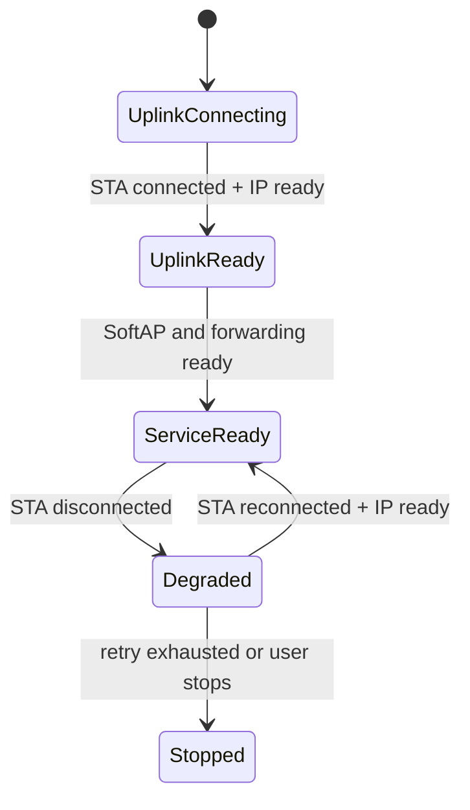

# Wi-Fi 中继设计说明

> 本页说明 STA (Station) 与 SoftAP 组合时的架构约束。当前 `src/application/samples` 和 `vendor` 中没有可直接构建的中继案例工程。

> 前置阅读：[STA 连接与重连](./sta/sta-connect.md)、[SoftAP](./softap/softap.md)

## 组合架构


STA 和 SoftAP 只负责建立两个无线接口。下游设备能否访问上游网络，还取决于网络层是否正确配置 IP (Internet Protocol) 转发、地址分配、路由和必要的地址转换，不能把“双接口已启动”等同于“中继已经完成”。

## 关键约束

- STA 与 SoftAP 共用射频资源，信道策略必须服从当前芯片和协议栈的并发限制。
- 应先完成 STA 连接并获取有效上行状态，再决定 SoftAP 的信道和对外服务状态。
- 上行断开时应明确下游局域网是否继续保留，以及如何提示外网不可用。
- 所有下游设备共享上行带宽，需要限制最大连接数和并发流量。
- 产品必须验证 DHCP (Dynamic Host Configuration Protocol) 、DNS (Domain Name System) 、路由、转发和安全隔离，而不是只验证两个接口均能启动。

## 状态机建议



## 实现边界

可以复用以下基础案例，但仍需要产品补充转发层实现：

```text
src/application/samples/wifi/sta_sample/
src/application/samples/wifi/softap_sample/
```

在正式提供中继 sample 前，本页不提供 `fbb build`、烧录结果或声称可直接访问互联网的案例步骤。

## 验证清单

- 上下行接口使用符合并发约束的信道。
- 下游设备可以获得正确地址、网关和 DNS。
- 上行断开、重连和 IP 变化时转发表能够同步更新。
- 下游设备之间以及下游到设备管理面的访问权限符合安全设计。
- 长时间运行不存在 DHCP 地址泄漏、socket 泄漏或重连风暴。
