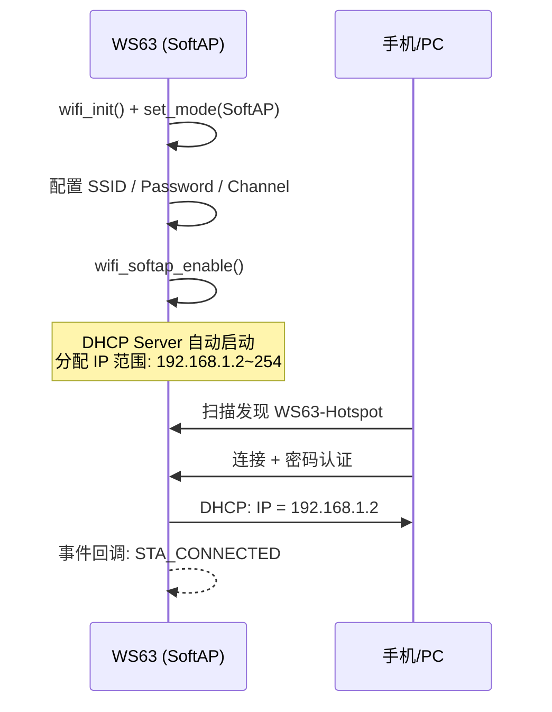

# SoftAP

> SoftAP 模式 — 创建热点 — WiFi SoftAP API

## 学习目标

- 理解 SoftAP 模式——WS63 创建热点，其他设备可连接
- 掌握 SoftAP 配置和启动流程
- 理解 DHCP (Dynamic Host Configuration Protocol) Server 自动分配 IP (Internet Protocol)
- 能够在 WS63 上创建 WiFi 热点

## 规格与功能

WS63 创建 WiFi 热点，手机/PC 连接后自动获取 IP 地址，串口打印连接的设备信息。

| 规格项 | 说明 |
|--------|------|
| SSID (Service Set Identifier) | `WS63-Hotspot`（可自定义） |
| 安全模式 | WPA2-PSK |
| 信道 | 6（自动选择） |
| 最大连接数 | 4 |
| DHCP Server | 内置，自动分配 IP（192.168.1.x） |

## 基本概念

### SoftAP 工作原理



### STA 和 SoftAP 共存

WS63 可同时作为 STA (Station) 和 SoftAP，但共享射频资源，必须在**同一信道**上。实际产品中通常只用一种模式。

## 涉及 API

| API | 用途 |
|-----|------|
| `wifi_init()` | WiFi 初始化 |
| `wifi_set_mode(WIFI_MODE_AP)` | 设置 SoftAP 模式 |
| `wifi_softap_set_config()` | 配置热点参数 |
| `wifi_softap_enable()` | 启动热点 |
| `wifi_softap_stop()` | 停止热点 |
| `wifi_register_event_cb()` | 注册事件回调 |

## 案例操作指导


编译烧录后用手机搜索 `WS63-Hotspot`，输入密码连接。串口打印：

```text
[WiFi AP] started, SSID: WS63-Hotspot
[WiFi AP] STA connected, MAC: AA:BB:CC:DD:EE:FF, count: 1
```

## 关键配置

| 参数 | 值 | 说明 |
|------|-----|------|
| SSID | `WS63-Hotspot` | 热点名称，最长 32 字节 |
| Password | `12345678` | WPA2-PSK，最少 8 位 |
| Channel | 6 | 2.4GHz 信道 1~13 |
| Max STA | 4 | WS63 最大并发连接数 |
| DHCP 网段 | 192.168.1.x | 自动分配 |

## 代码详解

### SoftAP 配置与启动

```c
void wifi_softap_enable(void)
{
    wifi_init();
    wifi_set_mode(WIFI_MODE_AP);
    wifi_register_event_cb(wifi_ap_event_cb);

    wifi_softap_config_t ap_config = {
        .ssid         = "WS63-Hotspot",
        .ssid_len     = 13,
        .password     = "12345678",
        .channel      = 6,
        .max_conn_num = 4,
        .security     = WIFI_SEC_WPA2_PSK,
    };
    wifi_softap_set_config(&ap_config);
    wifi_softap_enable();
}
```

### STA 连接/断开回调

```c
static void wifi_ap_event_cb(wifi_event_t event, void *data)
{
    switch (event) {
    case WIFI_EVENT_AP_STA_CONNECTED: {
        wifi_sta_info_t *sta = (wifi_sta_info_t *)data;
        printf("[WiFi AP] STA connected, MAC: %02X:%02X:...\n",
               sta->mac[0], sta->mac[1]);
        break;
    }
    case WIFI_EVENT_AP_STA_DISCONNECTED: {
        wifi_sta_info_t *sta = (wifi_sta_info_t *)data;
        printf("[WiFi AP] STA disconnected\n");
        break;
    }
    }
}
```

---

